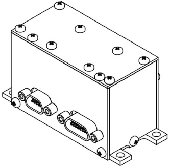

# SX-MAGWR
> 2019.05.12 [🚀](../index/index.md) [despace](index.md) → **[Магнитометр](sensor.md)**

[TOC]

---

**SX‑MAGWR** — [магнитометр](sensor.md) — прибор для определения ориентации КА путём измерения характеристик магнитного поля Земли.  
Разработчик [Спутникс](zz_sputnix.md). Разработано в <mark>TBD</mark> году …

|*Characteristics*|*[Value](si.md)  (SX‑MAG‑03,  3‑осевой  магнитометр)*|*[Value](si.md)  (SX‑WR‑01,  1‑осевой ДУС)*|*[Value](si.md)  (ДУС SX‑WR‑03,  3‑осевой)*|*[Value](si.md)  (SX‑MAGWR‑01,  3‑осевой ДУС и  3‑осевой  магнитометр)*|
|:--|:--|:--|:--|:--|
|Composition| |3‑x Магнитометр|1‑x ДУС|3‑x ДУС|3‑x ДУС  3‑x Магнитометр|
|Consumption, W|0.6|0.6|1.2|1.5|
|Dimensions, ㎜|34 × 38 × 25|34 × 38 × 25|34 × 38 × 66|34 × 38 × 66|
|[Interfaces](interface.md)|CAN2B или SpaceWire|CAN2B или SpaceWire|CAN2B или SpaceWire|CAN2B или SpaceWire|
|[Lifetime](lifetime.md)/Resource, h(y)|… / …|… / …|… / …|… / …|
|Mass, ㎏|0.06|0.06|0.09|0.1|
|[Overload](vibration.md), Grms| | | | |
|[Rad.resist](ion_rad.md), ㏉ (㎭)| | | | |
|[Reliability](qm.md) per [lifetime](lifetime.md)| | | | |
|[Thermal range](tcs.md), ℃|–40 ‑ +60 ℃|–40 ‑ +60 ℃|–40 ‑ +60 ℃|–40 ‑ +60 ℃|
|[TRL](trl.md)| | | | |
|[Voltage](voltage.md), V|5 и 12|5 и 12|5 и 12|5 и 12|
|**【Specific】**|• • •|• • •|• • •|• • •|
|Angular velocity: measurement resolution, °/s|—|0.0005|0.0005|0.0005|
|Angular velocity: measuring range, °/s|—|± 250|± 250|± 250|
|Angular velocity: number of measuring axes|—|1|3|3|
|Angular velocity: random deviation (noise), °/s|—|± 0.005|± 0.005|± 0.005|
|Mag. field: measurement discreteness, nT|6.67|—|—|6.67|
|Mag. field: measuring range, nT|± 200 000|—|—|± 200 000|
|Mag. field: random deviation (noise), nT| ± 100|—|—|± 100|
|Transmitted telemetry|<small>Проекции вектора магнитного поля, проекции вектора угловой скорости, температура каждого измерителя.</small>|<small>Проекции вектора магнитного поля, проекции вектора угловой скорости, температура каждого измерителя.</small>|<small>Проекции вектора магнитного поля, проекции вектора угловой скорости, температура каждого измерителя.</small>|<small>Проекции вектора магнитного поля, проекции вектора угловой скорости, температура каждого измерителя.</small>|

**Notes:**

   1. …
   1. **Applicability:**
      - …

 

## Docs & links (TRANSLATEME ALREADY)
|Navigation|
|:--|
|**[FAQ](faq.md)**【**[SCS](scs.md)**·КК, **[SC (OE+SGM)](sc.md)**·КА】**[CON](contact.md)·[Pers](person.md)**·Контакт, **[Ctrl](control.md)**·Упр., **[Doc](doc.md)**·Док., **[EF](ef.md)**·ВВФ, **[Error](error.md)**·Ошибки, **[Event](event.md)**·События, **[FS](fs.md)**·ТЭО, **[HF&E](hfe.md)**·Эрго., **[KT](kt.md)**·КТ, **[Model](model.md)**·Модель, **[N&B](nnb.md)**·БНО, **[Patent](патент.md)**·Пат., **[Project](project.md)**·Проект, **[QM](qm.md)**·БКНР, **[R&D](rnd.md)**·НИОКР, **[SI](si.md)**·СИ, **[Test](test.md)**·ЭО, **[TRL](trl.md)**·УГТ, **[Way](way.md)**·Пути|
|*Sections & pages*|
|**`Магнитометр:`**  …  • • •  **РФ:** [SX-MAGWR](sx_magwr.md) (100)|

   1. Docs:
      - [Чертёж и основные характеристики ❐](f/sensor/s/sx_magwr_sputnix_ru.pdf)
   1. Notable interwikies — …
   1. <…>
