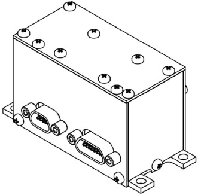

# SX-MAGWR
> 2019.05.12 ┊ **🚀 [despace](index.md)** → **[Магнитометр](mag.md)**

[TOC]

---

**SX‑MAGWR** — [магнитометр](mag.md) — прибор для определения ориентации КА путём измерения характеристик магнитного поля Земли.  
*Разработчик:* [Спутникс](zz_sputnix.md). Разработано в <mark>TBD</mark> году …

||
|:--|
|   |

<small>

|*Характеристика*|*[Значение](si.md) <small>SX‑MAG‑03  (3‑осевой магнитометр)</small>*|*[Значение](si.md) <small>SX‑WR‑01  (1‑осевой ДУС)</small>*|*[Значение](si.md) <small>ДУС SX‑WR‑03  (3‑осевой)</small>*|*[Значение](si.md) <small>SX‑MAGWR‑01  (3‑осевой ДУС и  3‑осевой магнитометр)</small>*|
|:--|:--|:--|:--|:--|
|Всего измерителей  |  |  3‑x Магнитометр  |  1‑x ДУС  |  3‑x ДУС  |  3‑x ДУС  3‑x Магнитометр  |
|Исполнение  |  |  |  |  |  |
|Магнитное поле: диапазон измерений, нТл  |  ± 200 000  |  —  |  —  |  ± 200 000  |
|Магнитное поле: дискретность измерений, нТл  |  6.67  |  —  |  —  |  6.67  |
|Магнитное поле: случайное отклонение (шум), нТл  |  ± 100  |  —  |  —  |  ± 100  |
|Передаваемая телеметрия  | <small>Проекции вектора магнитного поля, проекции вектора угловой скорости, температура каждого измерителя.</small>  | <small>Проекции вектора магнитного поля, проекции вектора угловой скорости, температура каждого измерителя.</small>  | <small>Проекции вектора магнитного поля, проекции вектора угловой скорости, температура каждого измерителя.</small>  | <small>Проекции вектора магнитного поля, проекции вектора угловой скорости, температура каждого измерителя.</small>  |
|Угл. скорость: диапазон измерения, °/c  |  —  |  ± 250  |  ± 250  |  ± 250  |
|Угл. скорость: дискретность измерений, °/c  |  —  |  0.0005  |  0.0005  |  0.0005  |
|Угл. скорость: кол‑во осей измерения  |  —  |  1  |  3  |  3  |
|Угл. скорость: случайное отклонение (шум), °/c  |  —  |  ± 0.005  |  ± 0.005  |  ± 0.005  |
|**Etc:**|• • •||||
|[ВБР](rams.md) за САС  |  |  |  |  |
|Габариты, Д×Ш×В, мм  |  34 × 38 × 25  |  34 × 38 × 25  |  34 × 38 × 66  |  34 × 38 × 66  |
|Интерфейсы  | CAN2B или SpaceWire  | CAN2B или SpaceWire  | CAN2B или SpaceWire  | CAN2B или SpaceWire  |
|Масса, кг  |  0.06  |  0.06  |  0.09  |  0.1  |
|[Напряжение](voltage.md), В  |  5 и 12  |  5 и 12  |  5 и 12  |  5 и 12  |
|Перегрузки, g  |  |  |  |  |
|[Радстойкость](ion_rad.md), Гр (рад)  |  |  |  |  |
|Ресурс, ч (лет)  |  |  |  |  |
|[Lifetime](lifetime.md), h (y)|  |  |  |  |
|[Тепловой режим](tcs.md)  |  от –40 до +60 °C  |  от –40 до +60 °C  |  от –40 до +60 °C  |  от –40 до +60 °C  |
|Эл. потребление, Вт  |  0.6  |  0.6  |  1.2  |  1.5  |

</small>

 

## Примечания
   1. …

## Применяемость
   1. …

 

## Docs & links (TRANSLATEME ALREADY)
|…°·•¹²³±×÷≤≥≈≠ ‑ −— ⎆✉ ❐“”’«»✔→✘☐☑├┕┆ 1 lb = 0.453592 kg; 1 g = 9.80665 m/s²|
|:--|
|<small>**[FAQ](faq.md)**, **[Cable](cable.md)**·БКС, **[Camera](camera.md)**·Камера, **[Comms](comms.md)**·Радиосв., **[Contact](contact.md)**·Контакт, **[Control](control.md)**·Управ., **[Doc](doc.md)**·Док., **[Doppler](doppler.md)**·ИСР, **[DS](ds.md)**·ЗУ, **[EB](eb.md)**·ХИТ, **[ECO](ecology.md)**·Экол., **[EF](ef.md)**·ВВФ, **[ElC](elc.md)**·ЭКБ, **[EMC](emc.md)**·ЭМС, **[Errors](error.md)**·Ошибки, **[Events](event.md)**·События, **[FS](fs.md)**·ТЭО, **[Fuel](fuel.md)**·Топливо, **[GNC](gnc.md)**·БКУ, **[GS](scs.md)**·НС, **[HF&E](hfe.md)**·Эргоном., **[IMU](imu.md)**·Гироскоп, **[Incubator](incubator.md)**·Инкуб., **[KT](kt.md)**·КТЕХ, **[LAG](lag.md)**·ПУC, **[LES](les.md)**·САСП, **[LS](ls.md)**·СЖО, **[LV](lv.md)**·РН, **[MAG](mag.md)**·Магнитом., **[MCC](mcc.md)**·ЦУП, **[Model](model.md)**·Модель, **[MSC](sc.md)**·ПКА, **[N&B](nnb.md)**·БНО, **[NR](nr.md)**·ЯР, **[OBC](obc.md)**·ЦВМ, **[OE](oe.md)**·БА, **[Patent](патент.md)**·Патент, **[Project](project.md)**·Проект, **[PS](ps.md)**·ДУ, **[QA](quality.md)**·QA, **[R&D](rnd.md)**·НИОКР, **[RAMS](rams.md)**·НиБ, **[Risk](risk.md)**·Риск, **[Robot](robotics.md)**·Робот, **[Rover](rover.md)**·Планетоход, **[RTG](rtg.md)**·РИТЭГ, **[RW](rw.md)**·ДМ, **[SARC](sarc.md)**·ПСК, **[Sensor](sensor.md)**·Датчик, **[SC](sc.md)**·КА, **[SCS](scs.md)**·КК, **[SGM](sgm.md)**·КММ, **[SI](si.md)**·СИ, **[Soft](soft.md)**·ПО, **[SP](sp.md)**·БС, **[Spaceport](spaceport.md)**·Космодром, **[SPS](sps.md)**·СЭС, **[SSS](sss.md)**·ГЗУ, **[TCS](tcs.md)**·СОТР, **[Test](test.md)**·ЭО, **[Timeline](timeline.md)**·Циклограмма, **[TMS](tms.md)**·ТМС, **[TOR](tor.md)**·ТЗ, **[TRL](trl.md)**·УГТ</small>|
|*Sections & pages*|
|**`Магнитометр:`**  …  • • •  **РФ:** [SX-MAGWR](sx_magwr.md) (100) |

**Docs:**

   1. 3D-модель <mark>TBD</mark>
   1. [Чертёж и основные характеристики ❐](f/mag/s/sx_magwr_sputnix_ru.pdf)

**Links:**

   1. Notable interwikies — …
   1. <…>
