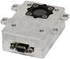

# SX-SUNR-01
> 2019.05.12 ┊ **🚀 [despace](index.md)** → **[СД](sensor.md)**

[TOC]

---

**SX‑SUNR‑01** — солнечный датчик, предназначенный для: 1) построения постоянной солнечной ориентации (ПСО) после отделения от [РБ](lv.md); 2) построения и поддержания ПСО, где при работе [научной аппаратуры](oe.md) ПСО используется в качестве рабочей ориентации; 3) построения и поддержания ПСО в нештатных ситуациях (НШС), когда парирование НШС в режиме инерциальной ориентации невозможно.  
*Разработчик:* [Спутникс](03_sputnix.md). Разработано  

||
|:--|
|   |

<small>

|*Characteristic*|*[Value](si.md)*|
|:--|:--|
|Диапазон °, ≥| 60±1°   |
|Исполнение| Моноблок  |
|Режим готовности|   |
|Точность| 1° (3σ)  |
|Частота обновл., Гц|   |
|**Etc:**|• • •|
|[ВБР](rams.md) за САС|   |
|Dimensions, L×W×H, mm| 50 × 46 × 17  |
|Интерфейсы| RS‑485  |
|Mass, kg| 0.04  |
|[Voltage](voltage.md), V| 5  |
|Overload, g|   |
|[Rad.resist](ion_rad.md), Gy (rad)|   |
|Resource, h (y)|   |
|[Тепловой режим](tcs.md), °C| от –40 до +60 °C  |
|[Lifetime](lifetime.md), h (y)|   |
|Consumption, W| 0.05  |

</small>

 

## Примечания
   1. …

## Применяемость
   1. …

 

## Docs & links (TRANSLATEME ALREADY)
|…°·•¹²³±×÷≤≥≈≠ ‑ −— ⎆✉ ❐“”’«»✔→✘☐☑├┕┆ 1 lb = 0.453592 kg; 1 g = 9.80665 m/s²|
|:--|
|<small>**[FAQ](faq.md)**, **[Cable](cable.md)**·БКС, **[Camera](camera.md)**·Камера, **[Comms](comms.md)**·Радиосв., **[Contact](contact.md)**·Контакт, **[Control](control.md)**·Управ., **[Doc](doc.md)**·Док., **[Doppler](doppler.md)**·ИСР, **[DS](ds.md)**·ЗУ, **[EB](eb.md)**·ХИТ, **[ECO](ecology.md)**·Экол., **[EF](ef.md)**·ВВФ, **[ElC](elc.md)**·ЭКБ, **[EMC](emc.md)**·ЭМС, **[Errors](error.md)**·Ошибки, **[Events](event.md)**·События, **[FS](fs.md)**·ТЭО, **[Fuel](fuel.md)**·Топливо, **[GNC](gnc.md)**·БКУ, **[GS](scs.md)**·НС, **[HF&E](hfe.md)**·Эргоном., **[IMU](imu.md)**·Гироскоп, **[Incubator](incubator.md)**·Инкуб., **[KT](kt.md)**·КТЕХ, **[LAG](lag.md)**·ПУC, **[LES](les.md)**·САСП, **[LS](ls.md)**·СЖО, **[LV](lv.md)**·РН, **[MAG](mag.md)**·Магнитом., **[MCC](mcc.md)**·ЦУП, **[Model](model.md)**·Модель, **[MSC](sc.md)**·ПКА, **[N&B](nnb.md)**·БНО, **[NR](nr.md)**·ЯР, **[OBC](obc.md)**·ЦВМ, **[OE](oe.md)**·БА, **[Patent](патент.md)**·Патент, **[Project](project.md)**·Проект, **[PS](ps.md)**·ДУ, **[QA](quality.md)**·QA, **[R&D](rnd.md)**·НИОКР, **[RAMS](rams.md)**·НиБ, **[Risk](risk.md)**·Риск, **[Robot](robotics.md)**·Робот, **[Rover](rover.md)**·Планетоход, **[RTG](rtg.md)**·РИТЭГ, **[RW](rw.md)**·ДМ, **[SARC](sarc.md)**·ПСК, **[Sensor](sensor.md)**·Датчик, **[SC](sc.md)**·КА, **[SCS](scs.md)**·КК, **[SGM](sgm.md)**·КММ, **[SI](si.md)**·СИ, **[Soft](soft.md)**·ПО, **[SP](sp.md)**·БС, **[Spaceport](spaceport.md)**·Космодром, **[SPS](sps.md)**·СЭС, **[SSS](sss.md)**·ГЗУ, **[TCS](tcs.md)**·СОТР, **[Test](test.md)**·ЭО, **[Timeline](timeline.md)**·Циклограмма, **[TMS](tms.md)**·ТМС, **[TOR](tor.md)**·ТЗ, **[TRL](trl.md)**·УГТ</small>|
|*Sections & pages*|
|**`Солнечный датчик (СД):`**  [ПЗр](fov.md)  • • •  (КА) **Европа:** [FSS](fss_jo.md) (650) ┊ [FSS](fss.md) (50 ‑ 375) ┊ [CSS](css.md) (275) ┊ [CoSS](coss.md) (15 ‑ 24)  ▮  **РФ:** [ТДС](tds.md) (2 300) ┊ [347К](347k.md) (700) ┊ [ОСД](osd.md) (650) ┊ [СДП-1](sdp_1.md) (400) ┊ [SX-SUNR-01](sx_sunr_01.md) (40)  *(Кубсаты) **США:** [MSS](mss_sm.md) (0.036) ┊ [CSS](css_sm.md) (0.02)*|

**Docs:**

   1. [3D‑модель ❐](f/sensor/s/sx-sunr-01_3d_step.7z)
   1. [Чертёж ❐](f/sensor/s/sx-sunr-01_sketch1.png)
   1. [ТО и руководство пользователя ❐](f/sensor/s/sx-sunr-01_datasheet_manual.djvu)

**Links:**

   1. Notable interwikies — …
   1. <…>
