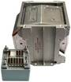

# СЗИ-М
> 2019.05.12 [🚀](../index/index.md) [despace](index.md) → **[ЗУ](ds.md)**

[TOC]

---

> <small>**СЗИ-М** — RU term w/o analogues in English. **SZI-M** — literal EN translation.</small>

**СЗИ‑М** ─ постоянное [запоминающее устройство](ds.md) (ПЗУ). Система сбора, регистрации и хранения информации от датчико‑преобразующей аппаратуры, информации БЦВМ, речевой информации. СЗИ‑М обеспечивает спасение информации при воздействии удара (скорость встречи с преградой 150 ㎧) и высокой температуры (+700 ℃ в течение 30 минут) («черный ящик»).  
*Разработчик:* [НПО ИТ](zz_npoit.md).  

<small>

|*•    Характеристика    •*|*[Значение](si.md) <small>(СЗИ-М)</small>*|
|:--|:--|
|[TRL](trl.md)|9|
|Алгоритмы сжатия| |
|Алгоритмы шифр.| |
|Входов|до 32 — регистрации температурной информации с опросом до 100 Гц;  до 256 — регистрации параметров с опросом от 25 до 2 000 Гц;  увеличение частоты опроса до 32 000 Гц при соответствующем сокращении количества опрашиваемых входов|
|Ёмкость, Мбит (Мбайт)|32 768 (4 096)|
|Исполнение|3 блока:  устройство преобразования УП‑М — 2 шт. (с возможностью расширения до 8);  устройство накопителя УН‑М в ударотеплозащищённом корпусе — 1 шт.|
|Скор., Мбит(Мбайт)/с|2 (0.25)|
|Циклов перезаписи|100 000|
|**Etc:**|• • •|
|[ВБР](srrq.md) за САС| |
|Габариты, Д×Ш×В, ㎜| |
|Интерфейсы|[МКО](mil_std_1553.md) (2 дублированных), 1 вход регистрации речевой аналоговой информации до 4 500 Гц|
|Mass, kg|1.65 — каждый УП‑М;  8.5 — УН‑М.  **Итого:** 11.8|
|[Voltage](voltage.md), V|… — для УП‑М;  +4.75 — для УН‑М|
|Overload, g| |
|[Rad.resist](ion_rad.md), Gy (rad)| |
|Resource, h (y)|105 120 (12)|
|[Lifetime](lifetime.md), h (y)| |
|[Temp. range](tcs.md), ℃| |
|Consumption, W|9 — каждый УП‑М;  0.85 — УН‑М.  **Итого:** 18.85|
| ||

</small>

 

## Примечания
   1. …

## Применяемость
   1. …

 

## Docs & links (TRANSLATEME ALREADY)
|Navigation|
|:--|
|**[FAQ](faq.md)**, **[Cable](cable.md)**·БКС, **[Camera](cam.md)**·Камера, **[Comms](comms.md)**·Радио, **[Contact](contact.md)**·Контакт, **[Control](control.md)**·Упр., **[Doc](doc.md)**·Док., **[Doppler](doppler.md)**·ИСР, **[DS](ds.md)**·ЗУ, **[EB](eb.md)**·ХИТ, **[ECO](ecology.md)**·Экол., **[EF](ef.md)**·ВВФ, **[ElC](elc.md)**·ЭКБ, **[EMC](emc.md)**·ЭМС, **[Error](error.md)**·Ошибки, **[Event](event.md)**·События, **[FS](fs.md)**·ТЭО, **[Fuel](fuel.md)**·Топливо, **[GNC](gnc.md)**·БКУ, **[GS](scs.md)**·НС, **[HF&E](hfe.md)**·Эрго., **[IU](iu.md)**·Гиро., **[KT](kt.md)**·КТЕХ, **[LAG](lag.md)**·ПУC, **[LES](les.md)**·САСП, **[LS](ls.md)**·СЖО, **[LV](lv.md)**·РН, **[MCC](mcc.md)**·ЦУП, **[Model](model.md)**·Модель, **[MSC](sc.md)**·ПКА, **[N&B](nnb.md)**·БНО, **[NR](nr.md)**·ЯР, **[OBC](obc.md)**·ЦВМ, **[OE](oe.md)**·БА, **[Pat.](патент.md)**·Патент, **[Proj.](project.md)**·Проект, **[PS](ps.md)**·ДУ, **[R&D](rnd.md)**·НИОКР, **[Robot](robotics.md)**·Робот, **[Rover](rover.md)**·Ровер, **[RTG](rtg.md)**·РИТЭГ, **[SARC](sarc.md)**·ПСК, **[SE](se.md)**·СЭ, **[Sens.](sensor.md)**·Датч., **[SC](sc.md)**·КА, **[SCS](scs.md)**·КК, **[SGM](sgm.md)**·КММ, **[SI](si.md)**·СИ, **[Soft](soft.md)**·ПО, **[SP](sp.md)**·БС, **[Spaceport](spaceport.md)**·Космодр., **[SPS](sps.md)**·СЭС, **[SRRQ](srrq.md)**·БКНР, **[SSS](sss.md)**·ГЗУ, **[TCS](tcs.md)**·СОТР, **[Test](test.md)**·ЭО, **[Timeline](timeline.md)**·ЦГМ, **[TMS](tms.md)**·ТМС, **[TOR](tor.md)**·ТЗ, **[TRL](trl.md)**·УГТ|
|*Sections & pages*|
|**`Запоминающее устройство (ЗУ):`**  [5D optical data storage](5dods.md)  • • •  **Европа:** [SSR](ssr.md) (8) ┊ [Sirius TCM](sirius_tcm.md) (0.14)  ▮  **РФ:** [СЗИ-М](szi_m.md) (11.8) ┊ [OBMU](sait_obmu.md) (1.8)|

   1. Docs:
      - [Чертёж ❐](f/ds/s/szi-m_sketch1.png)
   1. Notable interwikies — …
   1. <http://www.npoit.ru/products/telemetricheskie-sistemy/sistema-zapominaniya-informatsii-szi-m>
