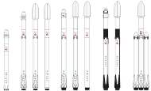

# РН, template

**…** — семейство израильских одноразовых твердотопливных ракет‑носителей лёгкого класса.

|*Version*|*Description*|*Activity*|
|:--|:--|:--|
|Falcon 9 v.1.0|Базовый вариант.|Экспл. завершена (2009 ‑ 2013)|
|╟ Falcon 9 Air|Модификация Falcon 9 v1.0.|Отменена (2012)|
|╟ Falcon 9 v.1.1|Модификация Falcon 9 v1.0.|*В разработке* (2013 ‑ …)|
|╙ Falcon 9 v.1.2 (FT)|Модификация v1.1.|**Активен** (2015 ‑ …)|

---

 

## Falcon 9
**…** — израильская одноразовая твердотопливная ракета‑носитель лёгкого класса.

|*Characteristic*|*[Value](si.md)*|
|:--|:--|
|Активность|**Активен** (… ‑ …)|
|[Аналоги](analogue.md)|[Ariane 5/6](arian.md) (Европа) ┊ [Ангара‑А5](angara.md) (РФ)|
|Длина/диаметр|… м / … м|
|[Космодромы](spaceport.md)|[…](….md) (…)|
|Масса старт./сух.|… ㎏ / … ㎏|
|Разраб./изготов.|[SpaceX](zz_spacex.md) (США) / [SpaceX](zz_spacex.md) (США)|
|Ступени|…|
|[Топливо](fuel.md)|[Кислород + Керосин](o_plus.md)|
|||

**Выводимые массы.**

|*Космодром*|*РН*|<small>*Масса,  [НОО](nnb.md), т*</small>|<small>*Масса,  [ГСО](nnb.md), т*</small>|<small>*Масса к  [Луне](moon.md), т*</small>|<small>*Масса к  [Венере](venus.md), т*</small>|<small>*Масса к  [Марсу](mars.md), т*</small>|*Примечания*|
|:--|:--|:--|:--|:--|:--|:--|:--|
|[…](….md)|…||||||Пуск — $ … млн (… г);  ПН … % от ст.массы|

<small>Примечания:  **1)** Указана масса для наихудших условий старта.  **2)** В скобках указана масса для наилучших условий старта.</small>

 

## Архивные

…
