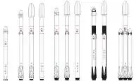

# Camera

**…** — оптическая камера, предназначенная для фото‑видеосъёмки.  
Разработчик: …. Разработано в <mark>TBD</mark> году …

|*Characteristics*|*[Value](si.md)  (…)*|
|:-|:-|
|Composition| 【TBD: single unit, wires, a number of units, pressurization level, etc.】 |
|Consumption, W| 【TBD: typical, basic timeline, etc.】 |
|Dimensions, ㎜| 【TBD: general dimensions】 |
|[Interfaces](interface.md)| 【TBD: connectors, mounting points】 |
|[Lifetime](lifetime.md)/Resource, h(y)| … / … 【TBD: lifetime for total lifetime, resource for active state】 |
|Mass, ㎏| 【TBD: mass of the unit(s) in space】 |
|[Overload](vibration.md), Grms| 【TBD: acceptable loads & their direction】 |
|[Rad.resist](ion_rad.md), ㏉ (㎭)| 【TBD: total ionising dose, heavy particles】 |
|[Reliability](qm.md) per [lifetime](lifetime.md)| 【TBD: a calculated/proven reliability】 |
|[Thermal range](tcs.md), ℃| 【TBD: for an active condition & for transportation】 |
|[TRL](trl.md)| 【TBD: current TRL】 |
|[Voltage](sps.md), V| 【TBD: nominal, acceptable range for a constant work & for a transition periods】 |
|**【Specific】**|• • •|
|Back. brightn., ㏅/m²| |
|[FOV](fov.md), °| |
|Frequency, frame/s| |
|Lens| |
|Resolution, px| |
|Shooting modes| |
| ||

**Notes:**

   1. …
   1. **Applicability:** …

 

# Comms

**…** — совокупность технических средств, предназначенная для осуществления радиосвязи. Включает в свой состав приёмо‑передающую аппаратуру и АФУ.  
Разработчик: …. Разработано в <mark>TBD</mark> году …

|*Characteristics*|*[Value](si.md)  (…)*|
|:-|:-|
|Composition| 【TBD: single unit, wires, a number of units, pressurization level, etc.】 |
|Consumption, W| 【TBD: typical, basic timeline, etc.】 |
|Dimensions, ㎜| 【TBD: general dimensions】 |
|[Interfaces](interface.md)| 【TBD: connectors, mounting points】 |
|[Lifetime](lifetime.md)/Resource, h(y)| 【TBD: lifetime for total lifetime, resource for active state】 |
|Mass, ㎏| 【TBD: mass of the unit(s) in space】 |
|[Overload](vibration.md), Grms| 【TBD: acceptable loads & their direction】 |
|[Rad.resist](ion_rad.md), ㏉ (㎭)| 【TBD: total ionising dose, heavy particles】 |
|[Reliability](qm.md) per [lifetime](lifetime.md)| 【TBD: a calculated/proven reliability】 |
|[Thermal range](tcs.md), ℃| 【TBD: for an active condition & for transportation】 |
|[TRL](trl.md)| 【TBD: current TRL】 |
|[Voltage](sps.md), V| 【TBD: nominal, acceptable range for a constant work & for a transition periods】 |
|**【Specific】**|• • •|
|[Bitrate](bitrate.md), bit/s| |
|Continuous work, h| |
|Distance, ㎞| |
|Frequency instability| |
|[Frequency range](comms.md), ㎐| |
|Modulation type| |
|Out. power, W| |
|Signal structure| |
| ||

**Notes:**

   1. …
   1. **Applicability:** …

 

# Data storage

**…** — постоянное запоминающее устройство (ПЗУ) на основе твердотельного накопителя для хранения цифровой информации.  
Разработчик: …. Разработано в <mark>TBD</mark> году …

|*Characteristics*|*[Value](si.md)  (…)*|
|:-|:-|
|Composition| 【TBD: single unit, wires, a number of units, pressurization level, etc.】 |
|Consumption, W| 【TBD: typical, basic timeline, etc.】 |
|Dimensions, ㎜| 【TBD: general dimensions】 |
|[Interfaces](interface.md)| 【TBD: connectors, mounting points】 |
|[Lifetime](lifetime.md)/Resource, h(y)| … / … 【TBD: lifetime for total lifetime, resource for active state】 |
|Mass, ㎏| 【TBD: mass of the unit(s) in space】 |
|[Overload](vibration.md), Grms| 【TBD: acceptable loads & their direction】 |
|[Rad.resist](ion_rad.md), ㏉ (㎭)| 【TBD: total ionising dose, heavy particles】 |
|[Reliability](qm.md) per [lifetime](lifetime.md)| 【TBD: a calculated/proven reliability】 |
|[Thermal range](tcs.md), ℃| 【TBD: for an active condition & for transportation】 |
|[TRL](trl.md)| 【TBD: current TRL】 |
|[Voltage](sps.md), V| 【TBD: nominal, acceptable range for a constant work & for a transition periods】 |
|**【Specific】**|• • •|
|Algorithms (compr.)| |
|Algorithms (encryp.)| |
|Bitrate, Mbit/s (㎆/s)| |
|Capacity, Mbit (㎆)| |
|Cycles of rewrite| |
|Inputs| |
| ||

**Notes:**

   1. …
   1. **Applicability:** …

 

# Engine
**…** — …‑component [engine](ps.md) by […](contact/….md). Designed in ….

|*Characteristics*|*[Value](si.md)  (…)*|
|:-|:-|
|Composition| |
|Consumption, W| |
|Dimensions, ㎜| |
|[Interfaces](interface.md)| |
|[Lifetime](lifetime.md)/Resource, h(y)|… / …|
|Mass, ㎏| |
|[Overload](vibration.md), Grms| |
|[Rad.resist](ion_rad.md), ㏉ (㎭)| |
|[Reliability](qm.md) per [lifetime](lifetime.md)| |
|[Thermal range](tcs.md), ℃| |
|[TRL](trl.md)| |
|[Voltage](sps.md), V| |
|**【Specific】**|• • •|
|[Fuel](ps.md)| |
|Fuel — combustion products| |
|Fuel — consumption, ㎏/s, ≤| |
|Fuel — mass ratio of components| |
|Fuel — resource, ㎏, ≥| |
|Mach number / [Adiabatic exponent](heat_cr.md)| |
|Press. — comb. chamber, ㎫ (㎏f/㎝²)| |
|Press. — engine entrance, ㎫ (㎏f/㎝²)| |
|Press. — nozzle cut, ㎫ (㎏f/㎝²)| |
|Temper. — comb. chamber, К (℃)| |
|Temper. — nozzle cut, К (℃)| |
|Thrust, N (㎏f)| |
|Thrust — [Isp](ps.md), N·s/㎏ (s), ≥| |
|Thrust — max duration of 1 thrust, s| |
|Thrust — max switching frequency, ㎐| |
|Thrust — [res.impulse](ing.md), N·s (㎏f·s), ≤| |
|Thrust — torch angle, °| |
|Thrust — total impulse, N·s (㎏f·s), ≥| |
|Thrust — total pulses, ≥| |
|Thrust — total thrust, N (㎏f), ≥| |
|Thrust — total thrust duration, s, ≥| |
|[Turbopump](turbopump.md) speed, rpm| |
| ||

**Notes:**

   1. …
   1. Specs’re for nominal vacuum continuous thrust starting from the …nd second after energizing the solenoid valves.
   1. **Applicability:** …

 

# Event

> 2019.05.23 [🚀](../index/index.md) [despace](index.md) → **[Events](event.md)**

[TOC]

---

|**| |
|:-|:-|
|Date| |
|Venue| |
|Host Org.| |
|Co‑host Org.| |
|Supported by| |
|Accepted by| |
|Content| |
|Focus| |
|Reg. Fee| |
|Attendees| |
|Related Mtg.| |
|Contact| |

**Science Organizing committee:**

   - …

**Local Organizing committee:**

   - …

**Secretariat:**

   - …

## Описание

 

## Итоги

**Таблица.** Количество участников, докладов и постеров. (упорядочено по убыванию)

|*Страна*|*Участники*|*Презентации*|*Постеры*|
|:-|:-|:-|:-|
|США|… <small>(… [NASA](contact/nasa.md)/JPL, … университеты)</small>|…|…|
|Япония|… <small>(… JAXA, … университеты)</small>|…|…|
|Европа|…|…|…|
|Россия|… <small>(… НПОЛ, … университеты)</small>|…|…|
|**Итого**|**…**|**…**|**…**|

 

**Таблица.** Презентации, постеры и прочие участники.  
<small>(Толстым выделены новые интересные личности)</small>

|°|*Имя*|*Орг.*|*Название*|
|:-|:-|:-|:-|
|—|**<small>`Презентации`</small>**|—|—|
|<small>****</small>|<small></small>|<small></small>|<small></small>|

 

# Launch vehicle

**…** — семейство израильских одноразовых твердотопливных ракет‑носителей лёгкого класса.

|*Version*|*Description*|*Activity*|
|:-|:-|:-|
|Falcon 9 v.1.0|Базовый вариант.|Экспл. завершена (2009 ‑ 2013)|
|╟ Falcon 9 Air|Модификация Falcon 9 v1.0.|Отменена (2012)|
|╟ Falcon 9 v.1.1|Модификация Falcon 9 v1.0.|*В разработке* (2013 ‑ …)|
|╙ Falcon 9 v.1.2 (FT)|Модификация v1.1.|**Активен** (2015 ‑ …)|

---

 

## Falcon 9
**…** — израильская одноразовая твердотопливная ракета‑носитель лёгкого класса.

|*Characteristic*|*[Value](si.md)*|
|:-|:-|
|Активность|**Активен** (… ‑ …)|
|[Аналоги](analogue.md)|[Ariane 5/6](arian.md) (Европа)・ [Ангара‑А5](angara.md) (РФ)|
|Длина/диаметр|… м / … м|
|[Космодромы](spaceport.md)|[…](….md) (…)|
|Масса старт./сух.|… ㎏ / … ㎏|
|Разраб./изготов.|[SpaceX](contact/spacex.md) (США) / [SpaceX](contact/spacex.md) (США)|
|Ступени|…|
|[Fuel](ps.md)|[O + Kerosene](o_plus.md)|
| ||

**Выводимые массы.**

|*Космодром*|*РН*|<small>*Масса,  [НОО](nnb.md), т*</small>|<small>*Масса,  [ГСО](nnb.md), т*</small>|<small>*Масса к  [Луне](moon.md), т*</small>|<small>*Масса к  [Венере](venus.md), т*</small>|<small>*Масса к  [Марсу](mars.md), т*</small>|*Примечания*|
|:-|:-|:-|:-|:-|:-|:-|:-|
|[…](….md)|…| | | | | |Пуск — $ … млн (… г);  ПН … % от ст.массы|

<small>Примечания:  **1)** Указана масса для наихудших условий старта.  **2)** В скобках указана масса для наилучших условий старта.</small>

 

## Архивные

…

 

# Meeting's minutes

~~~
**MINUTES FROM THE MEETING**

**TBD** <!--A brief name of a meeting-->  
TBD, TBD <!--YYYY.MM.DD, A place of meeting-->

**Participants:**

   - From Company 1 — Name (title), …
   - From Company 2 — …

TBD <!--A short description, reasons for meeting, goals.-->

**PROCESS OF THE MEETING.**

TBD <!--Important notes, talks, presentations, etc.-->

・・・

**DECISIONS AND FUTURE PLANS.**

   1. TBD <!--IT'S IMPORTANT to be filled and sent to every participant ASAP, ideally during the last minutes of the meeting. Here shall be written major decisions, future steps, persons in charge, dates, new meeting date.-->

~~~

 

# Planet

> <small>**Русский** — русскоязычный термин. **Английский** — англоязычный эквивалент.</small>

<mark>TBD</mark>

 

## Характеристики
|*Characteristic*|*[Value](si.md)*|
|:-|:-|
|Flight from Earth|… ‑ … мес на ЖРДУ (… ‑ … суток)|
|Signal from Earth|… ‑ … минут|
|Distance from Earth|… ‑ … млн ㎞|
|Breaking to the orbit|не более … ‑ … минут|
|**【Orbits】**|• • •|
|[Apocentre](apopericentre.md) (Афелий);  [Pericentre](apopericentre.md) (Перигелий)|… ㎞ (… а.е.);  … ㎞ (… [а.е.](si.md))|
|[Argument of periapsis](keplerian.md) (ω)|…|
|[Semimajor axis](keplerian.md) (a)|… ㎞ (… а.е.)|
|Orbital velocity (Ⅴ)|… ㎞/s|
|Day/year|… / … земных|
|[Longit. of  asc.node](keplerian.md) (Ω)|…|
|[Inclination](keplerian.md) (Ⅰ)|…° (от солнечного экватора);  …° (от эклиптики);  …° (от инвариантной плоскости)|
|[Sider. rotat.period](astroperiod.md) (T, day)|… дня|
|[Sidereal period](astroperiod.md) (year)|… дней (… d … h … min … s)|
|[Synodic period](astroperiod.md)|… дней (… d … h … min … s)|
|Satellites|…|
|[Hill sphere](hill_sphere.md)|… ㎞|
|Satellite of|…|
|[Eccentricity](keplerian.md) (e)|…|
|**【Physics】**|• • •|
|[1st escape velocity](esc_vel.md) (v₁)|… ㎞/s <small>(… земной)</small>|
|[2nd escape velocity](esc_vel.md) (v₂)|… ㎞/s <small>(… земной)</small>|
|[Albedo](albedo.md)|… (геометрическое);  … (Бонда)|
|[Apparent magnitude](app_mag.md) (m)|…|
|[Magnetic field](mag_field.md)|… ‑ … А/м <small>(… ‑ … земного)</small>|
|Mass (m)|… ㎏ <small>(… земной)</small>|
|Axial tilt|…°|
|Volume (Ⅴ)|… ㎞³ <small>(… земного)</small>|
|Mean density (ρ)|… g/㎝³ (средняя, <small>… земной</small>)|
|Surface area (S)|… ㎞² <small>(… земной)</small>|
|Flattening|…|
|Radius|… ㎞ (средний, <small>… земного</small>)|
|[Surface gravity](g.md)|… ㎧² <small>(… земного)</small>|
|Equatorial rotation velocity|… ㎞/h <small>(… земной)</small>|
|**【Temperature & atmo.】**|• • •|
|[Atmosphere](atmosphere.md)|**Pressure** … ㎫ (… ㍴).  **Плотность** … ㎏/m³.  **Ветер:**  … ‑ … ㎧ (поверхность).  **Состав:**  ….|
|[Освещённость](illum.md)| |
|Радиация| |
|Температура| |

---

 

## Общее описание

---

 

## Особенности проектирования
   - Окна старта открываются примерно каждые … месяцев.

**Литература:**

   1. …

**Орбитальный КА:**

   1. …

**Посадочный КА:**

   1. …

---

 

## Освоение …
**СООБЩЕСТВА:**

…

### Зачем исследовать
<mark>TBD</mark>

### Проекты
См. также раздел «[Проекты](project.md)».

**Гипотетические и исторические:**

   - …

**Таблица.** КА прошлого и будущего.  
<small>*(Ⓛ — НПО Лавочкина; Д — Дистанционные исследования; К — Контактные исследования; Г — Возврат грунта; Т — Демонстрация технологии; Л — Высадка людей; П — Пролёт.)*</small>

<small>

|Ⓛ|*✔*|*Космич.аппарат (инд.)*|*Дата (UTC)*|*Д*|*К*|*Г*|*Т*|*Л*|*П*|*Примечания*|
|:-|:-|:-|:-|:-|:-|:-|:-|:-|:-|:-|
|`—`|—|**Proposed:**|—|—|—|—|—|—|—|—|
| |…|…|…| | | | | | |<mark>TBD</mark>|
|`—`|—|**Developing:**|—|—|—|—|—|—|—|—|
| |…|…|…| | | | | | |<mark>TBD</mark>|
|`—`|—|**Active:**|—|—|—|—|—|—|—|—|
| |…|…|…| | | | | | |<mark>TBD</mark>|
|`—`|—|**Past:**|—|—|—|—|—|—|—|—|
| |…|…|…| | | | | | |<mark>TBD</mark>|

</small>

 

### Хронология и перспективы
<mark>TBD</mark>

Данный раздел должен содержать анализ:

   - Что, как и почему делали КА прошлого и ныне летающие.
   - Что, как и почему планируют делать КА будущего.
   - Мировые тенденции изучения Венеры (технические и научные задачи).
   - Концепты КА для изучения Венеры.
   - Предложения группы НПОЛ по программе изучения Венеры.

 

## Научные и технические задачи
Targets & explorations for …. (Comments: **T** — technical; **Draft** — minimum for work with object)  
[Задачи и исследования](project.md) для …. (Примечания: **Т** — техническая задача; **Черновая версия** — минимально доступная для работы с предметом)

<small>

|*…‑XXX*|*T*|*RU*|*EN*|
|:-|:-|:-|:-|
| | |**`Не проводилось`**|**`Never occurred`**|
|[…‑001](….md)| |Атмосфера: модель, черновая.|Atmosphere: preliminary model.|
|[…‑007](….md)| |Наклон оси.|Spin axis.|
|[…‑002](….md)| |Поверхность: карта, черновая.|Surface: preliminary map.|
|[…‑003](….md)|T|Исследование: изнутри атмосферы.|Exploration: from inside of atmosphere.|
|[…‑004](….md)|T|Исследование: с Земли.|Exploration: from Earth.|
|[…‑005](….md)|T|Исследование: с ОИСВ.|Exploration: from venusian orbit.|
|[…‑006](….md)|T|Исследование: с поверхности.|Exploration: from surface.|
|• • •|•|• • •|• • •|
| | |**`Завершено частично`**|**`Was tried`**|
|…| |…|…|
|• • •|•|• • •|• • •|
| | |**`В целом завершено`**|**`Mostly done`**|
|…| |…|…|

</small>

 

# Process

| |*<!--Process number-->*|
|:-|:-|
|**Inputs**|… <!--Inputs from outer matters needed to start/continue the current process.-->|
|**Outputs**|… <!--Outputs that are produced by the current process-->|
|**Purpose/Goals**|… <!--The target you would like to achieve, & goals that can mark the target is achieved.-->|
|**Workflow**|【TBD: predecessor(s)】 → … → 【TBD: successor(s)】;  ・【TBD: sub-process(es)】|

Supposed numbering. Keeping in mind KISS method try to keep the length of each number as short as possible. Also try to unify numbers of documents, projects & processes, e.g. \<Project_abbreviation\>-\<number\> (EXPL-0123ax7f).

| |*0123456789*|*0123456789abcdef*|*0123456789abcdefghikmpqstuvxyz*|
|:-|:-|:-|:-|
|**1**| **10** | **16** (×1.6) | **30** (×3) |
|2| 100 | 256 (×2.5) | 900 (×9) |
|3| 1 000 | 4 096 (×4) | 27 000 (×27) |
|4| 10 000 | 65 536 (×6.5) | 810 000 (×81) |
|5| 100 000 | 1 048 576 (×10.4) | 24 300 000 (×243) |
|6| 1 000 000 | 16 777 216 (×16.7) | 729 000 000 (×729) |
|7| 10 000 000 | 268 436 456 (×26.8) | 21 870 000 000 (×2 187) |
|8| 100 000 000 | 4 294 967 296 (×42.9) | 656 100 000 000 (×6 561) |

 

# Project

 

|*Параметр*|*[Value](si.md)*|
|:-|:-|
| |**`Миссия`**|
|Длительность|…|
|Оператор|…|
|Программа|…|
|Разработка|…|
|Старт|…|
|Схожие  миссии|・Предлагаемые: ….  ・Разрабатываемые: ….  ・Разработанные: ….|
|[Тип](sc.md)|…|
|Цель|…|
|Цена|₽ ┊ или … ㎏ [золота](sc_price.md) в ценах … г|
| |**`Космический аппарат`**|
|Подрядчик|…|
|Разработчик|…|
|Состав|…|
| |**`…`**|
|Масса|… ([…спутник](sc.md))|
|[Номер](spaceid.md)|NSSDC ID (COSPAR ID): <mark>TBD</mark>, SCN: <mark>TBD</mark>|
|Орбита / Место|…|
|ПН|…|
|Связь|…|
|Эл.мощность|…|

Задачи и исследования:

<small>

|*EVN‑XXX*|*T*|*EN*|*RU*|
|:-|:-|:-|:-|
|…| |…|…|

</small>

или

|*Type*|*[Value](si.md)*|
|:-|:-|
|**【Mission】**|• • •|
|Cost|… or … ㎏ of [gold](sc_price.md) in … prices|
|[CML](cml.md) / [TRL](trl.md)|CML: <mark>TBD</mark>, TRL: <mark>TBD</mark>|
|Development|… ‑ …|
|Duration|…|
|Launch|…, …, …|
|Operator|…|
|Programme|…|
|Similar to|・Proposed: …  ・Current: …  ・Past: …|
|Target|…|
|[Type](sc.md)|…|
|**【Spacecraft】**|• • •|
|Composition|…|
|Contractor|…|
|Manufacturer|…|
| |**`…`**|
|Comms|…|
|[ID](spaceid.md)|NSSDC ID (COSPAR ID): <mark>TBD</mark>, SCN: <mark>TBD</mark>|
|Mass|… ([…satellite](sc.md))|
|Orbit / Site|…|
|Power|…|
|Payload|…|

Achieved targets & investigations:

<small>

|*EVN‑XXX*|*T*|*EN*|*RU*|
|:-|:-|:-|:-|
|…| |…|…|

</small>

 

## Миссия
## Mission
<mark>TBD</mark>

 

## Задачи и ПН
## Science goals & payload
<mark>TBD</mark>

 

## Космический аппарат
## Spacecraft
<mark>TBD</mark>

 

## Сообщество, ссылки, люди
## Community, library, links

**ЛЮДИ:**
**PEOPLE:**

   1. <mark>TBD</mark>

**СООБЩЕСТВА:**
**COMMUNITY:**

<mark>TBD</mark>

 

# Reaction wheel

**…** — инерциальное устройство ([двигатель‑маховик](iu.md)), предназначенное для использования в качестве исполнительного органа системы ориентации и стабилизации [космического аппарата](sc.md).  
Разработчик: …. Разработано в <mark>TBD</mark> году …

|*Characteristics*|*[Value](si.md)  (…)*|
|:-|:-|
|Composition| 【TBD: single unit, wires, a number of units, pressurization level, etc.】 |
|Consumption, W| 【TBD: typical, basic timeline, etc.】 |
|Dimensions, ㎜| 【TBD: general dimensions】 |
|[Interfaces](interface.md)| 【TBD: connectors, mounting points】 |
|[Lifetime](lifetime.md)/Resource, h(y)| … / … 【TBD: lifetime for total lifetime, resource for active state】 |
|Mass, ㎏| 【TBD: mass of the unit(s) in space】 |
|[Overload](vibration.md), Grms| 【TBD: acceptable loads & their direction】 |
|[Rad.resist](ion_rad.md), ㏉ (㎭)| 【TBD: total ionising dose, heavy particles】 |
|[Reliability](qm.md) per [lifetime](lifetime.md)| 【TBD: a calculated/proven reliability】 |
|[Thermal range](tcs.md), ℃| 【TBD: for an active condition & for transportation】 |
|[TRL](trl.md)| 【TBD: current TRL】 |
|[Voltage](sps.md), V| 【TBD: nominal, acceptable range for a constant work & for a transition periods】 |
|**【Specific】**|• • •|
|Kinetic moment, N·m·s| |
|Max ctrl moment, N·m| |
|Ready mode| |
| ||

**Notes:**

   1. …
   1. **Applicability:** …

 

# Star tracker

**…** — звёздный датчик для определения и выдачи в [БКУ](gnc.md) информации о положении и угловых скоростях системы координат (СК) изделия относительно геоцентрической СК.  
Разработчик: …. Разработано в <mark>TBD</mark> году …

|*Characteristics*|*[Value](si.md)  (…)*|
|:-|:-|
|Composition| 【TBD: single unit, wires, a number of units, pressurization level, etc.】 |
|Consumption, W| 【TBD: typical, basic timeline, etc.】 |
|Dimensions, ㎜| 【TBD: general dimensions】 |
|[Interfaces](interface.md)| 【TBD: connectors, mounting points】 |
|[Lifetime](lifetime.md)/Resource, h(y)| … / … 【TBD: lifetime for total lifetime, resource for active state】 |
|Mass, ㎏| 【TBD: mass of the unit(s) in space】 |
|[Overload](vibration.md), Grms| 【TBD: acceptable loads & their direction】 |
|[Rad.resist](ion_rad.md), ㏉ (㎭)| 【TBD: total ionising dose, heavy particles】 |
|[Reliability](qm.md) per [lifetime](lifetime.md)| 【TBD: a calculated/proven reliability】 |
|[Thermal range](tcs.md), ℃| 【TBD: for an active condition & for transportation】 |
|[TRL](trl.md)| 【TBD: current TRL】 |
|[Voltage](sps.md), V| 【TBD: nominal, acceptable range for a constant work & for a transition periods】 |
|**【Specific】**|• • •|
|Accept. ang. speed, °/s| |
|Accuracy| |
|Back. brightn., ㏅/m²| |
|Delay, s, ≤| |
|[FOV](fov.md), °| |
|Identification time, s| |
|Lens| |
|Output data| |
|Ready mode| |
|Refresh rate, ㎐| |
| ||

**Notes:**

   1. …
   1. **Applicability:** …

 

# Sun sensor
**…** — солнечный датчик, предназначенный для: 1) построения постоянной солнечной ориентации (ПСО) после отделения от [РБ](lv.md); 2) построения и поддержания ПСО, где при работе [научной аппаратуры](sc.md) ПСО используется в качестве рабочей ориентации; 3) построения и поддержания ПСО в нештатных ситуациях (НШС), когда парирование НШС в режиме инерциальной ориентации невозможно.  
Разработчик: …. Разработано в <mark>TBD</mark> году …

|*Characteristics*|*[Value](si.md)  (…)*|
|:-|:-|
|Composition| 【TBD: single unit, wires, a number of units, pressurization level, etc.】 |
|Consumption, W| 【TBD: typical, basic timeline, etc.】 |
|Dimensions, ㎜| 【TBD: general dimensions】 |
|[Interfaces](interface.md)| 【TBD: connectors, mounting points】 |
|[Lifetime](lifetime.md)/Resource, h(y)| … / … 【TBD: lifetime for total lifetime, resource for active state】 |
|Mass, ㎏| 【TBD: mass of the unit(s) in space】 |
|[Overload](vibration.md), Grms| 【TBD: acceptable loads & their direction】 |
|[Rad.resist](ion_rad.md), ㏉ (㎭)| 【TBD: total ionising dose, heavy particles】 |
|[Reliability](qm.md) per [lifetime](lifetime.md)| 【TBD: a calculated/proven reliability】 |
|[Thermal range](tcs.md), ℃| 【TBD: for an active condition & for transportation】 |
|[TRL](trl.md)| 【TBD: current TRL】 |
|[Voltage](sps.md), V| 【TBD: nominal, acceptable range for a constant work & for a transition periods】 |
|**【Specific】**|• • •|
|Accuracy| |
|Range °, ≥| |
|Ready mode| |
|Refresh rate, ㎐| |
| ||

**Notes:**

   1. …
   1. **Applicability:** …
