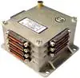
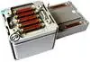
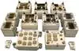

# TMS (a list)
> 2019.07.31 [🚀](../index/index.md) [despace](index.md) → [Sensor](sensor.md)

**Table of contents:**

[TOC]

---

A list of [Telemetry systems](tms.md).

## Current

 

### Astra (RU)
**Universal small‑sized radio telemetry system (USZRTS) “Astra”** *(ru. Универсальная малогабаритная радиотелеметрическая система (УМРТС) «Астра»)* — a [telemetry system](tms.md) (TMS) by [NPO IT](contact/npoit.md) — a set of devices that collect signals from the primary conversion, generate telemetry signals, transmit them through the communication channel, registration & display of telemetry messages on the receiving side.

|*Characteristics*|*[Value](si.md)  (Astra)*|
|:-|:-|
|Composition|Single unit of [slices](слайс.md)|
|Consumption, W| |
|Dimensions, ㎜| |
|[Interfaces](interface.md)|[RS‑485](rs_xxx.md)|
|[Lifetime](lifetime.md)/Resource, h(y)| |
|Mass, ㎏| |
|[Overload](vibration.md), Grms| |
|[Rad.resist](ion_rad.md), ㏉ (㎭)| |
|[Reliability](qm.md) per [lifetime](lifetime.md)| |
|[Thermal range](tcs.md), ℃| |
|[TRL](trl.md)| |
|[Voltage](sps.md), V| |
|**【Specific】**|• • •|
|Bitrate, kbps|… — write; … — read|
|Memory volume, ㎅| |
|Number of data inputs|—|
|・analog generators of ㎶ range (thermopairs) & parametric (resist. thermometers)| |
|・analog generators with positive polarity| |
|・analog parametrics (potentiometers)| |
|・arrays of digital information| |
|・digital pressure sensors| |
|・digital temperature sensors| |
|・signal| |
|Number of one‑time instructions| |
| ||

**Notes:**

   1. [Sketch ❐](f/tms/a/astra_sketch1.webp)
   1. <http://www.npoit.ru/products/telemetricheskie-sistemy/universalnaya-malogabaritnaya-radiotelemetricheskaya-sistema-umrts-astra>
   1. **Applicability:** …

 

### Onyx (RU)
**Small‑sized on‑board radio‑telemetry system “Onyx”** *(ru. Малогабаритная бортовая радиотелеметрическая система «Оникс»)* — a [telemetry system](tms.md) (TMS) by [NPO IT](contact/npoit.md) — a set of devices that collect signals from the primary conversion, generate telemetry signals, transmit them through the communication channel, registration & display of telemetry messages on the receiving side.

|*Characteristics*|*[Value](si.md)  (Onyx)*|
|:-|:-|
|Composition|2 units (Monounit of telemetry frame formation (MTFF); Temperature measurement unit (TMU) |
|Consumption, W|11.6|
|Dimensions, ㎜|91 × 91 × 29 TMU; 90 × 89 × 84 MTFF|
|[Interfaces](interface.md)|RS‑422; [МКО](mil_std_1553.md)|
|[Lifetime](lifetime.md)/Resource, h(y)| |
|Mass, ㎏|1.1 (0.35 TMU, 0.75 MTFF)|
|[Overload](vibration.md), Grms| |
|[Rad.resist](ion_rad.md), ㏉ (㎭)| |
|[Reliability](qm.md) per [lifetime](lifetime.md)| |
|[Thermal range](tcs.md), ℃| |
|[TRL](trl.md)| |
|[Voltage](sps.md), V|27 (23 ‑ 34)|
|**【Specific】**|• • •|
|Bitrate, kbps|… — write; … — read|
|Memory volume, ㎅| |
|Number of data inputs|—|
|・analog generators of ㎶ range (thermopairs) & parametric (resist. thermometers)| |
|・analog generators with positive polarity| |
|・analog parametrics (potentiometers)|32|
|・arrays of digital information| |
|・digital pressure sensors| |
|・digital temperature sensors|8|
|・signal|32|
|Number of one‑time instructions| |
| ||

**Notes:**

   1. [A sketch ❐](f/tms/o/oniks_sketch1.webp)
   1. <http://www.npoit.ru/products/telemetricheskie-sistemy/malogabaritnaya-bortovaya-radiotelemetricheskaya-sistema-oniks> — [archived ❐](f/tms/o/oniks_npoit_ru.djvu) 2018.03.27
   1. **Applicability:** …

 

### Pirit (RU)
**Onboard information & computing system “Pirit”** *(ru. Бортовая информационно‑вычислительная система «Пирит»)*  — a [telemetry system](tms.md) (TMS) by [NPO IT](contact/npoit.md) — a set of devices that collect signals from the primary conversion, generate telemetry signals, transmit them through the communication channel, registration & display of telemetry messages on the receiving side.

|*Characteristics*|*[Value](si.md)  (PM)*|*[Value](si.md)  (LS)*|
|:-|:-|:-|
|Composition|Multiple units depending on targets (programmable module (PM); local switch (LS))|Multiple units depending on targets (programmable module (PM); local switch (LS))|
|Consumption, W|2.7 ‑ 6.8|1.2 ‑ 3.3|
|Dimensions, ㎜| | |
|[Interfaces](interface.md)|[MIL-STD-1553](mil_std_1553.md); [RS-232](rs_xxx.md); BS-4421|[MIL-STD-1553](mil_std_1553.md); [RS-232](rs_xxx.md); BS-4421|
|[Lifetime](lifetime.md)/Resource, h(y)|… / 25 000 (2.8) |… / 25 000 (2.8)|
|Mass, ㎏|1.5 ‑ 1.7|0.8 ‑ 0.9|
|[Overload](vibration.md), Grms| | |
|[Rad.resist](ion_rad.md), ㏉ (㎭)| | |
|[Reliability](qm.md) per [lifetime](lifetime.md)| | |
|[Thermal range](tcs.md), ℃|–50 ‑ +50|–50 ‑ +50|
|[TRL](trl.md)| | |
|[Voltage](sps.md), V|27 (23 ‑ 34)|27 (23 ‑ 34)|
|**【Specific】**|• • •|• • •|
|Bitrate, kbps|1 024 — write; 1 024 — read|1 024 — write; 1 024 — read|
|Memory volume, ㎅|86 016 (84 ㎆)|86 016 (84 ㎆)|
|Number of data inputs|—|—|
|・analog generators of ㎶ range (thermopairs) & parametric (resist. thermometers)| | |
|・analog generators with positive polarity| | |
|・analog parametrics (potentiometers)|64| |
|・arrays of digital information| | |
|・digital pressure sensors| | |
|・digital temperature sensors|16| |
|・signal| |128|
|Number of one‑time instructions| | |
| ||

**Notes:**

   1. <http://www.npoit.ru/products/telemetricheskie-sistemy/malogabaritnaya-bortovaya-radiotelemetricheskaya-sistema-oniks> — [archived ❐](f/tms/p/pirit_npoit_ru.djvu.pdf) 2018.03.27
   1. **Applicability:** …

 

## Archive

 

## Docs & links
|Navigation|
|:-|
|**[FAQ](faq.md)**【**[SCS](scs.md)**·КК, **[SC (OE+SGM)](sc.md)**·КА】**[CON](contact.md)·[Pers](person.md)**·Контакт, **[Ctrl](control.md)**·Упр., **[Doc](doc.md)**·Док., **[Drawing](drawing.md)**·Чертёж, **[EF](ef.md)**·ВВФ, **[Error](error.md)**·Ошибки, **[Event](event.md)**·Событ., **[FS](fs.md)**·ТЭО, **[HF&E](hfe.md)**·Эрго., **[KT](kt.md)**·КТ, **[N&B](nnb.md)**·БНО, **[Project](project.md)**·Проект, **[QM](qm.md)**·БКНР, **[R&D](rnd.md)**·НИОКР, **[SI](si.md)**·СИ, **[Test](test.md)**·ЭО, **[TRL](trl.md)**·УГТ|
|*Sections & pages*|
|**【[Telemetry system (TMS)](tms.md)】**  …  • • •  **RU:** [TMS-L](tms_l.md) (8.5)・ [TMS-UF](tms_uf.md) (7.25)・ [TMS-RG](tms_rg.md) (5)・ [Pirit](tms_lst.md) (2.6)・ [Onyx](tms_lst.md) (1.1)・ [Astra](tms_lst.md) ()|

   1. Docs: …
   1. …

