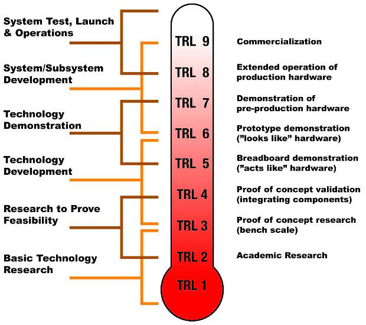
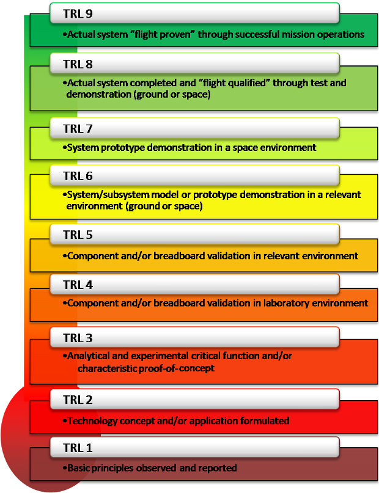

# TRL
> 2019.04.27 [🚀](../index/index.md) [despace](index.md) → **[OE](sc.md)**, [Качество](qm.md), [Риск](qm.md), [Control](control.md), [SE](se.md)

[TOC]

---

> <small>**Technology readiness levels (TRL, TRLs)** — EN term. **Уровень готовности технологии (УГТ)** — RU analogue.</small>

**Technology readiness levels** *(TRL, TRLs)* are measures used to assess the maturity of evolving technologies (materials, components, software, processes, etc.) during their development & maybe during early operations. Actually, when a new technology is first invented or conceptualized, it’s not suitable for immediate application. Instead, new technologies are usually subjected to experimentation, refinement, & increasingly realistic testing. Once the technology is sufficiently proven, it can be incorporated into a system.

Was created in NASA in the 1970s as a list of 7 points. Was extended in the late 1980s to the 8 & 9 points by [John Mankins](person.md).

 

## Definitions

### ESA TRL chart

   - Instruments & spacecraft systems are classified according to a TRL on a scale of 1 to 9.
   - Levels 1 ‑ 4 — creative & innovative technologies before/during the mission assessment [phase](rnd.md).
   - Levels 5 ‑ 9 — existing technologies & missions in the definition phase.

|*Lvl*|*Description*|
|:--|:--|
|**TRL 1**|Basic principles observed & reported|
|**TRL 2**|Technology concept and/or application formulated|
|**TRL 3**|Analytical & experimental critical function and/or characteristic proof‑of‑concept|
|**TRL 4**|Component and/or breadboard validation in laboratory environment|
|**TRL 5**|Component and/or breadboard validation in relevant environment|
|**TRL 6**|System model/prototype demonstration in a relevant environment (ground/space)|
|**TRL 7**|System prototype demonstration in a space environment|
|**TRL 8**|Actual system completed & «Flight qualified» through test & demonstration (ground/space)|
|**TRL 9**|Actual system «Flight proven» through successful mission operations|

### NASA TRL chart

|*Lvl*|*Description*|
|:--|:--|
|TRL 1|**Basic principles observed & reported.**  Scientific research begins to be translated into applied [R&D](rnd.md).|
|TRL 2|**Technology concept and/or application formulated.**  Once basic physical principles are observed, then practical applications of those characteristics can be invented/identified. At TRL 2, the application is speculative: there’s no experimental proof or detailed analysis to support the conjecture.|
|TRL 3|**Analytical & experimental critical function and/or characteristic proof of concept.**  Active [R&D](rnd.md) is initiated. This must include both analytical studies to set the technology into an appropriate context & lab‑based studies to physically validate that the analytical predictions are correct. These studies & experiments should constitute «proof‑of‑concept» validation of the applications/concepts formulated at TRL 2.|
|TRL 4|**Component and/or breadboard validation in a lab environment.**  Basic technological elements must be integrated to establish that the pieces’ll work together to achieve concept‑enabling levels of performance for a component/breadboard. This validation must be devised to support the concept formed earlier, & should also be consistent with the requirements of potential system applications; it’s «low‑fidelity» compared to the eventual system: it could be composed of ad hoc discrete components in a lab.|
|TRL 5|**Component and/or breadboard validation in a relevant environment.**  The fidelity of the component/breadboard being tested has to increase significantly. The basic tech elements must be integrated with reasonably realistic supporting elements so that the total applications (component/system‑level) can be tested in a «simulated» or realistic environment.|
|TRL 6|**System model/prototype demonstration in a relevant environment (ground/space).**  A representative model/prototype system or system — which would go well beyond ad hoc, «patch‑cord» or discrete component level breadboarding — would be tested in a relevant environment (if the only one is the space, then it must be demonstrated in space).|
|TRL 7|**System prototype demonstration in a space environment.**  TRL 7 requiring an actual system prototype demonstration in a space environment. The prototype should be near or at the scale of the planned operational system & the demonstration must be in space.|
|TRL 8|**Actual system completed & «flight qualified» through test & demonstration (ground/space).**  In almost all cases, the end of true «system development» for most technology elements. This might include integration of new technology into an existing system.|
|TRL 9|**Actual system «flight proven» through successful mission operations.**  In almost all cases, the end of last «bug fixing» aspects of true «system development». This might include the integration of new technology into an existing system. This TRL doesn’t include planned product improvement of ongoing or reusable systems.|

### Simplified

|*Lvl*|*Description*|
|:--|:--|
|TRL 1|What if there were Unicorns|
|TRL 2|We`ve drawn a Unicorn|
|TRL 3|unicorn_v8_final_final.cad|
|TRL 4|We`ve placed a horn on a horse in our lab|
|TRL 5|We took the horse outside|
|TRL 6|We`re now calling the horse a Unicorn|
|TRL 7|We`re pretty sure the Unicorn might survive if we launch it into space|
|TRL 8|OMG it survived|
|TRL 9|Our reference design incorporates high‑heritage Space Unicorns|

 

## Using of TRL
The primary purpose of using TRL is to help management in making decisions concerning the development & transitioning of technology. It should be viewed as one of several tools that are needed to manage the progress of research & development activity within an organization.

Among the advantages of TRLs:

   - provides a common understanding of technology status;
   - [risk management](qm.md);
   - to make decisions concerning technology [funding](fs.md);
   - to make decisions concerning transition of technology.

Some of the characteristics of TRL that limit their utility:

   - readiness does not necessarily fit with appropriateness or technology maturity;
   - a mature product may possess a greater or lesser degree of readiness for use in a particular system context than one of lower maturity;
   - numerous factors must be considered, including the relevance of the products’ operational environment to the system at hand, as well as the product‑system architectural mismatch.

Current TRL models tend to disregard negative & obsolescence factors. There have been suggestions made for incorporating such factors into assessments.

## Pics

 

## (RU) Уровень готовности технологий
**Уровень готовности технологий (УГТ)** — по ГОСТ 56861 — степень развития разрабатываемой технологии с целью её внедрения в конечный продукт. УГТ оценивают по многоуровневой шкале в зависимости от специфики продукта. Термин является адаптацией англоязычного [TRL](trl.md). Уровни УГТ в целом соответствуют таковым в TRL.

|*УГТ*|*Описание по ГОСТ 58048*|
|:--|:--|
|**УГТ 1**|Выявлены фундаментальные принципы. Сформулирована идея решения физической/технической проблемы, произведено её теоретическое/экспериментальное обоснование.|
|**УГТ 2**|Сформулированы технологическая концепция и/или применение возможных концепций для перспективных объектов. Обоснованы необходимость и возможность создания новой технологии или технического решения, в которых используются физические эффекты и явления, подтвердившие уровень УГТ 1. Подтверждена обоснованность концепции/тех. решения, доказана эффективность использования идеи (технологии) в решении прикладных задач на базе предварительной проработки на уровне расчётных исследований и моделирования.|
|**УГТ 3**|Даны аналитические и экспериментальные подтверждения по важнейшим функциональным возможностям и/или характеристикам выбранной концепции. Проведено расчётное и/или экспериментальное (лабораторное) обоснование эффективности технологий, продемонстрирована работоспособность концепции новой технологии в экспериментальной работе на мелкомасштабных моделях устройств. На УГТ 3 в проектах предусматривается отбор работ для дальнейшей разработки технологий.  Критерии отбора — демонстрация работы технологии на мелкомасштабных/расчётных моделях, учитывающих ключевые особенности разрабатываемой технологии, или эффективность использования комплекса новых технологий в решении прикладных задач на базе более детальной проработки концепции на уровне экспериментальных разработок по ключевым направлениям, детальных комплексных расчётных исследований и моделирования.|
|**УГТ 4**|В лабораторных условиях: проверены компоненты и/или макеты, продемонстрированы работоспособность и совместимость технологий на подробных макетах.|
|**УГТ 5**|Компоненты и/или макеты систем испытаны в условиях, близких к реальным. Основные технологические компоненты интегрированы с подходящими другими («поддерживающими») элементами, и технология испытана в моделируемых условиях. Достигнут уровень промежуточных/полных масштабов разрабатываемых систем, которые могут быть исследованы на стендовом оборудовании и в условиях, приближённых к условиям эксплуатации. Испытывают не прототипы, а только детализированные макеты разрабатываемых устройств.|
|**УГТ 6**|Модель/прототип системы продемонстрированы в условиях, близких к реальным. Прототип системы содержит все детали разрабатываемых устройств. Доказаны реализуемость и эффективность технологий в условиях эксплуатации или близких к ним условиях и возможность интеграции технологии в компоновку разрабатываемой конструкции, для которой данная технология должна продемонстрировать работоспособность. Возможна полномасштабная разработка системы с реализацией требуемых свойств и уровня характеристик.|
|**УГТ 7**|Прототип системы прошёл демонстрацию в эксплуатационных условиях. Прототип отражает планируемую штатную систему или близок к ней. На УГТ 7 решают вопрос о возможности применения технологии на объекте и целесообразности запуска в серийное производство.|
|**УГТ 8**|Создана штатная система и освидетельствована (квалифицирована) посредством испытаний и демонстраций. Технология проверена на работоспособность в своей конечной форме и в ожидаемых условиях эксплуатации в составе технической системы (комплекса). Часто УГТ 8 соответствует окончанию разработки подлинной системы.|
|**УГТ 9**|Продемонстрирована работа реальной системы в условиях реальной эксплуатации. Технология подготовлена к серийному производству.|

 

## Docs & links
|Navigation|
|:--|
|**[FAQ](faq.md)**【**[SCS](scs.md)**·КК, **[SC (OE+SGM)](sc.md)**·КА】**[CON](contact.md)·[Pers](person.md)**·Контакт, **[Ctrl](control.md)**·Упр., **[Doc](doc.md)**·Док., **[Drawing](drawing.md)**·Чертёж, **[EF](ef.md)**·ВВФ, **[Error](error.md)**·Ошибки, **[Event](event.md)**·События, **[FS](fs.md)**·ТЭО, **[HF&E](hfe.md)**·Эрго., **[KT](kt.md)**·КТ, **[N&B](nnb.md)**·БНО, **[Project](project.md)**·Проект, **[QM](qm.md)**·БКНР, **[R&D](rnd.md)**·НИОКР, **[SI](si.md)**·СИ, **[Test](test.md)**·ЭО, **[TRL](trl.md)**·УГТ, **[Way](way.md)**·Пути|
|*Sections & pages*|
|**`Бортовая аппаратура (БА):`**  [PDD](pdd.md)・ [Антенна](antenna.md)・ [АПС](hns.md)・ [БУ](eas.md)・ [ЗУ](ds.md)・ [Изделие](unit.md)・ [КЛЧ](clean_lvl.md)・ [ПЗР](fov.md)・ [ПО](soft.md)・ [Прототип](prototype.md)・ [Радиосвязь](comms.md)・ [СКЭ](elmsys.md)・ [ССИТД](tsdcs.md)・ [СИТ](etedp.md)・ [УГТ](trl.md)・ [ЭКБ](elc.md)・ [EMC](emc.md)|
|**`Качество:`**  [Bus factor](bus_factor.md)・ [Way](way.md)・ [АВПКО](fmeca.md)・ [Авторский надзор](des_spv.md)・ [Бережливое производство](lean_man.md)・ [Валидация, верификация](val_ver.md)・ [Класс чистоты](clean_lvl.md)・ [Конструктивное совершенство](con_vel.md)・ [Крит. технологии](kt.md)・ [Крит. элементы](sens_elem.md)・ [Метрология](metrology.md)・ [Надёжность](qm.md)・ [Нештатная ситуация](emergency.md)・ [Номинал](nominal.md)・ [Ошибки](error.md)・ [Система менеджмента качества](qms.md)・ [УГТ](trl.md)/[TRL](trl.md)|
|**【[Control](Control.md)】**  [Ad hoc](ad_hoc.md)・ [Business travel](business_travel.md)・ [Chief designers council](cocd.md)・ [CML](cml.md)・ [Competence](competence.md)・ [Confident](confident.md)・ [Consp.theory](consp_theory.md)・ [Control sys. (CS)](cs.md)・ [Coordinate system](coord_sys.md)・ [Curator](curator.md)・ [Designer’s supervision](des_spv.md)・ [E‑sig](esig.md)・ [Engineer](se.md)・ [Errand](errand.md)・ [Federal law](fed_law.md)・ [Federal TP](fed_tp.md)・ [Federal SP](fed_sp.md)・ [GNC](gnc.md)・ [Gravity assist](gravass.md)・ [Industrial archaeology](ind_arch.md)・ [Instruction](instruction.md)・ [Lean manuf.](lean_man.md)・ [Lifetime](lifetime.md)・ [Manager](manager.md)・ [MBSE](se.md)・ [Meeting](meeting.md)・ [MCC](scs.md)・ [MIC](mic.md)・ [MML](mml.md)・ [MoU](contract.md)・ [Nav. & ballistics (NB)](nnb.md)・ [Nonprofit org.](nonprof_org.md)・ [NX](nx.md)・ [Oberth effect](oberth_eff.md)・ [Org.structure](orgstruct.md)・ [Outcomes commission](outccom.md)・ [Patent](patent.md)・ [Peter prin.](peter_principle.md)・ [Plan](plan.md)・ [PMBok](pmbok.md)・ [Quorum](quorum.md)・ [R&D management](mgmt.md)・ [R&D support](rnd_support.md)・ [Recursion](recurs.md)・ [Schulze_method](schulze_method.md)・ [Sci'N'Tech activities](st_act.md)・ [Sci'N'Tech council](satc.md)・ [Single-window system](sw_sys.md)・ [Situ.leadership](situ_leadership.md)・ [Skunk works](se.md)・ [State arm. plan](plan_sa.md)・ [Swamp](swamp.md)・ [Teamcenter](teamcenter.md)・ [Tennis racket theorem](tr_theorem.md)・ [TRIZ](triz.md)・ [TRL](trl.md)・ [V‑model](v_model.md)・ [Veto](veto.md)・ [Workflow](workflow.md)・ [Workgroup](wg.md)|
|**【[Systems engineering](se.md)】**  [Competence](competence.md)・ [Coordinate system](coord_sys.md)・ [Designer’s supervision](des_spv.md)・ [Industrial archaeology](ind_arch.md)・ [Instruction](instruction.md)・ [Lean manuf.](lean_man.md)・ [Lifetime](lifetime.md)・ [MBSE](se.md)・ [MML](mml.md)・ [Nav. & ballistics (NB)](nnb.md)・ [NASA SEH](nasa_seh.md)・ [Oberth effect](oberth_eff.md)・ [PMBok](pmbok.md)・ [Quorum](quorum.md)・ [R&D management](mgmt.md)・ [R&D support](rnd_support.md)・ [Recursion](recurs.md)・ [Schulze_method](schulze_method.md)・ [Sci'N'Tech activities](st_act.md)・ [Sci'N'Tech council](satc.md)・ [Skunk works](se.md)・ [SysML](sysml.md)・ [Tennis racket theorem](tr_theorem.md)・ [TRIZ](triz.md)・ [TRL](trl.md)・ [V‑model](v_model.md)・ [Workflow](workflow.md)・ [Workgroup](wg.md)|

   1. Docs: …
      - УГТ:
         1. ГОСТ 56861 Система управления жизненным циклом. Разработка концепции изделия и технологий. Общие положения
         1. ГОСТ 58048 Трансфер технологий. Методические указания по оценке уровня зрелости технологий
   1. TRL:
      1. <http://en.wikipedia.org/wiki/Technology_readiness_level>
      1. <https://www.canada.ca/en/department-national-defence/programs/defence-ideas/solution-readiness-level.html>
   1. УГТ:
      1. [Уровень зрелости концепта](cml.md)