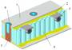
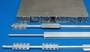

# Тепловая сотопанель
> 2019.05.12 **[🚀](../index/index.md) [despace](index.md)** → **[SGM](sgm.md)**, [СОТР](tcs.md)

[TOC]

---

> <small>*Термины:* **Тепловая сотопанель (ТСП)** — русскоязычный термин. **Thermal sandwich panel (TSP)** — англоязычный эквивалент.</small>

**Тепловая сотопанель (ТСП)** (иногда *термостабилизированная сотопанель*, что неверно) — элемент конструкции и средств обеспечения теплового режима космического аппарата.

Тепловая сотопанель (далее ТСП) предназначена для:

   1. крепления на неё аппаратуры;
   1. создания плоских конструктивных элементов;
   1. прокладки [тепловых труб](hp.md).

Основные особенности ТСП по сравнению с листовыми материалами и ферменными конструкциями:

   1. лёгкость;
   1. низкая теплопроводность;
   1. возможность установки разнообразных закладных элементов.

## Строение ТСП
|||
|:--|:--|
|   | ТСП в разрезе:  1 — обшивка;  2 — плёночный клей (например, ВК-41);  3 — [тепловая труба](hp.md);  4 — сотопласт (например, фольга АМг 2-Н-0.03);  5 — самовспенивающийся клей;  6 — закладной элемент.  |
|   | Общий вид ТСП с тепловыми трубами.  |

 

## Docs & links (TRANSLATEME ALREADY)
|…°·•¹²³±×÷≤≥≈≠ ‑ −— ⎆✉ ❐“”’«»✔→✘☐☑├┕┆ 1 lb = 0.453592 kg; 1 g = 9.80665 m/s²|
|:--|
|<small>**[FAQ](faq.md)**, **[Cable](cable.md)**·БКС, **[Camera](camera.md)**·Камера, **[Comms](comms.md)**·Радио, **[Contact](contact.md)**·Контакт, **[Control](control.md)**·Управ., **[Doc](doc.md)**·Док., **[Doppler](doppler.md)**·ИСР, **[DS](ds.md)**·ЗУ, **[EB](eb.md)**·ХИТ, **[ECO](ecology.md)**·Экол., **[EF](ef.md)**·ВВФ, **[ElC](elc.md)**·ЭКБ, **[EMC](emc.md)**·ЭМС, **[Errors](error.md)**·Ошибки, **[Events](event.md)**·События, **[FS](fs.md)**·ТЭО, **[Fuel](fuel.md)**·Топливо, **[GNC](gnc.md)**·БКУ, **[GS](scs.md)**·НС, **[HF&E](hfe.md)**·Эрго., **[IU](iu.md)**·Гиро., **[KT](kt.md)**·КТЕХ, **[LAG](lag.md)**·ПУC, **[LES](les.md)**·САСП, **[LS](ls.md)**·СЖО, **[LV](lv.md)**·РН, **[MCC](mcc.md)**·ЦУП, **[Model](model.md)**·Модель, **[MSC](sc.md)**·ПКА, **[N&B](nnb.md)**·БНО, **[NR](nr.md)**·ЯР, **[OBC](obc.md)**·ЦВМ, **[OE](oe.md)**·БА, **[Pat.](патент.md)**·Патент, **[Project](project.md)**·Проект, **[PS](ps.md)**·ДУ, **[QA](quality.md)**·QA, **[R&D](rnd.md)**·НИОКР, **[RAMS](rams.md)**·НиБ, **[Risk](risk.md)**·Риск, **[Robot](robotics.md)**·Робот, **[Rover](rover.md)**·Планетоход, **[RTG](rtg.md)**·РИТЭГ, **[SARC](sarc.md)**·ПСК, **[Sensor](sensor.md)**·Датчик, **[SC](sc.md)**·КА, **[SCS](scs.md)**·КК, **[SGM](sgm.md)**·КММ, **[SI](si.md)**·СИ, **[Soft](soft.md)**·ПО, **[SP](sp.md)**·БС, **[Spaceport](spaceport.md)**·Космодром, **[SPS](sps.md)**·СЭС, **[SSS](sss.md)**·ГЗУ, **[TCS](tcs.md)**·СОТР, **[Test](test.md)**·ЭО, **[Timeline](timeline.md)**·Циклограмма, **[TMS](tms.md)**·ТМС, **[TOR](tor.md)**·ТЗ, **[TRL](trl.md)**·УГТ</small>|
|*Sections & pages*|
|**`Конструктивные элементы, механизмы, материалы (КММ):`**  [Гермоконтейнер](гермоконтейнер.md) ┊ [Датчик](sensor.md) ┊ [Задел](margin.md) ┊ [Изделие](unit.md) ┊ [Испарение материалов](mat_sublime.md) ┊ [Кавитация](cavitation.md) ┊ [КЗУ](cinu.md) (ВБУ КТ) ┊ [КХГ](cgs.md) ┊ [Контейнеры для транспортировки](ship_contain.md) ┊ [Крейцкопф](crosshead.md) ┊ [Номинал](nominal.md) ┊ [ПУС](lag.md) ┊ [ПНА, ПОНА, ПСНА](aiad.md) ┊ [Резерв](reserve.md) ┊ [Слайс](слайс.md) ┊ [ТСП](tsp.md) ┊ [Типичные формы КА](sc_ts.md) ┊ [Толкатель](толкатель.md) ┊ [Унификация](commonality.md) |
|**`Средства обеспечения теплового режима (СОТР):`**  [Гермоконтейнер](гермоконтейнер.md) ┊ [Насосы для СОТР](сотр_насос.md) ┊ [Покрытия для СОТР](сотр_покрытия.md) ┊ [Радиатор](радиатор.md) ┊ [РИТ (РИТЭГ)](rtg.md) ┊ [Стандартные условия](sctp.md) ┊ [Тепловая труба](hp.md) ┊ [ТЗП](hs.md) ┊ [Тепловой аккумулятор](heat_bank.md) ┊ [ТСП](tsp.md) ┊ [Шторка](thermal_curtain.md) ┊ [ЭВТИ](mli.md) |

   1. Docs: …
   1. Notable interwikies — …
   1. <http://www.lab-hp.kiev.ua/sotopaneli.shtml>
