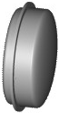
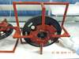
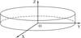

# УДМ-15
> 2019.05.12 [🚀](../index/index.md) [despace](index.md) → **[ДМ](iu.md)**

[TOC]

---

> <small>**УДМ‑15** — русскоязычный термин, не имеющий аналога в английском языке. **UDM‑15** — дословный перевод с русского на английский.</small>

**Управляющий двигатель‑маховик «УДМ‑15»** — инерциальное устройство, предназначенное для использования в качестве исполнительного органа системы ориентации и стабилизации [космического аппарата](sc.md).  
Разработчик и изготовитель [НПЦ Полюс](zz_polus_tomsk.md); разработан в 2005 году Активное использование. Покупное изделие. (по состоянию на 21.06.2017)

|*Characteristics*|*[Value](si.md)  (UDM‑15)*|
|:--|:--|
|Composition|Single unit|
|Consumption, W|–37.5 ‑ +72.5 (для 2 работающих УДМ)|
|Dimensions, ㎜|80 × 315|
|[Interfaces](interface.md)| |
|[Lifetime](lifetime.md)/Resource, h(y)|… / 1 000 при выходе кинетического момента за допустимые нормы; 2 500 циклов вкл/выкл|
|Mass, ㎏|3.7|
|[Overload](vibration.md), Grms| |
|[Rad.resist](ion_rad.md), ㏉ (㎭)| |
|[Reliability](qm.md) per [lifetime](lifetime.md)|0.98|
|[Thermal range](tcs.md), ℃| |
|[TRL](trl.md)| |
|[Voltage](voltage.md), V|27 — штатное;  от 24 до 28 — допустимое|
|**【Specific】**|• • •|
|Исполнение|Single unit|
|Кинет. момент, Н·м·с|± 15|
|Режим готовности|1 s с момента подачи напряжения|
| ||
| | Система координат УДМ‑15|

**Примечания:**

   1. …
   1. **Применяемость:**
      - КА [Венера‑Д](венера‑д.md).
      - КА [Луна‑26](луна_26.md) (в составе [Агат‑15](agat_15.md)).

 

## Docs & links (TRANSLATEME ALREADY)
|Navigation|
|:--|
|**[FAQ](faq.md)**, **[Cable](cable.md)**·БКС, **[Camera](cam.md)**·Камера, **[Comms](comms.md)**·Радио, **[CON](contact.md)·[Pers](person.md)**·Контакт, **[Control](control.md)**·Упр., **[Doc](doc.md)**·Док., **[Doppler](doppler.md)**·ИСР, **[DS](ds.md)**·ЗУ, **[EB](eb.md)**·ХИТ, **[ECO](ecology.md)**·Экол., **[EF](ef.md)**·ВВФ, **[ElC](elc.md)**·ЭКБ, **[EMC](emc.md)**·ЭМС, **[Error](error.md)**·Ошибки, **[Event](event.md)**·События, **[FS](fs.md)**·ТЭО, **[Fuel](fuel.md)**·Топливо, **[GNC](gnc.md)**·БКУ, **[GS](scs.md)**·НС, **[HF&E](hfe.md)**·Эрго., **[IU](iu.md)**·Гиро., **[KT](kt.md)**·КТЕХ, **[LAG](lag.md)**·ПУC, **[LES](les.md)**·САСП, **[LS](ls.md)**·СЖО, **[LV](lv.md)**·РН, **[MCC](mcc.md)**·ЦУП, **[Model](model.md)**·Модель, **[MSC](sc.md)**·ПКА, **[N&B](nnb.md)**·БНО, **[NR](nr.md)**·ЯР, **[OBC](obc.md)**·ЦВМ, **[OE](oe.md)**·БА, **[Pat.](патент.md)**·Патент, **[Proj.](project.md)**·Проект, **[PS](ps.md)**·ДУ, **[QM](qm.md)**·БКНР, **[R&D](rnd.md)**·НИОКР, **[Robot](robotics.md)**·Робот, **[Rover](rover.md)**·Ровер, **[RTG](rtg.md)**·РИТЭГ, **[SARC](sarc.md)**·ПСК, **[SE](se.md)**·СЭ, **[Sens.](sensor.md)**·Датч., **[SC](sc.md)**·КА, **[SCS](scs.md)**·КК, **[SGM](sgm.md)**·КММ, **[SI](si.md)**·СИ, **[Soft](soft.md)**·ПО, **[SP](sp.md)**·БС, **[Spaceport](spaceport.md)**·Космодр., **[SPS](sps.md)**·СЭС, **[SSS](sss.md)**·ГЗУ, **[TCS](tcs.md)**·СОТР, **[Test](test.md)**·ЭО, **[Timeline](timeline.md)**·ЦГМ, **[TMS](tms.md)**·ТМС, **[TOR](tor.md)**·ТЗ, **[TRL](trl.md)**·УГТ|
|*Sections & pages*|
|**【】**  <mark>NOCAT</mark>|

   1. Docs:
      - [3D-модель ❐](f/iu/a/agat_25_udm-15-0.15_3d_2017.7z)
      - [Чертёж ❐](f/iu/a/agat_25_udm-15-0.15_sketch_2016.djvu)
   1. Notable interwikies — …
   1. <…>
