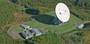
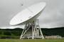

# Usuda Deep Space Center
> 2019.05.12 [🚀](../index/index.md) [despace](index.md) → [JAXA](zz_jaxa.md), **[НС](scs.md)**

[TOC]

---

> <small>**Usuda Deep Space Center (UDSC)** — англоязычный термин, не имеющий аналога в русском языке. **Центр дальней космической связи Усуда (UDSC)** — дословный перевод с английского на русский.</small>

**Usuda Deep Space Center (UDSC)** is a facility of the Japan Aerospace Exploration Agency. It is a spacecraft tracking station opened in October, 1984 in Usuda Town, Minami‑saku, Nagano Prefecture (Saku City from 2005.04). The main feature of the station is a 64‑meter beam waveguide antenna. 36°07'59.0"N 138°21'44.0"E

| | | | |
|:--|:--|:--|:--|
|||||

**Telescopes:**

   - 64‑meter DSN Antenna — Deep Space Tracking Antenna. [Bands](rf.md): <mark>TBD</mark>
   - 54‑meter DSN Antenna — Deep Space Tracking Antenna. [Bands](rf.md): <mark>TBD</mark>

 

## Docs & links (TRANSLATEME ALREADY)
|Navigation|
|:--|
|**[FAQ](faq.md)**, **[Cable](cable.md)**·БКС, **[Camera](cam.md)**·Камера, **[Comms](comms.md)**·Радио, **[CON](contact.md)·[Pers](person.md)**·Контакт, **[Control](control.md)**·Упр., **[Doc](doc.md)**·Док., **[Doppler](doppler.md)**·ИСР, **[DS](ds.md)**·ЗУ, **[EB](eb.md)**·ХИТ, **[ECO](ecology.md)**·Экол., **[EF](ef.md)**·ВВФ, **[ElC](elc.md)**·ЭКБ, **[EMC](emc.md)**·ЭМС, **[Error](error.md)**·Ошибки, **[Event](event.md)**·События, **[FS](fs.md)**·ТЭО, **[Fuel](fuel.md)**·Топливо, **[GNC](gnc.md)**·БКУ, **[GS](scs.md)**·НС, **[HF&E](hfe.md)**·Эрго., **[IU](iu.md)**·Гиро., **[KT](kt.md)**·КТЕХ, **[LAG](lag.md)**·ПУC, **[LES](les.md)**·САСП, **[LS](ls.md)**·СЖО, **[LV](lv.md)**·РН, **[MCC](mcc.md)**·ЦУП, **[Model](model.md)**·Модель, **[MSC](sc.md)**·ПКА, **[N&B](nnb.md)**·БНО, **[NR](nr.md)**·ЯР, **[OBC](obc.md)**·ЦВМ, **[OE](oe.md)**·БА, **[Pat.](патент.md)**·Патент, **[Proj.](project.md)**·Проект, **[PS](ps.md)**·ДУ, **[QM](qm.md)**·БКНР, **[R&D](rnd.md)**·НИОКР, **[Robot](robotics.md)**·Робот, **[Rover](rover.md)**·Ровер, **[RTG](rtg.md)**·РИТЭГ, **[SARC](sarc.md)**·ПСК, **[SE](se.md)**·СЭ, **[Sens.](sensor.md)**·Датч., **[SC](sc.md)**·КА, **[SCS](scs.md)**·КК, **[SGM](sgm.md)**·КММ, **[SI](si.md)**·СИ, **[Soft](soft.md)**·ПО, **[SP](sp.md)**·БС, **[Spaceport](spaceport.md)**·Космодр., **[SPS](sps.md)**·СЭС, **[SSS](sss.md)**·ГЗУ, **[TCS](tcs.md)**·СОТР, **[Test](test.md)**·ЭО, **[Timeline](timeline.md)**·ЦГМ, **[TMS](tms.md)**·ТМС, **[TOR](tor.md)**·ТЗ, **[TRL](trl.md)**·УГТ|
|*Sections & pages*|
|**`Наземная станция (НС):`**  …    [CDSN](cdsn.md)・ [DSN](dsn.md)・ [ESTRACK](estrack.md)・ [IDSN](idsn.md)・ [SSC_GGSN](ssc_ggsn.md)・ [UDSC](udsc.md)|

   1. Docs: …
   1. Notable interwikies — …
   1. <https://en.wikipedia.org/wiki/Usuda_Deep_Space_Center>
   1. <http://global.jaxa.jp/about/centers/udsc/index.html>
