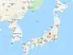
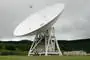

# Usuda Deep Space Center
> 2019.05.12 [🚀](../index/index.md) [despace](index.md) → [JAXA](contact/jaxa.md), **[НС](scs.md)**

[TOC]

---

> <small>**Usuda Deep Space Center (UDSC)** — англоязычный термин, не имеющий аналога в русском языке. **Центр дальней космической связи Усуда (UDSC)** — дословный перевод с английского на русский.</small>

**Usuda Deep Space Center (UDSC)** is a facility of the Japan Aerospace Exploration Agency. It is a spacecraft tracking station opened in October, 1984 in Usuda Town, Minami‑saku, Nagano Prefecture (Saku City from 2005.04). The main feature of the station is a 64‑meter beam waveguide antenna. 36°07'59.0"N 138°21'44.0"E

| | | | |
|:--|:--|:--|:--|
|||||

**Telescopes:**

   - 64‑meter DSN Antenna — Deep Space Tracking Antenna. [Bands](comms.md): <mark>TBD</mark>
   - 54‑meter DSN Antenna — Deep Space Tracking Antenna. [Bands](comms.md): <mark>TBD</mark>

 

## Docs & links (TRANSLATEME ALREADY)
|Navigation|
|:--|
|**[FAQ](faq.md)**【**[SCS](scs.md)**·КК, **[SC (OE+SGM)](sc.md)**·КА】**[CON](contact.md)·[Pers](person.md)**·Контакт, **[Ctrl](control.md)**·Упр., **[Doc](doc.md)**·Док., **[Drawing](drawing.md)**·Чертёж, **[EF](ef.md)**·ВВФ, **[Error](error.md)**·Ошибки, **[Event](event.md)**·События, **[FS](fs.md)**·ТЭО, **[HF&E](hfe.md)**·Эрго., **[KT](kt.md)**·КТ, **[N&B](nnb.md)**·БНО, **[Project](project.md)**·Проект, **[QM](qm.md)**·БКНР, **[R&D](rnd.md)**·НИОКР, **[SI](si.md)**·СИ, **[Test](test.md)**·ЭО, **[TRL](trl.md)**·УГТ, **[Way](way.md)**·Пути|
|*Sections & pages*|
|**`Наземная станция (НС):`**  …    [CDSN](cdsn.md)・ [DSN](dsn.md)・ [ESTRACK](estrack.md)・ [IDSN](idsn.md)・ [SSC_GGSN](ssc_ggsn.md)・ [UDSC](udsc.md)|

   1. Docs: …
   1. <https://en.wikipedia.org/wiki/Usuda_Deep_Space_Center>
   1. <http://global.jaxa.jp/about/centers/udsc/index.html>
