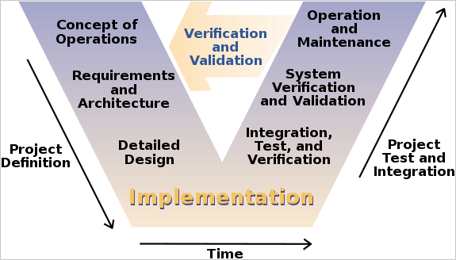
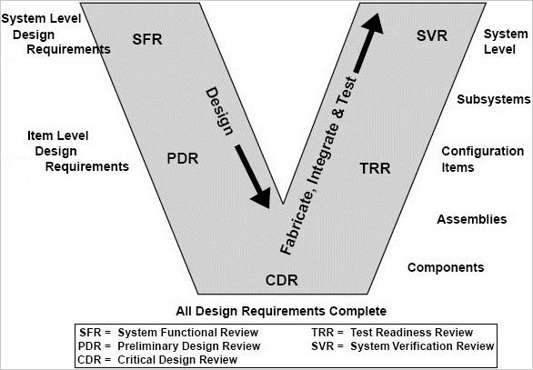
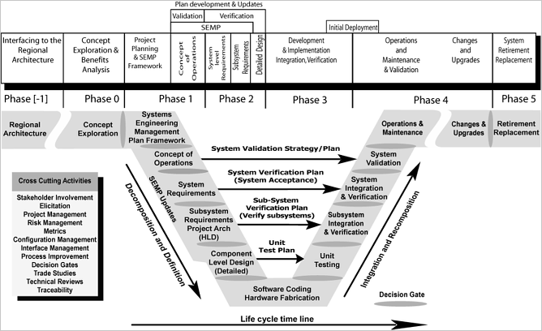
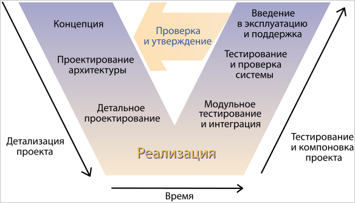

# V‑model
> 2021.02.03 [🚀](../index/index.md) [despace](index.md) → [Control](control.md), [R&D](rnd.md), [SE](se.md)

[TOC]

---

> <small>**V‑model, Systems engineering V** — EN term. **V‑Model, VEE модель, Ви‑модель** — literal RU translation.</small>

The **V‑model** is a graphical representation of a systems development lifecycle. It is used to produce rigorous development lifecycle models & project management models. The V‑model falls into three broad categories, ➀ the German V‑Modell, ➁ a general testing model & ➂ the US government standard.

The V‑model summarizes the main steps to be taken in conjunction with the corresponding deliverables within computerized system validation framework, or project life cycle development. It describes the activities to be performed & the results that have to be produced during product development.

The left side of the “V” represents the decomposition of requirements, & creation of system specifications. The right side of the “V” represents integration of parts & their validation. However, requirements need to be validated first against the higher level requirements or user needs. Furthermore, there is also something as validation of system models (e.g. FEM). This can partially be done at the left side also. To claim that validation only occurs at the right side may not be correct. The easiest way is to say that verification is always against the requirements (technical terms) & validation always against the real world or the user needs. The Aerospace standard RTCA DO‑178B states that requirements are validated — confirmed to be true — & the end product is verified to ensure it satisfies those requirements.

Validation can be expressed by the query “Are you building the right thing?” & verification by “Are you building it right?”

There are three general types of V‑model.

   1. **V‑modell.** The German V‑model “V‑modell”, the official project management method of the German government. It is roughly equivalent to PRINCE2, but more directly relevant to software development. The key attribute of using a “V” representation was to require proof that the products from the left‑side of the V were acceptable by the appropriate test & integration organization implementing the right‑side of the V.
   1. **General testing.** Throughout the testing community worldwide, the V‑model is widely seen as a vaguer illustrative depiction of the software development process as described in the International Software Testing Qualifications Board Foundation Syllabus for software testers. There is no single definition of this model, which is more directly covered in the alternative article on the V‑model (software development).
   1. **US government standard.** The US also has a government standard V‑model which dates back about 20 years like its German counterpart. Its scope is a narrower systems development lifecycle model, but far more detailed & more rigorous than most UK practitioners & testers would understand by the V‑model.

## Objectives, Validation vs. verification

The V‑model provides guidance for the planning & realization of projects. The following objectives are intended to be achieved by a project execution:

   - **Minimization of project risks:** The V‑model improves project transparency & project control by specifying standardized approaches & describing the corresponding results & responsible roles. It permits an early recognition of planning deviations & risks & improves process management, thus reducing the project risk.
   - **Improvement & guarantee of quality:** As a standardized process model, the V‑model ensures that the results to be provided are complete & have the desired quality. Defined interim results can be checked at an early stage. Uniform product contents will improve readability, understandability & verifiability.
   - **Reduction of total cost over the entire project & system life cycle:** The effort for the development, production, operation & maintenance of a system can be calculated, estimated & controlled in a transparent manner by applying a standardized process model. The results obtained are uniform & easily retraced. This reduces the acquirer's dependency on the supplier & the effort for subsequent activities & projects.
   - **Improvement of communication between all stakeholders:** The standardized & uniform description of all relevant elements & terms is the basis for the mutual understanding between all stakeholders. Thus, the frictional loss between user, acquirer, supplier & developer is reduced.

**Validation vs. verification.**  
It is sometimes said that validation can be expressed by the query “Are you building the right thing?” & verification by “Are you building it right?” In practice, the usage of these terms varies.  
The [PMBOK guide](pmbok.md), also adopted by the IEEE as a standard (jointly maintained by INCOSE, the Systems engineering Research Council SERC, & IEEE Computer Society) defines them as follows in its 4th edition:

   - **Validation.** The assurance that a product, service, or system meets the needs of the customer & other identified stakeholders. It often involves acceptance & suitability with external customers. Contrast with verification.
   - **Verification.** The evaluation of whether or not a product, service, or system complies with a regulation, requirement, specification, or imposed condition. It is often an internal process. Contrast with validation.

## V‑model topics
**Systems engineering & verification**

The systems engineering process (SEP) provides a path for improving the cost‑effectiveness of complex systems as experienced by the system owner over the entire life of the system, from conception to retirement.

It involved early & comprehensive identification of goals, a concept of operations that describes user needs & the operating environment, thorough & testable system requirements, detailed design, implementation, rigorous acceptance testing of the implemented system to ensure it meets the stated requirements (system verification), measuring its effectiveness in addressing goals (system validation), on‑going operation & maintenance, system upgrades over time, & eventual retirement.

The process emphasizes requirements‑driven design & testing. All design elements & acceptance tests must be traceable to one or more system requirements & every requirement must be addressed by at least one design element & acceptance test. Such rigor ensures nothing is done unnecessarily & everything that is necessary is accomplished.

**The two streams.** The development stream can consist (depending on the system type & the development scope) of customization, configuration or coding.

   1. **Specification stream.** The specification stream mainly consists of:
      - User requirement specifications
      - Functional requirement specifications
      - Design specifications
   1. **Testing stream.** The testing stream generally consists of:
      - Installation qualification (IQ)
      - Operational qualification (OQ)
      - Performance qualification (PQ)

**Advantages.** These are the advantages V‑model offers in front of other systems development models:

   - The users of the V‑model participate in the development & maintenance of the V‑model. A change control board publicly maintains the V‑model. The change control board meets anywhere from every day to weekly & processes all change requests received during system development & test.
   - The V‑model provides concrete assistance on how to implement an activity & its work steps, defining explicitly the events needed to complete a work step: each activity schema contains instructions, recommendations & detailed explanations of the activity.

**Limits.** The following aspects are not covered by the V‑model, they must be regulated in addition, or the V‑model must be adapted accordingly:

   - The placing of contracts for services is not regulated.
   - The organization & execution of operation, maintenance, repair & disposal of the system are not covered by the V‑model. However, planning & preparation of a concept for these tasks are regulated in the V‑model.
   - The V‑model addresses software development within a project rather than a whole organization.

 

## (RU) V‑model
**V‑model** (или **VEE модель, Ви‑модель**) является моделью разработки информационных систем (ИС), направленной на упрощение понимания сложностей, связанных с разработкой систем. Она используется для определения единой процедуры разработки программных продуктов, аппаратного обеспечения и человеко‑машинных интерфейсов.

Основной принцип V‑образной модели заключается в том, что детализация проекта возрастает при движении слева направо, одновременно с течением времени, и ни то, ни другое не может повернуть вспять. Итерации в проекте производятся по горизонтали, между левой и правой сторонами буквы.

Применительно к разработке информационных систем V‑model — вариация каскадной модели, в которой задачи разработки идут сверху вниз по левой стороне буквы V, а задачи тестирования — вверх по правой стороне буквы V. Внутри V проводятся горизонтальные линии, показывающие, как результаты каждой из фаз разработки влияют на развитие системы тестирования на каждой из фаз тестирования. Модель базируется на том, что приёмо‑сдаточные испытания основываются, прежде всего, на требованиях, системное тестирование — на требованиях и архитектуре, комплексное тестирование — на требованиях, архитектуре и интерфейсах, а компонентное тестирование — на требованиях, архитектуре, интерфейсах и алгоритмах.

**Цели.**  
V‑модель обеспечивает поддержку в планировании и реализации проекта. В ходе проекта ставятся следующие задачи:

   - **Минимизация рисков**: V‑образная модель делает проект более прозрачным и повышает качество контроля проекта путём стандартизации промежуточных целей и описания соответствующих им результатов и ответственных лиц. Это позволяет выявлять отклонения в проекте и риски на ранних стадиях и улучшает качество управления проектов, уменьшая риски.
   - **Повышение и гарантии качества**: V‑model — стандартизованная модель разработки, что позволяет добиться от проекта результатов желаемого качества. Промежуточные результаты могут быть проверены на ранних стадиях. Универсальное документирование облегчает читаемость, понятность и проверяемость.
   - **Уменьшение общей стоимости проекта**: Ресурсы на разработку, производство, управление и поддержку могут быть заранее просчитаны и проконтролированы. Получаемые результаты также универсальны и легко прогнозируются. Это уменьшает затраты на последующие стадии и проекты.
   - **Повышение качества коммуникации между участниками проекта**: Универсальное описание всех элементов и условий облегчает взаимопонимание всех участников проекта. Таким образом, уменьшаются неточности в понимании между пользователем, покупателем, поставщиком и разработчиком.

**Достоинства**

   - Пользователи V‑model участвуют в разработке и поддержке V‑модели. Комитет по контролю за изменениями поддерживает проект и собирается раз в год для обработки всех полученных запросов на внесение изменений в V‑model.
   - На старте любого проекта V‑образная модель может быть адаптирована под этот проект, так как эта модель не зависит от типов организаций и проектов.
   - V‑model позволяет разбить деятельность на отдельные шаги, каждый из которых будет включать в себя необходимые для него действия, инструкции к ним, рекомендации и подробное объяснение деятельности.
   - В модели особое значение придается планированию, направленному на верификацию и аттестацию разрабатываемого продукта на ранних стадиях его разработки. Фаза модульного тестирования подтверждает правильность детализированного проектирования. Фазы интеграции и тестирования реализуют архитектурное проектирование или проектирование на высшем уровне. Фаза тестирования системы подтверждает правильность выполнения этапа требований к продукту и его спецификации.
   - В модели предусмотрены аттестация и верификация всех внешних и внутренних полученных данных, а не только самого программного продукта.
   - В V‑образной модели определение требований выполняется перед разработкой проекта системы, а проектирование ПО — перед разработкой компонентов.
   - Модель определяет продукты, которые должны быть получены в результате процесса разработки, причём каждые полученные данные должны подвергаться тестированию.
   - Благодаря модели менеджеры проекта могут отслеживать ход процесса разработки, так как в данном случае вполне возможно воспользоваться временной шкалой, а завершение каждой фазы является контрольной точкой.

**Ограничения и недостатки.**  
Следующие моменты не учитываются в V‑модели, но могут быть рассмотрены отдельно, либо возможно адаптировать модель под них:

   - Не регулируется размещение контрактов на обслуживание.
   - Организация и выполнение управления, обслуживания, ремонта и утилизации системы не учитываются в V‑модели. Однако, планирование и подготовка к этим операциям моделью рассматриваются.
   - V‑образная модель больше касается разработки программного обеспечения в проекте, чем всей организации процесса.
   - Модель не предусматривает работу с параллельными событиями.
   - В модели не предусмотрено внесение требования динамических изменений на разных этапах жизненного цикла.
   - Тестирование требований в жизненном цикле происходит слишком поздно, вследствие чего невозможно внести изменения, не повлияв при этом на график выполнения проекта.
   - В модель не входят действия, направленные на анализ рисков.
   - Некоторый результат можно посмотреть только при достижении низа буквы V.

 

## Docs & links
|Navigation|
|:--|
|**[FAQ](faq.md)**【**[SCS](scs.md)**·КК, **[SC (OE+SGM)](sc.md)**·КА】**[CON](contact.md)·[Pers](person.md)**·Контакт, **[Ctrl](control.md)**·Упр., **[Doc](doc.md)**·Док., **[Drawing](drawing.md)**·Чертёж, **[EF](ef.md)**·ВВФ, **[Error](error.md)**·Ошибки, **[Event](event.md)**·События, **[FS](fs.md)**·ТЭО, **[HF&E](hfe.md)**·Эрго., **[KT](kt.md)**·КТ, **[N&B](nnb.md)**·БНО, **[Project](project.md)**·Проект, **[QM](qm.md)**·БКНР, **[R&D](rnd.md)**·НИОКР, **[SI](si.md)**·СИ, **[Test](test.md)**·ЭО, **[TRL](trl.md)**·УГТ, **[Way](way.md)**·Пути|
|*Sections & pages*|
|**【[Control](Control.md)】**  [Ad hoc](ad_hoc.md)・ [Business travel](business_travel.md)・ [Chief designers council](cocd.md)・ [CML](cml.md)・ [Competence](competence.md)・ [Confident](confident.md)・ [Consp.theory](consp_theory.md)・ [Control sys. (CS)](cs.md)・ [Coordinate system](coord_sys.md)・ [Curator](curator.md)・ [Designer’s supervision](des_spv.md)・ [E‑sig](esig.md)・ [Engineer](se.md)・ [Errand](errand.md)・ [Federal law](fed_law.md)・ [Federal TP](fed_tp.md)・ [Federal SP](fed_sp.md)・ [GNC](gnc.md)・ [Gravity assist](gravass.md)・ [Industrial archaeology](ind_arch.md)・ [Instruction](instruction.md)・ [Lean manuf.](lean_man.md)・ [Lifetime](lifetime.md)・ [Manager](manager.md)・ [MBSE](se.md)・ [Meeting](meeting.md)・ [MCC](scs.md)・ [MIC](mic.md)・ [MML](mml.md)・ [MoU](contract.md)・ [Nav. & ballistics (NB)](nnb.md)・ [Nonprofit org.](nonprof_org.md)・ [NX](nx.md)・ [Oberth effect](oberth_eff.md)・ [Org.structure](orgstruct.md)・ [Outcomes commission](outccom.md)・ [Patent](patent.md)・ [Peter prin.](peter_principle.md)・ [Plan](plan.md)・ [PMBok](pmbok.md)・ [Quorum](quorum.md)・ [R&D management](mgmt.md)・ [R&D support](rnd_support.md)・ [Recursion](recurs.md)・ [Schulze_method](schulze_method.md)・ [Sci'N'Tech activities](st_act.md)・ [Sci'N'Tech council](satc.md)・ [Single-window system](sw_sys.md)・ [Situ.leadership](situ_leadership.md)・ [Skunk works](se.md)・ [State arm. plan](plan_sa.md)・ [Swamp](swamp.md)・ [Teamcenter](teamcenter.md)・ [Tennis racket theorem](tr_theorem.md)・ [TRIZ](triz.md)・ [TRL](trl.md)・ [V‑model](v_model.md)・ [Veto](veto.md)・ [Workflow](workflow.md)・ [Workgroup](wg.md)|
|**【[R&D](rnd.md)】**  [Design review](design_review.md)・ [Management](mgmt.md)・ [MBSE](se.md)・ [Proposal](proposal.md)・ [Test](test.md)・ [V‑model](v_model.md)・ [Validation, Verification](val_ver.md)  [АП](rnd_ap.md)・ [ЛИ](rnd_e.md)・ [Макеты, НЭО](test.md)・ [НИР](rnd_0.md)・ [РКД (РРД)](rnd_rkd.md)・ [ТП](rnd_tp.md)・ [ЭП](rnd_ep.md)|
|**【[Systems engineering](se.md)】**  [Competence](competence.md)・ [Coordinate system](coord_sys.md)・ [Designer’s supervision](des_spv.md)・ [Industrial archaeology](ind_arch.md)・ [Instruction](instruction.md)・ [Lean manuf.](lean_man.md)・ [Lifetime](lifetime.md)・ [MBSE](se.md)・ [MML](mml.md)・ [Nav. & ballistics (NB)](nnb.md)・ [NASA SEH](nasa_seh.md)・ [Oberth effect](oberth_eff.md)・ [PMBok](pmbok.md)・ [Quorum](quorum.md)・ [R&D management](mgmt.md)・ [R&D support](rnd_support.md)・ [Recursion](recurs.md)・ [Schulze_method](schulze_method.md)・ [Sci'N'Tech activities](st_act.md)・ [Sci'N'Tech council](satc.md)・ [Skunk works](se.md)・ [SysML](sysml.md)・ [Tennis racket theorem](tr_theorem.md)・ [TRIZ](triz.md)・ [TRL](trl.md)・ [V‑model](v_model.md)・ [Workflow](workflow.md)・ [Workgroup](wg.md)|

   1. Docs: …
   1. <https://en.wikipedia.org/wiki/V‑model>
