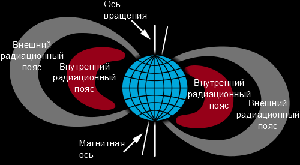
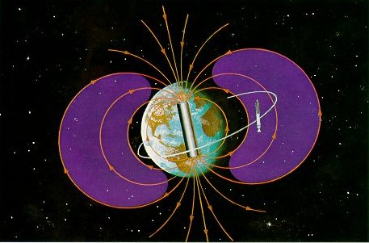

# Радиационные пояса Земли
> 2019.04.05 [🚀](../index/index.md) [despace](index.md) → [EF](ef.md)

[TOC]

---

> <small> ・**Радиационные пояса Земли (РПЗ)** — русскоязычный термин. **Van Allen radiation belt’s / Earth radiation belt** — англоязычный эквивалент.</small>

**Радиацио́нный по́яс** — область магнитосфер планет, в которой накапливаются и удерживаются проникшие в магнитосферу высокоэнергичные заряженные частицы (в основном протоны и электроны).

## Радиационный пояс Земли
Другое название (обычно в западной литературе) — «радиационный пояс Ван Аллена» *(англ. Van Allen radiation belt)*.

| |
|:--|
||
||

Внутри магнитосферы, как и в любом дипольном поле, есть области, недоступные для частиц с кинетической энергией E, меньше критической. Те же частицы с энергией E < Екр, которые всё‑таки уже там находятся, не могут эти области покинуть. Эти запрещённые области магнитосферы называются зонами захвата. В зонах захвата дипольного (квазидипольного) поля Земли действительно удерживаются значительные потоки захваченных частиц (прежде всего, протонов и электронов).

Радиационный пояс в первом приближении представляет собой тороид, в котором выделяются две области:

   - внутренний радиационный пояс на высоте ≈ 4 000 ㎞, состоящий преимущественно из протонов с энергией в десятки МэВ;
   - внешний радиационный пояс на высоте ≈ 17 000 ㎞, состоящий преимущественно из электронов с энергией в десятки кэВ.

Высота нижней границы радиационного пояса меняется на одной и той же географической широте по долготам из‑за наклона оси магнитного поля Земли к оси вращения Земли, а на одной и той же географической долготе она меняется по широтам из‑за собственной формы радиационного пояса, обусловленной разной высотой силовых линий магнитного поля Земли. Например, над Атлантикой возрастание интенсивности излучения начинается на высоте 500 ㎞, а над Индонезией на высоте 1 300 ㎞. Если те же графики построить в зависимости от магнитной индукции, то все измерения уложатся на одну кривую, что ещё раз подтверждает магнитную природу захвата частиц.

Между внутренним и внешним радиационными поясами имеется щель, расположенная в интервале от 2 до 3  радиусов Земли. Потоки частиц во внешнем поясе больше, чем во внутреннем. Различен и состав частиц: во внутреннем поясе протоны и электроны, во внешнем — электроны. Применение неэкранированных детекторов существенно расширило сведения о радиационных поясах. Были обнаружены электроны и протоны с энергией несколько десятков и сотен килоэлектронвольт соответственно. Эти частицы имеют существенно иное пространственное распределение (по сравнению с проникающими).

Максимум интенсивности протонов низких энергий расположен на расстоянии около 3 радиусов Земли от её центра (приблизительно на высоте 12 500 ㎞ от поверхности). Малоэнергичные электроны заполняют всю область захвата. Для них нет разделения на внутренний и внешний пояса. Частицы с энергией десятки кэВ непривычно относить к космическим лучам, однако радиационные пояса представляют собой единое явление и должны изучаться в комплексе с частицами всех энергий.

Поток протонов во внутреннем поясе довольно устойчив во времени. Первые эксперименты показали, что электроны высокой энергии (E > 1 ‑ 5 МэВ) сосредоточены во внешнем поясе. Электроны с энергией меньше 1 МэВ заполняют почти всю магнитосферу. Внутренний пояс очень стабилен, тогда как внешний испытывает резкие колебания.

## Радиационные пояса планет
Благодаря наличию сильного магнитного поля планеты‑гиганты ([Юпитер](jupiter.md), [Сатурн](saturn.md), [Уран](uranus.md) и [Нептун](neptune.md)) также обладают сильными радиационными поясами, напоминающими внешний радиационный пояс Земли.

Советские и американские космические зонды показали, что [Venus](venus.md), [Марс](mars.md), [Меркурий](mercury.md) и [Луна](moon.md) радиационных поясов не имеют.

 

## Docs & links (TRANSLATEME ALREADY)
|Navigation|
|:--|
|**[FAQ](faq.md)**【**[SCS](scs.md)**·КК, **[SC (OE+SGM)](sc.md)**·КА】**[CON](contact.md)·[Pers](person.md)**·Контакт, **[Ctrl](control.md)**·Упр., **[Doc](doc.md)**·Док., **[Drawing](drawing.md)**·Чертёж, **[EF](ef.md)**·ВВФ, **[Error](error.md)**·Ошибки, **[Event](event.md)**·События, **[FS](fs.md)**·ТЭО, **[HF&E](hfe.md)**·Эрго., **[KT](kt.md)**·КТ, **[N&B](nnb.md)**·БНО, **[Project](project.md)**·Проект, **[QM](qm.md)**·БКНР, **[R&D](rnd.md)**·НИОКР, **[SI](si.md)**·СИ, **[Test](test.md)**·ЭО, **[TRL](trl.md)**·УГТ, **[Way](way.md)**·Пути|
|*Sections & pages*|
|**【[External factors (EF)](ef.md)】**  [Astro.object](aob.md)・ [Atmosphere](atmosphere.md)・ [Atmosphere of Earth](earth.md)・ [Cosmic rays](cr.md)・ [EMI](emi.md)・ [Grav.waves](gravwave.md)・ [Ion.radiation](ion_rad.md)・ [Radio frequency](rf.md)・ [Solar phenomena](solar_ph.md)・ [Space debris](sdeb.md)・ [Standart conditions](sctp.md)・ [Time](time.md)・ [VA radiation belts](varb.md)|

   1. Docs: …
   1. <https://en.wikipedia.org/wiki/Van_Allen_radiation_belt>
   1. <https://ru.wikipedia.org/wiki/Радиационный_пояс>
