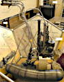
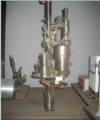
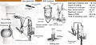

# ВБ02
> 2019.05.12 [🚀](../index/index.md) [despace](index.md) → **[ГЗУ](sss.md)**

[TOC]

---

> <small>*Термины:* **ВБ02** — русскоязычный термин, не имеющий аналога в английском языке. **VB09** — дословный перевод с русского на английский.</small>

**ВБ02** — буровая установка производства КБОМ.  
*Разработчик:* КБОМ. Разработано в 1981 году.

|*Общий вид на КА*|*Общий вид ГЗУ*|*Структурная схема*|*Структурная схема*|
|:--|:--|:--|:--|
|||||

---

<small>

|*Характеристика*|*[Значение](si.md) <small>(ВБ02)</small>*|
|:--|:--|
|[TRL](trl.md)|9|
|Глубина бурения, мм|36|
|Диаметр керна, мм|16|
|Масса забираемого грунта, г||
|Объём забираемого грунта, mm³|1 600|
|Скорость бурения, мм/сек, ≥||
|**`Прочее`**||
|[ВБР](srrq.md) за САС||
|Dimensions, L×W×H, mm|… × … × …|
|Интерфейсы||
|Mass, kg|26.2|
|[Voltage](voltage.md), V||
|Overload, g|300|
|[Rad.resist](ion_rad.md), Gy (rad)||
|Resource, h (y)||
|[Lifetime](lifetime.md), h (y)|…, 204 с|
|[Temp. range](tcs.md), ℃|−20 ‑ +600|
|Consumption, W|…, 3 А|

</small>

   - После завершения бурения открывалась полость с вакуумом и образцы породы под давлением атмосферы Венеры затягивало внутрь к анализаторам. Образец породы облучался радиоактивными изотопами плутония-238 и железа-55, использовался 256-канальный амплитудный анализатор.

 

## Примечания
   1. …

## Применяемость
   1. КА «[Вега-2](vega_1_2.md)» (1984)
   1. КА «[Венера-13/14](venera_13_14.md)» (1981)

---

## Docs & links (TRANSLATEME ALREADY)
|Navigation|
|:--|
|<small>**[FAQ](faq.md)**, **[Cable](cable.md)**·БКС, **[Camera](cam.md)**·Камера, **[Comms](comms.md)**·Радио, **[Contact](contact.md)**·Контакт, **[Control](control.md)**·Упр., **[Doc](doc.md)**·Док., **[Doppler](doppler.md)**·ИСР, **[DS](ds.md)**·ЗУ, **[EB](eb.md)**·ХИТ, **[ECO](ecology.md)**·Экол., **[EF](ef.md)**·ВВФ, **[ElC](elc.md)**·ЭКБ, **[EMC](emc.md)**·ЭМС, **[Error](error.md)**·Ошибки, **[Event](event.md)**·События, **[FS](fs.md)**·ТЭО, **[Fuel](fuel.md)**·Топливо, **[GNC](gnc.md)**·БКУ, **[GS](scs.md)**·НС, **[HF&E](hfe.md)**·Эрго., **[IU](iu.md)**·Гиро., **[KT](kt.md)**·КТЕХ, **[LAG](lag.md)**·ПУC, **[LES](les.md)**·САСП, **[LS](ls.md)**·СЖО, **[LV](lv.md)**·РН, **[MCC](mcc.md)**·ЦУП, **[Model](model.md)**·Модель, **[MSC](sc.md)**·ПКА, **[N&B](nnb.md)**·БНО, **[NR](nr.md)**·ЯР, **[OBC](obc.md)**·ЦВМ, **[OE](oe.md)**·БА, **[Pat.](патент.md)**·Патент, **[Project](project.md)**·Проект, **[PS](ps.md)**·ДУ, **[R&D](rnd.md)**·НИОКР, **[SRRQ](srrq.md)**·БКНР, **[Robot](robotics.md)**·Робот, **[Rover](rover.md)**·Планетоход, **[RTG](rtg.md)**·РИТЭГ, **[SARC](sarc.md)**·ПСК, **[Sensor](sensor.md)**·Датчик, **[SC](sc.md)**·КА, **[SCS](scs.md)**·КК, **[SGM](sgm.md)**·КММ, **[SI](si.md)**·СИ, **[Soft](soft.md)**·ПО, **[SP](sp.md)**·БС, **[Spaceport](spaceport.md)**·Космодром, **[SPS](sps.md)**·СЭС, **[SSS](sss.md)**·ГЗУ, **[TCS](tcs.md)**·СОТР, **[Test](test.md)**·ЭО, **[Timeline](timeline.md)**·ЦГМ, **[TMS](tms.md)**·ТМС, **[TOR](tor.md)**·ТЗ, **[TRL](trl.md)**·УГТ</small>|
|*Sections & pages*|
|**`Грунтозаборное устройство (ГЗУ):`**  [Каротаж](logging.md) ┊ [Стратификация](stratification.md) • • •  **РФ:** [ГЗУ-ЛР1](гзу_лр1.md) ┊ [ЛБ-15](lb_15.md) *([ВБ02](vb02.md) ┊ [ЛБ-09](lb_09.md) ┊ [ЛБ-10](lb_10.md))*|

   1. Docs:
      - [Venera-D Lander payload instruments ❐](f/sss/v/vb02_doc02.pdf) ([Герасимов](zz_gerasimov1.md), [Economou](zz_economou1.md), Москва, ИКИ РАН, 2019)
      - [Краткое описание ГЗУ и его работы ❐](f/sss/v/vb02_doc01.pdf) (Москва, ИКИ РАН, 2018)
   1. Notable interwikies — …
   1. <http://www.russian.space/127/>
