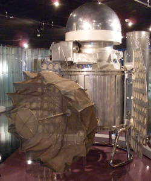

# Venera 1
> 2019.12.10 ┊ **🚀 [despace](index.md)** → [Venus](venus.md), **[Project](project.md)**

[TOC]

---

> <small>*Terms:* **Венера-1 (Венера-1VA №2; Спутник 8)** — Russian term with no analogues in English. **Venera 1 (Venera 1VA No.2; Sputnik 8)** — literal translation to English.</small>

**Venera 1 (Венера‑1)**, also known as **Venera‑1VA No.2** and occasionally in the West as **Sputnik 8** was the first spacecraft to Venus, as part of the Soviet Union’s Venera programme. There were obtained some characteristics of the solar wind’s plasma near the Earth. Signal with SC was lost after 7 days of flight; theoretically SC fly by Venus at 100 000 km distance.

 

|*Type*|*[Param.](si.md)*|
|:--|:--|
|**Mission:**|• • •|
|Cost| … or … kg of [gold](sc_price.md) |
|Development| … |
|Duration| 7 days |
|Launch| 1961.02.12 00:34:36 UTC, LV Molniya 8K78 |
|Operator| OKB-1 |
|Programme| Venera programme |
|Similar to| • Proposed: Mariner 1, [Mariner 2](mariner_2.md)  • Current: —  • Past: Luna 2 |
|Target| Exploring of the Venus |
|[Type](sc.md)| Venus impactor |
|**Spacecraft:**|• • •|
|Comms| 2.4 m parabolic wire‑mesh antenna; 922.8 MHz; wavelenth 32 cm |
|Composition| Orbiter, lander |
|Contractor| … |
|[ID](spaceid.md)| NSSDC ID (COSPAR ID): [1961-003A ⎆](https://nssdc.gsfc.nasa.gov/nmc/spacecraft/display.action?id=1961-003A), SCN: 80 |
|Manufacturer| OKB-1 |
|Mass| Dry 643.5 kg ([medium satellite](sc.md), [EVN‑072](venus.md)) |
|Orbit / Site| Heliocentric |
|Payload| a flux‑gate magnetometer, two ion traps, micrometeorite detectors, Geiger counter tubes, a sodium iodide scintillator |
|Power| … |

Achieved targets & investigations:

   - **T** — technical; **C** — contact research; **D** — distant research; **F** — fly‑by; **H** — manned; **S** — soil sample return; **X** — technology demonstration
   - **Sections of measurement and observation:**
      - Atmospheric/climate — **Ac** composition, **Ai** imaging, **Am** mapping, **Ap** pressure, **As** samples, **At** temperature, **Aw** wind speed/direction.
      - General — **Gi** planet’s interactions with outer space.
      - Soil/surface — **Sc** composition, **Si** imaging, **Sm** mapping, **Ss** samples.

<small>

|*EVN‑XXX*|*T*|*EN*|*Section of m&o*|*D*|*C*|*F*|*H*|*S*|
|:--|:--|:--|:--|:--|:--|:--|:--|:--|
|EVN‑005|T|Exploration: from Venusian orbit|  |D||F|||
|EVN‑072|T|Exploration with [satellites](sc.md): medium satellites|  |D||F|||
|EVN‑097||Atmosphere: effect of solar Rad & interplanetary space on the atmo|  |D||F|||

</small>

 

## Mission
Venera 1 was the second of two attempts to launch a spacecraft to Venus in February 1961, immediately following the launch of its sister ship Venera‑1VA No.1, which failed to leave Earth orbit. Soviet experts launched Venera‑1 using a Molniya carrier rocket from the [Baikonur Cosmodrome](baikonur.md). The launch took place 1961.02.12 at 00:34:36 UTC.

The spacecraft, along with the rocket’s Blok‑L upper stage, were initially placed into a 229 × 282 km low Earth orbit, before the upper stage fired to place Venera 1 into a heliocentric orbit, directed towards Venus. The 11D33 engine was the world’s first staged‑combustion‑cycle rocket engine, and also the first use of an ullage engine to allow a liquid‑fuel rocket engine to start in space.

Three successful telemetry sessions were conducted, gathering solar‑wind and cosmic‑ray data near Earth ([EVN‑097](venus.md)), at the Earth’s Magnetopause, and on February 19 at a distance of 1 900 000 km. After discovering the solar wind with [Luna 2](luna_2.md), Venera 1 provided the first verification that this plasma was uniformly present in deep space. Seven days later, the next scheduled telemetry session failed to occur. On 1961.05.19 Venera 1 passed within 100 000 km of Venus ([EVN‑005](venus.md)). With the help of the British radio telescope at Jodrell Bank, some weak signals from Venera 1 may have been detected in June. Soviet engineers believed that Venera 1 failed due to the overheating of a solar‑direction sensor.

 

## Science goals & payload
The main task of Venera 1 was to enter the atmosphere of Venus landing on the surface or water.

Venera 1 — spacecraft, designed to explore the planet Venus.

   - flux‑gate magnetometer;
   - Geiger counter tubes;
   - ion traps (2 instruments);
   - micrometeorite detectors;
   - sodium iodide scintillator.

The lander was equipped with scientific instruments including a flux‑gate magnetometer attached to the antenna boom, two ion traps to measure solar wind, micrometeorite detectors, and Geiger counter tubes and a sodium iodide scintillator for measurement of cosmic radiation.

   - flux‑gate magnetometer — are used for their electronic simplicity and low weight. The majority of early fluxgate magnetometers on spacecraft were made as vector sensors. Used to search for magnetic fields;
   - two ion traps — a combination of electric or magnetic fields used to capture charged particles, often in a system isolated from an external environment;
   - micrometeorite detectors — the device’s objective was to study the relationship of micrometeorite’s density as compared with their mass and velocity;
   - Geiger counter tubes — the sensing element of the Geiger counter instrument used for the detection of ionizing radiation;
   - sodium iodide scintillator.

 

## Spacecraft
Venera 1 was a 643.5 kg spacecraft consisting of a cylindrical body 1.05 m in diameter topped by a dome, totalling 2.035 m in height. This was pressurized to 1.2 atm with dry nitrogen, with internal fans to maintain even distribution of heat. Two solar panels extended from the cylinder, charging a bank of silver‑zinc batteries. A 2 m parabolic wire‑mesh antenna was designed to send data from Venus to Earth on a frequency of 922.8 MHz. A 2.4 m antenna boom was used to transmit short‑wave signals during the near‑Earth phase of the mission. Semidirectional quadrupole antennas mounted on the solar panels provided routine telemetry and telecommand contact with Earth during the mission, on a circularly‑polarized decimetre radio band.

An experiment attached to one solar panel measured temperatures of experimental coatings. Infrared and/or ultraviolet radiometers may have been included. The dome contained a KDU‑414 engine used for mid‑course corrections. Temperature control was achieved by motorized thermal shutters.

During most of its flight, Venera 1 was spin stabilized. It was the first spacecraft designed to perform mid‑course corrections, by entering a mode of 3‑axis stabilization, fixing on the Sun and the star Canopus. Had it reached Venus, it would have entered another mode of 3‑axis stabilization, fixing on the Sun and Earth, and using for the first time a parabolic antenna to relay data.

 

## Community, library, links

**PEOPLE:**

   - **Leaders:**
      1. [Mstislav Keldysh](zz_keldysh1.md) (Мстислав Всеволодович Келдыш) a Soviet scientist in the field of mathematics and mechanics.
      1. [Sergei Korolev](zz_korolev1.md) (Сергей Павлович Королёв) a lead Soviet rocket engineer and spacecraft designer during the Space Race between the United States and the Soviet Union in the 1950s and 1960s.
   - **Members:**
      1. Alla Masevich (Алла Генриховна Масевич) a Soviet astronomer.
      1. Boris Chertok (Борис Евсеевич Черток) a Russian electrical engineer and the control systems designer in the SU space program, and later the Roscosmos in Russia.
      1. Alfred Charles Bernard Lovell an English physicist and radio astronomer. Theoretically couuld receive a signal from the spacecraft’s disoriented nondirectional antenna.
      1. Yuli Khodarev (Юлий Константинович Ходарев) — developer of satellite communication systems (inc. Venera 1).

**COMMUNITY:**

   - Academy of Science of the Soviet Union.

 

## Docs & links
|…°·•¹²³±×÷≤≥≈≠ ‑ −— ⎆✉ ❐“”’«»✔→✘☐☑├┕┆ 1 lb = 0.453592 kg; 1 g = 9.80665 m/s²|
|:--|
|<small>**[FAQ](faq.md)**, **[Cable](cable.md)**·БКС, **[Camera](camera.md)**·Камера, **[Comms](comms.md)**·Радиосв., **[Contact](contact.md)**·Контакт, **[Control](control.md)**·Управ., **[Doc](doc.md)**·Док., **[Doppler](doppler.md)**·ИСР, **[DS](ds.md)**·ЗУ, **[EB](eb.md)**·ХИТ, **[ECO](ecology.md)**·Экол., **[EF](ef.md)**·ВВФ, **[ElC](elc.md)**·ЭКБ, **[EMC](emc.md)**·ЭМС, **[Errors](error.md)**·Ошибки, **[Events](event.md)**·События, **[FS](fs.md)**·ТЭО, **[Fuel](fuel.md)**·Топливо, **[GNC](gnc.md)**·БКУ, **[GS](scs.md)**·НС, **[HF&E](hfe.md)**·Эргоном., **[IMU](imu.md)**·Гироскоп, **[Incubator](incubator.md)**·Инкуб., **[KT](kt.md)**·КТЕХ, **[LAG](lag.md)**·ПУC, **[LES](les.md)**·САСП, **[LS](ls.md)**·СЖО, **[LV](lv.md)**·РН, **[MAG](mag.md)**·Магнитом., **[MCC](mcc.md)**·ЦУП, **[Model](model.md)**·Модель, **[MSC](sc.md)**·ПКА, **[N&B](nnb.md)**·БНО, **[NR](nr.md)**·ЯР, **[OBC](obc.md)**·ЦВМ, **[OE](oe.md)**·БА, **[Patent](патент.md)**·Патент, **[Project](project.md)**·Проект, **[PS](ps.md)**·ДУ, **[QA](quality.md)**·QA, **[R&D](rnd.md)**·НИОКР, **[RAMS](rams.md)**·НиБ, **[Risk](risk.md)**·Риск, **[Robot](robotics.md)**·Робот, **[Rover](rover.md)**·Планетоход, **[RTG](rtg.md)**·РИТЭГ, **[RW](rw.md)**·ДМ, **[SARC](sarc.md)**·ПСК, **[Sensor](sensor.md)**·Датчик, **[SC](sc.md)**·КА, **[SCS](scs.md)**·КК, **[SGM](sgm.md)**·КММ, **[SI](si.md)**·СИ, **[Soft](soft.md)**·ПО, **[SP](sp.md)**·БС, **[Spaceport](spaceport.md)**·Космодром, **[SPS](sps.md)**·СЭС, **[SSS](sss.md)**·ГЗУ, **[TCS](tcs.md)**·СОТР, **[Test](test.md)**·ЭО, **[Timeline](timeline.md)**·Циклограмма, **[TMS](tms.md)**·ТМС, **[TOR](tor.md)**·ТЗ, **[TRL](trl.md)**·УГТ</small>|
|*Sections & pages*|
|**··•  •··**  <mark>NOCAT</mark> |

**Docs:**

   1. П.С. Шубин — Венера. Неукротимая планета. Издание второе, расширенное и дополненное. М.: Издательство «Голос‑Пресс»; Кемерово: издатель П. С. Шубин, 2018. – 352 стр.: ил.

**Links:**

   1. Notable interwikies — …
   1. <https://en.wikipedia.org/wiki/Venera_1>
