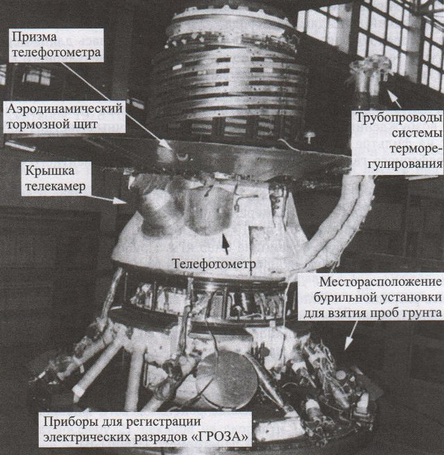
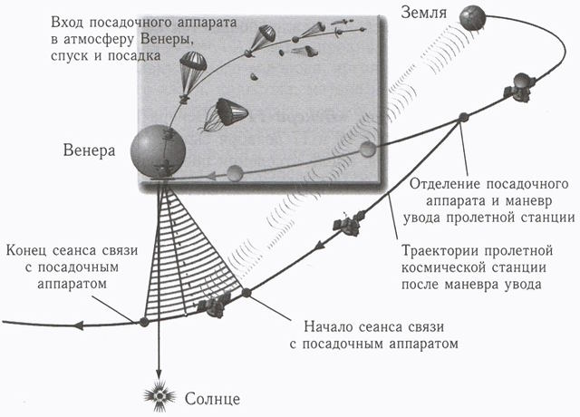
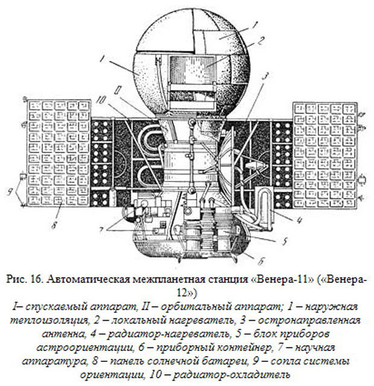

# Venera 11, 12
> 2019.12.16 ┊ **🚀 [despace](index.md)** → [Venus](venus.md), **[Project](project.md)**

[TOC]

---

> <small>*Terms:* **Венера-11** — Russian term with no analogues in English. **Venera 11** — English equivalent.</small>
> <small>**Венера-12** — Russian term with no analogues in English. **Venera 12** — English equivalent.</small>

**Venera 11** (**Венера-11**) and **Venera 12** (**Венера-12**) were Soviet unmanned space mission parts to Venus.

 

|*Type*|*[Param.](si.md)*|
|:--|:--|
|**Mission:**|• • •|
|Cost| … or … kg of [gold](sc_price.md) |
|Development| … |
|Duration| **Venera 11:** Travel: 3 months and 16 days, Lander: 95 minutes  **Venera 12:** Travel: 3 months and 6 days, Lander: 110 minutes |
|Launch| **Venera 11:** September 9, 1978, 03:25:39 UTC  **Venera 12:** 14 September 1978, 02:25:13 UTC Rocket: Proton-K/D-1 8K82K |
|Operator| Soviet Academy of Sciences |
|Programme| Venera programme |
|Similar  missions| • Proposed: [Vega 1 and 2](vega_1_2.md)  • Current: [Pioneer Venus 1.md](pioneer_venus_1.md), [Pioneer Venus 2.md](pioneer_venus_2.md)  • Past: [Venera 5 and 6](venera_5_6.md), [Venera 7](venera_7.md), [Venera 8](venera_8.md), [Mariner 10](mariner_10.md), [Venera 9 and 10](venera_9_10.md) |
|Target| To study the planet Venus and interplanetary space. |
|[Type](sc.md)| Flyby spacecraft; atmospheric spacecraft; lander spacecraft |
|**Spacecraft:**|• • •|
|Comms| Orbiter: high gain parabolic antenna |
|Composition| Orbiter; Lander |
|Contractor| … |
|[ID](spaceid.md)| **Venera 11:** NSSDC ID (COSPAR ID): [1978-084A ⎆](https://nssdc.gsfc.nasa.gov/nmc/spacecraft/display.action?id=1978-084A), [1978-084D ⎆](https://nssdc.gsfc.nasa.gov/nmc/spacecraft/display.action?id=1978-084D), SCN: [11020 ⎆](http://www.n2yo.com/satellite/?s=11020), [11027 ⎆](http://www.n2yo.com/satellite/?s=11027)  **Venera 12:** NSSDC ID (COSPAR ID): [1978-086A ⎆](https://nssdc.gsfc.nasa.gov/nmc/spacecraft/display.action?id=1978-086A), [1978-086C ⎆](https://nssdc.gsfc.nasa.gov/nmc/spacecraft/display.action?id=1978-086C), SCN: [11025 ⎆](http://www.n2yo.com/satellite/?s=11025), [12028 ⎆](http://www.n2yo.com/satellite/?s=11028) |
|Manufacturer| Lavochkin |
|Mass| **Venera 11** Launch: 4 447 kg ([large satellite](sc.md), [EVN‑073](venus.md)), Landing: 731 kg  **Venera 12** Launch: 4 458 kg ([large satellite](sc.md), [EVN‑073](venus.md)), Landing: 731 kg |
|Orbit / Site| Heliocentric |
|Payload| The instruments were designed to study the gamma rays of the Sun; the equipment on the landing modules was designed to study the composition of the atmosphere and soil, measure temperature, detect lightning, study scattered solar radiation, as well as to photograph the surface |
|Power| … |

Achieved targets & investigations:

   - **T** — technical; **Draft** — minimum for working with object. **D** — distant exploration; **C** — contact exploration; **F** — fly‑by; **H** — manned flight; **S** — soil sampe return; **X** — technology demonstration
   - **Sections of measurement and observation:**
      - Atmospheric/climate — **Ac** composition, **Ai** imaging, **Am** mapping, **Ap** pressure, **As** samples, **At** temperature, **Aw** wind speed/direction.
      - General — **Gi** planet’s interactions with outer space.
      - Soil/surface — **Sc** composition, **Si** imaging, **Sm** mapping, **Ss** samples.

<small>

|*EVN‑XXX*|*T*|*EN*|*Section of m&o*|*D*|*C*|*F*|*H*|*S*|
|:--|:--|:--|:--|:--|:--|:--|:--|:--|
|EVN‑001||Atmosphere: model, draft.|  |D|C|F|||
|EVN‑003|T|Exploration: from inside of atmosphere.|  |D|C||||
|EVN‑005|T|Exploration: from Venusian orbit.|  |D||F|||
|EVN‑006|T|Exploration: from surface.|  ||C||||
|EVN‑010||Atmosphere: vertical model.|  |D|||||
|EVN‑012||Atmosphere: lightnings.|  |D|||||
|EVN‑013||Atmosphere: illumination of the surface & the atmo layers.|  |D|||||
|EVN‑014||Atmosphere: composition.|  |D|||F||
|EVN‑016||Atmosphere: clouds, their structure.|  |D||F|||
|EVN‑017||Atmosphere: structure.|  |D|||||
|EVN‑018||Atmosphere: clouds, their chemistry.|  |D||F|||
|EVN‑055|T|Atmosphere: sample obtaining & analysis.|  ||C||||
|EVN‑062|T|Surface: obtaining & analysis of the surface samples.|  ||C|||S|
|EVN‑073|T|Exploration with [satellites](sc.md): large satellites.|  |D||F|||
|EVN‑077||Atmosphere: chemical elements distribution.|  |D||F|||
|EVN‑092|T|Serve as a relay to Earth for stand‑alone SC/instruments.|  |D|||||
|EVN‑093|T|Atmosphere/surface imaging.|  |D||F|||
|EVN‑097||Atmosphere: effect of solar Rad & interplanetary space on the atmo.|  |D||F|||

</small>

 

## Mission
Venera 11 was launched on 9 September 1978 at 03:25:39 UTC. Venera 12 was launched on 14 September 1978 at 02:25:13 UTC.

Venera 11 separated from Orbiter on December 23, 1978, Venera 12 on December 19. Despite the fact that Venera 12 was launched later, the separation of the lander and its landing on the surface were faster than Venera 11, as Venera 12 reached a faster trajectory with the help of correction maneuvers.

Both lander entered the atmosphere of Venus at a speed of 11.2 m/s 2 days after separation from the orbiters, descended for one hour and landed at a speed of about 7 — 8 m/s on the day side of the planet ([EVN‑006](venus.md)). Lander Venera 11 worked on the surface of the planet for 95 min. The Venera 12's lander transmitted from the planet's surface for 110 min until the Orbiter went below the horizon, so it is not known when it failed.

After performing the withdrawal maneuver, each space station flew near Venus at a distance of about 35 000 km ([EVN‑005](venus.md)), transmitting data to Earth from its lander throughout the descent and work on the planet's surface ([EVN‑092](venus.md)). The last signals from space stations were received in January 1980 (Venera 11) and in March 1981 (Venera 12).

**Results**

**Measurements during atmospheric descent** ([EVN‑003](venus.md), [001](venus.md)).

According to the accelerometer at the entrance to the atmosphere was measured atmospheric density in the altitude range from 100 to 65 km. With instruments to measure temperature and atmospheric pressure was carried out direct in situ measurements of these parameters from 61 km up to the surface ([EVN‑010](venus.md)). The opacity of the atmosphere was measured in the range of heights from 64 km to the surface, the chemical composition of aerosols ([EVN‑018](venus.md)) − from 64 to 49 km. Aerosol scattering was measured from 51 km to the surface, and thunderstorm activity − from 60 km to the surface ([EVN‑012](venus.md)). The gas chromatograph analyzed nine atmospheric samples at altitudes ranging from 42 km to the surface. The new mass-spectrometer measured the composition of the atmosphere in the range from 32 to 1 km. Altitude profiles of horizontal wind speed and direction were obtained from measurements of Doppler frequency shift of the radio transmitter ([EVN‑010](venus.md)).

According to the spectrometer, the first more or less realistic profile of the content of water vapor in the atmosphere was constructed, which serve as the second most important (after carbon dioxide) greenhouse gas in the atmosphere of Venus. Measurements of Venera 11 and Venera 12 indicated a decrease in water vapor content from 200 ppm at the base of the cloud layer to 20 ppm at the surface (many years later, when re-analysis of the data were refined and spoke about a constant vapor content at about 30 ppm from 50 km to the surface). Data from the mass-spectrometers of the Venera 11 and 12 lander resulted in values of relative water vapor content up to 0.5% at 44 km and up to 0.1% at 24 km, which was significantly higher than those obtained by spectrometers and other remote spectral measurements from Earth, so they were considered doubtful.

Based on the analysis of 176 full spectra of 22 samples taken ([EVN‑055](venus.md)), the following results of mass spectrometry measurements were obtained ([EVN‑077](venus.md)):

|*Chemical element / compound*|*The amount in the atmosphere*|
|:--|:--|
| Carbon dioxide | 97% |
| Molecular nitrogen | 4.5 ± 0.5% |
| Argon | 110 ± 20 ppm |
| Neon | 8.6 ± 4 ppm |
| Krypton | 0.6 ± 0.2 ppm |
|**Isotopic ratios**|**Value**|
| Carbon (13C/12C) | 0.0112 ± 0.0002 |
| Argon (40Ar/36Ar) | 1.19 ± 0.07 |
| Argon (38Ar/36Ar) | 0.197 ± 0.002 |

The gas chromatograph made eight measurements between 42 km and the surface with the following results ([EVN‑077](venus.md)):

|*Chemical element / compound*|*The amount in the atmosphere*|
|:--|:--|
| Molecular nitrogen | 2.5% ± 0.3% |
| Water vapor | 25-100 ppm |
| Argon | 40 ± 10 ppm |
| Sulfur dioxide | 130 ± 35 ppm |
| Carbon monoxide | 28 ± 7 ppm (small heights) |
| Molecular oxygen | less than 20 ppm |
| Krypton | detected |
| Hydrogen sulfide | detected |
| Carbonyl sulfide | detected |

The study of optical spectra revealed a wide absorption band, which has not yet been identified with known gases.

The Venera 12's x-ray fluorescence spectrometer measured cloud particles at an altitude of 64 to 49 km, and then failed to withstand the high ambient temperature. It did not find sulfur in cloud inclusions (at the upper detection threshold < 0.1 mg/m³), but found chlorine (0.43 ± 0.06 mg/m³). Also, with its help, it was possible to completely eliminate mercury at a concentration of up to one billionth ([EVN‑018](venus.md)).

During the descent at an altitude of 32 to 2 km, Venera 11 and Venera 12 registered a large number of electromagnetic pulses similar to distant thunderstorms on Earth ([EVN‑012](venus.md)). The activity was higher in the case of Venera 11 than in the case of Venera 12, and the intensity decreased toward the surface. After landing, Venera 11 did not register such pulses, but one intense burst was noted by Venera 12 already on the surface. The microphones were in saturation mode due to aerodynamic noise during descent and did not register acoustic noise on the surface.

The Venera 11 nephelometer measured cloud particles during the descent, and its results confirmed the homogeneity of the cloud layers ([EVN‑016](venus.md)). The main cloud layer was localized between 51 and 48 km, with fog underneath. Photometric measurements confirmed that only 3 − 6% of sunlight reaches the surface, and intense Rayleigh scattering in a dense atmosphere greatly impairs visibility. The horizon was visible at surface level, but details of the landscape were rapidly disappearing in an orange haze. There was no sun disk to be seen, the light of the Sun almost uniformly flooding the misty sky ([EVN‑013](venus.md)).

**Measurements on the surface** ([EVN‑006](venus.md)).

The temperature at the landing site of Venera 11 reached 458 ± 5 °C, and the pressure 91 ± 2 bar. The image of the surface could not be obtained because the camera covers did not open. The drill took a soil sample, but could not properly deliver it to the instrument compartment, and the soil analysis could not be performed.

The temperature at the landing site of Venera 12 was equal to 468 ± 5 °C, and the pressure 92 ± 2 bar. This lander also experienced problems with the camera, indicating a design flaw. No soil analysis was carried out. This time the reason was that during the descent of the vibration destroyed the system of delivery on the drill samples taken and measurements became impossible. The penetrometer also failed on both landers.

**Venera 11 and Venera 12 flyby spacecraft**

The ultraviolet spectrometer registered emissions of hydrogen atoms in the Lyman-alpha line and helium atoms in the He-I 584 A line. This allowed to determine the temperature and density of the upper atmosphere. On February 13 and March 17, 1980, observations of comet Bradfield were made using the extreme ultraviolet spectrometer on Venera 12.

 

## Science goals & payload

   - Obtaning a more accurate elemental composition of the atmosphere ([EVN‑014](venus.md)). For these purposes, the spacecraft had a mass spectrometer, a gas chromatograph and an optical spectrometer, a nephelometer to study the aerosol component of the atmosphere, an x-ray fluorescence spectrometer to assess the chemical and elemental composition of the cloud layer particles ([EVN‑018](venus.md)), a device to measure the electrical activity of the atmosphere ([EVN‑012](venus.md)), specialized sensors for oxygen and moisture, and an experimental solar;
   - Obtaining new color panoramas of the surface of Venus at using telephotometers with a set of color filters ([EVN‑093](venus.md));
   - Detailed analysis of the Venusian soil. To do this, the station installed a soil sampling device, x-ray fluorescence analyzer and a device for measuring the physical and mechanical characteristics of the soil «Prop-4B1».

Venera 11 and Venera 12 spacecrafts completely duplicated each other, carrying the same set of scientific equipment.

**Orbiter**

   - 30 – 166 nm Extreme ultraviolet spectrometer − covered the spectral lines of atomic hydrogen, helium, oxygen and other chemical elements that were expected to be present in the exosphere of Venus.;
   - Compound plasma spectrometer;
   - **KONUS** Gamma-ray burst detector − was designed to detect and identify gamma-ray burst sources during interplanetary flight. On the basis of these measurements, it was assumed to triangulate individual flashes from the coordinates of the two space stations Venus and the artificial earth satellite Prognoz;
   - **SNEG** Gamma-ray burst detector − complemented the measurements;
   - Magnetometer;
   - High-energy particle detectors − included 4 semiconductor counters, 2 gas-discharge counters and 4 scintillation counters;
   - Solar wind detector − was a hemispherical proton telescope.

**Lander**

**Instruments for operation during re-entry, descent and landing:**

   - Backscatter Nephelometer − determined the structure of the atmosphere ([EVN‑017](venus.md)) in the range of heights from 105 to 70 km to study the spatial heterogeneity of cloud layers in different regions of the planet ([EVN‑016](venus.md));
   - Bennett radio frequency mass spectrometer **MKh-6411** − determined the chemical and isotopic composition of the atmosphere ([EVN‑014](venus.md));
   - Gas chromatograph – **Sigma**, determined the composition of the atmosphere (based on Neon) ([EVN‑014](venus.md));
   - X-Ray fluorospectrometer for estimation of chemical and elemental composition of cloud layer particles ([EVN‑018](venus.md));
   - 360° Scanning photometer – **IOAV**;
   - Scanning spectrophotometer − studies the scattering and absorption of solar radiation in the atmosphere ([EVN‑097](venus.md)). It measured radiation from the Zenith every 10 seconds using an interference filter with a resolution of 20 nm in a continuous spectrum from 430 to 1170 nm;
   - Microphone/anemometer;
   - Low-frequency radio sensor;
   - 4 Thermometers (for heights from 50 km to the surface);
   - 3 Barometers (for heights from 50 km to the surface);
   - Accelerometer – **Bizon**  to determine the structure of the atmosphere in the range of heights from 105 to 70 km ([EVN‑017](venus.md));
   - Small solar batteries – **MSB**.
   - Instrument **GROZA**. It included an acoustic detector and an electromagnetic wave detector. Measurements were carried out using four narrowband receivers at 10, 18, 36 and 80 kHz, as well as using a broadband receiver 8 − 95 kHz. The instrument began measuring at an altitude of 60 km and continued to work until the landing of the lander on the surface. The electromagnetic wave detector could detect lightning discharges and acoustic signals that could be interpreted as accompanying thunder, as well as wind speed relative to the lander during descent and even possible seismic activity on the surface.

**Instruments for surface operation:**

   - Penetrometer – **PrOP-V**. It was located on a retractable manipulator. The results of his measurements were recorded on a scale, the readings of which were read by the camera;
   - Drill with analyzer based on X-ray fluorescence spectrometer **Арахис**. The drill, mounted on an annular shock absorber, was to drill a soil sample and then feed it through a pressure reduction system (airlock) to an X-ray fluorescence spectrometer inside the lander ([EVN‑062](venus.md)).
   - Two panoramic color TV cameras.

|*Characteristic*|*Value*|
|:--|:--|
|Filters| Transparent, Red, Green, Blue |
|Quality| 252 x 1024 pixels |
|Coding| 9 bits |
|Parity check| 1 bit |
|Spatial resolution (at distance of about 1.5 m)| 4 – 5 mm |
|Transmission bandwidth| 3 072 bits/s |

 

## Spacecraft

   1. Lander;
      - External thermal insulation;
      - Local heater;
   2. Orbiter;
      - Highly directional antenna;
      - Radiator-heater;
      - The instrument cluster;
      - Instrument container;
      - Scientific equipment;
      - Solar panel;
      - Orientation system nozzles;
      - Radiator-cooler.

The spacecraft were generally identical to the preceding Venera 9 and 10 (Venera 11 and Venera 12 orbiters were built on the basis of 4MV, variant 4V-1, like [Venera 9](venera_9_10.md), [Venera 10](venera_9_10.md)). The data relay rate from the landers was increased to 3 Kb/s per channel. The configuration of the landing craft differed in the absence of illumination lamps, camera lens covers were also redesigned. Simplified scheme entry parachute system and reduced its mass. Instead of two successively introduced supersonic braking parachutes, one remained, and also instead of a system of three main parachutes, only one was left. Some scientific instruments were redesigned, others were added, and some instruments were mounted on the shock absorber ring.

|*Parameter*|*Value*|
|:--|:--|
| Launch mass of Venera 11 | 4 450 kg |
| Launch mass of Venera 12 | 4 461 kg |
| Flyby spacecraft's mass (without fuel) | 2 127 kg |

| Lander's mass (with atmosphere entry system) | 1 600 kg |
| Lander's mass | 731 kg |

The spacecraft has a height of 2.8 m and a solar panel span of 6.7 m. The central section of the bus has a diameter of about one meter and contained propellant. The main engine (KRD-425A) is encircled by a conical instrument compartment with the diameter of 2.35 m at the base.

 

## Community, library, links

**PEOPLE:**

   - [Vladimir Pavlovich Dolgopolov](02_dolgopolov1.md) (Долгополов Владимир Павлович)

**COMMUNITY:**

<mark>TBD</mark>

 

## Docs & links
|…°·•¹²³±×÷≤≥≈≠ ‑ −— ⎆✉ ❐“”’«»✔→✘☐☑├┕┆ 1 lb = 0.453592 kg; 1 g = 9.80665 m/s²|
|:--|
|<small>**[FAQ](faq.md)**, **[Cable](cable.md)**·БКС, **[Camera](camera.md)**·Камера, **[Comms](comms.md)**·Радиосв., **[Contact](contact.md)**·Контакт, **[Control](control.md)**·Управ., **[Doc](doc.md)**·Док., **[Doppler](doppler.md)**·ИСР, **[DS](ds.md)**·ЗУ, **[EB](eb.md)**·ХИТ, **[ECO](ecology.md)**·Экол., **[EF](ef.md)**·ВВФ, **[ElC](elc.md)**·ЭКБ, **[EMC](emc.md)**·ЭМС, **[Errors](error.md)**·Ошибки, **[Events](event.md)**·События, **[FS](fs.md)**·ТЭО, **[Fuel](fuel.md)**·Топливо, **[GNC](gnc.md)**·БКУ, **[GS](scs.md)**·НС, **[HF&E](hfe.md)**·Эргоном., **[IMU](imu.md)**·Гироскоп, **[Incubator](incubator.md)**·Инкуб., **[KT](kt.md)**·КТЕХ, **[LAG](lag.md)**·ПУC, **[LES](les.md)**·САСП, **[LS](ls.md)**·СЖО, **[LV](lv.md)**·РН, **[MAG](mag.md)**·Магнитом., **[MCC](mcc.md)**·ЦУП, **[Model](model.md)**·Модель, **[MSC](sc.md)**·ПКА, **[N&B](nnb.md)**·БНО, **[NR](nr.md)**·ЯР, **[OBC](obc.md)**·ЦВМ, **[OE](oe.md)**·БА, **[Patent](патент.md)**·Патент, **[Project](project.md)**·Проект, **[PS](ps.md)**·ДУ, **[QA](quality.md)**·QA, **[R&D](rnd.md)**·НИОКР, **[RAMS](rams.md)**·НиБ, **[Risk](risk.md)**·Риск, **[Robot](robotics.md)**·Робот, **[Rover](rover.md)**·Планетоход, **[RTG](rtg.md)**·РИТЭГ, **[RW](rw.md)**·ДМ, **[SARC](sarc.md)**·ПСК, **[Sensor](sensor.md)**·Датчик, **[SC](sc.md)**·КА, **[SCS](scs.md)**·КК, **[SGM](sgm.md)**·КММ, **[SI](si.md)**·СИ, **[Soft](soft.md)**·ПО, **[SP](sp.md)**·БС, **[Spaceport](spaceport.md)**·Космодром, **[SPS](sps.md)**·СЭС, **[SSS](sss.md)**·ГЗУ, **[TCS](tcs.md)**·СОТР, **[Test](test.md)**·ЭО, **[Timeline](timeline.md)**·Циклограмма, **[TMS](tms.md)**·ТМС, **[TOR](tor.md)**·ТЗ, **[TRL](trl.md)**·УГТ</small>|
|*Sections & pages*|
|**··•  •··**  <mark>NOCAT</mark> |

**Docs:**

   1. П. С. Шубин — Венера. Неукротимая планета. Издание второе, расширенное и дополненное. М.: Издательство «Голос‑Пресс»; Кемерово: издатель П. С. Шубин, 2018. – 352 стр.: ил.

**Links:**

   1. Notable interwikies — …
   1. <https://en.wikipedia.org/wiki/Venera_11>
   1. <https://en.wikipedia.org/wiki/Venera_12>
   1. <https://galspace.spb.ru/index499.html> *(архив [от 2019.12.21 ❐](f/project/venera_11_12/doc001.pdf))*
