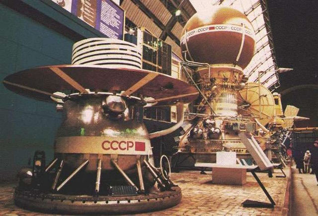
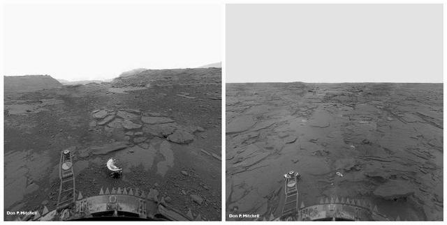
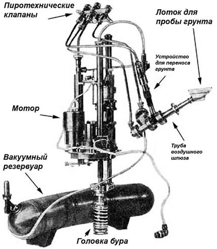
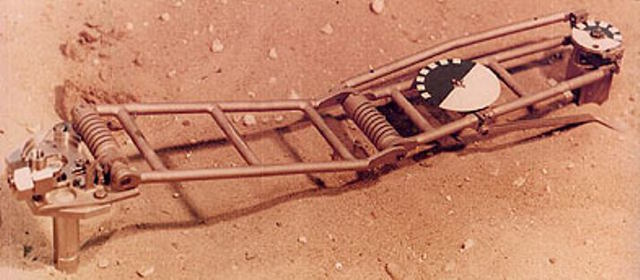
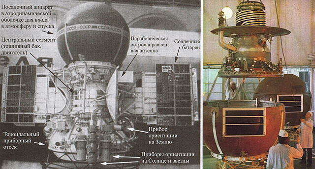
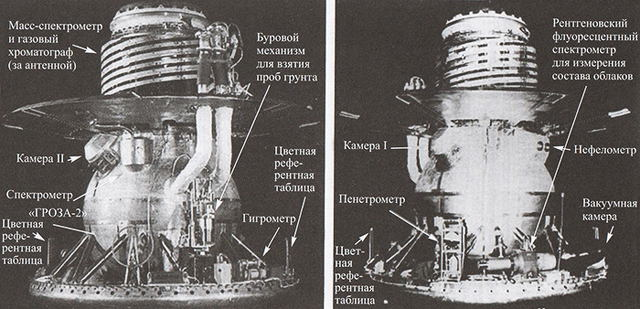

# Venera 13, 14
> 2019.12.16 [🚀](../index/index.md) [despace](index.md) → [Venus](venus.md), **[Project](project.md)**

[TOC]

---

> <small>**Венера‑13** — RU term w/o analogues in English. **Venera 13** — English equivalent.</small>
> <small>**Венера‑14** — RU term w/o analogues in English. **Venera 14** — English equivalent.</small>

**Venera 13** and **Venera 14** were spacecraft in the Soviet Venera program for the exploration of Venus.

 

|*Type*|*[Param.](si.md)*|
|:--|:--|
|**【Mission】**|• • •|
|Cost|… or … ㎏ of [gold](sc_price.md)|
|Development|…|
|Duration|**Venera 13:** Travel: 4 months, 2 days, Lander: 127 minutes  **Venera 14:** Travel: 4 months and 1 day, Lander: 57 minutes|
|Launch|**Venera 13:** October 30, 1981, 06:04:00 UTC, Rocket: Proton-K/D-1 8K82K  **Venera 14:** November 4, 1981, 05:31:00 UTC, Rocket: Proton-K/D-1 8K82K|
|Operator|Soviet Academy of Sciences|
|Programme|Venera programme|
|Similar to|・Proposed: …   ・Current: …   ・Past: [Venera 5 and 6](venera_5_6.md), [Venera 7](venera_7.md), [Venera 8](venera_8.md), [Venera 9 and 10](venera_9_10.md), [Venera 11 and 12](venera_11_12.md), [Vega 1 and 2](vega_1_2.md)|
|Target|Panoramic photography of Venus, sampling and analysis of the soil, the study of the atmosphere.|
|[Type](sc.md)|Fly‑by spacecraft; atmospheric spacecraft; lander spacecraft|
|**【Spacecraft】**|• • •|
|Comms|Orbiter: high‑gain parabolic antenna|
|Composition|Orbiter / Lander|
|Contractor|…|
|[ID](spaceid.md)|**Venera 13:** NSSDC ID (COSPAR ID): [1981-106A ⎆](https://nssdc.gsfc.nasa.gov/nmc/spacecraft/display.action?:id=1978-106A), [1981-106D ⎆](https://nssdc.gsfc.nasa.gov/nmc/spacecraft/display.action?:id=1978-106D), SCN: [12927 ⎆](http://www.n2yo.com/satellite/?:s=12927), [15599 ⎆](http://www.n2yo.com/satellite/?:s=15599)  **Venera 14:** NSSDC ID (COSPAR ID): [1981-110A ⎆](https://nssdc.gsfc.nasa.gov/nmc/spacecraft/display.action?:id=1978-110A), [1981-110D ⎆](https://nssdc.gsfc.nasa.gov/nmc/spacecraft/display.action?:id=1978-110D), SCN: [12939 ⎆](http://www.n2yo.com/satellite/?:s=12939), [15600 ⎆](http://www.n2yo.com/satellite/?:s=15600)|
|Manufacturer|NPO Lavochkin|
|Mass|**Venera 13** Launch: 4 397.85 ㎏ ([large satellite](sc.md), [EVN‑073](venus.md)), Landing: 760 ㎏  **Venera 14** Launch: 4 394.5 ㎏ ([large satellite](sc.md), [EVN‑073](venus.md)), Landing: 760 ㎏|
|Orbit / Site|**Venera 13:** Heliocentric 0.70 x 0.99 AU; i = 2.3°; T = 285 days  **Venera 14:** Heliocentric 0.71 x 0.99 AU; i = 2.3°; T = 286 days|
|Payload|2 cameras, accelerometer, thermometer, barometer, nephelometer, spectrometers (including mass, fluorescent), photometer, hydrometer, radio seismograph, chromographs, drill and penetrometer|
|Power|…|

Achieved targets & investigations:

   - **T** — technical; **C** — contact research; **D** — distant research; **F** — fly‑by; **H** — manned; **S** — soil sample return; **X** — technology demonstration
   - **Sections of measurement and observation:**
      - Atmospheric/climate — **Ac** composition, **Ai** imaging, **Am** mapping, **Ap** pressure, **As** samples, **At** temperature, **Aw** wind speed/direction.
      - General — **Gi** planet’s interactions with outer space.
      - Soil/surface — **Sc** composition, **Si** imaging, **Sm** mapping, **Ss** samples.

<small>

|*EVN‑XXX*|*T*|*EN*|*Section of m&o*|*D*|*C*|*F*|*H*|*S*|
|:--|:--|:--|:--|:--|:--|:--|:--|:--|
|EVN‑003|T|Exploration: from inside of atmosphere.| |D|C| | | |
|EVN‑005|T|Exploration: from Venusian orbit.| |D| |F| | |
|EVN‑006|T|Exploration: from surface.| | |C| | | |
|EVN‑013| |Atmosphere: illumination of the surface & the atmo layers.| |D| | | | |
|EVN‑014| |Atmosphere: composition.| |D| | |F| |
|EVN‑016| |Atmosphere: clouds, their structure.| |D| |F| | |
|EVN‑017| |Atmosphere: structure.| |D| | | | |
|EVN‑018| |Atmosphere: clouds, their chemistry.| |D| |F| | |
|EVN‑024| |Surface: composition.| | |C| | | |
|EVN‑025| |Surface: morphology| |C| | | | |
|EVN‑026| |Surface: elemental composition.| | |C| | | |
|EVN‑062|T|Surface: samples obtaining & analysis, incl. in different places.| | |C| | |S|
|EVN‑063|T|Surface: panoramic imaging.| | |C| | | |
|EVN‑073|T|Exploration with [satellites](sc.md): large satellites.| |D| |F| | |
|EVN‑074| |Meteorological model.| |D| |F| | |
|EVN‑077| |Atmosphere: chemical elements distribution.| |D| |F| | |
|EVN‑092|T|Serve as a relay to Earth for stand‑alone SC/instruments.| |D| | | | |
|EVN‑093|T|Atmosphere/surface imaging.| |D| |F| | |

</small>

 

## Mission
Venera 13 and 14 were identical spacecraft built to take advantage of the 1981 Venus launch opportunity and launched 5 days apart, Venera 13 on 30 October 1981 at 06:04 UTC and Venera 14 on 4 November 1981 at 05:31 UTC, both with an on‑orbit dry mass of 760 ㎏. Each mission consisted of a fly‑by and a landing craft. The landing site was chosen in collaboration with scientists from the United States using maps based on radar measurements made by the Pioneer Venus Orbiter in 1978.

**ORBITER**

As the Orbiter flew by Venus, it acted as a data relay ([EVN‑092](venus.md)) for the lander and then continued on into a heliocentric orbit. It was equipped with scientific instruments which made measurements before, during, and after the Venus fly‑by ([EVN‑005](venus.md)).

Both Orbiters transmitted data on solar wind and x‑ray flares on the Sun. With their participation, an interplanetary network was formed, designed to triangulate gamma‑ray bursts, which allowed 150 such events to be recorded. Later that decade, the [VeGa](vega_1_2.md) space station would fly near Venus and then meet Halley’s comet. Therefore, after the fly‑by at Venus, the stations Venera 13 and Venera 14 later turned on the engines in order to practice the maneuver, which may be required in the implementation of further programs.

After launch and a four-month cruise to Venus the descent vehicles separated from the cruise stages and plunged into the Venusian atmosphere on 1 March 1982 (Venera 13) and 5 March 1982 (Venera 14).

**LANDER. Venera 13**

**Descent**

The accelerometer turned on at an altitude of 100 ㎞ and carried out measurements of atmospheric density until the opening of the parachute. The parachute opened at an altitude of 62 ㎞, and after 9 min was unhooked at an altitude of 47 ㎞. Scientific instruments turned on immediately after the opening of the main parachute, and the descent time from the moment of opening the parachute to landing was a little more than an hour ([EVN‑003](venus.md)).

The nephelometer data on the structure and microphysical characteristics of the atmosphere ([EVN‑017](venus.md)) confirmed the results that the main cloud system consists of three different layers of clouds: the dense upper layer from 62 ㎞ (the beginning of the measurement) to 57 ㎞, the less dense layer from 57 to 50 ㎞, and the densest layer from 50 to 48 ㎞ ([EVN‑016](venus.md)). According to Doppler shear measurements, high‑altitude horizontal wind profiles were constructed and turbulence estimates were made.

The humidity sensor showed ten times more water content in the atmosphere than was obtained by spectrometric method in the range of heights from 46 to 50 ㎞. the Amount of water vapor at an altitude of 48 ㎞ was estimated at 0.2 %.

New mass-spectrometer data showed an increased neon content at altitudes from 26 ㎞ to the surface. The ratio of 40argon/36argon is 4 times lower than the Earth’s. The gas chromatograph recorded several new and refined contents of previously detected atmospheric gas constituents, including molecular hydrogen, hydrogen sulfide, and carbonyl sulfide. Other reported components included molecular oxygen, water vapor, krypton, and sulfur hexafluoride ([EVN‑077](venus.md)).

**Surface**

Venera 13 landed at around 7 – 8 ㎧ at 7.55 °S 303.69 °E, just east of the eastern extension of an elevated region known as Phoebe Regio.

The area was composed of bedrock outcrops surrounded by dark, fine-grained soil ([EVN‑006](venus.md)). After landing, an imaging panorama was started. Venera 13 transmitted both black-and-white and the first color panoramic images from the surface of Venus ([EVN‑063](venus.md)). A mechanical drilling arm reached to the surface and obtained a sample, which was placed in a three stage airlock sealed chamber ([EVN‑062](venus.md)), maintained at 30 ℃ and a pressure of about 5 ㎪. Information about the drilling speed and movement of the rig rod, the depth of penetration of the drill and the amount of current consumed by the motor during drilling, allowed to find out the physical and mechanical properties of the surface. The composition of the sample determined by the X‑ray fluorescence spectrometer (plutonium, uranium-235 and iron-55 were used as radiation sources) put it in the class of weakly differentiated melanocratic alkaline gabbroids ([EVN‑026](venus.md)).

The lander functioned for at least 127 min (the planned design life was 32 min) in an environment with a temperature of 457 ℃ and a pressure of 89 atm. Only 2.4 % of the sunlight reached the surface ([EVN‑013](venus.md)). The lander transmitted data to the Orbiter, which acted as a data relay as it flew by Venus ([EVN‑092](venus.md)).

Microphones on the probe recorded atmospheric wind noises in an effort to measure wind speed (they also recorded noises associated with the probe’s equipment). This was the first recording of sound on another planet. The recording was repeated with Venera 14.

**LANDER. Venera 14**

**Descent**

The parameters of the descent of Venera 14 were similar to the descent of Venera 13.

X‑ray fluorescence spectrometer measured the composition of cloud aerosols at altitudes from 63 to 47 ㎞. It registered sulfur in the amount of 1.07 ± 0.13 mg/m³ and chlorine in the amount of 0.167 ± 0.04 mg/m³ ([EVN‑018](venus.md))

The Venera 14 lander performed the same set of measurements during descent in the atmosphere and after landing as Venera 13, and obtained very similar results. Below are the combined results of mass spectroscopic measurements on both devices ([EVN‑014](venus.md)):

|*Chemical element / compound*|*The amount in the atmosphere*|
|:--|:--|
|Carbon dioxide|97 %|
|Molecular hydrogen|4.0 ± 0.3 %|
|Argon|100 ppm|
|Neon|7.6 ppm|
|Krypton|0.035 ppm|
|Xenon|≤0.020 ppm|

The ratio of isotopes:

|*Isotopic ratios*|*Value*|
|:--|:--|
|Carbon (13C/12C)|0.0108|
|Argon (40Ar/36Ar)|1.11 ± 0.02|
|Argon (38Ar/36Ar)|0.183 ± 0.003|
|Neon (20Ne/22Ne)|12.15 ± 0.1|

Gas chromatograph measurements yielded the following values:

|*Chemical element / compound*|*The amount in the atmosphere*|
|:--|:--|
|Water vapor|700 ± 300 ppm|
|Molecular oxygen|18 ± 4 ppm|
|Molecular hydrogen|25 700 ± 10 ppm|
|Krypton|0.77 ± 0.3 ppm|
|Hydrogen sulfide|80 700 ± 40 ppm|
|Carbonyl sulfide|40 700 ± 20 ppm|
|Sulfur hexafluoride|0.27 ± 0.1 ppm|

**Surface**

Venera 14 landed at 13.055 °S 310.19 °E (about 950 ㎞ southwest of Venera 13) near the eastern flank of Phoebe Regio on a basaltic plain ([EVN‑006](venus.md)).

The lander functioned for at least 57 min (the planned design life was 32 min) in an environment with a temperature of 465 ℃ and a pressure of 94 atm. Telemetry had been maintained by means of the Orbiter that carried signals from the Lander’s uplink antenna ([EVN‑092](venus.md)).

Similar to Venera 13, panoramic images of the planet’s surface were taken. For all time from two cameras 22 panoramas were transferred: 8 black-and-white, 5 through red, 5 through green, and 4 through a blue light filter ([EVN‑063](venus.md)).

Panorama of Venus in a spherical projection, after correcting the perspective. On the left is camera 1 of Venera 13, on the right is camera 1 of Venera 14.

The Lander was equipped with acoustic microphones designed to record atmospheric noise which was later used in calculations to determine the average wind speed on the Venusian surface. Later analysis of said data determined the average wind speed at the surface to be between 0.3 and 0.5 ㎧ (|[EVN‑074](venus.md)).

The composition of the surface samples showed similarities with oceanic tholeiitic basalts ([EVN‑026](venus.md)).

The results of the analysis of the elemental composition of Venusian rocks according to measurements using x‑ray fluorescence spectrometer:

|*Chemical element*|*Value, % (Venera 13)*|*Value, % (Venera 14)*|
|:--|:--|:--|
|Silicon|45|49|
|Titanium|1.6|1.3|
|Aluminum|16|18|
|Iron|9.3|8.8|
|Manganese|0.2|0.2|
|Magnesium|11|8.1|
|Calcium|7.1|10|
|Potassium|4.0|0.2|
|Sulfur|0.65|0.35|
|Chlorine|≤0.3|≤0.4|

Comparison of the composition of typical Venus rocks with the composition of rocks of similar structural and morphological provinces of the Earth indicates some differences in the formation of the surface and crust of the Earth and Venus .

 

## Science goals & payload
The program of the expedition included:

   - delivery of the lander to the planetary region and provision of the required ballistics conditions for the penetration of the lander into the atmosphere of Venus;
   - reportage broadcast on the orbital during the descent of the lander in the atmosphere ([EVN‑003](venus.md)), containing the results of measurements of its basic physical and chemical parameters (pressure, temperature, chemical composition of the atmosphere ([EVN‑014](venus.md)), moisture content in it), the results of studies of the cloud layer ([EVN‑016](venus.md)), atmospheric lightning discharges;
   - landing a lander on the surface of the planet, on its day side;
   - transmission of color telephotometric images ([EVN‑093](venus.md)) of the surface at the landing site and the results of direct soil analysis ([EVN‑062](venus.md)) to the orbiter;
   - relay from orbiter to Earth the results of the scientific program of the lander ([EVN‑092](venus.md));
   - carrying out with the help of orbiter studies of near‑and interplanetary space when moving along the flight path.

The Orbiter payload was reduced to compensate for the increased payload of the Lander. Modified versions of cosmic ray and gamma ray detectors were retained, and an Austrian magnetometer was attached to one of the solar panels on a two-meter rod.

**ORBITER**

   - Detector of intensity and coordinates of gamma‑ray burst sources **KONUS** — was designed to detect and identify gamma‑ray burst sources during interplanetary flight;
   - Detector of intensity and coordinates of gamma‑ray burst sources **SNEG** — complemented the measurements;
   - Magnetometer (Austria);
   - High‑energy particle detectors — included 4 semiconductor counters, 2 gas‑discharge counters and 4 scintillation counters;
   - Detectors of particles of the solar wind.

Orbiter payload mass: 92 ㎏.

**LANDER**

**Instruments for operation during reentry and descent:**

   - Accelerometer **Bison-M** to measure the density of the atmosphere from the fly‑by orbit to 63 ㎞ to analyze the landing pattern of the lander;
   - Temperature and pressure sensors **ITD**;
   - Gas chromatograph **Sigma-2** to study the chemical composition of the atmosphere ([EVN‑014](venus.md)). It was equipped with a detector that could detect more atmospheric components and was capable of operating in the cloud layer;
   - Mass spectrometer **MKh-6411** to study the chemical and isotopic composition of the atmosphere ([EVN‑077](venus.md)). The upgraded mass spectrometer provided significantly better resolution (2 to 40 times) and 10 to 30 times greater sensitivity. The reason for the anomalous measurement of krypton during the 1978 program was understood and appropriate changes were made;
   - Hygrometer **VM-3R** for measuring the content of water vapor in the atmosphere. The humidity sensor was not installed in previous missions;
   - Backscatter Nephelometer **MNV-78-2** — determined the structure of the atmosphere ([EVN‑017](venus.md)) to study the spatial heterogeneity of cloud layers in different regions of the planet ([EVN‑016](venus.md));
   - [X‑ray fluorescence (XRF)](xrf.md) spectrometer **BDRA-1V** for the study of the elemental composition of aerosols ([EVN‑018](venus.md));
   - Spectrometer **IOAV-2** to study the spectral and angular distribution of solar radiation. Measured the radiation spectrum in the range from 470 to 1200 nm using a wide-angle view of the sky and a set of six receivers with a narrow field of view;
   - Ultraviolet photometer in the range from 320 to 390 nm;
   -  Radio receiver **GROZA-2** for the study of electrical activity with a microphone for recording acoustic and seismic vibrations. The **GROZA-2** instrument included a modified 10 ㎑ detector, a new detector in the 2 ㎑ band, and was better suited for measuring seismic activity after landing;
   - On-Board transmitters for measuring wind and turbulence by Doppler shift of the carrier frequency.

**Instruments for operation on the surface of Venus:**

   - Drill and sampling system **[GZU VB-02](sss_lst.md)**;
   - [X‑ray fluorescence (XRF)](xrf.md) spectrometer **Arakhis-2** to study the composition of surface rocks ([EVN‑024](venus.md));
   - Rotating conical penetrometer for measuring the bearing capacity of the soil **PrOP-V**. Designed to determine the mechanical properties of the surface material, regardless of whether it is loose or rock. It consisted of a conical head that could rotate around its axis at the end of a lever and was located directly on the surface;
   - Chemical Redox Indicator **Kontrast** of the oxidation state of the atmosphere. Indicator to search for traces of oxygen in the atmosphere of Venus.
   - Two cameras with light filters for color panoramic images **TFZL-077**

|*Parameter*|*Value*|
|:--|:--|
|Light filter|Neutral / transparent, Red, Green, Blue|
|Viewing angle|180°|
|Transmission speed|64 kbps|

Compared to Venera 11 and Venera 12, the cameras, drill, spectrophotometer, x‑ray spectrometer for aerosols, mass spectrometer and gas chromatograph were improved. The payload mass of the Lander:  100 ㎏.

 

## Spacecraft
   1. Lander;
      - External thermal insulation;
      - Local heater;
   1. Orbiter;
      - Highly directional antenna;
      - Radiator-heater;
      - The instrument cluster;
      - Instrument container;
      - Scientific equipment;
      - Solar panel;
      - Orientation system nozzles;
      - Radiator-cooler.

|*Parameter*|*Mass, ㎏*|
|:--|:--|
|Launch mass of Venera 13|4 397.85|
|Launch mass of Venera 14|4 394.5|
|Fly‑by spacecraft’s mass (with fuel)|2 718|
|Lander’s mass (with atmosphere entry system)|1 645|
|Lander’s mass|760|

**Orbiter**

Venera 13 and Venera 14 were built on the basis of 4MV and were identical to previous spacecraft.

The 4MV spacecraft (short for 4th-generation Mars-Venus Spacecraft) is a designation for a common design used for Soviet unmanned spacecraft to Mars and Venus. It was an incremental improvement of earlier 3MV spacecraft (as, for example, in [Venera 7](venera_7.md) (V-70) and [Venera 8](venera_8.md) (V-72)) and was used for Mars 4 to 7 and Venus missions 9 to 16.

The Orbiter has a height of 2.8 m and a solar panel span of 6.7 m. The central section of the Orbiter has a diameter of about one meter and contained propellant. The main engine (KRD-425A) is encircled by a conical instrument compartment with the diameter of 2.35 m at the base.

**Lander**

The descent lander was a hermetically-sealed pressure vessel, which contained most of the instrumentation and electronics, mounted on a ring‑shaped landing platform and topped by an antenna. At the periphery of the shock absorber ring, metal teeth were added to increase the stability of the spacecraft during the aerodynamic descent and reduce the landing stiffness that took place in the 1978 program. It carried instruments to take chemical and isotopic measurements, monitor the spectrum of scattered sunlight, and record electric discharges during its descent phase through the Venusian atmosphere. The spacecraft utilized a camera system, an X‑ray fluorescence spectrometer, a screw drill and surface sampler, a dynamic penetrometer, and a seismometer to conduct investigations on the surface.

The cameras were installed inside the airtight and thermally insulated compartment and a survey was carried out through a cylindrical window with a periscope system. The design of the covers covering the lenses of television cameras has been discard. 78 tests were conducted to verify their discharge. The soil sampling system was redesigned to eliminate problems encountered on [Venera 11 and Venera 12](venera_11_12.md). In particular, the soil should have been delivered into the chamber using the squib.

 

## Community, library, links

**PEOPLE:**

   1. [Vladimir Pavlovich Dolgopolov](person.md) (Долгополов Владимир Павлович)
   1. Don P. Mitchell — American researcher. He has processed the color images from Venera 13 and 14 using the raw original data.

**COMMUNITY:**

<mark>TBD</mark>

 

## Docs & links
|Navigation|
|:--|
|**[FAQ](faq.md)**【**[SCS](scs.md)**·КК, **[SC (OE+SGM)](sc.md)**·КА】**[CON](contact.md)·[Pers](person.md)**·Контакт, **[Ctrl](control.md)**·Упр., **[Doc](doc.md)**·Док., **[EF](ef.md)**·ВВФ, **[Error](error.md)**·Ошибки, **[Event](event.md)**·События, **[FS](fs.md)**·ТЭО, **[HF&E](hfe.md)**·Эрго., **[KT](kt.md)**·КТ, **[Model](model.md)**·Модель, **[N&B](nnb.md)**·БНО, **[Project](project.md)**·Проект, **[QM](qm.md)**·БКНР, **[R&D](rnd.md)**·НИОКР, **[SI](si.md)**·СИ, **[Test](test.md)**·ЭО, **[TRL](trl.md)**·УГТ, **[Way](way.md)**·Пути|
|*Sections & pages*|
|**【】**  <mark>NOCAT</mark>|

   1. Docs:
      - П. С. Шубин — Венера. Неукротимая планета. Издание второе, расширенное и дополненное. М.: Издательство «Голос‑Пресс»; Кемерово: издатель П. С. Шубин, 2018. – 352 стр.
   1. <https://en.wikipedia.org/wiki/Venera_13>
   1. <https://en.wikipedia.org/wiki/Venera_14>
   1. <http://galspace.spb.ru/index500.html> *(archive [2019.12.22 ❐](f/project/v/venera_13_14/doc001.pdf))*
   1. <https://www.laspace.ru/projects/planets/venus13-14/>
