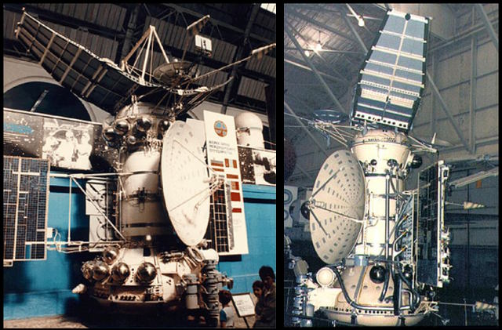
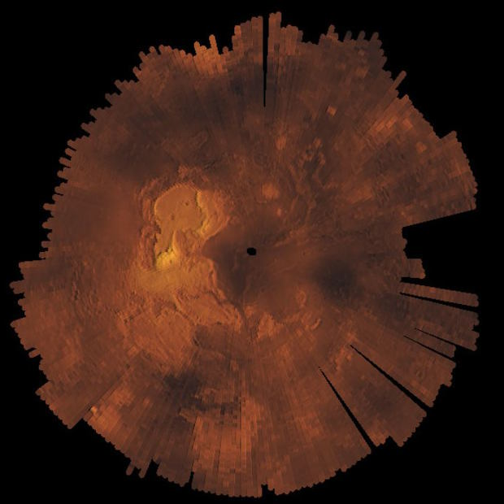
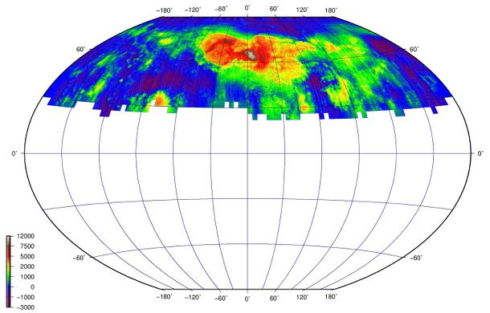
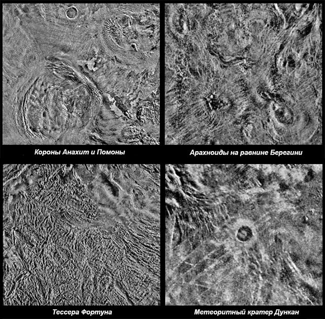
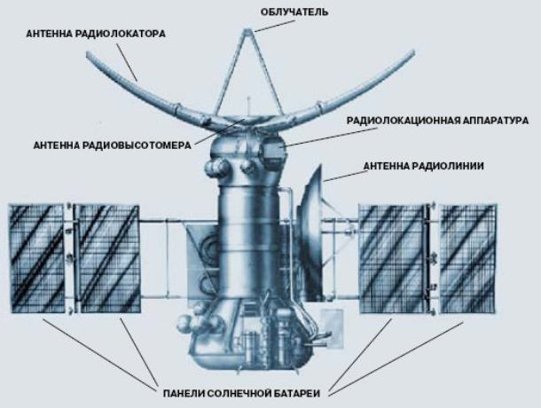

# Venera 15, 16
> 2019.12.16 ┊ **🚀 [despace](index.md)** → [Venus](venus.md), **[Project](project.md)**

[TOC]

---

> <small>*Terms:* **Венера-15** — Russian term with no analogues in English. **Venera 15** — English equivalent.</small>
> <small>**Венера-16** — Russian term with no analogues in English. **Venera 16** — English equivalent.</small>

**Venera 15** and **Venera 16** were spacecraft sent to Venus by the Soviet Union. This uncrewed orbiters were to map the surface of Venus using high resolution imaging systems.

 

|*Type*|*[Param.](si.md)*|
|:--|:--|
||**`Mission properties`**|
|Cost| … or … kg of [gold](sc_price.md) |
|Development| 1977-1983 |
|Duration| **Venera 15:** Overall: 1 year, 1 month, 7 days; At Venus: 9 months  **Venera 16:** Overall: 1 year, 1 month; At Venus: 9 months |
|Launch| **Venera 15:** June 2, 1983, 02:38:39 UTC, Rocket: Proton-K/D-1  **Venera 16:** June 7, 1983, 02:32 UTC, Rocket: Proton-K/D-1 |
|Operator| Soviet Academy of Sciences |
|Programme| Venera programme |
|Similar  missions| • Proposed: [Magellan](magellan.md), [Akatsuki](akatsuki.md)   • Current: …   • Past: [Pioneer Venus 1](pioneer_venus_1.md) |
|Target| Mapping the Northern hemisphere of Venus in high resolution |
|[Type](sc.md)| Orbiter spacecraft |
||**`Spacecraft properties`**|
|Comms| 2.6 m HGA, C-band |
|Composition| Orbiter |
|Contractor| … |
|[ID](spaceid.md)| **Venera 15:** NSSDC ID (COSPAR ID): [1983-053A ⎆](https://nssdc.gsfc.nasa.gov/nmc/spacecraft/display.action?id=1978-053A), SCN: [14104 ⎆](http://www.n2yo.com/satellite/?s=14104)  **Venera 16:** NSSDC ID (COSPAR ID): [1983-054A ⎆](https://nssdc.gsfc.nasa.gov/nmc/spacecraft/display.action?id=1978-054A), SCN: [14107 ⎆](http://www.n2yo.com/satellite/?s=14107) |
|Manufacturer| NPO Lavochkin |
|Mass|**Venera 15** Dry: 2 807 kg ([large satellite](sc.md), [EVN‑073](venus.md))  **Venera 16** Dry: 2 780 kg ([large satellite](sc.md), [EVN‑073](venus.md))|
|Orbit / Site| Cytherocentric ~ 1 000 × ~ 65 000 km; i = 87.5°; T = 24 h |
|Payload| Synthetic Aperture Radar, Radar Altimeter, Infrared Fourier Spectrometer, magnetometer, detectors of cosmic rays and solar plasma |
|Power| … |

Achieved targets & investigations:

   - **T** — technical; **Draft** — minimum for working with object. **D** — distant exploration; **C** — contact exploration; **F** — fly‑by; **H** — manned flight; **S** — soil sampe return; **X** — technology demonstration
   - **Sections of measurement and observation:**
      - Atmospheric/climate — **Ac** composition, **Ai** imaging, **Am** mapping, **Ap** pressure, **As** samples, **At** temperature, **Aw** wind speed/direction.
      - General — **Gi** planet’s interactions with outer space.
      - Soil/surface — **Sc** composition, **Si** imaging, **Sm** mapping, **Ss** samples.

<small>

|*EVN‑XXX*|*T*|*EN*|*Section of m&o*|*D*|*C*|*F*|*H*|*S*|
|:--|:--|:--|:--|:--:|:--:|:--:|:--:|:--:|
|EVN‑002||Surface: map, draft.|  |D|C||||
|EVN‑005|T|Exploration: from Venusian orbit.|  |D||F|||
|EVN‑009||Atmosphere: SO₂ concentration & nature of its variations.|  |D|||||
|EVN‑014||Atmosphere: composition.|  |D|||F||
|EVN‑018||Atmosphere: clouds, their chemistry.|  |D||F|||
|EVN‑022||Surface: map, precise.|  |D|||||
|EVN‑025||Surface: structure.|  ||C||||
|EVN‑042||History & causes of the planet's volcanic & tectonic evolution.|  |D|||||
|EVN‑020||Inner structure of the planet.|  |D|||||
|EVN‑053||Traces of life in the atmosphere & on the surface.|  ||C||||
|EVN‑073|T|Exploration with [satellites](sc.md): large satellites.|  |D||F|||
|EVN‑078|T|Atmosphere: radiography.|  |D|||||
|EVN‑085|T|Surface: tessera investigations, ranged.|  |D||F|||

</small>

 

## Mission
Most of the goals set for the Venera Lander series were achieved, so two new space stations equipped with large radar antennas were sent to Venus in 1983 to map the planet's surface in the radio wave range.

Venera 15 was launched on June 2, 1983 at 02:38:39 UTC and reached Venus' orbit on October 10, 1983.

Venera 16 was launched on June 7, 1983 at 02: 32: 00 UTC and reached Venus orbit on October 11, 1983.

For each spacecraft, 2 trajectory corrections were made before entering orbit. The orbital planes of these stations were inclined to each other at an angle of about 4°, so that any area missed by one station had to be covered by another.

Each operational orbit was tilted 87.5° to the equator plane with a reapsis of about 1 000 km and an apoapsis of about 65 000 km, and an orbital period of 24 hours ([EVN‑005](venus.md)). The periapses were located at 62° N.

Mapping and altimetry of the surface usually began at 80° N when moving towards the pole and continued after flying over the pole to 30° North latitude ([EVN‑022](venus.md)). The formation of radar images was carried out continuously, and the best resolution at the same time was about 0.9 km ([EVN‑002](venus.md)). The Data was accumulated at each 16 minute passage of the periapsis, stored on a tape recorder, then reproduced for transmission to Earth daily for a 100 min communication session, until the next periapsis. During the 24 hour interval, Venus rotated around its axis by 1.48°, so the successive strips of images shot overlapped with each other. At this rate, it took 8 months to cover all the longitudes.

During the program, several orbit adjustments were made to preserve its period and shape.

Venera 15 in Venus spectroscopy (before the failure of the Infrared Fourier Spectrometer) collected about 1 500 spectral slices. The temperature profile at altitudes from 65 to 90 km, the distribution of small impurities and the dynamics of the atmosphere were determined .

In June 1984, Venus was in superior conjunction, and data transmission proved impossible while it was behind the Sun when viewed from Earth. This arrangement of celestial bodies opened the possibility of research on the study of solar and interplanetary plasma. After the passage of superior conjunction, the orbit plane of Venera 16 was rotated 18° relative to the orbit plane of Venera 15 to conduct a topographic survey of the areas missed during superior conjunction, and the map was then completed on July 10.

During the joint operation of the two spacecraft were obtained images of the surface of Venus from 30° N. to the North pole with a resolution of 0.9 to 2.5 km. Installation of processed satellite images allowed to build a map of the Northern hemisphere on a scale of 1:5 000 000, covering 25% of the planet's surface (Total area — 115 million km²). The results confirmed that the highest elevations on Venus with a height of more than 4 km are characterized by a significant increase in the radar signal reflected by the planet.

Radar survey and mapping of Venus led to important discoveries of the relief and properties of the planet's surface. New types of surface structures with characteristic features were discovered ([EVN‑025](venus.md)):

   - Coronae — extensive round or oval formations with deep concentric rings;
   - Pancake domes — flat, almost circular elevations, some with central calderas;
   - Arachnoids — settled domes with radial cracks (faults) of arachnid shape;
   - Tesserae — vast areas with long mountain ranges and valleys.

Satellite radar results suggested that corona, domes, and arachnoids were surface manifestations of mantle plumes heating the stationary crust, as there was no obvious evidence of plate tectonics. There are no direct analogues of such formations on Earth. The tesserae were the oldest areas of the planet's crust and were often overlapped by lava flows ([EVN‑085](venus.md)).

Even if a large object, penetrating the atmosphere of Venus, was destroyed before hitting the surface, it could generate a shock wave, which left a noticeable mark on the surface. About 150 craters were found in the studied area. Analysis of their characteristics indicated a very young age of these formations, about 750 ± 250 millions of years, which was consistent with the idea of catastrophic geological processes ([EVN‑042](venus.md)), accompanied by the formation of large-scale «bubbles» over the mantle plumes and changes in the tesserae.

The altimeter provided extensive data on the topography of the Northern hemisphere, which, combined with radar data, allowed to build detailed maps of the surface of Venus ([EVN‑022](venus.md)).

Infrared Fourier Spectrometer on Venera 15 was functioning in orbit for two months, until its failure. Carbon dioxide, water vapor, sulfur dioxide and sulfuric acid aerosols were well distinguished on the spectra ([EVN‑014](venus.md)). These data confirmed that in the upper cloud layer, most particles consist of 75 — 85% sulfuric acid solution ([EVN‑018](venus.md)). Aerosol distribution and relative concentrations of sulfur dioxide ([EVN‑009](venus.md)) and water vapor were measured at altitudes between 105 and 60 km. The thermal structure and optical properties of the atmosphere were also determined in the same altitude range. Clouds were observed at altitudes from 70 to 47 km, but in the polar region their upper boundary was located 5 — 8 km below, and the atmosphere above 60 km was warmer than in the Equatorial region. There were no features in the spectrum that would suggest the presence of organic compounds ([EVN‑053](venus.md)).

 

## Science goals & payload
The program of the expedition, the purpose of which was to conduct radar mapping of the planet, obtaining a detailed topographic map ([EVN‑022](venus.md)) of the circumpolar regions of the Northern hemisphere, included:

   - obtaining images of the North polar region with a resolution of 1.5 — 2 km ([EVN‑022](venus.md));
   - profile measurement of the surface topography with an accuracy of 50 m;
   - stereoscopic survey of individual areas;
   - preparation of radiothermal map and determination of dielectric properties of soil;
   - study of the atmosphere of Venus by its radio illumination ([EVN‑078](venus.md));
   - study of the atmosphere of Venus using an infrared Fourier spectrometer.

List of spacecraft instruments and experiments:

   - Synthetic Aperture Radar **Polyus-V**, operating at a wavelength of 8 cm.

The radar and radio altimeter systems used the same components, except for the antennas. Every 0.3 s, the antennas were switched. Controlled the sequence of the onboard computer. During 0.3 s of radar activation, the data was read alternately and recorded on 2 tape recorders. Topographic survey was conducted for 16 min during the passage of periapsis. For each pass, about 3 200 images were accumulated, forming a strip of footage measuring 120 x 7 500 km. The individual images obtained at each pass were collected in sequence in the form of bands reflecting the relief of the surface of Venus-mountains, depressions, slopes and other inhomogeneities, as well as its emissivity and dielectric properties.

|*Parameter*|*Value*|
|:--|:--|
| Dimensions of the antenna SAR | 1.4 x 6.0 m |
| Mass of SAR system | 298.6 kg |
| SAR deviation from the longitudinal axis of the spacecraft | 10° |
| Radar wavelength | 8 cm |
| The strip of the captured territory for 1 passage of periapsis | 120 x 7 500 km |
| Spatial resolution | 0.9 — 2.5 km |
| The duration of one cycle of the SAR | 0.3 seconds |
| The time of one irradiation of the surface | 3.9 milliseconds |
| Number of repetitions/cycle | 20 |
| Phase shifts | 127 |

   - Radar Altimeter **Omega**

During the height measurement, the antenna transmitted a code sequence, and after the transmission was connected to a receiver that recorded the signal reflected from the surface. After processing the reflected signal, the data was recorded on a tape recorder for further transmission to Earth and subsequent processing in order to eliminate distortions associated with atmospheric, geometric and orbital effects affecting the accuracy of altitude determination. Until the elements of the orbit were accurately determined, the low-resolution mode was used, and after their accurate determination, the spacecraft's equipment switched to high-resolution mode. In combination with Doppler frequency shift analysis, the high-resolution mode reduced the coverage area to 10 km by 40 km with an error of about 1 km. The accuracy of the altitude determination was 50 m.

|*Parameter*|*Value*|
|:--|:--|
| Antenna diameter | 1 m |
| Mass | 22.95 kg |
| The coverage area of the beam in the low resolution mode | 70 x 40 km |
| The coverage area of the beam in the high resolution mode | 40 x 10 km |
| Coverage error | ~1 km |
| The accuracy of determining the height | 50 m |
| The duration of the sent pulse | 1.54 microseconds |
| Number of pulses/cycle | 31 |
| Recording time of the reflected signal | 0.67 milliseconds |

   - Thermal Infrared Fourier Spectrometer

The spectrometer provided a higher spectral resolution than the infrared radiometer mounted on [Pioneer Venus 1](pioneer_venus_1.md). The spectrometer provided the transmission of 60 full spectra during the passage of each periapsis. The purpose of the experiment was to measure temperature profiles of the atmosphere in the altitude range from 90 to 65 km in the line of carbon dioxide 15 µm, temperature of the upper cloud layer, content of aerosols, sulphur dioxide and water vapour in the atmosphere ([EVN‑014](venus.md)), as well as obtaining data on the thermal structure and dynamics of the middle atmosphere and clouds.

|*Parameter*|*Value*|
|:--|:--|
| Mass | 35 kg |
| Spectral range | 6 — 35 μm |
| Field of vision | 100 x 100 km |

   - Cosmic-Ray Detectors (6 sensors)
   - Solar-Plasma Detectors
   - Magnetometer
   - Radio transmitter

 

## Spacecraft
Venera 15 and Venera 16 were built on the basis of 4MV (variant 4V-2), but has been modified.

The body of spacecraft was lengthened by 1 m to accommodate additional fuel to propel the spacecraft into orbit around Venus. The mass of nitrogen for the orientation control system increased from 36 to 114 kg. two more solar panels were added to the outer side to provide power to the radar. Thus, the total area of solar panels has been increased by 70%. The diameter of the parabolic antenna was increased by 1 m, bringing it to 2.6 m, and the data rate increased from 6 to 108 Kb/s. A new 5 cm band telemetry system (C-band) was used to communicate with ground stations equipped with 64 and 70 m antennas. The main engine (KRD-425A) is encircled by a conical instrument compartment with the diameter of 2.35 m at the base.

Structurally, the spacecraft were identical to previous spacecraft. The body was a cylinder with a diameter of 1.1 m and a length of 5 m. At the top, instead of the Lander, a parabolic dish antenna for the Synthetic Aperture Radar (SAR) of 1.4 x 6.0 m was installed. The total mass of the SAR system was 298.6 kg. A parabolic Radar Altimeter antenna with a diameter of 1 m was installed near the SAR. The electric axis of the Radar Altimeter antenna was directed along the longitudinal axis of the spacecraft, and the SAR was deflected from this direction by 10°. Accordingly, in the process of image formation, the Radar Altimeter was oriented along the local vertical, and the SAR was directed from it at an angle of 10°.

Synthetic Aperture Radar was necessary in this mission because nothing else would be able to penetrate the dense clouds of Venus ([EVN‑078](venus.md)). The spacecraft were equipped with on board computers that saved the images until the entire image was complete. This radar system replaced the normal Landers that previous Venera spacecraft brought to Venus ([EVN‑005](venus.md)).

General view of the spacecraft Venera 15 and Venera 16 with radar equipment in the image below.

 

## Community, library, links

**PEOPLE:**

   - **General**
      1. Alexey Fedorovich Bogomolov (Алексей Фёдорович Богомолов) − chief designer of Special Design Bureau of Moscow Power Engineering Institute;
      1. V. B. Perminov (В. Б. Перминов) − chief designer Lavochkin Research and Production Association, doctor of technical Sciences;
      1. O.N. Rzhiga (О. Н. Ржига) − proposed to carry out radar Venus synthetic-aperture radar (radar side view);
   - **Members**
      1. [Vladimir Pavlovich Dolgopolov](02_dolgopolov_001.md) (Долгополов Владимир Павлович);
      1. A. T. Bazilevsky (А. Т. Базилевский),
      1. G. A. Burba (Г. А. Бурба),
      1. S. F. Zagorodny (С. Ф. Загородний),
      1. A. I. Zakharov (А. И. Захаров),
      1. S. P. Ignatov (С. П. Игнатов),
      1. A. A. Krymov (А. А. Крымов),
      1. M. V. Ostrovsky (М. В. Островский),
      1. A. A. Pronin (А. А. Пронин),
      1. A. L. Sukhanov (А. Л. Суханов),
      1. [A. G. Tuchin](02_tuchin_001.md) (А. Г. Тучин),
      1. Y. S. Tuplin (Ю. С. Тюфлин),
      1. B. Y. Feldman (Б. Я. Фельдман)

**COMMUNITY:**

<mark>TBD</mark>

 

## Docs & links
|…°·•¹²³±×÷≤≥≈≠ ‑ −— ⎆✉ ❐“”’«»✔→✘☐☑├┕┆ 1 lb = 0.453592 kg; 1 g = 9.80665 m/s²|
|:--|
|<small>**[FAQ](faq.md)**, **[Cable](cable.md)**·БКС, **[Camera](camera.md)**·Камера, **[Comms](comms.md)**·Радиосв., **[Contact](contact.md)**·Контакт, **[Control](control.md)**·Управ., **[Doc](doc.md)**·Док., **[Doppler](doppler.md)**·ИСР, **[DS](ds.md)**·ЗУ, **[EB](eb.md)**·ХИТ, **[ECO](ecology.md)**·Экол., **[EF](ef.md)**·ВВФ, **[ElC](elc.md)**·ЭКБ, **[EMC](emc.md)**·ЭМС, **[Errors](error.md)**·Ошибки, **[Events](event.md)**·События, **[FS](fs.md)**·ТЭО, **[Fuel](fuel.md)**·Топливо, **[GNC](gnc.md)**·БКУ, **[GS](scs.md)**·НС, **[HF&E](hfe.md)**·Эргоном., **[IMU](imu.md)**·Гироскоп, **[Incubator](incubator.md)**·Инкуб., **[KT](kt.md)**·КТЕХ, **[LAG](lag.md)**·ПУC, **[LES](les.md)**·САСП, **[LS](ls.md)**·СЖО, **[LV](lv.md)**·РН, **[MAG](mag.md)**·Магнитом., **[MCC](mcc.md)**·ЦУП, **[Model](model.md)**·Модель, **[MSC](sc.md)**·ПКА, **[N&B](nnb.md)**·БНО, **[NR](nr.md)**·ЯР, **[OBC](obc.md)**·ЦВМ, **[OE](oe.md)**·БА, **[Patent](патент.md)**·Патент, **[Project](project.md)**·Проект, **[PS](ps.md)**·ДУ, **[QA](quality.md)**·QA, **[R&D](rnd.md)**·НИОКР, **[RAMS](rams.md)**·НиБ, **[Risk](risk.md)**·Риск, **[Robot](robotics.md)**·Робот, **[Rover](rover.md)**·Планетоход, **[RTG](rtg.md)**·РИТЭГ, **[RW](rw.md)**·ДМ, **[SARC](sarc.md)**·ПСК, **[Sensor](sensor.md)**·Датчик, **[SC](sc.md)**·КА, **[SCS](scs.md)**·КК, **[SGM](sgm.md)**·КММ, **[SI](si.md)**·СИ, **[Soft](soft.md)**·ПО, **[SP](sp.md)**·БС, **[Spaceport](spaceport.md)**·Космодром, **[SPS](sps.md)**·СЭС, **[SSS](sss.md)**·ГЗУ, **[TCS](tcs.md)**·СОТР, **[Test](test.md)**·ЭО, **[Timeline](timeline.md)**·Циклограмма, **[TMS](tms.md)**·ТМС, **[TOR](tor.md)**·ТЗ, **[TRL](trl.md)**·УГТ</small>|
|*Sections & pages*|
|**··•  •··**  <mark>NOCAT</mark> |

**Docs:**

   1. П. С. Шубин — Венера. Неукротимая планета. Издание второе, расширенное и дополненное. М.: Издательство «Голос‑Пресс»; Кемерово: издатель П. С. Шубин, 2018. – 352 стр.: ил.

**Links:**

   1. Notable interwikies — …
   1. <https://en.wikipedia.org/wiki/Venera_15>
   1. <https://ru.wikipedia.org/wiki/Венера-15>
   1. <https://en.wikipedia.org/wiki/Venera_16>
   1. <https://ru.wikipedia.org/wiki/Венера-16>
   1. <http://galspace.spb.ru/index501.html>
   1. <https://www.laspace.ru/projects/planets/venus15-16/>
