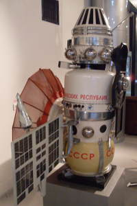
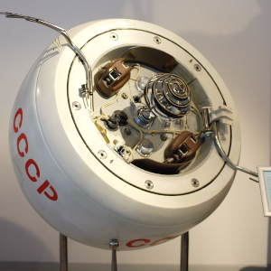

# Venera 4
> 2019.12.10 [🚀](../index/index.md) [despace](index.md) → [Venus](venus.md), **[Project](project.md)**

[TOC]

---
> <small>**Венера-4** — RU term w/o analogues in English. **Venera 4 (1V (V-67) s/n 310)** — English equivalent.</small>

**Venera 4** (**Венера-4**) was a spacecraft in the Soviet Venera program for the exploration of Venus. The first spacecraft that entered the atmosphere of Venus and transmitted data on the structure of the atmosphere (pressure and temperature) at altitudes of 55 — 25 ㎞, the composition of the atmosphere (90 — 95 % СО₂), detected the hydrogen corona of Venus, did not detect its own magnetic field and radiation belts.

 

 

|*Type*|*[Param.](si.md)*|
|:--|:--|
|**【Mission】**|• • •|
|Cost|… or … ㎏ of [gold](sc_price.md)|
|Development|…|
|Duration|127 days|
|Launch|12 June 1967, 02:40 UTC, Rocket: Molniya 8K78M|
|Operator|Lavochkin|
|Programme|Venera programme|
|Similar to|・Proposed: [Venera 5 and 6](venera_5_6.md), [Vega 1 and 2](vega_1_2.md)  ・Current: [Mariner 5](mariner_5.md)  ・Past: Luna 2, [Venera 2 and 3](venera_2_3.md)|
|Target|Exploring the planet Venus, studying Venus from inside the atmosphere and on the surface|
|[Type](sc.md)|Fly‑by spacecraft; lander spacecraft|
|**【Spacecraft】**|• • •|
|Comms|2 m parabolic HGA (decimeter range)|
|Composition|Lander, orbiter|
|Contractor|…|
|[ID](spaceid.md)|NSSDC ID (COSPAR ID): 1967-058A, SCN: 2840|
|Manufacturer|Lavochkin|
|Mass|Dry 1 106 ㎏ ([large satellite](sc.md), [EVN‑073](venus.md))|
|Orbit / Site|Heliocentric; 0.71 AU × 1.02 AU; T = 293 days|
|Payload|**Orbiter:** Magnitometer, Detectors, Spectrometer  **Lander:** Altimeter, Thermal Control, Equipment for Making Atmospheric Measurements|
|Power|…|

Achieved targets & investigations:

   - **T** — technical; **C** — contact research; **D** — distant research; **F** — fly‑by; **H** — manned; **S** — soil sample return; **X** — technology demonstration
   - **Sections of measurement and observation:**
      - Atmospheric/climate — **Ac** composition, **Ai** imaging, **Am** mapping, **Ap** pressure, **As** samples, **At** temperature, **Aw** wind speed/direction.
      - General — **Gi** planet’s interactions with outer space.
      - Soil/surface — **Sc** composition, **Si** imaging, **Sm** mapping, **Ss** samples.

<small>

|*EVN‑XXX*|*T*|*EN*|*Section of m&o*|*D*|*C*|*F*|*H*|*S*|
|:--|:--|:--|:--|:--|:--|:--|:--|:--|
|EVN‑001| |Atmosphere: preliminary model.| |D|C|F| | |
|EVN‑003|T|Exploration: from inside of atmosphere.| |D|C| | | |
|EVN‑014| |Atmosphere: composition.| |D| | |F| |
|EVN‑028| |Magnetosphere structure.| |D| |F| | |
|EVN‑073|T|Exploration with [satellites](sc.md): large satellites.| |D| |F| | |
|EVN‑073|T|Exploration with [satellites](sc.md): large satellites.| |D| |F| | |
|EVN‑092|T|Serve as a relay to Earth for stand‑alone SC/instruments.| |D| | | | |

</small>

 

## Mission
In 1967 it was the first successful spacecraft to perform in-place analysis of the environment of another planet. Venera 4 provided the first chemical analysis of the Venusian atmosphere ([EVN‑014](venus.md)), showing it to be primarily carbon dioxide with a few percent of nitrogen and below one percent of oxygen and water vapors ([EVN‑077](venus.md)). While entering the atmosphere it became the first spacecraft to survive entry into another planet’s atmosphere. The spacecraft detected a weak magnetic field ([EVN‑028](venus.md)) and no radiation field. The outer atmospheric layer contained very little hydrogen and no atomic oxygen ([EVN‑014](venus.md), [EVN‑077](venus.md)). The spacecraft sent the first direct measurements proving that Venus was extremely hot, that its atmosphere was far denser than expected ([EVN‑001](venus.md)), and that it had lost most of its water long ago.

Venera 4 was launched on 12 June by a Molniya-M carrier rocket flying from the Baikonur Cosmodrome. A course correction was performed on 29 July when it was 12 million ㎞ away from Earth; otherwise the spacecraft would have missed Venus. Although two such corrections had been planned, the first one was accurate enough and therefore the second correction was canceled. On 18 October 1967, the spacecraft entered the Venusian atmosphere with an estimated landing place near 19°N 38°E.

During entry into the Venusian atmosphere, the heat shield temperature rose to 11 000 ℃ and at one point the cabin deceleration reached 300 G. The descent lasted 93 min. The lander deployed its parachute at an altitude of about 52 ㎞, and started sending data on pressure, temperature and gas composition back to Earth. The temperature control kept the inside of the lander at −8 ℃. The temperature at 52 ㎞ was recorded as 33 ℃, and the pressure as less than 1 atm (100 ㎪). At the end of the 26 ㎞ descent, the temperature reached 262 ℃ and pressure increased to 22 atm (2 200 ㎪), and the signal transmission terminated ([EVN‑003](venus.md)). The atmospheric composition was measured as 90 — 93 % carbon dioxide, 0.4 — 0.8 % oxygen, 7 % nitrogen and 0.1 — 1.6 % water vapor ([EVN‑014](venus.md)).

**Radar altimeter.** Altitude of the Venera lander relative to the surface was measured during using a radar altimeter operating at 770 ㎒. The altimeter had an integer ambiguity of 30 ㎞ (an effect known as «aliasing»). At the time the distance of the cloudtops above the surface was not known, and due to this ambiguity, the first radar return, now believed to be at an actual altitude of about 55 ㎞, was initially misinterpreted as 26 ㎞. Therefore, based on the misinterpreted radar results, the Soviet team initially announced the lander descended to the surface.

**Achievements.** For the first time, in situ analysis of the atmosphere of another planet was performed and the data sent back to Earth; the analysis included chemical composition, temperature and pressure ([EVN‑014](venus.md)). The measured ratio of carbon dioxide to nitrogen of about 13 corrected the previous estimates so much (an inverse ratio was expected in some quarters) that some scientists contested the observations. The main station detected no radiation belts; relative to Earth, the measured magnetic field was 3 000 times weaker ([EVN‑028](venus.md)), and the hydrogen corona was 1 000 times less dense. No atomic oxygen was detected. All the data suggested that water, if it had been present, had leaked from the planet long before. This conclusion was unexpected considering the thick Venusian clouds.

 

## Science goals & payload
Objectives Venera 4’s: delivery of the lander to the atmosphere of the planet Venus, study of phisical parameters and chemical composition.

The orbiter included a 2 m long magnetometer, an ion detector, a cosmic ray detector and an ultraviolet spectrometer capable of detecting hydrogen and oxygen gases.

The lander contained an altimeter, thermal control, a parachute and equipment for making atmospheric measurements.

**Orbiter included:**

   - magnetometer **СГ 59М** − three-component magnetometer on a rod lenth of 3.5 m to measure the magnetude and direction of the magnetic field in interplanetary space and near Venus;
   - **КС-18-2М** − instrument to study the flows of cosmic particles;
   - ultraviolet spectrometer **ЛА-2** − capable of detecting hydrogen and oxygen gases.

**Lander contained:**

   - pressure sensors **МДДА** − measuring atmospheric pressure in the range from 0.13 to 6.8 atm;
   - radar altimeter − measures altitude above the terrain presently beneath the spacecraft by timing how long it takes a beam of radio waves to travel to ground, reflect, and return to the craft;
   - set of gas analysis instruments **Г-8** − determine the chemical composition of the atmosphere;
   - **ТПВ** − instruments for determining the density and temperature of the atmosphere by height.

 

## Spacecraft
The spacecraft comprised a lander, designed to enter the Venus atmosphere and parachute to the surface, and an orbiter, which carried the lander to Venus and served as a communications relay for the lander ([EVN‑092](venus.md)).

**Orbiter**

The orbiter of Venera 4 stood 3.5 m high, its solar panels spanned 4 m and had an area of 2.5 m².

**Lander**

The front part of theorbiter contained a nearly spherical landing capsule 1 m in diameter and weighing 383 ㎏. Compared to previous (failed) Venera spacecrafts, the lander contained an improved heat shield which could withstand temperatures up to 11 000 ℃. Instead of the previous liquid-based cooling design, a simpler and more reliable gas system was installed. The durability of the lander was checked by exposing it to high temperatures, pressures and accelerations using three unique testing installations. The lander was pressurized up to 25 atm. Finally, it was subjected to accelerations of up to 450 g in a centrifuge. The centrifuge test caused cracking of electronic components and cable brackets, which were replaced shortly before launch.

The lander could float in case of a water landing.

The lander contained a parachute and equipment for making atmospheric measurements. The data were sent by two transmitters at a frequency of 922 ㎒ and a rate of 1 bit/s; the measurements were sent every 48 s. The transmitters were activated by the parachute deployment as soon as the outside pressure reached 0.6 atm, which was thought to occur at the altitude about 26 ㎞ above the surface of the planet.

The lander was equipped with a rechargeable battery with a capacity sufficient for 100 min of powering the measurement and transmitter systems. To avoid becoming discharged during the flight to Venus, the battery was kept charged using the solar panels of the orbiter. Before the launch, the entire Venera 4 spacecraft was sterilized to prevent possible biological contamination of Venus.

 

## Community, library, links

**PEOPLE:**

   - **Leaders:**
      1. [Georgiy Nikolayevich Babakin](person.md) (Георгий Николаевич Бабакин) − chief design engineer.
      1. [Mstislav Vsevolodovich Keldysh](person.md) (Мстислав Всеволодович Келдыш) was a Soviet scientist in the field of mathematics and mechanics. He was part of the managementof the flight of Venera 4.
   - **Members:**
      1. Efraim Lazarevich Akim (Эфраим Лазаревич Аким) was a Soviet and Russian scientistin the field in the ballistics, spacecraft navigation and planetary science; head of the ballistic center.
      1. Mikhail Kazansky (Михаил Казанский)  was the head of the ballistic service TsNIIMash.

**COMMUNITY:**

<mark>TBD</mark>

 

## Docs & links
|Navigation|
|:--|
|**[FAQ](faq.md)**【**[SCS](scs.md)**·КК, **[SC (OE+SGM)](sc.md)**·КА】**[CON](contact.md)·[Pers](person.md)**·Контакт, **[Ctrl](control.md)**·Упр., **[Doc](doc.md)**·Док., **[Drawing](drawing.md)**·Чертёж, **[EF](ef.md)**·ВВФ, **[Error](error.md)**·Ошибки, **[Event](event.md)**·События, **[FS](fs.md)**·ТЭО, **[HF&E](hfe.md)**·Эрго., **[KT](kt.md)**·КТ, **[N&B](nnb.md)**·БНО, **[Project](project.md)**·Проект, **[QM](qm.md)**·БКНР, **[R&D](rnd.md)**·НИОКР, **[SI](si.md)**·СИ, **[Test](test.md)**·ЭО, **[TRL](trl.md)**·УГТ, **[Way](way.md)**·Пути|
|*Sections & pages*|
|**【】**  <mark>NOCAT</mark>|

   1. Docs: …
   1. <https://ru.wikipedia.org/wiki/Венера-4>
   1. <https://en.wikipedia.org/wiki/Venera_4>
