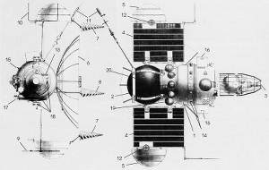
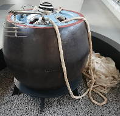

# Venera 7
> 2019.12.13 [🚀](../index/index.md) [despace](index.md) → [Venus](venus.md), **[Project](project.md)**

[TOC]

---

> <small>**Венера‑7** — RU term w/o analogues in English. **Venera 7** — English equivalent.</small>

**Venera 7** (**Венера‑7**) was a Soviet spacecraft, part of the Venera series of spacecraft to Venus. The lander of Venera 7 landed on the surface of Venus for the first time in the world, 2 000 ㎞ from the morning terminator on the night side. The lander transmitted information for 53 min, including 27 min from the surface. The temperature of the atmosphere on descent was measured. The temperature and pressure on the surface were measured for the first time, at the landing site it was T = 475 ± 20 ℃ and P = 90 ± 15 atm — the first measurements on the surface.

 

 

|*Type*|*[Param.](si.md)*|
|:--|:--|
|**Mission:**|• • •|
|Cost|… or … ㎏ of [gold](sc_price.md)|
|Development|…|
|Duration|Travel 120 days, lander 23 minutes|
|Launch|17 August 1970, 05:38:22 UTC, Rocket Molniya 8K78M|
|Operator|Lavochkin|
|Programme|Venera programme|
|Similar to|• Proposed: [Vega 1 and 2](vega_1_2.md)  • Current: ...   • ㎩st: [Venera 4](venera_4.md), [Venera 5 and 6](venera_5_6.md)|
|Target|Exploring the planet Venus, studying Venus from inside the atmosphere and on the surface. Refinement of data obtained by [Venera 5 and 6](venera_5_6.md)|
|[Type](sc.md)|Atmospheric spacecraft; lander spacecraft|
|**Spacecraft:**|• • •|
|Comms|**Orbiter:** 2 m parabolic high‑gain antenna (decimeter range)  **Lander:** medium gain antenna|
|Composition|Lander, orbiter|
|Contractor|…|
|[ID](spaceid.md)|NSSDC ID (COSPAR ID): [1970-060A ⎆](https://nssdc.gsfc.nasa.gov/nmc/spacecraft/display.action?:id=1970-060A), SCN: [4489 ⎆](http://www.n2yo.com/satellite/?:s=04489)|
|Manufacturer|Lavochkin|
|Mass|1 180 ㎏, lander 500 ㎏ ([medium satellite](sc.md), [EVN‑072](venus.md))|
|Orbit / Site|Heliocentric 0.69 × 1.01 AU; T = 287 days|
|Payload|Instrument for the study of streams of cosmic particles; spectrometer to dermine the type of surface rocks; sensors for determining the temperature and pressure of the atmosphere; etc.|
|Power|…|

Achieved targets & investigations:

   - **T** — technical; **C** — contact research; **D** — distant research; **F** — fly‑by; **H** — manned; **S** — soil sample return; **X** — technology demonstration
   - **Sections of measurement and observation:**
      - Atmospheric/climate — **Ac** composition, **Ai** imaging, **Am** mapping, **Ap** pressure, **As** samples, **At** temperature, **Aw** wind speed/direction.
      - General — **Gi** planet’s interactions with outer space.
      - Soil/surface — **Sc** composition, **Si** imaging, **Sm** mapping, **Ss** samples.

<small>

|*EVN‑XXX*|*T*|*EN*|*Section of m&o*|*D*|*C*|*F*|*H*|*S*|
|:--|:--|:--|:--|:--|:--|:--|:--|:--|
|EVN‑001| |Atmosphere: preliminary model.| |D|C|F| | |
|EVN‑003|T|Exploration: from inside of atmosphere.| |D|C| | | |
|EVN‑006|T|Exploration: from surface.| | |C| | | |
|EVN‑014| |Atmosphere: composition.| |D| | |F| |
|EVN‑023| |Surface: mineralogical composition.| | |C| | | |
|EVN‑025| |Surface: structure.| | |C| | | |
|EVN‑072|T|Exploration with [satellites](sc.md): medium satellites.| |D| |F| | |
|EVN‑077| |Atmosphere: chemical elements distribution.| |D| |F| | |

</small>

 

## Mission
The spacecraft was launched from Earth on 17 August 1970, at 05:38 UTC. It consisted of an orbiter based on the 3MV system and a lander. During the flight to Venus two in-course corrections were made using the bus’s on-board KDU-414 engine.

During the flight of Venera 7 there was a failure in the operation of the star sensor. Because of it, the elections broke on September 27 and 30. For corrections on November 2 and 17 it was necessary to use the Sun.

Venera 7 entered the atmosphere of Venus on 15 December 1970. The lander remained attached to the orbiter during the initial stages of atmospheric entry to allow the orbiter to cool the lander to −8 ℃ for as long as possible. The lander was ejected once atmospheric buffeting broke the orbiter’s lock-on with Earth. The parachute opened at a height of 60 ㎞ and atmospheric testing began ([EVN‑003](venus.md)) with results showing the atmosphere to be 97 % carbon dioxide ([EVN‑014](venus.md), [EVN‑077](venus.md)). The parachute was initially reefed down to 1.8 m² opening to 2.5 m² 13 minutes later when the reefing line melted as designed. Six minutes after the unreefing the parachute started to fail resulting in a descent more rapid than planned. The parachute eventually failed completely and the lander entered a period of freefall. As a result, the lander struck the surface of Venus at about 16.5 ㎧ at 05:37:10 UTC. The landing coordinates are 5°S 351°E. The lander appeared to go silent on impact but recording tapes kept rolling. A few weeks later, upon a review of the tapes by the radio another 23 min of very weak signals were found on them. The lander had landed on Venus and probably bounced onto its side, leaving the medium gain antenna not aimed correctly for strong signal transmission to Earth ([EVN‑006](venus.md)).

When it landed on the Venusian surface, it became the first spacecraft to soft land on another planet and first to transmit data from there back to Earth.

The spacecraft transmitted information to Earth for 53 min, which included about 20 min from the surface. It was found that the temperature at the surface of Venus was 474 ± 20 ℃. Using the temperature and models of the atmosphere a pressure of 9.2 ± 1.5 ㎫ was calculated ([EVN‑001](venus.md)). From the lander’s rapid halt (from falling to stationary inside 0.2 s) it was possible to conclude that the craft had hit a solid surface with low levels of dust (the surface consistency is between sand and volcanic tuff) ([EVN‑025](venus.md)).

The lander provided information about the surface of Venus ([EVN‑006](venus.md)), which could not be seen through a thick veil of atmosphere. The spacecraft definitively confirmed that humans cannot survive on the surface of Venus, and excluded the possibility that there is any liquid water on Venus.

 

## Science goals & payload
The purpose of the launch of the automatic station Venera 7 was to deliver the lander to the surface of Venus. This would be the first landing of a workable spacecraft on another planet.

The composition of scientific equipment was completely changed. The orbiter carried a solar wind charged particle detector and a cosmic ray detector. On the lander there were temperate and pressure sensors as well as an accelerometer to measure atmospheric density. In addition, a new radio altimeter was installed to measure heights in the 25 - 1 ㎞ range on the lander.

**Orbiter**

   - "**КС-18-4М**" — instrument for the study of streams of charged cosmic particles of the solar wind.

**Lander**

   - "**ГС-4**" — gamma‑ray spectrometer to dermine the type of surface rocks of the planet ([EVN‑023](venus.md)).
   - A set of sensors for determining the temperature and pressure of the atmosphere.
   - "**ДОУ-1М**" — instrument for measuring the maximum acceleration in the braking section of the lander.
   -  Radio altimeter — instrument for measuring heights in the 25 ‑ 1 ㎞ range.

 

## Spacecraft
The lander was designed to be able to survive pressure of up to 180 ㍴ (18 000 ㎪) and temperatures of 580 ℃. Design of the Venera 7 took into account the data obtained by the previous [Venera 4](venera_4.md), [Venera 5](venera_5_6.md) and [Venera 6](venera_5_6.md) spacecraft. From calculations made on the basis of data obtained during previous expeditions, it was assumed that the surface pressure can teach values of 100 atm, the temperature is 500 ℃ and the wind speed at the surface is 1.5 ㎧. To withstand such pressure, the body of the lander was not made of aluminum-magnesium alloy «АМг6» as the previous Venera, but of titanium, so it was able to withstand pressures up to 180 atm.

Thermal isolation of the lower hemisphere of the lander was made from fiberglass, and the upper hemisphere was made of glass wool, which filled the cells of the glass-cells. It was also installed a heat accumulator.

To reduce the overloads affecting the equipment in contact with the surface of the planet, a shock-absorbing device was installed.

Due to change in the composition of the scientific equipment in the lander and the cycloram of its functioning, it was necessary to increase the capacity of the battery. Instead of nickel-cadmium, a lead-zinc battery was installed. For 15 days before the approach to Venus on command from the Earth produced its charge from solar panels.

In connection with the increase of almost 100 ㎏ of the mass of the lander in comparison with the lander [Venera 5, -6](venera_5_6.md), it was necessary to facilitate the orbital compartment as much as possible. All scientific equipment was removed from it, except the cosmic particle counter.

 

## Community, library, links

**PEOPLE:**

   - **Leaders**
      1. [Georgiy Nikolayevich Babakin](person.md) (Георгий Николаевич Бабакин) — chief design engineer.
   - **Members**
      1. [Mikhail Yakovlevich Marov](person.md) (Михаил Яковлевич Маров) — led the team to decode data from Venera 7, astronomer.
      1. Oleg Nikolaevich Rzhiga (Олег Николаевич Ржига) — astronomer, scientist.
      1. [Vladimir Pavlovich Dolgopolov](person.md) (Владимир Павлович Долгополов)

**COMMUNITY:**

<mark>TBD</mark>

 

## Docs & links (TRANSLATEME ALREADY)
|Navigation|
|:--|
|**[FAQ](faq.md)**【**[SCS](scs.md)**·КК, **[SC](sc.md)**·КА, **[OE](oe.md)**·БА, **[SGM](sgm.md)**·КММ】**[CON](contact.md)·[Pers](person.md)**·Контакт, **[Ctrl](control.md)**·Упр., **[Doc](doc.md)**·Док., **[EF](ef.md)**·ВВФ, **[Error](error.md)**·Ошибки, **[Event](event.md)**·События, **[FS](fs.md)**·ТЭО, **[HF&E](hfe.md)**·Эрго., **[KT](kt.md)**·КТ, **[Model](model.md)**·Модель, **[N&B](nnb.md)**·БНО, **[Patent](патент.md)**·Патент, **[Project](project.md)**·Проект, **[QM](qm.md)**·БКНР, **[R&D](rnd.md)**·НИОКР, **[SI](si.md)**·СИ, **[Test](test.md)**·ЭО, **[Timeline](timeline.md)**·ЦГМ, **[TRL](trl.md)**·УГТ|
|*Sections & pages*|
|**【】**  <mark>NOCAT</mark>|

   1. Docs:
      - П. С. Шубин — Венера. Неукротимая планета. Издание второе, расширенное и дополненное. М.: Издательство «Голос‑Пресс»; Кемерово: издатель П. С. Шубин, 2018. – 352 стр.
   1. Notable interwikies — …
   1. <https://en.wikipedia.org/wiki/Venera_7>
   1. <https://galspace.spb.ru/index490.html>
