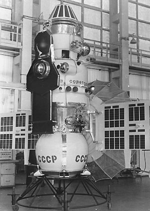
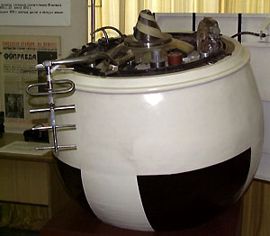
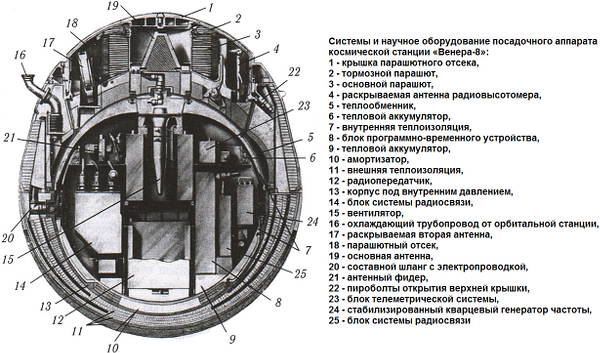

# Venera 8
> 2019.12.13 ┊ **🚀 [despace](index.md)** → [Venus](venus.md), **[Project](project.md)**

[TOC]

---

> <small>*Terms:* **Венера‑8** — Russian term with no analogues in English. **Venera 8** — English equivalent.</small>

**Venera 8** (**Венера‑8**) was a spacecraft in the Soviet Venera program for the exploration of Venus and was the second lander to conduct a successful landing on the surface of Venus. The Venera 8 landing was planned on the day side in order to prepare for image acquisition by the next missions, it landed on the day side 500 km from the morning terminator. Transmitted information from the surface for 50 min. The illumination was measured and obtained as 350 ± 150 Lux (extrapolated to noon is 1 000 – 3 000 Lux – sufficient for the operation of television systems). The wind speed was measured at 50 - 60 m/s at an altitude of 50 km, and 0 – 2 m/s at the surface, i.e. super rotation was detected. The first measurements were made of the content of natural radioactive elements in the soil (potassium, uranium, thorium).

 

 

|*Type*|*[Param.](si.md)*|
|:--|:--|
||**`Mission properties`**|
|Cost| … or … kg of [gold](sc_price.md) |
|Development| … |
|Duration| Travel: 117 days  Lander: 50 min |
|Launch| 27 March 1972, 04:15:01 UTC, Rocket: Molniya-M/MVL |
|Operator| Lavochkin |
|Programme| Venera programme |
|Similar  missions| • Proposed: [Venera 9 and 10](venera_9_10.md), [Vega 1 and 2](vega_1_2.md)   • Current: …  • Past: [Venera 5 and 6](venera_5_6.md), [Venera 7](venera_7.md) |
|Target| Exploring the planet Venus, studying Venus from inside the atmosphere and on the surface. |
|[Type](sc.md)| Atmospheric spacecraft; lander spacecraft |
||**`Spacecraft properties`**|
|Comms| A funnel-shaped antenna; a resetable antenna |
|Composition| Orbiter, lander |
|Contractor| … |
|[ID](spaceid.md)| NSSDC ID (COSPAR ID): [1972-021A ⎆](https://nssdc.gsfc.nasa.gov/nmc/spacecraft/display.action?id=1972-021A), SCN: [5912 ⎆](http://www.n2yo.com/satellite/?s=05912) |
|Manufacturer| Lavochkin |
|Mass| Lander: 495 kg ([minisatellite](sc.md), [EVN‑070](venus.md)) |
|Orbit / Site| Heliocentric |
|Payload| Temperature, pressure, and light sensors as well as an altimeter, gamma ray spectrometer, gas analyzer, and radio transmitters. |
|Power| … |

Achieved targets & investigations:

   - **T** — technical; **Draft** — minimum for working with object. **D** — distant exploration; **C** — contact exploration; **F** — fly‑by; **H** — manned flight; **S** — soil sampe return; **X** — technology demonstration
   - **Sections of measurement and observation:**
      - Atmospheric/climate — **Ac** composition, **Ai** imaging, **Am** mapping, **Ap** pressure, **As** samples, **At** temperature, **Aw** wind speed/direction.
      - General — **Gi** planet’s interactions with outer space.
      - Soil/surface — **Sc** composition, **Si** imaging, **Sm** mapping, **Ss** samples.

<small>

|*EVN‑XXX*|*T*|*EN*|*Section of m&o*|*D*|*C*|*F*|*H*|*S*|
|:--|:--|:--|:--|:--:|:--:|:--:|:--:|:--:|
|EVN‑001||Atmosphere: model, draft.|  |D|C|F|||
|EVN‑002||Surface: map, draft.|  |D|C||||
|EVN‑003|T|Exploration: from inside of atmosphere.|  |D|C||||
|EVN‑006|T|Exploration: from surface.|  ||C||||
|EVN‑010||Atmosphere: vertical model.|  |D|||||
|EVN‑011||Atmosphere: common circulation model.|  |D|||||
|EVN‑013||Atmosphere: illumination of the surface & the atmo layers.|  |D|||||
|EVN‑014||Atmosphere: composition.|  |D|||F||
|EVN‑017||Atmosphere: structure.|  |D|||||
|EVN‑026||Surface: elemental composition.|  ||C||||
|EVN‑070|T|Exploration with [satellites](sc.md): minisatellites.|  |D||F|||
|EVN‑074||Meteorological model.|  |D||F|||

</small>

 

## Mission
The spacecraft took 117 days to reach Venus with one mid-course correction on 6 April 1972, separating from the orbiter and entering the atmosphere on 22 July 1972 at 08:37 UTC. Taking into account new tasks, the ballistics flight scheme of Venera 8 has changed. Unlike [Venera 4](venera_4.md), [-5, -6](venera_5_6.md), [-7](venera_7.md), the lander had to land on the day side of the planet.

A refrigeration system attached to the orbiter was used to pre-chill the descent lander's interior prior to atmospheric entry in order to prolong its life on the surface. Descent speed was reduced from 41 696 km/h to about 900 km/h by aerobraking. The 2.5 m diameter parachute opened at an altitude of 60 km.

Venera 8 carried out accurate direct (in situ) measurements of atmospheric temperature and pressure, securely tied to the altitude ([EVN-001](venus.md), [EVN-010](venus.md)) above the surface and on the surface itself ([EVN-003](venus.md), [EVN-006](venus.md)). The chemical composition of the atmosphere was clarified ([EVN-014](venus.md)). For the first time, the descending luminous flux was measured in the range from 55 km to the surface. These first high-altitude profiles of sunlight flux proved to be sufficient to explain the nature of high temperature due to the greenhouse effect ([EVN-001](venus.md)). They also made it possible for the first time to estimate the location of clouds in the atmosphere of Venus and to make the assumption about the presence of a sub-cloud haze ([EVN-001](venus.md)). The illumination was measured on the surface ([EVN-013](venus.md)), which was the basis for planning future experiments for taking panoramas. Altitude profiles of horizontal wind speed and direction from 55 km and to the surface were obtained by Doppler measurements ([EVN-010](venus.md), [011](venus.md), [074](venus.md)).

**Winds**

|*Heigth*|*Wind speed*|
|:--|:--|
| 50 km | 100 m/s |
| 45 km | 70 – 40 m/s |
| 45 – 20 km | 40 – 20 m/s |
| 10 – 0 km | 1 m/s |

Measurements of the horizontal wind speed, almost coinciding with the speed of the ultraviolet inhomogeneities at the top of the clouds, indicated the presence of a superrotation of the atmosphere of Venus ([EVN-034](venus.md)). Detailed study of high-altitude temperature profiles and variations of the frequency signal allowed to obtain estimates of the nature of turbulence in the lower atmosphere of Venus ([EVN-010](venus.md)).

Radio altimeter data were obtained at various altitudes. During the descent, the lander drifted 60 km horizontally. The radio altimeter obtained a surface profile ([EVN-002](venus.md)) on which two mountains of 1 000 and 2 000 m high, a depression of 2 000 m deep and a gentle slope ascending to the landing site were found. Two intensity profiles of the echo signal were obtained, from which it was possible to calculate the permittivity and surface density, which turned out to be equal to 1.4 g/cm³. According to the measurements of the photometer, the level of illumination monotonously decreased in the range from 50 to 35 km as the spacecraft passed through the clouds. Venera 8 was the first to detect three main optical regions in the atmosphere: the main thick cloud layer between 65 and 49 km, a less dense layer of haze (fog) between 49 km and 32 km, and a relatively clear cloudless atmosphere ([EVN-017](venus.md)).

On the surface, the light level was almost constant, which supported the conclusion of a relatively clean atmosphere below the clouds. At the landing site, the illumination was comparable to twilight on a cloudy day on Earth. The weak brightness of the surface indicated that only 1% of the incident sunlight reached the surface ([EVN-013](venus.md)) (the Sun was 5° above the horizon).

Measurements using gas analyzers allowed us to conclude that the atmosphere contains 97% carbon dioxide, 2% nitrogen, 0.9% water vapor and less than 0.15% oxygen ([EVN-014](venus.md)). Although the ammonia test gave a positive result of 0.1% to 0.01% at altitudes of 44 to 32 km, this result was due to sulfuric acid, which also gave a positive reaction to the indicator used. An important circumstance was that the gas analyzer for the first time pointed out the possibility of the presence of sulfuric acid in the clouds. This explained why the clouds were so waterless but could still form droplets. And the fact that such droplets effectively reflected sunlight explained why the planet had such a high albedo.

The radio altimeter accurately measured the distance to the planet; from this data, a section of the terrain was built ([EVN‑002](venus.md)).

The on-board gamma ray spectrometer measured the uranium/thorium/potassium ratio of the surface rock, indicating it was similar to Alkali basalt ([EVN‑026](venus.md)).

Venera 8 reliably measured the atmosphere on the planet's surface. Direct measurements showed that the surface pressure is 93 ± 1.5 bar and temperature 470 ± 8 °C, confirming the measurements of Venera 7 ([EVN‑074](venus.md)).

The lander continued to send back data for 50 minutes, 11 seconds after landing ([EVN‑006](venus.md)) before failing due to the harsh surface conditions.

 

## Science goals & payload
The purpose of the launch of the automatic station Venera 8 was to deliver the lander to the surface of Venus, to explore the planet Venus, to study Venus from inside the atmosphere and on the surface.

**Scientific tasks:**

   - **Orbital**
      - Assessment of the radiation situation on the Earth − Venus flight path − **КС-18-4М**;
      - Measurement of hydrogen (H₂) and deuterium (H₃) density in the upper atmosphere − **ЛА-4**.
   - **Lander**
      - Measurement of the pressure of the planet's atmosphere during parachute descent and on the surface after landing − **ИТД**, **МД**;
      - Measuring the temperature of the planet's atmosphere during parachute descent and on the surface after landing − **ИТД**;
      - Determination of the maximum acceleration at the lander's entry into the atmosphere − **ДОУ1-М**;
      - Determination of the surface type of rocks of the planet (gamma spectrometer) − **ГС-4М**;
      - Measurement of illumination at altitude and on the surface of the planet − **ИОВ-72**;
      - Registration of ammonia in the cloud layer (verification of hypotheses about the possible presence) − **ИАВ-72**;
      - Estimation of wind speed in the atmosphere − the onboard radio complex of the lander and ground installations were used.

|*Location*|*Instrument*|*Function*|*Mass, kg*|*Power, W*|
|:--|:--|:--|:--|:--|
|Orbiter| **КС-18-4М** | Instrument to study the flows of cosmic particles | ≤1.6 | 2.0 |
|Orbiter| **ЛА-4** | Measuring the density of H₂ and H₃ | ≤2.0 | ≤2.0 |
|Lander| **ИТД**, **МД** | Temperature and pressure sensors  | ≤0.7 | — |
|Lander| **ИТД** | Temperature and pressure sensors | 0.2 | 4.0 |
|Lander| **ДОУ1-М** | Accelerometer | 0.25 | — |
|Lander| **ГС-4М** | Gamma ray spectrometer | 8.3 | ≤5.0 |
|Lander| **ИОВ-72** | Cadmium sulfide Photometers | ≤1.4 | 2.0 ‑ 3.0 |
|Lander| **ИАВ-72** | Ammonia analyser | ≤0.7 | ≤2.0 |
|Lander| The onboard radio complex of the lander and ground installations  | Radio Doppler experiment |—|—|

   - Radar altimeter;

 

## Spacecraft
The spacecraft based on the 3MV (Venera 3V; V-72) and consisted of a lander and an orbiter.

In order for the lander to get on the illuminated side, due to the restrictions imposed by the laws of celestial mechanics, it was necessary to recycle the radio system. A new funnel-shaped antenna was installed (suitable for a low position above the Earth's horizon). Also, the landing was equipped with a resetable antenna, providing communication after landing (flat disk with spiral antennas on each side). After landing, the resetable antenna is ejected from the parachute compartment, the petals open and do not allow it to stand on the edge. The ends of the disk are emitters, and the gravity switch installed inside it, after fixing the antenna to the radiation, turns on the upper side. The main funnel-shaped antenna worked only in the descent area.

The data obtained by Venera 7 were taken into account in the design of  Venera 8 lander. In the lower part of the compartment, the wall thickness was reduce from 25 to 12 mm, in the upper part from 8.7 to 5.7 mm, which made it possible to reduce weight of the lander by 38.5 kg compared Venera 7. The lander mass was 495 kg.

Porous composite material was used as the main thermal insulation of the lander. To improve the thermal conditions, beryllium shells were installed on the inner side of the titanium body of the lander, and fiberglass gaskets were introduced in the nodes of fastening the frame to the body of the instrument compartment. Maintaining the thermal regime inside the lander was carried out with the help of «thermal batteries», which were used as salt (lithium nitrate trihydrate). Outwardly projecting instruments have been closed with covers made of composite material.

In order to determine the illumination of the surface of the planet, necessary for photographing surface of Venus on the next generation lander, the complex of scientific equipment of the lander was supplemented with a photometer.

 

## Community, library, links

**PEOPLE:**

   - **Leaders:**
      1. [Georgiy Babakin](02_babakin_001.md) (Георгий Николаевич Бабакин) — chief design engineer.
      1. [Mstislav Keldysh](02_keldysh_001.md) (Мстислав Всеволодович Келдыш) — a Soviet scientist in the field of mathematics and mechanics. He was part of the management of the flight of Venera programme.
   - **Members:**
      1. [Vladimir Dolgopolov](02_dolgopolov_001.md) (Владимир Павлович Долгополов)

**COMMUNITY:**

 

## Docs & links
|…°·•¹²³±×÷≤≥≈≠ ‑ −— ⎆✉ ❐“”’«»✔→✘☐☑├┕┆ 1 lb = 0.453592 kg; 1 g = 9.80665 m/s²|
|:--|
|<small>**[FAQ](faq.md)**, **[Cable](cable.md)**·БКС, **[Camera](camera.md)**·Камера, **[Comms](comms.md)**·Радиосв., **[Contact](contact.md)**·Контакт, **[Control](control.md)**·Управ., **[Doc](doc.md)**·Док., **[Doppler](doppler.md)**·ИСР, **[DS](ds.md)**·ЗУ, **[EB](eb.md)**·ХИТ, **[ECO](ecology.md)**·Экол., **[EF](ef.md)**·ВВФ, **[ElC](elc.md)**·ЭКБ, **[EMC](emc.md)**·ЭМС, **[Errors](error.md)**·Ошибки, **[Events](event.md)**·События, **[FS](fs.md)**·ТЭО, **[Fuel](fuel.md)**·Топливо, **[GNC](gnc.md)**·БКУ, **[GS](scs.md)**·НС, **[HF&E](hfe.md)**·Эргоном., **[IMU](imu.md)**·Гироскоп, **[Incubator](incubator.md)**·Инкуб., **[KT](kt.md)**·КТЕХ, **[LAG](lag.md)**·ПУC, **[LES](les.md)**·САСП, **[LS](ls.md)**·СЖО, **[LV](lv.md)**·РН, **[MAG](mag.md)**·Магнитом., **[MCC](mcc.md)**·ЦУП, **[Model](model.md)**·Модель, **[MSC](sc.md)**·ПКА, **[N&B](nnb.md)**·БНО, **[NR](nr.md)**·ЯР, **[OBC](obc.md)**·ЦВМ, **[OE](oe.md)**·БА, **[Patent](патент.md)**·Патент, **[Project](project.md)**·Проект, **[PS](ps.md)**·ДУ, **[QA](quality.md)**·QA, **[R&D](rnd.md)**·НИОКР, **[RAMS](rams.md)**·НиБ, **[Risk](risk.md)**·Риск, **[Robot](robotics.md)**·Робот, **[Rover](rover.md)**·Планетоход, **[RTG](rtg.md)**·РИТЭГ, **[RW](rw.md)**·ДМ, **[SARC](sarc.md)**·ПСК, **[Sensor](sensor.md)**·Датчик, **[SC](sc.md)**·КА, **[SCS](scs.md)**·КК, **[SGM](sgm.md)**·КММ, **[SI](si.md)**·СИ, **[Soft](soft.md)**·ПО, **[SP](sp.md)**·БС, **[Spaceport](spaceport.md)**·Космодром, **[SPS](sps.md)**·СЭС, **[SSS](sss.md)**·ГЗУ, **[TCS](tcs.md)**·СОТР, **[Test](test.md)**·ЭО, **[Timeline](timeline.md)**·Циклограмма, **[TMS](tms.md)**·ТМС, **[TOR](tor.md)**·ТЗ, **[TRL](trl.md)**·УГТ</small>|
|*Sections & pages*|
|**··•  •··**  <mark>NOCAT</mark> |

**Docs:**

   1. П. С. Шубин — Венера. Неукротимая планета. Издание второе, расширенное и дополненное. М.: Издательство «Голос‑Пресс»; Кемерово: издатель П. С. Шубин, 2018. – 352 стр.: ил.

**Links:**

   1. Notable interwikies — …
   1. <https://ru.wikipedia.org/wiki/Венера-8>
   1. <https://en.wikipedia.org/wiki/Venera_8>
   1. <https://galspace.spb.ru/index491.html>
