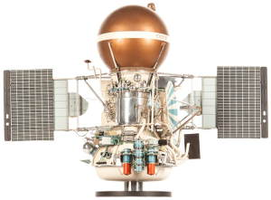
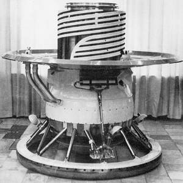
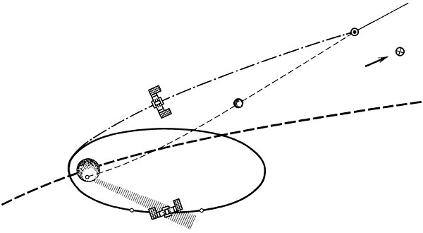
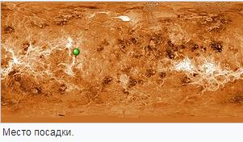
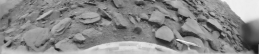
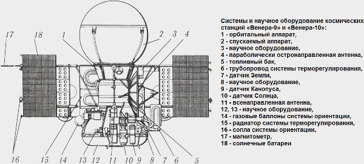
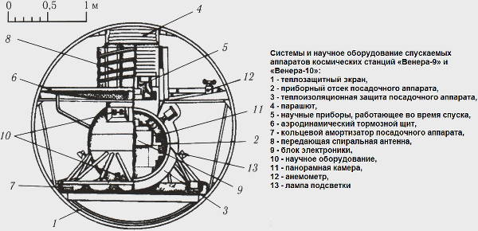

# Venera 9, 10
> 2019.12.16 [🚀](../index/index.md) [despace](index.md) → [Venus](venus.md), **[Project](project.md)**

[TOC]

---

> <small>**Венера-9** — RU term w/o analogues in English. **Venera 9** — English equivalent.</small>  
> <small>**Венера-10** — RU term w/o analogues in English. **Venera 10** — English equivalent.</small>

**Venera 9** and **Venera 10** were Soviet unmanned space mission parts to Venus.

 

 

|*Type*|*[Param.](si.md)*|
|:--|:--|
|**【Mission】**|• • •|
|Cost|… or … ㎏ of [gold](sc_price.md)|
|Development|…|
|Duration|**Venera 9:** Orbiter: 158 days; Lander: 53 minutes  **Venera 10:** Orbiter: 144 days; Lander: 65 minutes|
|Launch|**Venera 9:** June 8, 1975, 02:38 UTC **Venera 10:** June 14, 1975, 03:00:31 UTC Rocket: Proton-K/DM|
|Operator|Lavochkin|
|Programme|Venera programme|
|Similar to|・Proposed: [Venera 11 and 12](venera_11_12.md)   ・Current: …  ・Past: [Venera 5 and 6](venera_5_6.md), [Venera 7](venera_7.md), [Venera 8](venera_8.md)|
|Target|Delivery of the lander to the surface of Venus. A study of the soil, the atmosphere and clouds. Photographing the surface of the planet (including panoramic)|
|[Type](sc.md)|Fly‑by spacecraft; atmospheric spacecraft; lander spacecraft|
|**【Spacecraft】**|• • •|
|[ID](spaceid.md)|**Venera 9:** NSSDC ID (COSPAR ID): [1975-050A ⎆](https://nssdc.gsfc.nasa.gov/nmc/spacecraft/display.action?:id=1975-050A), [1975-050D ⎆](https://nssdc.gsfc.nasa.gov/nmc/spacecraft/display.action?:id=1975-050D), SCN: 7915, 8411 **Venera 10:** NSSDC ID (COSPAR ID): [1975-054A ⎆](https://nssdc.gsfc.nasa.gov/nmc/spacecraft/display.action?:id=1975-054A), [1975-054D ⎆](https://nssdc.gsfc.nasa.gov/nmc/spacecraft/display.action?:id=1975-054D), SCN: 7947, 8423|
|Comms|Orbiter: high gain parabolic antenna (wavelenght 8 and 32 ㎝)|
|Composition|Orbiter; Lander|
|Contractor|…|
|Manufacturer|Lavochkin|
|Mass|**Venera 9** Launch: 4 936 ㎏ Dry Orbiter: 2283 ㎏ ([Large satellite](спутник.md), [EVN‑073](venus.md)) Lander: 660 ㎏ ([Medium satellite](спутник.md), [EVN‑072](venus.md))  **Venera 10** Launch: 5 033 ㎏ Dry Orbiter: 2314 ㎏ ([Large satellite](спутник.md), [EVN‑073](venus.md)), Lander: 660 ㎏ ([Medium satellite](спутник.md), [EVN‑072](evn_072.md))|
|Orbit / Site|Cytherocentric **Venera 9:** 7 625 ㎞ × 118 072 ㎞; T = 48.3 hours **Venera 10:** 1 620 ㎞ × 113 900 ㎞; T = 49.4 hours|
|Payload|Spectrometers, cameras, different sensors for determining temperature, pressure, etc., photometer, radiometer, magnetometer|
|Power|…|

Achieved targets & investigations:

   - **T** — technical; **C** — contact research; **D** — distant research; **F** — fly‑by; **H** — manned; **S** — soil sample return; **X** — technology demonstration
   - **Sections of measurement and observation:**
      - Atmospheric/climate — **Ac** composition, **Ai** imaging, **Am** mapping, **Ap** pressure, **As** samples, **At** temperature, **Aw** wind speed/direction.
      - General — **Gi** planet’s interactions with outer space.
      - Soil/surface — **Sc** composition, **Si** imaging, **Sm** mapping, **Ss** samples.

<small>

|*EVN‑XXX*|*T*|*EN*|*Section of m&o*|*D*|*C*|*F*|*H*|*S*|
|:--|:--|:--|:--|:--|:--|:--|:--|:--|
|EVN‑001| |Atmosphere: preliminary model.| |D|C|F| | |
|EVN‑003|T|Exploration: from inside of atmosphere.| |D|C| | | |
|EVN‑005|T|Exploration: from Venusian orbit.| |D| |F| | |
|EVN‑006|T|Exploration: from surface.| | |C| | | |
|EVN‑008| |Atmosphere: nightglows.| |D| | | | |
|EVN‑010| |Atmosphere: vertical model.| |D| | | | |
|EVN‑013| |Atmosphere: illumination of the surface & the atmo layers.| |D| | | | |
|EVN‑014| |Atmosphere: composition.| |D| | |F| |
|EVN‑016| |Atmosphere: clouds, their structure.| |D| |F| | |
|EVN‑017| |Atmosphere: structure.| |D| | | | |
|EVN‑018| |Atmosphere: clouds, their chemistry.| |D| |F| | |
|EVN‑025| |Surface: morphology| |C| | | | |
|EVN‑026| |Surface: elemental composition.| | |C| | | |
|EVN‑063|T|Surface: panoramic imaging.| | |C| | | |
|EVN‑072|T|Exploration with [satellites](sc.md): medium satellites.| |D| |F| | |
|EVN‑073|T|Exploration with [satellites](sc.md): large satellites.| |D| |F| | |
|EVN‑074| |Meteorological model.| |D| |F| | |
|EVN‑075| |Atmosphere: clouds, their nature.| |D| |F| | |
|EVN‑077| |Atmosphere: chemical elements distribution.| |D| |F| | |
|EVN‑078|T|Atmosphere: radiography.| |D| | | | |
|EVN‑092|T|Serve as a relay to Earth for stand‑alone SC/instruments.| |D| | | | |
|EVN‑093|T|Atmosphere/surface imaging.| |D| |F| | |
|EVN‑097| |Atmosphere: effect of solar Rad & interplanetary space on the atmo.| |D| |F| | |

</small>

 

## Mission
**Venera 9** (Венера-9), **4V-1 No. 660**, was a Soviet unmanned space mission to Venus. It was launched on June 8, 1975, at 02:38:00 UTC and had a mass of 4 936 ㎏. The orbiter was the first spacecraft to orbit Venus, while the lander was the first to return images from the surface of another planet.

**Venera 10** (Венера-10), **4V-1 No. 661**, was a Soviet unmanned space mission to Venus. It was launched on June 14, 1975 03:00:31 UTC and had a mass of 5 033 ㎏. It was slightly heavier and needed more fuel to keep the engine running longer when it entered the orbit of the Venus satellite.

They consisted of an orbiter and a lander.

**Orbiter**

The orbiter Venera 9’s entered Venus orbit on October 20, 1975. Its mission was to act as a communications relay for the lander ([EVN‑092](venus.md)) and to explore cloud layers ([EVN‑075](venus.md)) and atmospheric parameters with several instruments and experiments ([EVN‑005](venus.md)).

The orbiter Venera 10’s entered Venus orbit on October 23, 1975. Its mission was identical to the Venera 9 Orbiter mission.

Both orbiters conducted experiments on radio illumination of the atmosphere ([EVN‑078](venus.md)). 50 slices of the atmosphere were obtained at different latitudes and at different positions of the Sun.

An experiment was also conducted to determine the relief from the orbit of the artificial satellite of Venus ([EVN‑093](venus.md)). About 55 slices were obtained with a horizontal resolution of about 10 ㎞.

With the help of an ultraviolet spectrometer, the cause of the ashy glow of Venus was clarified. It turned out, all because of the light of strongly ionized atoms of oxygen and carbon monoxide. The total ionization energy is probably taken from interplanetary solar plasma ([EVN‑097](venus.md)). In this case, the ashy light of Venus is a close relative of earth’s auroras, only «smeared» across the surface due to the planet’s lack of a magnetic field ([EVN‑008](venus.md)).

Opto-mechanical scanners transmitted images of the cloud cover. An infrared spectrometer studied the upper layer of clouds.

The last communication session with the Orbiter Venera 9 took place on April 27, 1976, with the Orbiter Venera 10 — September 15, 1977.

**Lander**

**Program of the lander’s entry into atmosphere**  
The spacecraft with the lander was first guided to the point of entry into the atmosphere before the point of entry into orbit was reached. A few days before arriving on Venus, a lander was detached from the station, continuing its flight in passive mode. Immediately thereafter, the spacecraft performed a correction maneuver to reach the point of entry into orbit. The sequence of operations was set in such a way that by the time the information transfer from the lander began, the Orbiter’s engine would be turned on to enter the orbit of the Venus satellite, so that the Orbiter would be in line of sight with the lander to relay the data. As a result of this complex maneuver, by the time the lander entered the atmosphere, the Orbiter managed to make a half-turn around Venus, ending up in the range of the lander’s reception. This provided the maximum duration of the communication session through the Orbiter, which was used as a repeater, and with the limited survival time of the lander on the surface, all information had to be removed from the scientific instruments in one communication session.

**Venera 9**

On October 20, 1975, the lander spacecraft separated from the orbiter, and landing was made with the Sun near zenith at 05:13 UTC on October 22.

The lander was encased in a spherical shell before landing to help protect it from the heat of entry as it slowed from 10.7 ㎞/s to 150 ㎧. This sphere was then separated with explosive bolts and a three-domed parachute was deployed which slowed the lander further to 50 ㎧ at an altitude of 63 ㎞ above the planet.

The descent through the cloud layer took about 20 min, during which time the lander took measurements of the atmosphere ([EVN‑003](venus.md)) and radioed the information to the orbiter ([EVN‑092](venus.md)). To minimize lander damage in the hot atmosphere, the parachute was released at an altitude of 50 ㎞, and the ring‑shaped aerodynamic shield provided braking. The Venusian atmosphere is so dense near the surface that this shield provided a descent rate of 7 ㎧ as the lander touched down. The landing device, a hollow ring surrounding the lower part of the lander, was partly crushed upon touchdown to take up most of the landing impact. Venera 9 landed within a 150 ㎞ radius of 31.01°N 291.64°E.

It was the first spacecraft to return an image from the surface ([EVN‑006](venus.md)) of another planet ([EVN‑093](venus.md)). Many of the instruments began working immediately after touchdown and the cameras were operational 2 min later. These instruments revealed a smooth surface with numerous stones. The lander measured a light level of 14 000 lux, similar to that of Earth in full daylight but no direct sunshine ([EVN‑013](venus.md)).

Venera 9 measured clouds that were 30 – 40 ㎞ thick with bases at 30 – 35 ㎞ altitude. It also measured atmospheric chemicals including hydrochloric acid, hydrofluoric acid, bromine and iodine ([EVN‑077](venus.md)). Other measurements included surface pressure of about 9.1 ㎫, temperature of 485 ℃ ([EVN‑001](venus.md), [EVN‑074](venus.md)), and surface light levels comparable to those at Earth mid-latitudes on a cloudy summer day ([EVN‑013](venus.md)). Venera 9 was the first lander to send back black and white television pictures from the Venusian surface ([EVN‑093](venus.md)) showing no shadows, no apparent dust in the air, and a variety of 30 to 40 ㎝ rocks which were not eroded. Planned 360° panoramic pictures could not be taken because one of two camera lens covers failed to come off, limiting pictures to 180°. This failure recurred with Venera 10.

**Venera 10**

On October 23, 1975, this spacecraft was separated from the Orbiter, and landing was made with the sun near zenith, at 05:17 UT, on October 25.

It landed near the border area between Beta Regio and Hyndla Regio (within a 150 ㎞ radius of 15.42°N 291.51°E), three days after the touchdown of, and 2 200 ㎞ from Venera 9.

Venera 10 measured a surface windspeed of 3.5 ㎧. Other measurements included atmospheric pressure at various heights, and temperature ([EVN‑001](venus.md)), and surface light levels ([EVN‑013](venus.md)). Venera 10 was the second Lander to send back black and white television pictures ([EVN‑093](venus.md)) from the Venusian surface ([EVN‑006](venus.md)) (after Venera 9). Venera 10 photographs showed lava rocks of pancake shape with lava or other weathered rocks in between. Planned 360° panoramic pictures could not be taken because, as with Venera 9, one of two camera lens covers failed to come off, limiting pictures to 180°.

 

## Science goals & payload
The main scientific task of the lander was to obtain a panoramic image from the surface of Venus, and it was necessary to achieve it as quickly as possible to maximize the time of work in situ. On the other hand, it was considered equally important to continue studying the cloud layer. The clouds had to be passed at low speed. This determined the minimum operating time of the lander on the surface, as well as the speed of data transmission through the satellite ([EVN‑092](venus.md)). Along with this, the new capabilities and the large mass of the lander allowed it to be equipped with a number of instruments for the study of the atmosphere at the surface, which until then had never been launched into space. These included instruments (nephelometers) for measuring the vertical structure ([EVN‑010](venus.md)), microphysical properties and composition of aerosols inside and under clouds ([EVN‑018](venus.md)), the vertical and spectral distribution of the flow of sunlight penetrating the clouds at several angles of view ([EVN‑013](venus.md)), analysis of the chemical and isotopic composition of the atmosphere ([EVN‑014](venus.md)) and direct measurements of wind at the surface. For the first studies in orbit of the Venus satellite, the space station was equipped with instruments to study the structure of the middle and upper atmosphere ([EVN‑017](venus.md)), the upper layer of clouds, the thermal radiation of the planet and its plasma environment ([EVN‑097](venus.md)).

**ORBITER**

   - Infrared spectrometer (from 1.6 to 2.8 μm) for studying clouds (used the linear‑circular interference filter and carried out a scan of the planet with high resolution).
   - Thermal infrared radiometer for studying clouds (two horn radiometers in the ranges of 8 to 13 μm and 18 to 28 μm).
   - 2 Photopolarimeters (335 – 800 nm) for studying clouds.
   - Photometer for recording the ratio of atomic hydrogen and deuterium (H/D) in the Lyman‑alpha line.
   - Atmospheric luminescence ultraviolet spectrometer (300 – 800 nm: formed images and studied spatial profiles at the limb of the planet at two wavelengths with a resolution of 16").
   - Triaxial magnetometer.
   - Electrostatic plasma analyzer.
   - Charged particle traps.
   - The proton spectrometer.
   - Cherenkov charged particle detector.
   - Apparatus for radio occultation studies at centimeter and decimeter waves.
   - Bistatic radar on a wave of 32 ㎝ for studies of the topography of Venus.
   - Panoramic ultraviolet cameras (355 to 445 nm for Venera 9 and 345 to 380 nm for Venera 10) to study clouds.

|*Characteristic*|*Value*|
|:--|:--|
|Angle of view|30°|
|Filters|Violet Ultraviolet|
|Scanning resolution|500 reads/line|
|Frequency|2 rows/s|
|Transfer resolution|256 pixels/row|
|Pixel size|6 bits|
|Panoramic image resolution (standart)|6 000 pixels in length|
|Spatial resolution (at an altitude ~5 000 m)|6 – 30 ㎞|

**LANDER**

**The instruments for measurements during atmospheric entry and descent:**

   - Broadband photometer with three visible channels and two infrared channels in three solid angles for measuring radiant flux in the atmosphere and on the surface **ИОВ-75**. The descending and ascending radiation fluxes were measured in the range of 0.44 to 1.16 μm in five bands with a width of 0.1 to 0.3 μm using green, yellow, red and two infrared (IR1 and IR2) glass filters.
   - Narrowband infrared photometer **ИПВ-75** with three channels. One channel was centered on the carbon dioxide absorption line of 0.78 μm, the second on the water absorption line of 0.82 μm, and the third background channel was at 0.8 μm. The spectral width of each channel was 0.005 μm.
   - Backscattering and angular scattering nephelometers at a wavelength of 0.92 μm for investigation of the light scattering characteristics of the structure, composition and properties of clouds at altitudes from 63 to 18 ㎞ **МНВ-75**. They measured how cloud or haze particles scatter light from an internal pulsed source. This information, by solving inverse problems, could be used to calculate the structure of clouds ([EVN‑016](venus.md)), the concentration of particles and their size distribution (density of droplets in clouds) and the refractive index of light by cloud particles, which carries information about their composition ([EVN‑018](venus.md)), that is, about the nature of clouds ([EVN‑075](venus.md)).
   - Sensors for measuring temperature and pressure from 63 ㎞ to the surface **ГП-1 МДД**.
   - Accelerometers to determine the structure of the atmosphere ([EVN‑017](venus.md)) at altitudes between 70 and 76 ㎞.
   - Mass spectrometer to study the chemical composition of the atmosphere ([EVN‑077](venus.md)) at altitudes from 63 to 34 ㎞ **МАВ-75**. It was a radio frequency monopole instrument with a pressure regulator and was designed to operate at pressures from 0.1 to 10 ㍴.
   - On-Board radio transmitters equipped with a highly stable quartz oscillator for measuring the altitude profile of wind speed and turbulence by Doppler shift of the carrier frequency.

**Instruments for operating on the surface:**

   - Cup anemometer for measuring wind speed. Were mounted on the upper side of the shield **ИСВ-75**.
   - Gamma spectrometer (with sodium iodide luminophore) to determine the content of natural radioactive elements-uranium, thorium and potassium in Venusian rocks ([EVN‑026](venus.md)) **ГС-6**.
   - Gamma-densitometer **РП-75** to determine the density of soil in the surface layer of the planet. It was equipped with a radiation source, which was used as cesium-137, and detectors for measuring gamma radiation reflected from the environment. On the surface, the density of the surface rock was measured, and during the descent, the scattering from the atmosphere was measured.
   - Two 5.8 m panoramic telephotometers mounted on opposite sides of the pressure vessel at a height of 0.9 m with spotlights for illumination **ТФ** ([EVN‑063](venus.md)).

|*Characteristic*|*Value*|
|:--|:--|
|Mass|5.8 ㎏|
|Number of items per row|115|
|The transmission time line|3.5 s|
|Number of rows in the panorama|17|
|The transmission time of the panorama|1 800 s|
|The number of quantization levels of the video signal|64|
|Power input|5 W|
|Full angular field of view|40 x 180°|
|Image size|128 x 512 px|
|Pixel size|6 bits|
|Shooting time limit|1 800 s|
|Data rate|256 bit/s|

Panoramas were transmitted simultaneously on independent VHF channels. Each camera was equipped with a backlight system with two lamps for 10 000 Lux. The camera was located inside a sealed and thermally insulated enclosure. The surface was photographed through a cylindrical porthole, inside which a scanning mirror and elements of its drive were installed.

 

## Spacecraft

   1. Orbiter;
      1. Solar panel;
      1. Magnetometer;
      1. Orientation system gas nozzles;
      1. Radiator of the cold circuit of the temperature control system;
      1. Balloon orientation system;
      1. Scientific equipment;
      1. Instrument compartment;
      1. Low-directional antenna;
      1. The sensor orientation on the Sun;
      1. The sensor orientation on the Star;
      1. Scientific equipment;
      1. The sensor orientation on the Earth;
      1. Radiator of the hot loop of the temperature control system;
      1. Tank block;
      1. High‑gain antenna;
      1. Scientific equipment;
   1. Lander.

**Orbiter**

The spacecraft itself underwent minimal modifications, including a reduction in the size and location of solar panels, a temperature control system and increased reliability. Key changes affected the communication system with the Earth, because when landing on the day side of Venus, the line of sight was absent, and communication with the lander was carried out through the Orbiter, which served as a repeater ([EVN‑092](venus.md)), which significantly increased the speed of data transmission from the lander.

 The orbiter consisted of a cylindrical core with a toroidal instrument module around its base. The cylindrical structure housed propellant tanks holding for the KTDU-425A engine used for orbit insertion and course corrections. Diameter of the cylindrical structure was equal to 1.1 m, total height of the orbiter was 2.8 m (together with the lander installed at the top).

The Orbiter was equipped with a rocket engine with the ability to re-launch KTDU-425A, which could develop thrust from 9.856 to 18.890 N with a full operating time of 560 s. As fuel unsymmetrical dimethylhydrazine (UDMH) and nitrogen tetroxide were used.

The control system and scientific instruments were located in a sealed toroidal compartment with a diameter of 2.35 m, attached to the base of the cylinder, to which the nozzles of the auxiliary engines were attached. The navigation optics included several Sun sensors and telescopic Canopus sensors. The Earth sensors were positioned so that they were pointed in the same direction as the high‑gain, sharp-pointed parabolic antenna. The antenna was mounted on the side of the cylinder and had a diameter of 1.6 m. The range of wavelengths of decimeter and centimeter. Six omnidirectional helical antennas were located nearby: four for communication with the Ground and two for communication with the lander. Using the orbiter to record then replay the data from the lander allowed a data transmission rate of 256 bit/s compared to the rate of only one bit per second possible with Venera 8 which transmitted its data directly to Earth.

On both sides of the cylinder there were solar panels measuring 1.25 x 2.1 m, with a span of 6.7 m. They were equipped with jet engines to control the orientation of the station, fluxgate magnetometer rods and a repeater antenna for communication with the lander at the stages of re-entry, descent and landing. Also on the sides of the cylinder there were radiators of the thermal control system and tanks, in which nitrogen for the engines of the orientation system was at a pressure of 350 ㍴.

Information about the operation of the reentry system and data from the lander were transmitted to Earth via the Orbiter repeater in real time.

**Lander**

The lander was in a spherical shell with a diameter of 2.4 m. It was a simple sphere covered with an ablative material consisting of asbestos composite on top of foam, which was aerodynamically stabilized in flight by shifting the center of mass to the front side. The angle of entry into the atmosphere was more gentle than for the 3MV lander to reduce the peak overload from about 450 g to 150 – 180 g.

The lander was 2 m high, was equipped with batteries of greater (than 3MV) capacity and transmitted data to the Orbiter via two VHF‑channels at a speed of 256 bit/s. The data was relayed to Earth using the high‑gain, sharp-pointed parabolic antenna.

The lander was a sealed double-walled titanium pressure vessel of spherical shape with a diameter of 80 ㎝ and total mass of 660 ㎏, which contained most of the instruments and electronics. It was attached to the landing ring shock absorber by a system of dampers. On top was a disc‑shaped aerodynamic shield with a diameter of 2.1 m, designed to reduce the rate of descent and stabilize the apparatus during its free fall in the lower atmosphere. This shield worked the same way as the reflector of the omnidirectional antenna rolled into a cylinder and located on it. Inside the cylinder with a diameter of 80 ㎝ and a height of 40 ㎝ were parachutes and scientific instruments to work during the descent. The sphere consisted of several sections welded together by a seam of gold wire. It was covered with a 12 ㎝ layer of porous thermal insulation material in the form of honeycomb, and on top of it was closed with a thin titanium shell. Inside, the sphere was also lined with heat-insulating polyurethane foam. In addition to effective thermal insulation, when approaching the planet, the lander was pre‑cooled to a temperature of –10 ℃. The heat of the atmosphere, penetrating through the layers of insulation, was absorbed by thermal batteries based on lithium nitrate trihydrate. This salt was melted at a temperature of 33 ℃, and the gas circulation system distributed heat evenly throughout the volume, maintaining this temperature inside the apparatus until the salt stock was completely melted.

 

## Community, library, links

**PEOPLE:**

   - **Leaders**
      1. [Mstislav Vsevolodovich Keldysh](person.md) (Мстислав Всеволодович Келдыш) — a Soviet scientist in the field of mathematics and mechanics. He was part of the management of the flight of Venera programme.
   - **Members**
      1. Arnold Sergeevich Selivanov (Арнольд Сергеевич Селиванов) — a doctor of technical Sciences, Professor. Developer of telephotometers for the Venera 9 and Venera 10 missions.
      1. Mikhail Sergeyevich Ryazanskiy (Михаил Сергеевич Рязанский) — Deputy for scientific work of Tikhomirov Scientific Research Institute of Instrument Design
      1. [Dolgopolov Vladimir Pavlovich](person.md) (Долгополов Владимир Павлович)
      1. [Маров, Михаил Яковлевич](person.md)

**COMMUNITY:**

<mark>TBD</mark>

 

## Docs & links
|Navigation|
|:--|
|**[FAQ](faq.md)**【**[SCS](scs.md)**·КК, **[SC (OE+SGM)](sc.md)**·КА】**[CON](contact.md)·[Pers](person.md)**·Контакт, **[Ctrl](control.md)**·Упр., **[Doc](doc.md)**·Док., **[EF](ef.md)**·ВВФ, **[Error](error.md)**·Ошибки, **[Event](event.md)**·События, **[FS](fs.md)**·ТЭО, **[HF&E](hfe.md)**·Эрго., **[KT](kt.md)**·КТ, **[Model](model.md)**·Модель, **[N&B](nnb.md)**·БНО, **[Project](project.md)**·Проект, **[QM](qm.md)**·БКНР, **[R&D](rnd.md)**·НИОКР, **[SI](si.md)**·СИ, **[Test](test.md)**·ЭО, **[TRL](trl.md)**·УГТ, **[Way](way.md)**·Пути|
|*Sections & pages*|
|**【】**  <mark>NOCAT</mark>|

   1. Docs: …
      - П. С. Шубин — Венера. Неукротимая планета. Издание второе, расширенное и дополненное. М.: Издательство «Голос‑Пресс»; Кемерово: издатель П. С. Шубин, 2018. – 352 стр.: ил.
   1. <https://en.wikipedia.org/wiki/Venera_9>
   1. <https://en.wikipedia.org/wiki/Venera_10>
   1. <https://ru.wikipedia.org/wiki/Венера-9>
   1. <https://ru.wikipedia.org/wiki/Венера-10>
   1. <https://galspace.spb.ru/index496.html>
   1. <https://www.drewexmachina.com/2015/10/22/venera-9-and-10-to-venus/>
