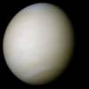
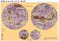
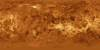
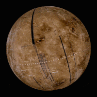
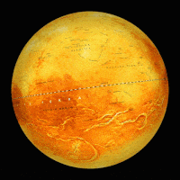
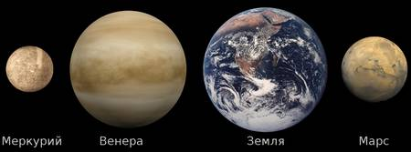
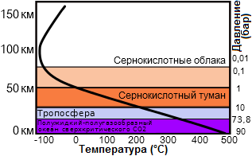
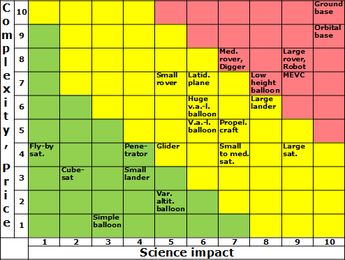
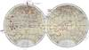

# Venus
> 2019.11.06 ┊ **🚀 [despace](index.md)** → **[Venus](venus.md)**, [Space](index.md)

[TOC]

---

 

> <small>*Terms:* **Venus** — English term. **Венера** — Russian equivalent.</small>

**Venus** (astro. ♀ [ ❐](f/aob/venus/venus_symbol_svg.png) — is the second planet from the Sun. It's named after the Roman goddess of love and beauty. No moons. Approximately in 3.5 billion years the [Earth](earth.md) may looks like Venus in terms of surface conditions.

|*Venus*|*Map*|*Map*|*Map*|
|:--|:--|:--|:--|
|  |  |  |  |

And a bit of animation.

|*The topographic  Globe of Venus*|*The Radar  Globe of Venus*|*Orbit*|
|:--|:--|:--|
|  |  |  |

 

## Characteristics
|*Characteristic*|*[Value](si.md)*|
|:--|:--|
|Breaking to the orbit| no more than 10 ‑ 15 minutes |
|Distance from Earth| 38 ‑ 261 mega km |
|Flight from Earth| 3.5 ‑ 6.1 months w/ LPS (109 ‑ 144 days) |
|Signal from Earth| 2.1 ‑ 14.5 minutes |
|Velocity from Earth| 3.5 ‑ 5 km/s |
|**Orbits:**|—|
|[Apocentre](apopericentre.md) (Aphelion);  [Pericentre](apopericentre.md) (Perihelion)| 108 942 109 km (0.72823128 au);  107 476 259 km (0.71843270 [au](si.md)) |
|[Argument of periapsis](keplerian.md) (ω)| 54.85229° |
|Day/year| 58.5 / … Earth's |
|[Eccentricity](keplerian.md) (e)| 0.0068 |
|[Hill sphere](hill_sphere.md)| 1 000 000 km |
|[Inclination](keplerian.md) (i)| 3.86° (to Sun's equator);  3.39458° (to ecliptic);  2.5° (invariable plane) |
|[Longit. of asc.node](keplerian.md) (Ω)| 76.67069° |
|Orbital velocity (v)| 35.02 km/s |
|Satellite of| [Sun](sun.md) |
|Satellites| none |
|[Semimajor axis](keplerian.md) (a)| 108 208 930 km (0.723332 au) |
|[Sider. rotat.period](astroperiod.md) (T, day)| 243.0187 days (retrograde, sync with Earth) |
|[Sidereal period](astroperiod.md) (year)| 224.698 days (224 d 16 h 45 m 7 s) |
|[Synodic period](astroperiod.md)| 583.92 days (583 d 2 h 12 m 29 s) |
|**Physics:**|—|
|[1st escape velocity](esc_vel.md) (v₁)| 7.328 km/s <small>(0.926 Earth's)</small> |
|[2nd escape velocity](esc_vel.md) (v₂)| 10.363 km/s <small>(0.926 Earth's)</small> |
|[Albedo](albedo.md)| 0.689 (geometric);  0.76 (Bond) |
|[Apparent magnitude](app_mag.md) (m)| −4.6 |
|Axial tilt| 177.36° |
|Density (ρ)| 5.24 g/cm³ (mean, <small>0.951 Earth's</small>) |
|Equatorial rotation velocity| 6.52 km/h <small>(0.0039 Earth's)</small> |
|Flattening| 0 |
|[Magnetic field](mag_field.md)| 1.98934 ‑ 3.97887 A/m <small>(0.05 ‑ 0.1 Earth's)</small> |
|Mass (m)| 4.8675·10²⁴ kg <small>(0.815 Earth's)</small> |
|Radius| 6 051 km (mean, <small>0.953 Earth's, lesser on 320 km</small>) |
|Surface area (S)| 4.60·10⁸ km² <small>(0.902 Earth's)</small> |
|[Surface gravity](g.md)| 8.87 m/s² <small>(0.904 Earth's)</small> |
|Volume (V)| 9.38·10¹¹ km² <small>(0.857 Earth's)</small> |
|**Temperature & atmosph.:**|—|
|[Atmosphere](atmosphere.md)|**Composition:**  ~96.5 % carbon dioxide (CO₂)  ~3.5 % nitrogen (N₂)  0.018 % sulfur dioxide (SO₂)  0.007 % argon (Ar)  0.003 % water vapour (H₂O)  0.0017 % carbon monoxide (CO)  0.0012 % helium (He)  0.0007 % neon (Ne)  Trace hydrogen chloride (HCl),  Trace hydrogen fluoride (HF), etc.  **Density** 67 kg/m³.  **Pressure** 9.3 MPa (93 bar).  **Winds:**  0.3 ‑ 1 m/s (surface);  up to 100 m/s (20 ‑ 60 km). |
|[Illumination](illum.md)| 200 (5.5°) ‑ 3 000 (90°) lx (surface, <small>0.2 Earth's</small>) |
|Radiation|  |
|Temperature| 737 К (464 °C) near surface |

 

## Description
<mark>TBD</mark> Obviously a pretty bulky section. Need to make it shorter.

Venus is one of the four terrestrial planets in the Solar System, meaning that it is a rocky body like Earth. It is similar to Earth in size and mass, and is often described as Earth's "sister" or "twin". The diameter of Venus is 12,103.6 km (7,520.8 mi) — only 638.4 km (396.7 mi) less than Earth's — and its mass is 81.5% of Earth's. Conditions on the Venusian surface differ radically from those on Earth because its dense atmosphere is 96.5% carbon dioxide, with most of the remaining 3.5% being nitrogen.

### Atmosphere and climate

<mark>TBD</mark> We need more precise Venus atmosphere model.

|*Dependence temperature(pressure)/height*|
|:--|
|  |

The CO₂‑rich atmosphere generates the strongest greenhouse effect in the Solar System, creating surface temperatures of at least 735 K (462 °C; 864 °F). This makes Venus's surface hotter than Mercury's, which has a minimum surface temperature of 53 K (−220 °C; −364 °F) and maximum surface temperature of 700 K (427 °C; 801 °F), even though Venus is nearly twice Mercury's distance from the Sun and thus receives only 25 % of [Mercury's](mercury.md) solar irradiance. This temperature is higher than that used for sterilization.

Thermal inertia and the transfer of heat by winds in the lower atmosphere mean that the temperature of Venus's surface does not vary significantly between the planet's two hemispheres, those facing and not facing the Sun, despite Venus's extremely slow rotation. Winds at the surface are slow, moving at a few kilometers per hour, but because of the high density of the atmosphere at the surface, they exert a significant amount of force against obstructions, and transport dust and small stones across the surface. This alone would make it difficult for a human to walk through, even without the heat, pressure, and lack of oxygen.

Above the dense CO₂ layer are thick clouds consisting mainly of sulfuric acid, which is formed by sulfur dioxide and water through a chemical reaction resulting in sulfuric acid hydrate. Clouds at different levels have different compositions and particle size distributions. These clouds reflect and scatter about 90 % of the sunlight that falls on them back into space, and prevent visual observation of Venus's surface. The permanent cloud cover means that although Venus is closer than Earth to the Sun, it receives less sunlight on the ground. Strong 300 km/h (185 mph) winds at the cloud tops go around Venus about every four to five Earth days (**atmosphere superrotation.**). Winds on Venus move at up to 60 times the speed of its rotation, whereas Earth's fastest winds are only 10 ‑ 20 % rotation speed.

The highest point on Venus, Maxwell Montes, is therefore the coolest point on Venus, with a temperature of about 655 K (380 °C; 715 °F) and an atmospheric pressure of about 4.5 MPa (45 bar).

### Magnetic field and core
Vanus have no self magnetic field. The present magnetic field is induced by an interaction between the ionosphere and the solar wind, rather than by an internal dynamo as in the Earth's core. Venus's small induced magnetosphere provides negligible protection to the atmosphere against cosmic radiation.

One possibility is that Venus has no solid inner core, or that its core is not cooling, so that the entire liquid part of the core is at approximately the same temperature. Another possibility is that its core has already completely solidified. The state of the core is highly dependent on the concentration of sulfur, which is unknown at present.

The weak magnetosphere around Venus means that the solar wind is interacting directly with its outer atmosphere. Here, ions of hydrogen and oxygen are being created by the dissociation of neutral molecules from ultraviolet radiation. The solar wind then supplies energy that gives some of these ions sufficient velocity to escape Venus's gravity field. This erosion process results in a steady loss of low‑mass hydrogen, helium, and oxygen ions, whereas higher‑mass molecules, such as carbon dioxide, are more likely to be retained. Atmospheric erosion by the solar wind probably led to the loss of most of Venus's water during the first billion years after it formed. The erosion has increased the ratio of higher‑mass deuterium to lower‑mass hydrogen in the atmosphere 100 times compared to the rest of the solar system.

### Surface & Tessera
Common areas and possible landing sites.

|*Stratigraphic Unit*|•|*Area,  M km²*|*Area,  %*|*Unsafe*|*Moder.  safe*|*Safe*|
|:--|:--:|:--|:--|:--|:--|:--|
|**Tectonic**|—|**92.82**|**20**|—|—|—|
| · Densely lineated plains |pdl| · 7.72 | · 1.69 |unsafe|||
| · Groove belt |gb| · 39.51 | · 8.66 |unsafe|||
| · Ridged plains |pr,rp| · 10.20 | · 2.24 ||mod.safe||
| · Tessera |t| · 35.38 | · 7.75 |unsafe|||
|**Volcanic**|—|**279.95**|**61.35**|—|—|—|
| · Regional planes, lower |rp1| · 150.68 | · 33.02 |||safe|
| · Regional planes, upper |rp2| · 44.79 | · 9.81 ||mod.safe||
| · Shield plains |psh| · 84.48 | · 18.51 ||mod.safe||
|**Volcano‑tectonic**|—|**78.94**|**17.30**|—|—|—|
| · Lobate plains |pl| · 40.32 | · 8.84 |unsafe|||
| · Rift zones |rz| · 24.08 | · 5.28 |unsafe|||
| · Shield clusters |sc| · 3.56 | · 0.78 |?|?|?|
| · Smooth plains |ps,sp| · 10.98 | · 2.41 |?|?|?|
| ··· Smooth plains, impact |spi| ··· ? | ··· 1 |||safe|
| ··· Smooth plains, volcanic |spv| ··· ? | ··· 1 |||safe|

**Tessera**

  
Image of «Ovda Regio», generated by [Magellan](magellan.md) ([JPL PIA00311 ⎆](https://www.jpl.nasa.gov/spaceimages/details.php?id=PIA00311)). You can see differences between the Venus plains and mountains «Ovda Regio», the western part of the huge equatorical mountains «Aphrodite Terra».

Tessera are regions of heavily deformed terrain on Venus, characterized by two or more intersecting tectonic elements, high topography, & subsequent high radar backscatter. Tessera often represent the oldest material at any given location & are among the most tectonically deformed terrains on Venus's surface. Diverse types of tessera terrain exist. It is not currently clear if this is due to a variety in the interactions of Venus's mantle with regional crustal or lithospheric stresses, or if these diverse terrains represent different locations in the timeline of crustal plateau formation & fall. Multiple models of tessera formation exist & further extensive studies of Venus's surface are necessary to fully understand this complex terrain.

**Exploration.**

Pioneer Venus Orbiter detected regions of anomalous radar properties & high backscatter. Using [SAR](synthetic_aperture_radar.md) imaging, the Venera 15 & Venera 16 orbiters revealed these regions to be chaotically tiled terrain, which Soviet scientists named "parquet" (tiled floors), later known as "Tessera". The most recent data concerning tessera terrain comes from the Magellan Mission, in which the majority of Venus's surface was mapped in high resolution (~100 m/pixel). Future missions to Venus would allow for further understanding of tessera terrain.

**Location.**

Tessera are recognized as covering 7.3 % of Venus's surface, approximately 33.2 × 106 km, & occur mostly within a few extensive provinces. They are heavily concentrated between 0 & 150 °E. These longitudes represent a large area between a crustal extension center in the Aphrodite Terra & a crustal convergence center in Ishtar Terra. Tessera are exposed almost entirely within Venus's crustal plateaus. Tessera inliers, regions of tessera not found within current crustal plateaus are thought to represent regions of collapsed crustal plateaus. Large regions of tessera terrain are labeled based on their latitude. Regions in the equatorial & southern latitudes are labeled as "Regio" while regions in the northern latitudes are labeled as "Tessera".

A comprehensive list of Regiones & Tessera can be found under <https://en.wikipedia.org/wiki/List_of_geological_features_on_Venus>. Some well explored regions of tessera include: Aphrodite Terra, Alpha Regio, Beta Regio, Fortuna Tessera, Ovda Regio.

**Origins.**

Tessera represent an ancient time of globally thin lithosphere on Venus. Tessera Terrain does not participate in the global resurfacing events of Venus. It was thought by many researches that the Tessera might form a global "onion skin" of sorts, & extended beneath Venus's regional plains. However, the currently accepted models support regional formation. Multiple models have been put forward to explain the formation of tessera terrain. Models of formation by mantle downwelling & pulsating continents are the most currently accepted models. A model of formation due to a lava pond via bolide impact was put forth, although it has not currently gained much traction in the scientific community due to skepticism of the ability of a bolide impact to generate sufficient melt. A model of formation due to mantle plumes (upwelling) was persistent for many years, however, it has since been abandoned due to its contradictory prediction of sequences of extension versus the observed cross cutting relationships.

**Varieties.**

Individual patterns of Tessera Terrain record the variations in interactions of the mantle with local regional stresses. This variation manifests itself in a wide array of diverse terrain types. Multiple types of sampled Tessera Terrain are below, however, they are not meant as a classification scheme, & instead emphasize the variety of terrain types.

   - **Fold Terrain** is easily recognizable by its well defined linear fabrics. This type of terrain is composed of long ridges & valleys, greater than 100 km long, that are cross cut by minor extensional fractures that run perpendicular to the fold axes of the ridges. This likely formed due to unidirectional contraction.
   - **Lava Flow Terrain** is named such due to its resemblance to Pahoehoe flows found on Earth, with long curving ridges. It is thought that this terrain may be formed due to displacement & deformation due to movement of the material beneath these crustal pieces.
   - **Ribbon Terrain** is characterized by ribbons & folds that are typically orthogonal to one another. Ribbons are long & narrow extensional troughs that are separated by narrow ridges. Ribbon terrain can be found both in large crustal plateaus & within tessera inliers.
   - **S‑C Terrain** is named such due to its geometric similarity to S‑C tectonic fabrics on Earth. It consists of two main structures: synchronous folds & small, 5 ‑ 20 km long graben that cross cut the folds perpendicularly. Unlike many other types of tessera terrain, S‑C terrain indicates a simple, rather than complex deformation history in which deformation due to widespread motion on Venus is widely distributed. This type of terrain also indicates that strike‑slip movement on Venus's surface is possible.
   - **Basin & Dome Terrain**, also known as honeycomb terrain, consists of curved ridges & troughs that form a pattern analogous to an egg carton. These structures represent multiple phases of deformation, & are considered the most complex appearing style of tessera. Basin & dome terrain is typically found within the center of crustal plateaus.
   - **Star Terrain** is composed of multiple graben & fractures that trend in many directions, but radiate in a star‑like pattern. This pattern is thought to be due to doming underneath previously deformed & fractured areas, in which the local uplift causes the radiating pattern.

 

## Developing features
**Literature:**

   1. Венера — неукротимая планета (2018, Москва) — short story of the Venus explorations; starting point.

**Orbiter:**

   1. Heat reflecting issues on the Venus orbit H<700 km.
   1. Commonly spacecraft for Venus and [Mars](mars.md) can be almost the same.

**Lander:**

   1. As a [power supply](sps.md) can be used only [wind turbine](wt.md) and [electric battery](eb.md).

**Earth:**

   1. Launch window opens roughly every 19 months (1 year 7 months).
   1. **Testing equipment:**
      - Hi‑pressure vessels:
         - [AVEC](avec.md) (V = 0.0007 m³, [JHU APL](03_jhuapl.md)),
         - [GEER](geer.md) (V = 0.811 m³ and 0.004 m³, [GRC](03_grc.md)).

**Table.** [Dependency between the complexity, price and science impact ❐](f/aob/venus/cps_dependency.odt).  
• A swamp of each position basically adds +1 ‑ +2 to complexity and science impact.  
• A long ‑lived option for a lander basically adds +2 to complexity and +1 to science impact.  
• Powered (p.) — means an SC can change direction despite of outer forces.

 

## Venus exploration

### What for?
<mark>TBD</mark>

   1. [Future of Venus research & exploration ❐](f/project/program/2017_future_of_venus_research_and_exploration.pdf) (NASA, 2017)

### Timeline
<https://nssdc.gsfc.nasa.gov/planetary/chronology.html>

  
*Timeline*

<mark>TBD</mark>

 

### Communities & persons
**Communities:**

   - **[VEXAG](vexag.md)** — Venus exploration community founded in 2005 in USA: organizing the annual conferences of the same name, and a bunch of episodic (or not) meetings with the similar topics, watching the word‑wide Venus explorations state, creating some recommendations for NASA.
   - <https://www.kiss.caltech.edu/workshops/venus/venus.html> <mark>TBD</mark>
   - **Mailing lists:**
      - Planetary Exploration Newsletter, PEN mailing list <http://planetarynews.org/>
      - Venus Listserve news <https://lists.psi.edu/mailman/listinfo/venus>

**Persons:** (alphabet order)

   1. Tibor Balint
   1. Mark Bullock
   1. James A. Cutts
   1. Thanasis Economou
   1. David Grinspoon
   1. Jeffery L. Hall
   1. Tibor Kremic
   1. Sanjay Limaye
   1. <mark>TBD</mark>

**Persons of the past:** (alphabet order)

   1. <mark>TBD</mark>

 

### Projects
See also section «[Projects](project.md)».

**Hypothetical and historical:**

   - In the section [Research](project.md):
      - (1) Wireless electricity transmission for a Venusian SC
      - (4) Materials for Venus
      - (12) Human on Venus
   - [VGV](hptc_vgv.md)
   - [DSVSD](hptc_dsvsd.md)

**Venus rovers:**

   - [AREE](aree.md) (concept of 2016) <mark>TBD</mark>
   - [Zephyr](zephyr.md) (concept of 2012) <mark>TBD</mark>

Venus missions: <mark>TBD</mark>

   - HAVOC
   - HOVER
   - VICI
   - VISAGE
   - VISE

Flybys: <mark>TBD</mark>

   - Europa Clipper
   - Mercury-P
   - Laplace-P
   - NASA Uranus orbiter & probe

Standalone units:

   - [LLISSE](llisse.md) <mark>TBD</mark>
   - [MEVC](mevc.md) <mark>TBD</mark>
   - [SAEVe](saeve.md) <mark>TBD</mark>
   - [Solar Aircraft](solar_aircraft.md) by GRC <mark>TBD</mark>
   - [VAMP](vamp.md) <mark>TBD</mark>

**Table.** Missions/spacecraft of past and future.  
<small>(**Ⓛ** — LAV; **Draft** — minimum for working with object. **D** — distant exploration; **C** — contact exploration; **F** — fly‑by; **H** — manned flight; **S** — soil sampe return; **X** — technology demonstration)</small>

<small>

|*✔*|*Mission/SC (index)*|*Date (UTC)*|*D*|*C*|*F*|*H*|*S*|*X*|*Notes*|
|:--:|:--|:--|:--:|:--:|:--:|:--:|:--:|:--|:--|
|—|**Proposed:**|—|—|—|—|—|—|—|—|
|US| [DAVINCI / DAVINCI+](davinci.md) | … |D|||||| <mark>TBD</mark> concept of 2015 |
|US| [Cubesat UV Experiment](cubesat_uv_experiment.md) (CUVE) | … |D|||||| concept of 2017 |
|US| [Venus Flagship Mission](venus_flagship_mission.md) (VFM) | … |D|C||||X| concept of 2007 |
|US| [Venus Mobile Explorer](venus_mobile_explorer.md) (VME) | … ||C||||X| <mark>TBD</mark> concept of 2009 |
|US| [Venus Observing System](venus_observing_system.md) (VOS) | … |D|C||||X| concept of 2019 |
|US| [Venus Origins Explorer](venus_origins_explorer.md) (VOX) | … |D|||||| <mark>TBD</mark> concept of 2017 |
|EU·US| [Venus Sample Return Mission](venus_sample_return_mission.md) (VSRM) | … ||C|||S|X| <mark>TBD</mark> concept of 1986 |
|US| [VERITAS](veritas.md) | … |D|||||| <mark>TBD</mark> concept of 2015 |
|EU| [EnVision](envision.md) | 2032 |D||||||  |
|RU| [Venera‑D](venera_d.md) (ВД) Ⓛ | 2029 |D|C||||| <mark>TBD</mark> |
|—|**Developing:**|—|—|—|—|—|—|—|—|
|IN| [Shukrayaan‑1](shukrayaan_1.md) | 2023 |D|||||| <mark>TBD</mark> |
|US| [Xcraft](xcraft.md) | 2022 ||||||X| <mark>TBD</mark> |
|—|**Active:**|—|—|—|—|—|—|—|—|
|EU·JP| [BepiColombo](bepicolombo.md) | 2018.10.20 |D||F|||| <mark>TBD</mark> |
|US| [Parker Solar Probe](parker_solar_probe.md) | 2018.08.12 |D||F|||| <mark>TBD</mark> |
|JP| [Akatsuki](akatsuki.md) | 2010.05.21 |D|||||| |
|—|**Past:**|—|—|—|—|—|—|—|—|
|EU| [Venus Express](venus_express.md) (VEX) | 2005.11.09 |D|||||| <mark>TBD</mark> |
|US| [Messenger](messenger.md) | 2004.08.03 |D||F|||X| <mark>TBD</mark> |
|US| [Cassini Huygens](cassini_huygens.md) | 1997.10.15 |D||F|||X| <mark>TBD</mark> |
|US| [Galileo](galileo.md) | 1989.10.18 |D||F|||X| <mark>TBD</mark> |
|US| [Magellan](magellan.md) | 1989.05.04 |D||F|||| ±<mark>TBD</mark> |
|SU| [VeGa‑2](vega_1_2.md) (5ВК) Ⓛ | 1984.12.21 |D|C||||| ±<mark>TBD</mark> |
|SU| [VeGa‑1](vega_1_2.md) (5ВК) Ⓛ | 1984.12.15 |D|C||||| ±<mark>TBD</mark> |
|SU| [Venera‑16](venera_15_16.md) (4В2) Ⓛ | 1983.06.07 |D|||||| ±<mark>TBD</mark> maps N.pole |
|SU| [Venera‑15](venera_15_16.md) (4В2) Ⓛ | 1983.06.02 |D|||||| ±<mark>TBD</mark> maps N.pole |
|US| ~~[Venus Orbiting Imaging Radar](venus_orbiting_imaging_radar.md) (VOIR)~~ | 1983.05 |D|||||X| ±<mark>TBD</mark> hi‑res images |
|SU| [Venera‑14](venera_13_14.md) (4В1М) Ⓛ | 1981.11.04 ||C||||| ±<mark>TBD</mark> color surface imgs |
|SU| [Venera‑13](venera_13_14.md) (4В1М) Ⓛ | 1981.10.30 ||C||||| ±<mark>TBD</mark> color surface imgs |
|SU| [Venera‑12](venera_11_12.md) (4В1) Ⓛ | 1978.09.14 |D|C||||| ±<mark>TBD</mark> |
|SU| [Venera‑11](venera_11_12.md) (4В1) Ⓛ | 1978.09.09 |D|C||||| ±<mark>TBD</mark> |
|US| [Pioneer‑Venus‑2](pioneer_venus_2.md) | 1978.08.08 |D|||||| ±<mark>TBD</mark> surface map |
|US| [Pioneer‑Venus‑1](pioneer_venus_1.md) | 1978.05.20 |D|||||| ±<mark>TBD</mark> surface map |
|SU| [Venera‑10](venera_9_10.md) (4В1) Ⓛ | 1975.06.14 |D|C||||| ±<mark>TBD</mark> 1st surface img |
|SU| [Venera‑9](venera_9_10.md) (4В1) Ⓛ | 1975.06.08 |D|C||||| ±<mark>TBD</mark> 1st Vsat, surface img |
|US| [Mariner‑10](mariner_10.md) | 1973.11.04 |D||F|||| ±<mark>TBD</mark> |
|SU| [Venera‑8](venera_8.md) (В‑72) Ⓛ | 1972.03.27 ||C||||| ±<mark>TBD</mark> 1st relief imgs |
|SU| [Venera‑7](venera_7.md) (В‑70) Ⓛ | 1970.08.17 ||C||||| ±<mark>TBD</mark> 1st soft landing |
|SU| [Venera‑6](venera_5_6.md) (2В, В‑69) Ⓛ | 1969.01.10 |D|||||| ±<mark>TBD</mark> |
|SU| [Venera‑5](venera_5_6.md) (2В, В‑69) Ⓛ | 1969.01.05 |D|||||| ±<mark>TBD</mark> |
|US| [Mariner‑5](mariner_5.md) | 1967.06.14 |D|||||| ±<mark>TBD</mark> |
|SU| [Venera‑4](venera_4.md) (1В, В‑67) Ⓛ | 1967.06.12 |D|||||| ±<mark>TBD</mark> |
|SU| [Venera‑3](venera_2_3.md) (3МВ‑3) | 1965.11.16 |D|C||||| ±<mark>TBD</mark> 1st fly/land Venus SC |
|SU| [Venera‑2](venera_2_3.md) (3МВ‑4) | 1965.11.12 |D|||||| ±<mark>TBD</mark> |
|SU| [Zond‑1](zond_1.md) | 1964.04.02 |D||F|||| ±<mark>TBD</mark> |
|US| [Mariner‑2](mariner_2.md) | 1962.08.27 |D|||||| ±<mark>TBD</mark> |
|SU| [Venera‑1](venera_1.md) (1ВА) | 1961.02.12 |D||F|||| ±<mark>TBD</mark> |

</small>

 

## Science & tech targets
Just a preliminary list of the targets and explorations for the Venus. Based on the investigations of VEXAG (<https://www.lpi.usra.edu/vexag/>), Venera‑D mission work‑group (LAV, IKI RAS, NASA, etc.) and anyone who can.

The main idea is to prepare a brief (sic!) systematized list of the Venusian targets and explorations of the retired/active/proposed spacecraft suitable both for scientists, and engineers, and managers, and passers by. The one which is able in the same time to tell about what was done and in what volume, what is processing now and why it's cool, what is proposed and why it's so important. Something like a bridge between scientists and other humanity just to show that all of these complex scientific terms can be described with some statistic terms without need to read a lot of literature or trust their words.

Soon there will be something new, for example, links between targets/explorations, spacecraft, and a couple of brief description of the current state of each one.

### Intro
Targets & explorations for Venus, including [VEXAG](vexag.md) activity. Comments:

   - **T** — technical; **Draft** — minimum for working with object. **D** — distant exploration; **C** — contact exploration; **F** — fly‑by; **H** — manned flight; **S** — soil sampe return; **X** — technology demonstration
   - **Sections of measurement and observation:**
      - Atmospheric/climate — **Ac** composition, **Ai** imaging, **Am** mapping, **Ap** pressure, **As** samples, **At** temperature, **Aw** wind speed/direction.
      - General — **Gi** planet’s interactions with outer space.
      - Soil/surface — **Sc** composition, **Si** imaging, **Sm** mapping, **Ss** samples.

In brief — 97 targets in total (33 technical, 64 scientific) consisting of: 37 never occured (18 technical, 19 scientific), 53 was tried (11 technical, 42 scientific), 7 mostly done (4 technical, 3 scientific).

<small>

|*EVN‑XXX*|*T*|*EN*|*Section of m&o*|*D*|*C*|*F*|*H*|*S*|
|:--|:--|:--|:--|:--:|:--:|:--:|:--:|:--:|
|—|—|**Never occurred:**|—|—|—|—|—|—|
|EVN‑080||Albedo: changes in time.| Gi |D||F|||
|EVN‑036||Atmosphere: cause & influence of geological & chemical activity on the climate & clouds.|  |D|||||
|EVN‑037||Atmosphere: cause of the retrograde moving.|  |D|||||
|EVN‑032||Atmosphere: characteristics of the CO₂ & N₂ in state of the supercritical fluid in the lower layers.| Ac, Ai, Am, At |D|||||
|EVN‑007||Atmosphere: connection between the topography & the atmo circulation.|  |D|||||
|EVN‑033||Atmosphere: nature of it's escape.|  |D|||||
|EVN‑038||Atmosphere: processes of the atmospheric parts dissipation.|  |D|||||
|EVN‑082|T|Atmosphere: prolonged investigations on the H=0‑10 km.| All A ||||||
|EVN‑083|T|Atmosphere: prolonged investigations on the H=10‑30 km.| All A ||||||
|EVN‑054|T|Atmosphere: sample return.| As ||C||||
|EVN‑015||Atmosphere: structure of the mesosphere.| All A |D|||||
|EVN‑030||Atmosphere: was it lost during some cataclysm or evenly?|  |D|||||
|EVN‑095||Climate: history & causes of changes.|  |D|||||
|EVN‑087||Crustal support mechanisms.|  |D|||||
|EVN‑051||Dimensions & characteristics of the mantle & the core.|  |D|||||
|EVN‑057|T|Exploration with [satellites](sc.md): microsatellites.|  |D||F|||
|EVN‑071|T|Exploration with [satellites](sc.md): nanosatellites.|  |D||F|||
|EVN‑058|T|Exploration: directed seismoexperiment.|  |D||F|||
|EVN‑056|T|Exploration: from L1/L2.| Ai, Am, At, Gi |D|||||
|EVN‑059|T|Exploration: with [rover](rover.md).| All A/S ||C||||
|EVN‑081|T|Extreme environment electronics.|  |D|C|F|||
|EVN‑094|T|High temperature electronics.|  |D|C|F|||
|EVN‑066|T|Human on the surface.|  ||C||H||
|EVN‑065|T|Human on the Venus orbit.|  |D|||H||
|EVN‑060|T|Manned fly‑by.|  |D||F|H||
|EVN‑043||Mechanisms of the mantle's convection.|  |D||F|||
|EVN‑048||Nature & sources of the greenhouse effect.|  |D||F|||
|EVN‑049||Nature of the thermal tides.|  |D|||||
|EVN‑069|T|Prolonged surface‑spacecraft functioning.|  ||C||||
|EVN‑064|T|Planetary terraforming.|  ||C||H||
|EVN‑045||Surface: nature of the tessera.|  |D|||||
|EVN‑061|T|Surface: sample return.|  ||C|||S|
|EVN‑088|T|Surface: subsurface investigations.|  ||C||||
|EVN‑086|T|Surface: tessera investigations, close.|  ||C||||
|EVN‑047||Surface: what can be said about the structure & composition of the surface of different regions according to Venus's evolution.|  ||C||||
|EVN‑039||Was the Venus inhabited & for how long?|  |D|C||||
|EVN‑040||Were there oceans & why has they gone?|  |D|C|F|||
|—|—|**Was tried:**|—|—|—|—|—|—|
|EVN‑093|T|Atmosphere/surface imaging.|  |D||F|||
|EVN‑077||Atmosphere: chemical elements distribution.|  |D||F|||
|EVN‑018||Atmosphere: clouds, their chemistry.|  |D||F|||
|EVN‑075||Atmosphere: clouds, their nature.|  |D||F|||
|EVN‑016||Atmosphere: clouds, their structure.|  |D||F|||
|EVN‑011||Atmosphere: common circulation model.|  |D|||||
|EVN‑014||Atmosphere: composition.|  |D|||F||
|EVN‑019||Atmosphere: energetic balance.|  |D|||||
|EVN‑008||Atmosphere: flashing on the night side.|  |D|||||
|EVN‑013||Atmosphere: illumination of the surface & the atmo layers.|  |D|||||
|EVN‑096||Atmosphere: ionosphere.|  |D||F|||
|EVN‑012||Atmosphere: lightnings.|  |D|||||
|EVN‑031||Atmosphere: long‑term variations of the meteocharacterictics on the surface.|  |D|||||
|EVN‑068||Atmosphere: nature of the polar dipole.|  |D|||||
|EVN‑067||Atmosphere: nature of the polar turbulence.|  |D|||||
|EVN‑034||Atmosphere: nature of the superrotation.|  |D|||||
|EVN‑035||Atmosphere: nature of the UF‑absorber.|  |D|||||
|EVN‑084|T|Atmosphere: prolonged investigations on the H=30‑60 km.|  |D|||||
|EVN‑078|T|Atmosphere: radiography.|  |D|||||
|EVN‑055|T|Atmosphere: sample obtaining & analysis.|  ||C||||
|EVN‑009||Atmosphere: SO₂ concentration & nature of its variations.|  |D|||||
|EVN‑017||Atmosphere: structure.|  |D|||||
|EVN‑097||Atmosphere: the effect of solar radiation & interplanetary space on the atmo.|  |D||F|||
|EVN‑010||Atmosphere: vertical model.|  |D|||||
|EVN‑050||Causes of the water loss.|  |D|||||
|EVN‑041||Correlation between the atmosphere & the surface.|  |D|||||
|EVN‑073|T|Exploration with [satellites](sc.md): large satellites.|  |D||F|||
|EVN‑072|T|Exploration with [satellites](sc.md): medium satellites.|  |D||F|||
|EVN‑070|T|Exploration with [satellites](sc.md): minisatellites.|  |D||F|||
|EVN‑042||History & causes of the planet's volcanic & tectonic evolution.|  |D|||||
|EVN‑020||Inner structure of the planet.|  |D|||||
|EVN‑029||Is Venus geologically active?|  |D|C|F|||
|EVN‑028||Magnetosphere structure.|  |D||F|||
|EVN‑089||Measuring the planetary gravitational field.|  |D||F|||
|EVN‑074||Meteorological model.|  |D||F|||
|EVN‑079||Precise duration of the Venusian day.|  |D|||||
|EVN‑052||Role of water (fluids) in planetary geology.|  |D|C|F|||
|EVN‑092|T|Serve as a relay to Earth for stand‑alone SC/instruments.|  |D|||||
|EVN‑046||Surface: causes of the changes during the last billion years.|  |D|C|F|||
|EVN‑024||Surface: composition.|  ||C||||
|EVN‑026||Surface: elemental composition.|  ||C||||
|EVN‑021||Surface: map, 3D.|  |D|C||||
|EVN‑022||Surface: map, precise.|  |D|||||
|EVN‑023||Surface: mineralogical composition.|  ||C||||
|EVN‑044||Surface: nature & causes of forming of the current rocks & soils.|  ||C||||
|EVN‑062|T|Surface: obtaining & analysis of the surface samples.|  ||C|||S|
|EVN‑063|T|Surface: panoramic mapping.|  ||C||||
|EVN‑025||Surface: structure.|  ||C||||
|EVN‑085|T|Surface: tessera investigations, ranged.|  |D||F|||
|EVN‑076||Surface: volcanoes, their presence.|  |D||F|||
|EVN‑027||The causes why Venus evolved in a planet so different from Earth.|  |D|C|F|||
|EVN‑091||The loss rate of water from Venus.|  |D||F|||
|EVN‑053||Traces of life in the atmosphere & on the surface.|  ||C||||
|—|—|**Mostly done:**|—|—|—|—|—|—|
|EVN‑001||Atmosphere: model, draft.|  |D|C|F|||
|EVN‑004|T|Exploration: from Earth.|  |D|||||
|EVN‑003|T|Exploration: from inside of atmosphere.|  |D|C||||
|EVN‑006|T|Exploration: from surface.|  ||C||||
|EVN‑005|T|Exploration: from Venusian orbit.|  |D||F|||
|EVN‑090||Spin axis.|  |D|||||
|EVN‑002||Surface: map, draft.|  |D|C||||

</small>

 

**VEXAG Goals, Objectives & Investigations (2019).**

>Notes to the list below: **I.** − **III.** are **Goals**; **A.** − **B.** are **Objectives** **(1)** − **(3)** are **Investigations**

**I.** Understand Venus’ early evolution and potential habitability to constrain the evolution of Venus-size (exo)planets.

   - **A.** Did Venus have temperate surface conditions and liquid water at early times?
      - **HO. Hydrous Origins (1)**. Determine whether Venus shows evidence for abundant silicic igneous rocks and/or ancient sedimentary rocks.
      - **RE. Recycling (1)**. Search for structural, geomorphic, and chemical evidence of crustal recycling on Venus.
      - **AL. Atmospheric Losses (2)**. Quantify the processes by which the atmosphere of Venus loses mass to space, including interactions between magnetic fields and incident ions and electrons.
      - **MA. Magnetism (3)**. Characterize the distribution of any remanent magnetism in the crust of Venus.
   - **B.** How does Venus elucidate possible pathways for planetary evolution in general?
      - **IS. Isotopes (1)**. Measure the isotopic ratios and abundances of D/H, noble gases, oxygen, nitrogen, and other elements in the atmosphere of Venus.
      - **LI. Lithosphere (1)**. Determine lithospheric parameters on Venus that are critical to rheology and potential geodynamic transitions, including: stress state, water content, physical structure, and elastic and mechanical thicknesses.
      - **HF. Heat flow (2)**. Determine the thermal structure of the lithosphere of Venus at present day and measure in situ heat flow.
      - **CO. Core (2)**. Measure the size of the core of Venus and determine whether it remains partially liquid.

**II.** Understand atmospheric dynamics and composition on Venus.

   - **A.** What processes drive the global atmospheric dynamics of Venus?
      - **DD. Deep Dynamics (1)**. Characterize the dynamics of the lower atmosphere (below about 75km) of Venus, including: retrograde zonal super-rotation, meridional circulation, radiative balances, mountain waves, and transfer of angular momentum.
      - **UD. Upper Dynamics (1)**. In the upper atmosphere and thermosphere of Venus, characterize global dynamics and interactions between space weather and the ionosphere and magnetosphere.
      - **MP. Mesoscale Processes (2)**. Determine the role of mesoscale dynamics in redistributing energy and momentum throughout the atmosphere of Venus.

   - **B.** What processes determine the baseline and variations in Venus atmospheric composition and global and local radiative balance?
      - **RB. Radiative Balance (1)**. Characterize atmospheric radiative balance and how radiative transport drives atmospheric dynamics on Venus.
      - **IN. Interactions (1)**. Characterize the nature of the physical, chemical, and possible biological interactions among the constituents of the Venus atmosphere.
      - **AE. Aerosols (2)**. Determine the physical characteristics and chemical compositions of aerosols in Venus atmosphere as they vary with elevation, including discrimination of aerosol types/components.
      - **UA. Unknown Absorber (2)**. Characterize the unknown shortwavelength absorber in the upper atmosphere of Venus and its influence on local and global processes.
      - **OG. Outgassing (3)**. Determine the products of volcanic outgassing on Venus and their effects on atmospheric composition.

**III.** Understand the geologic history preserved on the surface of Venus and the present-day couplings between the surface and atmosphere.

   - **A.** What geologic processes have shaped the surface of Venus?
      - **GH. Geologic History (1)**. Develop a geologic history for Venus by characterizing the stratigraphy, modification state, and relative ages of surface units.

      - **GC. Geochemistry (1)**. Determine elemental chemistry, mineralogy, and rock types at localities representative of global geologic units on Venus.
      - **GA. Geologic Activity (1)**. Characterize current volcanic, tectonic, and sedimentary activity that modifies geologic units and impact craters and ejecta on Venus.
CR. Crust (2). Determine the structure of the crust of Venus in three dimensions and thickness across the surface.

   - **B.** How do the atmosphere and surface of Venus interact?
      - **LW. Local Weathering (1)**. Evaluate the mineralogy, oxidation state, and changes in chemistry of surface-weathered rock exteriors at localities representative of global geologic units on Venus.
      - **GW. Global Weathering (2)**. Determine the causes and spatial extents of global weathering regimes on Venus.
      - **CI. Chemical Interactions (3)**. Characterize atmospheric composition and chemical gradients from the surface to the cloud base both at key locations and globally.

> Because understanding Venus as a planetary system requires progress in many scientific areas, *Goals and Objectives are not prioritized*.  
Investigations are typed as **Essential** (1), **Important** (2), or **Targeted** (3) based on their relationship to the corresponding Objective.  
 Completion of all **Essential** Investigations fundamentally addresses their Objective.  
 **Important** Investigations address many aspects of their Objective and provide valuable context for other Investigations.  
 **Targeted** Investigations address particular aspects of an Objective that significantly contribute to our overall understanding of Venus.  
 Investigations with the same ranking have the same level of priority. All listed Investigations are deemed to be significant and worthy of programmatic consideration.

**Related GOI and EVN investigations:**

|*Investigation in 2019 GOI*|*Related targets & explorations for Venus EVN*|
|:--|:--|
| I.A.HO. Hydrous Origins (1) | EVN‑023, EVN‑052 |
| I.A.RE. Recycling (1) | EVN‑023, EVN‑025, EVN‑045, EVN‑046, EVN‑047, EVN‑062, EVN‑085, EVN‑086 |
| I.A.AL. Atmospheric Losses (2) | EVN‑028, EVN‑033, EVN‑038, EVN‑050, EVN‑091, EVN‑097 |
| I.A.MA. Magnetism (3) | EVN‑028, EVN‑096, EVN‑097 |
| I.B.IS. Isotopes (1) | EVN‑014, EVN‑055, EVN‑077 |
| I.B.LI. Lithosphere (1)  | EVN‑020, EVN‑025, EVN‑047, EVN‑052, EVN‑087 |
| I.B.HF. Heat Flow (2) | EVN‑019 |
| I.B.CO. Core (2) | EVN‑020, EVN‑051 |
| II.A.DD. Deep Dynamics (1) | EVN‑007, EVN‑011, EVN‑019, EVN‑032, EVN‑034, EVN‑082, EVN‑083, EVN‑084 |
| II.A.UD. Upper Dynamics (1) | EVN‑011, EVN‑028, EVN‑034, EVN‑067, EVN‑068, EVN‑097 |
| II.A.MP. Mesoscale Processes (2) | EVN‑011, EVN‑019, EVN‑034 |
| II.B.RB. Radiative Balance (1) | EVN‑011, EVN‑019, EVN‑034, EVN‑049, EVN‑077 |
| II.B.IN. Interactions (1) | EVN‑019, EVN‑035, EVN‑036, EVN‑041, EVN‑048, EVN‑053, EVN‑095, EVN‑097 |
| II.B.AE. Aerosols (2) | EVN‑014, EVN‑016, EVN‑018, EVN‑077 |
| II.B.UA. Unknown Absorber (2) | EVN‑019, EVN‑035, EVN‑048, EVN‑077, EVN‑080 |
| II.B.OG. Outgassing (3) | EVN‑009, EVN‑041, EVN‑042 |
| III.A.GH. Geologic History (1) | EVN‑023, EVN‑024, EVN‑025, EVN‑042, EVN‑044, EVN‑045, EVN‑046, EVN‑061, EVN‑062, EVN‑085, EVN‑086 |
| III.A.GC. Geochemistry (1) | EVN‑023, EVN‑024, EVN‑026, EVN‑044, EVN‑061, EVN‑062, EVN‑085, EVN‑086 |
| III.A.GA. Geologic Activity (2) | EVN‑029, EVN‑036, EVN‑043, EVN‑058, EVN‑087 |
| III.A.CR. Crust (2) | EVN‑020, EVN‑025, EVN‑087 |
| III.B.LW. Local Weathering (1) | EVN‑023, EVN‑041, EVN‑044 |
| III.B.GW. Global Weathering (2) | EVN‑007, EVN‑044, EVN‑046 |
| III.B.CI. Chemical Interactions (3) | EVN‑010, EVN‑014, EVN‑077, EVN‑082, EVN‑083 |

The list of **GOI 2019** and its relation to GOI 2016 can be viewed in the [document](https://www.lpi.usra.edu/vexag/reports/VEXAG_Venus_GOI_Current.pdf) on the VEXAG website.

The list of **GOI 2016** can be viewed in a [document](https://www.lpi.usra.edu/vexag/reports/GOI-Space-Physics-Update-0816.pdf) on the VEXAG website.

### A brief task analysis
This list of tasks is approximate & informative. The main completed tasks are listed here. For more information, see the Venus missions or the task list below.

**What already has been done** for 2020.03.

   - **General:**
      1. Types of Venusian [SC](sc.md):
         - balloon (medium, mini),
         - lander (large, ≤ 3 hours),
         - orbiter (large, medium, mini, ≤ 1 year).
      1. The length of the Venus's day & the tilt of the axis were precisely determined. Confirmed the Venus's retrograde rotation. The single search for organics was without success.
      1. The gravitational field was measured fairly well (but not 100 %). It was found that if the planet has a magnetic field it is very weak (not within the sensitivity of the instruments), but it has a strong induced magnetic field (which is formed when the upper atmosphere of the planet interacts with the solar wind). The planet also has an electric field that is much stronger the Earth's one. This field is one of the reasons for the dissociation of water into oxygen & hydrogen & the removal of hydrogen into space. Since the planet does not have it's own magnetic field, there are no radiation belts, unlike the Earth. The absence of a magnetic field, as well as the absence of visible activity of the planet may indicate that the core of the planet has cooled & the mantle is not liquid enough (due to the lack of a lubricant — water) to reveal any activity.
   - **Atmosphere:**
      1. Almost all of the meteorological parameters (temperature, pressure) & atmospheric density were measured. All these parameters were measured as a function of height. The winds were measured, & the gradation was determined by both altitude & latitude; near the surface the wind speed is lower. Also, the wind speed is lower closer to the equator. The pole vortices were discovered.
      1. The composition of the atmosphere, which practically consists of carbon dioxide with a small admixture of nitrogen & other gases (including inert ones), was determined fairly accurately.
      1. The structure of the atmosphere of Venus was determined, three layers of clouds were found, & the composition of aerosols that make up the cloud layers was determined. Under the clouds‑an eternal haze without any changes. On the surface, even on the night side, there is no large temperature difference — the greenhouse effect (about 96 % of the CO₂ in the atmosphere). There are no shadows on the surface — all because of Rayleigh scattering. Atmospheric samples were collected & analyzed. Very little of the sun's light reaches the surface of Venus. during the day, the level of illumination is the same as at dusk on Earth. But the chase for lightning has not yet led to anything.
   - **Surface:**
      1. To study the surface of Venus, you can resort to various techniques.
      1. Since the atmosphere of Venus is not transparent for the visible range of wavelengths, many devices have photographed its surface in the radio range of electromagnetic radiation. Almost the entire surface (98 %) was captured in high resolution, & almost a quarter of the surface was captured in stereo (3D map). Panoramic images were taken (but only at 180°), where you can see the terrain of the planet in some specific places, as well as weather conditions. Thanks to images of the surface, various formations were found on the surface of Venus, such as tessera, arachnoids, domes, & more. Soil samples were taken & the composition (elements/minerals) was determined.
      1. The surface of the planet is quite young (about 500 M years), but it does not show signs of activity.
      1. No volcanoes were detected directly, only sub/surface areas with elevated temperatures were detected. Also, during a long mission, a surge of volcanic gas SO₂ was detected, which together with the previous point can indirectly confirm the assumption of the presence of volcanism on the planet, but only an assumption.

**What to do/explore.** <mark>TBD: maybe, a bit of priorities here?</mark>

   - **General:**
      1. Types of Venusian [SC](sc.md):
         - balloon:
            - gigantic,
            - large,
            - maneuverable,
            - manned,
         - ground base:
            - manned,
            - unmanned,
         - lander:
            - net,
            - maneuverable,
            - manned,
            - ≥ 3 hours,
            - ≥ 5 hours,
            - ≥ 24 hours,
         - orbiter:
            - net,
            - micro,
            - nano,
            - manned,
            - L1/L2,
            - HVO,
            - LVO,
            - ≥ 1 year,
            - ≥ 5 year,
            - ≥ 10 year,
         - penetrator,
         - plane:
            - large,
            - medium,
            - mini,
            - maneuverable,
            - manned,
         - rover:
            - large,
            - medium,
            - mini,
            - manned.
      1. Study of the internal structure of the planet. Parameters of the core, mantle, crust. Their interaction & influence on the appearance of the planet.
      1. Study of the mantle can answer questions about the planet's tectonics & volcanism (activity), the content of carbon dioxide & sulfur dioxide in the atmosphere.
      1. Search for life or it's traces. At an altitude of 50 km the conditions of Venus are similar to the Earth's ones.
      1. Why does the planet rotate in the opposite direction?
  - **Atmosphere:**
      1. No answer about the nature of atmospheric superrotation & polar vortices.
      1. What processes occur in the planet's atmosphere?
      1. The study of UV absorbers, changing albedo over time & energy balance is interrelated?
      1. How did geological activity in the past affect the current appearance of the planet, how/and at what stage did the deviation in the evolution of the twin planets occur? How did this affect the planet's atmosphere?
      1. The interaction of the atmosphere & the surface (weathering? chemical reactions? or there is no such interaction?).
  - **Surface:**
      1. Surface structures. Reasons of their formation, is it still going on? What are tessera?
      1. Why is there no tectonics similar to Earth's?
      1. How has the lack of water affected the appearance of the planet now? What was her role in the early days? Were there oceans on Venus? How / why did they disappear?
      1. When studying Venus, it is necessary to make collection & analyze soil samples in different places & in different surface structures. A planet rover would be suitable for such research. A return of the soil samples to Earth would be nice.

**It's not known if it's possible in either technical or financial ways.**

   - In the future — terraforming of Venus, and, accordingly, a human on Venus.
   - Huge atmospheric balloons with possible human presence.
   - Rovers, full‑sized long‑lived stations.

 

### EVN‑001
Atmosphere: model, draft.

Spacecraft:

   1. [Mariner‑2](mariner_2.md) (1962.08.27). For the first time, Venus was observed by Mariner 2. He found a hot surface & relatively cool clouds.
   1. [Venera‑4](venera_4.md) (1967.06.12). Venera 4 made direct measurements proving the planet's hot surface. It was also found that the density of the atmosphere is much higher than expected. Venera 4 was destroyed at a pressure of 22 MPa & temperature 262 °C. The composition, according to its measurements was: 90 ‑ 93 % carbon dioxide, 0.4 ‑ 0.8 % oxygen, 7 % nitrogen & 0.1 ‑ 1.6 % water vapor.
   1. [Mariner‑5](mariner_5.md) (1967.06.14). Radio occultation data from Mariner 5 helped to understand the temperature & pressure data returned by the Venera 4 lander. After these missions, it was clear that Venus had a very hot surface & an atmosphere even denser than expected*
   1. [Venera‑5](venera_5_6.md) (1969.01.05), [Venera‑6](venera_5_6.md) (1969.01.10). Landers during the descent 55 ‑ 18 km measured the temperature (25 ‑ 320 °C), pressure (0.5 ‑ 27 bar), illumination & chemical composition of the planet's atmosphere, which was: 97 % CO₂, 2 % N₂, O₂  \< 1 %, found traces of water vapor.
   1. [Venera‑7](venera_7.md) (1970.08.17). Venera 7 returned a temperature of 474 °C & a pressure of 92 MPa. Venera 7 has shown that the atmosphere is 97 % carbon dioxide.
   1. [Venera‑8](venera_8.md) (1972.03.27). With the help of Venera 8, a high‑altitude profile of the atmosphere was built. For the first time, the descending luminous flux was measured in the range from 55 km to the surface. These first high‑altitude profiles of sunlight flux proved to be sufficient to explain the nature of high temperature due to the greenhouse effect. They also made it possible for the first time to estimate the location of clouds in the atmosphere of Venus & to make the assumption about the presence of a sub‑cloud haze. Wind speed at an altitude of 50 km & at the surface was measured.
   1. [Mariner‑10](mariner_10.md) (1973.11.04). Using Mariner 10, 4 cloud layers were detected (due to temperature changes that are not typical for the existing temperature profile). In General, the cloud layers could be divided into two: the lower & upper layers, which never mix with each other. Along the equator, areas of high pressure were found where solar heating generated convective flows that disrupted the main movement of clouds & created vortices tending toward the poles. At the equator, the speed of clouds was about 100 m/s, in the polar regions it reached 200 m/s, at the poles it could be ultrasonic.
   1. [Venera‑9](venera_9_10.md) (1975.06.08), [Venera‑10](venera_9_10.md) (1975.06.14). Venera 9 measured clouds. It also measured atmospheric chemicals. Other measurements included surface pressure of about 9.1 MPa, temperature of 485 °C, & surface light levels. Venera 10 measured a surface windspeed. Other measurements included atmospheric pressure at various heights, & temperature, & surface light levels.
   1. [Pioneer‑Venus‑2](pioneer_venus_2.md) (1978.08.08). Below the altitude of 50 km the temperatures measured by the four probes are identical to within a few degrees. They are between 448 & 459 °C on the surface. The ground pressure is between 86.2 & 94.5 bar. The reconstituted trajectory of atmospheric probes was determined that the wind averaged a speed of 200 m/s in the middle cloud layer at 50 m/s at the base of these clouds & just 1 m/s at the ground. Overall data from airborne sensors confirmed, while specifying the data obtained by the Soviet space probe Venera program that preceded this mission.
   1. [Venera‑11](venera_11_12.md) (1978.09.09), [Venera‑12](venera_11_12.md) (1978.09.14). Venera 11 & 12 determined the density gradient of the atmosphere, the region of opacity, determined the chemical composition of cloud aerosols & finally clarified the overall composition of the atmosphere. high‑altitude profiles of horizontal wind speed & direction were obtained. The profile of water vapor content is constructed.

Future/proposed missions:

   1. <mark>TBD</mark> (…)

 

### EVN‑002
Surface: map, draft.

Spacecraft:

   1. [Venera‑8](venera_8.md) (1972.03.27). Venera 8, which had a radio altimeter on Board, received a profile of the heights of the surface of Venus (detecting mountains of 1 & 2 km high, a depression of 2 km deep & a gentle slope ascending to the landing site were found) & a section of terrain was built.
   1. [Pioneer‑Venus‑1](pioneer_venus_1.md) (1978.05.20). Pioneer Venus 1 was the first to get a radar topographic map of 80 % of the surface (except the poles) with a resolution of 75 km.
   1. [Venera‑15](venera_15_16.md) (1983.06.02), [Venera‑16](venera_15_16.md) (1983.06.07). Venera 15 & 16 took a map of the Northern hemisphere of Venus in resolution 0.9 ‑ 2.5 km. Installation of processed satellite images allowed to build a map of the Northern hemisphere on a scale of 1 : 5 000 000, covering 25 % of the planet's surface. Various formations were found on the surface of the planet, such as tessera, domes, etc. The Altimeter supplemented the data obtained with the help of radars. The map of the Northern hemisphere was almost complete, with a fairly high resolution.

Future/proposed missions:

   1. <mark>TBD</mark> (…)

 

### EVN‑003 (Т)
Exploration: from inside of atmosphere.

Spacecraft:

   1. [Venera‑4](venera_4.md) (1967.06.12). The first spacecraft to enter the atmosphere of Venus & study it from the inside was Venera 4. Lander descended for 93 min. At an altitude of 52 km, a parachute was opened, after which Lander began sending data on the pressure, temperature & composition of the gas. The temperature at an altitude of 52 km was equal to 33 °C, the pressure 100 kPa. When Lander stopped sending the signal, the recorded atmospheric parameters were: temperature 262 °C, pressure 22 bar. The atmospheric composition was measured as 90 ‑ 93 % carbon dioxide, 0.4 ‑ 0.8 % oxygen, 7 % nitrogen & 0.1 ‑ 1.6 % water vapor.
   1. [Venera‑5](venera_5_6.md) (1969.01.05), [Venera‑6](venera_5_6.md) (1969.01.10). The Venera 5 lander sent read‑outs every 45 s for 53 min before finally succumbing to the temperature & pressure at roughly 320 °C, 26.1 bar. The lander confirmed the high temperatures, pressures, & carbon dioxide composition of the atmosphere found by Venera 4. The Venera 6 lander sent back readouts every 45 s for 51 min & ceased operation due the temperature & pressure effects at roughly 10 ‑ 12 km altitude. The photometer failed to operate, but the atmosphere was sampled at 2 bar & 10 bar pressures.
   1. [Venera‑7](venera_7.md) (1970.08.17). The lander's parachute opened at a height of 60 km & atmospheric testing began with results showing the atmosphere to be 97 % carbon dioxide. The spacecraft transmitted information to Earth for 53 minutes, which included about 20 minutes from the surface.
   1. [Venera‑8](venera_8.md) (1972.03.27). Venera 8 carried out accurate direct (in situ) measurements of atmospheric temperature & pressure, securely tied to the altitude above the surface. Wind & light measurements were made. The structure of clouds with separation into layers was detected.
   1. [Venera‑9](venera_9_10.md) (1975.06.08), [Venera‑10](venera_9_10.md) (1975.06.14). The descent of Venera 9's lander through the cloud layer took about 20 minutes, during which time the lander took measurements of the atmosphere. Venera 9 measured clouds that were 30 ‑ 40 km thick with bases at 30 ‑ 35 km altitude. It also measured atmospheric chemicals including hydrochloric acid, hydrofluoric acid, bromine & iodine. Other measurements included surface pressure of about 9.1 MPa, temperature of 485 °C. Venera 10 measured a surface wind speed of 3.5 m/s. Other measurements included atmospheric pressure at various heights, & temperature, & surface light levels.
   1. [Pioneer‑Venus‑2](pioneer_venus_2.md) (1978.08.08). 4 lander of this mission (one large, three small) descended within an hour in the atmosphere of Venus, transmitting the received data back to Earth. They confirmed the presence of clouds (consisting mainly of sulfuric acid). Two of the landers survived the impact on the surface, & one of them was able to return data for 67 minutes.
   1. [Venera‑11](venera_11_12.md) (1978.09.09), [Venera‑12](venera_11_12.md) (1978.09.14). According to the accelerometer at the entrance to the atmosphere was measured atmospheric density in the altitude range 100 ‑ 65 km. With instruments to measure temperature & atmospheric pressure was carried out direct in situ measurements of these parameters from 61 km up to the surface. The opacity of the atmosphere was measured in the range of heights from 64 km to the surface, the chemical composition of aerosols — 64 ‑ 49 km. Aerosol scattering was measured from 51 km to the surface, & thunderstorm activity — from 60 km to the surface. The gas chromatograph analyzed nine atmospheric samples at altitudes ranging from 42 km to the surface. The new mass‑spectrometer measured the composition of the atmosphere in the range 32 ‑ 1 km. Altitude profiles of horizontal wind speed & direction were obtained from measurements of Doppler frequency shift of the radio transmitter. According to the spectrometer, the first more or less realistic profile of the content of water vapor in the atmosphere was constructed. Measurements of Venera 11 & Venera 12 indicated a decrease in water vapor content from 200 ppm at the base of the cloud layer to 20 ppm at the surface. The study of optical spectra revealed a wide absorption band, which has not yet been identified with known gases. The Venera 12's X‑ray fluorescence spectrometer measured cloud particles at an altitude of 64 ‑ 49 km, & then failed to withstand the high ambient temperature. It did not find sulfur in cloud inclusions (at the upper detection threshold \< 0.1 mg/m³), but found chlorine (0.43 ± 0.06 mg/m³). Also, with its help, it was possible to completely eliminate mercury at a concentration of up to one billionth. During the descent at an altitude of 32 ‑ 2 km, Venera 11 & Venera 12 registered a large number of electromagnetic pulses similar to distant thunderstorms on Earth. The activity was higher in the case of Venus 11 than in the case of Venera 12, & the intensity decreased toward the surface. After landing, Venera 11 did not register such pulses, but one intense burst was noted by Venera 12 already on the surface. The microphones were in saturation mode due to aerodynamic noise during descent & did not register acoustic noise on the surface. The Venera 11 nephelometer measured cloud particles during the descent, & its results confirmed the homogeneity of the cloud layers. The main cloud layer was localized between 51 & 48 km, with fog underneath. Photometric measurements confirmed that only 3 ‑ 6 % of sunlight reaches the surface, & intense Rayleigh scattering in a dense atmosphere greatly impairs visibility. The horizon was visible at surface level, but details of the landscape were rapidly disappearing in an orange haze. There was no sun disk to be seen, the light of the Sun almost uniformly flooding the misty sky.
   1. [Venera‑13](venera_13_14.md) (1981.10.30), [Venera‑14](venera_13_14.md) (1981.11.04). **Venera 13:** The accelerometer turned on at an altitude of 100 km & carried out measurements of atmospheric density until the opening of the parachute. Scientific instruments turned on immediately after the opening of the main parachute, & the descent time from the moment of opening the parachute to landing was a little more than an hour.  The nephelometer data on the structure & microphysical characteristics of the atmosphere confirmed the results that the main cloud system consists of three different layers of clouds. According to Doppler shear measurements, high‑altitude horizontal wind profiles were constructed & turbulence estimates were made. Also, during the descent of the lander, the content of gas components in the atmosphere was measured. **Venera 14:** The parameters of the descent of Venera 14 were similar to the descent of Venera 13. The Venera 14 lander performed the same set of measurements during descent in the atmosphere & after landing as Venera 13, & obtained very similar results. The content of certain components in the atmosphere according to the mass spectrometer data: carbon dioxide 97 %, molecular hydrogen 4.0 ± 0.3 %, noble gases (Ar, Ne, Kr, Xe). The gas chromatograph revealed a high content of hydrogen sulfide, carbonyl sulfide, & molecular hydrogen. Other components: water vapor, molecular oxygen, sulfur hexafluoride, & krypton.
   1. [Vega‑1](vega_1_2.md) (1984.12.15), [Vega‑2](vega_1_2.md) (1984.12.21). The balloon probes were pulled out of their compartments in the descent vehicles at an altitude of about 60 km using auxiliary parachutes. After descending to an altitude of about 50 km, the ballast was dropped & the probes began to ascend. Soon they reached a stable altitude & began drifting in the planet's atmosphere at an altitude of 53 ‑ 55 km (the most active layer of the three‑layer system of Venusian clouds), taking measurements of meteorological parameters. This cloud layer is the densest in the atmosphere of Venus, & it was assumed that the superrotation of the atmosphere of Venus should be most clearly manifested in it. The probes measured along the flight path temperature, pressure, vertical wind gusts, visibility range in the clouds, average illumination, tracked the glow on the night side & the presence of light flashes from lightning. The first probe drifted along the equator in the Northern hemisphere, the second in the southern hemisphere. These probes showed the presence of very active processes in the cloud layer of Venus, characterized by powerful ascending & descending flows.

Future/proposed missions:

   1. [DAVINCI](davinci.md) (…). DAVINCI is an atmospheric probe designed to study the atmosphere of Venus (mainly the lower layers) & its composition during descent. The mission also includes remote study of «tessera», tectonics, volcanism, climate & water history.
   1. [Venus Flagship Mission](venus_flagship_mission.md) (…). The Venus Flagship Design Reference Mission (DRM) is optimized to achieve the highest number of high‑priority science goals & objectives of Venus exploration, & it is comprised of a highly capable orbiter, 2 balloons in the clouds, & 2 landers on different terrains. The balloons circumnavigate the planet up to 7 times, they would continually sample gases & cloud aerosols & measure the solar & thermal radiation within the clouds. The landers would perform descent science, obtaining atmospheric measurements in complementary vertical slices & taking images of the surface on the way down.
   1. [Venus Mobile Explorer](venus_mobile_explorer.md) (…). The VME will study the planet during the descent (atmosphere, weather parameters, surface composition, sampling of atmospheric samples for analysis), on the surface (the same measurements, but also contact). In addition, the VME will study the planet during the flight from the first landing site to the second (in particular, it will study tessera, photographing the surface in the optical & near‑infrared ranges).
   1. [Venus Observing System](venus_observing_system.md) (…). The space program will include at least one aerial platform.
   1. [Venus Origins Explorer](venus_origins_explorer.md) (…). The VOX mission includes the Atmospheric Sample Vehicle, a small probe for sampling & analyzing samples of the upper atmosphere. The study of xenon isotopes can shed light on the origin of the atmosphere of Venus, & the study of hydrogen isotopes will help to understand whether there was an ocean on Venus in the past.

 

### EVN‑004 (Т)
Exploration: from Earth.

Spacecraft:

   1. <mark>TBD</mark>

*The first observations of Venus using an optical telescope were made by Galileo Galilei. Due to the fact that Venus is very difficult to study from Earth, Venus is quite intensively studied with the help of spacecraft, as well as with the help of radio telescopes from Earth. Venus became the second celestial body after the moon, the surface of which was studied using radar from Earth. The first observations were made in 1961 at the NASA Goldstone Observatory. In the course of several subsequent lower connections, Venus was observed at Goldstone & at the Arecibo Observatory, which by 1963 made it possible to obtain the following data: — detect the fact of retrograde rotation of the planet around its axis & determine its period equal to 243.1 days; — detect the almost perpendicular position of the axis of rotation of the planet in relation to the plane of its orbit; — measure the exact radius of Venus (6 052 km).*

Future/proposed missions:

   1. <mark>TBD</mark> (…)

 

### EVN‑005 (Т)
Exploration: from venusian orbit.

Spacecraft:

   1. [Venera‑1](venera_1.md) (1961.02.12). On May 19, 1961, Venera 1 passed within 100 000 km of Venus. With the help of the radio telescope, some weak signals from Venera 1 may have been detected in June.
   1. [Mariner‑2](mariner_2.md) (1962.08.27). Mariner 2 flew past Venus on December 14, 1962. He scanned the planet with his pair of radiometers, finding that Venus had relatively cool clouds & an extremely hot surface.
   1. [Zond‑1](zond_1.md) (1964.04.02). Carrying out two corrections allowed the spacecraft to fly at a distance of 100 000 km from Venus on 19 July 1964.
   1. [Venera‑2](venera_2_3.md) (1965.11.12), [Venera‑3](venera_2_3.md) (1965.11.16). Venera 2 made its closest approach to Venus at 1966.02.27, at a distance of 23 810 km. Following the flyby the spacecraft failed to reestablish communications with the ground. Initial trajectory of Venera 3 missed Venus by 60 550 km & a course correction maneuver was carried out on 26 December 1965 which brought the spacecraft onto a collision course with the planet. Contact with the spacecraft was lost on 15 February 1966. Venera 2 & 3 were not able to transmit data on Venus itself, but scientific data on space & near‑planetary space in the year of the calm Sun were obtained.
   1. [Mariner‑5](mariner_5.md) (1967.06.14). Mariner 5 flew by Venus on 19 October that year at an altitude of 3 990 km. Radio occultation data from Mariner 5 helped to understand the temperature & pressure data returned by the Venera 4 lander. After these missions, it was clear that Venus had a very hot surface & an atmosphere even denser than expected*
   1. [Mariner‑10](mariner_10.md) (1973.11.04). The closest approach being 5 768 km. Mariner 10 had a camera. As Mariner 10 veered around Venus, from the planet's night side to daylight, the cameras snapped the probe's first image of Venus, showing an illuminated arc of clouds over the north pole emerging from darkness. The spacecraft transmitted X‑band radio waves through Venus' atmosphere. The spacecraft photographed Venus until 13 February 1974. 4 165 photographs was received. During the flight, the planet's atmosphere & its composition, clouds & their structure, & the magnetosphere were also studied.
   1. [Venera‑9](venera_9_10.md) (1975.06.08), [Venera‑10](venera_9_10.md) (1975.06.14). The orbiter Venera 9's entered Venus orbit on October 20, 1975. Its mission was to act as a communications relay for the lander & to explore cloud layers & atmospheric parameters with several instruments & experiments. The orbiter Venera 10's entered Venus orbit on October 23, 1975. Its mission was identical to the Venera 9 Orbiter mission.
   1. [Pioneer‑Venus‑1](pioneer_venus_1.md) (1978.05.20). The orbiter went into orbit around Venus on Dec. 4, 1978. The orbiter peered through the clouds & produced the first radar topographic map of most of the surface. On Venus, as on Earth, traces of tectonic activity were found. The Pioneer Venus orbiter measured the detailed structure of the upper atmosphere. The spacecraft provided new data on the dynamics of the planet's cloud cover & its four‑day atmospheric superrotation. Also, from its orbit of Venus, the Pioneer Venus Orbiter was able to observe Halley's Comet when it was unobservable from Earth due to its proximity to the sun during February 1986.
   1. [Pioneer‑Venus‑2](pioneer_venus_2.md) (1978.08.08). The HS‑507 Bus measured the upper atmosphere. On Board were: a mass spectrometer to determine the origin & long‑term development of the Venusian atmosphere, the dynamics of the upper atmosphere, its energy balance & the influence of solar radiation & interplanetary space on these layers; a neutral mass spectrometer. This made measurements of the interaction between the solar wind & Venus, the photochemistry of the upper layers of & heat distribution in the Venusian atmosphere. HS‑507 had no thermal protection, no parachute, because its main mission was to deliver four atmospheric probes to the planet.
   1. [Venera‑11](venera_11_12.md) (1978.09.09), [Venera‑12](venera_11_12.md) (1978.09.14). After performing the withdrawal maneuver, each space station flew near Venus at a distance of about 35 000 km, transmitting data to Earth from its lander throughout the descent & work on the planet's surface.
   1. [Venera‑13](venera_13_14.md) (1981.10.30), [Venera‑14](venera_13_14.md) (1981.11.04). The Orbiters was equipped with scientific instruments which made measurements before, during, & after the Venus flyby. Both Orbiters transmitted data on solar wind & X‑ray flares on the Sun. With their participation, an interplanetary network was formed, designed to triangulate gamma‑ray bursts, which allowed 150 such events to be recorded.
   1. [Venera‑15](venera_15_16.md) (1983.06.02), [Venera‑16](venera_15_16.md) (1983.06.07). The Venera 15 & 16 spacecraft operated in orbits with a pericentre of about 1 000 km & an apocentre of 65 000 km. The mission of the spacecraft was to map the Northern hemisphere of Venus with the highest possible resolution. Also, the spacecraft determined the thermal structure & optical properties of the atmosphere in the range of heights 105 ‑ 60 km. Clouds were observed at altitudes 70 ‑ 47 km, but in the polar region their upper boundary was located 5 ‑ 8 km below, & the atmosphere above 60 km was warmer than in the Equatorial region.
   1. [Magellan](magellan.md) (1989.05.04). The primary mission intended for the spacecraft to return images of at least 70 % of the surface from the planet's orbit during one Venusian day, which lasts 243 Earth days. The primary mission intended for the spacecraft to return images of at least 70 % of the surface from the planet's orbit during one Venusian day, which lasts 243 Earth days (mapping cycle 1). After completing mapping cycle 1, the mission was extended for the second to sixth cycles.
   1. [Messenger](messenger.md) (2004.08.03). MESSENGER used Venus for gravity maneuvers. During the second flyby, all of its instruments were turned on to observe Venus.
   1. [Venus Express](venus_express.md) (VEX, 2005.11.09). Venus Express studied the Venusian atmosphere & clouds in detail, the plasma environment & the surface characteristics of Venus from orbit. It also made global maps of the Venusian surface temperatures. Its nominal mission was originally planned to last for 500 Earth days, but the mission was extended five times.
   1. [Akatsuki](akatsuki.md) (2010.05.21). Akatsuki watches Venus while orbiting the planet. Since December 7, 2015, Akatsuki's orbit has been 400 × 440 000 km with a period of 13 days & 14 hours. Since March 26, 2016, Akatsuki has reduced the apocentre to 330 000 km, with a circulation period of 9 days.

Future/proposed missions:

   1. [Cubesat UV Experiment](cubesat_uv_experiment.md) (…). CUVE is a space mission concept to study the atmospheric processes of the planet Venus with a small satellite. The orbiter mission would study an enigmatic ultraviolet light absorber of unknown composition situated within the planet's uppermost cloud layer that absorbs about half the solar radiation downwelling in the planet's atmosphere.
   1. [EnVision](envision.md) (…). EnVision is an orbiting spacecraft with an orbit of 220 × 470 km & an inclination of 88°. It carries 3 main tools for remote study of the surface & subsurface layer, studying the atmosphere & clouds, the planet's activity (its Geology & volcanism), & many other tasks within the space program.
   1. [Shukrayaan‑1](shukrayaan_1.md) (…). Shukrayaan‑1 is an orbiting spacecraft that conducts research on Venus from orbit.
   1. [Venus Flagship Mission](venus_flagship_mission.md) (…). The Venus Flagship Design Reference Mission (DRM) is optimized to achieve the highest number of high‑priority science goals & objectives of Venus exploration, & it is comprised of a highly capable orbiter, 2 balloons in the clouds, & 2 landers on different terrains. The orbiter would provide telecom relay support for the month‑long balloon campaign & for the two 5‑hour landers (not including the 1 hour descent phase). Following the telecom support phase, the orbiter would aerobrake into a 230‑km circular science‑mapping orbit for a two‑year mapping mission.
   1. [Venus Observing System](venus_observing_system.md) (…). Part of this proposed project is 4 small orbiters carrying an identical set of scientific instruments. Two are deployed at L1 & L2 points, located about one million km away from Venus along the vector to the Sun on either side of the planet. The other two are inserted into short period (4 ‑ 8 hours), eccentric polar & equatorial orbits.
   1. [Venus Origins Explorer](venus_origins_explorer.md) (…). All measurements of the VOX mission, except for sampling & analysis of atmospheric samples, will be taken from orbit. This includes the study of the surface with high resolution, the study of the structure of the planet, the study of the interaction of the planet's atmosphere with its surface.
   1. [VERITAS](veritas.md) (…). VERITAS is a proposed concept for an orbiting spacecraft that maps the surface of Venus with high spatial resolution.

 

### EVN‑006 (Т)
Exploration: from surface.

Spacecraft:

   1. [Venera‑7](venera_7.md) (1970.08.17). When lander landed on the Venusian surface, it became the first spacecraft to soft land on another planet & first to transmit data from there back to Earth. The lander had landed on Venus & probably bounced onto its side, leaving the medium gain antenna not aimed correctly for strong signal transmission to Earth. The spacecraft transmitted information to Earth for 53 minutes, which included about 20 minutes from the surface. From the lander's rapid halt (from falling to stationary inside 0.2 seconds) it was possible to conclude that the craft had hit a solid surface with low levels of dust (the surface consistency is between sand & volcanic tuff). The lander measured the surface temperature & pressure. The lander provided information about the surface of Venus, which could not be seen through a thick veil of atmosphere. The spacecraft definitively confirmed that humans cannot survive on the surface of Venus, & excluded the possibility that there is any liquid water on Venus.
   1. [Venera‑8](venera_8.md) (1972.03.27). Venera 8 carried out accurate direct (in situ) measurements of atmospheric temperature & pressure on the surface itself. On the surface, the light level was almost constant, which supported the conclusion of a relatively clean atmosphere below the clouds. At the landing site, the illumination was comparable to twilight on a cloudy day on Earth. The on‑board gamma ray spectrometer measured the uranium/thorium/potassium ratio of the surface rock, indicating it was similar to Alkali basalt. The lander continued to send back data for 50 minutes, 11 seconds after landing before failing.
   1. [Venera‑9](venera_9_10.md) (1975.06.08), [Venera‑10](venera_9_10.md) (1975.06.14). Venera 9 was the first spacecraft to return an image from the surface of another planet. Many of the instruments began working immediately after touchdown & the cameras were operational 2 minutes later. These instruments revealed a smooth surface with numerous stones. The lander measured a light level of 14 000 lux, similar to that of Earth in full daylight but no direct sunshine. Venera 10 measured a surface windspeed of 3.5 m/s. Other measurements included atmospheric pressure, & temperature, & surface light levels. Venera 10 was the second probe to send back black & white television pictures from the Venusian surface. Venera 10 photographs showed lava rocks of pancake shape with lava or other weathered rocks in between. Planned 360° panoramic pictures could not be taken because, as with Venera 9, one of two camera lens covers failed to come off, limiting pictures to 180°.
   1. [Pioneer‑Venus‑2](pioneer_venus_2.md) (1978.08.08). Two of the landers of this mission survived the impact on the surface, & one of them was able to return data for 67 minutes.
   1. [Venera‑11](venera_11_12.md) (1978.09.09), [Venera‑12](venera_11_12.md) (1978.09.14). The Venus 11 lander worked on the planet's surface for 95 minutes. The Venus lander 12 transmitted data to the Orbiter for 110 minutes until it disappeared below the horizon. The temperature at the landing site of Venera 11 reached 458 ± 5 °C, & the pressure 91 ± 2 bar. The image of the surface could not be obtained because the camera covers did not open. The drill took a soil sample, but could not properly deliver it to the instrument compartment, & the soil analysis could not be performed. The temperature at the landing site of Venera 12 was equal to 468 ± 5 °C, & the pressure 92 ± 2 bar. This lander also experienced problems with the camera, indicating a design flaw. No soil analysis was carried out. This time the reason was that during the descent of the vibration destroyed the system of delivery on the drill samples taken & measurements became impossible. The penetrometer also failed on both landers.
   1. [Venera‑13](venera_13_14.md) (1981.10.30), [Venera‑14](venera_13_14.md) (1981.11.04). **Venera 13 Lander:** The landing site of lander Venus 13 consisted of outcrops of bedrock surrounded by dark, fine‑grained soil. After landing, an imaging panorama was started. A mechanical drilling arm reached to the surface & obtained a sample, which was placed in a three stage airlock sealed chamber. Information about the drilling speed & movement of the rig rod, the depth of penetration of the drill & the amount of current consumed by the motor during drilling, allowed to find out the physical & mechanical properties of the surface. The composition of the sample determined by the X‑ray fluorescence spectrometer put it in the class of weakly differentiated melanocratic alkaline gabbroids. The lander functioned for at least 127 minutes in an environment with a temperature of 457 °C & a pressure of 89 bar. **Venera 14 Lander:** The lander functioned for at least 57 minutes in an environment with a temperature of 465 °C & a pressure of 94 bar. Similar to Venus 13, panoramic images of the planet's surface were taken. The Lander was equipped with acoustic microphones designed to record atmospheric noise which was later used in calculations to determine the average wind speed on the Venusian surface. Later analysis of said data determined the average wind speed at the surface to be between 0.3 & 0.5 m/s. The composition of the surface samples showed similarities with oceanic tholeiitic basalts.
   1. [Vega‑1](vega_1_2.md) (1984.12.15), [Vega‑2](vega_1_2.md) (1984.12.21). The VEGA‑2 lander successfully completed the surface research program, while the VEGA‑1 lander's equipment turned on abnormally during the descent. VEGA‑2 worked on the surface for 56 minutes. VEGA‑2 collected soil & X‑ray fluorescence spectra of the Venusian rock.

Future/proposed missions:

   1. [Venus Flagship Mission](venus_flagship_mission.md) (…). The Venus Flagship Design Reference Mission (DRM) is optimized to achieve the highest number of high‑priority science goals & objectives of Venus exploration, & it is comprised of a highly capable orbiter, 2 balloons in the clouds, & 2 landers on different terrains. While on the surface, Landers would perform high‑fidelity analyses of the elemental & mineralogical content of rocks & soils on & beneath the surface. Panoramic images of the landing sites at an order of magnitude higher resolution than achieved with previous landers would provide geologic context for the landing & sampling sites.
   1. [Venus Mobile Explorer](venus_mobile_explorer.md) (…). The VME will study the planet during the descent (atmosphere, weather parameters, surface composition, sampling of atmospheric samples for analysis), on the surface (the same measurements, but also contact). In addition, the VME will study the planet during the flight from the first landing site to the second (in particular, it will study tessera, photographing the surface in the optical & near‑infrared ranges).
   1. [Venus Observing System](venus_observing_system.md) (…). A small number of Seismic & Atmospheric Venus Explorer ([SAEVe](saeve.md)) units deployed over the planet.

 

### EVN‑007
Atmosphere: connection between the topography & the atmo circulation.

Spacecraft:

   1. <mark>TBD</mark>

Future/proposed missions:

   1. <mark>TBD</mark>

 

### EVN‑008
Atmosphere: flashings on the night side.

Spacecraft:

   1. [Venera‑5](venera_5_6.md) (1969.01.05), [Venera‑6](venera_5_6.md) (1969.01.10). None of the photometers did not register any glow of the atmosphere when operating in the normal mode.
   1. [Mariner‑10](mariner_10.md) (1973.11.04). Mariner 10 veered around Venus, from the planet's night side to daylight, the cameras snapped the probe's first image of Venus, showing an illuminated arc of clouds over the north pole emerging from darkness.
   1. [Venera‑9](venera_9_10.md) (1975.06.08), [Venera‑10](venera_9_10.md) (1975.06.14). With the help of an ultraviolet spectrometer, the cause of the ashy glow of Venus was clarified. It turned out, all because of the light of strongly ionized atoms of oxygen & carbon monoxide. The total ionization energy is probably taken from interplanetary solar plasma. In this case, the ashy light of Venus is a close relative of earth's auroras, only «smeared» across the surface due to the planet's lack of a magnetic field.
   1. [Vega‑1](vega_1_2.md) (1984.12.15), [Vega‑2](vega_1_2.md) (1984.12.21). Balloons, located at an altitude of 53 ‑ 55 km, tracked along the flight route the glow on the night side.
   1. [Venus Express](venus_express.md) (VEX, 2005.11.09). Venus Express had a camera on Board, a wide‑angle multi‑channel CCD designed for global imaging of the planet, operating in the visible, ultraviolet, & near‑infrared spectral ranges. The camera displays the brightness distribution of the surface in search of volcanic activity, monitors the air glow, studying the spread of an unknown phenomenon of ultraviolet absorption on the tops of clouds.

Future/proposed missions:

   1. [Cubesat UV Experiment](cubesat_uv_experiment.md) (…). CUVE's tasks include studying the distribution of UV absorber in the study of upper cloud chemistry, including UV night glow.
   1. [Venus Observing System](venus_observing_system.md) (…). VOS will monitor the night side cloud infrared opacity (1.0 ‑ 3.0 μm) using spectral imaging. A spacecraft located at L2 will also observe the night side of Venus continuously.

 

### EVN‑009
Atmosphere: SO₂ concentration & nature of its variations.

Spacecraft:

   1. [Venera‑15](venera_15_16.md) (1983.06.02), [Venera‑16](venera_15_16.md) (1983.06.07). Aerosol distribution & relative concentrations of sulfur dioxide & water vapor were measured at altitudes between 105 & 60 km.
   1. [Vega‑1](vega_1_2.md) (1984.12.15), [Vega‑2](vega_1_2.md) (1984.12.21). During the descent of the lander, the characteristics of the cloud layer & the chemical composition of the atmosphere were measured. The concentration of sulfuric acid aerosol in the clouds was measured, & the presence of sulfur, chlorine, & probably phosphorus was detected.
   1. [Venus Express](venus_express.md) (VEX, 2005.11.09). Indirect evidence of a major volcanic eruption has come from large changes in the sulphur dioxide content of the planet's atmosphere. Immediately after arriving at Venus in 2006, the spacecraft recorded a significant increase in the average density of sulphur dioxide in the upper atmosphere, followed by a sharp decrease. One possibility is that the dramatic swing in atmospheric composition was caused by buoyant plumes of volcanic gases released by a large eruption & floating upward.

Future/proposed missions:

   1. [EnVision](envision.md) (…). The mission would repeatedly observe specific targets (~20 % of the surface) with the widest possible range of measurements to fully characterise these areas. One of the main scientific goals is SO₂, H₂O, D/H ratio research. VeSUV would monitor sulphured minor species (mainly SO & SO₂) as well as the mysterious UV absorber in Venusian upper clouds. VenSpec‑H will be dedicated to high resolution atmospheric measurements. The main objective of the VenSpec‑H instrument is to detect & quantify SO₂, H₂O & HDO in the lower atmosphere. VenSpec‑U will monitor sulphured minor species (mainly SO & SO₂) & the as yet unknown UV absorber in Venusian upper clouds & just above.

 

### EVN‑010
Atmosphere: vertical model.

Spacecraft:

   1. [Venera‑8](venera_8.md) (1972.03.27). Venera 8 carried out accurate direct (in situ) measurements of atmospheric temperature & pressure, securely tied to the altitude above the surface & on the surface itself.
   1. [Mariner‑10](mariner_10.md) (1973.11.04). Data from the radio science experiment measured the extent to which radio waves passing through the atmosphere were refracted, which was used to calculate the density, pressure, & temperature of the atmosphere at any given altitude. Atmospheric temperature is higher closer to the planet's surface, but Mariner 10 found four altitudes where the pattern was reversed, which could signify the presence of a layer of clouds. The inversions occurred at the 56, 61, 63, & 81 km levels.
   1. [Venera‑9](venera_9_10.md) (1975.06.08), [Venera‑10](venera_9_10.md) (1975.06.14). Instruments installed on Board the mission's spacecraft measured the vertical structure of Venus ' atmosphere.
   1. [Pioneer‑Venus‑1](pioneer_venus_1.md) (1978.05.20). Pioneer Venus Orbiter had on Board a cloud photo‑polarimeter to measure the vertical distribution of the clouds.
   1. [Pioneer‑Venus‑2](pioneer_venus_2.md) (1978.08.08). Measurements of temperatures at different altitudes confirmed the hypothesis of a greenhouse effect. The upper atmosphere of Venus was colder than previously thought: at an altitude of 100 km — 93 °C below zero, on the upper boundary of the clouds — 40 ‑ 60 °C below zero.
   1. [Venera‑11](venera_11_12.md) (1978.09.09), [Venera‑12](venera_11_12.md) (1978.09.14). According to the accelerometer at the entrance to the atmosphere was measured atmospheric density in the altitude range 100 ‑ 65 km. With instruments to measure temperature & atmospheric pressure was carried out direct in situ measurements of these parameters from 61 km up to the surface. The opacity of the atmosphere was measured in the range of heights from 64 km to the surface, the chemical composition of aerosols — 64 ‑ 49 km. Aerosol scattering was measured from 51 km to the surface, & thunderstorm activity — from 60 km to the surface. The gas chromatograph analyzed nine atmospheric samples at altitudes ranging from 42 km to the surface. The new mass‑spectrometer measured the composition of the atmosphere in the range 32 ‑ 1 km. Altitude profiles of horizontal wind speed & direction were obtained from measurements of Doppler frequency shift of the radio transmitter.
   1. [Venus Express](venus_express.md) (VEX, 2005.11.09). The combination of data from the PFS, SPICAV, & VIRTUS instruments made it possible to obtain fairly accurate information about the vertical structure of the Venus atmosphere. This data served as the basis for the Akatsuki mission to work in this direction.
   1. [Akatsuki](akatsuki.md) (2010.05.21). Information about the vertical location of clouds & their composition is important for accurate interpretation of VCO images. Multi‑band observations will allow you to differentiate the atmosphere into levels. Information about the vertical composition of the atmosphere obtained by the Venus Express spectrographic instrument is the basis for the Akatsuki mission. The IR spectrum at a wavelength of 10 microns is used to measure the temperature of the upper atmosphere. Using this information, it is possible to obtain the distribution of heights, as well as horizontal & vertical flows in the upper atmosphere. By analyzing the change in the frequency of radio waves that passed through the atmosphere of Venus & received on Earth, it is possible to build vertical temperature profiles.

Future/proposed missions:

   1. <mark>TBD</mark> (…)

 

### EVN‑011
Atmosphere: common circulation model.

Spacecraft:

   1. [Venera‑8](venera_8.md) (1972.03.27). Altitude profiles of horizontal wind speed & direction from 55 km & to the surface were obtained by Doppler measurements. The wind speed of 50 ‑ 60 m/s at an altitude of 50 km, & 0 ‑ 2 m/s at the surface indicated the detection of super rotation of the atmosphere.
   1. [Mariner‑10](mariner_10.md) (1973.11.04). The cloud cover of Venus was indistinguishable in the visible range, but clearly visible through the filters of the Mariner 10 ultraviolet camera. This produced a series of images that captured a dense & well‑structured atmosphere. The atmosphere made a complete revolution in 4 earth days. The sub‑solar region was of particular interest in terms of atmospheric circulation, since it receives the most energy from the Sun compared to the rest of the planet's atmosphere, the subsolar region was highly active & irregular. "Cells" of air lifted by convection, each up to 500 km wide, were observed forming & dissipating within the span of a few hours; some had polygonal outlines. In General, the atmosphere consisted of a giant vortex encircling the entire planet. Along the equator, areas of high pressure were found where solar heating generated convective flows that disrupted the main movement of clouds & created vortices tending toward the poles. At the equator, the speed of clouds was about 100 m/s, in the polar regions it reached 200 m/s, at the poles it could be transonic.
   1. [Vega‑1](vega_1_2.md) (1984.12.15), [Vega‑2](vega_1_2.md) (1984.12.21). Balloons, located at an altitude of 53 ‑ 55 km, measured vertical wind gusts along the flight route — powerful ascending & descending flows, & studied the phenomenon of superrotation of the atmosphere of Venus.
   1. [Venus Express](venus_express.md) (VEX, 2005.11.09). The existence of the polar vortices on Venus has been known for many years, but high‑resolution infrared measurements obtained by the VIRTIS instrument on Venus Express have revealed that the southern vortex is far more complex than previously believed. Images from the Venus Monitoring Camera & from the VIRTIS instrument show that the speeds of the zonal winds change with latitude, so that the vortex is continually being pulled & stretched. Although the mean zonal wind is retrograde, its speed decreases toward the pole. The center of rotation drifts right around the pole over a period of 5 ‑ 10 Earth days. Its average displacement from the South Pole is about three degrees of latitude, or several hundred kilometers.
   1. [Akatsuki](akatsuki.md) (2010.05.21). Akatsuki observes the movements of the atmosphere at various altitudes & tries to clarify the dynamics of the atmosphere in three dimensions. Observation of radio waves with a length of about 1 µm (IR1) allows to observe the bottom layer of clouds & near‑surface part of Venus, & comparing the intensity of radiation on various lengths of the infrared waves, it is possible to study the movement of the lower cloud layer. Using 2 µm (IR2) radio waves emanating from the bottom of the lower atmosphere, it becomes possible to determine the density, particle size of clouds, CO distribution, & other parameters. This allows to describe the movement of the atmosphere at low altitudes. LAC captures the glow in the atmosphere caused by oxygen at the very top of the atmosphere at an altitude of about 100 km, allowing to build a model of the movement of the atmosphere between the solar & shadow side of Venus. Ultraviolet imager can measure the wind speed of upper clouds by observing the propagation of UV rays in the clouds of Venus.

Future/proposed missions:

   1. [Cubesat UV Experiment](cubesat_uv_experiment.md) (…). The spacecraft must characterize an unknown UV absorber(s) to understand the planet’s atmospheric dynamics. The UV absorber in the upper clouds absorbs almost half of the solar energy received by the planet. Because of its amazing absorbing power, knowing its nature is very important to understand the overall radiative & thermal balance of the planet & the atmospheric dynamics.
   1. [Shukrayaan‑1](shukrayaan_1.md) (…). Shukrayaan‑1 will include three broad research areas of interest for this mission, one of which include study the atmospheric chemistry, dynamics & compositional variations.
   1. [Venus Flagship Mission](venus_flagship_mission.md) (…). The greenhouse effect on Venus can tell scientists a lot about climate change on the planet. One of the reasons why this is important is to understand & possibly explain the nature of super rotation & how the General circulation of the atmosphere works.
   1. [Venus Observing System](venus_observing_system.md) (…). VOS will provide continuous imaging from the Lagrange Point orbiters & will yield complete daily local time coverage of cloud motions, far better than any Venus orbiters. These measurements will significantly improve the global (horizontal & vertical) coverage of the cloud motion measurements & detect long term changes reported previously. Further, the vastly improved thermal profile coverage from mutual occultation events will yield a much better mean thermal structure in the cloud layer & yield much better estimates of the cyclostrophically balanced zonal flow.
   1. [Venus Origins Explorer](venus_origins_explorer.md) (…). The Venus Emissivity Mapper would employ a spectrometer using five near‑infrared wavelengths where the atmosphere is transparent. Measurements in additional bands would study cloud structure & cloud displacement (indicating winds).

 

### EVN‑012
Atmosphere: lightnings.

Spacecraft:

   1. [Venera‑5](venera_5_6.md) (1969.01.05), [Venera‑6](venera_5_6.md) (1969.01.10). The photometer Venera 5 has registered a great value light conditions just before shutdown — a light level of 250 Watts per square meter. It could be a flash of lightning, but it most likely was an electrical discharge, due to the inevitable destruction of the device.
   1. [Pioneer‑Venus‑1](pioneer_venus_1.md) (1978.05.20). There is a possibility that the Pioneer Venus Orbiter detected frequent thunderstorms concentrated in limited areas, but this discovery has not been confirmed.
   1. [Venera‑11](venera_11_12.md) (1978.09.09), [Venera‑12](venera_11_12.md) (1978.09.14). Thunderstorm activity was measured from 60 km to the surface. During the descent at an altitude of 32 ‑ 2 km, Venera 11 & Venera 12 registered a large number of electromagnetic pulses similar to distant thunderstorms on Earth. The activity was higher in the case of Venus 11 than in the case of Venera 12, & the intensity decreased toward the surface. After landing, Venera 11 did not register such pulses, but one intense burst was noted by Venera 12 already on the surface. The microphones were in saturation mode due to aerodynamic noise during descent & did not register acoustic noise on the surface.
   1. [Vega‑1](vega_1_2.md) (1984.12.15), [Vega‑2](vega_1_2.md) (1984.12.21). Balloons, located at an altitude of 53 ‑ 55 km, tracked the presence of light flashes from lightning along the flight route.
   1. [Akatsuki](akatsuki.md) (2010.05.21). Akatsuki's task is to determine the presence or absence of lightning on Venus. At the moment, the presence of lightning is not proven. Lightning & airglow camera allows to record flashes lasting up to 1 / 30 000 s, record lightning discharges of short duration & resolve the issue of the presence of lightning in the atmosphere of Venus.

Future/proposed missions:

   1. <mark>TBD</mark> (…)

 

### EVN‑013
Atmosphere: illumination of the surface & the atmo layers.

Spacecraft:

   1. [Venera‑5](venera_5_6.md) (1969.01.05), [Venera‑6](venera_5_6.md) (1969.01.10). Photovoltaic sensors of Venera 6 failed to detect illumination above the threshold of 0.5 W per m² (corresponds to deep twilight).
   1. [Venera‑8](venera_8.md) (1972.03.27). According to the measurements of the photometer, the level of illumination monotonously decreased in the range 50 ‑ 35 km as the spacecraft passed through the clouds. The illumination was measured & obtained as 350 ± 150 Lux. Extrapolated to midday illumination is 1 000 ‑ 3 000 Lux. It was the basis for planning future experiments for taking panoramas.
   1. [Venera‑9](venera_9_10.md) (1975.06.08), [Venera‑10](venera_9_10.md) (1975.06.14). The Venera 9 Lander measured a light level of 14 000 lux, similar to that of Earth in full daylight but no direct sunshine. Instruments installed on board the spacecraft of this mission allowed measuring the vertical & spectral distribution of the flow of sunlight entering the clouds at several angles of view.
   1. [Venera‑11](venera_11_12.md) (1978.09.09), [Venera‑12](venera_11_12.md) (1978.09.14). Photometric measurements confirmed that only 3 ‑ 6 % of sunlight reaches the surface, & intense Rayleigh scattering in a dense atmosphere greatly impairs visibility. The horizon was visible at surface level, but details of the landscape were rapidly disappearing in an orange haze. There was no sun disk to be seen, the light of the Sun almost uniformly flooding the misty sky.
   1. [Venera‑13](venera_13_14.md) (1981.10.30), [Venera‑14](venera_13_14.md) (1981.11.04). The mission showed that only 2.4 % of the sun's light reached the surface of Venus.
   1. [Vega‑1](vega_1_2.md) (1984.12.15), [Vega‑2](vega_1_2.md) (1984.12.21). Balloons, located at an altitude of 53 ‑ 55 km, measured along the flight route the visibility range in the clouds & the overall average illumination.

*The surface of Venus is separated from the sunlight by thick clouds, the illumination of the surface is low, corresponding to the earth's twilight.*

Future/proposed missions:

   1. <mark>TBD</mark> (…)

 

### EVN‑014
Atmosphere: composition.

Spacecraft:

   1. [Venera‑4](venera_4.md) (1967.06.12). Venera 4 provided the first chemical analysis of the Venusian atmosphere, showing it to be primarily carbon dioxide with a few percent of nitrogen & \< 1% of oxygen & water vapors (90 ‑ 93 % carbon dioxide, 0.4 ‑ 0.8 % oxygen, 7 % nitrogen & 0.1 ‑ 1.6 % water vapor). The outer atmospheric layer contained very little hydrogen & no atomic oxygen.
   1. [Venera‑5](venera_5_6.md) (1969.01.05), [Venera‑6](venera_5_6.md) (1969.01.10). The Venera 5 lander confirmed carbon dioxide composition of the atmosphere found by Venera 4. After analyzing data obtained Venera 6 lander, the composition of the atmosphere according to the updated data was: carbon dioxide 97 %, nitrogen 2 %. A sensor with a sensitivity limit of 0.1 % of oxygen could not detect.
   1. [Venera‑7](venera_7.md) (1970.08.17). Venera 7 has shown that the atmosphere is 97 % carbon dioxide.
   1. [Venera‑8](venera_8.md) (1972.03.27). The chemical composition of the atmosphere was clarified. The atmosphere contains 97 % carbon dioxide, 2 % nitrogen, 0.9 % water vapor & less than 0.15 % oxygen. Although the ammonia test gave a positive result of 0.1 ‑ 0.01 % at altitudes of 44 ‑ 32 km, this result was due to sulfuric acid, which also gave a positive reaction to the indicator used. An important circumstance was that the gas analyzer for the first time pointed out the possibility of the presence of sulfuric acid in the clouds. This explained why the clouds were so waterless but could still form droplets.
   1. [Mariner‑10](mariner_10.md) (1973.11.04). The mission revealed the composition of Venus’ atmosphere.
   1. [Venera‑9](venera_9_10.md) (1975.06.08), [Venera‑10](venera_9_10.md) (1975.06.14). Instruments installed on Board the spacecraft of this mission made it possible to analyze the chemical & isotopic composition of the atmosphere.
   1. [Pioneer‑Venus‑1](pioneer_venus_1.md) (1978.05.20). Pioneer Venus Orbiter had on Board a neutral mass spectrometer to determine the composition of the upper atmosphere.
   1. [Pioneer‑Venus‑2](pioneer_venus_2.md) (1978.08.08). The objective of the Bus was to study the structure & composition of the atmosphere down to the surface, the nature & composition of the clouds, the radiation field & energy exchange in the lower atmosphere, & local information on atmospheric circulation patterns. The large probe was equipped with a mass spectrometer & a gas chromatograph to measure atmospheric composition.
   1. [Venera‑11](venera_11_12.md) (1978.09.09), [Venera‑12](venera_11_12.md) (1978.09.14). A more accurate elemental composition of the atmosphere was obtained. For these purposes, the spacecraft had a mass spectrometer, a gas chromatograph. Mass spectrometer determined the chemical & isotopic composition of the atmosphere. Gas chromatograph determined the composition of the atmosphere (based on Neon).
   1. [Venera‑13](venera_13_14.md) (1981.10.30), [Venera‑14](venera_13_14.md) (1981.11.04). The content of certain components in the atmosphere according to the mass spectrometer data: carbon dioxide 97 %, molecular hydrogen 4.0 ± 0.3 %, noble gases (Ar, Ne, Kr, Xe). The humidity sensor showed ten times more water content in the atmosphere than was obtained by spectrometric method in the range of heights 46 ‑ 50 km. the Amount of water vapor at an altitude of 48 km was estimated at 0.2 %. New mass‑spectrometer data showed an increased neon content at altitudes from 26 km to the surface. The ratio of 40argon / 36argon is 4 times lower than the Earth's. The gas chromatograph recorded several new & refined contents of previously detected atmospheric gas constituents, including molecular hydrogen, hydrogen sulfide, & carbonyl sulfide. Other reported components included molecular oxygen, water vapor, krypton, & sulfur hexafluoride.
   1. [Venera‑15](venera_15_16.md) (1983.06.02), [Venera‑16](venera_15_16.md) (1983.06.07). Infrared Fourier Spectrometer on Venera 15 was functioning in orbit for two months, until its failure. Carbon dioxide, water vapor, sulfur dioxide & sulfuric acid aerosols were well distinguished on the spectra.
   1. [Magellan](magellan.md) (1989.05.04). Toward the end of the cycle four, a final experiment was conducted, known as the «Windmill» experiment to provide data on the composition of the upper atmosphere of Venus. Magellan performed 1 783 orbits before the end of the cycle, when the spacecraft entered the atmosphere & disintegrated.
   1. [Messenger](messenger.md) (2004.08.03). The encounter with Venus provided visible & near‑infrared imaging data of the upper atmosphere of Venus. Ultraviolet & X‑ray spectrometry of the upper atmosphere were also recorded, to characterize the composition.

The composition of the atmosphere was: carbon dioxide 97 %, nitrogen 2 %, 0.9 % water vapor & less than 0.15 % oxygen. The presence of sulfuric acid in the clouds.

Future/proposed missions:

   1. [DAVINCI](davinci.md) (…). One of DAVINCI's scientific goals is to study the atmosphere of Venus (mainly the lower layers) & its composition during descent.
   1. [EnVision](envision.md) (…). The mission would repeatedly observe specific targets (~20 % of the surface) with the widest possible range of measurements to fully characterise these areas. One of the main scientific goals is SO₂, H₂O, D/H ratio research.
   1. [Shukrayaan‑1](shukrayaan_1.md) (…). Shukrayaan‑1 will include three broad research areas of interest for this mission, one of which include study the atmospheric chemistry, dynamics & compositional variations of the atmosphere.
   1. [Venus Observing System](venus_observing_system.md) (…). Determining the composition, morphology, & physico‑chemical properties of Venus cloud aerosols, as well as obtaining the composition of the lower layers of the Venus atmosphere, are among the main goals of the mission. Knowing the ambient cloud layer properties is essential to understand the cloud particle characteristics & possible biogenic signatures. These can be obtained from a nephelometer, miniature MEMS chemical sensor suite for specific gases (SO₂, H₂S, CH₄, COS, HF, HCl, others) & a pH sensor. Additionally, a spectrometer (UV‑NIR) is needed to measure the absorption properties on the day & night sides (using a white light lamp). The peak ionization level due to cosmic rays is estimated to occur at about 63 km. Cosmic ray flux has never been measured in Venus atmosphere & the aerial platform offers an attractive opportunity to learn about its impact on the Venus cloud layer.

 

### EVN‑015
Atmosphere: structure of the mesosphere.

Spacecraft:

   1. [Venus Express](venus_express.md) (VEX, 2005.11.09). Using observations made with the SPICAV instrument, scientists were able to detect the presence of a tenuous layer of ozone gas in its atmosphere. Ozone is located at varying altitudes in the Venusian atmosphere, between 90 & 120 km, compared with 15 ‑ 50 km on Earth, & is always confined to a rather thin layer, measuring 5 to 10 km across. The ozone layer on Venus is also very tenuous — up to 1 000 times less dense than that on Earth.

Future/proposed missions:

   1. <mark>TBD</mark> (…)

 

### EVN‑016
Atmosphere: clouds, their structure.

Spacecraft:

   1. [Mariner‑10](mariner_10.md) (1973.11.04). Mariner 10 collected data on cloud structure & temperature. Mariner 10 found four altitudes could signify the presence of a layer of clouds. The elevated concentration of atomic oxygen in the upper atmosphere showed that the atmosphere is stratified into upper & lower layers that do not mix with each other; photographs of the upper & lower cloud layers corroborated this hypothesis.
   1. [Venera‑9](venera_9_10.md) (1975.06.08), [Venera‑10](venera_9_10.md) (1975.06.14). Nephelometers measured how cloud or haze particles scatter light from an internal pulsed source. This information, by solving inverse problems, could be used to calculate the structure of clouds, the concentration of particles & their size distribution (density of droplets in clouds) & the refractive index of light by cloud particles, which carries information about their composition, that is, about the nature of clouds.
   1. [Pioneer‑Venus‑2](pioneer_venus_2.md) (1978.08.08). Nephelometers identified three cloud layers with different characteristics. The upper layer (height 65 ‑ 70 km), contains drops of concentrated sulfuric acid. The middle layer in addition to sulfuric acid contains a large number of liquid & solid sulfur particles. The lower layer (height about 50 km) contains larger sulfur particles.
   1. [Venera‑11](venera_11_12.md) (1978.09.09), [Venera‑12](venera_11_12.md) (1978.09.14). The Venera 11 nephelometer measured cloud particles during the descent, & its results confirmed the homogeneity of the cloud layers. The main cloud layer was localized between 51 & 48 km, with fog underneath.
   1. [Venera‑13](venera_13_14.md) (1981.10.30), [Venera‑14](venera_13_14.md) (1981.11.04). The nephelometer data on the structure & microphysical characteristics of the atmosphere confirmed the results that the main cloud system consists of three different layers of clouds: the dense upper layer from 62 km (the beginning of the measurement) to 57 km, the less dense layer 57 ‑ 50 km, & the densest layer 50 ‑ 48 km.

Future/proposed missions:

   1. [Venus Observing System](venus_observing_system.md) (…). VOS will monitor the night side cloud infrared opacity (1.0 ‑ 3.0 μm) using spectral imaging. Will identify & quantify unidentified absorbers in Venus’ clouds.

 

### EVN‑017
Atmosphere: structure.

Spacecraft:

   1. [Venera‑8](venera_8.md) (1972.03.27). Venera 8 was the first to detect three main optical regions in the atmosphere: the main thick cloud layer between 65 & 49 km, a less dense layer of haze (fog) between 49 km & 32 km, & a relatively clear cloudless atmosphere.
   1. [Mariner‑10](mariner_10.md) (1973.11.04). The cloud cover of Venus was indistinguishable in the visible range, but clearly visible through the filters of the Mariner 10 ultraviolet camera. This produced a series of images that captured a dense & well‑structured atmosphere. The atmosphere made a complete revolution in 4 Earth days. Mariner 10 found four altitudes could signify the presence of a layer of clouds. The inversions of temperature occurred at the 56, 61, 63, & 81 km levels. The elevated concentration of atomic oxygen in the upper atmosphere showed that the atmosphere is stratified into upper & lower layers that do not mix with each other; photographs of the upper & lower cloud layers corroborated this hypothesis.
   1. [Venera‑9](venera_9_10.md) (1975.06.08), [Venera‑10](venera_9_10.md) (1975.06.14). For the first studies in orbit of the Venus satellite, the space station was equipped with instruments to study the structure of the middle & upper atmosphere. The Venera 9 & 10 Landers had accelerometers on board to determine the structure of the atmosphere at altitudes of 70 ‑ 76 km.
   1. [Pioneer‑Venus‑1](pioneer_venus_1.md) (1978.05.20). The Pioneer Venus orbiter measured the detailed structure of the upper atmosphere of Venus, determined the characteristics of the atmosphere of Venus on a planetary scale.
   1. [Pioneer‑Venus‑2](pioneer_venus_2.md) (1978.08.08). The objective of the Bus was to study the structure & composition of the atmosphere down to the surface, the nature & composition of the clouds, the radiation field & energy exchange in the lower atmosphere, & local information on atmospheric circulation patterns.
   1. [Venera‑11](venera_11_12.md) (1978.09.09), [Venera‑12](venera_11_12.md) (1978.09.14). On Board the Landers were instruments for determining the structure of the planet's atmosphere in the range of heights 105 ‑ 70 km.
   1. [Venera‑13](venera_13_14.md) (1981.10.30), [Venera‑14](venera_13_14.md) (1981.11.04). The nephelometer data on the structure & microphysical characteristics of the atmosphere confirmed the results that the main cloud system consists of three different layers of clouds: the dense upper layer from 62 km (the beginning of the measurement) to 57 km, the less dense layer 57 ‑ 50 km, & the densest layer 50 ‑ 48 km.

Future/proposed missions:

   1. [EnVision](envision.md) (…). As the spacecraft starts to be occulted (or after, when reappearing from behind the planet during egress) the spacecraft carrier signal probes the layers of the planet’s atmosphere, causing changes in the frequency & amplitude of the carrier waves (at X‑ & Ka‑bands). The bending that occurs through atmospheric refraction can be retrieved from the Doppler shift residual obtained during the occultation event, with accurate estimates of the spacecraft state vectors. By determining the dependence of the signal bending angle with respect to altitude (more precisely the impact parameter which is related to the refractivity coefficient), profiles of the neutral atmosphere & plasma densities can be derived, essential for characterising the atmospheric structure & dynamics.
   1. [Shukrayaan‑1](shukrayaan_1.md) (…). The mission's scientific goals include determining the structure & composition of the atmosphere.

 

### EVN‑018
Atmosphere: clouds, their chemistry.

Spacecraft:

   1. [Venera‑9](venera_9_10.md) (1975.06.08), [Venera‑10](venera_9_10.md) (1975.06.14). Nephelometers measured how cloud or haze particles scatter light from an internal pulsed source. This information, by solving inverse problems, could be used to calculate the structure of clouds, the concentration of particles & their size distribution (density of droplets in clouds) & the refractive index of light by cloud particles, which carries information about their composition, that is, about the nature of clouds.
   1. [Pioneer‑Venus‑2](pioneer_venus_2.md) (1978.08.08). During the descent in the atmosphere of Venus, the probes confirmed that the clouds consist mainly of drops of sulfuric acid. Nephelometers identified three cloud layers with different characteristics. The upper layer (height 65 ‑ 70 km), contains drops of concentrated sulfuric acid. The middle layer in addition to sulfuric acid contains a large number of liquid & solid sulfur particles. The lower layer (height about 50 km) contains larger sulfur particles.
   1. [Venera‑11](venera_11_12.md) (1978.09.09), [Venera‑12](venera_11_12.md) (1978.09.14). The Venera 12's X‑ray fluorescence spectrometer measured cloud particles at an altitude of 64 ‑ 49 km, & then failed to withstand the high ambient temperature. It did not find sulfur in cloud inclusions (at the upper detection threshold \< 0.1 mg/m³), but found chlorine (0.43 ± 0.06 mg/m³). Also, with its help, it was possible to completely eliminate mercury at a concentration of up to one billionth. The spacecraft had a mass spectrometer, a gas chromatograph & an optical spectrometer, a nephelometer to study the aerosol component of the atmosphere, an X‑ray fluorescence spectrometer to assess the chemical & elemental composition of the cloud layer particles.
   1. [Venera‑13](venera_13_14.md) (1981.10.30), [Venera‑14](venera_13_14.md) (1981.11.04). X‑ray fluorescence spectrometer measured the composition of cloud aerosols at altitudes 63 ‑ 47 km. It registered sulfur in the amount of 1.07 ± 0.13 mg/m³ & chlorine in the amount of 0.167 ± 0.04 mg/m³.
   1. [Venera‑15](venera_15_16.md) (1983.06.02), [Venera‑16](venera_15_16.md) (1983.06.07). Data from the infrared Fourier spectrometer installed on Venera 15 confirmed that in the upper layer of clouds, most particles consist of 75 ‑ 85 % sulfuric acid solution. Aerosol distribution & relative concentrations of sulfur dioxide & water vapor were measured at altitudes 105 ‑ 60 km.
   1. [Vega‑1](vega_1_2.md) (1984.12.15), [Vega‑2](vega_1_2.md) (1984.12.21). During the descent of the lander, the characteristics of the cloud layer & the chemical composition of the atmosphere were measured. The concentration of sulfuric acid aerosol in the clouds was measured, & the presence of sulfur, chlorine, & probably phosphorus was detected.

Future/proposed missions:

   1. [Cubesat UV Experiment](cubesat_uv_experiment.md) (…). The spacecraft must characterize an unknown UV absorber(s) in order to understand the chemistry of the Venusian upper clouds.
   1. [Venus Observing System](venus_observing_system.md) (…). Knowing the ambient cloud layer properties is essential to understand the cloud particle characteristics & possible biogenic signatures. These can be obtained from a nephelometer, miniature MEMS chemical sensor suite for specific gases (SO₂, H₂S, CH₄, COS, HF, HCl, others) & a pH sensor. Additionally, a spectrometer (UV‑NIR) is needed to measure the absorption properties on the day & night sides (using a white light lamp).

 

### EVN‑019
Atmosphere: energetic balance.

Spacecraft:

   1. [Pioneer‑Venus‑2](pioneer_venus_2.md) (1978.08.08). The objective of the Bus was to study the structure & composition of the atmosphere down to the surface, the nature & composition of the clouds, the radiation field & energy exchange in the lower atmosphere, & local information on atmospheric circulation patterns. On Board the HS‑507 Bus was an ion mass spectrometer, one of the tasks of which was to determine the energy balance of the atmosphere of Venus. A neutral mass spectrometer measured the distribution of heat in the atmosphere.

Future/proposed missions:

   1. [Cubesat UV Experiment](cubesat_uv_experiment.md) (…). The spacecraft must characterize an unknown UV absorber(s) to understand the planet's thermal balance. The UV absorber in the upper clouds absorbs almost half of the solar energy received by the planet. Because of its amazing absorbing power, knowing its nature is very important to understand the overall radiative & thermal balance of the planet & the atmospheric dynamics.
   1. [EnVision](envision.md) (…). The mission would repeatedly observe specific targets (~20 % of the surface) with the widest possible range of measurements to fully characterize these areas. One of the main scientific goals is thermal emission research.
   1. [Venus Flagship Mission](venus_flagship_mission.md) (…). The Venus greenhouse is poorly understood because it is coupled to the still mysterious atmospheric dynamics & cloud physics. To better understand the atmosphere, experiments that simultaneously probe dynamics, chemical cycles, energy balance, & isotopic abundances must be performed, mostly in situ. While the balloons circumnavigate the planet up to 7 times, they would continually measure the solar & thermal radiation within the clouds.
   1. [Venus Observing System](venus_observing_system.md) (…). One of the goals of the Venus Observing System is to determine the detailed energy balance of Venus' atmosphere over one solar cycle. This goal can be achieved through continuous monitoring of reflected solar radiation by multispectral imaging & spectrometers & ontinuous day & night monitoring of the emitted thermal infrared radiation. Monitoring the emitted thermal radiation from Venus as measured by continuous imaging at 8 ‑ 12 µm from L1 & L2 orbiters will cover all local times & enable continuous assessment of the radiative balance of Venus over a solar cycle. The near‑polar orbiter will provide additional high latitude coverage. The atmosphere of Venus can experience rapid decadal variations. Unknown UV absorbers are present in the layers of Venus clouds. Recent observations from other spacecraft suggest that the albedo may change with the solar cycle. Also, it can be assumed that a change in the abundance of UV absorber can lead to a change in the planet's albedo. The energy balance of the planet is highly dependent on unknown UV absorbers, since most of the solar absorption occurs in these cloud layers.

 

### EVN‑020
Inner structure of the planet.

Spacecraft:

   1. [Magellan](magellan.md) (1989.05.04). One of the missions of the Magellan spacecraft was to develop an understanding of the planet's structure, including its density distribution & dynamics.
   1. [Venus Express](venus_express.md) (VEX, 2005.11.09). The landforms seen by Venus Express some 16 years after Magellan could only be lined up if the length of the Venus day is on average 6.5 minutes longer. Scientists have looked at the possibility of this change arising from short‑term, random variations in the length of a Venus day, but have concluded that these should average themselves out over time. On the other hand, atmospheric models have shown that the planet may have weather cycles stretching over decades, which could lead to equally long‑term changes in the rotation period. These detailed measurements from orbit are helping scientists determine whether Venus has a solid or liquid core, which will help our understanding of the planet's formation & how it evolved. If Venus has a solid core, its mass must be more concentrated towards the centre. In this case, the planet's rotation would react less to external forces. The most important of those external forces is associated with the dense atmosphere & high velocity winds.

Future/proposed missions:

   1. [EnVision](envision.md) (…). EnVision will characterize regional & local geological features, determine crustal support mechanisms & constrain mantle & core properties.  Venus is less dense than expected if it had similar Earth’s bulk composition. In order to assess information on its interior structure, it is crucial to determine the k₂ Love number & the moment of inertia.
   1. [Venus Flagship Mission](venus_flagship_mission.md) (…). Detecting ground movement at one location & monitoring the planet globally for seismic events are the most definitive tests for internal structure & activity.
   1. [Venus Origins Explorer](venus_origins_explorer.md) (…). The orbiter's radio signal in the Ka‑band would provide the gravity field resolution needed to estimate global elastic thickness, & map the gravity field at high resolution to study the interior structure of the planet.

 

### EVN‑021
Surface: map, 3D.

Spacecraft:

   1. [Magellan](magellan.md) (1989.05.04). Immediately after cycle 2, cycle 3 began collecting data for stereo imagery on the surface that would later allow the ground team to construct, clear, three‑dimensional renderings of the surface. Approximately 21.3 % of the surface was imaged in stereo by the end of the cycle 3.

Future/proposed missions:

   1. [EnVision](envision.md) (…). One of the tasks of the Subsurface Radar Sounder tool is to determine the three‑dimensional structure of the tessera & to characterize cross‑cutting relationships at their edges.

 

### EVN‑022
Surface: map, precise.

Spacecraft:

   1. [Venera‑15](venera_15_16.md) (1983.06.02), [Venera‑16](venera_15_16.md) (1983.06.07). Mapping & altimetry of the surface began at 80° N when moving towards the pole & continued after flying over the pole to 30° North latitude. The formation of radar images was carried out continuously, & the best resolution at the same time was about 0.9 km. During the 24 hour interval, Venus rotated around its axis by 1.48°, so the successive strips of images shot overlapped with each other. At this rate, it took 8 months to cover all the longitudes. Installation of processed satellite images allowed to build a map of the Northern hemisphere on a scale of 1:5 000 000, covering 25 % of the planet's surface. The altimeter provided extensive data on the topography of the Northern hemisphere, which, combined with radar data, allowed to build detailed maps of the surface of Venus. Radar survey & mapping of Venus led to important discoveries of the relief & properties of the planet's surface. New types of surface structures with characteristic features were discovered: coronae, pancake domes, arachnoids, tessera.
   1. [Magellan](magellan.md) (1989.05.04). Magellan completed its first 243 day cycle of radar mapping, providing the first clear views of 83.7 % of the surface with a resolution between 120 & 300 m/pixel. After completing cycle 1, Magellan refocused to survey the southern hemisphere. Upon completion during cycle 2 provided data for 54.5 % of the surface, & combined with the previous cycle, a map containing 96 % of the surface could be constructed. During the third cycle, the surface coverage was 98 % with a record resolution of up to 100 m/px.

Future/proposed missions:

   1. [EnVision](envision.md) (…). The mission would repeatedly observe specific targets (~20 % of the surface) with the widest possible range of measurements to fully characterise these areas. One of the main scientific goals is high‑res mapping of specific targets high‑res mapping of specific targets & topography. Mapping impact craters & their geological alteration processes will allow to construct a global chronology of the surface that is currently missing.
   1. [Shukrayaan‑1](shukrayaan_1.md) (…). The mission's scientific goals include mapping the planet's surface with a resolution of 30 ‑ 40 m.
   1. [Venus Flagship Mission](venus_flagship_mission.md) (…). Following the telecom support phase, the orbiter would aerobrake into a 230‑km circular science‑mapping orbit for a two‑year mapping mission. Extremely high‑resolution radar & altimetry mapping would explore the surface at resolutions up to two orders of magnitude greater than was achieved with [Magellan](magellan.md), opening a new door to studies of comparative geology.
   1. [Venus Mobile Explorer](venus_mobile_explorer.md) (…). As the VME floats (~3 km above the surface) between the two surface locations, it offers new, high spatial resolution, views of the surface at near infrared (IR) wavelengths.
   1. [Venus Origins Explorer](venus_origins_explorer.md) (…). The mission will be equipped with radar called Venus Interferometric Synthetic Aperture Radar (VISAR) would generate high‑resolution imaging of the surface at 15 ‑ 30 m resolution, & search for minute changes in surface elevations to look for evidence of current volcanic or tectonic activity by performing repeat‑passes during 3 years.
   1. [VERITAS](veritas.md) (…). VERITAS would produce global, high resolution topography & imaging of Venus' surface. High resolution imagery would be obtained by using an X‑band. VERITAS would map surface topography with a spatial resolution of 250 and 5 m vertical accuracy, & generate radar imagery with 30 m spatial resolution.

 

### EVN‑023
Surface: mineralogical composition.

Spacecraft:

   1. [Venera‑7](venera_7.md) (1970.08.17). Venus 7 was equipped with a GS‑4 device that could detect the type of surface rocks. No data available.
   1. [Akatsuki](akatsuki.md) (2010.05.21). Observation of radio waves with a length of about 1 µm allows us to observe the lower layer of clouds & the near‑surface part of Venus, & comparing the intensity of radiation at different lengths of IR waves, it is possible to study the mineral composition of the surface.

Future/proposed missions:

   1. [EnVision](envision.md) (…). Emissivity mapping using 0.8 & 1.2 μm wavelengths, helps to test theories of surface composition, for example about whether the tessera highlands are composed of felsic materials akin to Earth’s granitic continental crust. VenSpec‑M is optimized to map the surface composition & texture, & to search for active volcanism using the narrow atmospheric windows, building on lessons from prior instrumentation & methodology. It offers an opportunity to gain important information about surface mineralogy & texture by virtue of having six different channels for surface mapping.
   1. [Venus Flagship Mission](venus_flagship_mission.md) (…). While on the surface, Landers would perform high‑fidelity analyses of the elemental  & mineralogical content of rocks & soils on & beneath the surface. Mineralogical & chemical analyses of Venus’ surface, if done with sufficient precision, have the potential to revolutionize our understanding of Venus’ geology.
   1. [Venus Mobile Explorer](venus_mobile_explorer.md) (…). The VME concept provides an opportunity to study surface composition & Mineralogy in two places at once within the same highlands (or plateaus). It will provide essential new constraints on the origin of crustal material, the history of water in Venus’ past, & the variability of the surface composition within the unexplored Venusian highlands. VME will be identify mineralogy (SiO₂, FeO, MgO, sulfur bearing, Bearing) & elemental chemistry of surface rocks in ≥ 2 surface locations (separated by \> 8 km).
   1. [Venus Observing System](venus_observing_system.md) (…). The SAEVe units will make measurements of the composition of the Venus deep atmosphere, in the lowermost scale height that is in contact with the surface. This has never before been done, but is of paramount importance for understanding how the surface & atmosphere interact chemically with each other. Direct in situ measurements using high temperature sensors & electronics enable these measurements at the 10’s of ppbv levels for most atmospheric gases. The scientific tasks of VOS include mapping the surface emissivity in near‑IR window to constrain surface mineralogy.
   1. [Venus Origins Explorer](venus_origins_explorer.md) (…). The VOX mission includes  investigate surface‑atmosphere interactions (crustal weathering by constraining global mineralogy & surface‑atmosphere weathering reactions), create mineralogy maps & search for new and/or recent volcanism & outgassed water during a 3‑year global search.

 

### EVN‑024
Surface: composition.

Spacecraft:

   1. [Venera‑13](venera_13_14.md) (1981.10.30), [Venera‑14](venera_13_14.md) (1981.11.04). *A mechanical drilling arm reached to the surface & obtained a sample, which was placed in a three stage airlock sealed chamber, maintained at 30 °C & a pressure of about 5 kPa. The composition of the sample determined by the X‑ray fluorescence spectrometer (plutonium, uranium‑235 & iron‑55 were used as radiation sources) put it in the class of weakly differentiated melanocratic alkaline gabbroids (Lander 13). The composition of the surface samples showed similarities with oceanic tholeiitic basalts (Lander 14).

Future/proposed missions:

   1. [EnVision](envision.md) (…). EnVision will characterise regional & local geological features, determine crustal support mechanisms & constrain mantle & core properties. The surface of Venus is not organised into large plates like Earth’s oceans but it is partitioned into areas of low strain bounded by narrow margins of high strain.
   1. [Venus Flagship Mission](venus_flagship_mission.md) (…). Studying the differences in the composition of the planet's crust, as well as proving the existence of a continent‑like crust, will also help to understand where & when did the water go.
   1. [Venus Origins Explorer](venus_origins_explorer.md) (…). The VOX mission includes investigate crustal physics & chemistry & determine the global tectonic framework & heat flow, whether catastrophic resurfacing occurred, & any type of geologic processes that may be currently active.
   1. [VERITAS](veritas.md) (…). VERITAS would produce global, high resolution topography & imaging of Venus' surface & produce the first maps of deformation & global surface composition.

 

### EVN‑025
Surface: structure.

Spacecraft:

   1. [Venera‑7](venera_7.md) (1970.08.17). From the lander's rapid halt (from falling to stationary inside 0.2 seconds) it was possible to conclude that the craft had hit a solid surface with low levels of dust (the surface consistency is between sand & volcanic tuff).
   1. [Pioneer‑Venus‑1](pioneer_venus_1.md) (1978.05.20). Pioneer Venus Orbiter had on Board a surface radar mapper to determine topography & surface characteristics. Observations could only be conducted when the probe was closer than 4 700 km over the planet. A 20 W S‑band signal was sent to the surface that reflected it, with the probe analyzing the echo. Resolution at periapsis was 23 × 7 km.
   1. [Venera‑15](venera_15_16.md) (1983.06.02), [Venera‑16](venera_15_16.md) (1983.06.07). Radar survey & mapping of Venus led to important discoveries of the relief & properties of the planet's surface. New types of surface structures with characteristic features were discovered: «Coronae» — extensive round or oval formations with deep concentric rings; «Pancake domes» — flat, almost circular elevations, some with central calderas; «Arachnoids» — settled domes with radial cracks (faults) of arachnid shape; «Tessera» — vast areas with long mountain ranges & valleys.
   1. [Magellan](magellan.md) (1989.05.04). The spacecraft began returning high‑quality radar images of the Venusian terrain that showed evidence of volcanism, tectonic movement, turbulent surface winds, kilometers of lava channels, & pancake‑shaped domes.

Future/proposed missions:

   1. [EnVision](envision.md) (…). The surface of Venus is not organised into large plates like Earth’s oceans but it is partitioned into areas of low strain bounded by narrow margins of high strain. On Venus, the spatial distribution of impact craters cannot be distinguished from a completely spatially random population. This indicates a relatively young surface (less than 600 ‑ 800 Ma). VenSpec‑M is optimized to map the surface composition & texture, & to search for active volcanism using the narrow atmospheric windows. It offers an opportunity to gain important information about surface mineralogy & texture by virtue of having six different channels for surface mapping.
   1. [Shukrayaan‑1](shukrayaan_1.md) (…). The mission's scientific goals include determining the structure & stratigraphy of surface/subsurface features — volcanic hotspots.
   1. [Venus Flagship Mission](venus_flagship_mission.md) (…). Studying the differences in the composition of the planet's crust, as well as proving the existence of a continent‑like crust, will also help to understand where & when did the water go.

 

### EVN‑026
Surface: elemental composition.

Spacecraft:

   1. [Venera‑8](venera_8.md) (1972.03.27). The on‑board gamma ray spectrometer measured the uranium/thorium/potassium ratio of the surface rock, indicating it was similar to Alkali basalt.
   1. [Venera‑9](venera_9_10.md) (1975.06.08), [Venera‑10](venera_9_10.md) (1975.06.14). The Venera 9 & 10 Landers had gamma spectrometers on board to determine the content of natural radioactive elements‑uranium, thorium & potassium in Venusian rocks.
   1. [Venera‑13](venera_13_14.md) (1981.10.30), [Venera‑14](venera_13_14.md) (1981.11.04). A mechanical drilling arm reached to the surface & obtained a sample, which was placed in a three stage airlock sealed chamber, maintained at 30 °C & a pressure of about 5 kPa. The composition of the sample determined by the X‑ray fluorescence spectrometer (plutonium, uranium‑235 & iron‑55 were used as radiation sources) put it in the class of weakly differentiated melanocratic alkaline gabbroids (Lander 13). The composition of the surface samples showed similarities with oceanic tholeiitic basalts (Lander 14). The results of the analysis of the elemental composition of Venusian rocks according to measurements using X‑ray fluorescence spectrometer (Venera 13/Venera 14): silicon 45/49 %, aluminum 16/18 %, magnesium 11/8.1 %, iron 9.3/8.8 %, cacium 7.1/10 %, potassium 4.0/0.2 %, titanium 1.6/1.3 %, sulfur 0.65/0.35 %, chlorine ≤0.3/≤0.4 %, manganese 0.2/0.2 %.
   1. [Vega‑1](vega_1_2.md) (1984.12.15), [Vega‑2](vega_1_2.md) (1984.12.21). The gamma‑ray spectrometers of both landers, designed to measure the content of uranium, thorium & potassium in Venusian rocks, started working during the descent of the lander at an altitude of 25 km & functioned until the end of their work. Rocks with relatively low levels of natural radioactive elements were found at both points where the lander landed.

Future/proposed missions:

   1. [Venus Flagship Mission](venus_flagship_mission.md) (…). While on the surface, Landers would perform high‑fidelity analyses of the elemental  & mineralogical content of rocks & soils on & beneath the surface. Mineralogical & chemical analyses of Venus’ surface, if done with sufficient precision, have the potential to revolutionize our understanding of Venus’ geology.
   1. [Venus Mobile Explorer](venus_mobile_explorer.md) (…). The VME will be identify mineralogy (SiO₂, FeO, MgO, sulfur bearing, Bearing) & elemental chemistry of surface rocks in ≥ 2 surface locations (separated by \> 8 km).
   1. [Venus Origins Explorer](venus_origins_explorer.md) (…). The Venus Emissivity Mapper (VEM) would employ a spectrometer using five near‑infrared wavelengths where the atmosphere is transparent to map the chemical composition at the surface, & thus determine whether tessera regions formed in the presence of water.

 

### EVN‑027
The causes why Venus evolved in a planet so different from Earth.

Spacecraft:

   1. [Pioneer‑Venus‑2](pioneer_venus_2.md) (1978.08.08). Significant discovery was that the ratio of 36argon / 40argon isotopes much higher than in the atmosphere of Earth (exceeds 50 ‑ 500 times) which seems to indicate that the genesis of the Venusian atmosphere is very different from that of Earth — the concentration of inert gases can be judged on the evolution of the planet & volcanic activity.

Future/proposed missions:

   1. [DAVINCI](davinci.md) (…). The DAVINCI probe would travel through the Venus atmosphere, sampling the air, & returning measurements down to the surface. These measurements are important to understanding the origin of the Venus atmosphere, how it has evolved, & how & why it is different from Earth & Mars. DAVINCI would explore how Venus's atmosphere formed & then changed over time, including what happened to its water. The findings would help understand why Venus & Earth took such different paths as they matured.
   1. [EnVision](envision.md) (…). The mission would help scientists investigate why Venus & Earth took such different evolutionary paths.
   1. [Venus Flagship Mission](venus_flagship_mission.md) (…). One of the open scientific questions that Venus Flagship Mission can answer when studying the atmosphere of Venus is the reasons for the evolution of Venus into such a different planet from Earth.

 

### EVN‑028
Magnetosphere structure.

Spacecraft:

   1. [Mariner‑2](mariner_2.md) (1962.08.27). Mariner 2 did not detect the magnetic field of Venus, which, however, did not mean that the planet does not have it. There was no radiation belt like earth's on Venus, either.
   1. [Venera‑4](venera_4.md) (1967.06.12). The spacecraft detected a weak magnetic field (3000 times weaker than Earth's) & no radiation field.
   1. [Mariner‑5](mariner_5.md) (1967.06.14). Mariner 5's goals included to measure interplanetary & Venusian magnetic fields.
   1. [Mariner‑10](mariner_10.md) (1973.11.04). During its flyby of Venus, Mariner 10 discovered evidence a very weak magnetic field.
   1. [Pioneer‑Venus‑1](pioneer_venus_1.md) (1978.05.20). The Pioneer Venus Orbiter had a magnetometer on Board to measure the planet's magnetic field. It was found that the magnetic field of Venus is the result of the interaction of the planet's ionosphere with the solar wind (induced magnetic field).
   1. [Venus Express](venus_express.md) (VEX, 2005.11.09). Venus has no magnetosphere to deflect the charged particles of the solar wind as they stream past the planet, it is partially protected from erosion of the outer atmosphere by an induced magnetic field arising from the interaction of the solar wind & the planet's ionosphere. During the continuous battle with the solar wind, the ionosphere is able to slow & divert the flow of particles around the planet, creating an elongated magnetotail. Until now, magnetic reconnection was not generally thought to occur near non‑magnetised planets, so scientists were surprised when Venus Express found the first evidence of this process in Venus' magnetotail. Reconnection converts magnetic energy into kinetic energy in the form of accelerating particles & occurs when oppositely directed magnetic field lines break & connect with each other. On Earth, it is responsible for magnetic storms & polar auroras.

Future/proposed missions:

   1. [Venus Mobile Explorer](venus_mobile_explorer.md) (…). VME detects potential signatures of a crustal dipole magnetic field. To determine the planet's own magnetic field (not induced), it is necessary to conduct a near‑surface measurement. The threshold for determining the Venus magnetic field for a mission is 5 ‑ 10 nT, which should be higher than any useful payload noise.

 

### EVN‑029
Is Venus geologicaly active?

Spacecraft:

   1. [Pioneer‑Venus‑1](pioneer_venus_1.md) (1978.05.20). On Venus, as on Earth, there are mountains, plains, lowlands. Mountain areas occupy 8% of the planet's surface. About 27 % of the surface of Venus is lowland. They are concentrated in two intersecting belts, the outlines of which resemble the letter "X". On Venus, as on Earth, traces of tectonic activity were found. The volcanic activity of Venus is evidenced by the «youth» of some details of its relief. But it was also concluded that tectonic activity on Venus is less active than on Earth.
   1. [Magellan](magellan.md) (1989.05.04). Although Venus may still have active volcanoes, no visible outpourings of lava have yet been detected in comparisons of Magellan images between one 8‑month orbital cycle & another. The typical signs of terrestrial plate tectonics — continental drift & basin floor spreading — are not evident on Venus. The planet's tectonics is dominated by a system of global rift zones & numerous broad, low domical structures called coronae, produced by the upwelling & subsidence of magma from the mantle.
   1. [Venus Express](venus_express.md) (VEX, 2005.11.09). Indirect evidence of a major volcanic eruption has come from large changes in the sulphur dioxide content of the planet's atmosphere. One possibility is that the dramatic swing in atmospheric composition was caused by buoyant plumes of volcanic gases released by a large eruption & floating upward.

Future/proposed missions:

   1. [EnVision](envision.md) (…). Is Venus geologically active today? EnVision will use a number of different techniques to search for active geological processes, measure changes in surface temperature associated with active volcanism. EnVision would be capable of detecting cm‑scale surface changes that would enable characterisation of volcanic & tectonic activity, & estimate rates of weathering & surface alteration. Comparaison of gravity mapping & topography have revealed some regions which appear to be at higher elevation than would be the case if the mantle were stagnant, implying that they lie atop magmatic upwelling. There are regions where volcanic activity is particularly likely to occur. Sites of potential volcanism identified in Venus Express data were in these locations. Therefore the observation & characterisation of these regions are of high priority. The use of Ka‑band will provide for the first time the opportunity to distinguish between gaseous & liquid (droplets) sulfuric acid concentration in the atmosphere of the planet (at about 45 ‑ 55 km altitude). This unique measurement of gaseous vs liquid compound of sulfuric acid is a decisive observation to constrain the SO₂ volcanic gas cycle into the atmosphere, & in turn the current geologic activity of Venus.
   1. [Venus Flagship Mission](venus_flagship_mission.md) (…). «How active is Venus?» The search for Venus’ activity ranges from detecting active volcanic processes, to tracking the clouds & logging meteorological data such as the winds, pressures, & temperatures. Detecting ground movement at one location & monitoring the planet globally for seismic events are the most definitive tests for internal structure & activity.
   1. [Venus Observing System](venus_observing_system.md) (…). Monitor surface activity (volcanism) through 1 µm imaging & infrasonic detection of quakes. VOS enables the monitoring of the night side through 1 µm atmospheric windows from the L2 Lagrange point. This will include looking for surface changes or thermal anomalies that could indicate active volcanism. VOS will deploy several Seismic & Atmospheric Exploration of Venus (SAEVe).
   1. [Venus Origins Explorer](venus_origins_explorer.md) (…). The VOX mission includes investigate crustal physics & chemistry & determine the global tectonic framework & heat flow, whether catastrophic resurfacing occurred, & any type of geologic processes that may be currently active. A radar called Venus Interferometric Synthetic Aperture Radar (VISAR) would generate high‑resolution imaging of the surface at 15 ‑ 30 m resolution, & search for minute changes in surface elevations to look for evidence of current volcanic or tectonic activity by performing repeat‑passes during 3 years.
   1. [VERITAS](veritas.md) (…). Current data are highly suggestive of recent & active volcanism & this mission could determine if current volcanism is limited to mantle plume heads or is more widespread.

 

### EVN‑030
Atmosphere: was it lost during some calaclysm or evenly?

Spacecraft:

   1. <mark>TBD</mark>

Future/proposed missions:

   1. <mark>TBD</mark>

 

### EVN‑031
Atmosphere: long‑term variations of the meteocharacterictics on the surface.

Spacecraft:

   1. [Venus Express](venus_express.md) (VEX, 2005.11.09). The landforms seen by Venus Express some 16 years after Magellan could only be lined up if the length of the Venus day is on average 6.5 minutes longer. Scientists have looked at the possibility of this change arising from short‑term, random variations in the length of a Venus day, but have concluded that these should average themselves out over time. On the other hand, atmospheric models have shown that the planet may have weather cycles stretching over decades, which could lead to equally long‑term changes in the rotation period.

Future/proposed missions:

   1. <mark>TBD</mark> (…)

 

### EVN‑032
Atmosphere: characteristics of the CO₂ & N₂ in state of the supercritical fluid in the lower layers.

Spacecraft:

   1. <mark>TBD</mark>

Future/proposed missions:

   1. [Venus Mobile Explorer](venus_mobile_explorer.md) (…). The supercritical state of CO₂ at the surface of Venus creates extremely diffuse surface illumination (Rayleigh scattering prevails), so there are no shadows on the surface of the planet.

 

### EVN‑033
Atmosphere: nature of it's escape.

Spacecraft:

   1. <mark>TBD</mark>

Future/proposed missions:

   1. [Venus Observing System](venus_observing_system.md) (…). The solar wind (which is more intense in the vicinity of Venus than in the vicinity of Earth), as well as the absence of a global (created by a rotating liquid iron core) magnetic field, are one of the mechanisms for carrying the atmosphere into space. Measuring escaping ions from Venus orbiters & solar wind from L1 (upstream) & plasma tail from L2 (downstream) will confirm the data on atmospheric drift.

 

### EVN‑034
Atmosphere: nature of the superrotation.

Spacecraft:

   1. [Pioneer‑Venus‑1](pioneer_venus_1.md) (1978.05.20). The most mysterious properties had a cloud formation in the form of Y, discovered in the early 60s & only in ultraviolet images. It had two symmetrical arms relative to the equator & extended to latitudes of 45°. Initially, this formation was associated with zonal advection of UV markers due to the superfluid atmosphere of Venus. The researchers concluded that such a large structure is an atmospheric wave. Determining the nature of this wave has become a crucial problem, as its enormous size may indicate an explanation for why Venus ' atmosphere rotates 60 times faster than the planet itself — atmospheric superrotation. The spacecraft provided new data on the dynamics of the planet's cloud cover & its 4‑day atmospheric superrotation.
   1. [Vega‑1](vega_1_2.md) (1984.12.15), [Vega‑2](vega_1_2.md) (1984.12.21). Balloons, located at an altitude of 53 ‑ 55 km, in the most active & dense cloud layer of the 3‑layer system of Venusian clouds, studied the phenomenon of superrotation. In this layer, the superrotation is most clearly visible. The probes measured temperature, pressure, & vertical wind gusts along the flight path — powerful ascending & descending currents.
   1. [Venus Express](venus_express.md) (VEX, 2005.11.09). After its arrival at the planet in 2006, Venus Express was able to conduct the most detailed survey of cloud motions in the atmosphere of Venus, with the surprising discovery that the planet's high level winds have become faster over time. By tracking the movements of distinct cloud features in the cloud tops some 70 km above the planet's surface over a period of 10 Venusian years, scientists were able to monitor patterns in the long‑term global wind speeds. In 2006, average cloud‑top wind speeds between latitudes 50° on either side of the equator were clocked at roughly 300 km/h. However, detailed cloud tracking studies revealed that these already remarkably rapid winds are becoming even faster, increasing to 400 km/h over the course of the mission. The reason for this dramatic increase is unknown.
   1. [Akatsuki](akatsuki.md) (2010.05.21) on 2020.04.23 made an update of atmosphere's superrotation nature. An international research team led by Takeshi Horinouchi of Hokkaido University has revealed that this 'super‑rotation' is maintained near the equator by atmospheric tidal waves formed from solar heating on the planet's dayside and cooling on its nightside. Closer to the poles, however, atmospheric turbulence and other kinds of waves have a more pronounced effect. The study was published online in Science on April 23.

Future/proposed missions:

   1. [Venus Flagship Mission](venus_flagship_mission.md) (…). The greenhouse effect on Venus can tell scientists a lot about climate change on the planet. One of the reasons why this is important is to understand & possibly explain the nature of super rotation & how the General circulation of the atmosphere works.

 

### EVN‑035
Atmosphere: nature of the UF‑absorber.

Spacecraft:

   1. [Mariner‑10](mariner_10.md) (1973.11.04). The mission researchers concluded that the contrast between darker & lighter features, of the cloud they photographed was due to differences in the cloud's absorptivity of UV light.
   1. [Venus Express](venus_express.md) (VEX, 2005.11.09). Venus Express had a camera on Board, a wide‑angle multi‑channel CCD designed for global imaging of the planet, operating in the visible, ultraviolet, & near‑infrared spectral ranges. The camera displays the brightness distribution of the surface in search of volcanic activity, monitors the air glow, studying the spread of an unknown phenomenon of ultraviolet absorption on the tops of clouds.
   1. [Akatsuki](akatsuki.md) (2010.05.21). The Ultraviolet imager takes pictures in the UV range, allowing you to determine the distribution of SO₂ related to the formation of clouds & the distribution of unidentified chemical substances that absorb UV rays.

Future/proposed missions:

   1. [Cubesat UV Experiment](cubesat_uv_experiment.md) (…). CUVE's tasks include studying the distribution of UV absorber in the study of upper cloud chemistry. The analysis, correlation & comparison of measurements with models will determine the origin of the UV absorber & further enhance our understanding of the physics & chemistry of Venus’ atmosphere. Also, UV absorbers of the cloud layer are involved in changes in the heating of the atmosphere of Venus. It is in this layer that the bulk of solar absorption occurs. Changing the concentration of the absorber is responsible for the albedo.
   1. [EnVision](envision.md) (…). VeSUV would monitor sulphured minor species (mainly SO & SO₂) as well as the mysterious UV absorber in Venusian upper clouds.
   1. [Venus Observing System](venus_observing_system.md) (…). One of the goals of the Venus Observing System is to search for bio‑signatures in the clouds of Venus, while identifying the ‘unknown absorber(s). Identify & quantify unidentified absorbers in Venus’ clouds & atmosphere. A spectrometer (UV‑NIR) is needed to measure the absorption properties on the day & night sides (using a white light lamp).

 

### EVN‑036
Atmosphere: cause & influence of geological & chemical activity on the climate & clouds.

Spacecraft:

   1. <mark>TBD</mark>

Future/proposed missions:

   1. [EnVision](envision.md) (…). The core goal of EnVision is to detect activity & measure small‑scale changes on Venus, including geological & geochemical cycles involving the interior, surface & atmosphere. The mission would help scientists understand the relationships between its geological activity & atmosphere.

 

### EVN‑037
Atmosphere: cause of the retrograde moving.

Spacecraft:

   1. <mark>TBD</mark>

Future/proposed missions:

   1. <mark>TBD</mark> (…)

 

### EVN‑038
Atmosphere: processes of the atmospheric parts dissipation.

Spacecraft:

   1. <mark>TBD</mark>

Future/proposed missions:

   1. <mark>TBD</mark> (…)

 

### EVN‑039
Was the Venus inhabitated & for how long?

Spacecraft:

   1. <mark>TBD</mark>

Future/proposed missions:

   1. <mark>TBD</mark>

 

### EVN‑040
Were there oceans & why has they gone?

Spacecraft:

   1. <mark>TBD</mark>

Future/proposed missions:

   1. [EnVision](envision.md) (…). The EnVision mission will look for evidence of the existence of oceans in the past of Venus.
   1. [Venus Flagship Mission](venus_flagship_mission.md) (…). Determining the chemical & isotopic characteristics of the past ocean (if there was one) will help answer the question: «where & when did the water go?». Also, the answer to this question can be found in the study of differences in the composition of the planet's crust. If there was an ocean, how did it disappear?
   1. [Venus Mobile Explorer](venus_mobile_explorer.md) (…). To determine the absence / presence of an ocean of water in the past, it is necessary to place constraints on the size & temporal extent of a possible ocean in Venus’s past. To do this, the ratio of deuterium to hydrogen in atmospheric water is measured (at least twice).
   1. [Venus Observing System](venus_observing_system.md) (…). VOS will be able to definitively determine whether granitic continent‑like crust exists on Venus, which could only have been emplaced when there was abundant water at the surface.

 

### EVN‑041
Correlation between the atmosphere & the surface.

Spacecraft:

   1. [Mariner‑10](mariner_10.md) (1973.11.04). The infrared radiometer detected infrared radiation given off by Venus' atmosphere, from which the temperature could be calculated. How quickly the surface lost heat as it rotated into the planet's dark side revealed aspects about the surface's composition, such as whether it was made out of rocks, or out of finer particles.
   1. [Venus Express](venus_express.md) (VEX, 2005.11.09). Venus Express studied its complex dynamics & chemistry, & the interactions between the atmosphere & the surface, which has given clues about surface’s characteristics.

Future/proposed missions:

   1. [EnVision](envision.md) (…). How is Venus’ atmosphere linked to geological activity? EnVision would be capable of detecting cm‑scale surface changes that would enable characterisation of volcanic & tectonic activity, & estimate rates of weathering & surface alteration.
   1. [Venus Flagship Mission](venus_flagship_mission.md) (…). The DRM accomplishes a very wide range of atmospheric, geologic, & geochemical investigations to illuminate how the atmosphere, clouds, surface, & interior interact over many timescales, how surface/atmo interactions affect rock chemistry & climate.
   1. [Venus Mobile Explorer](venus_mobile_explorer.md) (…). To determine the correlation between the planet's surface & its atmosphere, & to determine the rate of exchange of key chemical elements (S, C, O) between the surface & the atmosphere, the spacecraft will take samples of the atmosphere in situ, as a function of altitude & time [f(z,t)].
   1. [Venus Observing System](venus_observing_system.md) (…). The SAEVe units will also make measurements of the composition of the Venus deep atmosphere, in the lower‑most scale height that is in contact with the surface. This has never before been done, but is of paramount importance for understanding how the surface & atmosphere interact chemically with each other.
   1. [Venus Origins Explorer](venus_origins_explorer.md) (…). The VOX mission includes  investigate surface‑atmosphere interactions (crustal weathering by constraining global mineralogy & surface‑atmosphere weathering reactions), create mineralogy maps & search for new and/or recent volcanism & outgassed water during a 3‑year global search.

 

### EVN‑042
History & causes of the planet's volcanical & tectonical evolutions.

Spacecraft:

   1. [Pioneer‑Venus‑2](pioneer_venus_2.md) (1978.08.08). Significant discovery was that the ratio of 36argon / 40argon isotopes much higher than in the atmosphere of Earth (exceeds 50 ‑ 500 times) which seems to indicate that the genesis of the Venusian atmosphere is very different from that of Earth — the concentration of inert gases can be judged on the evolution of the planet & volcanic activity.
   1. [Venera‑15](venera_15_16.md) (1983.06.02), [Venera‑16](venera_15_16.md) (1983.06.07). Even if a large object, penetrating the atmosphere of Venus, was destroyed before hitting the surface, it could generate a shock wave, which left a noticeable mark on the surface. About 150 craters were found in the studied area. Analysis of their characteristics indicated a very young age of these formations, about 750 ± 250 millions of years, which was consistent with the idea of catastrophic geological processes, accompanied by the formation of large‑scale «bubbles» over the mantle plumes & changes in the tessera.
   1. [Magellan](magellan.md) (1989.05.04). From the craters visible in Magellan's Venus maps, scientists believe they are looking at a relatively young planetary surface, perhaps about 500 million years old. Since Venus formed at the same time as Earth 4.6 billion years ago, some event or events 500 million years ago must have resurfaced the planet. Scientists believe that this may have been the work of massive outpourings of lava from planet‑wide volcanic eruptions. Although Venus may still have active volcanoes, no visible outpourings of lava have yet been detected in comparisons of Magellan images between one 8‑month orbital cycle & another. The typical signs of terrestrial plate tectonics — continental drift & basin floor spreading — are not evident on Venus. The planet's tectonics is dominated by a system of global rift zones & numerous broad, low domical structures called coronae, produced by the upwelling & subsidence of magma from the mantle.

Future/proposed missions:

   1. [DAVINCI](davinci.md) (…). Before it reaches the surface, the DAVINCI probe would take the photos of the planet's ridged terrain — «tessera» to explore its origin & tectonic, volcanic, & weathering history.
   1. [EnVision](envision.md) (…). What is Venus’ geological history? The Subsurface Radar Sounder would image faults, stratigraphy & weathering in the upper ~100 m of the areas mapped, to identify structural relationships & geological history. EnVision will investigate past geologic processes. The analysis of the gravity field together with the topography gives insights on the lithospheric & crustal structure, allowing to better understand Venus’ geological evolution. VenSAR operates at 3.2 GHz in the S‑band (9.4 cm wavelength) for spatial resolutions of 1 ‑ 30 m. Operating at a frequency below 30 MHz has the advantage that the signal penetrates the ground, providing information on subsurface structures that are crucial to understanding the history of Venus. A sounder in the 9 ‑ 30 MHz range is able to penetrate to a crustal depth of 750 ‑ 340 m respectively & image subsurface features at a vertical resolution of 5 ‑ 16 m.
   1. [Venus Flagship Mission](venus_flagship_mission.md) (…). The ability to analyze both rocks & soils & to drill to depths within pristine rocks holds the key to past changes in atmo conditions, volcanism, & climate. What are the tectonic forces behind Venus' volcanism?*
   1. [Venus Mobile Explorer](venus_mobile_explorer.md) (…). As the VME floats (~3 km above the surface) between the two surface locations, it offers new, high spatial resolution, views of the surface at near infrared (IR) wavelengths. These data provide insights into the processes that have contributed to the evolution of the Venus surface.
   1. [VERITAS](veritas.md) (…). The combination of surface topography & image data would provide knowledge of Venus' tectonic & impact history, the timing & mechanisms of volcanic resurfacing, & the mantle processes responsible for them.

 

### EVN‑043
Mechanisms of the mantle's convections.

Spacecraft:

   1. <mark>TBD</mark>

Future/proposed missions:

   1. <mark>TBD</mark>

 

### EVN‑044
Surface: nature & causes of forminf of the current rocks & soils.

Spacecraft:

   1. [Magellan](magellan.md) (1989.05.04). Study of the Magellan high‑resolution global images is providing evidence to better understand Venusian geology & the role of impacts, volcanism, & tectonics in the formation of Venusian surface structures. The spacecraft found that such phenomena as continental drift are not evident on the planet.

Future/proposed missions:

   1. [Venus Mobile Explorer](venus_mobile_explorer.md) (…). One of the tasks of VME is to study the morphology & stratigraphy of the surface units of Venus. The study will be conducted using near‑infrared imaging along an air traverse longer than 8 km, with a spatial resolution of < 5 m.

 

### EVN‑045
Surface: nature of the tessera.

Spacecraft:

   1. <mark>TBD</mark>

Future/proposed missions:

   1. [EnVision](envision.md) (…). Representing about 10 % of the Venus surface, tessera may represent the oldest terrain on Venus. The processes which have shaped them are unknown. They have never been visited by any lander, so their composition is unknown. They might be either felsic (formed in a water‑rich environment) or mafic rock types. Detailed morphology & their tectonic features, coupled with characterisation of surface emissivity & subsurface features, will provide an extensive investigation of these regions.

 

### EVN‑046
Surface: causes of the changes during the last billion years.

Spacecraft:

   1. [Magellan](magellan.md) (1989.05.04). From the craters visible in Magellan's Venus maps, scientists believe they are looking at a relatively young planetary surface, perhaps about 500 million years old. Since Venus formed at the same time as Earth 4.6 billion years ago, some event or events 500 million years ago must have resurfaced the planet. Scientists believe that this may have been the work of massive outpourings of lava from planet‑wide volcanic eruptions.

   1. [Venus Express](venus_express.md) (VEX, 2005.11.09). The VIRTIS instrument & the VMC have both contributed to the study of volcanism on Venus.VIRTIS has measured the spectral emissivity of the surface in order to detect variations in chemical composition & they can be used to study the properties of likely Venusian hot spots. In particular, around volcanoes in three of the hot spots (Imdr, Themis & Dione Regiones), VIRTIS data show anomalously high emissivity values. These are interpreted to indicate that the lava flows observed in these regions are relatively unweathered & therefore recent — perhaps a few thousands to a few tens of thousands of years in age.

Future/proposed missions:

   1. [EnVision](envision.md) (…). EnVision would be capable of detecting cm‑scale surface changes that would enable characterisation of volcanic & tectonic activity, & estimate rates of weathering & surface alteration. The mission would repeatedly observe specific targets (~20 % of the surface) with the widest possible range of measurements to fully characterise these areas. One of the main scientific goals is research surface change & geomorphology. Mapping impact craters & their geological alteration processes will allow to construct a global chronology of the surface that is currently missing.
   1. [Shukrayaan‑1](shukrayaan_1.md) (…). Shukrayaan‑1 will include three broad research areas of interest for this mission, one of which include surface/subsurface features & re‑surfacing processes.

 

### EVN‑047
Surface: what can be said about the structure & composition of the surface of different regions according to Venus's evolution.

Spacecraft:

   1. <mark>TBD</mark>

Future/proposed missions:

   1. <mark>TBD</mark>

 

### EVN‑048
Nature & sources of the greenhouse effect.

Spacecraft:

   1. <mark>TBD</mark>

Future/proposed missions:

   1. [Venus Flagship Mission](venus_flagship_mission.md) (…). The Venus greenhouse is poorly understood because it is coupled to the still mysterious atmospheric dynamics & cloud physics. To better understand the atmosphere, experiments that simultaneously probe dynamics, chemical cycles, energy balance, & isotopic abundances must be performed, mostly in situ.

 

### EVN‑049
Nature of the thermal tides.

Spacecraft:

   1. <mark>TBD</mark>

Future/proposed missions:

   1. <mark>TBD</mark> (…)

 

### EVN‑050
Causes of the water loss.

Spacecraft:

   1. [Venus Express](venus_express.md) (VEX, 2005.11.09). Venus Express has confirmed that a large quantity of water has been lost into space over billions of years. The spacecraft's MAG made the first ever detection of atmospheric loss on Venus's day side. Then, in 2007, the ASPERA instrument discovered a rapid loss of hydrogen & oxygen from the night side. This depletion occurs because water molecules in its upper atmosphere are split by incoming ultraviolet radiation from the Sun. This process creates two hydrogen atoms & one oxygen atom for each dissociated molecule. The solar wind then strikes the upper atmosphere & carries the hydrogen & oxygen atoms into space. Unlike Earth, Venus does not generate a magnetic field which can protect its atmosphere from the solar wind. Also Venus has a substantial electric field, with a potential around 10 V (around 2 V on Earth). The electric field detected by Venus Express can provide enough energy to oxygen ions to accelerate them upwards fast enough to escape the gravitational pull of the planet. The discovery thus reveals another process, in addition to the solar wind stripping, that could contribute to the very low water content at Venus.

Future/proposed missions:

   1. [DAVINCI](davinci.md) (…). DAVINCI would explore how Venus's atmosphere formed & then changed over time, including what happened to its water. The findings would help understand why Venus & Earth took such different paths as they matured.
   1. [Venus Flagship Mission](venus_flagship_mission.md) (…). When & where did the water go? Mineralogical & chemical analyses of Venus’ surface, if done with sufficient precision, have the potential to revolutionize our understanding of Venus’ geology.

 

### EVN‑051
Dimensions & characteristics of the mantle & the core.

Spacecraft:

   1. <mark>TBD</mark>

Future/proposed missions:

   1. [EnVision](envision.md) (…). EnVision will investigate Venus from its inner core to its atmosphere at an unprecedented scale of resolution, characterising in particular, core & mantle structure. EnVision will characterise regional & local geological features, determine crustal support mechanisms & constrain mantle & core properties. EnVision shall map the gravity field for at least 50 % of the surface with spatial resolution of better than 200 km, that is equivalent to the knowledge of spherical harmonics to at least degree of 90 & accuracy of at least 10 mGal/km. EnVision will also measure the k₂ Love number of the planet with an accuracy better than ±0.01 — compared to its current knowledge to ±0.066 uncertainty — allowing to constrain the size & state of Venus’ core & the composition of Venus’ mantle.

 

### EVN‑052
Role of water (fluids) in planetary geology.

Spacecraft:

   1. [Magellan](magellan.md) (1989.05.04). The spacecraft’s data suggested that despite the high surface temperatures or 475 °C & high atmospheric pressures 92 bar, the complete lack of water makes erosion an extremely slow process on the planet. Magellan's maps show no telltale signs of past major water bodies such as shorelines or ocean basins. As a result, surface features can persist for hundreds of millions of years.

Future/proposed missions:

   1. [DAVINCI](davinci.md) (…). DAVINCI's measurements would reveal the history of water on Venus & the chemical processes at work in the unexplored lower atmosphere.
   1. [VERITAS](veritas.md) (…). VERITAS would attempt to determine if Venus hosted ancient aqueous environments.
   1. [Venus Mobile Explorer](venus_mobile_explorer.md) (…). The study of Tessera has the most potential to provide a new understanding of the thermal evolution of the interior of Venus, including the possibility of preserving the ancient continental crust & the role of water in the past of Venus.
   1. [Venus Origins Explorer](venus_origins_explorer.md) (…). The VOX mission includes investigate Venus' past hydrological cycles to determine the role of volatiles in crustal formation.

 

### EVN‑053
Traces of life in the atmosphere & on the surface.

Spacecraft:

   1. [Venera‑15](venera_15_16.md) (1983.06.02), [Venera‑16](venera_15_16.md) (1983.06.07). There were no features in the spectrum IR Fourier spectrometer that would suggest the presence of organic compounds.

Future/proposed missions:

   1. [Venus Observing System](venus_observing_system.md) (…). One of the goals of the Venus Observing System is to search for bio‑signatures in the clouds of Venus. Search for organics in the Venus atmosphere & determine whether or not they are biogenic. Since the physical properties of any microorganisms are likely to be similar to the known cloud particle properties in the mid & upper cloud layers, a means of discrimination is required. To make these measurements, aerial platforms capable of sampling the habitable region which may extend from about 48 to 62 km above the mean surface are required. The spectral properties of single particles can be measured in the lab but are not currently practical from an aerial platform. Ambient cloud layer spectra can be obtained on the day side, while spectra can be obtained on the nightside using a white light lamp. The physical properties of sampled aerosols can be measured from an imaging microscope & a nephelometer. The chemical properties can be obtained from an organics analyzer & a time‑resolved standoff fluorescence‑Raman sensor.

 

### EVN‑054 (Т)
Atmosphere: sample return.

Spacecraft:

   1. <mark>TBD</mark>

Future/proposed missions:

   1. <mark>TBD</mark> (…)

 

### EVN‑055 (Т)
Atmosphere: sample obtaining & analysis.

Spacecraft:

   1. [Venera‑11](venera_11_12.md) (1978.09.09), [Venera‑12](venera_11_12.md) (1978.09.14). 22 samples were taken & 176 atmospheric analyses of mass spectrometry measurements were obtained were carried by Landers. The gas chromatograph made eight measurements between 42 km & the surface.

Future/proposed missions:

   1. [DAVINCI](davinci.md) (…). The DAVINCI probe would travel through the Venus atmosphere, sampling the air, & returning measurements down to the surface. These measurements are important to understanding the origin of the Venus atmosphere, how it has evolved, & how & why it is different from Earth & Mars.
   1. [Venus Flagship Mission](venus_flagship_mission.md) (…). While the balloons circumnavigate the planet up to 7 times, they would continually sample gases & cloud aerosols.
   1. [Venus Mobile Explorer](venus_mobile_explorer.md) (…). During the descent, when performing the task of determining the presence of a secondary atmosphere on Venus (measurement of isotopes of atmospheric noble gases), a sample of the atmosphere must be taken in situ. To determine the correlation between the planet's surface & its atmosphere, & to determine the rate of exchange of key chemical elements (S, C, O) between the surface & the atmosphere, the spacecraft will take samples of the atmosphere in situ, as a function of altitude & time [f(z,t)]. To determine the presence or absence of an ocean in the past of Venus, the d / H ratio in atmospheric water is determined. Samples are taken at least twice.
   1. [Venus Origins Explorer](venus_origins_explorer.md) (…). The VOX mission includes the Atmospheric Sample Vehicle, a small probe for sampling & analyzing samples of the upper atmosphere. The study of xenon isotopes can shed light on the origin of the atmosphere of Venus, & the study of hydrogen isotopes will help to understand whether there was an ocean on Venus in the past.
   1. [VERITAS](veritas.md) (…). The mission design also would enable the opportunity to send a nanosat probe into the atmosphere of Venus, carrying a mass spectrometer to sample the noble gases & their isotopes.

 

### EVN‑056 (Т)
Exploration: from L1/L2.

Spacecraft:

   1. <mark>TBD</mark>

Future/proposed missions:

   1. [Venus Observing System](venus_observing_system.md) (…). The L1 & L2 Lagrange points along the Sun‑Venus line provide excellent vantage points to continuously monitor the day (L1) & night (L2) hemispheres. Two VOS orbiters will conduct studies of Venus from Lagrange points — L1 & L2. This position of the SPACECRAFT will allow measuring escaping ions from Venus orbiters & solar wind from L1 (upstream) & plasma tail from L2 (downstream). VOS will enable monitoring the geometric albedo globally by continuous imaging & whole disk spectroscopy from the L1 Lagrange point orbiter, supplemented by the polar & equatorial orbiters. Monitoring the emitted thermal radiation from Venus as measured by continuous imaging at 8 ‑ 12 µm from L1 & L2 orbiters will cover all local times & enable continuous assessment of the radiative balance of Venus over a solar cycle. VOS enables the monitoring of the night side through 1 µm atmospheric windows from the L2 Lagrange point. VOS will map the nightside thermal emissivity from the L2 spacecraft in 5 wavelengths, producing 5‑point near‑IR spectra over the entire globe.

 

### EVN‑057 (Т)
Exploration with satellites: microsatellites.

Spacecraft:

   1. <mark>TBD</mark>

Future/proposed missions:

   1. <mark>TBD</mark> (…)

*Exploration of the planet Venus by satellites (orbiters, landers, etc.) with a mass of 10 ‑ 100 kg.*

 

### EVN‑058 (Т)
Exploration: directed seismoexperiment.

Spacecraft:

   1. <mark>TBD</mark>

Future/proposed missions:

   1. <mark>TBD</mark> (…)

 

### EVN‑059 (Т)
Exploration: with rover.

Spacecraft:

   1. <mark>TBD</mark>

Future/proposed missions:

   1. <mark>TBD</mark> (…)

 

### EVN‑060 (Т)
Manned flyby.

Spacecraft:

   1. <mark>TBD</mark>

Future/proposed missions:

   1. <mark>TBD</mark> (…)

 

### EVN‑061 (Т)
Surface: sample return.

Spacecraft:

   1. <mark>TBD</mark>

Future/proposed missions:

   1. [Venus Sample Return Mission](venus_sample_return_mission.md) (VSRM) (…)

 

### EVN‑062 (Т)
Surface: obtaining & analysis of the surface samples.

Spacecraft:

   1. [Venera‑11](venera_11_12.md) (1978.09.09), [Venera‑12](venera_11_12.md) (1978.09.14). The drill, mounted on an annular shock absorber, was to drill a soil sample & then feed it through a pressure reduction system (airlock) to an X‑ray fluorescence spectrometer inside the lander. The Venera 11's Lander drill took a soil sample, but could not properly deliver it to the instrument compartment, & the soil analysis could not be performed. No soil analysis was carried on the Venera 12 Lander. This time the reason was that during the descent of the vibration destroyed the system of delivery on the drill samples taken & measurements became impossible. The penetrometer also failed on both landers.
   1. [Venera‑13](venera_13_14.md) (1981.10.30), [Venera‑14](venera_13_14.md) (1981.11.04). A mechanical drilling arm reached to the surface & obtained a sample, which was placed in a three stage airlock sealed chamber, maintained at 30 °C & a pressure of about 5 kPa. The composition of the sample determined by the X‑ray fluorescence spectrometer (plutonium, uranium‑235 & iron‑55 were used as radiation sources) put it in the class of weakly differentiated melanocratic alkaline gabbroids (Lander 13). The composition of the surface samples showed similarities with oceanic tholeiitic basalts (Lander 14).
   1. [Vega‑1](vega_1_2.md) (1984.12.15), [Vega‑2](vega_1_2.md) (1984.12.21). VEGA‑2 collected soil & X‑ray fluorescence spectra of the Venusian rock.

Future/proposed missions:

   1. [Venus Flagship Mission](venus_flagship_mission.md) (…). Panoramic images of the landing sites at an order of magnitude higher resolution than achieved with previous landers would provide geologic context for the landing & sampling sites.

 

### EVN‑063 (Т)
Surface: panoramic mapping.

Spacecraft:

   1. [Venera‑9](venera_9_10.md) (1975.06.08), [Venera‑10](venera_9_10.md) (1975.06.14). **Venera 9** was the first Lander to send back black & white television pictures from the Venusian surface showing no shadows, no apparent dust in the air, & a variety of 30 ‑ 40 cm rocks which were not eroded. Planned 360° panoramic pictures could not be taken because one of two camera lens covers failed to come off, limiting pictures to 180°. **Venera 10** photographs showed lava rocks of pancake shape with lava or other weathered rocks in between. Planned 360° panoramic pictures could not be taken because, as with Venera 9, one of two camera lens covers failed to come off, limiting pictures to 180°.
   1. [Venera‑13](venera_13_14.md) (1981.10.30), [Venera‑14](venera_13_14.md) (1981.11.04). After landing Venera 13 Lander, an imaging panorama was started. Venera 13 transmitted both black‑and‑white & the first color panoramic images from the surface of Venus. Similar to Venus 13, panoramic images of the planet's surface were taken. For all time from two cameras 22 panoramas were transferred: 8 black‑and‑white, 5 through red, 5 through green, & 4 through a blue light filter.

Future/proposed missions:

   1. [Venus Flagship Mission](venus_flagship_mission.md) (…). Panoramic images of the landing sites at an order of magnitude higher resolution than achieved with previous landers would provide geologic context for the landing & sampling sites.

 

### EVN‑064 (Т)
Planetary terraforming.

Spacecraft:

   1. <mark>TBD</mark>

Future/proposed missions:

   1. <mark>TBD</mark> (…)

 

### EVN‑065 (Т)
Human on the Venus orbit.

Spacecraft:

   1. <mark>TBD</mark>

Future/proposed missions:

   1. <mark>TBD</mark> (…)

 

### EVN‑066 (Т)
Human on the surface.

Spacecraft:

   1. <mark>TBD</mark>

Future/proposed missions:

   1. <mark>TBD</mark> (…)

 

### EVN‑067
Atmosphere: nature of the polar turbulence.

Spacecraft:

   1. [Mariner‑10](mariner_10.md) (1973.11.04). Along the equator, areas of high pressure were found where solar heating generated convective flows that disrupted the main movement of clouds & created vortices tending toward the poles.
   1. [Pioneer‑Venus‑1](pioneer_venus_1.md) (1978.05.20). Images of the Venus pole, synthesized from images of Mariner 10 & Pioneer Venus Orbiter, allow to see the polar vortex in the atmosphere of Venus.
   1. [Akatsuki](akatsuki.md) (2010.05.21). Due to orbital limitations, Akatsuki cameras take global images of both hemispheres, focusing on low & mid‑latitudes. At the same time, Akatsuki should tell you more about the polar vortex, the so‑called polar dipole.

Future/proposed missions:

   1. <mark>TBD</mark> (…)

 

### EVN‑068
Atmosphere: nature of the polar dipole.

Spacecraft:

   1. [Venus Express](venus_express.md) (VEX, 2005.11.09). The existence of the polar vortices on Venus has been known for many years, but high‑resolution infrared measurements obtained by the VIRTIS instrument on Venus Express have revealed that the southern vortex is far more complex than previously believed. The observations show that the centre of the vortex has a highly variable shape & internal structure, & its morphology is constantly changing. The core of the dynamic southern vortex can take almost any shape, so although it often looks like an «S» or figure 8, it may become completely irregular, or even chaotic, in appearance. These rapid shape changes indicate complex weather patterns, which are strongly influenced by the fact that the centre of the vortex does not coincide with the geographical pole.
   1. [Akatsuki](akatsuki.md) (2010.05.21). Due to orbital limitations, Akatsuki cameras take global images of both hemispheres, focusing on low & mid‑latitudes. At the same time, Akatsuki should tell you more about the polar vortex, the so‑called polar dipole.

Future/proposed missions:

   1. <mark>TBD</mark> (…)

 

### EVN‑069 (Т)
Prolonged surface-spacecraft functioning.

Spacecraft:

   1. <mark>TBD</mark>
   1. \< 3 часов — изоляция приборов в титановом контейнере с внешней термоизоляцией и внутреннем термоаккумуляторе (сернокислый литий на КА Венера 8 ‑ 16)
   1. 3 ‑ 5 часов — помещение приборов в титановый сосуд Дьюара (анализ SU в 1985 году после КА Венера‑15/16 и Вега‑1/2, и US в 2007 году в КА VFM)
   1. \> 5 часов — применение ВТЭКБ.

Future/proposed missions:

   1. [Venus Observing System](venus_observing_system.md) (…). VOS carries on Board a set of high‑temperature electronics & scientific experiments that can work for a long time at high temperatures, up to the surface of the planet. VOS will monitor Venus' surface meteorology & seismic activity continuously for 4 months.

 

### EVN‑070 (Т)
Exploration with satellites: minisatellites.

Spacecraft:

   1. [Mariner‑2](mariner_2.md) (1962.08.27)
   1. [Zond‑1](zond_1.md) (1964.04.02)
   1. [Mariner‑5](mariner_5.md) (1967.06.14)
   1. [Venera‑8](venera_8.md) (1972.03.27)
   1. [Pioneer‑Venus‑1](pioneer_venus_1.md) (1978.05.20)
   1. [Pioneer‑Venus‑2](pioneer_venus_2.md) (1978.08.08)
   1. [Galileo](galileo.md) (1989.10.18)
   1. [Akatsuki](akatsuki.md) (2010.05.21)
   1. [BepiColombo](bepicolombo.md) (2018.10.20)

Future/proposed missions:

   1. [Cubesat UV Experiment](cubesat_uv_experiment.md) (…)

Exploration of the planet Venus by satellites (orbiters, landers, etc.) with a mass of 100 ‑ 500 kg.

 

### EVN‑071 (Т)
Exploration with satellites: nanosatellites.

Spacecraft:

   1. <mark>TBD</mark>

Future/proposed missions:

   1. <mark>TBD</mark> (…)

Exploration of the planet Venus by satellites (orbiters, landers, etc.) with a mass of 1 ‑ 10 kg.

 

### EVN‑072 (Т)
Exploration with satellites: medium satellites.

Spacecraft:

   1. [Venera‑1](venera_1.md) (1961.02.12)
   1. [Venera‑2](venera_2_3.md) (1965.11.12), [Venera‑3](venera_2_3.md) (1965.11.16)
   1. [Venera‑7](venera_7.md) (1970.08.17)
   1. [Venera‑9](venera_9_10.md) (1975.06.08), [Venera‑10](venera_9_10.md) (1975.06.14)
   1. [Mariner‑10](mariner_10.md) (1973.11.04)
   1. [Venus Express](venus_express.md) (VEX, 2005.11.09)
   1. [Parker Solar Probe](parker_solar_probe.md) (2018.08.12)

Future/proposed missions:

   1. <mark>TBD</mark> (…)

Exploration of the planet Venus by satellites (orbiters, landers, etc.) with a mass of 500 to 1 000 kg.

 

### EVN‑073 (Т)
Exploration with satellites: large satellites.

Spacecraft:

   1. [Venera‑4](venera_4.md) (1967.06.12)
   1. [Venera‑5](venera_5_6.md) (1969.01.05), [Venera‑6](venera_5_6.md) (1969.01.10)
   1. [Venera‑9](venera_9_10.md) (1975.06.08), [Venera‑10](venera_9_10.md) (1975.06.14)
   1. [Venera‑11](venera_11_12.md) (1978.09.09), [Venera‑12](venera_11_12.md) (1978.09.14)
   1. [Venera‑13](venera_13_14.md) (1981.10.30), [Venera‑14](venera_13_14.md) (1981.11.04)
   1. [Venera‑15](venera_15_16.md) (1983.06.02), [Venera‑16](venera_15_16.md) (1983.06.07)
   1. [Vega‑1](vega_1_2.md) (1984.12.15), [Vega‑2](vega_1_2.md) (1984.12.21)
   1. [Magellan](magellan.md) (1989.05.04)
   1. [Galileo](galileo.md) (1989.10.18)
   1. [Cassini Huygens](cassini_huygens.md) (1997.10.15)
   1. [Messenger](messenger.md) (2004.08.03)
   1. [BepiColombo](bepicolombo.md) (2018.10.20)

Future/proposed missions:

   1. [EnVision](envision.md) (…)
   1. [Shukrayaan‑1](shukrayaan_1.md) (…)
   1. [Venus Flagship Mission](venus_flagship_mission.md) (…)
   1. [Venus Mobile Explorer](venus_mobile_explorer.md) (…)

Exploration of the planet Venus by satellites (orbiters, landers, etc.) with a mass equal to or greater than 1 000 kg.

 

### EVN‑074
Meteorological model.

Spacecraft:

   1. [Mariner‑2](mariner_2.md) (1962.08.27). Mariner 2 found a hot surface & relatively cool clouds. It collected information about the temperature of Venus surface, the value of which was equal to 500 °C.
   1. [Venera‑8](venera_8.md) (1972.03.27). Venera 8 reliably measured the atmosphere on the planet's surface. Direct measurements showed that the surface pressure is 93 ± 1.5 bar & temperature 470 ± 8 °C, confirming the measurements of Venera 7. With the help of Venera 8, a high‑altitude profile of the atmosphere was built. For the first time, the descending luminous flux was measured in the range from 55 km to the surface. These first high‑altitude profiles of sunlight flux proved to be sufficient to explain the nature of high temperature due to the greenhouse effect. They also made it possible for the first time to estimate the location of clouds in the atmosphere of Venus & to make the assumption about the presence of a sub‑cloud haze. Wind speed at an altitude of 50 km & at the surface was measured. Altitude profiles of horizontal wind speed & direction from 55 km & to the surface were obtained by Doppler measurements. The wind speed of 50 ‑ 60 m/s at an altitude of 50 km, & 0 ‑ 2 m/s at the surface indicated the detection of super rotation of the atmosphere.
   1. [Mariner‑10](mariner_10.md) (1973.11.04). The mission revealed meteorological nature of Venus’ atmosphere. Data from the radio science experiment measured the extent to which radio waves passing through the atmosphere were refracted, which was used to calculate the density, pressure, & temperature of the atmosphere at any given altitude.
   1. [Venera‑9](venera_9_10.md) (1975.06.08), [Venera‑10](venera_9_10.md) (1975.06.14). In General, the lander of these missions refined the meteorological models of the atmosphere of Venus. The surface temperature was 485 °C, the pressure was 9.1 MPa, & the surface illumination corresponded to the level of illumination at the mid‑latitudes of the Earth on a cloudy summer day (the Venera 9 lander showed an illumination equal to 14 000 Lux). The wind speed on the surface can reach 3.5 m/s.
   1. [Pioneer‑Venus‑2](pioneer_venus_2.md) (1978.08.08). Below the altitude of 50 km the temperatures measured by the four probes are identical to within a few degrees. They are between 448 & 459 °C on the surface. The ground pressure is between 86.2 & 94.5 bar. The reconstituted trajectory of atmospheric probes was determined that the wind averaged a speed of 200 m/s in the middle cloud layer at 50 m/s at the base of these clouds & just 1 m/s at the ground. Overall data from airborne sensors confirmed, while specifying the data obtained by the Soviet space probe Venera program that preceded this mission.
   1. [Venera‑13](venera_13_14.md) (1981.10.30), [Venera‑14](venera_13_14.md) (1981.11.04). The Venera 13 Lander operated at a temperature of 457 °C & a pressure of 89 bar. The Venera 14 Lander operated at a temperature of 465 °C & a pressure of 94 bar. Also, after analyzing the data obtained, the wind speed at the surface was found — 0.3 & 0.5 m/s.
   1. [Vega‑1](vega_1_2.md) (1984.12.15), [Vega‑2](vega_1_2.md) (1984.12.21). At a stable altitude of 53 ‑ 55 km, the balloon probes began to drift in the planet's atmosphere (the most active layer of the 3‑layer system of Venusian clouds), taking measurements of meteorological parameters. This cloud layer is the densest in the atmosphere of Venus, & it was assumed that the super‑rotation of the atmosphere of Venus should be most clearly manifested in it. The probes measured along the flight path temperature, pressure, vertical wind gusts, visibility range in the clouds, average illumination, tracked the glow on the night side & the presence of light flashes from lightning. The first probe drifted along the equator in the Northern hemisphere, the second in the southern hemisphere. These probes showed the presence of very active processes in the cloud layer of Venus, characterized by powerful ascending & descending flows.
   1. [Venus Express](venus_express.md) (VEX, 2005.11.09). Venus Express was able to conduct the most detailed survey of cloud motions in the atmosphere of Venus, with the discovery that the planet's high level winds have become faster over time. By tracking the movements of distinct cloud features in the cloud tops some 70 km above the planet's surface over a period of 10 Venusian years, scientists were able to monitor patterns in the long‑term global wind speeds. In 2006, average cloud‑top wind speeds between latitudes 50° on either side of the equator were clocked at roughly 300 km/h. However, detailed cloud tracking studies revealed that these already remarkably rapid winds are becoming even faster, increasing to 400 km/h over the course of the mission. The reason for this dramatic increase is unknown. On top of this long‑term increase in the average wind speed, studies have also revealed regular variations linked to the local time of day & the altitude of the Sun above the horizon, as well as the rotation period of Venus. There have also been dramatic variations in the average wind speeds observed between consecutive orbits of Venus Express around the planet. In some cases, wind speeds at low latitudes varied such that clouds completed one journey around the planet in 3.9 days, while on other occasions they took 5.3 days.
   1. [Akatsuki](akatsuki.md) (2010.05.21). The goal of the Akatsuki project is a 3‑dimensional study of the movement of the Venusian atmosphere over time & the construction of the Venus meteorology.

Future/proposed missions:

   1. [Venus Mobile Explorer](venus_mobile_explorer.md) (…). VME performs in situ measurements of noble gases & trace gases in the atmosphere, & also measures the physical characteristics of the atmosphere during descent & along the air traverse. To characterize the variability of physical parameters of the near‑surface atmosphere (pressure, temperature, winds), T/P measurements are performed in situ, & Doppler measurements are also performed using the wind communication system.
   1. [Venus Observing System](venus_observing_system.md) (…). The global cloud cover of Venus holds many puzzles & one, recently coming to the fore, is whether the albedo of Venus is changing over time This recent finding tells us that surprisingly, current Venus cloud layer climate may experience rapid decadal variations, but the mechanism is unknown.

 

### EVN‑075
Atmosphere: clouds, their nature.

Spacecraft:

   1. [Venera‑9](venera_9_10.md) (1975.06.08), [Venera‑10](venera_9_10.md) (1975.06.14). Nephelometers measured how cloud or haze particles scatter light from an internal pulsed source. This information, by solving inverse problems, could be used to calculate the structure of clouds, the concentration of particles & their size distribution (density of droplets in clouds) & the refractive index of light by cloud particles, which carries information about their composition, that is, about the nature of clouds.
   1. [Pioneer‑Venus‑2](pioneer_venus_2.md) (1978.08.08). The objective of the Bus was to study the structure & composition of the atmosphere down to the surface, the nature & composition of the clouds, the radiation field & energy exchange in the lower atmosphere, & local information on atmospheric circulation patterns.
   1. [Akatsuki](akatsuki.md) (2010.05.21). Akatsuki's task is to determine the causes of clouds on Venus. Using 2 µm (IR2) radio waves emanating from the bottom of the lower atmosphere, it becomes possible to determine the density, particle size of clouds, CO distribution, & other parameters. This allows to describe how Venus clouds are forming.

Future/proposed missions:

   1. <mark>TBD</mark> (…)

 

### EVN‑076
Surface: volcanoes, their presence.

Spacecraft:

   1. [Magellan](magellan.md) (1989.05.04). Magellan found that at least 85 % of the Venusian surface is covered with volcanic flows. Although Venus may still have active volcanoes, no visible outpourings of lava have yet been detected in comparisons of Magellan images between one 8‑month orbital cycle & another.
   1. [Venus Express](venus_express.md) (VEX, 2005.11.09). The VIRTIS instrument & the VMC have both contributed to the study of volcanism on Venus.VIRTIS has measured the spectral emissivity of the surface in order to detect variations in chemical composition & they can be used to study the properties of likely Venusian hot spots. The VMC has also detected some bright, transient features, including an apparent hot spot in the Ganiki Chasma region. The localised region of higher‑than‑expected temperature may have been a volcanic eruption or fresh lava flow, although this interpretation of the images is by no means certain. Indirect evidence of a major volcanic eruption has come from large changes in the sulphur dioxide content of the planet's atmosphere. One possibility is that the dramatic swing in atmospheric composition was caused by buoyant plumes of volcanic gases released by a large eruption & floating upward.
   1. [Akatsuki](akatsuki.md) (2010.05.21). Observation of radio waves with a length of about 1 µm allows us to observe the lower layer of clouds & the near‑surface part of Venus, & by comparing the intensity of radiation at different lengths of IR waves, it is possible to detect the presence of active volcanoes.

Future/proposed missions:

   1. [EnVision](envision.md) (…). Given that Venus has the same size & bulk composition as Earth, Venus is expected to be volcanically & tectonically active today. There are regions where volcanic activity is particularly likely to occur. Sites of potential volcanism identified in Venus Express data were in these locations. Therefore the observation & characterisation of these regions are of high priority. VenSpec will provide insights into the current state of Venus & its past evolution. VenSpec will perform a comprehensive search for volcanic activity by targeting atmospheric signatures, thermal signatures & compositional signatures, as well as a global map of surface composition.
   1. [Shukrayaan‑1](shukrayaan_1.md) (…). The mission's scientific goals include determining the structure & stratigraphy of surface/subsurface features — volcanic hotspots.
   1. [Venus Observing System](venus_observing_system.md) (…). Maps of the near‑IR Venus surface emissivity at one wavelength (1.02 μm) were made for the first time using the VIRTIS instrument on Venus Express. Emission from the surface can be seen through windows in Venus’ spectrum, although VEX’s orbit allowed only the southern hemisphere of Venus to be mapped. Nevertheless, numerous geologic features, including large shield volcanoes correlate with surface emissivity differences.
   1. [Venus Origins Explorer](venus_origins_explorer.md) (…). Current data are suggestive of recent & active volcanism on Venus, & this mission could determine if current volcanism is limited to mantle plume heads or if more widespread. The VOX mission includes  investigate surface‑atmosphere interactions, search for new and/or recent volcanism. A radar called Venus Interferometric Synthetic Aperture Radar (VISAR) would generate high‑resolution imaging of the surface at 15 m to 30 m resolution, & search for minute changes in surface elevations to look for evidence of current volcanic or tectonic activity by performing repeat‑passes during 3 years.

 

### EVN‑077
Atmosphere: chemical elements distribution.

Spacecraft:

   1. [Mariner‑2](mariner_2.md) (1962.08.27). One of the radiation spectra obtained by the Mariner‑2 radiometer corresponded to the carbon dioxide band.
   1. [Venera‑4](venera_4.md) (1967.06.12). Venera 4 provided the first chemical analysis of the Venusian atmosphere, showing it to be primarily carbon dioxide with a few percent of nitrogen & \<1 % of oxygen & water vapors (90 ‑ 93 % carbon dioxide, 0.4 ‑ 0.8 % oxygen, 7 % nitrogen & 0.1 ‑ 1.6 % water vapor). The outer atmospheric layer contained very little hydrogen & no atomic oxygen.
   1. [Venera‑5](venera_5_6.md) (1969.01.05), [Venera‑6](venera_5_6.md) (1969.01.10). The Venera 5 lander confirmed carbon dioxide composition of the atmosphere found by Venera 4. After analyzing data obtained Venera 6 lander, the composition of the atmosphere according to the updated data was: carbon dioxide 97 %, nitrogen 2 %. A sensor with a sensitivity limit of 0.1 % of oxygen could not detect.
   1. [Venera‑7](venera_7.md) (1970.08.17). Venera 7 has shown that the atmosphere is 97 % carbon dioxide.
   1. [Mariner‑10](mariner_10.md) (1973.11.04). The ultraviolet spectrometers identified the chemical substances that comprise Venus’ atmosphere. An increased concentration of atomic oxygen in the upper atmosphere was detected.
   1. [Venera‑9](venera_9_10.md) (1975.06.08), [Venera‑10](venera_9_10.md) (1975.06.14). The Venera 9 & 10 Landers carried mass spectrometers to study the chemical composition of the atmosphere at altitudes 63 ‑ 34 km. Venera 9  Lander also measured atmospheric chemicals including hydrochloric acid, hydrofluoric acid, bromine & iodine.
   1. [Venera‑11](venera_11_12.md) (1978.09.09), [Venera‑12](venera_11_12.md) (1978.09.14). Chemical composition of the atmosphere, according to the mass spectrometer data: carbon dioxide 97 %, molecular nitrogen 4.5 ± 0.5 %. The gas chromatograph showed the presence of molecular nitrogen in the amount of 2.5 ± 0.3 %. Noble gases: argon, krypton, neon; water vapor, sulfur dioxide, carbon monoxide, molecular oxygen, carbonyl sulfide, & hydrogen sulfide in smaller quantities were found. Isotopic ratios were also obtained: Carbon (13C/12C), Argon (40Ar/36Ar), Argon (38Ar/36Ar).
   1. [Venera‑13](venera_13_14.md) (1981.10.30), [Venera‑14](venera_13_14.md) (1981.11.04). The content of certain components in the atmosphere according to the mass spectrometer data: carbon dioxide 97 %, molecular hydrogen 4.0 ± 0.3 %, noble gases (Ar, Ne, Kr, Xe). The humidity sensor showed ten times more water content in the atmosphere than was obtained by spectrometric method in the range of heights 46 ‑ 50 km. the Amount of water vapor at an altitude of 48 km was estimated at 0.2 %. New mass‑spectrometer data showed an increased neon content at altitudes from 26 km to the surface. The ratio of 40argon/36argon is 4 times lower than the Earth's. The gas chromatograph recorded several new & refined contents of previously detected atmospheric gas constituents, including molecular hydrogen, hydrogen sulfide, & carbonyl sulfide. Other reported components included molecular oxygen, water vapor, krypton, & sulfur hexafluoride.
   1. [Vega‑1](vega_1_2.md) (1984.12.15), [Vega‑2](vega_1_2.md) (1984.12.21). During the descent of the lander, the characteristics of the cloud layer & the chemical composition of the atmosphere were measured. The concentration of sulfuric acid aerosol in the clouds was measured, & the presence of sulfur, chlorine, & probably phosphorus was detected.
   1. [Venus Express](venus_express.md) (VEX, 2005.11.09). Using observations made with the SPICAV instrument, scientists were able to detect the presence of a tenuous layer of ozone gas in its atmosphere. Ozone is located at varying altitudes in the Venusian atmosphere, between 90 & 120 km, compared with 15 ‑ 50 km on Earth, & is always confined to a rather thin layer, measuring 5 to 10 km across. The ozone layer on Venus is also very tenuous — up to 1 000 times less dense than that on Earth.
   1. [Akatsuki](akatsuki.md) (2010.05.21). Observation of radio waves with a length of about 1 µm (IR1) allows us to observe the lower layer of clouds & the near‑surface part of Venus, & comparing the intensity of radiation at different lengths of IR waves, it is possible to study the distribution of water vapor. The passage of radio waves through the atmosphere of Venus causes a change in their frequency. By analyzing these changes, you can build vertical profiles of the sulfuric acid mist. The Ultraviolet imager takes pictures in the UV range, allowing you to determine the SO₂ distribution.

Future/proposed missions:

   1. [EnVision](envision.md) (…). The mission would repeatedly observe specific targets (~20 % of the surface) with the widest possible range of measurements to fully characterise these areas. One of the main scientific goals is SO₂, H₂O, D/H ratio research. The use of Ka‑band will provide for the first time the opportunity to distinguish between gaseous & liquid (droplets) sulfuric acid concentration in the atmosphere of the planet (at about 45 ‑ 55 km altitude).
   1. [Venus Mobile Explorer](venus_mobile_explorer.md) (…). VME performs in situ measurements of noble gases & trace gases in the atmosphere, & also measures the physical characteristics of the atmosphere during descent & along the air traverse.
   1. [Shukrayaan‑1](shukrayaan_1.md) (…). Shukrayaan‑1 will include three broad research areas of interest for this mission, one of which include study the atmospheric chemistry, dynamics & compositional variations.

 

### EVN‑078 (Т)
Atmosphere: radiography.

Spacecraft:

   1. [Mariner‑10](mariner_10.md) (1973.11.04). The spacecraft transmitted X‑band radio waves through Venus' atmosphere, when the Earth occultation occurred.
   1. [Venera‑9](venera_9_10.md) (1975.06.08), [Venera‑10](venera_9_10.md) (1975.06.14). Both orbiters conducted experiments on radio illumination of the atmosphere. 50 slices of the atmosphere were obtained at different latitudes & at different positions of the Sun.
   1. [Venera‑15](venera_15_16.md) (1983.06.02), [Venera‑16](venera_15_16.md) (1983.06.07). Venus 15 & 16 were equipped with synthetic aperture radars & a radar altimeter, which was used to obtain a sub‑map of the Northern hemisphere of the planet, since the planet's atmosphere is transparent in the radio range & in the microwave range.
   1. [Magellan](magellan.md) (1989.05.04). Thick & opaque, the atmosphere of Venus required a method beyond optical survey, to map the surface of the planet. The resolution of conventional radar depends entirely on the size of the antenna. Magellan addressed this problem by using a method known as synthetic aperture, where a large antenna is imitated by processing the information gathered by ground computers. To map the surface of Venus, Magellan used high‑gain parabolic antenna, oriented 28 ‑ 78° to the right or left of nadir, emitted thousands of microwave pulses that passed through the clouds & to the surface of Venus, illuminating a swath of land. The Radar System then recorded the brightness of each pulse as it reflected back off the side surfaces of rocks, cliffs, volcanoes & other geologic features.
   1. [Venus Express](venus_express.md) (VEX, 2005.11.09). On Venus Express, a scientific radio sounding experiment was implemented that transmitted radio waves from the spacecraft & passed them through the atmosphere or reflected them from the surface. These radio waves were received by a ground station on Earth for analysis of the ionosphere, atmosphere & surface of Venus.
   1. [Akatsuki](akatsuki.md) (2010.05.21). When Akatsuki is obscured by Venus from observations from Earth, radio waves emitted by KA penetrate the atmosphere of Venus & reach Earth. The passage of radio waves through the atmosphere of Venus causes a change in their frequency.

Future/proposed missions:

   1. [VERITAS](veritas.md) (…). High resolution imagery would be obtained by using an X‑band radar configured as a single pass interferometric synthetic aperture radar (InSAR) coupled with a multispectral near‑infrared (NIR) emissivity mapping capability.

 

### EVN‑079
Precise duration of the venusian day.

Spacecraft:

   1. [Magellan](magellan.md) (1989.05.04). In 1991, the Magellan spacecraft clarified the question of the duration of the Venusian day. Over its 4‑year mission, Orbiter was able to watch surface features rotate beneath it, allowing scientists to determine that the length of a day on Venus was 243.0185 Earth days.
   1. [Venus Express](venus_express.md) (VEX, 2005.11.09). Over its 4‑year mission, Magellan Orbiter was able to watch surface features rotate beneath it, allowing scientists to determine that the length of a day on Venus was 243.0185 Earth days. However, the landforms seen by Venus Express some 16 years later could only be lined up with those observed by Magellan if the length of the Venus day is on average 6.5 minutes longer.

Future/proposed missions:

   1. [EnVision](envision.md) (…). The mission would repeatedly observe specific targets (~20 % of the surface) with the widest possible range of measurements to fully characterise these areas. One of the main scientific goals is spin rate & spin axis research.

 

### EVN‑080
Albedo: changes in time.

Spacecraft:

   1. <mark>TBD</mark>

Future/proposed missions:

   1. [Venus Observing System](venus_observing_system.md) (…). The global cloud cover of Venus holds many puzzles & one, recently coming to the fore, is whether the albedo of Venus is changing over time. Spacecraft observations. Spacecraft observations suggest that the albedo is varying over time & may be related to the solar cycle. Images from spacecraft reveal that the 365 nm albedo of Venus is changing & hence, the cloud layer heating rate should also be changing due to variations in the abundance of unidentified UV absorbers in the cloud layer. This is where the bulk of the solar absorption takes place & where variation in absorber concentrations are responsible for the albedo changes. VOS will enable monitoring the geometric albedo globally by continuous imaging & whole disk spectroscopy from the L1 Lagrange point orbiter, supplemented by the polar & equatorial orbiters.

 

### EVN‑081 (T)
Extreme environment electronics.

Spacecraft:

   1. <mark>TBD</mark>

Future/proposed missions:

   1. <mark>TBD</mark>

 

### EVN‑082 (T)
Atmosphere: prolonged investigations on the H=0‑10 km.

Spacecraft:

   1. <mark>TBD</mark>

Future/proposed missions:

   1. [Venus Observing System](venus_observing_system.md) (…). VOS carries on Board a set of high‑temperature electronics & scientific experiments that can work for a long time at high temperatures, up to the surface of the planet.

 

### EVN‑083 (T)
Atmosphere: prolonged investigations on the H=10 ‑ 30 km.

Spacecraft:

   1. <mark>TBD</mark>

Future/proposed missions:

   1. <mark>TBD</mark> (…)

 

### EVN‑084 (T)
Atmosphere: prolonged investigations on the H=30‑60 km.

Spacecraft:

   1. [Vega‑1](vega_1_2.md) (1984.12.15), [Vega‑2](vega_1_2.md) (1984.12.21). The balloons operated for 46 hours 30 minutes each, at an altitude of 53 ‑ 55 km, until the transmission of information stopped due to the depletion of the onboard power source.

Future/proposed missions:

   1. [Venus Flagship Mission](venus_flagship_mission.md) (…). The goals set for the Venus Flagship mission balloons include a 30‑day study of the Venus atmosphere at an altitude of 55.5 km float altitude.
   1. [Venus Observing System](venus_observing_system.md) (…). The possibility of climate variation in the cloud layer over a solar cycle can be assessed by monitoring the thermal structure in the 40 ‑ 80 km altitude range from the dense coverage offered by the mutual radio occultation events between the two short period Venus orbiters & the two Lagrange orbiters (113 day period). There are dozens of occultation events between the four orbiters each day except for some short gaps during each L1/L2 orbital period. The eccentricity & the orbital periods of the two Venus orbiters can be optimized to address competing science goals.

 

### EVN‑085 (T)
Surface: tessera investigations, ranged.

Spacecraft:

   1. [Venera‑15](venera_15_16.md) (1983.06.02), [Venera‑16](venera_15_16.md) (1983.06.07). The tessera were the oldest areas of the planet's crust & were often overlapped by lava flows.

Future/proposed missions:

   1. [DAVINCI](davinci.md) (…). Before it reaches the surface, the DAVINCI probe would take the photos of the planet's ridged terrain — «tessera» to explore its origin & tectonic, volcanic, & weathering history.
   1. [EnVision](envision.md) (…). Representing about 10 % of the Venus surface, tessera may represent the oldest terrain on Venus. The processes which have shaped them are unknown. They have never been visited by any lander, so their composition is unknown. They might be either felsic (formed in a water‑rich environment) or mafic rock types. Detailed morphology & their tectonic features, coupled with characterisation of surface emissivity & subsurface features, will provide an extensive investigation of these regions.
   1. [Venus Mobile Explorer](venus_mobile_explorer.md) (…). Remote study of tessera (visualization) in optical wavelengths with very high spatial resolution will allow a new look at the physical processes that contributed to the evolution of the surface of Venus.

 

### EVN‑086 (T)
Surface: tessera investigations, close.

Spacecraft:

   1. <mark>TBD</mark>

Future/proposed missions:

   1. [Venus Mobile Explorer](venus_mobile_explorer.md) (…). The scientifically compelling highland regions known as tessera hold the most potential for providing new insight into the thermal evolution of the Venus interior, including the possibility of the preservation of ancient continental crust & the role of water in Venus’ past. The ability to sample the major elements & mineralogy (particularly SiO₂, FeO, MgO, S‑bearing, & OH‑bearing minerals) of such surfaces in multiple locations decreases statistical sampling uncertainty.

 

### EVN‑087
Crustal support mechanisms.

Spacecraft:

   1. <mark>TBD</mark>

Future/proposed missions:

   1. [EnVision](envision.md) (…). EnVision will characterise regional & local geological features, determine crustal support mechanisms & constrain mantle & core properties.

 

### EVN‑088 (T)
Surface: subsurface investigations.

Spacecraft:

   1. <mark>TBD</mark>

Future/proposed missions:

   1. [EnVision](envision.md) (…). The mission would repeatedly observe specific targets (~20 % of the surface) with the widest possible range of measurements to fully characterise these areas. One of the main scientific goals is subsurface research. The Subsurface Radar Sounder would image faults, stratigraphy & weathering in the upper ~100 m of the areas mapped, to identify structural relationships & geological history. Subsurface sounding can enable measurement of the depth of volcanic flows & therefore the volume of volcanic effusions; of buried unit boundaries beneath volcanic plains, such as mapping of the edges of tessera regions; & could reveal unexpected features such as buried impact craters.
   1. [Shukrayaan‑1](shukrayaan_1.md) (…). Shukrayaan‑1 will include three broad research areas of interest for this mission, one of which include surface/subsurface features & re‑surfacing processes.
   1. [Venus Flagship Mission](venus_flagship_mission.md) (…). While on the surface, Landers would perform high‑fidelity analyses of the elemental  & mineralogical content of rocks & soils on & beneath the surface. VenSAR operates at 3.2 GHz in the S band (9.4 cm wavelength) for spatial resolutions of 1 ‑ 30 m. Operating at a frequency below 30 MHz has the advantage that the signal penetrates the ground, providing information on subsurface structures that are crucial to understanding the history of Venus. A sounder in the 9 ‑ 30 MHz range is able to penetrate to a crustal depth of 750 ‑ 340 m respectively & image subsurface features at a vertical resolution of 5 ‑ 16 m.

 

### EVN‑089
Measuring the planetary gravitational field.

Spacecraft:

   1. [Pioneer‑Venus‑1](pioneer_venus_1.md) (1978.05.20). The Pioneer Venus orbiter determined the planet's gravitational field harmonics from perturbations of the spacecraft orbit & detected gamma‑ray bursts.
   1. [Magellan](magellan.md) (1989.05.04). Upon completing cycle 3, Magellan ceased imaging the surface. Instead the Magellan maintained pointing of the high‑gain antenna toward Earth where the Deep Space Network began recording a constant stream of telemetry. This constant signal allowed the Deep Space Network to collect information on the gravitational field of Venus by monitoring the velocity of the spacecraft. Areas of higher gravitation would slightly increase the velocity of the spacecraft, registering as a Doppler shift in the signal. The space craft completed 1 878 orbits until completion of the cycle; a loss of data at the beginning of the cycle necessitated an additional 10 days of gravitational study. At the end of the fourth cycle, the orbit of Magellan was circularized using a technique known as aerobraking. The circularized orbit allowed a much higher resolution of gravimetric data to be acquired when cycle 5 began. The spacecraft performed 2 855 orbits & provided high‑resolution gravimetric data for 94 % of the planet, before the end of the cycle. Venus seems to lack an «asthenosphere», a buffer layer within Earth between the outer part of the planet & the mantle beneath. As a result, the gravity signature of featurs on Venus closely reflect surface topography, whereas on Earth such a correspondence does not always occur.

Future/proposed missions:

   1. [EnVision](envision.md) (…). The mission would repeatedly observe specific targets (~20 % of the surface) with the widest possible range of measurements to fully characterise these areas. One of the main scientific goals is gravity research. EnVision shall map the gravity field for at least 50 % of the surface with spatial resolution of better than 200 km, that is equivalent to the knowledge of spherical harmonics to at least degree of 90 & accuracy of at least 10 mGal/km. EnVision will also measure the k₂ Love number of the planet with an accuracy better than ±0.01 — compared to its current knowledge to ±0.066 uncertainty — allowing to constrain the size & state of Venus’ core & the composition of Venus’ mantle.
   1. [Venus Origins Explorer](venus_origins_explorer.md) (…). The orbiter's radio signal in the Ka‑band would provide the gravity field resolution needed to estimate global elastic thickness, & map the gravity field at high resolution to study the interior structure of the planet.
   1. [VERITAS](veritas.md) (…). VERITAS would produce the first maps of deformation & global surface composition, thermal emissivity, & gravity field. Gravity science would be carried out using the spacecraft's telecom system.

 

### EVN‑090
Spin axis.

Spacecraft:

   1. [Mariner‑2](mariner_2.md) (1962.08.27). Studies have been conducted that have shown that Venus rotates very slowly & in the opposite direction of The Earth's rotation.

Future/proposed missions:

   1. [EnVision](envision.md) (…). The mission would repeatedly observe specific targets (~20 % of the surface) with the widest possible range of measurements to fully characterise these areas. One of the main scientific goals is spin rate & spin axis research.

 

### EVN‑091
The loss rate of water from Venus.

Spacecraft:

   1. [Pioneer‑Venus‑2](pioneer_venus_2.md) (1978.08.08). An important discovery was the detection of lower cloud layers of water vapor & high (compared to the expected) concentration of molecular oxygen. This spoke in favor of more water in the geological past of the planet.
   1. [Venus Express](venus_express.md) (VEX, 2005.11.09). Venus Express has measured the rate of escape & confirmed that roughly twice as much hydrogen as oxygen is escaping, confirmation that water is the source of these escaping ions. It has also shown that a heavy form of hydrogen, called deuterium, is progressively enriched in the upper regions of Venus's atmosphere because the heavier gas finds it less easy to escape the planet's gravitational grip.

Future/proposed missions:

   1. [Venus Observing System](venus_observing_system.md) (…). One of the goals of the Venus Observing System is to determine the loss rate of water from Venus over its history. Reliable measurements of the atmospheric escape from Venus over time are needed to estimate the quantity of surface water in the past. Only Venus Express & Pioneer Venus have done experiments to estimate rates of water loss during different phases of the solar cycle & these estimates vary by three orders of magnitude Ion escape at low energy range (0 ‑ 0.5 KeV) is significant & has yet to be measured during high solar activity conditions. It is also important to have spacecraft in suitable orbits; VOS will provide a near polar & a near equatorial orbiter around Venus with incoming solar wind measured near L1, & the far Venus plasma tail measured from the L2 orbiter. The orbit inclination is important for sampling the escaping ion flux.

 

### EVN‑092 (T)
Serve as a relay to Earth for stand‑alone SC/instruments.

Spacecraft:

   1. [Venera‑4](venera_4.md) (1967.06.12). Orbiter, which carried the lander to Venus, served as a communications relay for the lander.
   1. [Venera‑5](venera_5_6.md) (1969.01.05), [Venera‑6](venera_5_6.md) (1969.01.10). The orbiters that delivered the landing craft to Venus served as a communications relay for the lander.
   1. [Venera‑9](venera_9_10.md) (1975.06.08), [Venera‑10](venera_9_10.md) (1975.06.14). The orbiter entered Venus orbit on October 20, 1975 & October 23, 1975. One of their mission was to act as a communications relay for the landers.
   1. [Venera‑11](venera_11_12.md) (1978.09.09), [Venera‑12](venera_11_12.md) (1978.09.14). After performing the withdrawal maneuver, each space station flew near Venus at a distance of about 35 000 km, transmitting data to Earth from its lander throughout the descent & work on the planet's surface.
   1. [Venera‑13](venera_13_14.md) (1981.10.30), [Venera‑14](venera_13_14.md) (1981.11.04). As the Orbiter flew by Venus, it acted as a data relay for the lander & then continued on into a heliocentric orbit.

Future/proposed missions:

   1. [Venus Flagship Mission](venus_flagship_mission.md) (…). The orbiter would provide telecom relay support for the month‑long balloon campaign & for the two five‑hour landers (not including the 1 hour descent phase).
   1. [Venus Mobile Explorer](venus_mobile_explorer.md) (…). During the entire 6‑hour mission, the lander will send data to the carrier. After losing contact with the lander, the carrier will begin transmitting the received data back to Earth.
   1. [Venus Observing System](venus_observing_system.md) (…). Orbiters can serve as a relay for other spacecraft to Earth for missions in situ placed anywhere on Venus for 11 years.

 

### EVN‑093 (T)
Atmosphere/surface imaging.

Spacecraft:

   1. [Mariner‑10](mariner_10.md) (1973.11.04). Using a near‑ultraviolet filter, Mariner 10 photographed Venus's chevron clouds & performed other atmospheric studies. Mariner 10 photographed Venus until February 13, taking 4 165 images. One resulting series of images captured a thick & distinctly patterned atmosphere making a full revolution every four days, just as terrestrial observations had suggested.
   1. [Venera‑9](venera_9_10.md) (1975.06.08), [Venera‑10](venera_9_10.md) (1975.06.14). An experiment was conducted to determine the relief from the orbit of the artificial satellite of Venus. About 55 slices were obtained with a horizontal resolution of about 10 km. Venera 9 was the first Lander to send back black & white television pictures from the Venusian surface showing no shadows, no apparent dust in the air, & a variety of 30 ‑ 40 cm rocks which were not eroded. Planned 360° panoramic pictures could not be taken because one of two camera lens covers failed to come off, limiting pictures to 180°. Venera 10 photographs showed lava rocks of pancake shape with lava or other weathered rocks in between. Planned 360° panoramic pictures could not be taken because, as with Venera 9, one of two camera lens covers failed to come off, limiting pictures to 180°.
   1. [Venera‑11](venera_11_12.md) (1978.09.09), [Venera‑12](venera_11_12.md) (1978.09.14). The image of the surface could not be obtained because the camera covers did not open on Venera 11. Venera 12 also experienced problems with the camera, indicating a design flaw.
   1. [Venera‑13](venera_13_14.md) (1981.10.30), [Venera‑14](venera_13_14.md) (1981.11.04). For all time from two cameras of both Landers 22 panoramas were transferred: 8 black‑and‑white, 5 through red, 5 through green, & 4 through a blue light filter.
   1. [Venus Express](venus_express.md) (VEX, 2005.11.09). Venus Express had a camera on Board, a wide‑angle multi‑channel CCD designed for global imaging of the planet, operating in the visible, ultraviolet, & near‑infrared spectral ranges. The camera displays the brightness distribution of the surface in search of volcanic activity, monitors the air glow, studying the spread of an unknown phenomenon of ultraviolet absorption on the tops of clouds.

Future/proposed missions:

   1. [DAVINCI](davinci.md) (…). Before it reaches the surface, the DAVINCI probe would take the photos of the planet's ridged terrain — «tessera» to explore its origin & tectonic, volcanic, & weathering history.
   1. [Venus Flagship Mission](venus_flagship_mission.md) (…). The landers would perform descent science, taking images of the surface on the way down.
   1. [Venus Mobile Explorer](venus_mobile_explorer.md) (…). Remote study of tessera (visualization) in optical wavelengths with very high spatial resolution will allow a new look at the physical processes that contributed to the evolution of the surface of Venus.
   1. [Venus Observing System](venus_observing_system.md) (…). Potential VOS Instrument by SAEVe is Descent & Surface Imager.

 

### EVN‑094 (T)
High temperature electronics.

Spacecraft:

   1. <mark>TBD</mark>

Future/proposed missions:

   1. [Venus Observing System](venus_observing_system.md) (…). VOS will deploy several Seismic & Atmospheric Exploration of Venus (SAEVe) recently developed at NASA/GRC. The SAEVe units will also make measurements of the composition of the Venus deep atmosphere, in the lowermost scale height that is in contact with the surface. This has never before been done, but is of paramount importance for understanding how the surface & atmosphere interact chemically with each other. Direct in situ measurements using high temperature sensors & electronics enable these measurements at the 10’s of ppbv levels for most atmospheric gases.

 

### EVN‑095
Climate: history & causes of changes.

Spacecraft:

   1. <mark>TBD</mark>

Future/proposed missions:

   1. [DAVINCI](davinci.md) (…). Before it reaches the surface, the DAVINCI probe would take the photos of the planet's ridged terrain — «tessera» to explore its origin & tectonic, volcanic, & weathering history.
   1. [Venus Flagship Mission](venus_flagship_mission.md) (…). The ability to analyze both rocks & soils & to drill to depths within pristine rocks holds the key to past changes in atmo conditions, volcanism, & climate.

 

### EVN‑096
Atmosphere: ionosphere.

Spacecraft:

   1. [Pioneer‑Venus‑1](pioneer_venus_1.md) (1978.05.20). The Pioneer Venus orbiter measured the detailed structure of ionosphere of Venus, investigated the interaction of the solar wind with the ionosphere. Orbiter's mass spectrometer detected single‑charge & double‑charge atomic oxygen in the ionosphere of Venus, as well as ions of molecular oxygen, atomic & molecular hydrogen, helium, carbon, nitrogen & carbon dioxide.
   1. [Venus Express](venus_express.md) (VEX, 2005.11.09). As on Earth, solar ultraviolet radiation removes electrons from the atoms & molecules in the upper atmosphere, creating a region of electrically charged gas known as the ionosphere. This ionised layer interacts with the solar wind & the magnetic field carried by the solar wind.

Future/proposed missions:

   1. [Shukrayaan‑1](shukrayaan_1.md) (…). The mission's scientific goals include investigating Venusian Ionosphere.

 

### EVN‑097
Atmosphere: The effect of solar radiation & interplanetary space on the atmo.

Spacecraft:

   1. [Venera‑1](venera_1.md) (1961.02.12). Data were collected on solar wind near the Earth. During the approach to Venus the spacecraft has failed.
   1. [Mariner‑2](mariner_2.md) (1962.08.27). Mariner 2 studied the solar wind, cosmic rays, & dust.
   1. [Zond‑1](zond_1.md) (1964.04.02). «Zond‑1» transmitted measurements of interplanetary plasma, cosmic rays, & atomic hydrogen density along the Lyman‑alpha lines throughout the flight & until the failure.
   1. [Venera‑5](venera_5_6.md) (1969.01.05), [Venera‑6](venera_5_6.md) (1969.01.10). The orbital spacecraft Venera 5 & Venera 6 have provided data on the solar wind in the vicinity of Venus & its interaction with the planet.
   1. [Mariner‑10](mariner_10.md) (1973.11.04). Using the plasma detectors, Mariner 10 gathered the first in situ solar wind data from inside Venus' orbit.
   1. [Venera‑9](venera_9_10.md) (1975.06.08), [Venera‑10](venera_9_10.md) (1975.06.14). Instruments installed on Board the spacecraft of this mission made it possible to analyze thermal radiation of the planet & its plasma environment. With the help of an ultraviolet spectrometer, the cause of the ashy glow of Venus was clarified. It turned out, all because of the light of strongly ionized atoms of oxygen & carbon monoxide. The total ionization energy is probably taken from interplanetary solar plasma. In this case, the ashy light of Venus is a close relative of earth's auroras, only «smeared» across the surface due to the planet's lack of a magnetic field.
   1. [Pioneer‑Venus‑1](pioneer_venus_1.md) (1978.05.20). The Pioneer Venus orbiter investigated the interaction of the solar wind with the ionosphere & the magnetic field in the vicinity of Venus.
   1. [Pioneer‑Venus‑2](pioneer_venus_2.md) (1978.08.08). HS‑507 was equipped with a mass spectrometer to determine the effect of solar radiation & interplanetary space on the upper atmosphere of Venus. The neutral spectrometer measured the interaction of the solar wind with the atmosphere of Venus. Also, the large probe was equipped with a device for measuring the penetration of solar flow into the atmosphere.
   1. [Venera‑11](venera_11_12.md) (1978.09.09), [Venera‑12](venera_11_12.md) (1978.09.14). Scanning spectrophotometer was studied the scattering & absorption of solar radiation in the atmosphere.
   1. [Venus Express](venus_express.md) (VEX, 2005.11.09). Venus has no magnetosphere to deflect the charged particles of the solar wind as they stream past the planet, it is partially protected from erosion of the outer atmosphere by an induced magnetic field arising from the interaction of the solar wind & the planet's ionosphere. During the continuous battle with the solar wind, the ionosphere is able to slow & divert the flow of particles around the planet, creating an elongated magnetotail.

Future/proposed missions:

   1. [Shukrayaan‑1](shukrayaan_1.md) (…). Shukrayaan‑1 will include three broad research areas of interest for this mission, one of which include study the atmospheric interaction with solar radiation & solar wind.
   1. [Venus Observing System](venus_observing_system.md) (…). The peak ionization level due to cosmic rays is estimated to occur at about 63 km. Cosmic ray flux has never been measured in Venus atmosphere & the aerial platform offers an attractive opportunity to learn about its impact on the Venus cloud layer.

 

---

## Docs & links
|…°·•¹²³±×÷≤≥≈≠ ‑ −— ⎆✉ ❐“”’«»✔→✘☐☑├┕┆ 1 lb = 0.453592 kg; 1 g = 9.80665 m/s²|
|:--|
|<small>**[FAQ](faq.md)**, **[Cable](cable.md)**·БКС, **[Camera](camera.md)**·Камера, **[Comms](comms.md)**·Радиосв., **[Contact](contact.md)**·Контакт, **[Control](control.md)**·Управ., **[Doc](doc.md)**·Док., **[Doppler](doppler.md)**·ИСР, **[DS](ds.md)**·ЗУ, **[EB](eb.md)**·ХИТ, **[ECO](ecology.md)**·Экол., **[EF](ef.md)**·ВВФ, **[ElC](elc.md)**·ЭКБ, **[EMC](emc.md)**·ЭМС, **[Errors](error.md)**·Ошибки, **[Events](event.md)**·События, **[FS](fs.md)**·ТЭО, **[Fuel](fuel.md)**·Топливо, **[GNC](gnc.md)**·БКУ, **[GS](scs.md)**·НС, **[HF&E](hfe.md)**·Эргоном., **[IMU](imu.md)**·Гироскоп, **[Incubator](incubator.md)**·Инкуб., **[KT](kt.md)**·КТЕХ, **[LAG](lag.md)**·ПУC, **[LES](les.md)**·САСП, **[LS](ls.md)**·СЖО, **[LV](lv.md)**·РН, **[MAG](mag.md)**·Магнитом., **[MCC](mcc.md)**·ЦУП, **[Model](model.md)**·Модель, **[MSC](sc.md)**·ПКА, **[N&B](nnb.md)**·БНО, **[NR](nr.md)**·ЯР, **[OBC](obc.md)**·ЦВМ, **[OE](oe.md)**·БА, **[Patent](патент.md)**·Патент, **[Project](project.md)**·Проект, **[PS](ps.md)**·ДУ, **[QA](quality.md)**·QA, **[R&D](rnd.md)**·НИОКР, **[RAMS](rams.md)**·НиБ, **[Risk](risk.md)**·Риск, **[Robot](robotics.md)**·Робот, **[Rover](rover.md)**·Планетоход, **[RTG](rtg.md)**·РИТЭГ, **[RW](rw.md)**·ДМ, **[SARC](sarc.md)**·ПСК, **[Sensor](sensor.md)**·Датчик, **[SC](sc.md)**·КА, **[SCS](scs.md)**·КК, **[SGM](sgm.md)**·КММ, **[SI](si.md)**·СИ, **[Soft](soft.md)**·ПО, **[SP](sp.md)**·БС, **[Spaceport](spaceport.md)**·Космодром, **[SPS](sps.md)**·СЭС, **[SSS](sss.md)**·ГЗУ, **[TCS](tcs.md)**·СОТР, **[Test](test.md)**·ЭО, **[Timeline](timeline.md)**·Циклограмма, **[TMS](tms.md)**·ТМС, **[TOR](tor.md)**·ТЗ, **[TRL](trl.md)**·УГТ</small>|

**Docs:**

   1. [Venus Mobile Explorer ❐](f/aob/venus/20091218_nasa_venus_mobile_explorer.pdf) (2009, NASA)
   1. [The surface of Venus ❐](f/aob/venus/2003_alexander_t_basilevsky_rep_prog_phys_66_r04.djvu) (A. Basilevsky, J. Head, 2003)

**Links:**

   1. Notable interwikies — …
   1. <https://en.wikipedia.org/wiki/Venera>
   1. <https://en.wikipedia.org/wiki/Venus>
   1. <https://en.wikipedia.org/wiki/4MV>
   1. <http://justclickit.ru/karti/venera.html>
   1. <https://en.wikipedia.org/wiki/Terraforming_of_Venus>
   1. <https://en.wikipedia.org/wiki/Life_on_Venus>
   1. <https://planetarynames.wr.usgs.gov/Page/VENUS/target> — карты
   1. <https://en.wikipedia.org/wiki/2MV>
   1. <http://www.alpo-astronomy.org/venusblog/> — [ALPO](03_alpo.md) Venus section
   1. <http://alpo-j.asahikawa-med.ac.jp/Latest/Venus.htm> — [ALPO‑J](03_alpo.md) Venus section
   1. <https://en.wikipedia.org/wiki/Tessera_(Venus)>
   1. <https://en.wikipedia.org/wiki/List_of_geological_features_on_Venus>
   1. <http://neonka.info/despace/#!venus.md>
   1. <http://mentallandscape.com/>
   1. <https://nssdc.gsfc.nasa.gov/planetary/chronology.html>
   1. <https://en.wikipedia.org/wiki/Mapping_of_Venus>
   1. <https://www.kiss.caltech.edu/workshops/venus/venus.html>
   1. 2016.07.25 [Космический аппарат, способный выжить в аду Венеры ⎆](http://www.bbc.com/russian/vert-fut-36856774) — [archive ❐](f/aob/venus/20160725_001_created_20170930_saved.djvu) of 2017.09.30)
   1. 2017.04.06 [РКС о миссиях СССР к Венере/Марсу ⎆](http://russianspacesystems.ru/2017/04/06/venera/) — [archive ❐](f/aob/venus/20170406_001_created_20171020_saved.djvu) of 2017.10.20)
   1. [VEXAG GOI 2019](https://www.lpi.usra.edu/vexag/reports/VEXAG_Venus_GOI_Current.pdf)
   1. [VEXAG GOI 2016](https://www.lpi.usra.edu/vexag/reports/GOI-Space-Physics-Update-0816.pdf)

|*Sections & pages*|
|:--:|
|**··• [Space](index.md) •··**  [Apparent magnitude](app_mag.md) ┊ [Blue Marble](blue_marble.md) ┊ [Cosmic rays](cr.md) ┊ [Ecliptic](ecliptic.md) ┊ [Escape velocity](esc_vel.md) ┊ [Health](health.md) ┊ [Hill sphere](hill_sphere.md) ┊ [Information](info.md) ┊ [Lagrangian points](l_points.md) ┊ [Near space](near_sys.md) ┊ [Pale Blue Dot](pale_blue_dot.md) ┊ [Parallax](parallax.md) ┊ [Point Nemo](point_nemo.md) ┊ [Silver Snoopy award](silver_snoopy_award.md) ┊ [Solar constant](solar_const.md) ┊ [Terminator](terminator.md) ┊ [Time](time.md) ┊ [Timezones](timezone.md)  ▮  **Solar system:** [Ariel](ariel.md) ┊ [Callisto](callisto.md) ┊ [Ceres](ceres.md) ┊ [Deimos](deimos.md) ┊ [Earth](earth.md) ┊ [Enceladus](enceladus.md) ┊ [Eris](eris.md) ┊ [Europa](europa.md) ┊ [Ganymede](ganymede.md) ┊ [Haumea](haumea.md) ┊ [Iapetus](iapetus.md) ┊ [Io](io.md) ┊ [Jupiter](jupiter.md) ┊ [Makemake](makemake.md) ┊ [Mars](mars.md) ┊ [Mercury](mercury.md) ┊ [Moon](moon.md) ┊ [Neptune](neptune.md) ┊ [Nereid](nereid.md) ┊ [Nibiru](nibiru.md) ┊ [Oberon](oberon.md) ┊ [Phobos](phobos.md) ┊ [Pluto](pluto.md) ┊ [Proteus](proteus.md) ┊ [Rhea](rhea.md) ┊ [Saturn](saturn.md) ┊ [Sedna](sedna.md) ┊ [Solar day](solar_day.md) ┊ [Sun](sun.md) ┊ [Titan](titan.md) ┊ [Titania](titania.md) ┊ [Triton](triton.md) ┊ [Umbriel](umbriel.md) ┊ [Uranus](uranus.md) ┊ [Venus](venus.md)|
