# Venus
> 2019.11.06 [🚀](../index/index.md) [despace](index.md) → [Space](index.md), [Venus](venus.md)

[TOC]

---

 

> <small>**Venus** — EN term. **Венера** — RU analogue.</small>

**Venus** (astro. ♀ [ ❐](f/aob/venus/venus_symbol_svg.webp)) — is the second [planet](aob.md) from the Sun. Named after the Roman goddess of love & beauty. No moons. In ~ 3.5 billion years the [Earth](earth.md) may look like Venus in terms of surface conditions.

It’s one of the 4 terrestrial planets in the Solar System — it’s a rocky Earth‑like body, similar in size & mass, & is often described as Earth’s “sister” or “twin”. Its diameter is only 638.4 ㎞ (396.7 mi) less than Earth’s — & its mass is 81.5 % of Earth; surface conditions differ radically from Earth’s because its dense atmosphere is CO₂ 96.5 % & N ~ 3.5 %.

|*Venus*|*Map*|*Map*|*Map*|
|:-|:-|:-|:-|
|[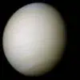](f/aob/venus/venus_real_color-1974.webp)|[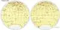](f/aob/venus/venus_map1.webp)|[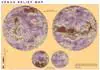](f/aob/venus/venus_map2.webp)|[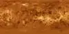](f/aob/venus/venus_map3.webp)|

And a bit of animation.

|*The topographic  Globe of Venus*|*The Radar  Globe of Venus*|*Orbit*|
|:-|:-|:-|
|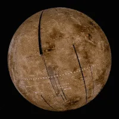|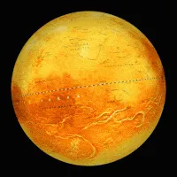|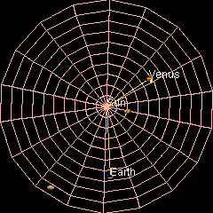|

 

## Description & Characteristics
|*Characteristic*|*[Value](si.md)*|
|:-|:-|
|Breaking to the orbit|no more than 10 ‑ 15 min|
|Distance from Earth|38 000 000 ‑ 261 000 000 ㎞|
|Flight from Earth|109 ‑ 144 days w/ [LPS](ps.md) (3.5 ‑ 6.1 months)|
|Signal from Earth|126 ‑ 870 s (2.1 ‑ 14.5 min)|
|Velocity from Earth|3.5 ‑ 5 ㎞/s|
|**【Orbits】**|• • •|
|[Apocentre](apopericentre.md) (Aphelion);  [Pericentre](apopericentre.md) (Perihelion)|108 942 109 ㎞ (0.72823128 au);  107 476 259 ㎞ (0.71843270 [au](si.md))|
|[Argument of periapsis](keplerian.md) (ω)|54.85229°|
|Day/year|58.5 / … Earth’s|
|[Eccentricity](keplerian.md) (e)|0.0068|
|[Hill sphere](hill_sphere.md)|1 000 000 ㎞|
|[Inclination](keplerian.md) (Ⅰ)|3.86° (to Sun’s equator); 3.39458° (to ecliptic); 2.5° (invar. plane)|
|[Longit. of  asc.node](keplerian.md) (Ω)|76.67069°|
|Orbital velocity (Ⅴ)|35.02 ㎞/s|
|Satellite of|[Sun](sun.md)|
|Satellites|none|
|[Semimajor axis](keplerian.md) (a)|108 208 930 ㎞ (0.723332 au)|
|[Sider. rotat.period](astroperiod.md) (T, day)|243.0187 days (retrograde, synced w/ Earth)|
|[Sidereal period](astroperiod.md) (year)|224.698 days (224 d 16 h 45 m 7 s)|
|[Synodic period](astroperiod.md)|583.92 days (583 d 2 h 12 m 29 s)|
|**【Physics】**|• • •|
|[Albedo](albedo.md)|0.689 (geometric); 0.76 (Bond)|
|[Apparent magnitude](app_mag.md) (m)|−4.6|
|Axial tilt|177.36°|
|Density (ρ)|5.24 g/㎝³ (mean, 0.951 Earth’s)|
|Equatorial rotation velocity|6.52 ㎞/h (0.0039 Earth’s)|
|[Escape velocity](esc_vel.md)|7.328 ㎞/s (v₁, 0.926 Earth’s);  10.363 ㎞/s (v₂, 0.926 Earth’s)|
|Flattening|0|
|[Magnetic field](mag_field.md)|0.0000025 ‑ 0.000005 T (0.05 ‑ 0.1 Earth’s)|
|Mass (m)|4.8675·10²⁴ ㎏ (0.815 Earth’s)|
|Radius|6 051 ㎞ (mean, 0.953 Earth’s, lesser on 320 ㎞)|
|Solar constant|2 600 W/m², 2 525 ‑ 2 700 W/m² (1.9117 Earth’s)|
|Surface area (S)|4.60·10⁸ ㎞² (0.902 Earth’s)|
|[Surface gravity](g.md)|8.87 ㎧² (0.904 Earth’s)|
|Volume (Ⅴ)|9.38·10¹¹ ㎞² (0.857 Earth’s)|
|**【Temperature & atmo.】**|• • •|
|[Atmosphere](atmosphere.md)|**Composition:**  ~96.5 % carbon dioxide (CO₂)  ~3.5 % nitrogen (N₂)  0.018 % sulfur dioxide (SO₂)  0.007 % argon (Ar)  0.003 % water vapour (H₂O)  0.001 7 % carbon monoxide (CO)  0.001 2 % helium (He)  0.000 7 % neon (Ne)  Trace hydrogen chloride (HCl),  Trace hydrogen fluoride (HF), etc.  **Density:** 67 ㎏/m³ (55.83 Earth’s).  **Pressure:** 9.3 ㎫ (93 ㍴), surface.  **Winds:** 0.3 ‑ 1 ㎧ (surface); up to 100 ㎧ (65 ㎞).|
|[Illumination](illum.md)|200 (5.5°) ‑ 3 000 (90°) ㏓ (surface, 0.2 Earth’s)|
|[Radiation](ion_rad.md)|<mark>TBD</mark>|
|Temperature|737 К (464 ℃) near surface|

### Atmosphere & climate
|*Dependence temperature(pressure)/height;*  [Atmospheric model VIRA-30 ❐](f/aob/venus/atmo_model_vira_30.ods) made by Vega-1,2.|
|:-|
|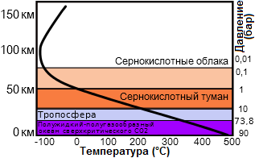|

The CO₂‑rich atmosphere generates the strongest greenhouse effect in the Solar System, creating the surface temperature of ~ 735 K (462 ℃, 864 ℉), higher than that used for sterilization, hotter than [Mercury’s](mercury.md) (min surface temperature of 53 K, −220 ℃, −364 ℉, & maximum — 700 K, 427 ℃, 801 ℉), even though Venus is nearly twice Mercury’s distance from the Sun & thus receives ~ 25 % of Mercury’s solar irradiance. The highest Venus point, Maxwell Montes, is the coolest point with a temperature of ~ 655 K (380 ℃; 715 ℉) & pressure of ~ 4.5 ㎫ (45 ㍴).

Thermal inertia & the heat transfer by the lower atmosphere winds mean that the surface temperature doesn’t vary significantly between the planet’s two hemispheres, those facing & not facing the Sun, despite Venus’ extremely slow rotation. Surface winds are slow (a few km/h), but because of the atmosphere high density at the surface they exert much force against obstructions, & transport dust & small stones across the surface. This alone would make it difficult for a human to walk through, even without the heat & pressure. The high altitude winds become faster over time.

Above the dense CO₂ layer there are thick clouds consisting mainly of H₂SO₄ formed by a chemical reaction of SO₂ & H₂O. Clouds at different levels have different compositions & particle size; they reflect & scatter ~ 90 % of the sunlight that falls on them back into space, & prevent surface visual observation. The permanent cloud cover means that although Venus is closer to the Sun than Earth, it receives less sunlight on the ground. Strong 300 ㎞/h (185 mph) winds at the cloud tops go around Venus about every 4 ‑ 5 Earth days (**atmosphere superrotation**); the winds’re ≥ 60 times faster than its rotation, whereas Earth’s fastest winds’re only 10 ‑ 20 % of the rotation speed.

The atmosphere is divided into 4 layers that never get mixed. <mark>TBD</mark>

### Magnetic field & core
Venus has no self magnetic field. The current one is induced by the ionosphere & solar wind interactions, rather than by a dynamo as in the Earth’s core; this tiny induced magnetosphere provides negligible protection to the atmosphere against the cosmic radiation.

One possibility is Venus has no solid core, or its core isn’t cooling, so that the entire core liquid part is approximately the same temperature. Another possibility is that its core has already completely solidified. The core state is highly dependent on the sulfur concentration, which is currently unknown.

The Venus weak magnetosphere means that the solar wind is interacting directly with its outer atmosphere. Here, H & O ions are being created by the dissociation of neutral molecules from UV‑radiation. The solar wind then supplies energy that gives some of these ions velocity to escape the gravity; this results in a steady loss of low‑mass H, He, O ions, whereas higher‑mass molecules, such as CO₂, are more likely to retain. This process probably led to the loss of most of the water during the 1st billion years after it formed increasing the ratio of higher‑mass deuterium to lower‑mass H in the atmosphere 100 times compared to the rest of the Solar system.

### Surface, Maps, & Tessera
   1. <http://justclickit.ru/karti/venera.html>
   1. <https://en.wikipedia.org/wiki/Terraforming_of_Venus>
   1. <https://planetarynames.wr.usgs.gov/Page/VENUS/target>
   1. <https://en.wikipedia.org/wiki/Tessera_(Venus)>
   1. <https://en.wikipedia.org/wiki/List_of_geological_features_on_Venus>
   1. <https://en.wikipedia.org/wiki/Mapping_of_Venus>
   1. <https://www.lpi.usra.edu/resources/venus_maps/> — Venus maps
   1. <https://www.lpi.usra.edu/resources/venus_maps/>

Common areas & possible landing sites.

|*Stratigraphic Unit*|・|*Area,  M km²*|*Area,  %*|*Unsafe*|*Moder.  safe*|*Safe*|
|:-|:-|:-|:-|:-|:-|:-|
|**Tectonic**|—|**92.82**|**20**|—|—|—|
|・Densely lineated plains|pdl|・7.72|・1.69|unsafe| | |
|・Groove belt|gb|・39.51|・8.66|unsafe| | |
|・Ridged plains|pr,rp|・10.20|・2.24| |mod.safe| |
|・Tessera|t|・35.38|・7.75|unsafe| | |
|**Volcanic**|—|**279.95**|**61.35**|—|—|—|
|・Regional planes, lower|rp1|・150.68|・33.02| | |safe|
|・Regional planes, upper|rp2|・44.79|・9.81| |mod.safe| |
|・Shield plains|psh|・84.48|・18.51| |mod.safe| |
|**Volcano‑tectonic**|—|**78.94**|**17.30**|—|—|—|
|・Lobate plains|pl|・40.32|・8.84|unsafe| | |
|・Rift zones|rz|・24.08|・5.28|unsafe| | |
|・Shield clusters|sc|・3.56|・0.78|?|?|?|
|・Smooth plains|ps,sp|・10.98|・2.41|?|?|?|
|・・Smooth plains, impact|spi|・・?|・・1| | |safe|
|・・Smooth plains, volcanic|spv|・・?|・・1| | |safe|

**Tessera**

|<small>Image of “Ovda Regio”, generated by [Magellan](magellan.md) ([JPL PIA00311 ⎆](https://www.jpl.nasa.gov/spaceimages/details.php?id=PIA00311)). You can see differences between the plains & mountains “Ovda Regio”, the western part of the huge equatorical mountains “Aphrodite Terra”.</small>|
|:-|
|[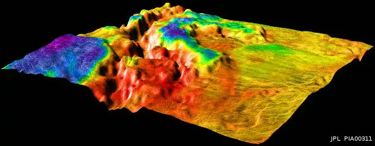](f/aob/venus/venus_map_tesserae2.webp)|
|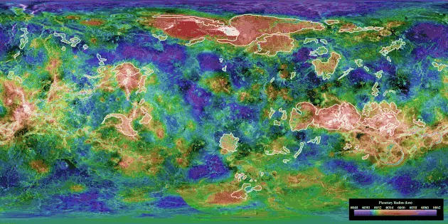|

**Tessera** are regions of heavily deformed Venus terrain, characterized by ≥ 2 intersecting tectonic elements, high topography, & subsequent high radar backscatter. Tessera often represents the oldest material at any given location & is among the most tectonically deformed terrains. Diverse types of tessera terrain exist. It’s not currently clear if this is due to a variety in the interactions of the mantle with regional crustal or lithospheric stresses, or if these diverse terrains represent different locations in the timeline of crustal plateau formation & fall. Multiple tessera formation models exist & further extensive surface studies are necessary to fully understand this complex terrain.

Tessera represents an ancient time of globally thin Venus lithosphere. Tessera doesn’t participate in global resurfacing events. It was thought that the Tessera might form a global “onion skin” of sorts, & extended beneath Venus regional plains. However, the currently accepted models support regional formation. Multiple models have been put forward to explain the tessera formation. Models of formation by mantle downwelling & pulsating continents are the most currently accepted models. A model of formation due to a lava pond via bolide impact was put forth, although it hasn’t currently gained many acceptions due to skepticism of the bolide impact ability to generate sufficient melt. A model of formation due to mantle plumes (upwelling) was persistent for many years, however, it has since been abandoned due to its contradictory prediction of sequences of extension versus the observed cross‑cutting relationships.

[Pioneer Venus 1](pioneer_venus_1.md) detected regions of anomalous radar properties & high backscatter. Using [SAR](cam.md) imaging the [Venera 15,16](venera_15_16.md) orbiters revealed these regions to be chaotically tiled terrain, which Soviet scientists named “parquet” (tiled floors) later known as “Tessera”. The most recent data concerning tessera comes from the [Magellan](magellan.md), in which the majority of the surface was mapped in high‑res (~ 100 m/px). Future Venus missions would allow further tessera understanding.

Tessera covers ~ 7.3 % (33 200 000 ㎞²) of the surface, & occurs mostly within a few extensive provinces. They are heavily concentrated at 0 ‑ 150 °E. These longitudes represent a large area between a crustal extension center in the Aphrodite Terra & a crustal convergence center in Ishtar Terra. Tessera is exposed almost entirely within the crustal plateaus; their inliers, regions of tessera not found within the current crustal plateaus are thought to represent regions of collapsed crustal plateaus. Large tessera regions are labeled based on their latitude: in the equatorial & southern latitudes — Regio, in the northern latitudes — Tessera. Some well‑explored regions include Aphrodite Terra, Alpha Regio, Beta Regio, Fortuna Tessera, Ovda Regio. A comprehensive list of Regions & Tessera can be found at <https://en.wikipedia.org/wiki/List_of_geological_features_on_Venus>.

Individual tessera patterns record the variations in interactions of the mantle with local regional stresses. This variation manifests itself in a wide array of diverse terrain types. Multiple types of sampled Tessera are below, however, they aren’t meant as a classification scheme, & instead emphasize the variety of terrain types.

   - **Fold Terrain** — linear fabrics composed of long ridges & valleys (≥ 100 ㎞ long), that are cross‑cut by minor extensional fractures that run perpendicular to the fold axes of the ridges. This is likely formed due to unidirectional contraction.
   - **Lava Flow Terrain** — resemblance to Pahoehoe flows on Earth with long curving ridges. It’s thought that this terrain may be formed due to displacement & deformation due to the movement of the material beneath these crustal pieces.
   - **Ribbon Terrain** — ribbons & folds that are typically orthogonal to one another. Ribbons are long & narrow extensional troughs that are separated by narrow ridges. Can be found both in large crustal plateaus & within tessera inliers.
   - **S‑C Terrain** — a geometric similarity to S‑C tectonic fabrics on Earth. Consists of 2 main structures: synchronous folds, & small (5 ‑ 20 ㎞ long) graben that cross‑cut the folds perpendicularly. S‑C terrain indicates a simple deformation history in which deformation due to widespread motion on Venus is widely distributed. This terrain also indicates that the strike‑slip movement on Venus' surface is possible.
   - **Basin & Dome Terrain**, or Honeycomb — curved ridges & troughs formes a pattern analogs to an egg carton. They represent multiple deformation phases. Basin & dome terrain is typically found within the center of crustal plateaus.
   - **Star Terrain** — composed of multiple graben & fractures that trend in many directions, but radiate in a star‑like pattern. This pattern is thought to be due to doming underneath previously deformed & fractured areas, in which the local uplift causes the radiating pattern.

 

## Developing features
**Literature:**

   1. Венера — неукротимая планета (2018, Москва) — short story of the Venus explorations; starting point.

**Orbiter:**

   1. Heat reflecting issues on the Venus orbit H ≤ 700 ㎞.
   1. Commonly SC for Venus & [Mars](mars.md) can be almost the same.

**Lander:**

   1. As a [power supply](sps.md) can be used only [wind turbine](wt.md) & [electric battery](eb.md).

**Earth:**

   1. Launch window opens ~ every 19 months (1 y 7 m).
   1. **Testing equipment:**
      - Hi‑pressure vessels:
         - [AVEC](avec.md) (V = 0.000 7 m³, [JHU APL](contact/jhuapl.md)),
         - [GEER](geer.md) (V = 0.811 m³ & 0.004 m³, [GRC](contact/grc.md)).

**Table.** [Dependency between the complexity, price & science impact ❐](f/aob/venus/cps_dependency.odt).

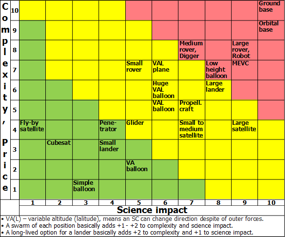

 

## Venus exploration

### What for?
Currently, the key to understanding the processes on Venus is the solution of three main tasks: atmospheric formation, evolution, & climate history; the evolution of the surface & interior; interior-surface-atmosphere interaction.

   1. Atmospheric formation, evolution, & climate history tasks:
      - Atmospheric formation & evolution (How did the atmosphere of Venus form & evolve?);
      - Energy balance, super-rotation & greenhouse (What is the nature of the radiative & dynamical energy balance on Venus? Specifically, what processes control the atmospheric super-rotation & the atmospheric greenhouse?);
      - Cloud & haze chemistry & dynamics (What are the morphology, chemical makeup & variability of the Venus clouds, what are their roles in the atmospheric dynamical & radiative energy balance, & what is their impact on the Venus climate? Does the habitable zone in the clouds harbor life?).
   1. Evolution of the surface & interior tasks:
      - Heat release & resurfacing (How is Venus releasing its heat now & how is this related to resurfacing & outgassing? Has the style of tectonism or resurfacing varied with time? Specifically, did Venus ever experience a transition in tectonic style from mobile lid tectonics to stagnant lid tectonics?);
      - Internal differentiation (How did Venus differentiate & evolve? Is the crust nearly all basalt, or are there significant volumes of more differentiated (silica-rich) crust?).
   1. Interior-surface-atmosphere interaction tasks:
      - Finding information about liquid water (Did Venus ever have surface or interior liquid water, & what role has the greenhouse effect had on climate through Venus’ history?)
      - Interior-surface-atmosphere interaction (How have the interior, surface, & atmosphere interacted as a coupled climate system over time?)

The answers are central to understanding Venus in the context of terrestrial planets & their evolutionary processes. More importantly, Venus can provide important clues to understanding our own planet - how it has maintained a habitable environment for so long & how long it can continue to do so. Precisely because it began so like Earth, yet evolved to be so different, Venus is the planet most likely to cast new light on the conditions that determine whether or not a planet evolves habitable environments. Current & future efforts to identify planetary systems beyond our Solar System.

**And a bit of documents & links:**

   1. [Future of Venus research & exploration ❐](f/project/2017_future_of_venus_research_and_exploration.pdf) (NASA, 2017)

### Timeline
<https://nssdc.gsfc.nasa.gov/planetary/chronology.html>

[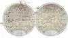](f/aob/venus/venus_map_fly.webp)  
*Timeline*

<mark>TBD</mark> Most important dates.

 

### Communities & persons
**Activities:**

   - **Communities:**
      1. **KISS** — non‑active community/conference currently a part of VEXAG. <https://www.kiss.caltech.edu/workshops/venus/venus.html>
      1. **[VEXAG](vexag.md)** — Venus exploration community, founded in 2005 in USA: organizing the annual conferences, & a bunch of (demi)episodic meetings with the similar topics, watching the word‑wide Venus explorations state, creating some recommendations for NASA.
      1. **Venera-D Workshop** — a joint RU‑US group acting since 2017.
   - **Conferences:** (major ones)
      1. **[AGU](agu.md)** — American Geophysical Union, US. Have a Venus section.
      1. **[COSPAR](contact/cospar.md)** — Committee on Space Research Assembly, EU. Have a Venus section.
      1. **[DPS](dps.md)** — Division for Planetary Sciences, US. Have a Venus section.
      1. **[EGU](egu.md)** — European Geosciences Union, EU. Have a Venus section.
      1. **[EPSC](epsc.md)** — European Planetary Science Congress, EU. Have a Venus section.
      1. **[GLEX](glex.md)** — Global Space Exploration Conference, EU. Have a Venus section.
      1. **[IAC](iac.md)** — International Astronautical Congress, EU. Have a Venus section.
      1. **[JpGU](jpgu.md)** — Japan Geoscience Union, JP. Have a Venus section.
      1. **[LPSC](lpsc.md)** — Lunar & Planetary Science Conference, US. Have a Venus section.
      1. **[MSSS](msss.md)** — Moscow Solar System Symposium, RU. Have a Venus section.
      1. **[NIAC](niac_program.md)** — NIAC Symposium, US. Have a Venus section.
      1. **[VEXAG](vexag.md)** — the only periodical personal Venusian conference, US.
   - **Mailing lists:**
      1. Planetary Exploration Newsletter, PEN <http://planetarynews.org/>
      1. Venus Listserve news <https://lists.psi.edu/mailman/listinfo/venus>
   - **Articles & whitepapers accumulators:**
      1. <https://www.academia.edu/>
      1. <https://www.researchgate.net/>

**Persons:**

   - **Current:** [Tibor Balint](person.md)・ [Mark Bullock](person.md)・ [Paul Byrne](person.md)・ [James A. Cutts](person.md)・ [Thanasis Economou](person.md)・ [David Grinspoon](person.md)・ [Jeffery L. Hall](person.md)・ [Noam Izenberg](person.md)・ [Tibor Kremic](person.md)・ [Sanjay Limaye](person.md)
   - **In the past:** None.

 

### Projects
See also section “[Projects](project.md)”.

**Table.** Missions/spacecraft of past & future. (**Ⓛ** — LAV)  (**C** — contact rsrch; **D** — distant rsrch; **F** — fly‑by; **H** — manned; **S** — soil sampe return; **X** — technology demonstr.)

| |*Mission/SC (index)*|*Date (UTC)*|*C*|*D*|*F*|*H*|*S*|*X*|*Notes*|
|:-|:-|:-|:-|:-|:-|:-|:-|:-|:-|
|—|**【Proposed】**|—|•|•|•|•|•|•|—|
|US|[DAVINCI / DAVINCI+](davinci.md)|…| |D| | | | |<mark>TBD</mark> concept of 2015|
|US|[Cubesat UV Experiment](cubesat_uv_experiment.md) (CUVE)|…| |D| | | | |concept of 2017|
|US|[Venus Flagship Mission](venus_flagship_mission.md) (VFM)|…|C|D| | | |X|concept of 2007|
|US|[Venus Mobile Explorer](venus_mobile_explorer.md) (VME)|…|C| | | | |X|<mark>TBD</mark> concept of 2009|
|US|[Venus Observing System](venus_observing_system.md) (VOS)|…|C|D| | | |X|concept of 2019|
|US|[Venus Origins Explorer](venus_origins_explorer.md) (VOX)|…| |D| | | | |<mark>TBD</mark> concept of 2017|
|EU·US|[Venus Sample Return Mission](venus_sample_return_mission.md) (VSRM)|…|C| | | |S|X|<mark>TBD</mark> concept of 1986|
|US|[VERITAS](veritas.md)|…| |D| | | | |<mark>TBD</mark> concept of 2015|
|EU|[EnVision](envision.md)|2032| |D| | | | | |
|RU|[Venera‑D](venera_d.md) (ВД) Ⓛ|2029|C|D| | | | |<mark>TBD</mark>|
|—|**【Developing】**|—|•|•|•|•|•|•|—|
|IN|[Shukrayaan‑1](shukrayaan_1.md)|2024| |D| | | | |<mark>TBD</mark>|
|US|[Xcraft](xcraft.md)|2022| | | | | |X|<mark>TBD</mark>|
|—|**【Active】**|—|•|•|•|•|•|•|—|
|EU·JP|[BepiColombo](bepicolombo.md)|2018.10.20| |D|F| | | |<mark>TBD</mark>|
|US|[Parker Solar Probe](parker_solar_probe.md)|2018.08.12| |D|F| | | |<mark>TBD</mark>|
|JP|[Akatsuki](akatsuki.md)|2010.05.21| |D| | | | | |
|—|**【Past】**|—|•|•|•|•|•|•|—|
|EU|[Venus Express](venus_express.md) (VEX)|2005.11.09| |D| | | | |<mark>TBD</mark>|
|US|[Messenger](messenger.md)|2004.08.03| |D|F| | |X|<mark>TBD</mark>|
|US|[Cassini Huygens](cassini_huygens.md)|1997.10.15| |D|F| | |X|<mark>TBD</mark>|
|US|[Galileo](galileo.md)|1989.10.18| |D|F| | |X|<mark>TBD</mark>|
|US|[Magellan](magellan.md)|1989.05.04| |D|F| | | |±<mark>TBD</mark>|
|SU|[VeGa‑2](vega_1_2.md) (5ВК) Ⓛ|1984.12.21|C|D| | | | |±<mark>TBD</mark>|
|SU|[VeGa‑1](vega_1_2.md) (5ВК) Ⓛ|1984.12.15|C|D| | | | |±<mark>TBD</mark>|
|SU|[Venera‑16](venera_15_16.md) (4В2) Ⓛ|1983.06.07| |D| | | | |±<mark>TBD</mark> maps N.pole|
|SU|[Venera‑15](venera_15_16.md) (4В2) Ⓛ|1983.06.02| |D| | | | |±<mark>TBD</mark> maps N.pole|
|US|~~[Venus Orbiting Imaging Radar](venus_orbiting_imaging_radar.md) (VOIR)~~|1983.05| |D| | | |X|±<mark>TBD</mark> hi‑res images|
|SU|[Venera‑14](venera_13_14.md) (4В1М) Ⓛ|1981.11.04|C| | | | | |±<mark>TBD</mark> color surface imgs|
|SU|[Venera‑13](venera_13_14.md) (4В1М) Ⓛ|1981.10.30|C| | | | | |±<mark>TBD</mark> color surface imgs|
|SU|[Venera‑12](venera_11_12.md) (4В1) Ⓛ|1978.09.14|C|D| | | | |±<mark>TBD</mark>|
|SU|[Venera‑11](venera_11_12.md) (4В1) Ⓛ|1978.09.09|C|D| | | | |±<mark>TBD</mark>|
|US|[Pioneer‑Venus‑2](pioneer_venus_2.md)|1978.08.08| |D| | | | |±<mark>TBD</mark> surface map|
|US|[Pioneer‑Venus‑1](pioneer_venus_1.md)|1978.05.20| |D| | | | |±<mark>TBD</mark> surface map|
|SU|[Venera‑10](venera_9_10.md) (4В1) Ⓛ|1975.06.14|C|D| | | | |±<mark>TBD</mark> 1st surface img|
|SU|[Venera‑9](venera_9_10.md) (4В1) Ⓛ|1975.06.08|C|D| | | | |±<mark>TBD</mark> 1st Vsat, surface img|
|US|[Mariner‑10](mariner_10.md)|1973.11.04| |D|F| | | |±<mark>TBD</mark>|
|SU|[Venera‑8](venera_8.md) (В‑72) Ⓛ|1972.03.27|C| | | | | |±<mark>TBD</mark> 1st relief imgs|
|SU|[Venera‑7](venera_7.md) (В‑70) Ⓛ|1970.08.17|C| | | | | |±<mark>TBD</mark> 1st soft landing|
|SU|[Venera‑6](venera_5_6.md) (2В, В‑69) Ⓛ|1969.01.10| |D| | | | |±<mark>TBD</mark>|
|SU|[Venera‑5](venera_5_6.md) (2В, В‑69) Ⓛ|1969.01.05| |D| | | | |±<mark>TBD</mark>|
|US|[Mariner‑5](mariner_5.md)|1967.06.14| |D| | | | |±<mark>TBD</mark>|
|SU|[Venera‑4](venera_4.md) (1В, В‑67) Ⓛ|1967.06.12| |D| | | | |±<mark>TBD</mark>|
|SU|[Venera‑3](venera_2_3.md) (3МВ‑3)|1965.11.16|C|D| | | | |±<mark>TBD</mark> 1st fly/land Venus SC|
|SU|[Venera‑2](venera_2_3.md) (3МВ‑4)|1965.11.12| |D| | | | |±<mark>TBD</mark>|
|SU|[Zond‑1](zond_1.md)|1964.04.02| |D|F| | | |±<mark>TBD</mark>|
|US|[Mariner‑2](mariner_2.md)|1962.08.27| |D| | | | |±<mark>TBD</mark>|
|SU|[Venera‑1](venera_1.md) (1ВА)|1961.02.12| |D|F| | | |±<mark>TBD</mark>|

**Hypothetical & historical:**

   - In the section [Research](project.md):
      - (1) Wireless electricity transmission for a Venusian SC
      - (4) Materials for Venus
      - (12) Human on Venus
   - Despace hypothetical:
      - [VGV](hptc_vgv.md) — Venus soil sample return using current technologies.
      - [DSVSD](hptc_dsvsd.md) — a bunch of technologies needed for a long‑lasting Venus surface presence.

|*Type*|*Unit*|
|:-|:-|
|**Fly‑bys**|[Europa Clipper](europa_clipper.md)・ Mercury-P・ Laplace-P・ NASA Uranus orbiter & probe|
|**Missions**|[HAVOC](havoc.md)・ [HOVER](hover.md)・ [VICI](vici.md)・ [VISAGE](visage.md)・ [VISE](vise.md)|
|**Rovers**|[AREE](aree.md) (concept of 2016)・ [Zephyr](zephyr.md) (concept of 2012)|
|**Standalone**|[LLISSE](llisse.md)・ [MEVC](mevc.md)・ [SAEVe](saeve.md)・ [Solar Aircraft](solar_aircraft.md) by GRC・ [VAMP](vamp.md)|

Other innovative concepts such was low mass distributed sensor platforms have also been investigated but not yet developed (Balcerski et al. 2018) & dynamic soaring (Elston et et al., 2020).

 

## Science & tech targets
> There is an [archived version of this section](faq_venus_20200618.md): far more complex.

Just a preliminary list of the Venus targets/explorations. Based on [VEXAG ⎆](https://www.lpi.usra.edu/vexag/), Venus missions/units proposals, & anyone who can. The idea is to prepare a brief systematized list of the Venus targets & explorations of the retired, active, proposed SC suitable for scientists, & engineers, & managers, & passers‑by. The one which is able at the same time to tell about what was done & in what volume, what is processing now & why it’s so cool, what is proposed & why it’s so important. Something like a bridge between scientists & other humanity just to show that all of these complex scientific terms can be described with some statistical terms without a need to read a lot of literature or trust their words. Soon there will be something new, for example, links between targets/explorations, SC, & a couple of brief descriptions of each one current state.

Targets & explorations for Venus, including [VEXAG](vexag.md) activity. In brief — 97 targets in total (34 tech., 63 scientific) consisting of 33 never occurred (19 tech., 14 scientific), 57 was tried (11 tech., 46 scientific), 7 mostly done (4 tech., 3 scientific). Comments:

   - **T** — technical; **C** — contact research; **D** — distant research; **F** — fly‑by; **H** — manned; **S** — soil sample return; **X** — technology demonstration
   - **Sections of measurement & observation:**
      - Atmospheric/climate — **Ac** composition, **Ai** imaging, **Am** mapping, **Ap** pressure, **As** samples, **At** temperature, **Aw** wind speed/direction.
      - General — **Gi** planet’s interactions with outer space.
      - Soil/surface — **Sc** composition, **Si** imaging, **Sm** mapping, **Ss** samples.

<small>

|*Number*|*T*|*EN*|*Section of m&o*|*C*|*D*|*F*|*H*|*S*|
|:-|:-|:-|:-|:-|:-|:-|:-|:-|
|•|•|**【Never occurred】**|•|•|•|•|•|•|
|EVN‑036| |Atmosphere: cause & influence of geological & chemical activity on the climate & clouds| | |D| | | |
|EVN‑037| |Atmosphere: cause of the retrograde moving| | |D| | | |
|EVN‑032| |Atmosphere: characteristics of the CO₂ & N₂ in state of the lower layers supercritical fluid|Ac, Ai, Am, At| |D| | | |
|EVN‑038| |Atmosphere: processes of the atmospheric parts dissipation| | |D| | | |
|EVN‑082|T|Atmosphere: prolonged investigations on the H = 0 ‑ 10 ㎞|All A| | | | | |
|EVN‑083|T|Atmosphere: prolonged investigations on the H = 10 ‑ 30 ㎞|All A| | | | | |
|EVN‑054|T|Atmosphere: sample return|As|C| | | | |
|EVN‑015| |Atmosphere: structure of the mesosphere|All A| |D| | | |
|EVN‑030| |Atmosphere: was it lost during some cataclysm or event| | |D| | | |
|EVN‑095| |Climate: history & causes of changes| | |D| | | |
|EVN‑087| |Crustal support mechanisms| | |D| | | |
|EVN‑051| |Dimensions & characteristics of the mantle & the core| | |D| | | |
|EVN‑057|T|Exploration with [satellites](sc.md): microsatellites| | |D|F| | |
|EVN‑071|T|Exploration with [satellites](sc.md): nanosatellites| | |D|F| | |
|EVN‑058|T|Exploration: directed seismoexperiment| | |D|F| | |
|EVN‑056|T|Exploration: from L1/L2|Ai, Am, At, Gi| |D| | | |
|EVN‑059|T|Exploration: with [rover](robot.md)|All A/S|C| | | | |
|EVN‑081|T|Extreme environment electronics| |C|D|F| | |
|EVN‑094|T|High temperature electronics| |C|D|F| | |
|EVN‑060|T|Human: manned fly‑by| | |D|F|H| |
|EVN‑065|T|Human: on the orbit| | |D| |H| |
|EVN‑066|T|Human: on the surface| |C| | |H| |
|EVN‑043| |Mechanisms of the mantle’s convection| | |D|F| | |
|EVN‑048| |Nature & sources of the greenhouse effect| | |D|F| | |
|EVN‑068|T|Precise landing| |C| | | | |
|EVN‑069|T|Prolonged surface‑spacecraft functioning| |C| | | | |
|EVN‑064|T|Planetary terraforming| |C| | |H| |
|EVN‑061|T|Surface: sample return| |C| | | |S|
|EVN‑047| |Surface: structure‑composition connection of different regions & planet’s evolution| |C| | | | |
|EVN‑088|T|Surface: subsurface investigations| |C| | | | |
|EVN‑086|T|Surface: tessera investigations, in‑situ| |C| | | | |
|EVN‑039| |Was the planet inhabited & for how long| |C|D| | | |
|EVN‑040| |Were there oceans & why have they gone| |C|D|F| | |
|•|•|**【Was tried】**|•|•|•|•|•|•|
|EVN‑080| |Albedo: changes in time|Gi| |D|F| | |
|EVN‑093|T|Atmosphere/surface imaging| | |D|F| | |
|EVN‑077| |Atmosphere: chemical elements distribution| | |D|F| | |
|EVN‑018| |Atmosphere: clouds, their chemistry| | |D|F| | |
|EVN‑075| |Atmosphere: clouds, their nature| | |D|F| | |
|EVN‑016| |Atmosphere: clouds, their structure| | |D|F| | |
|EVN‑011| |Atmosphere: common circulation model| | |D| | | |
|EVN‑014| |Atmosphere: composition| | |D| |F| |
|EVN‑007| |Atmosphere: connection between the topography & the atmo circulation| | |D| | | |
|EVN‑019| |Atmosphere: energetic balance| | |D| | | |
|EVN‑008| |Atmosphere: flashing on the night side| | |D| | | |
|EVN‑013| |Atmosphere: illumination of the surface & the atmo layers| | |D| | | |
|EVN‑096| |Atmosphere: ionosphere| | |D|F| | |
|EVN‑012| |Atmosphere: lightnings| | |D| | | |
|EVN‑031| |Atmosphere: long‑term variations of the surface meteo characteristics| | |D| | | |
|EVN‑033| |Atmosphere: nature/rate of its escape| | |D| | | |
|EVN‑067| |Atmosphere: nature of the polar dipole & turbulence| | |D| | | |
|EVN‑034| |Atmosphere: nature of the superrotation| | |D| | | |
|EVN‑035| |Atmosphere: nature of the UV‑absorber| | |D| | | |
|EVN‑084|T|Atmosphere: prolonged investigations on the H = 30 ‑ 60 ㎞| | |D| | | |
|EVN‑078|T|Atmosphere: radiography| | |D| | | |
|EVN‑055|T|Atmosphere: sample obtaining & analysis| |C| | | | |
|EVN‑009| |Atmosphere: SO₂ concentration & nature of its variations| | |D| | | |
|EVN‑017| |Atmosphere: common structure| | |D| | | |
|EVN‑097| |Atmosphere: effect of solar Rad & interplanetary space on the atmo| | |D|F| | |
|EVN‑010| |Atmosphere: vertical model| | |D| | | |
|EVN‑050| |Causes of the water loss| | |D| | | |
|EVN‑041| |Common connection between the atmosphere & the surface| | |D| | | |
|EVN‑073|T|Exploration with [satellites](sc.md): large satellites| | |D|F| | |
|EVN‑072|T|Exploration with [satellites](sc.md): medium satellites| | |D|F| | |
|EVN‑070|T|Exploration with [satellites](sc.md): minisatellites| | |D|F| | |
|EVN‑042| |History & causes of the planet’s volcanic & tectonic evolution| | |D| | | |
|EVN‑020| |Inner structure of the planet| | |D| | | |
|EVN‑029| |Is Venus geologically active?| |C|D|F| | |
|EVN‑028| |Magnetosphere structure| | |D|F| | |
|EVN‑089| |Measuring the planetary gravitational field| | |D|F| | |
|EVN‑074| |Meteorological model| | |D|F| | |
|EVN‑049| |Nature & characteristics of the thermal tides| | |D| | | |
|EVN‑079| |Precise duration of the Venusian day| | |D| | | |
|EVN‑052| |Role of water (fluids) in planetary geology| |C|D|F| | |
|EVN‑092|T|Serve as a relay to Earth for stand‑alone SC/instruments| | |D| | | |
|EVN‑046| |Surface: causes of the changes during the last billion years| |C|D|F| | |
|EVN‑024| |Surface: common composition| |C| | | | |
|EVN‑026| |Surface: elemental composition| |C| | | | |
|EVN‑021| |Surface: map, 3D| |C|D| | | |
|EVN‑022| |Surface: map, precise| | |D| | | |
|EVN‑023| |Surface: mineralogical composition| |C| | | | |
|EVN‑025| |Surface: morphology| |C| | | | |
|EVN‑044| |Surface: nature & causes of forming of the current rocks & soils| |C| | | | |
|EVN‑045| |Surface: nature of the tessera| | |D| | | |
|EVN‑062|T|Surface: samples obtaining & analysis, incl. in different places| |C| | | |S|
|EVN‑063|T|Surface: panoramic imaging| |C| | | | |
|EVN‑085|T|Surface: tessera investigations, remote| | |D|F| | |
|EVN‑076| |Surface: volcanoes, their presence| | |D|F| | |
|EVN‑027| |The causes why Venus evolved in a planet so different from Earth| |C|D|F| | |
|EVN‑091| |The loss rate of water from Venus| | |D|F| | |
|EVN‑053| |Traces of life in the atmosphere & on the surface| |C| | | | |
|•|•|**【Mostly done】**|•|•|•|•|•|•|
|EVN‑001| |Atmosphere: preliminary model| |C|D|F| | |
|EVN‑004|T|Exploration: from Earth| | |D| | | |
|EVN‑003|T|Exploration: from inside of atmosphere| |C|D| | | |
|EVN‑006|T|Exploration: from surface| |C| | | | |
|EVN‑005|T|Exploration: from Venusian orbit| | |D|F| | |
|EVN‑090| |Spin axis| | |D| | | |
|EVN‑002| |Surface: preliminary map| |C|D| | | |

</small>

 

**VEXAG Goals, Objectives & Investigations (2019).**

>Notes to the list below: **I.** − **Ⅲ** are **Goals**; **A.** − **B.** are **Objectives** **⑴** − **⑶** are **Investigations**

   - **Ⅰ** Understand Venus’ early evolution & potential habitability to constrain the evolution of Venus‑size (exo)planets.
      - **A.** Did Venus have temperate surface conditions & liquid water at early times?
         - **HO. Hydrous Origins ⑴**. Determine whether Venus shows evidence for abundant silicic igneous rocks and/or ancient sedimentary rocks.
         - **RE. Recycling ⑴**. Search for structural, geomorphic, & chemical evidence of crustal recycling on Venus.
         - **AL. Atmospheric Losses ⑵**. Quantify the processes by which the atmosphere of Venus loses mass to space, including interactions between magnetic fields & incident ions & electrons.
         - **MA. Magnetism ⑶**. Characterize the distribution of any remanent magnetism in the crust of Venus.
      - **B.** How does Venus elucidate possible pathways for planetary evolution in general?
         - **IS. Isotopes ⑴**. Measure the isotopic ratios & abundances of D/H, noble gases, oxygen, nitrogen, & other elements in the atmosphere of Venus.
         - **LI. Lithosphere ⑴**. Determine lithospheric parameters on Venus that are critical to rheology & potential geodynamic transitions, including: stress state, water content, physical structure, & elastic & mechanical thicknesses.
         - **HF. Heat flow ⑵**. Determine the thermal structure of the lithosphere of Venus at present day & measure in situ heat flow.
         - **CO. Core ⑵**. Measure the size of the core of Venus & determine whether it remains partially liquid.
   - **Ⅱ** Understand atmospheric dynamics & composition on Venus.
      - **A.** What processes drive the global atmospheric dynamics of Venus?
         - **DD. Deep Dynamics ⑴**. Characterize the dynamics of the lower atmosphere (below about 75km) of Venus, including: retrograde zonal super‑rotation, meridional circulation, radiative balances, mountain waves, & transfer of angular momentum.
         - **UD. Upper Dynamics ⑴**. In the upper atmosphere & thermosphere of Venus, characterize global dynamics & interactions between space weather & the ionosphere & magnetosphere.
         - **MP. Mesoscale Processes ⑵**. Determine the role of mesoscale dynamics in redistributing energy & momentum throughout the atmosphere of Venus.
      - **B.** What processes determine the baseline & variations in Venus atmospheric composition & global & local radiative balance?
         - **RB. Radiative Balance ⑴**. Characterize atmospheric radiative balance & how radiative transport drives atmospheric dynamics on Venus.
         - **IN. Interactions ⑴**. Characterize the nature of the physical, chemical, & possible biological interactions among the constituents of the Venus atmosphere.
         - **AE. Aerosols ⑵**. Determine the physical characteristics & chemical compositions of aerosols in Venus atmosphere as they vary with elevation, including discrimination of aerosol types/components.
         - **UA. Unknown Absorber ⑵**. Characterize the unknown shortwavelength absorber in the upper atmosphere of Venus & its influence on local & global processes.
         - **OG. Outgassing ⑶**. Determine the products of volcanic outgassing on Venus & their effects on atmospheric composition.
   - **Ⅲ** Understand the geologic history preserved on the surface of Venus & the present‑day couplings between the surface & atmosphere.
      - **A.** What geologic processes have shaped the surface of Venus?
         - **GH. Geologic History ⑴**. Develop a geologic history for Venus by characterizing the stratigraphy, modification state, & relative ages of surface units.
         - **GC. Geochemistry ⑴**. Determine elemental chemistry, mineralogy, & rock types at localities representative of global geologic units on Venus.
         - **GA. Geologic Activity ⑴**. Characterize current volcanic, tectonic, & sedimentary activity that modifies geologic units & impact craters & ejecta on Venus.
   CR. Crust ⑵. Determine the structure of the crust of Venus in three dimensions & thickness across the surface.
      - **B.** How do the atmosphere & surface of Venus interact?
         - **LW. Local Weathering ⑴**. Evaluate the mineralogy, oxidation state, & changes in chemistry of surface-weathered rock exteriors at localities representative of global geologic units on Venus.
         - **GW. Global Weathering ⑵**. Determine the causes & spatial extents of global weathering regimes on Venus.
         - **CI. Chemical Interactions ⑶**. Characterize atmospheric composition & chemical gradients from the surface to the cloud base both at key locations & globally.

Because understanding Venus as a planetary system requires progress in many scientific areas, *Goals & Objectives are not prioritized*.

Investigations are typed as **Essential** ⑴, **Important** ⑵, or **Targeted** ⑶ based on their relationship to the corresponding Objective.  
Completion of all **Essential** Investigations fundamentally addresses their Objective.  
**Important** Investigations address many aspects of their Objective & provide valuable context for other Investigations.  
**Targeted** Investigations address particular aspects of an Objective that significantly contribute to our overall understanding of Venus.

Investigations with the same ranking have the same level of priority. All listed Investigations are deemed to be significant & worthy of programmatic consideration.

**Related GOI & EVN investigations:**

The list of **GOI 2019** & its relation to GOI 2016 can be viewed in the [document](https://www.lpi.usra.edu/vexag/reports/VEXAG_Venus_GOI_Current.pdf) on the VEXAG website. The list of **GOI 2016** can be viewed in a [document](https://www.lpi.usra.edu/vexag/reports/GOI-Space-Physics-Update-0816.pdf) on the VEXAG website.

<small>

|*Investigation in 2019 GOI*|*Related targets & explorations for Venus EVN*|
|:-|:-|
|I.A.HO. Hydrous Origins ⑴|EVN‑023, EVN‑052|
|I.A.RE. Recycling ⑴|EVN‑023, EVN‑025, EVN‑045, EVN‑046, EVN‑047, EVN‑062, EVN‑085, EVN‑086|
|I.A.AL. Atmospheric Losses ⑵|EVN‑028, EVN‑033, EVN‑038, EVN‑050, EVN‑091, EVN‑097|
|I.A.MA. Magnetism ⑶|EVN‑028, EVN‑096, EVN‑097|
|I.B.IS. Isotopes ⑴|EVN‑014, EVN‑055, EVN‑077|
|I.B.LI. Lithosphere ⑴|EVN‑020, EVN‑025, EVN‑047, EVN‑052, EVN‑087|
|I.B.HF. Heat Flow ⑵|EVN‑019|
|I.B.CO. Core ⑵|EVN‑020, EVN‑051|
|II.A.DD. Deep Dynamics ⑴|EVN‑007, EVN‑011, EVN‑019, EVN‑032, EVN‑034, EVN‑082, EVN‑083, EVN‑084|
|II.A.UD. Upper Dynamics ⑴|EVN‑011, EVN‑028, EVN‑034, EVN‑067, EVN‑068, EVN‑097|
|II.A.MP. Mesoscale Processes ⑵|EVN‑011, EVN‑019, EVN‑034|
|II.B.RB. Radiative Balance ⑴|EVN‑011, EVN‑019, EVN‑034, EVN‑049, EVN‑077|
|II.B.IN. Interactions ⑴|EVN‑019, EVN‑035, EVN‑036, EVN‑041, EVN‑048, EVN‑053, EVN‑095, EVN‑097|
|II.B.AE. Aerosols ⑵|EVN‑014, EVN‑016, EVN‑018, EVN‑077|
|II.B.UA. Unknown Absorber ⑵|EVN‑019, EVN‑035, EVN‑048, EVN‑077, EVN‑080|
|II.B.OG. Outgassing ⑶|EVN‑009, EVN‑041, EVN‑042|
|III.A.GH. Geologic History ⑴|EVN‑023, EVN‑024, EVN‑025, EVN‑042, EVN‑044, EVN‑045, EVN‑046, EVN‑061, EVN‑062, EVN‑085, EVN‑086|
|III.A.GC. Geochemistry ⑴|EVN‑023, EVN‑024, EVN‑026, EVN‑044, EVN‑061, EVN‑062, EVN‑085, EVN‑086|
|III.A.GA. Geologic Activity ⑵|EVN‑029, EVN‑036, EVN‑043, EVN‑058, EVN‑087|
|III.A.CR. Crust ⑵|EVN‑020, EVN‑025, EVN‑087|
|III.B.LW. Local Weathering ⑴|EVN‑023, EVN‑041, EVN‑044|
|III.B.GW. Global Weathering ⑵|EVN‑007, EVN‑044, EVN‑046|
|III.B.CI. Chemical Interactions ⑶|EVN‑010, EVN‑014, EVN‑077, EVN‑082, EVN‑083|

</small>

### What was & what will be
This list of tasks is approximate. The main completed tasks are listed here. For more information, see the Venus missions or the task list below.

**What already has been done** for 2020.03.

   - **General:**
      1. Above mentioned VEXAG goals.
      1. Types of Venusian [SC](sc.md):
         - balloon (medium, mini),
         - lander (large, ≤ 3 hours),
         - orbiter (large, medium, mini, ≤ 1 year).
      1. The length of the Venus’ day & the tilt of the axis were precisely determined. Confirmed the Venus’ retrograde rotation. The single search for organics was without success.
      1. The gravitational field was measured fairly well (but not 100 %). It was found that if the planet has a magnetic field it’s very weak (not within the sensitivity of the instruments), but it has a strong induced magnetic field (which is formed when the upper atmosphere of the planet interacts with the solar wind). The planet also has an electric field that is much stronger than the Earth’s one. This field is one of the reasons for the dissociation of water into oxygen & hydrogen & the removal of hydrogen into space. Since the planet does not have its own magnetic field, there are no radiation belts, unlike the Earth. The absence of a magnetic field, as well as the absence of visible activity of the planet, may indicate that the core of the planet has cooled & the mantle is not liquid enough (due to the lack of a lubricant — water) to reveal any activity.
      1. Precise places investigations either by accurate landing or by moving to them after the landing.
   - **Atmosphere:**
      1. Almost all of the meteorological parameters (temperature, pressure) & atmospheric density were measured. All these parameters were measured as a function of height. The winds were measured, & the gradation was determined by both altitude & latitude; near the surface the wind speed is lower. Also, the wind speed is lower closer to the equator. The pole vortices were discovered.
      1. The atmosphere composition, which practically consists of CO₂ with a small admixture of nitrogen & other gases (including inert ones), was determined fairly accurately.
      1. The structure of the atmosphere of Venus was determined, three layers of clouds were found, & the composition of aerosols that make up the cloud layers was determined. Under the clouds — an eternal haze without any changes. On the surface, even on the night side, there is no large temperature difference — the greenhouse effect (about 96 % of the CO₂ in the atmosphere). There are no shadows on the surface — all because of Rayleigh scattering. Atmospheric samples were collected & analyzed. Very little of the sun’s light reaches the surface of Venus. during the day, the level of illumination is the same as at dusk on Earth. But the chase for lightning has not yet led to anything.
   - **Surface:**
      1. To study the surface of Venus, you can resort to various techniques.
      1. Since the atmosphere of Venus is not transparent for the visible range of wavelengths, many devices have photographed its surface in the radio range of electromagnetic radiation. Almost the entire surface (98 %) was captured in high resolution, & almost a quarter of the surface was captured in stereo (3D map). Panoramic images were taken (but only at 180°), where you can see the terrain of the planet in some specific places, as well as weather conditions. Thanks to images of the surface, various formations were found on the surface of Venus, such as tessera, arachnoids, domes, & more. Soil samples were taken & the composition (elements/minerals) was determined.
      1. The planet surface is quite young (about 500 M years), but it doesn’t show signs of activity.
      1. No volcanoes were detected directly, only (sub)surface areas with high temperatures were detected. Also, during a long mission, a surge of volcanic gas SO₂ was detected, which together with the previous point can indirectly confirm the assumption of the presence of volcanism on the planet, but only an assumption.

**What to do/explore next.** <mark>TBD: maybe, a bit of priority here?</mark>

   - **General:**
      1. Search for life or its traces. At H = 50 ㎞ the conditions are similar to the Earth’s ones.
      1. Study of the planet’s internal structure: parameters of the core, mantle, crust, their interaction & influence on the planet appearance.
      1. Study of the mantle can answer questions about the planet’s tectonics & volcanism (activity), the content of CO₂ & sulfur dioxide in the atmosphere.
      1. Venusian [SC](sc.md) types:
         - **balloon:** gigantic, large, maneuverable, manned;
         - **ground base:** manned, unmanned;
         - **lander:** net, maneuverable, manned, ≥ 3 hours, ≥ 5 hours, ≥ 24 hours;
         - **orbiter:** net, micro, nano, manned, L1/L2, HVO, LVO, ≥ 1 year, ≥ 5 years, ≥ 10 years;
         - **penetrator**;
         - **plane:** large, medium, mini, maneuverable, manned;
         - **rover:** large, medium, mini, manned.
      1. Why does the planet rotate in the opposite direction?
   - **Atmosphere:**
      1. How did the geological activity in the past affect the current appearance of the planet, how/and at what stage did the deviation in the evolution of the twin planets occur? How did this affect the planet’s atmosphere?
      1. No answer about the nature of atmospheric superrotation & polar vortices.
      1. Study of UV‑absorbers, changing albedo over time & energy balance is interrelated?
      1. The interaction of the atmosphere & the surface (weathering? chemical reactions? or there is no such interaction?).
      1. What processes occur in the planet’s atmosphere?
   - **Surface:**
      1. How has the lack of water affected the appearance of the planet now? What was her role in the early days? Were there Venus oceans? How/why did they disappear?
      1. Surface structures. Reasons for their formation, is it still going on? What are tessera?
      1. Tessera investigations: Idunn Mons, lmdr Regio (Sandel crater), etc.
      1. To analyze soil samples from different places with different surface structures. A rover is suitable for this. A soil sample’s return would be nice.
      1. Why is there no tectonics similar to Earth’s?
   - **It’s not known if it’s possible in either technical or financial ways.**
      1. Huge manned atmospheric balloons.
      1. In the future — Venus terraforming, and, accordingly, a human on Venus.
      1. Rovers, full‑sized long‑lived stations.

 

### EVN‑001 ‑ 009

**EVN‑001.** Atmosphere: preliminary model.

   1. **[Mariner‑2](mariner_2.md)** (1962.08.27). 1st Venusian observation. Found a hot surface & cool clouds.
   1. **[Venera‑4](venera_4.md)** (1967.06.12). Direct measurements proving the hot surface. The SC was destroyed at 262 ℃ & 2.2 ㎫, the atmo density was higher than expected. Atmo composition: CO₂ 90 ‑ 93 %, O₂ 0.4 ‑ 0.8 %, N₂ 7 %, H₂O 0.1 ‑ 1.6 %.
   1. **[Mariner‑5](mariner_5.md)** (1967.06.14). Radio occultation data helped to understand the temp./pres. data from the Venera 4, so Venus have a very hot surface & the very dense atmo.
   1. **[Venera‑5](venera_5_6.md)** (1969.01.05), **[Venera‑6](venera_5_6.md)** (1969.01.10). Landers during the descent (55 ‑ 18 ㎞) measured the temperature (25 ‑ 320 ℃), pressure (0.05 ‑ 2.7 ㎫), illumination, chemical composition: CO₂ 97 %, N₂ 2 %, O₂  ≤ 1 %, H₂O traces.
   1. **[Venera‑7](venera_7.md)** (1970.08.17). Found the 474 ℃ & 9.2 ㎫, & the atmo is CO₂ 97 %.
   1. **[Venera‑8](venera_8.md)** (1972.03.27). 1st atmo high‑altitude profile, wind speed & luminous flux in H = 55 ‑ 0 ㎞. This explained the nature of high temperature due to the greenhouse effect & the presence of a sub‑cloud haze, & estimated the location of clouds.
   1. **[Mariner‑10](mariner_10.md)** (1973.11.04). Detected 4 cloud layers that never get mixed, equatorial areas of high pressure with solar heat generated convective flows created vortices tending toward the poles; the cloud speed ~ 100 ㎧, 200 ㎧ in the polar regions, & ultrasonic at the poles.
   1. **[Venera‑9](venera_9_10.md)** (1975.06.08), **[Venera‑10](venera_9_10.md)** (1975.06.14). Measured the clouds, atmo chemicals, surface of 485 ℃ & 9.1 ㎫, & surface light levels, surface wind speed, pressure at all heights.
   1. **[Pioneer‑Venus‑2](pioneer_venus_2.md)** (1978.08.08). Measured the temperatures below the H = 50 ㎞: 448 ‑ 459 ℃ on the surface, the ground pressure is 8.62 ‑ 9.45 ㎫. The wind speed is 200 ㎧ in the middle cloud layer, 50 ㎧ at the lower layer, & 1 ㎧ at the ground.
   1. **[Venera‑11](venera_11_12.md)** (1978.09.09), **[Venera‑12](venera_11_12.md)** (1978.09.14). Determined the atmo density gradient, the region of opacity, the chemical composition of cloud aerosols, the overall composition of the atmo, profiles of H₂O vapor content, horizontal wind speed & direction.
   1. **[Venera‑15](venera_15_16.md)** (1983.06.02), **[Venera‑16](venera_15_16.md)** (1983.06.07). A Northern hemisphere map in res 0.9 ‑ 2.5 ㎞ & 1 : 5 000 000, 25 % of the surface. Found various surface formations.
   1. **[Vega‑1](vega_1_2.md)** (1984.12.15), **[Vega‑2](vega_1_2.md)** (1984.12.21). The balloon & landers. Meteo parameters at H = 50 ㎞: temp./pres., vertical wind gusts, visibility range in the clouds, average illumination, glow on the night side & the presence of light flashes from lightning.
   1. **【Future/proposed missions】** The preliminary model is finished on Vega‑1,2. Contains the overall model with no specific explorations. Now it’s updated by the other EVN‑numbers.

 

**EVN‑002.** Surface: preliminary map.

   1. A bunch of observations from Earth. Created draft map, found large formations (Alpha Regio, Beta Regio, Maxwell Montes).
   1. **[Venera‑8](venera_8.md)** (1972.03.27). Created a profile of the surface heights (mountains of 1 & 2 ㎞ high, holes of 2 ㎞ deep & a gentle slope ascending to the landing site) with radio altimeter.
   1. **[Pioneer‑Venus‑1](pioneer_venus_1.md)** (1978.05.20). 1st radar topographic map: 80 % of the surface (except the poles) with a resolution of 75 ㎞.
   1. **[Venera‑15](venera_15_16.md)** (1983.06.02), **[Venera‑16](venera_15_16.md)** (1983.06.07). A Northern hemisphere map in res 0.9 ‑ 2.5 ㎞ & 1 : 5 000 000, 25 % of the surface. Found various surface formations.
   1. **[Magellan](magellan.md)** (1989.05.04). Images of 70 % of the surface from the orbit during the single Venus day. Lasted for 7 ones.
   1. **【Future/proposed missions】** The preliminary map is finished on Magellan. Contains the overall map. Now it’s updated by the other EVN‑numbers, for example, 021, 022.

 

**EVN‑003 (Т).** Exploration: from inside of atmosphere.

   1. **[Venera‑4](venera_4.md)** (1967.06.12). 1st entrance into the atmo, measurements during the descent (temp./pres., composition: CO₂ 90 ‑ 93 %, O₂ 0.4 ‑ 0.8 %, N₂ 7 %, H₂O 0.1 ‑ 1.6 %) for 93 min partially with the parachute. SC failed at 262 ℃ & 2.2 ㎫.
   1. **[Venera‑5](venera_5_6.md)** (1969.01.05), **[Venera‑6](venera_5_6.md)** (1969.01.10). Venera 5 lander sent readouts for 53 min & failed at 320 ℃ & 2.61 ㎫; Venera 4 results confirmed. Venera 6 lander — readouts for 51 min & failed at H = 10 ‑ 12 ㎞. The photometer failed, the atmo sampled at 0.2 & 1 ㎫.
   1. **[Venera‑7](venera_7.md)** (1970.08.17). Atmo measurements during the descent from 60 ㎞, CO₂ 97 %. 53 min of transmitted information, incl. ~ 20 min from the surface.
   1. **[Venera‑8](venera_8.md)** (1972.03.27). Accurate in situ measurements of atmo temp./pres. tied to the altitude, wind & light, structure of the clouds.
   1. **[Venera‑9](venera_9_10.md)** (1975.06.08), **[Venera‑10](venera_9_10.md)** (1975.06.14). Measured atmo chemicals incl. HCl, HF, Br, I, & cloud’s thickness; surface 485 ℃ & 9.1 ㎫. Measured the surface wind speed of 3.5 ㎧, & atmo temp./pres. at various heights, & light levels. Surface photos.
   1. **[Pioneer‑Venus‑2](pioneer_venus_2.md)** (1978.08.08). 4 landers (1 large, 3 small) descend within an hour transmitting the obtained data. Confirmed presence of the mainly H₂SO₄ clouds. 2 landers survived the landing, & one was able to transmit for 67 min.
   1. **[Venera‑11](venera_11_12.md)** (1978.09.09), **[Venera‑12](venera_11_12.md)** (1978.09.14). Measured the atmo temperature, density, aerosol composition, thunderstorm activity, cloud particles, altitude profiles of horizontal wind speed & direction. 1st realistic profile of the content of H₂O vapor. The microphones failed.
   1. **[Venera‑13](venera_13_14.md)** (1981.10.30), **[Venera‑14](venera_13_14.md)** (1981.11.04). Measured the atmo density, structure, microphysical characteristics, horizontal wind profiles & turbulence estimates. The atmo content: CO₂ 97 %, molecular O 4.0 ± 0.3 %, Ar, Ne, Kr, Xe.
   1. **[Vega‑1](vega_1_2.md)** (1984.12.15), **[Vega‑2](vega_1_2.md)** (1984.12.21). The balloon & landers. Meteo parameters at H = 50 ㎞: temp./pres., vertical wind gusts, visibility range in the clouds, average illumination, glow on the night side & the presence of light flashes from lightning.
   1. **【Future/proposed missions】**
      1. **[DAVINCI](davinci.md)** (…). Too study the atmo (mainly the lower layers) & its composition, remote study of tessera, tectonics, volcanism, climate & water history.
      1. **[Venus Flagship Mission](venus_flagship_mission.md)** (…). 1 orbiter, 2 balloons, 2 landers. The balloons to sample gases & cloud aerosols, measure the solar & thermal radiation within the clouds. The landers to measure the atmo & ground in 2 different places in the same time.
      1. **[Venus Mobile Explorer](venus_mobile_explorer.md)** (…). Measurements during the descent (atmo, weather, surface composition, atmo sampling), on the surface (the same ones, but also contact), during the flight from the 1st landing site to the 2nd (tessera, imaging in optical/NIR ranges.).
      1. **[Venus Observing System](venus_observing_system.md)** (…). To monitor the climate, surface, atmo escape, & to search for life signs with aerial platforms & surface stations.
      1. **[Venus Origins Explorer](venus_origins_explorer.md)** (…). A small SC for the upper atmo sampling & analyze, the study of Xe isotopes can shed light on the atmo origin, & the study of hydrogen isotopes will help to understand whether there was an oceans on Venus.

 

**EVN‑004 (Т).** Exploration: from Earth.  
<small>(The 1st Venus observations using an optical telescope were made by Galileo Galilei. Due to the fact that Venus is very difficult to study from Earth, Venus is intensively studied with the help of SC, as well as of radio telescopes from Earth. Venus became the 2nd celestial body after Moon which surface was studied using radar from Earth. The 1st observations were made in 1961 at the NASA Goldstone Obs. In the course of several subsequent lower connections Venus was observed at Goldstone & at Arecibo Obs., which by 1963 made it possible to obtain the following: detect the fact of the planet retrograde rotation around its axis & determine its period ~ 243.1 days; detect the almost perpendicular position of the axis of rotation of the planet in relation to the plane of its orbit; measure the exact Venus radius (6 052 ㎞).)</small>

   1. None.
   1. **【Future/proposed missions】**
      1. None.

 

**EVN‑005 (Т).** Exploration: from venusian orbit.

   1. **[Venera‑1](venera_1.md)** (1961.02.12). Closest approach: 1961.05.19, 100 000 ㎞ of Venus.
   1. **[Mariner‑2](mariner_2.md)** (1962.08.27). Flew past Venus 1962.12.14. Scanned with radiometers, finding that Venus have relatively cool clouds & an extremely hot surface.
   1. **[Zond‑1](zond_1.md)** (1964.04.02). Fly‑by at a distance of 100 000 ㎞ from Venus on 1964.07.19. Measured the interplanetary plasma, cosmic rays & density of atomic H lines.
   1. **[Venera‑2](venera_2_3.md)** (1965.11.12), **[Venera‑3](venera_2_3.md)** (1965.11.16). Venera 2 closest approach: 23 810 ㎞, Venera 3 — 60 550 ㎞. Both SC failed & didn’t transmit any data of Venus, but only data of space & near‑planetary space in the calm Sun year.
   1. **[Mariner‑5](mariner_5.md)** (1967.06.14). Closest approach: October 19, 3 990 ㎞. Obtained radio occultation data helped to understand the temp./pres. data from the Venera 4, so it was clear that Venus have a very hot surface & very dense atmo.
   1. **[Mariner‑10](mariner_10.md)** (1973.11.04). Closest approach: 5 768 ㎞. 1st Venus image, showing an illuminated arc of clouds over the north; 4 165 images in total. Measured the atmo, its composition, clouds, their structure, & magnetosphere.
   1. **[Venera‑9](venera_9_10.md)** (1975.06.08), **[Venera‑10](venera_9_10.md)** (1975.06.14). Acted as a comms relay for the lander & explored cloud layers & atmo parameters. The Venera 9 entered Venus orbit on 1975.10.20, Venera 10 — 1975.10.23.
   1. **[Pioneer‑Venus‑1](pioneer_venus_1.md)** (1978.05.20). Venus orbit insertion: 1978.12.04. 1st radar topographic map: 80 % of the surface; found traces of the tectonic activity. Measured the detailed structure of the upper atmo, dynamics of the cloud cover & 4‑day superrotation. Observed Halley’s Comet.
   1. **[Pioneer‑Venus‑2](pioneer_venus_2.md)** (1978.08.08). Measured the upper atmo; origin & long‑term development, dynamics, energy balance & the influence of solar radiation & interplanetary space, interaction between the solar wind & Venus, photochemistry & heat distribution.
   1. **[Venera‑11](venera_11_12.md)** (1978.09.09), **[Venera‑12](venera_11_12.md)** (1978.09.14). Closest approach: 35 000 ㎞, transmitted data to Earth from the lander throughout the descent & the surface.
   1. **[Venera‑13](venera_13_14.md)** (1981.10.30), **[Venera‑14](venera_13_14.md)** (1981.11.04). Measured before, during, & after the Venus fly‑by: solar wind & X‑ray flares on the Sun. Helped building the interplanetary network to triangulate gamma‑ray bursts, which allowed 150 such events to be recorded.
   1. **[Venera‑15](venera_15_16.md)** (1983.06.02), **[Venera‑16](venera_15_16.md)** (1983.06.07). Orbits: 1 000 × 65 000 ㎞. Mapped the northern hemisphere with the highest possible resolution, measured the atmo thermal structure & optical properties at 105 ‑ 60 ㎞, observed clouds at 70 ‑ 47 ㎞.
   1. **[Magellan](magellan.md)** (1989.05.04). Images of 70 % of the surface from the orbit during the single Venus day. Lasted for 7 ones.
   1. **[Messenger](messenger.md)** (2004.08.03). Used Venus for grav. maneuvers. During the 2nd fly‑by, all the instruments were observing Venus.
   1. **[Venus Express](venus_express.md)** (VEX, 2005.11.09). Studied the atmo & clouds in detail, plasma environment & surface characteristics, global maps of the surface temperatures. Lasted for ≥ 2 500 d.
   1. **[Akatsuki](akatsuki.md)** (2010.05.21). Watches Venus while orbiting the planet. 1st orbit of 400 × 440 000 ㎞ with a period of 13 d 14 h was reduced to 400 × 330 000 ㎞ & 9 d.
   1. **【Future/proposed missions】**
      1. **[Cubesat UV Experiment](cubesat_uv_experiment.md)** (…). A small satellite to study the atmo processes: an enigmatic UV‑absorber of unknown composition situated within the upper cloud layer that absorbs half the solar radiation down welling in the atmo.
      1. **[EnVision](envision.md)** (…). An orbiter at 220 × 470 ㎞ incl. 88°. To remote study of the (sub)surface layer, studying the atmo & clouds, the planet activity (geology & volcanism), etc.
      1. **[Shukrayaan‑1](shukrayaan_1.md)** (…). An orbiter that researches Venus from an orbit.
      1. **[Venus Flagship Mission](venus_flagship_mission.md)** (…). 1 orbiter, 2 balloons, 2 landers on different terrains. The orbiter would provide telecom relay support for the month‑long balloons & for two 5 h landers; would aerobrake into a 230 ㎞ circular orbit for a 2‑year mapping mission.
      1. **[Venus Observing System](venus_observing_system.md)** (…). 4 small orbiters carrying an identical scientific instruments. 2 are deployed at L1 & L2 points Sun‑Venus (~ 1 000 000 ㎞ from both sides of Venus). The other 2 — short period (4 ‑ 8 h) eccentric polar & equatorial orbits.
      1. **[Venus Origins Explorer](venus_origins_explorer.md)** (…). Measurements from an orbit, except for sampling & analysis of atmo samples, incl. the study of the surface with high‑res, of the planet structure, of the atmo‑surface interaction.
      1. **[VERITAS](veritas.md)** (…). An orbiter that maps the surface with high spatial resolution.

 

**EVN‑006 (Т).** Exploration: from surface.

   1. **[Venera‑7](venera_7.md)** (1970.08.17). 1st soft landed SC on another planet, & 1st transmitted data from there to Earth (for 53 min, incl. surface ~ 20 min). Measured the surface temp./pres., found a solid surface, & human can’t survive on Venus, excluded the possibility of liquid water.
   1. **[Venera‑8](venera_8.md)** (1972.03.27). Accurate in situ measurements of temp./pres. on the surface for 50 min 11 s, the light level was almost constant (~ twilight on a Earth’s cloudy day), found a relatively clean atmo below the clouds. The surface composition was similar to Alkali basalt.
   1. **[Venera‑9](venera_9_10.md)** (1975.06.08), **[Venera‑10](venera_9_10.md)** (1975.06.14). 1st images from the surface of another planet: smooth with numerous stones, pancake shape lava & weathered rocks, 14 000 lux. Measured the surface wind speed (3.5 ㎧), atmo temp./pres., light levels.
   1. **[Pioneer‑Venus‑2](pioneer_venus_2.md)** (1978.08.08). Two landers survived the impact of the surface, & one of them transmitted data for 67 min.
   1. **[Venera‑11](venera_11_12.md)** (1978.09.09), **[Venera‑12](venera_11_12.md)** (1978.09.14). Venera 11 lasted for 95 min (458 ± 5 ℃ & 9.1 ± 0.2 ㎫), Venera 12 (468 ± 5 ℃ & 9.2 ± 0.2 ㎫) — 110 min. Obtained soil samples, but the analysis couldn’t be performed; cameras were damaged.
   1. **[Venera‑13](venera_13_14.md)** (1981.10.30), **[Venera‑14](venera_13_14.md)** (1981.11.04). Venera 13 lasted for 127 min (457 ℃ & 8.9 ㎫), Venera 14 — 57 min (465 ℃ & 9.4 ㎫). Imaging panorama, soil samples are similar to the oceanic tholeiitic basalts, atmo noise records for wind speed calculations (0.3 ‑ 0.5 ㎧).
   1. **[Vega‑1](vega_1_2.md)** (1984.12.15), **[Vega‑2](vega_1_2.md)** (1984.12.21). Vega‑1 failed. Vega‑2 researched the surface for 56 min, collected soil & X‑ray fluorescence spectra of the rocks.
   1. **【Future/proposed missions】**
      1. **[Venus Flagship Mission](venus_flagship_mission.md)** (…). 1 orbiter, 2 balloons, 2 landers on different terrains. Landers to perform high‑fidelity analysis of the elemental & mineralogical content of rocks & soils on & beneath the surface, & hi‑res panoramic images.
      1. **[Venus Mobile Explorer](venus_mobile_explorer.md)** (…). Measurements during the descent (atmo, weather, surface composition, atmo sampling), on the surface (the same ones, but also contact), during the flight from the 1st landing site to the 2nd (tessera, imaging in optical/NIR ranges.).
      1. **[Venus Observing System](venus_observing_system.md)** (…). A number of [SAEVe](saeve.md) units deployed over the planet.

 

**EVN‑007.** Atmosphere: connection between the topography & the atmo circulation.

   1. **[Akatsuki](akatsuki.md)** (2010.05.21). Detected a long (~ 10 000 ㎞) standing wave that may affect the Venus day longevity periodically shortening/elongating it.
   1. **【Future/proposed missions】**
      1. None.

 

**EVN‑008.** Atmosphere: nightglows.

   1. **[Venera‑5](venera_5_6.md)** (1969.01.05), **[Venera‑6](venera_5_6.md)** (1969.01.10). The photometers registered no atmo glow.
   1. **[Mariner‑10](mariner_10.md)** (1973.11.04). 1st Venus image: an illuminated arc of clouds over the north pole.
   1. **[Venera‑9](venera_9_10.md)** (1975.06.08), **[Venera‑10](venera_9_10.md)** (1975.06.14). Clarified the Venus ashy glow causes: because of the light of strongly ionized atoms of O & CO, it’s a close relative of Earth’s auroras, only “smeared” across the surface due to the planet’s lack of a magnetic field.
   1. **[Venus Express](venus_express.md)** (VEX, 2005.11.09). Studied the air glow, & the UV‑absorption on the clouds top. Obtained O₂ & NO₂ nightglow distributions, discovered OH nightglow.
   1. **【Future/proposed missions】**
      1. **[Cubesat UV Experiment](cubesat_uv_experiment.md)** (…). To study the nightglows.
      1. **[Venus Observing System](venus_observing_system.md)** (…). To observe the Venus night side continuously.

 

**EVN‑009.** Atmosphere: SO₂ concentration & nature of its variations.

   1. **[Venera‑15](venera_15_16.md)** (1983.06.02), **[Venera‑16](venera_15_16.md)** (1983.06.07). Measured the aerosol distribution & concentrations of SO₂ & H₂O vapor at H = 105 ‑ 60 ㎞.
   1. **[Vega‑1](vega_1_2.md)** (1984.12.15), **[Vega‑2](vega_1_2.md)** (1984.12.21). Measured the characteristics of the cloud layer & the atmo chemical composition during the descent: H₂SO₄ aerosol concentration in the clouds, & presence of the S, Cl, & probably P.
   1. **[Venus Express](venus_express.md)** (VEX, 2005.11.09). Indirect evidence of a major volcanic eruption came from a large changes in the SO₂ content.
   1. **【Future/proposed missions】**
      1. **[EnVision](envision.md)** (…). To observe & to characterize the specific targets (~20 % of the surface) with the wide range of measurements, incl. SO, SO₂, H₂O, D/H ratio research, UV‑absorber.

 

### EVN‑010 ‑ 019
**EVN‑010.** Atmosphere: vertical model.

   1. **[Venera‑8](venera_8.md)** (1972.03.27). Accurate in situ measurements of atmo temp./pres. tied to the altitude above the surface & on the surface itself.
   1. **[Mariner‑10](mariner_10.md)** (1973.11.04). Calculated the atmo density, temp./pres. at all altitudes. The temperature is higher closer to the surface; this pattern was reversed on some altitudes (56,61,63,81 ㎞), which can signify the presence of clouds.
   1. **[Venera‑9](venera_9_10.md)** (1975.06.08), **[Venera‑10](venera_9_10.md)** (1975.06.14). Measured the atmo vertical structure.
   1. **[Pioneer‑Venus‑1](pioneer_venus_1.md)** (1978.05.20). Measured the clouds vertical distribution.
   1. **[Pioneer‑Venus‑2](pioneer_venus_2.md)** (1978.08.08). Measurements of temperatures at different altitudes confirmed the greenhouse effect. The upper atmo was colder than previously thought: −93 ℃ at 100 ㎞, −40 ‑ −60 ℃ on the cloud’s upper boundary.
   1. **[Venera‑11](venera_11_12.md)** (1978.09.09), **[Venera‑12](venera_11_12.md)** (1978.09.14). Measured the atmo density, temp./pres., opacity, chemical composition of aerosols, aerosol scattering, thunderstorm activity.
   1. **[Venus Express](venus_express.md)** (VEX, 2005.11.09). Obtained accurate information about the atmo vertical structure, which served as the basis for the Akatsuki.
   1. **[Akatsuki](akatsuki.md)** (2010.05.21). Differentiation the atmo into levels. To  measure the upper atmo temperature to obtain the heights distribution, & horizontal/vertical flows in the upper atmo, & to build vertical temperature profiles.
   1. **【Future/proposed missions】**
      1. None.

 

**EVN‑011.** Atmosphere: common circulation model.  
<small>(A part of the EVN‑001 & the updated version of it; includes such new things as superrotation, winds, cloud layers, greenhouse effect, overall dynamics, etc.)</small>

   1. **[Venera‑8](venera_8.md)** (1972.03.27). Obtained altitude profiles of horizontal wind speed & direction at H = 55 ‑ 0 ㎞. The wind speed of 50 ‑ 60 ㎧ (H = 50 ㎞), & 0 ‑ 2 ㎧ at the surface indicated the detection of atmo superrotation.
   1. **[Mariner‑10](mariner_10.md)** (1973.11.04). A series of the UV camera images captured a dense & well‑structured atmo which made a complete revolution in 4 Earth days. The atmo consisted of a giant vortex encircling the entire planet.
   1. **[Vega‑1](vega_1_2.md)** (1984.12.15), **[Vega‑2](vega_1_2.md)** (1984.12.21). Balloons at H = 53 ‑ 55 ㎞ measured vertical wind gusts — powerful ascending/descending flows, & studied the superrotation.
   1. **[Venus Express](venus_express.md)** (VEX, 2005.11.09). High‑res IR measurements revealed the southern vortex is pretty complex. The zonal winds speed changes with latitude, so that the vortex is continually being pulled & stretched, its speed decreases toward the pole.
   1. **[Akatsuki](akatsuki.md)** (2010.05.21). Complex atmo model on various layers & with various wave lengths: wind speed, density, cloud particle size, particles distribution, the atmo movement between the solar & shadow Venus side.
   1. **【Future/proposed missions】**
      1. **[Cubesat UV Experiment](cubesat_uv_experiment.md)** (…). To characterize the UV‑absorber (absorbs ~ half of the received solar energy) to understand the atmo dynamics, & overall Rad & thermal balance.
      1. **[Shukrayaan‑1](shukrayaan_1.md)** (…). To study the atmo chemistry, dynamics & compositional variations.
      1. **[Venus Flagship Mission](venus_flagship_mission.md)** (…). The greenhouse effect can tell a lot about climate change, to explain the superrotation nature & how the atmo general circulation works.
      1. **[Venus Observing System](venus_observing_system.md)** (…). Continuous imaging from the Lagrange Point & daily coverage of cloud motion to improve the horizontal & vertical coverage of the cloud motion model & detect long term changes.
      1. **[Venus Origins Explorer](venus_origins_explorer.md)** (…). Study of cloud structure & displacement (indicating winds).

 

**EVN‑012.** Atmosphere: lightnings.

   1. **[Venera‑5](venera_5_6.md)** (1969.01.05), **[Venera‑6](venera_5_6.md)** (1969.01.10). Registered a great flashlight before the shutdown — 250 W/m². It could be a flash of lightning, but most likely it was an electrical discharge, due to the device destruction.
   1. **[Pioneer‑Venus‑1](pioneer_venus_1.md)** (1978.05.20). It’s possible that the SC detected frequent thunderstorms concentrated in limited areas, but it wasn’t confirmed.
   1. **[Venera‑11](venera_11_12.md)** (1978.09.09), **[Venera‑12](venera_11_12.md)** (1978.09.14). Measured thunderstorm activity at H = 60 ‑ 0 ㎞; registered a bunch of electromagnetic pulses similar to distant thunderstorms at H = 32 ‑ 2 ㎞, the intensity decreased toward the surface.
   1. **[Vega‑1](vega_1_2.md)** (1984.12.15), **[Vega‑2](vega_1_2.md)** (1984.12.21). Balloons at H = 53 ‑ 55 ㎞ tracked the presence of light flashes from lightning along the flight route.
   1. **[Akatsuki](akatsuki.md)** (2010.05.21). The presence of lightnings is still not proven. Lightning & airglow camera allows to record flashes lasting up to 1 / 30 000 s, short lightning discharges.
   1. **【Future/proposed missions】**
      1. None.

 

**EVN‑013.** Atmosphere: illumination of the surface & the atmo layers.  
<small>(The surface of Venus is separated from the sunlight by thick clouds, the illumination of the surface is low, corresponding to the earth’s twilight.)</small>

   1. **[Venera‑5](venera_5_6.md)** (1969.01.05), **[Venera‑6](venera_5_6.md)** (1969.01.10). The photovoltaic sensors 6 failed to detect illumination above the threshold of 0.5 W/m² (corresponds to deep twilight).
   1. **[Venera‑8](venera_8.md)** (1972.03.27). The level of illumination monotonously decreased (350 ± 150 Lux) in the range 50 ‑ 35 ㎞. Extrapolated to midday illumination is 1 000 ‑ 3 000 Lux.
   1. **[Venera‑9](venera_9_10.md)** (1975.06.08), **[Venera‑10](venera_9_10.md)** (1975.06.14). Measured a light level of 14 000 lux, similar to the Earth one in full daylight but no direct sunshine. Measured the vertical & spectral distribution of the flow of sunlight entering the clouds at several angles of view.
   1. **[Venera‑11](venera_11_12.md)** (1978.09.09), **[Venera‑12](venera_11_12.md)** (1978.09.14). Confirmed that ~ 3 ‑ 6 % of sunlight reaches the surface, & intense Rayleigh scattering in a dense atmo greatly impairs visibility. The sunlight almost uniformly flooding the misty sky.
   1. **[Venera‑13](venera_13_14.md)** (1981.10.30), **[Venera‑14](venera_13_14.md)** (1981.11.04). Measured that ~ 2.4 % of the sunlight reaches the surface.
   1. **[Vega‑1](vega_1_2.md)** (1984.12.15), **[Vega‑2](vega_1_2.md)** (1984.12.21). Balloons at H = 53 ‑ 55 ㎞ measured the visibility range in the clouds & the overall average illumination.
   1. **【Future/proposed missions】**
      1. None.

 

**EVN‑014.** Atmosphere: composition.

   1. **[Venera‑4](venera_4.md)** (1967.06.12). 1st Venusian atmo chemical analysis: primarily CO₂ with a few percent of N & ≤ 1 % of O & H₂O vapors (CO₂ 90 ‑ 93 %, O 0.4 ‑ 0.8 %, N 7 %, H₂O 0.1 ‑ 1.6 %). The outer atmo layer contained very little H & no atomic O.
   1. **[Venera‑5](venera_5_6.md)** (1969.01.05), **[Venera‑6](venera_5_6.md)** (1969.01.10). Confirmed CO₂ composition of the atmo: CO₂ 97 %, N 2 %. A sensor with a sensitivity limit of 0.1 % of O could not detect anything.
   1. **[Venera‑7](venera_7.md)** (1970.08.17). Measured the atmo is CO₂ 97 %.
   1. **[Venera‑8](venera_8.md)** (1972.03.27). The atmo: CO₂ 97 %, N 2 %, H₂O 0.9 % & less than 0.15 % O. The ammonia test: positive result of 0.1 ‑ 0.01 % at H = 44 ‑ 32 ㎞, which was due to H₂SO₄, which also gave a positive reaction to the indicator. 1st pointed out the possibility of the H₂SO₄ presence. This explained why the clouds were so waterless but could still form droplets.
   1. **[Mariner‑10](mariner_10.md)** (1973.11.04). Revealed the composition of Venus’ atmo.
   1. **[Venera‑9](venera_9_10.md)** (1975.06.08), **[Venera‑10](venera_9_10.md)** (1975.06.14). Analyzed the chemical & isotopic composition of the atmo.
   1. **[Pioneer‑Venus‑1](pioneer_venus_1.md)** (1978.05.20). Determined the composition of the upper atmo.
   1. **[Pioneer‑Venus‑2](pioneer_venus_2.md)** (1978.08.08). Studied the structure & composition of the atmo down to the surface, the nature & composition of the clouds, the radiation field & energy exchange in the lower atmo, & local information on atmo circulation patterns.
   1. **[Venera‑11](venera_11_12.md)** (1978.09.09), **[Venera‑12](venera_11_12.md)** (1978.09.14). Accurate elemental measurements: the chemical & isotopic composition.
   1. **[Venera‑13](venera_13_14.md)** (1981.10.30), **[Venera‑14](venera_13_14.md)** (1981.11.04). Atmo composition: CO₂ 97 %, molecular H 4.0 ± 0.3 %, noble gases (Ar, Ne, Kr, Xe), H₂O 0.2 %. Showed an increased neon content at H = 26 ‑ 0 ㎞. The ratio of 40Ar/36Ar is 4 times lower than the Earth ones. Recorded several new & refined contents of previously detected atmo gas constituents.

   1. **[Venera‑15](venera_15_16.md)** (1983.06.02), **[Venera‑16](venera_15_16.md)** (1983.06.07). CO₂, H₂O, SO₂ & H₂SO₄ aerosols were well distinguished on the IR.
   1. **[Magellan](magellan.md)** (1989.05.04). Measured the composition of the upper atmo.
   1. **[Messenger](messenger.md)** (2004.08.03). Visible & NIR imaging data of the upper atmo. UV & X‑ray spectrometry to characterize the composition: CO₂ 97 %, N 2 %, H₂O 0.9 % & less than 0.15 % oxygen. The presence of H₂SO₄ in the clouds.
   1. **[Venus Express](venus_express.md)** (VEX, 2005.11.09). Analyzed in IR, (near)UV, visible spectrum all atmo layers, surface temperature & atmo‑surface interactions.
   1. **【Future/proposed missions】**
      1. **[DAVINCI](davinci.md)** (…). To study the atmo (lower layers) & its composition during the descent.
      1. **[EnVision](envision.md)** (…). Repeated observations of the specific targets (~20 % of the surface) with the wide range of measurements to fully characterize them: SO₂, H₂O, D/H ratio research.
      1. **[Shukrayaan‑1](shukrayaan_1.md)** (…). The atmo chemistry, dynamics & compositional variations.
      1. **[Venus Observing System](venus_observing_system.md)** (…). Determining the composition, morphology, & physic‑chemical properties of cloud aerosols, obtaining the composition of the lower layers of the atmo, biogenic signatures, absorption properties, ionization, cosmic ray flux.

 

**EVN‑015.** Atmosphere: structure of the mesosphere.

   1. **[Venus Express](venus_express.md)** (VEX, 2005.11.09). Detected the presence of a tenuous layer of ozone gas (at H = 90 ‑ 120 ㎞ compared with 15 ‑ 50 ㎞ on Earth), rather thin layer measuring 5 to 10 ㎞ across; up to 1 000 times denser than on Earth.
   1. **【Future/proposed missions】**
      1. None.

 

**EVN‑016.** Atmosphere: clouds, their structure.

   1. **[Mariner‑10](mariner_10.md)** (1973.11.04). Collected data on cloud structure & temperature, found 4 altitudes could signify the presence of a layer of clouds. The atmo is stratified into upper & lower layers that do not mix; photographs of the upper & lower cloud layers corroborated this hypothesis.
   1. **[Venera‑9](venera_9_10.md)** (1975.06.08), **[Venera‑10](venera_9_10.md)** (1975.06.14). Observed & calculated the cloud’s structure, the concentration of particles & their size distribution (density of droplets in clouds) & the refractive index of light by cloud particles, which carries information about their composition.
   1. **[Pioneer‑Venus‑2](pioneer_venus_2.md)** (1978.08.08). Identified 3 cloud layers. The upper layer (H = 65 ‑ 70 ㎞) contains drops of concentrated H₂SO₄; the middle layer in addition to H₂SO₄ — a large number of liquid & solid sulfur particles; the lower layer (H = 50 ㎞) — larger sulfur particles.
   1. **[Venera‑11](venera_11_12.md)** (1978.09.09), **[Venera‑12](venera_11_12.md)** (1978.09.14). Measured cloud particles during the descent, confirmed the homogeneity of the cloud layers. The main one localized at H = 51 ‑ 48 ㎞ with fog underneath.
   1. **[Venera‑13](venera_13_14.md)** (1981.10.30), **[Venera‑14](venera_13_14.md)** (1981.11.04). Confirmed the results that the main cloud system consists of 3 different layers of clouds: the dense upper layer 62 ‑ 57 ㎞, the less dense layer 57 ‑ 50 ㎞, & the densest layer 50 ‑ 48 ㎞.
   1. **【Future/proposed missions】**
      1. **[Venus Observing System](venus_observing_system.md)** (…). To monitor the night side cloud IR opacity (1.0 ‑ 3.0 μm) using spectral imaging. Will identify & quantify unidentified absorbers in Venus clouds.

 

**EVN‑017.** Atmosphere: common structure.  
<small>(Describes the division into layers, temperature, winds, pressure, & particles distribution.)</small>

   1. **[Venera‑8](venera_8.md)** (1972.03.27). 1st to detect 3 main optical regions in the atmo: the main thick cloud layer at H = 65 ‑ 49 ㎞, a less dense fog layer at 49 ‑ 32 ㎞, & a relatively clear cloudless atmo.
   1. **[Mariner‑10](mariner_10.md)** (1973.11.04). The clouds were indistinguishable in the visible range, but visible through the UV camera. A series of images that captured a dense & well‑structured atmo which made a complete revolution in 4 Earth days, & 4 cloud layers at 56, 61, 63, 81 ㎞ stratified into upper & lower layers that do not mix.
   1. **[Venera‑9](venera_9_10.md)** (1975.06.08), **[Venera‑10](venera_9_10.md)** (1975.06.14). 1st studies in Venus satellite orbit: the structure of the middle & upper atmo, structure at H = 70 ‑ 76 ㎞.
   1. **[Pioneer‑Venus‑1](pioneer_venus_1.md)** (1978.05.20). Measured the detailed structure of the upper atmo, & its characteristics on a planetary scale.
   1. **[Pioneer‑Venus‑2](pioneer_venus_2.md)** (1978.08.08). Studied the structure & composition of the atmo down to the surface, the nature & composition of the clouds, the radiation field & energy exchange in the lower atmo, & local information on atmo circulation patterns.
   1. **[Venera‑11](venera_11_12.md)** (1978.09.09), **[Venera‑12](venera_11_12.md)** (1978.09.14). Determined atmo’s structure at H = 105 ‑ 70 ㎞.
   1. **[Venera‑13](venera_13_14.md)** (1981.10.30), **[Venera‑14](venera_13_14.md)** (1981.11.04). Found that the main cloud system consists of 3 layers of clouds: the dense upper layer at H = 62 ‑ 57 ㎞, the denser layer 57 ‑ 50 ㎞, & the densest layer 50 ‑ 48 ㎞.
   1. **【Future/proposed missions】**
      1. **[EnVision](envision.md)** (…). To build profiles of the neutral atmo & plasma densities, essential for characterize the atmo structure & dynamics.
      1. **[Shukrayaan‑1](shukrayaan_1.md)** (…). To determine the atmo structure & composition.

 

**EVN‑018.** Atmosphere: clouds, their chemistry.

   1. **[Venera‑9](venera_9_10.md)** (1975.06.08), **[Venera‑10](venera_9_10.md)** (1975.06.14). Measured how cloud or haze particles scatter light from an internal pulsed source. Calculated the cloud structure, the particles concentration & size distribution & refractive index, for data about their composition & nature.
   1. **[Pioneer‑Venus‑2](pioneer_venus_2.md)** (1978.08.08). Confirmed the clouds consists mainly of H₂SO₄ drops, found 3 layers: the upper one (65 ‑ 70 ㎞) contains drops of concentrated H₂SO₄, the middle one — in addition a large number of liquid & solid S particles, the lower one (50 ㎞) — larger S particles.
   1. **[Venera‑11](venera_11_12.md)** (1978.09.09), **[Venera‑12](venera_11_12.md)** (1978.09.14). Measured cloud particles at H = 64 ‑ 49 ㎞ & then failed. It did not find sulfur in cloud inclusions, but found chlorine (0.43 ± 0.06 mg/m³). Also it was possible to completely eliminate mercury.
   1. **[Venera‑13](venera_13_14.md)** (1981.10.30), **[Venera‑14](venera_13_14.md)** (1981.11.04). Measured the cloud aerosols composition at H = 63 ‑ 47 ㎞. Registered sulfur (1.07 ± 0.13 mg/m³) & chlorine (0.167 ± 0.04 mg/m³).
   1. **[Venera‑15](venera_15_16.md)** (1983.06.02), **[Venera‑16](venera_15_16.md)** (1983.06.07). Confirmed that in the upper cloud layer most particles consist of 75 ‑ 85 % H₂SO₄ solution. Aerosol distribution & relative concentrations of SO₂ & H₂O vapor were measured at H = 105 ‑ 60 ㎞.
   1. **[Vega‑1](vega_1_2.md)** (1984.12.15), **[Vega‑2](vega_1_2.md)** (1984.12.21). Measured the characteristics of the cloud layer & the chemical composition of the atmo: the concentration of H₂SO₄ aerosol, & the presence of sulfur, chlorine, & probably phosphorus.
   1. **【Future/proposed missions】**
      1. **[Cubesat UV Experiment](cubesat_uv_experiment.md)** (…). To characterize a UV‑absorber(s) in order to understand the chemistry of the upper clouds.
      1. **[Venus Observing System](venus_observing_system.md)** (…). To determine the ambient cloud layer properties, to measure the absorption properties on the day & night sides (using a white light lamp).

 

**EVN‑019.** Atmosphere: energetic balance.

   1. **[Pioneer‑Venus‑2](pioneer_venus_2.md)** (1978.08.08). Studied the structure & composition of the atmo down to the surface, the nature & composition of the clouds, the radiation field & energy exchange in the lower atmo, & local information on atmo circulation patterns.
   1. **【Future/proposed missions】**
      1. **[Cubesat UV Experiment](cubesat_uv_experiment.md)** (…). To characterize an unknown UV‑absorber(s) to understand the planet’s overall radiative & thermal balance, the atmo dynamics. The UV‑absorber in the upper clouds absorbs almost half of the solar energy received by the planet.
      1. **[EnVision](envision.md)** (…). To repeatedly observe specific targets (~20 % of the surface) with the wide range of measurements to fully characterize these areas; thermal emission research.
      1. **[Venus Flagship Mission](venus_flagship_mission.md)** (…). To measure the dynamics, chemical cycles, energy balance, & isotopic abundances, with the balloons circumnavigate the planet up to 7 times: they would measure the solar & thermal radiation.
      1. **[Venus Observing System](venus_observing_system.md)** (…). To determine the detailed atmo energy balance over 1 solar cycle by continuous monitoring of reflected solar radiation by multispectral imaging & spectrometers & ontinuous day & night monitoring of the emitted thermal IR radiation from the orbit & L1 & L2 points.

 

### EVN‑020 ‑ 029
**EVN‑020.** Inner structure of the planet.

   1. **[Magellan](magellan.md)** (1989.05.04). Developed an understanding of the planet’s structure, including its density distribution & dynamics.
   1. **[Venus Express](venus_express.md)** (VEX, 2005.11.09). The landforms & atmo observations & models, detailed measurements from the orbit to help scientists determine whether Venus has a solid or liquid core, which will help our understanding of the planet’s formation & how it evolved.
   1. **【Future/proposed missions】**
      1. **[EnVision](envision.md)** (…). To characterize regional & local geological features, crustal support mech & constrain mantle & core properties, the k₂ Love number & the moment of inertia.
      1. **[Venus Flagship Mission](venus_flagship_mission.md)** (…). To detect ground movement & monitor the planet globally for seismic events are the most definitive tests for internal structure & activity.
      1. **[Venus Origins Explorer](venus_origins_explorer.md)** (…). To provide the gravity field resolution needed to estimate global elastic thickness, high‑res map the gravity field to study the Venus interior structure.

 

**EVN‑021.** Surface: map, 3D.  
<small>(Measurements/imaging that can help to construct clear 3D surface renderings.)</small>

   1. **[Magellan](magellan.md)** (1989.05.04). Collected the data for stereo imagery on the surface that allowed to construct clear 3D surface renderings. ~ 21.3 % of the surface was imaged.
   1. **【Future/proposed missions】**
      1. **[EnVision](envision.md)** (…). To determine the tessera’s 3D structure & to characterize cross‑cutting relationships at their edges.

 

**EVN‑022.** Surface: map, precise.  
<small>(An updated version of the EVN‑002.)</small>

   1. **[Venera‑15](venera_15_16.md)** (1983.06.02), **[Venera‑16](venera_15_16.md)** (1983.06.07). Mapping & altimetry of the surface, the best res was ~ 0.9 ㎞, a map of the Northern hemisphere 1:5 000 000, 25 % of the planet’s surface. New types of surfaces were discovered: coronae, pancake domes, arachnoids, tessera.
   1. **[Magellan](magellan.md)** (1989.05.04). 1st clear views of 83.7 % of the surface with a res 120 ‑ 300 m/px. At the end the surface coverage was 98 % with a res of up to 100 m/px.
   1. **【Future/proposed missions】**
      1. **[EnVision](envision.md)** (…). To repeatedly observe specific targets (~20 % of the surface) with the wide range of measurements. High‑res mapping & topography, impact craters & their geological alteration processes, to construct a global chronology of the surface currently missing.
      1. **[Shukrayaan‑1](shukrayaan_1.md)** (…). To map the surface with a res of 30 ‑ 40 m.
      1. **[Venus Flagship Mission](venus_flagship_mission.md)** (…). A 230‑km circular orbit for a 2‑year mapping. Extremely high‑res radar & altimetry mapping would explore the surface at resolutions up to two orders of magnitude greater than was achieved with [Magellan](magellan.md).
      1. **[Venus Mobile Explorer](venus_mobile_explorer.md)** (…). As the VME floats (~ 3 ㎞ above the surface) between the two surface locations, it offers new, high spatial resolution, views of the surface at IR/NIR.
      1. **[Venus Origins Explorer](venus_origins_explorer.md)** (…). To image of the surface at 15 ‑ 30 m res, & search for minute changes in surface elevations to look for evidence of current volcanic or tectonic activity.
      1. **[VERITAS](veritas.md)** (…). To produce global high‑res topography & imaging of the surface: a spatial res of 250 & 5 m vertical accuracy, & to generate radar imagery with 30 m spatial res.

 

**EVN‑023.** Surface: mineralogical composition.

   1. **[Venera‑7](venera_7.md)** (1970.08.17). A GS‑4 device could detect the type of rocks. No data available.
   1. **[Akatsuki](akatsuki.md)** (2010.05.21). Observation of radio waves of 1 µm allows to observe the lower layer of clouds & the near‑surface part, & comparing the intensity of radiation at different lengths of IR waves, it’s possible to study the surface mineral composition.
   1. **【Future/proposed missions】**
      1. **[EnVision](envision.md)** (…). To map the surface composition & texture, & to search for active volcanism. Mapping using 0.8 & 1.2 μm wavelengths helps to test theories of surface composition.
      1. **[Venus Flagship Mission](venus_flagship_mission.md)** (…). High‑fidelity analyses of the elemental & mineralogical content of rocks & soils on & beneath the surface. Such analyses, if done with sufficient precision, have the potential to revolutionize our understanding of Venus’ geology.
      1. **[Venus Mobile Explorer](venus_mobile_explorer.md)** (…). To study the surface composition & mineralogy in 2 places at once. Will provide new constraints on the origin of crustal material, the history of water, & the variability of the surface composition within the unexplored highlands.
      1. **[Venus Observing System](venus_observing_system.md)** (…). The [SAEVe](saeve.md) units to make measurements of the composition of the deep atmo that is in contact with the surface. This has never before been done, it’s important for understanding how the surface & atmo interact chemically. Mapping the surface emissivity in NIR window to constrain surface mineralogy.
      1. **[Venus Origins Explorer](venus_origins_explorer.md)** (…). To investigate atmo‑surface interactions (crustal weathering by constraining global mineralogy & atmo‑surface weathering reactions), mineralogy maps & search for new and/or recent volcanism & outgassed water during a 3‑year global search.

 

**EVN‑024.** Surface: common composition.  
<small>(The overall surface structure & particles distribution. Collective task with the help of 023 & 026.)</small>

   1. **[Venera‑13](venera_13_14.md)** (1981.10.30), **[Venera‑14](venera_13_14.md)** (1981.11.04). Soil sample was placed in a airlock sealed chamber at 30 ℃ & 5 ㎪. The composition determined by the X‑ray fluorescence spectrometer (plutonium, uranium‑235 & iron‑55 as a radiation sources) put it in the class of weakly differentiated melanocratic alkaline gabbroids, it was similar to oceanic tholeiitic basalts.
   1. **【Future/proposed missions】**
      1. **[EnVision](envision.md)** (…). To characterize regional & local geological features, determine crustal support mechanisms & constrain mantle & core properties. The surface of Venus is not organized into large plates like Earth’s oceans but is partitioned into areas of low strain bounded by narrow margins of high strain.
      1. **[Venus Flagship Mission](venus_flagship_mission.md)** (…). Studying the differences in the composition of the planet’s crust, as well as proving the existence of a continent‑like crust, will also help to understand where & when did the water go.
      1. **[Venus Origins Explorer](venus_origins_explorer.md)** (…). The VOX mission includes investigate crustal physics & chemistry & determine the global tectonic framework & heat flow, whether catastrophic resurfacing occurred, & any type of geologic processes that may be currently active.
      1. **[VERITAS](veritas.md)** (…). VERITAS would produce global, high resolution topography & imaging of Venus’ surface & produce the 1st maps of deformation & global surface composition.

 

**EVN‑025.** Surface: morphology.

   1. **[Venera‑7](venera_7.md)** (1970.08.17). From the lander’s rapid halt it was concluded that the SC had hit a solid surface with low levels of dust (the consistency is between sand & volcanic tuff).
   1. **[Venera‑9](venera_9_10.md)** (1975.06.08), **[Venera‑10](venera_9_10.md)** (1975.06.14). Determined the content of natural radioactive elements‑uranium, thorium & potassium in rocks.
   1. **[Pioneer‑Venus‑1](pioneer_venus_1.md)** (1978.05.20). Determined topography & surface characteristics when the SC was closer than 4 700 ㎞ over the planet. A 20 W S‑band signal was sent to the surface that reflected it, with the probe analyzing the echo. Resolution at periapsis was 23 × 7 ㎞.
   1. **[Venera‑13](venera_13_14.md)** (1981.10.30), **[Venera‑14](venera_13_14.md)** (1981.11.04). Placed soil sample in a airlock sealed chamber (30 ℃, 5 ㎪), the sample is in the class of weakly diff. melanocratic alkaline gabbroids similar to oceanic tholeiitic basalts: Si 45/49 %, Al 16/18 %, Mg 11/8.1 %, Fe 9.3/8.8 %, Ca 7.1/10 %, K 4.0/0.2 %, Ti 1.6/1.3 %, S 0.65/0.35 %, Cl ≤0.3/≤0.4 %, Mn 0.2/0.2 %.
   1. **[Venera‑15](venera_15_16.md)** (1983.06.02), **[Venera‑16](venera_15_16.md)** (1983.06.07). Radar survey & mapping, measurements of the surface relief & properties, & new types: “Coronae” — extensive round or oval formations with concentric rings; “Pancake” — flat almost circular elevations; “Arachnoid” — domes with radial cracks of arachnid shape; “Tessera” — vast areas with long mountain ranges & valleys.
   1. **[Magellan](magellan.md)** (1989.05.04). High‑quality terrain images, evidence of volcanism, tectonic movement, turbulent surface winds, kilometers of lava channels, & pancake‑shaped domes.
   1. **【Future/proposed missions】**
      1. **[EnVision](envision.md)** (…). The surface of Venus is not organized into large plates but is partitioned into low strain areas bounded by narrow margins of high strain; this indicates a young surface (≤ 600 ‑ 800 Ma). SC to map the surface composition/texture, & search for active volcanism.
      1. **[Shukrayaan‑1](shukrayaan_1.md)** (…). To determine the structure & stratigraphy of (sub)surface features — volcanic hot spots.
      1. **[Venus Flagship Mission](venus_flagship_mission.md)** (…). To study the differences in the planet crust composition, to prove the existence of a continent‑like crust, to understand where/when did the water go.

 

**EVN‑026.** Surface: elemental composition.

   1. **[Venera‑8](venera_8.md)** (1972.03.27). Measured the uranium/thorium/potassium ratio of the surface rock (it’s similar to Alkali basalt).
   1. **[Venera‑9](venera_9_10.md)** (1975.06.08), **[Venera‑10](venera_9_10.md)** (1975.06.14). Determined the content of natural radioactive elements‑uranium, thorium & potassium in rocks.
   1. **[Venera‑13](venera_13_14.md)** (1981.10.30), **[Venera‑14](venera_13_14.md)** (1981.11.04). Placed soil sample in a airlock sealed chamber (30 ℃, 5 ㎪), the sample is in the class of weakly diff. melanocratic alkaline gabbroids similar to oceanic tholeiitic basalts: Si 45/49 %, Al 16/18 %, Mg 11/8.1 %, Fe 9.3/8.8 %, Ca 7.1/10 %, K 4.0/0.2 %, Ti 1.6/1.3 %, S 0.65/0.35 %, Cl ≤0.3/≤0.4 %, Mn 0.2/0.2 %.
   1. **[Vega‑1](vega_1_2.md)** (1984.12.15), **[Vega‑2](vega_1_2.md)** (1984.12.21). Measured the content of U, Th & K in the rocks. Rocks with low levels of natural radioactive elements were found at both landing points.
   1. **【Future/proposed missions】**
      1. **[Venus Flagship Mission](venus_flagship_mission.md)** (…). Landers to perform high‑fidelity analyses of the elemental & mineralogical content of rocks & soils on & beneath the surface.
      1. **[Venus Mobile Explorer](venus_mobile_explorer.md)** (…). To identify mineralogy (SiO₂, FeO, MgO, S bearing, Bearing) & elemental chemistry of surface rocks in ≥ 2 surface locations (separated by ≥ 8 ㎞).
      1. **[Venus Origins Explorer](venus_origins_explorer.md)** (…). To map the chemical composition at the surface, & thus determine whether tessera regions formed in the presence of water.

 

**EVN‑027.** The causes why Venus evolved in a planet so different from Earth.

   1. **[Pioneer‑Venus‑2](pioneer_venus_2.md)** (1978.08.08). Discovered the ratio of 40Ar/36Ar isotopes is higher than the Earth’s (≥ 50 ‑ 500 times) which indicates that the genesis of the Venus atmo is very different from that of Earth — it can be judged on the planet evolution & volcanic activity.
   1. **【Future/proposed missions】**
      1. **[DAVINCI](davinci.md)** (…). To travel through the Venus atmo, sampling the air; it’s important for understanding the origin of the Venus atmo, how it formed/evolved, & how & why it’s different from Earth & Mars, including what happened to its water.
      1. **[EnVision](envision.md)** (…). To investigate why Venus & Earth took such different evolutionary paths.
      1. **[Venus Flagship Mission](venus_flagship_mission.md)** (…). To study the reasons for the evolution of Venus into such a different planet from Earth.

<mark>TBD</mark>  
очень глобальный вопрос, и сюда можно вписать вообще все миссии к Венере  
вообще имхо для структуры лучше выделить такие фундаментальные вопросы в отдельный список  
- разница с Землёй  
- эволюция климата (в т.ч. а - был ли океан, б - куда делась вода, в - откуда взялся парниковый эффект)  
- куда делось магнитное поле  
- геологическая эволюция (в т.ч. природа глобального катастрофического  изменения пов-ти)  
- жизнь  
- природа суперротации

 

**EVN‑028.** Magnetosphere structure.

   1. **[Mariner‑2](mariner_2.md)** (1962.08.27). Didn’t detect the Venus magnetic field. There was no radiation belt like Earth’s on Venus, either.
   1. **[Venera‑4](venera_4.md)** (1967.06.12). Detected a magnetic field 3 000 times weaker than Earth’s & no radiation field.
   1. **[Mariner‑5](mariner_5.md)** (1967.06.14). Measured interplanetary & Venus magnetic fields.
   1. **[Mariner‑10](mariner_10.md)** (1973.11.04). Discovered a very weak magnetic field.
   1. **[Pioneer‑Venus‑1](pioneer_venus_1.md)** (1978.05.20). Measured the magnetic field, which is the result of the interaction of the planet’s ionosphere with the solar wind (induced magnetic field).
   1. **[Venus Express](venus_express.md)** (VEX, 2005.11.09). Venus has no magnetosphere to deflect the charged particles of the solar wind as they stream past the planet, it’s partially protected from erosion of the outer atmo by an induced magnetic field. Detected an elongated magnetotail.
   1. **【Future/proposed missions】**
      1. **[Venus Mobile Explorer](venus_mobile_explorer.md)** (…). To detect signatures of a crustal dipole magnetic field. To determine Venus own magnetic field (not induced) with near‑surface measurement.

 

**EVN‑029.** Is Venus geologically active?

   1. **[Pioneer‑Venus‑1](pioneer_venus_1.md)** (1978.05.20). Traces of tectonic activity were found (less active than on Earth). The volcanic activity of Venus evidenced by the “youth” of some relief details.
   1. **[Magellan](magellan.md)** (1989.05.04). No visible outpourings of lava or typical signs of terrestrial plate tectonics (continental drift & basin floor spreading) been detected. The tectonics is dominated by a system of global rift zones & numerous broad, low dome structures (coronae), produced by the upwelling & subsidence of mantle magma.
   1. **[Venus Express](venus_express.md)** (VEX, 2005.11.09). Indirect evidence of a volcanic eruption has come from large atmo changes in SO₂ (volcanic gases released by a large eruption & floating upward).
   1. **【Future/proposed missions】**
      1. **[EnVision](envision.md)** (…). To search for active geological processes, changes in surface temperature associated with active volcanism, cm‑scale surface changes that would characterize of volcanic & tectonic activity, & estimate rates of weathering & surface alteration.
      1. **[Venus Flagship Mission](venus_flagship_mission.md)** (…). To detect active volcanic processes, to track the clouds & log meteorological data such as the winds, pressures, & temperatures. Detecting ground movement at one location & monitoring the planet globally for seismic events are the most definitive tests for internal structure & activity.
      1. **[Venus Observing System](venus_observing_system.md)** (…). To monitor surface activity of the night side through 1 µm atmo windows from the L2 point, incl. looking for surface changes or thermal anomalies. To deploy several [SAEVe](saeve.md).
      1. **[Venus Origins Explorer](venus_origins_explorer.md)** (…). To investigate the crustal physics & chemistry & determine the global tectonic framework & heat flow, whether catastrophic resurfacing occurred, & any type of geologic processes that may be currently active. High‑res imaging of the surface at 15 ‑ 30 m res, & search for minute changes in surface elevations.
      1. **[VERITAS](veritas.md)** (…). To determine if current volcanism is limited to mantle plume heads or is more widespread.

 

### EVN‑030 ‑ 039
**EVN‑030.** Atmosphere: was it lost during some cataclysm or event?  
<small>(Venus seems to had an almost Earth’s atmo a while ago, but it was then lost into space with water.)</small>

   1. None.
   1. **【Future/proposed missions】**
      1. None.

 

**EVN‑031.** Atmosphere: long‑term variations of the surface meteo characteristics.

   1. None.
   1. **【Future/proposed missions】**
      1. Units **[LLISSE](llisse.md)** & **[SAEVe](saeve.md)** (…). Small surface stations for long‑term meteo observations.

 

**EVN‑032.** Atmosphere: characteristics of the CO₂ & N₂ in state of the lower layers supercritical fluid.

   1. None.
   1. **【Future/proposed missions】**
      1. **[Venus Mobile Explorer](venus_mobile_explorer.md)** (…). The supercritical state of CO₂ at the surface of Venus creates extremely diffuse surface illumination (Rayleigh scattering prevails), so there are no shadows on the surface of the planet.

 

**EVN‑033.** Atmosphere: nature/rate of its escape.

   1. **[Venus Express](venus_express.md)** (VEX, 2005.11.09). Measured the rate of water escape & confirmed that roughly twice as much H as O is escaping.
   1. **【Future/proposed missions】**
      1. **[Venus Observing System](venus_observing_system.md)** (…). The solar wind, & absence of a global magnetic field, are one of the mechanisms for carrying the atmo into space. Measuring escaping ions & solar wind & plasma tail will confirm the data on atmo drift.

 

**EVN‑034.** Atmosphere: nature of the superrotation.

   1. **[Pioneer‑Venus‑1](pioneer_venus_1.md)** (1978.05.20). Provided new data on the dynamics of the planet’s cloud cover & its 4‑day atmo superrotation (why the atmo rotates 60 times faster than the planet itself).
   1. **[Vega‑1](vega_1_2.md)** (1984.12.15), **[Vega‑2](vega_1_2.md)** (1984.12.21). Balloons at H = 53 ‑ 55 ㎞ in the most active & dense cloud layer studied the phenomenon of superrotation. Measured temperature, pressure, & vertical wind gusts along the flight path — powerful ascending & descending currents.
   1. **[Venus Express](venus_express.md)** (VEX, 2005.11.09). Discovered that the high level winds have become faster over time: 300 → 400 ㎞/h for 10 years. The reason of this increase is unknown.
   1. **[Akatsuki](akatsuki.md)** (2010.05.21). An update of superrotation nature: it’s maintained near the equator by atmo tidal waves formed by solar heat on the dayside & cooling on the nightside. Closer to the poles atmo turbulence & other kinds of waves have a more pronounced effect.
   1. **【Future/proposed missions】**
      1. **[Venus Flagship Mission](venus_flagship_mission.md)** (…). The greenhouse effect can tell a lot about climate changes. To explain the nature of superrotation & how the general circulation of the atmo works.

 

**EVN‑035.** Atmosphere: nature of the UV‑absorber.

   1. **[Mariner‑10](mariner_10.md)** (1973.11.04). Founded the contrast between darker & lighter features of the imaged clouds was due to the differences in the cloud’s absorptivity of UV.
   1. **[Venus Express](venus_express.md)** (VEX, 2005.11.09). Global imaging in the visible/UV/NIR spectral ranges. Imaged the brightness distribution of the surface in search of volcanic activity, monitored the air glow, studied the spread of an UV absorption on the top of clouds.
   1. **[Akatsuki](akatsuki.md)** (2010.05.21). UV images allowed to determine the distribution of SO₂ related to the formation of clouds & the distribution of unidentified chemical substances that absorb UV.
   1. **【Future/proposed missions】**
      1. **[Cubesat UV Experiment](cubesat_uv_experiment.md)** (…). To study the distribution of UV‑absorber in the study of upper cloud chemistry.
      1. **[EnVision](envision.md)** (…). To monitor the sulphured minor species (mainly SO & SO₂) as well as the UV‑absorber in the upper clouds.
      1. **[Venus Observing System](venus_observing_system.md)** (…). To search for bio‑signatures in the clouds while identifying & quantifying the UV‑absorber, to measure the day & night sides absorption.

 

**EVN‑036**. Atmosphere: cause & influence of geological & chemical activity on the climate & clouds.

   1. None.
   1. **【Future/proposed missions】**
      1. **[EnVision](envision.md)** (…). To detect activity & measure small‑scale changes on Venus, including geological & geochemical cycles involving the interior, surface & atmo. This would help to understand the relationships between its geological activity & atmo.

 

**EVN‑037.** Atmosphere: cause of the retrograde moving.

   1. None.
   1. **【Future/proposed missions】**
      1. None.

 

**EVN‑038.** Atmosphere: processes of the atmospheric parts dissipation.

   1. None.
   1. **【Future/proposed missions】**
      1. None.

 

**EVN‑039.** Was the planet inhabited & for how long?

   1. None.
   1. **【Future/proposed missions】**
      1. None.

 

### EVN‑040 ‑ 049
**EVN‑040.** Were there oceans & why have they gone?

   1. None.
   1. **【Future/proposed missions】**
      1. **[EnVision](envision.md)** (…). To look for evidence of the existence of oceans in the past.
      1. **[Venus Flagship Mission](venus_flagship_mission.md)** (…). To determine the chemical & isotopic characteristics of the past ocean (if there was one), to study the differences in the composition of the crust.
      1. **[Venus Mobile Explorer](venus_mobile_explorer.md)** (…). To determine the absence/presence of an ocean in the past. To do this, the ratio of deuterium to hydrogen in atmo water is measured.
      1. **[Venus Observing System](venus_observing_system.md)** (…). To determine whether granitic continent‑like crust exists on Venus, which could only have been emplaced when there was abundant water.

 

**EVN‑041.** Common connection between the atmosphere & the surface.  
<small>(A more comprehensive point rather than 007 & 036.)</small>

   1. **[Mariner‑10](mariner_10.md)** (1973.11.04). Detected IR radiation given off by atmo, from which the temperature could be calculated.
   1. **[Venus Express](venus_express.md)** (VEX, 2005.11.09). Studied the complex dynamics & chemistry, & the interactions between the atmo & the surface, to calculate the surface characteristics.
   1. **【Future/proposed missions】**
      1. **[EnVision](envision.md)** (…). To detect the cm‑scale surface changes that would enable characterization of volcanic & tectonic activity, & estimate rates of weathering & surface alteration.
      1. **[Venus Flagship Mission](venus_flagship_mission.md)** (…). A range of atmo, geologic, & geochemical investigations to illuminate how the atmo, clouds, surface, & interior interact over many timescales, how surface/atmo interactions affect rock chemistry & climate.
      1. **[Venus Mobile Explorer](venus_mobile_explorer.md)** (…). To determine the correlation between the planet’s surface & atmo, & the rate of exchange of key chemical elements (S, C, O); the SC will take atmo samples in situ, as a function of altitude & time.
      1. **[Venus Observing System](venus_observing_system.md)** (…). The [SAEVe](saeve.md) units will make measurements of the deep atmo composition in the lower‑most scale height that contacts with the surface. This has never been done before & is important for understanding the atmo‑surface interactions.
      1. **[Venus Origins Explorer](venus_origins_explorer.md)** (…). To investigate atmo‑surface interactions (crustal weathering by constraining global mineralogy & atmo‑surface weathering reactions), create mineralogy map & search for new and/or recent volcanism & outgassed water.

 

**EVN‑042.** History & causes of the planet’s volcanic & tectonic evolution.

   1. **[Pioneer‑Venus‑2](pioneer_venus_2.md)** (1978.08.08). Discovered the ratio of 40Ar/36Ar isotopes is higher than the Earth’s (≥ 50 ‑ 500 times) which indicates that the genesis of the Venus atmo is very different from that of Earth — it can be judged on the planet evolution & volcanic activity.
   1. **[Venera‑15](venera_15_16.md)** (1983.06.02), **[Venera‑16](venera_15_16.md)** (1983.06.07). ~ 150 craters were found in the studied area: a very young age of these formations, ~ 750 ± 250 Myr, which was consistent with the idea of catastrophic geological processes, accompanied by the formation of large‑scale “bubbles” over the mantle plumes & changes in the tessera.
   1. **[Magellan](magellan.md)** (1989.05.04). Detected the planetary surface is young, ~ 500 Myr old; some events 500 Myr ago resurfaced the planet. But there’s no visible outpourings of lava. The tectonics is dominated by a system of global rift zones & numerous broad, low dome structures (coronae), produced by the upwelling & subsidence of mantle magma.
   1. **【Future/proposed missions】**
      1. **[DAVINCI](davinci.md)** (…). To take the photos of the planet’s ridged terrain — “tessera” to explore its origin & tectonic, volcanic, & weathering history.
      1. **[EnVision](envision.md)** (…). To image faults, stratigraphy & weathering, to identify structural relationships & geological history. To investigate past geologic processes, to analyze the gravity field together with the topography gives insights on the lithospheric & crustal structure, allowing to better understand Venus geological evolution.
      1. **[Venus Flagship Mission](venus_flagship_mission.md)** (…). The ability to analyze both rocks & soils & to drill to depths within pristine rocks holds the key to past changes in atmo conditions, volcanism, climate.
      1. **[Venus Mobile Explorer](venus_mobile_explorer.md)** (…). As the SC floats (~3 ㎞ above the surface) between the 2 surface sites, it offers new, high spatial resolution, views of the surface at (near)IR. This will provide insights into the processes that have contributed to the surface evolution.
      1. **[VERITAS](veritas.md)** (…). The combination of surface topography & image data would provide knowledge of Venus tectonic & impact history, the timing & mechanisms of volcanic resurfacing, & the mantle processes responsible for them.

 

**EVN‑043.** Mechanisms of the mantle’s convections.

   1. None.
   1. **【Future/proposed missions】**
      1. None.

 

**EVN‑044.** Surface: nature & causes of forming of the current rocks & soils.

   1. **[Magellan](magellan.md)** (1989.05.04). High‑res global images to better understand Venus geology & the role of impacts, volcanism, & tectonics in the formation of the surface structures.
   1. **【Future/proposed missions】**
      1. **[Venus Mobile Explorer](venus_mobile_explorer.md)** (…). To study the morphology & stratigraphy of the Venus surface units using NIR imaging along an air traverse longer than 8 ㎞, with a spatial res of ≤ 5 m.

 

**EVN‑045.** Surface: nature of the tessera.

   1. **[Magellan](magellan.md)** (1989.05.04). Detected the planetary surface is young, ~ 500 Myr old; some events 500 Myr ago resurfaced the planet. But there’s no visible outpourings of lava. The tectonics is dominated by a system of global rift zones & numerous broad, low dome structures (coronae), produced by the upwelling & subsidence of mantle magma.

   1. **【Future/proposed missions】**
      1. **[EnVision](envision.md)** (…). Representing about 10 % of the surface, tessera may be the oldest terrain. The processes which have shaped them are unknown. Detailed morphology & their tectonic features, coupled with surface emissivity & subsurface features will provide an extensive investigation of these regions.

 

**EVN‑046.** Surface: causes of the changes during the last billion years.

   1. **[Magellan](magellan.md)** (1989.05.04). Detected that planetary surface is young, ~ 500 Myr old, some events 500 Myr ago resurfaced the planet. It’s believed that this may have been the work of massive outpourings of lava from planet‑wide volcanic eruptions.
   1. **[Venus Express](venus_express.md)** (VEX, 2005.11.09). Measured the spectral emissivity of the surface in order to detect variations in chemical composition & they can be used to study the properties of likely Venus hot spots. Possibly the volcanoes are thousand years old & hidden.
   1. **【Future/proposed missions】**
      1. **[EnVision](envision.md)** (…). To detect cm‑scale surface changes that would enable characterization of volcanic & tectonic activity, & estimate rates of weathering & surface alteration. Mapping impact craters & geological alteration processes to construct the surface global chronology.
      1. **[Shukrayaan‑1](shukrayaan_1.md)** (…). To research surface/subsurface features & re‑surfacing processes.

 

**EVN‑047.** Surface: structure‑composition connection of different regions & planet’s evolution.

   1. None.
   1. **【Future/proposed missions】**
      1. None.

 

**EVN‑048.** Nature & sources of the greenhouse effect.

   1. None.
   1. **【Future/proposed missions】**
      1. **[Venus Flagship Mission](venus_flagship_mission.md)** (…). To understand the atmo experiments that simultaneously probe dynamics, chemical cycles, energy balance, & isotopic abundances to be performed.

<mark>TBD</mark>  
Сюда можно записать все атмосферные миссии. Слишком фундаментально.

 

**EVN‑049.** Nature & characteristics of the thermal tides.  
<small>(The value, characteristics, circulations, etc.)</small>

   1. **[Venera‑15](venera_15_16.md)** (1983.06.02), **[Venera‑16](venera_15_16.md)** (1983.06.07). <mark>TBD</mark>
   1. **[Venus Express](venus_express.md)** (VEX, 2005.11.09). Measured the surface spectral emissivity in order to detect variations in chemical composition to be used to study the properties of likely Venus hot spots.
   1. **[Akatsuki](akatsuki.md)** (2010.05.21). An update of superrotation nature: it’s maintained near the equator by atmo tidal waves formed by solar heat on the dayside & cooling on the nightside.
   1. **【Future/proposed missions】**
      1. None.

 

### EVN‑050 ‑ 059
**EVN‑050.** Causes of the water loss.

   1. **[Venus Express](venus_express.md)** (VEX, 2005.11.09). Confirmed that a large quantity of water has been lost into space over billions of years. Venus doesn’t generate a magnetic field which can protect its atmo from the solar wind, & the electric field can provide enough energy to oxygen ions to accelerate them fast enough to escape the Venus gravitation.
   1. **【Future/proposed missions】**
      1. **[DAVINCI](davinci.md)** (…). To explore how the atmo formed/changed over time, incl. what happened to its water; it would help to understand why Venus & Earth took such a different paths.
      1. **[Venus Flagship Mission](venus_flagship_mission.md)** (…). Mineralogical & chemical analyses of the surface, if done with sufficient precision, can revolutionize understanding of Venus geology.

 

**EVN‑051.** Dimensions & characteristics of the mantle & the core.

   1. **[Magellan](magellan.md)** (1989.05.04). <mark>TBD</mark>
   1. **【Future/proposed missions】**
      1. **[EnVision](envision.md)** (…). To investigate Venus from its core to the atmo at an high‑res. To characterize regional & local geological features, crustal support mechanisms & constrain mantle & core properties, to map the gravity field, to measure the k₂ Love number.

 

**EVN‑052.** Role of water (fluids) in planetary geology.

   1. **[Magellan](magellan.md)** (1989.05.04). Despite the high surface T ≈ 475 ℃ & P ≈ 92 ㍴, the complete lack of water makes erosion a very slow process on the planet. Magellan’s maps show no telltale signs of past water bodies. The surface features can persist for hundreds of millions of years.
   1. **【Future/proposed missions】**
      1. **[DAVINCI](davinci.md)** (…). To reveal the history of water on Venus & the chemical processes at work in the unexplored lower atmo.
      1. **[VERITAS](veritas.md)** (…). To determine if Venus hosted ancient aqueous environments.
      1. **[Venus Mobile Explorer](venus_mobile_explorer.md)** (…). The study of Tessera has the most potential to provide an understanding of the Venus interior thermal evolution, including the possibility of preserving the ancient continental crust & the role of water in the past.
      1. **[Venus Origins Explorer](venus_origins_explorer.md)** (…). To investigate Venus’ past hydrological cycles to determine the volatiles role in crustal formation.

 

**EVN‑053.** Traces of life in the atmosphere & on the surface.

   1. **[Venera‑15](venera_15_16.md)** (1983.06.02), **[Venera‑16](venera_15_16.md)** (1983.06.07). There were no features either in the spectrum IR Fourier spectrometer or on the panoramic images that would suggest the organic compounds presence.
   1. **【Future/proposed missions】**
      1. **[Venus Observing System](venus_observing_system.md)** (…). To search for bio‑signatures in the clouds of Venus by sampling the habitable region (H = 48 ‑ 62 ㎞) on the day & night sides, & comparing them.

 

**EVN‑054 (Т).** Atmosphere: sample return.

   1. None.
   1. **【Future/proposed missions】**
      1. None.

 

**EVN‑055 (Т).** Atmosphere: sample obtaining & analysis.

   1. **[Venera‑11](venera_11_12.md)** (1978.09.09), **[Venera‑12](venera_11_12.md)** (1978.09.14). Obtained 22 samples & 176 atmo analyses of mass spectrometry measurements at H = 42 ‑ 0 ㎞.
   1. **【Future/proposed missions】**
      1. **[DAVINCI](davinci.md)** (…). To travel through the atmo, sampling the air, which are important to understand the origin/evolution of the atmo, & how/why it’s different from Earth’s & Mars’.
      1. **[Venus Flagship Mission](venus_flagship_mission.md)** (…). While the balloons circumnavigate the planet up to 7 times, they would continually sample gases & cloud aerosols.
      1. **[Venus Mobile Explorer](venus_mobile_explorer.md)** (…). To determine the presence of a secondary atmo (isotopes of noble gases), atmo sampling, correlation between the atmo/surface, & the rate of key chemical elements (S, C, O) exchange, presence of an ocean in the past.
      1. **[Venus Origins Explorer](venus_origins_explorer.md)** (…). To sample & analyze the upper atmo & Xe/H isotopes.
      1. **[VERITAS](veritas.md)** (…). A nanosat with a mass spectrometer to sample the noble gases/isotopes.

 

**EVN‑056 (Т).** Exploration: from L1/L2.

   1. None.
   1. **【Future/proposed missions】**
      1. **[Venus Observing System](venus_observing_system.md)** (…). The L1 & L2 Sun‑Venus points provide an excellent chance to continuously monitor the day (L1) & night (L2) hemispheres. To measure the escaping ions, solar wind, plasma tail, geometric albedo globally, emitted thermal radiation.

 

**EVN‑057 (Т).** Exploration with satellites: microsatellites.  
<small>(Exploration of the planet Venus by satellites (orbiters, landers, etc.) with a mass of 10 ‑ 100 ㎏.)</small>

   1. None.
   1. **【Future/proposed missions】**
      1. None.

 

**EVN‑058 (Т).** Exploration: directed seismoexperiment.

   1. None.
   1. **【Future/proposed missions】**
      1. None.

 

**EVN‑059 (Т).** Exploration: with rover.

   1. None.
   1. **【Future/proposed missions】**
      1. **[Automaton Rover for Extreme Environments](aree.md)** (…). A low electronics mech rover.
      1. **[Zephyr](zephyr.md)** (…). A wind driver rover.

 

### EVN‑060 ‑ 069
**EVN‑060.** Manned fly-by.

   1. None.
   1. **【Future/proposed missions】**
      1. **[Human assisted science ar Venus ❐](f/archive/arxiv_2006_04900.pdf)** (2020.06, whitepaper).

 

**EVN‑061 (Т).** Surface: sample return.

   1. None.
   1. **【Future/proposed missions】**
      1. Despace hypothetical **[VGV](hptc_vgv.md)** (…). Small soil sample (0.3 ㎏) return using the concepts of the [Vega‑1,2](vega_1_2.md) lander & [Luna‑24](luna_24.md) liquid rockets.
      1. **[Venus Sample Return Mission](venus_sample_return_mission.md)** (VSRM) (…). Descending & ascending balloons to take a soil sample & bring it to the orbit. The orbiter to catch them & bring to Earth.

 

**EVN‑062 (Т).** Surface: samples obtaining & analysis, incl. in different places.

   1. **[Venera‑11](venera_11_12.md)** (1978.09.09), **[Venera‑12](venera_11_12.md)** (1978.09.14). Drilled a soil sample, & feed it through a pressure reduction system to an X‑ray fluorescence spectrometer. The penetrometers & analyzing systems failed on both landers.
   1. **[Venera‑13](venera_13_14.md)** (1981.10.30), **[Venera‑14](venera_13_14.md)** (1981.11.04). Placed soil sample in a airlock sealed chamber (30 ℃, 5 ㎪), the sample is in the class of weakly diff. melanocratic alkaline gabbroids like an oceanic tholeiitic basalts: Si 45/49 %, Al 16/18 %, Mg 11/8.1 %, Fe 9.3/8.8 %, Ca 7.1/10 %, K 4.0/0.2 %, Ti 1.6/1.3 %, S 0.65/0.35 %, Cl ≤0.3/≤0.4 %, Mn 0.2/0.2 %.
   1. **[Vega‑1](vega_1_2.md)** (1984.12.15), **[Vega‑2](vega_1_2.md)** (1984.12.21). VEGA‑2 collected soil & X‑ray fluorescence spectra of the Venusian rock.
   1. **【Future/proposed missions】**
      1. **[Venus Flagship Mission](venus_flagship_mission.md)** (…). To take soil samples from 2 different sites.

 

**EVN‑063 (Т).** Surface: panoramic imaging.

   1. **[Venera‑9](venera_9_10.md)** (1975.06.08), **[Venera‑10](venera_9_10.md)** (1975.06.14). 1st SC to send back b&w images from the Venus surface showing no shadows, no apparent dust in the air, & a variety of 30 ‑ 40 ㎝ not eroded rocks. Also pancake shape lava rocks with lava or other weathered rocks in between.
   1. **[Venera‑13](venera_13_14.md)** (1981.10.30), **[Venera‑14](venera_13_14.md)** (1981.11.04). 1st imaging panorama, both b&w & the 1st color images, 22 panoramas were transferred: 8 b&w, 5 through red, 5 through green, & 4 through a blue light filter.
   1. **【Future/proposed missions】**
      1. **[Venus Flagship Mission](venus_flagship_mission.md)** (…). Panoramic images of the landing sites at an order of magnitude higher resolution than achieved with previous landers would provide geologic context for the landing & sampling sites.

 

**EVN‑064 (Т).** Planetary terraforming.

   1. None.
   1. **【Future/proposed missions】**
      1. None.

 

**EVN‑065 (Т).** Human on the Venus orbit.

   1. None.
   1. **【Future/proposed missions】**
      1. None.

 

**EVN‑066 (Т).** Human on the surface.

   1. None.
   1. **【Future/proposed missions】**
      1. None.

 

**EVN‑067.** Atmosphere: nature of the polar dipole & turbulence.

   1. **[Mariner‑10](mariner_10.md)** (1973.11.04). Found the high pressure areas along the equator where solar heat generated convective flows that disrupted the main movement of clouds & created vortices tending toward the poles.
   1. **[Pioneer‑Venus‑1](pioneer_venus_1.md)** (1978.05.20). Images of the Venus pole allowed to see the polar vortex.
   1. **[Venus Express](venus_express.md)** (VEX, 2005.11.09). The south vortex center has a highly variable shape, internal structure, morphology — the core can be any shape (often — “S” or “8”), it may become completely chaotic. The vortex center doesn’t coincide with the geographical pole.
   1. **[Akatsuki](akatsuki.md)** (2010.05.21). Global images of both hemispheres, but almost without a pole views. Akatsuki should tell you more about the polar vortex, the so‑called polar dipole.
   1. **【Future/proposed missions】**
      1. None.

 

**EVN‑068 (T).** Precise landing.

   1. None.
   1. **【Future/proposed missions】**
      1. **[Venus Mobile Explorer](venus_mobile_explorer.md)** (…). Rough landind with possibility to fly to another place.
      1. Unit **[MEVC](mevc.md)** (…). The maneuverable plane.

 

**EVN‑069 (Т).** Prolonged surface-spacecraft functioning.  
<small>(≤ 3 h — the onboard equipment isolation in a titan container with outer isolation layer & inner heat accumulator (sulfuric acid lithium on Venera 8 ‑ 16); 3 ‑ 5 h — the OE in the titan dewar (analysis in SU in 1985 after the Venera‑15/16 & Vega‑1/2, & US in 2007 in VFM); ≥ 5 h — to use high‑temperature electronics)</small>

   1. None.
   1. **【Future/proposed missions】**
      1. **[Venus Observing System](venus_observing_system.md)** (…). VOS carries a set of high‑temperature electronics & experiments that can work for a long time at high temperatures, up to the surface of the planet. To monitor the surface meteorology & seismic activity continuously for 4 months.

 

### EVN‑070 ‑ 079
**EVN‑070.** Exploration with satellites: minisatellites.  
<small>(Exploration of the planet Venus by satellites (orbiters, landers, etc.) with a mass of 100 ‑ 500 ㎏.)</small>

   1. **[Mariner‑2](mariner_2.md)** (1962.08.27)
   1. **[Zond‑1](zond_1.md)** (1964.04.02)
   1. **[Mariner‑5](mariner_5.md)** (1967.06.14)
   1. **[Venera‑8](venera_8.md)** (1972.03.27)
   1. **[Pioneer‑Venus‑1](pioneer_venus_1.md)** (1978.05.20)
   1. **[Pioneer‑Venus‑2](pioneer_venus_2.md)** (1978.08.08)
   1. **[Galileo](galileo.md)** (1989.10.18)
   1. **[Akatsuki](akatsuki.md)** (2010.05.21)
   1. **[BepiColombo](bepicolombo.md)** (2018.10.20)
   1. **【Future/proposed missions】**
      1. **[Cubesat UV Experiment](cubesat_uv_experiment.md)** (…)

 

**EVN‑071 (Т).** Exploration with satellites: nanosatellites.  
<small>(Exploration of the planet Venus by satellites (orbiters, landers, etc.) with a mass of 1 ‑ 10 ㎏.)</small>

   1. None.
   1. **【Future/proposed missions】**
      1. None.

 

**EVN‑072 (Т).** Exploration with satellites: medium satellites.  
<small>(Exploration of the planet Venus by satellites (orbiters, landers, etc.) with a mass of 500 ‑ 1 000 ㎏.)</small>

   1. **[Venera‑1](venera_1.md)** (1961.02.12)
   1. **[Venera‑2](venera_2_3.md)** (1965.11.12), **[Venera‑3](venera_2_3.md)** (1965.11.16)
   1. **[Venera‑7](venera_7.md)** (1970.08.17)
   1. **[Venera‑9](venera_9_10.md)** (1975.06.08), **[Venera‑10](venera_9_10.md)** (1975.06.14)
   1. **[Mariner‑10](mariner_10.md)** (1973.11.04)
   1. **[Venus Express](venus_express.md)** (VEX, 2005.11.09)
   1. **[Parker Solar Probe](parker_solar_probe.md)** (2018.08.12)
   1. **【Future/proposed missions】**
      1. None.

 

**EVN‑073 (Т).** Exploration with satellites: large satellites.  
<small>(Exploration of the planet Venus by satellites (orbiters, landers, etc.) with a mass ≥ 1 000 ㎏.)</small>

   1. **[Venera‑4](venera_4.md)** (1967.06.12)
   1. **[Venera‑5](venera_5_6.md)** (1969.01.05), **[Venera‑6](venera_5_6.md)** (1969.01.10)
   1. **[Venera‑9](venera_9_10.md)** (1975.06.08), **[Venera‑10](venera_9_10.md)** (1975.06.14)
   1. **[Venera‑11](venera_11_12.md)** (1978.09.09), **[Venera‑12](venera_11_12.md)** (1978.09.14)
   1. **[Venera‑13](venera_13_14.md)** (1981.10.30), **[Venera‑14](venera_13_14.md)** (1981.11.04)
   1. **[Venera‑15](venera_15_16.md)** (1983.06.02), **[Venera‑16](venera_15_16.md)** (1983.06.07)
   1. **[Vega‑1](vega_1_2.md)** (1984.12.15), **[Vega‑2](vega_1_2.md)** (1984.12.21)
   1. **[Magellan](magellan.md)** (1989.05.04)
   1. **[Galileo](galileo.md)** (1989.10.18)
   1. **[Cassini Huygens](cassini_huygens.md)** (1997.10.15)
   1. **[Messenger](messenger.md)** (2004.08.03)
   1. **[BepiColombo](bepicolombo.md)** (2018.10.20)
   1. **【Future/proposed missions】**
      1. **[EnVision](envision.md)** (…)
      1. **[Shukrayaan‑1](shukrayaan_1.md)** (…)
      1. **[Venus Flagship Mission](venus_flagship_mission.md)** (…)
      1. **[Venus Mobile Explorer](venus_mobile_explorer.md)** (…)

 

**EVN‑074.** Meteorological model.  
<small>(Overall complex model of the climate, winds, long‑term evolution.)</small>

   1. **[Mariner‑2](mariner_2.md)** (1962.08.27). Found a hot surface & relatively cool clouds, collected information about the temperature of the surface: ~ 500 ℃.
   1. **[Venera‑8](venera_8.md)** (1972.03.27). Measured the atmo on the surface: T ≈ 470 ± 8 ℃ & P ≈ 9.3 ± 0.15 ㎫. With the help of Venera 8 a high‑altitude atmo profile was built. 1st high‑altitude profiles of sunlight flux, 1st estimation of the clouds location, & the assumption about the sub‑cloud haze presence, altitude profiles of horizontal wind speed/direction, atmo superrotation.
   1. **[Mariner‑10](mariner_10.md)** (1973.11.04). Revealed meteorological nature of Venus atmo, measured the extent to which radio waves passing through the atmo were refracted, which was used to calculate the density, pressure, temperature at any given altitude.
   1. **[Venera‑9](venera_9_10.md)** (1975.06.08), **[Venera‑10](venera_9_10.md)** (1975.06.14). Refined the meteorological models: the surface T ≈ 485 ℃ & P ≈ 9.1 ㎫, & the illumination corresponded to the level of illumination at the Earth’s mid‑latitudes on a cloudy summer day ~ 14 000 Lux, the wind speed ~ 3.5 ㎧.
   1. **[Pioneer‑Venus‑2](pioneer_venus_2.md)** (1978.08.08). Surface T ≈ 448 ‑ 459 ℃ & P ≈ 8.62 ‑ 9.45 ㎫, wind speed ~ 200 ㎧ in the middle cloud layer, 50 ㎧ at the base of the clouds, & 1 ㎧ at the ground.
   1. **[Venera‑13](venera_13_14.md)** (1981.10.30), **[Venera‑14](venera_13_14.md)** (1981.11.04). Surface T ≈ 457 ‑ 465 ℃ & P ≈ 8.9 ‑ 9.4 ㎫, wind speed 0.3 & 0.5 ㎧.
   1. **[Vega‑1](vega_1_2.md)** (1984.12.15), **[Vega‑2](vega_1_2.md)** (1984.12.21). Balloons floated at H = 53 ‑ 55 ㎞ taking measurements of meteorological parameters: temperature, pressure, vertical wind gusts, visibility range in the clouds, average illumination, tracked the glow on the night side & the presence of light flashes from lightning, powerful ascending & descending flows.
   1. **[Venus Express](venus_express.md)** (VEX, 2005.11.09). Measured the cloud motions, patterns in the long‑term wind speeds, discovered the high level winds have become faster over time (300 → 400 ㎞/h).
   1. **[Akatsuki](akatsuki.md)** (2010.05.21). 3D study of the Venus atmo movement over time & the construction of the Venus meteorology.
   1. **【Future/proposed missions】**
      1. **[Venus Mobile Explorer](venus_mobile_explorer.md)** (…). In situ measurements of noble gases & trace gases, the atmo physical characteristics (pressure, temperature, winds).
      1. **[Venus Observing System](venus_observing_system.md)** (…). The Venus global cloud cover holds many puzzles & one is whether the albedo is changing over time. This tells us that surprisingly, current cloud layer climate may experience rapid decadal variations, but the mechanism is unknown.

 

**EVN‑075.** Atmosphere: clouds, their nature.

   1. **[Venera‑9](venera_9_10.md)** (1975.06.08), **[Venera‑10](venera_9_10.md)** (1975.06.14). Measured how cloud or haze particles scatter light from an internal pulsed source, calculated the cloud structure, the concentration of particles & their size distribution, & the refractive index of light by cloud particles.
   1. **[Pioneer‑Venus‑2](pioneer_venus_2.md)** (1978.08.08). Studied the atmo structure & composition down to the surface, the cloud’s nature & composition, the radiation field & energy exchange in the lower atmo, & local information on atmo circulation patterns.
   1. **[Akatsuki](akatsuki.md)** (2010.05.21). To determine the causes of clouds, the density, particle size of clouds, CO distribution, & other parameters. This allows to describe how Venus clouds are forming.
   1. **【Future/proposed missions】**
      1. None.

 

**EVN‑076.** Surface: volcanoes, their presence.

   1. **[Magellan](magellan.md)** (1989.05.04). Found that at ≥ 85 % of the Venus surface is covered with volcanic flows. Venus may still have active volcanoes, but no visible outpourings of lava was detected.
   1. **[Venus Express](venus_express.md)** (VEX, 2005.11.09). Studied the volcanism, measured the spectral emissivity of the surface in order to detect variations in chemical composition & they can be used to study the properties of likely hot spots, detected some bright transient features.
   1. **[Akatsuki](akatsuki.md)** (2010.05.21). To observe the lower layer of clouds & near‑surface part, & by comparing the intensity of radiation at different lengths of IR waves, it’s possible to detect the presence of active volcanoes.
   1. **【Future/proposed missions】**
      1. **[EnVision](envision.md)** (…). To observe the sites of potential volcanism identified in Venus Express data. To perform a comprehensive search for volcanic activity by targeting atmo signatures, thermal & composition signatures, & a global map of surface composition.
      1. **[Shukrayaan‑1](shukrayaan_1.md)** (…). To determine the structure & stratigraphy of (sub)surface features — volcanic hotspots.
      1. **[Venus Observing System](venus_observing_system.md)** (…). To investigate numerous geologic features, incl. large shield volcanoes correlate with surface emissivity differences.
      1. **[Venus Origins Explorer](venus_origins_explorer.md)** (…). To determine if current volcanism is limited to mantle plume heads or is more widespread. To investigate atmo‑surface interactions, to search for new and/or recent volcanism, high‑res imaging of the surface at 15 ‑ 30 m res, & search for minute changes in surface elevations.

 

**EVN‑077.** Atmosphere: chemical elements distribution.

   1. **[Mariner‑2](mariner_2.md)** (1962.08.27). One of the obtained radiation spectra corresponded to the CO₂ band.
   1. **[Venera‑4](venera_4.md)** (1967.06.12). 1st atmo chemical analysis: it’s primarily CO₂ with a few percent of N & ≤ 1 % of O & H₂O vapors (CO₂ 90 ‑ 93 %, O 0.4 ‑ 0.8 %, N 7 % & H₂O vapor 0.1 ‑ 1.6 %). The outer atmo layer contained very little hydrogen & no atomic oxygen.
   1. **[Venera‑5](venera_5_6.md)** (1969.01.05), **[Venera‑6](venera_5_6.md)** (1969.01.10). Confirmed the atmo CO₂ composition: CO₂ 97 %, N 2 %. A sensor with a sensitivity limit of 0.1 % of oxygen could not detect anything.
   1. **[Venera‑7](venera_7.md)** (1970.08.17). Shown that the atmo is CO₂ 97 %.
   1. **[Mariner‑10](mariner_10.md)** (1973.11.04). Identified the atmo chemical substances. An increased concentration of atomic oxygen in the upper atmo was detected.
   1. **[Venera‑9](venera_9_10.md)** (1975.06.08), **[Venera‑10](venera_9_10.md)** (1975.06.14). Studied the atmo chemical composition at H = 63 ‑ 34 ㎞, measured atmo chemicals including HCl, HF, Br, I.
   1. **[Venera‑11](venera_11_12.md)** (1978.09.09), **[Venera‑12](venera_11_12.md)** (1978.09.14). Atmo chemical composition: CO₂ 97 %, molecular nitrogen 4.5 ± 0.5 %, Ar, Kr, Ne, H₂O, SO₂, CO, molecular O, COS, & H₂S. Obtained the isotopic ratios: Carbon (13C/12C), Argon (40Ar/36Ar), Argon (38Ar/36Ar).
   1. **[Venera‑13](venera_13_14.md)** (1981.10.30), **[Venera‑14](venera_13_14.md)** (1981.11.04). Atmo chemical composition: CO₂ 97 %, molecular H 4.0 ± 0.3 %, Ar, Ne, Kr, Xe, H₂S, & COS, molecular O, & SF₆, H₂O 0.2 % (at 48 ㎞), the 40Ar/36Ar is 4 times lower than the Earth’s.
   1. **[Vega‑1](vega_1_2.md)** (1984.12.15), **[Vega‑2](vega_1_2.md)** (1984.12.21). Measured the cloud layer & atmo chemical composition, the concentration of H₂SO₄ aerosol, & the presence of S, Cl, & probably P.
   1. **[Venus Express](venus_express.md)** (VEX, 2005.11.09). Detected the presence of a tenuous layer of ozone, which is located at H = 90 ‑ 120 ㎞, compared with 15 ‑ 50 ㎞ on Earth, & is confined to a thin layer (5 ‑ 10 ㎞ across). The ozone layer is tenuous — up to 1 000 times less dense than on Earth.
   1. **[Akatsuki](akatsuki.md)** (2010.05.21). Observed the lower cloud layer & the near‑surface part, & comparing the intensity of radiation at different lengths of IR waves, it’s possible to study the distribution of H₂O vapor, vertical profiles of the H₂SO₄ mist, SO₂ distribution.
   1. **【Future/proposed missions】**
      1. **[EnVision](envision.md)** (…). To fully characterize specific targets: SO₂, H₂O, D/H ratio. 1st opportunity to distinguish between gaseous & liquid (droplets) H₂SO₄ concentration (H = 45 ‑ 55 ㎞).
      1. **[Venus Mobile Explorer](venus_mobile_explorer.md)** (…). To perform in situ measurements of noble gases & trace gases, & the atmo physical characteristics during the descent & along the air traverse.
      1. **[Shukrayaan‑1](shukrayaan_1.md)** (…). To study the atmo chemistry, dynamics & compositional variations.

 

**EVN‑078 (Т).** Atmosphere: radiography.

   1. **[Mariner‑10](mariner_10.md)** (1973.11.04). Transmitted X‑band radio waves through the atmo, when the Earth occultation occurred.
   1. **[Venera‑9](venera_9_10.md)** (1975.06.08), **[Venera‑10](venera_9_10.md)** (1975.06.14). Experiments on the atmo radio illumination; 50 slices were obtained at different latitudes & at different positions of the Sun.
   1. **[Venera‑15](venera_15_16.md)** (1983.06.02), **[Venera‑16](venera_15_16.md)** (1983.06.07). The Northern hemisphere sub‑map.
   1. **[Magellan](magellan.md)** (1989.05.04). Synthetic aperture radar, relief radiography, 3D (sub)surface map.
   1. **[Venus Express](venus_express.md)** (VEX, 2005.11.09). A radio sounding experiment: transmitted radio waves from the SC & passed them through the atmo or reflected them from the surface. These radio waves were received by a Earth’s GS for analysis of the ionosphere, atmo & surface.
   1. **[Akatsuki](akatsuki.md)** (2010.05.21). When Akatsuki is obscured by Venus from observations from Earth, radio waves emitted by SC penetrate the atmo & reach Earth. The passage of radio waves through the Venus atmo causes a change in their frequency.
   1. **【Future/proposed missions】**
      1. **[VERITAS](veritas.md)** (…). High‑res imagery would be obtained by using an X‑band radar configured as a single pass interferometric synthetic aperture radar (InSAR) coupled with a multispectral NIR emissivity mapping capability.

 

**EVN‑079.** Precise duration of the venusian day.

   1. **[Magellan](magellan.md)** (1989.05.04). Clarified the Venusian day duration: 243.0185 Earth days.
   1. **[Venus Express](venus_express.md)** (VEX, 2005.11.09). The landforms seen by VEX could only be lined up with those observed by Magellan if the length of the Venus day is ~ 6.5 min longer.
   1. **【Future/proposed missions】**
      1. **[EnVision](envision.md)** (…). To clarify the spin rate & spin axis researches.

 

### EVN‑080 ‑ 089
**EVN‑080.** Albedo: changes in time.

   1. **[Venus Express](venus_express.md)** (VEX, 2005.11.09). Long‑term atmosphere observations, albedo changes.
   1. **[Akatsuki](akatsuki.md)** (2010.05.21). Long‑term atmosphere observations near the equator, albedo changes.
   1. **【Future/proposed missions】**
      1. **[Venus Observing System](venus_observing_system.md)** (…). To clarify why the Venus albedo is changing over time, to monitor the geometric albedo globally by continuous imaging & whole disk spectroscopy from the L1 Lagrange point orbiter, supplemented by the polar & equatorial orbiters.

 

**EVN‑081 (T).** Extreme environment electronics.

   1. None.
   1. **【Future/proposed missions】**
      1. Units **[LLISSE](llisse.md)** & **[SAEVe](saeve.md)** (…). Small stations with meteorologic equipment with a minimum of a high‑temperature electronics, but without the atmo & pressure protection.
      1. Unit **[AREE](aree.md)** (…). Rover‑automaton almost without high‑temperature electronics.
      1. Unit **[Zephyr](zephyr.md)** (…). Wind‑solar‑powered rover.

 

**EVN‑082 (T).** Atmosphere: prolonged investigations on the H = 0 ‑ 10 ㎞.

   1. None.
   1. **【Future/proposed missions】**
      1. **[Venus Observing System](venus_observing_system.md)** (…). VOS carries a set of high‑temperature electronics & scientific experiments that can work for a long time at high temperatures on the surface.
      1. Units **[LLISSE](llisse.md)** & **[SAEVe](saeve.md)** (…). Small stations with meteorologic equipment with a minimum of a high‑temperature electronics, but without the atmo & pressure protection.
      1. Unit **[AREE](aree.md)** (…). Rover‑automaton almost without high‑temperature electronics.
      1. Unit **[Zephyr](zephyr.md)** (…). Wind‑solar‑powered rover.

 

**EVN‑083 (T).** Atmosphere: prolonged investigations on the H=10 ‑ 30 ㎞.

   1. None.
   1. **【Future/proposed missions】**
      1. None.

 

**EVN‑084 (T).** Atmosphere: prolonged investigations on the H = 30 ‑ 60 ㎞.

   1. **[Vega‑1](vega_1_2.md)** (1984.12.15), **[Vega‑2](vega_1_2.md)** (1984.12.21). Balloons operated for 46 h 30 min each at H = 53 ‑ 55 ㎞ until the data transmission stopped due to the onboard power source depletion.
   1. **【Future/proposed missions】**
      1. **[Venus Flagship Mission](venus_flagship_mission.md)** (…). Balloons to study the atmo at H = 55.5 ㎞ altitude for 30 d.
      1. **[Venus Observing System](venus_observing_system.md)** (…). To monitor the thermal structure at H = 40 ‑ 80 ㎞ from the dense coverage offered by the mutual radio occultation events between the two short period Venus orbiters & the two Lagrange orbiters (113 day period).

 

**EVN‑085 (T).** Surface: tessera investigations, remote.

   1. **[Venera‑15](venera_15_16.md)** (1983.06.02), **[Venera‑16](venera_15_16.md)** (1983.06.07). The tessera were the oldest areas of the planet’s crust & were often overlapped by lava flows.
   1. **[Pioneer‑Venus‑1](pioneer_venus_1.md)** (1978.05.20). Tessera observation, imaging.
   1. **[Magellan](magellan.md)** (1989.05.04). Tessera observation, imaging.
   1. **【Future/proposed missions】**
      1. **[DAVINCI](davinci.md)** (…). To take the photos of the ridged terrain — “tessera” to explore its origin & tectonic, volcanic, & weathering history.
      1. **[EnVision](envision.md)** (…). To provide detailed tessera morphology & tectonic features, coupled with characterization of surface emissivity & subsurface features.
      1. **[Venus Mobile Explorer](venus_mobile_explorer.md)** (…). Study of tessera (visualization) with high spatial res will allow a new look at the processes that contributed to the surface evolution.

 

**EVN‑086 (T).** Surface: tessera investigations, in‑situ.

   1. None.
   1. **【Future/proposed missions】**
      1. **[Venus Mobile Explorer](venus_mobile_explorer.md)** (…). To sample the major elements & mineralogy (particularly SiO₂, FeO, MgO, S‑bearing, & OH‑bearing minerals) of the tessera in multiple locations.

 

**EVN‑087.** Crustal support mechanisms.

   1. None.
   1. **【Future/proposed missions】**
      1. **[EnVision](envision.md)** (…). To characterize regional & local geological features, determine crustal support mechanisms & constrain mantle & core properties.

 

**EVN‑088 (T).** Surface: subsurface investigations.

   1. None.
   1. **【Future/proposed missions】**
      1. **[EnVision](envision.md)** (…). Subsurface research: to image faults, stratigraphy & weathering, to identify structural relationships & geological history, subsurface sounding the depth of volcanic flows, of buried unit boundaries beneath volcanic plains.
      1. **[Shukrayaan‑1](shukrayaan_1.md)** (…). To measure the (sub)surface features & re‑surfacing processes.
      1. **[Venus Flagship Mission](venus_flagship_mission.md)** (…). High‑fidelity analyses of the elemental  & mineralogical content of rocks & soils on & beneath the surface.

 

**EVN‑089.** Measuring the planetary gravitational field.

   1. **[Pioneer‑Venus‑1](pioneer_venus_1.md)** (1978.05.20). Determined the gravitational field harmonics from perturbations of the SC orbit & detected gamma‑ray bursts.
   1. **[Magellan](magellan.md)** (1989.05.04). Collected information on the gravitational field by monitoring the SC velocity. Areas of higher gravitation would slightly increase the velocity of the spacecraft, registering as a Doppler shift in the signal. Provided high‑res gravimetric data for 94 % of the planet. The gravity signature of features on Venus closely reflect surface topography.
   1. **【Future/proposed missions】**
      1. **[EnVision](envision.md)** (…). To measure the gravity for at least 50 % of the surface with spatial res of better than 200 ㎞, that is equivalent to the knowledge of spherical harmonics to at least degree of 90 & accuracy of at least 10 mGal/km. To measure the k₂ Love number to constrain the size & state of Venus’ core & the composition of Venus’ mantle.
      1. **[Venus Origins Explorer](venus_origins_explorer.md)** (…). To provide the gravity field res needed to estimate global elastic thickness, & map the gravity field at high res to study the planet interior structure.
      1. **[VERITAS](veritas.md)** (…). 1st maps of deformation & global surface composition, thermal emissivity, & gravity field. Gravity science would be carried out using the SC telecom system.

 

### EVN‑090 ‑ 097
**EVN‑090.** Spin axis.

   1. **[Mariner‑2](mariner_2.md)** (1962.08.27). Studied Venus rotates slow & in the opposite direction of Earth’s.
   1. **【Future/proposed missions】**
      1. **[EnVision](envision.md)** (…). To repeatedly observe specific targets (~20 % of the surface) with the wide range of measurements to fully characterize them. Researches of the spin rate & spin axis.

 

**EVN‑091.** The loss rate of water from Venus.

   1. **[Pioneer‑Venus‑2](pioneer_venus_2.md)** (1978.08.08). Detected the lower cloud layers of H₂O vapor & higher than expected concentration of molecular O, concluding there were more water in the past.
   1. **[Venus Express](venus_express.md)** (VEX, 2005.11.09). Measured the rate of escape & confirmed that roughly twice as much H as O is escaping, confirmation that water is the source of these escaping ions.
   1. **【Future/proposed missions】**
      1. **[Venus Observing System](venus_observing_system.md)** (…). To determine the water loss rate over Venus history, the atmo escape over time, the surface water quantity in the past, an incoming solar wind, & the plasma tail, the escaping ion flux sampling.

 

**EVN‑092 (T).** Serve as a relay to Earth for stand‑alone SC/instruments.

   1. **[Venera‑4](venera_4.md)** (1967.06.12). Orbiter, which carried the lander to Venus, served as a communications relay for the lander.
   1. **[Venera‑5](venera_5_6.md)** (1969.01.05), **[Venera‑6](venera_5_6.md)** (1969.01.10). The orbiters that delivered the landers to Venus served as a communications relay for the lander.
   1. **[Venera‑9](venera_9_10.md)** (1975.06.08), **[Venera‑10](venera_9_10.md)** (1975.06.14). The orbiters that delivered the landers to Venus served as a communications relay for the lander.
   1. **[Venera‑11](venera_11_12.md)** (1978.09.09), **[Venera‑12](venera_11_12.md)** (1978.09.14). After performing the withdrawal maneuver, the orbiter flew near Venus at a L = 35 000 ㎞, transmitting data to Earth from its lander throughout the descent & work on the surface.
   1. **[Venera‑13](venera_13_14.md)** (1981.10.30), **[Venera‑14](venera_13_14.md)** (1981.11.04). As the orbiter flew by Venus, it acted as a data relay for the lander & then continued on into a heliocentric orbit.
   1. **【Future/proposed missions】**
      1. **[Venus Flagship Mission](venus_flagship_mission.md)** (…). The orbiter to provide a telecom relay support for the month‑long balloon campaign & for the 2 five‑hour landers.
      1. **[Venus Mobile Explorer](venus_mobile_explorer.md)** (…). The lander will send data to the orbiter.
      1. **[Venus Observing System](venus_observing_system.md)** (…). Orbiters can serve as a relay for other SC to Earth for missions in situ placed anywhere on Venus for 11 years.

 

**EVN‑093 (T).** Atmosphere/surface imaging.

   1. **[Mariner‑10](mariner_10.md)** (1973.11.04). Photographed Venus chevron clouds & performed other atmo studies, 4 165 images in total, captured a thick & distinctly patterned atmo making a full revolution every 4 days, just as terrestrial observations had suggested.
   1. **[Venera‑9](venera_9_10.md)** (1975.06.08), **[Venera‑10](venera_9_10.md)** (1975.06.14). Determined the relief from the orbit, obtained 55 slices with a horizontal res of ~ 10 ㎞. 1st lander to send b&w pictures from the surface showing no shadows, no apparent dust in the air, & a variety of 30 ‑ 40 ㎝ not eroded rocks, & pancake shape lava rocks with lava or other weathered rocks in between.
   1. **[Pioneer‑Venus‑1](pioneer_venus_1.md)** (1978.05.20). Mapping of the clouds & surface.
   1. **[Venera‑11](venera_11_12.md)** (1978.09.09), **[Venera‑12](venera_11_12.md)** (1978.09.14). The images could not be obtained because the camera covers did not open.
   1. **[Venera‑13](venera_13_14.md)** (1981.10.30), **[Venera‑14](venera_13_14.md)** (1981.11.04). Transmitted 22 panoramas: 8 b&w, 5 through red, 5 through green, & 4 through a blue light filter.
   1. **[Venera‑15](venera_15_16.md)** (1983.06.02), **[Venera‑16](venera_15_16.md)** (1983.06.07). Mapped the surface with the radar, obtained a detailed topographic map of the circumpolar regions of the Northern hemisphere.
   1. **[Magellan](magellan.md)** (1989.05.04). Mapped 98 % the surface using SAR.
   1. **[Galileo](galileo.md)** (1989.10.18). Venus atmo imaging during the fly‑by.
   1. **[Venus Express](venus_express.md)** (VEX, 2005.11.09). Global imaging in the visible, UV, NIR spectral ranges. Displayed the brightness distribution of the surface in search of volcanic activity, monitors the air glow, studying the spread of an UV absorption.
   1. **[Akatsuki](akatsuki.md)** (2010.05.21). Long‑term atmo imaging in a different wavelengths.
   1. **【Future/proposed missions】**
      1. **[DAVINCI](davinci.md)** (…). To take the photos of the planet’s ridged terrain — “tessera” to explore its origin & tectonic, volcanic, & weathering history.
      1. **[Venus Flagship Mission](venus_flagship_mission.md)** (…). To perform images of the surface on the way down.
      1. **[Venus Mobile Explorer](venus_mobile_explorer.md)** (…). Remote tessera study in optical wavelengths with high spatial res will for a new look at the processes that contributed to the surface evolution.
      1. **[Venus Observing System](venus_observing_system.md)** (…). Potential [SAEVe](saeve.md) instrument is Descent/Surface Imager.

 

**EVN‑094 (T).** High temperature electronics.

   1. None.
   1. **【Future/proposed missions】**
      1. **[Venus Observing System](venus_observing_system.md)** (…). To deploy several [SAEVe](saeve.md) to measure the deep atmo composition in the lower scale height that is in contact with the surface. This has never before been done, but is important for understanding the atmo‑surface interactions.

 

**EVN‑095.** Climate: history & causes of changes.

   1. None.
   1. **【Future/proposed missions】**
      1. **[DAVINCI](davinci.md)** (…). To take the photos of the planet’s ridged terrain — “tessera” to explore its origin & tectonic, volcanic, & weathering history.
      1. **[Venus Flagship Mission](venus_flagship_mission.md)** (…). The ability to analyze rocks & soils & to drill to depths within pristine rocks holds the key to past changes in atmo conditions, volcanism, & climate.

 

**EVN‑096.** Atmosphere: ionosphere.

   1. **[Pioneer‑Venus‑1](pioneer_venus_1.md)** (1978.05.20). Measured the detailed structure of the ionosphere, investigated the interaction with the solar wind. Detected single‑charge & double‑charge atomic O in the ionosphere, as well as ions of molecular O, atomic & molecular H, He, C, N & CO₂.
   1. **[Venus Express](venus_express.md)** (VEX, 2005.11.09). As on Earth, solar UV radiation removes electrons from the atoms & molecules in the upper atmo, creating a region of electrically charged gas (ionosphere). It interacts with the solar wind & the magnetic field carried by the solar wind.
   1. **【Future/proposed missions】**
      1. **[Shukrayaan‑1](shukrayaan_1.md)** (…). To investigate the Venus ionosphere.

 

**EVN‑097.** Atmosphere: effect of solar Rad & interplanetary space on the atmo.

   1. **[Venera‑1](venera_1.md)** (1961.02.12). Collected data of solar wind near the Earth. During the approach to Venus the SC has failed.
   1. **[Mariner‑2](mariner_2.md)** (1962.08.27). Studied the solar wind, cosmic rays, & dust.
   1. **[Zond‑1](zond_1.md)** (1964.04.02). Measured the interplanetary plasma, cosmic rays, & atomic H density along the Lyman‑alpha lines throughout the flight & until the failure.
   1. **[Venera‑5](venera_5_6.md)** (1969.01.05), **[Venera‑6](venera_5_6.md)** (1969.01.10). Provided data of the solar wind in the vicinity of Venus & its interaction with the planet.
   1. **[Mariner‑10](mariner_10.md)** (1973.11.04). 1st in situ solar wind data from inside the Venus orbit.
   1. **[Venera‑9](venera_9_10.md)** (1975.06.08), **[Venera‑10](venera_9_10.md)** (1975.06.14). Analyzed thermal radiation of the planet & its plasma environment, the cause of the ashy glow of Venus was clarified — it turned out all because of the light of strongly ionized atoms of O & CO — the ashy light is a close relative of Earth’s auroras “smeared” across the surface due to the lack of a magnetic field.
   1. **[Pioneer‑Venus‑1](pioneer_venus_1.md)** (1978.05.20). Investigated the interaction of the solar wind with the ionosphere & the magnetic field in the vicinity of Venus.
   1. **[Pioneer‑Venus‑2](pioneer_venus_2.md)** (1978.08.08). Determined the effect of solar radiation & interplanetary space. Measured the atmo & solar wind interactions, & the penetration of the solar flow.
   1. **[Venera‑11](venera_11_12.md)** (1978.09.09), **[Venera‑12](venera_11_12.md)** (1978.09.14). Studied the scattering & absorption of solar radiation in the atmo.
   1. **[Venus Express](venus_express.md)** (VEX, 2005.11.09). Venus has no magnetosphere to deflect the charged particles of the solar wind. During the continuous battle with the solar wind, the ionosphere is able to slow & divert the flow of particles around the planet creating an elongated magnetotail.
   1. **【Future/proposed missions】**
      1. **[Shukrayaan‑1](shukrayaan_1.md)** (…). To study the atmo interaction with solar radiation & solar wind.
      1. **[Venus Observing System](venus_observing_system.md)** (…). The peak ionization level due to cosmic rays is estimated to occur at ~ 63 ㎞. Cosmic ray flux has never been measured in Venus atmo & the aerial platform offers an opportunity to learn about its impact on the cloud layer.

 

## Docs & links
|Navigation|
|:-|
|**[FAQ](faq.md)**【**[SCS](scs.md)**·КК, **[SC (OE+SGM)](sc.md)**·КА】**[CON](contact.md)·[Pers](person.md)**·Контакт, **[Ctrl](control.md)**·Упр., **[Doc](doc.md)**·Док., **[Drawing](drawing.md)**·Чертёж, **[EF](ef.md)**·ВВФ, **[Error](error.md)**·Ошибки, **[Event](event.md)**·События, **[FS](fs.md)**·ТЭО, **[HF&E](hfe.md)**·Эрго., **[KT](kt.md)**·КТ, **[N&B](nnb.md)**·БНО, **[Project](project.md)**·Проект, **[QM](qm.md)**·БКНР, **[R&D](rnd.md)**·НИОКР, **[SI](si.md)**·СИ, **[Test](test.md)**·ЭО, **[TRL](trl.md)**·УГТ, **[Way](way.md)**·Пути|
|*Sections & pages*|
|**【[Space](index.md)】**  [Apparent magnitude](app_mag.md)・ [Blue Marble](earth.md)・ [Cosmic rays](ion_rad.md)・ [Ecliptic](ecliptic.md)・ [Escape velocity](esc_vel.md)・ [Health](health.md)・ [Hill sphere](hill_sphere.md)・ [Information](info.md)・ [Lagrangian points](l_points.md)・ [Near space](near_space.md)・ [Pale Blue Dot](earth.md)・ [Parallax](parallax.md)・ [Point Nemo](earth.md)・ [Silver Snoopy award](silver_snoopy_award.md)・ [Solar constant](solar_const.md)・ [Terminator](terminator.md)・ [Time](time.md)・ [Timezones](time.md) ┊ ··•·· **Solar system:** [Ariel](ariel.md)・ [Callisto](callisto.md)・ [Ceres](ceres.md)・ [Deimos](deimos.md)・ [Earth](earth.md)・ [Enceladus](enceladus.md)・ [Eris](eris.md)・ [Europa](europa.md)・ [Ganymede](ganymede.md)・ [Haumea](haumea.md)・ [Iapetus](iapetus.md)・ [Io](io.md)・ [Jupiter](jupiter.md)・ [Makemake](makemake.md)・ [Mars](mars.md)・ [Mercury](mercury.md)・ [Moon](moon.md)・ [Neptune](neptune.md)・ [Nereid](nereid.md)・ [Nibiru](nibiru.md)・ [Oberon](oberon.md)・ [Phobos](phobos.md)・ [Pluto](pluto.md)・ [Proteus](proteus.md)・ [Rhea](rhea.md)・ [Saturn](saturn.md)・ [Sedna](sedna.md)・ [Solar day](solar_day.md)・ [Sun](sun.md)・ [Titan](titan.md)・ [Titania](titania.md)・ [Triton](triton.md)・ [Umbriel](umbriel.md)・ [Uranus](uranus.md)・ [Venus](venus.md)|

   1. Docs:
      - Current page notable contributors — [Dmitry Gorinov](person.md), [Maxim Petrov](person.md)
      - [Atmospheric model VIRA-30 ❐](f/aob/venus/atmo_model_vira_30.ods) by Vega-1,2.
      - [Venus surface ❐](f/aob/venus/2003_alexander_t_basilevsky_rep_prog_phys_66_r04.djvu) (A. Basilevsky, J. Head, 2003)
   1. <https://en.wikipedia.org/wiki/Venera>
   1. <https://en.wikipedia.org/wiki/Venus>
   1. <https://en.wikipedia.org/wiki/4MV>
   1. <https://en.wikipedia.org/wiki/Life_on_Venus>
   1. <https://en.wikipedia.org/wiki/2MV>
   1. <http://www.alpo-astronomy.org/venusblog/> — [ALPO](contact/alpo.md) Venus section
   1. <http://alpo-j.asahikawa-med.ac.jp/Latest/Venus.htm> — [ALPO‑J](contact/alpo.md) Venus section
   1. <http://neonka.info/despace/#!venus.md>
   1. <http://mentallandscape.com/>
   1. <https://nssdc.gsfc.nasa.gov/planetary/chronology.html>
   1. <https://www.kiss.caltech.edu/workshops/venus/venus.html>
   1. <http://www.astronet.ru/db/msg/1180522/index.html>
   1. 2016.07.25 [КА, способный выжить в аду Венеры ⎆](http://www.bbc.com/russian/vert-fut-36856774) — [archived ❐](f/aob/venus/20160725_001_created_20170930_saved.djvu) 2017.09.30
   1. 2017.04.06 [РКС о миссиях СССР к Венере/Марсу ⎆](http://russianspacesystems.ru/2017/04/06/venera/) — [archived ❐](f/aob/venus/20170406_001_created_20171020_saved.djvu) 2017.10.20
