# Venus Flagship Mission
> 2019.09.12 ┊ **🚀 [despace](index.md)** → **[Venus](venus.md))**, [Проекты](project.md)

[TOC]

---

> <small>*Terms:* **Venus Flagship Mission (VFM)** — English term with no analogues in Russian. **Венерианская флагманская миссия (ВФМ)** literal translation to Russian.</small>

**Venus Flagship Mission (VFM)** — proposed flagship mission ([Class A, Flagship](fs.md)) [NASA](03_nasa.md) to exploration of [Venus](venus.md)) by remote and contact methods.

The original report dates back to 2007.

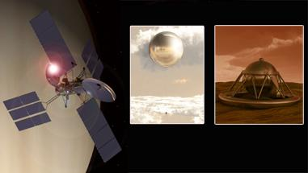

 

|*Type*|*[Param.](si.md)*|
|:--|:--|
|**Mission:**|• • •|
|Cost| $ 2.7 B ‑ 3.8 B or 86 370 ‑ 121 560 kg of [gold](sc_price.md) in 2009 prices |
|[CML](cml.md) / [TRL](trl.md)| CML: <mark>TBD</mark>, TRL: <mark>TBD</mark> |
|Development| … ‑ ┊ |
|Duration| 2.5 years |
|Launch| 2032, [Canaveral](canaveral.md), [Atlas V 551](atlas.md) (one for the orbiter, the other for the in situ vehicles & carrier) |
|Operator| NASA |
|Programme| … |
|Similar  missions| • Proposed: [Venera‑D](venera_d.md) (RU);  • Current: …, partially — [Akatsuki](akatsuki.md) (JP 2010);  • Past: [Vega-1/2](vega_1_2.md) (SU 1984), [Venera-9/10](venera_9_10.md) (SU 1975), [Venera-11/12](venera_11_12.md) (SU 1978). |
|Target| To understand the venusian greenhouse effect, atmospheric superrotation, climate changing, geo activity, water, atmosphere & surface evolution, inner structure, chemical structures etc.  |
|[Type](sc.md)| Orbiter spacecraft; atmospheric spacecraft; lander spacecraft |
|**Spacecraft:**|• • •|
|Composition| • 1 orbiter,  • 1 carrier (incl. 2 balloons in the clouds, 2 landers) |
|Contractor| … |
|Manufacturer| … |
||**`Orbiter`**|
|Comms| Ka/X‑band (to‑Earth, 52.6 GB/day); S‑band (to‑in situ) |
|[ID](spaceid.md)| NSSDC ID (COSPAR ID): <mark>TBD</mark>, SCN: <mark>TBD</mark> |
|Duration| 2.5 y (incl. 6 m for transit, 2 y for work) |
|Mass| wet: 5 306 kg, dry: 2 275 kg, payload: 290.4 kg ([large satellite](sc.md), ([EVN‑073](venus.md)))  |
|Orbit / Site| 230 × 230 km |
|Payload| [SAR](synthetic_aperture_radar.md), spectrometers, magnetomeeters, sounder, oscillator |
|Power| 32 m² solar panels (9 868 W EOL) |
||**`Carrier`**|
|Comms| • carrier: X/S‑band (to‑Earth, to‑in situ), S‑band (to‑in situ) |
|[ID](spaceid.md)| NSSDC ID (COSPAR ID): <mark>TBD</mark>, SCN: <mark>TBD</mark> |
|Duration| • balloons: 30 d in atmosphere;  • landers: 5 h on surface + 1 h of descent |
|Mass| • carrier wet: 5 578 kg;  • balloons: 162.5 kg (22.5 kg payload);  • landers: 686 kg (106.2 kg payload) |
|Orbit / Site| … |
|Power| • carrier: 4.4 m² solar panels;  • balloons: batterie 10.5 kWh;  • landers: batterie 6 kWh |
|Payload| • balloons: pressure/temp/wind detectors, spectrometer, nephelometer, magnetometer, camera;  • landers: cameras, magneetometer, nephelometer, radiometer, drilling rig, gamma detector |

 

Targets & objectives:

   - **T** — technical; **Draft** — minimum for working with object. **C** — contact research; **D** — distant research; **F** — fly‑by; **H** — manned; **S** — soil sampe return; **X** — technology demonstration
   - **Sections of measurement and observation:**
      - Atmospheric/climate — **Ac** composition, **Ai** imaging, **Am** mapping, **Ap** pressure, **As** samples, **At** temperature, **Aw** wind speed/direction.
      - General — **Gi** planet’s interactions with outer space.
      - Soil/surface — **Sc** composition, **Si** imaging, **Sm** mapping, **Ss** samples.

<small>

|*EVN‑XXX*|*T*|*EN*|*Section of m&o*|*D*|*C*|*F*|*H*|*S*|
|:--|:--|:--|:--|:--|:--|:--|:--|:--|
|EVN‑003|T|Exploration: from inside of atmosphere.|  |D|C||||
|EVN‑005|T|Exploration: from Venusian orbit.|  |D||F|||
|EVN‑006|T|Exploration: from surface.|  ||C||||
|EVN‑011||Atmosphere: common circulation model.|  |D|||||
|EVN‑019||Atmosphere: energetic balance.|  |D|||||
|EVN‑020||Inner structure of the planet.|  |D|||||
|EVN‑022||Surface: map, precise.|  |D|||||
|EVN‑023||Surface: mineralogical composition.|  ||C||||
|EVN‑024||Surface: composition.|  ||C||||
|EVN‑025||Surface: structure.|  ||C||||
|EVN‑026||Surface: elemental composition.|  ||C||||
|EVN‑027||The causes why Venus evolved in a planet so different from Earth.|  |D|C|F|||
|EVN‑029||Is Venus geologically active?|  |D|C|F|||
|EVN‑034||Atmosphere: nature of the superrotation.|  |D|||||
|EVN‑040||Were there oceans & why have they gone|  |D|C|F|||
|EVN‑041||Common connection between the atmosphere & the surface.|  |D|||||
|EVN‑042||History & causes of the planet’s volcanic & tectonic evolution.|  |D|||||
|EVN‑048||Nature & sources of the greenhouse effect.|  |D||F|||
|EVN‑050||Causes of the water loss.|  |D|||||
|EVN‑055|T|Atmosphere: sample obtaining & analysis.|  ||C||||
|EVN‑062|T|Surface: obtaining & analysis of the surface samples.|  ||C|||S|
|EVN‑063|T|Surface: panoramic mapping.|  ||C||||
|EVN‑073|T|Exploration with [satellites](sc.md): large satellites.|  |D||F|||
|EVN‑084|T|Atmosphere: prolonged investigations on the H=30 ‑ 60 km.|  |D|||||
|EVN‑088|T|Surface: subsurface investigations.|  ||C||||
|EVN‑092|T|Serve as a relay to Earth for stand‑alone SC/instruments.|  |D|||||
|EVN‑093|T|Atmosphere/surface imaging.|  |D||F|||
|EVN‑095||Climate: history & causes of changes.|  |D|||||

</small>

In response to recommendations from the National Research Council (NRC) [Decadal Survey](us_psds.md) (2003), & [NASA’s Solar System Exploration (SSE) Roadmap (2006) ❐](f/project/n/nasa_sse_roadmap_2006.pdf), over the past year [NASA](03_nasa.md) has funded a mission concept study to better understand the science goals & technology requirements for a future [Venus](venus.md)) Flagship‑class mission.

The study was guided by a NASA appointed Venus Science & Technology Definition Team (STDT) — which comprised of an international group of scientists & engineers from the United States, the Russian Federation, France, Germany, the Netherlands, & Japan — with support from [JPL](03_jpl.md) through a dedicated engineering core team, & the Advanced Project Design Team, also known as [Team X](jpl_if.md).

This study group assessed science goals & investigations, & identified a suitable mission architecture — including a notional instrument payload, subsystems & technologies — to achieve mission objectives. Based on NASA guidelines for the study, this mission concept targeted a launch opportunity between 2020 & 2025, & a cost cap between $3B & $4B. It is also expected that a future Venus Flagship mission will be built on international partnerships. Such a mission would revolutionize our understanding of the climate of terrestrial planets, including the coupling between volcanism, tectonism, the interior, & the atmosphere; & the habitability of extrasolar terrestrial planets. It could also contribute to resolving the geologic history of Venus, including the existence of a past ocean. The chosen mission architecture pointed to specific technology development needs, such as sample acquisition & handling; aerial mobility; & high temperature tolerant components (e.g., sensors, electronics, mechanisms, instruments, & power storage).

Findings from the report will be used in NASA’s program planning activities & will provide important input to the ongoing NRC Decadal Survey update.

|||
|:--|:--|
|  |  |
| 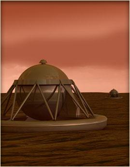 | 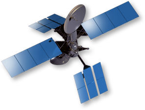 |

 

## Venus Design Reference Mission
The Venus Flagship Design Reference Mission (DRM) is optimized to achieve the highest number of high‑priority science goals & objectives of Venus exploration, & it is comprised of a highly capable orbiter ([EVN‑005](venus.md)), 2 balloons in the clouds ([EVN‑003](venus.md)), & 2 landers on different terrains ([EVN‑06](venus.md)).

The orbiter would provide telecom relay support for the month‑long balloon campaign & for the two five‑hour landers ([EVN‑092](venus.md)) (not including the 1 hour descent phase). Following the telecom support phase, the orbiter would aerobrake into a 230‑km circular science‑mapping orbit for a two‑year mapping mission. Extremely high‑resolution radar & altimetry mapping would explore the surface at resolutions up to two orders of magnitude greater than was achieved with [Magellan](magellan.md) ([EVN‑022](venus.md)), opening a new door to studies of comparative geology. While the balloons circumnavigate the planet up to 7 times, they would continually sample gases & cloud aerosols ([EVN‑055](venus.md)) & measure the solar & thermal radiation within the clouds ([EVN‑019](venus.md)). The landers would perform descent science, obtaining atmospheric measurements in complementary vertical slices & taking images of the surface on the way down ([EVN‑093](venus.md)). While on the surface, they would perform high‑fidelity analyses of the elemental ([EVN‑026](venus.md)) & mineralogical ([EVN‑023](venus.md)) content of rocks & soils on & beneath the surface ([EVN‑088](venus.md)). Panoramic images ([EVN‑063](venus.md)) of the landing sites at an order of magnitude higher resolution than achieved with previous landers would provide geologic context for the landing & sampling sites ([EVN‑062](venus.md)). The mission concept requires two [Atlas V 551](atlas.md) launch vehicles in the 2020 ‑ 2025 timeframe: one for the orbiter, the other for the in situ vehicles & carrier. The preliminary cost analysis for the DRM gives a range of $2.7 B to $3.8 B in $FY09.

Clearly, the technological challenges for in situ exploration of Venus are high. The STDT considered mission architectures & payloads whose components & instruments could be at [Technical Readiness Level (TRL)](trl.md) 6 or higher by 2015. This ruled out a large number of scientifically promising approaches. Therefore, beyond the DRM, we considered the extra capabilities of a slightly enhanced mission that could be accommodated with the DRM architecture & entirely new capabilities for different architectures that would require a moderate, sustained technology program to achieve extraordinary science return from Venus.

The DRM accomplishes a very wide range of atmospheric, geologic, & geochemical investigations to illuminate how the atmosphere, clouds, surface, & interior interact over many timescales ([EVN‑041](venus.md)). It does this by using the synergy of simultaneous atmospheric & surface in situ exploration under a very capable mapping orbiter.

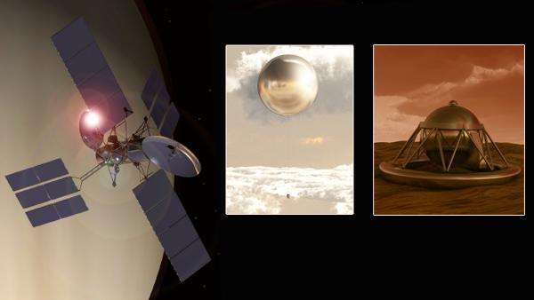

 

### Why Venus?
There is a compelling motivation of great global concern for exploring Venus: *As we discover how climate & geology work on a world similar to our own, we gain a deeper understanding of the processes at work in our own environment.*

With the realization that the Earth’s climate system is not sufficiently well understood, & the threat of accelerating anthropogenic changes to the atmosphere, comes a valid concern about the natural vulnerability of the world in which we have thrived. What are the limits of stability of the global system under the influence of human consumption & effluent? Could rapid or irreversible changes be triggered by the current unprecedented pace of greenhouse gas input to the atmosphere? Are there climate tipping points beyond which there is no return? To this last question, because of planetary exploration, we know the answer. Yes. Venus’ oceans boiled away in a dramatic runaway greenhouse & were eventually lost to space. If this happened to Venus, could it happen to Earth? Again, the answer is yes. Earth will someday pass the tipping point, its oceans will boil, & a desiccated, hot Earth will be like Venus today. We know this because main sequence stars like the Sun slowly increase in luminosity as their fuel is used up. Subtler discontinuities in climate, with real consequences for society, are certainly possible & climate feedbacks that might be difficult to discern in the Earth system might be illuminated by the deeper understanding of planetary climate gained by studying the climate of Venus.

Our great progress in exploring Mars illustrates how in‑depth exploration of a nearby terrestrial planet can successfully illuminate Earth processes. Mars’s dynamic surface, accessible to our eyes for centuries & comparatively benign as an environment for spacecraft exploration, has revealed how physics & chemistry have shaped another rocky world. This cold, dry planet has a history of water, climate, & potential habitability starkly different from our own. Other planets will, of course, offer radically different comparisons. Venus, too, we believe, had early oceans but lost this habitable environment for completely different reasons. Verifying & quantifying this story will immensely improve our understanding of how Earth‑like worlds come to be & how they might evolve to either encourage life or extinguish it. More immediately, the nature of climate feedbacks that might ultimately determine the physical safety & economic security of society must be understood. Some of the most revealing secrets to the formation of the solar system, the evolution of climate on our own planet, & the habitability of terrestrial planets around other stars can be found only on Venus. But the searching is difficult: Venus’ obscuring cloud layer & hostile environment have made it a challenging planet to explore.

Nevertheless, many of the scientific investigations that should be done to understand the Venus system & relate those results to our own world can be achieved by a flagship mission to Venus.

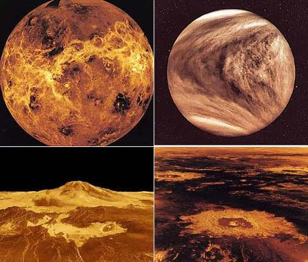

 

### VDRM Science Goals & Objectives
Why is Venus so different from Earth ([EVN‑027](venus.md))? The science driving a flagship‑class mission to Venus can be summarized by its 3 themes. These themes & objectives are summarized in the table below.

   1. **What does the Venus greenhouse tell us about climate change?** ([EVN‑048](venus.md)) The Venus greenhouse is poorly understood because it is coupled to the still mysterious atmospheric dynamics & cloud physics. To better understand the atmosphere, experiments that simultaneously probe dynamics, chemical cycles, energy balance ([EVN‑019](venus.md)), & isotopic abundances must be performed, mostly in situ.
   2. **How active is Venus?** ([EVN‑029](venus.md)) The search for Venus’ activity ranges from detecting active volcanic processes, to tracking the clouds & logging meteorological data such as the winds, pressures, & temperatures. Detecting ground movement at one location & monitoring the planet globally for seismic events are the most definitive tests for internal structure ([EVN‑020](venus.md)) & activity.
   3. **When & where did the water go?** ([EVN‑050](venus.md)) Mineralogical ([EVN‑023](venus.md)) & chemical ([EVN‑026](venus.md)) analyses of Venus’ surface, if done with sufficient precision, have the potential to revolutionize our understanding of Venus’ geology. The ability to analyze both rocks & soils & to drill to depths within pristine rocks holds the key to past changes in atmo conditions, volcanism, & climate ([EVN‑042](venus.md), [EVN‑095](venus.md)). Volcanism, tectonism & weathering affect the climate of Earth in profound ways.

|*Science Theme*|*Science Objective*|
|:--|:--|
| 1. What does the  Venus greenhouse  tells about  climate change | • Understand radiation balance in atmo, clouds & chemical cycles that affect it.  • Understand how superrotation ([EVN‑034](venus.md)) & the general circulation work ([EVN‑011](venus.md)).  • Look for evidence of climate change at the surface. |
| 2. How active  is Venus | • Current geologic activity, understand the geologic history.  • How surface/atmo interactions affect rock chemistry & climate ([EVN‑041](venus.md)).  • Place constraints on the structure & dynamics of the interior. |
| 3. When & where  did the water go | • Determine how the early atmosphere evolved.  • Identify chemical & isotopic signs of a past ocean. ([EVN‑040](venus.md))  • Crustal composition differences & evidence of continent‑like crust. ([EVN‑024,025](venus.md)) |

**MAJOR OPEN SCIENTIFIC QUESTIONS ABOUT VENUS**

**Venus atmosphere**

   - How did Venus evolve to become so different from Earth?
   - Was Venus ever habitable, & for how long?
   - Did Venus lose a primary atmosphere due to impacts or loss to space?
   - What drives Venus’ atmospheric superrotation?
   - How do geologic activity & chemical cycles affect the clouds & climate?
   - How are atmospheric gases lost to space?

**Venus geology**

   - What is the volcanic & tectonic resurfacing history of Venus?
   - How were the heavily deformed highlands made?
   - Is Venus geologically active?
   - Did Venus ever have plate tectonics & if so, when did it cease?
   - How are geology & climate connected on Venus?
   - What has been the role of water & other volatiles in Venus geology?

**Venus interior structure**

   - Does Venus have Earth‑like continents?
   - What are the chemical, physical, & thermal conditions of the interior?
   - How does mantle convection work on Venus?
   - What is the size & physical state of the core?
   - What is the structure of the Venus lithosphere?
   - How have water & other volatiles affected Venus’ interior evolution?

**Venus geochemistry**

   - Was there ever an ocean on Venus, & if so, when & how did it disappear?
   - What caused the resurfacing of Venus over the past billion years?
   - What is the nature of chemical interactions between surface & atmosphere?
   - What are the tectonic forces behind Venus’ volcanism?
   - How were the rocks & soils of Venus formed?
   - What do chemical differences of terrains say about the evolution of Venus?

### VDRM Baseline Science Payload
|*Orbiter*|*2 Balloons*|*Lander 1*|*Lander 2*|
|:--|:--|:--|:--|
| Lifetime (4 years) | In atmosphere (1 month) | Descent Phase (1 ‑ 1.5 hour) | Landed Phase (5 hours) |
| InSAR — Interferometric [Synthetic Aperture Radar](synthetic_aperture_radar.md) | ASI — Atmospheric Science Instrument (pressure, temperature, wind speed) | ASI | Microscopic imager |
| Vis‑NIR Imaging Spectrometer | GC/MS — Gas Chromatograph / Mass Spectrometer | Vis‑NIR Cameras with spot spectrometry | XRD / XRF |
| Neutral Ion Mass Spectrometer | Nephelometer | GC / MS | Heat Flux Plate |
| Sub‑mm Sounder | Vis‑NIR camera | Magnetometer | Passive Gamma Ray Detector |
| Magnetometer | Magnetometer | Net Flux Radiometer | Sample acquisition, transfer, & preparation |
| Langmuir Probe | Radio tracking | Nephelometer | Drill to ~10 cm |
| Radio Subsystem (USO — Ultra Stable Oscillator) |  |  | Microwave Corner reflector |

 

### VDRM Mission Design
The Venus DRM mission timeline in the form of a mission architecture storyboard is shown in Figures 1 & 2, & consists of six key steps. The first figure shows the interplanetary trajectories & the various mission phases associated with the two launches, while the second figure provides a storyboard for the Entry, Descent & Inflation (EDI) & Entry, Descent & Landing (EDL) phases of the in situ elements.

Further details on the timeline are provided in Figure 3.

   - **Step 1**: Carrier spacecraft launch: April 30, 2021 on an Atlas V 551 L/V (w/ 5 m diameter fairing); on a Type IV trajectory to Venus (arrives second).
   - **Step 2**: Orbiter spacecraft launch: October 29, 2021 on an Atlas V 551 L/V (w/ 5 m diameter fairing); on a Type II trajectory to Venus (arrives first).
   - **Step 3**: Orbiter arrives on April 6, 2022 (159‑day cruise) Venus Orbit Insertion (VOI) maneuver; 300 × 40 000 km orbit for telecom relay support for (balloons & landers).
   - **Step 4**: Carrier flyby on July 30, 2022 (436 days of cruise) Entry system #1 release: 20 days before carrier’s Venus flyby; Entry system #2 release: 10 days before carrier’s Venus flyby; Backup relay telecom support during lander’s lifetime.
   - **Step 5**: Staggered entry for entry systems (13 hours — one orbiter revolution); Entry, Descent, & Inflation (EDI) phases for the balloons; Entry, Descent, & Landing (EDL) phases for the landers.
      - **Step 5a**: Pre‑entry phase: entry system (w/ balloon & lander) cruises to Venus.
      - **Step 5b**: Atmospheric entry; entry heating; deceleration; Deployment of drogue parachute.
      - **Step 5c**: Separation of aeroshell into two parts; Main chutes open for balloon & lander elements; Balloon released from storage container.
      - **Step 5d**: Full balloon inflation in ~5 minutes.
      - **Step 5e**: Helium inflation system jettisoned; Balloon rises to 55.5 km equilibrium altitude; Lander continues its descent to the surface; descent science.
      - **Step 5f**: Balloon cord extended: One‑month balloon science mission phase begins. Balloon data relayed to orbiter.
      - **Step 5g**: Lander reaches the ground after 1 hour of descent; Begin 5‑hour surface science operations phase; Lander data relayed to orbiter.
   - **Step 6**: Orbiter completes relay telecom support: 6 months of aerobraking to 230 km circular orbit; 2 years of orbiter science operations in prime mission (sufficient propellant for 2‑year extended mission).

[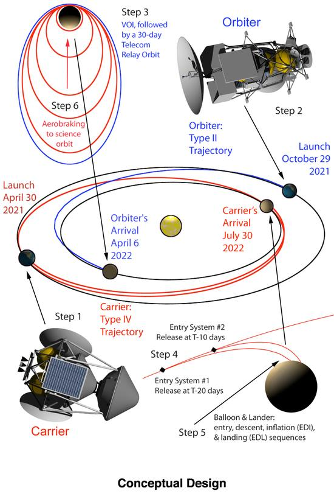](f/project/v/venus_flagship_mission/vfm_07.jpg)  **Figure 1**

 

[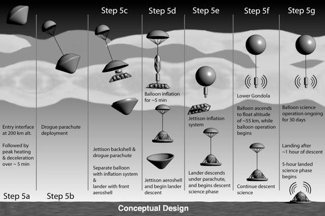](f/project/v/venus_flagship_mission/vfm_08.jpg)  **Figure 2**

 

[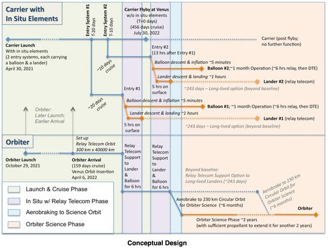](f/project/v/venus_flagship_mission/vfm_09.jpg)  **Figure 3**

 

### VDRM Orbiter
   - Launch Vehicle: Atlas V‑551 (w/ 5 m diameter fairing)
   - Mass (CBE + Cont.): 5 306 kg (wet); 2 275 kg (dry) ([EVN‑073](venus.md))
   - Payload mass (CBE + Cont.): 290.4 kg
   - Design: Dual string design
   - Power: 32 m² solar panels (9 868 W EOL)
   - Attitude Control: 3 axis stabilized
   - Comms: 4 m Ka/X‑band (Orbiter‑to‑Earth to 34‑m DSN antennas); 0.5 m S‑band (Orbiter‑to‑in situ); 2.5 m S‑band (Orbiter‑to‑in situ);
   - Functions: Relay telecom support ([EVN‑092](venus.md)) for in situ elements (30 days); 6 months of aerobraking to science orbit; Science orbiter (2 years baseline & 2 years extended)
   - Science data return: ~300 Tbits of data to Earth over 2 years of science ops. *(~52.6 GB/day, or 2.5 MB/s during a 6 h transmit session)*

 

### VDRM Carrier
   - Launch Vehicle: Atlas V‑551 (5 m diameter fairing)
   - Mass (CBE + Cont.): 5 578 kg (wet) w/ entry systems; 1 640 kg (wet) w/o entry systems; 1 117 kg (dry) w/o entry systems; (Two entry systems: 3 938 kg)
   - Design: Dual string design
   - Power: 4.4 m² solar panels
   - Attitude Control: 3‑axis stabilized; (Spin up for release of entry systems)
   - Comms: 2.5 m dual‑feed X/S‑band HGA (Carrier‑to‑Earth to 34‑m DSN antennas; & Carrier‑to‑in situ); 2.5 m S‑band fixed HGA (Carrier‑to‑in situ);
   - Functions: Entry system delivery & deployment; & backup relay telecom ([EVN‑092](venus.md))

[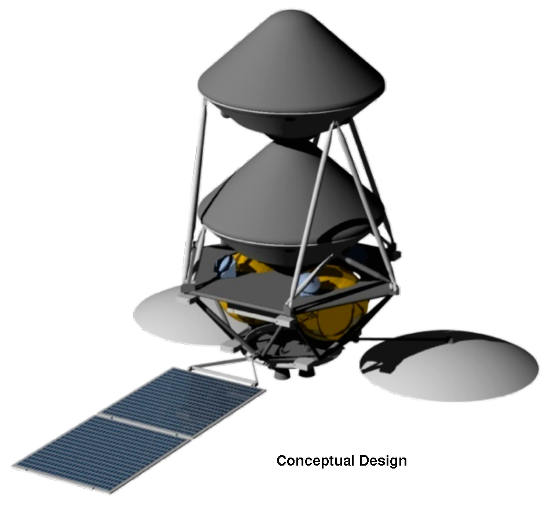](f/project/v/venus_flagship_mission/vfm_10.jpg)

 

### VDRM Entry Systems
   - Each entry system carries a balloon & a lander with supporting subsystems
   - Mass (CBE + Cont.): 1 969 kg each
   - Design: Thermal Protection System: Carbon‑Phenolic
   - Aeroshell: 45° half cone angle (Pioneer‑Venus heritage); 2.65 m diameter
   - Spin stabilized after release from carrier
   - Functions: Deliver the in situ elements safely through the atmosphere

[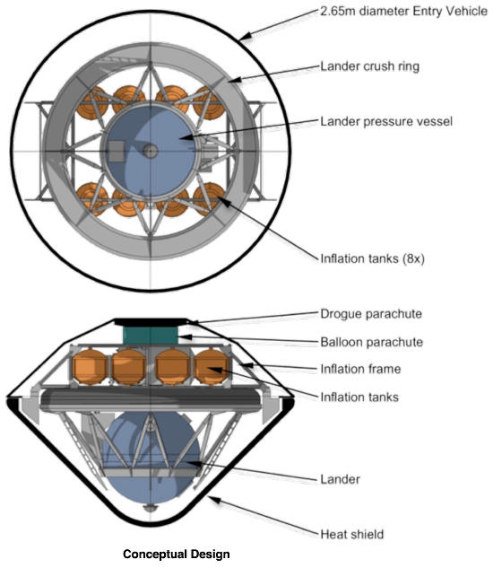](f/project/v/venus_flagship_mission/vfm_11.jpg)

 

### VDRM Balloons
   - Mass (CBE + Cont.): 162.5 kg; Payload mass: 22.5 kg
   - Design: Single string, redundancy through multiple elements
   - 7.1 m diameter He filled superpressure balloon
   - Teflon coated for sulfuric acid resistance
   - Vectran fabric plus Mylar film construction; metalized for low solar heating
   - Power: lithium‑thionyl chloride (Li‑SOCl₂) primary batteries (10.5 kWh, 22 kg)
   - Comms: S‑band to Orbiter (backup to carrier flyby SC); (+ short carrier signal to Earth for Doppler & VLBI data)
   - Functions: 30 days science operation at 55.5 km float altitude ([EVN‑084](venus.md))

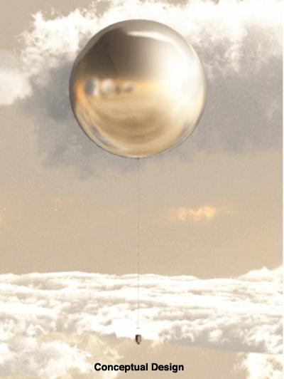

 

### VDRM Landers
   - Mass (CBE + Cont.): 686 kg; Payload mass: 106.2 kg
   - Design: Single string, redundancy through multiple elements
   - 0.9 m diameter titanium shell (1 cm wall thickness)
   - Rotating pressure vessel; Drill to 10 cm (2 samples)
   - Thermal design: Passive thermal management: Lithium nitrate with phase change material; Silica insulation: 5 cm external; 1 cm internal; CO₂ backfilled pressure vessel
   - Power: lithium‑thionyl chloride primary batteries (the same cells used on the balloons), (6 kWh, 12.6 kg)
   - Comms: S‑band LGA to Orbiter with Electra (backup to flyby s/c)
   - Functions: Descent science for ~1 hour; Surface science for 5 hours

---

 

## Other Venus Missions
Over the past 3 decades more than [20 Missions ⎆](http://www.planetary.org/explore/topics/venus/missions.html) succeeded to explore Venus, with orbiters, probes, landers & balloons. In addition, many attempts have failed, teaching us valuable lessons about the challenges of space exploration & the extreme environments of our sister planet.

From the beginning of the space age, Venus was considered a most tempting destination for spacecraft exploration. Following the launch of Sputnik 1 in 1957, an informal competition between the United States & the Soviet Union developed to see who could make the furthest advancements into space. Venus was a natural showcase to display each nation’s technological & scientific breakthroughs. Both nation’s programs were highly successful in their effort to reach Earth’s «sister planet» & learn more about its atmospheric & geological features.

Opportunities to launch a spacecraft to Venus are spaced at intervals of approximately every 19 months. From 1962 to 1985 almost all of these opportunities were utilized. Descriptions of past & future planned missions to Venus are included.

### Venera & VEGA — Russia
The Soviet Venus exploration program extended over more than two decades from the first attempt to send a spacecraft to Venus to the program’s closure. At the program’s inception, scientists underestimated the atmospheric & surface conditions, making the initial missions underprepared for the challenges of conducting scientific investigations. While later missions benefited from returned science & were designed with increased capabilities to deal with the severe environmental conditions, in some cases spacecraft design was unable to keep pace with the rapidly increasing science understanding & missions were launched with only partially effective protection systems.

The Soviet program began with the Venera 1 probe. After 1961, the Soviet RKA developed a new spacecraft architecture consisting of an orbital module connected to a descent probe or lander for in situ missions, or to an instrument module for orbital or flyby missions. This architecture was implemented in all Venus missions from Zond 1 (1964) up to Venera 8 (1972). After the initial attempt with Venera 1, the Zond 1 impactor & the Venera 2 (1965) probe soon followed, but didn’t succeed due to telecom system failure. The next step was the Venera 3 probe (1965), the first man‑made object to land on another planet.

During the late 1960s, the Soviet RKA continued to improve both the Venus orbiting module & descent capsule. At the time, it was thought that the surface temperature of Venus was approximately 300 °C, with an atmosphere consisting mainly of carbon dioxide & nitrogen at about 20 bars. Consequently, the capsule was designed to survive 300 °C & 25 bars. Venera 4, launched in 1967, reached Venus & transmitted data on the atmosphere & environment until it reached an attitude of about 26 km after 93 minutes of descent. Venera 5 & Venera 6 were launched in 1969 within a week of one another. Both were equipped with a set of sensors to further characterize the Venus atmospheric temperature, pressure, & composition. Because they were designed to survive 25 bars, they were not expected to deliver any surface data. Although mission designers were aware of the new analysis of the Venus environment, it was too late to significantly redesign the landing capsule without missing the next launch opportunity. However, based on the experience with Venera 4, the parachutes were modified to accelerate the capsule’s descent, allowing it to reach greater depths prior to overheating the capsule’s electronics. Both Venera 5 & 6 survived the descent for about 50 minutes & reached altitudes of approximately 20 km, where the pressure exceeded 27 bars & temperature exceeded 300 °C. Their failures were most likely due to crushing of the pressure vessel.

The next series of missions, Venera 7 (1970) to 10 (1975), represented a leap forward for in situ science as the first data were returned from another planet. These spacecraft were designed to sufficiently mitigate the challenging conditions experienced during descent through the Venus atmosphere, as well as on the surface. With Venera 9 (1975) & 10, the Soviet space agency introduced a completely redesigned spacecraft, used for all later Venus missions. Venera 9 & 10 transmitted data from the surface for 53 & 65 minutes, respectively. The landers’ capabilities were not the limiting factors in the surface survival time; instead, each mission terminated when its orbiter exited the communication range.

The next series of landers, Venera missions 11, 12, 13, 14, (all launched in 1978 within a few days from each other) improved upon the successes of the ongoing Soviet Venus exploration program. These missions all descended to the surface in approximately one hour & lasted on the surface for up to two hours. The Venera 11 & 12 spacecraft were quite similar to Venera 9 & 10, with a few modifications & new instruments. They descended through the clouds & atmosphere to reach the surface in about one hour. Venera 11 transmitted data for about 95 minutes, until the flyby spacecraft used as relays were out of reach. Venera 12 transmitted data for 110 min. Unfortunately, not all the experiments on Venera 11 & 12 succeeded. Venera 13 was very similar to Venera 12, except for increased battery power & more instruments. Venera 13 included some aerodynamic modifications that increased the lander’s stability during free fall. The Venera 13 & 14 landers featured an improved sample acquisition system. Venera 13 transmitted for 127 min & Venera 14 for 57 min to the relay bus, until the relay moved out of the lander’s communication range.

The last Soviet mission to the surface of Venus, Vega, launched in 1984 with two identical spacecraft containing a lander & a balloon. This mission combined a Venus swingby & a Comet Halley flyby (thus the name Venera‑Gallei, or Vega). Two identical spacecraft, Vega 1 & Vega 2, were launched December 15 & 21, 1984, respectively. After carrying Venus entry probes to the vicinity of Venus, the two spacecraft were retargeted using Venus gravity field assistance to intercept Comet Halley in March 1986. The Vega architecture was similar to Venera 14, but it included new instruments focused on measuring the composition & size distribution of cloud particles, as well as on the direct detection of sulfuric acid. Each of the two Vega entry systems carried a Venera‑like lander & a 3.4 m diameter superpressure balloon. The balloons were designed to deploy & float high in the atmospheric clouds (~53 km) where the temperature was near that of Earth. The balloons traversed ~12 000 km & stopped transmitting after approximately 48 hrs of operation, after exhausting their batteries.

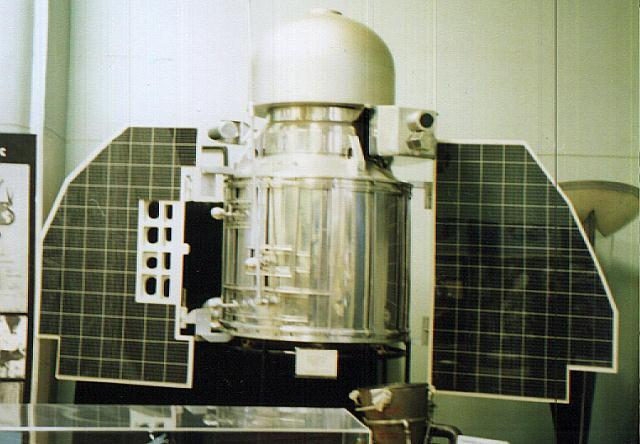 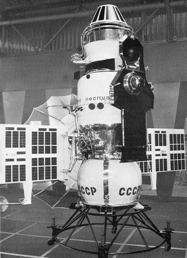 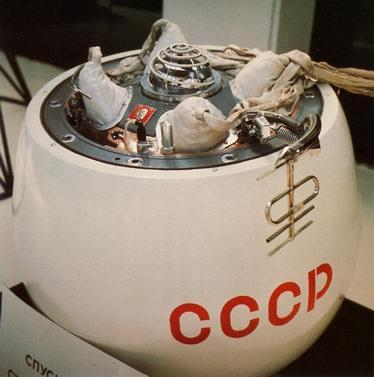 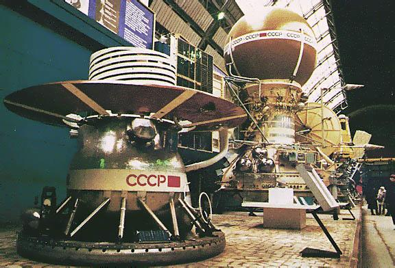 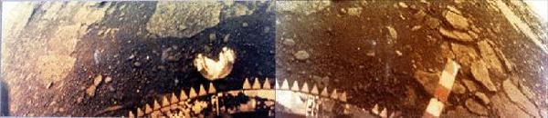

 

### Flyby missions (Mariner, Galileo, MESSENGER)
**Mariner 5**

American probe Mariner 5 was originally built as a backup for Mariner 4 to Mars, but later it was refurbished & modified to go to Venus. The spacecraft was launched on June 14, 1967, & flew by Venus on October 19, 1967 (a day after Venera 4), at a distance of 3 990 km (2 480 miles). With its more sensitive instruments than aboard Mariner 2, it revealed new information about Venus’ atmosphere, including its composition of 85 ‑ 99 % carbon dioxide. Mariner 5 also studied the interplanetary space in the vicinity of Venus & advanced science & the art of building & operating interplanetary spacecraft.

As a consequence, in 1968, Soviet & American scientists met in Tucson, Arizona, to discuss & compare results from both the Venera series & Mariner. This meeting led to a new estimate of 427 °C for the surface temperature & an estimate of 75 bars for the pressure, levels that exceeded the design limits of the Venera 4, 5, & 6 spacecraft family.

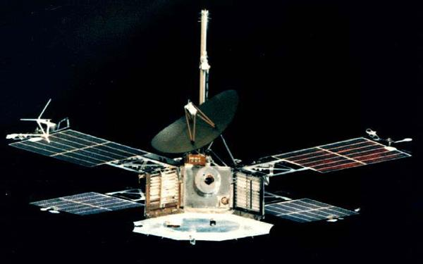

 

**Mariner 10**

Mariner 10 was launched in 1973, & it was the seventh successful launch in the Mariner series & the first spacecraft to visit Mercury. It was also the first spacecraft to use the gravitational pull of one planet (Venus) to reach another (Mercury), & the first spacecraft mission to visit two planets. The spacecraft flew by Mercury three times in a retrograde heliocentric orbit & returned images & data on the planet. Mariner 10 returned the first‑ever close‑up images of Venus & Mercury. The primary scientific objectives of the mission were to measure Mercury’s environment, atmosphere, surface, & body characteristics & to make similar investigations of Venus. Secondary objectives were to perform experiments in the interplanetary medium & to obtain experience with a dual‑planet gravity‑assist mission.

For further details, see:   <http://nssdc.gsfc.nasa.gov/nmc/spacecraftDisplay.do?id=1967-060A> (for Mariner 5), &   <http://nssdc.gsfc.nasa.gov/nmc/spacecraftDisplay.do?id=1973-085A> (for Mariner 10)

 

**Galileo Venus Flyby**

Galileo was launched on October 18, 1989, aboard space shuttle Atlantis. To achieve sufficient velocity to reach Jupiter directly, the trajectory design included Venus‑Earth‑Earth gravity assist (swingby) scheme. The Venus gravity assist flyby occurred on February 9 ‑ 10, 1990, at a distance of 16 000 km above the cloudtops. Although the sole objective of this flyby was to pump up Galileo’s orbit, scientists used this opportunity to turn the spacecraft’s planetary sensors on the cloud‑shrouded planet, in order to study its atmosphere & environment. The scientific data was stored on the spacecraft tape recorder until late October, 1990, when Galileo was close enough to Earth to play them back over its low‑gain antenna. The Venus observations were selected on the basis of (1) not risking Jupiter observations in the 1995 ‑ 1997 Jovian orbital phase, (2) not exceeding the capacity of the tape, & (3) getting the best new scientific information about Venus.

Details on the Galileo mission can be found at <http://www2.jpl.nasa.gov/galileo/>

During the 1990 Venus flyby of the Galileo spacecraft, the Near‑Infrared Mapping Spectrometer investigated the night‑side atmosphere of Venus in the spectral range 0.7 to 5.2 micrometers. Multispectral images at high spatial resolution indicated substantial cloud opacity variations in the lower cloud levels, centered at 50 km altitude. Zonal & meridional winds were derived for this level & are consistent with motion of the upper branch of a Hadley cell. Northern & southern hemisphere clouds appear to be markedly different. Spectral profiles were used to derive lower atmosphere abundances of water vapor & other species. (Ref: Carlson et al., «Galileo Infrared Imaging Spectroscopy Measurements at Venus», Science 27 September 1991: Vol. 253. no. 5027, pp. 1541 ‑ 1548, DOI: 10.1126/science.253.5027.1541)

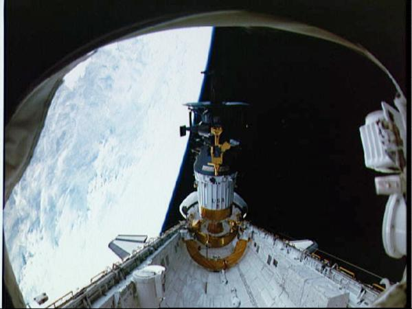

 

**MESSENGER**

Following the footsteps of Mariner 10 over 30 years earlier (1975), the MESSENGER spacecraft (MErcury Surface, Space ENvironment, GEochemistry & Ranging) was launched on August 3, 2004, to study the characteristics & environment of Mercury from orbit. It was designed to characterize the chemical composition of Mercury’s surface, the geologic history, the nature of the magnetic field, the size & state of the core, the volatile inventory at the poles, & the nature of Mercury’s exosphere & magnetosphere over a nominal orbital mission of one Earth year. MESSENGER will perform significantly improved science investigations over Mariner, with vastly improved scanning capability, & cameras capable of resolving surface features to 18 m (59 ft), providing global imaging of Mercury. (In comparison, Mariner 10 was a flyby mission, which only observed the sunlit hemisphere with a resolution of 1.6 km (0.99 mi).)

MESSENGER made two Venus flybys. Its first flyby of Venus on October 24, 2006 was made at an altitude of 2 992 km (1 859 mi). A second flyby of Venus was made on June 5, 2007 at an altitude of 338 km (210 mi). During the flybys, a comprehensive set of science observations was obtained with the instrument suite onboard.

Details on the mission can be found at: <http://messenger.jhuapl.edu/index.php>

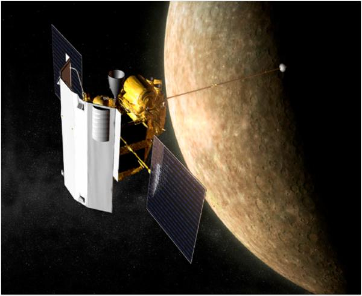

 

### Pioneer‑Venus — USA
The NASA program of in situ Venus exploration has to date launched only one mission, [Pioneer‑Venus ⎆](http://www.nasa.gov/mission_pages/pioneer-venus/index.html), launched in 1978. Pioneer‑Venus consisted of one Large Probe with a parachute to prolong its descent & three small probes. These probes were designed to operate deep in the atmosphere but there was no requirement for them to survive a landing on Venus. Ultimately, even though they all experienced a number of anomalies in the lower atmosphere, they all operated until surface impact, with one continuing to send data after impact. One Multiprobe Bus carried all probes until they were separated sequentially near Venus to reach different regions. It then entered the atmosphere & obtained atmospheric composition data until burnup.

Details about the Pioneer‑Venus mission elements & technologies are provided in the report titled [Extreme Environments Technologiesfor Future Space Science Missions ❐](f/project/v/venus_flagship_mission/vfm_doc002.pdf).

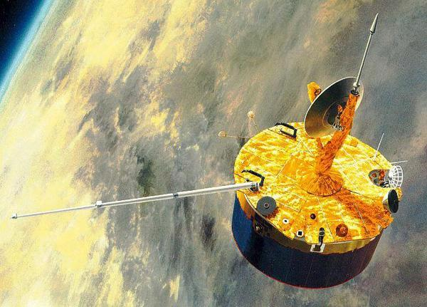

 

### Venus Climate Observer (Planet C) — JAXA
The Venus Climate Orbiter mission (PLANET‑C), one of the future planetary missions of Japan, aims at understanding the atmospheric circulation of Venus. Meteorological information will be obtained by globally mapping clouds & minor constituents successively with 4 cameras at ultraviolet & infrared wavelengths, detecting lightning with a high‑speed imager, & observing the vertical structure of the atmosphere with radio science technique. The equatorial elongated orbit with westward revolution fits the observations of the movement & temporal variation of the Venusian atmosphere, which rotates westward. The systematic, continuous imaging observations will provide us with an unprecedented large dataset of the Venusian atmospheric dynamics. Additional targets of the mission are the exploration of the ground surface & the observation of zodiacal light. The mission will complement the ESA’s Venus Express, which also explores the Venusian environment with different approaches. The spacecraft will be launched & arrive at Venus in 2010, & will perform 2 Earth years of operation.

Further information on the mission can be found at: <http://www.stp.isas.jaxa.jp/venus/top_english.html>

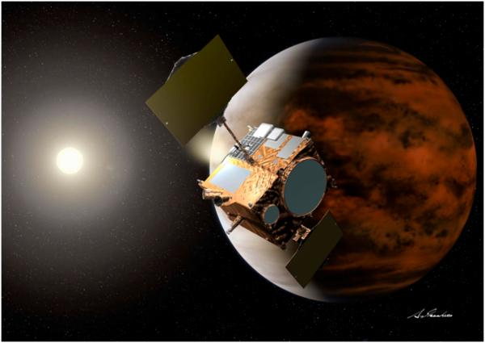

 

### Venus Express — ESA
Venus Express is a follow on from the Mars Express mission. Many of the instruments on the mission are simply upgraded versions of those on the Mars Express platform. After a 153 day cruise to Venus the spacecraft entered Venusian orbit on 11 April 2006. Venus Express is studying the Venusian atmosphere & clouds in unprecedented detail & accuracy. It is ESA’s first spacecraft to visit this planet.

Details on the mission can be found at:  <http://www.esa.int/esaMI/Venus_Express/index.html>

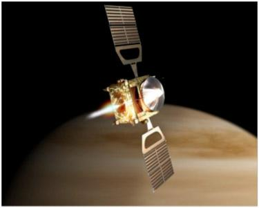

 

### Magellan (Orbiter)
The Magellan spacecraft was launched on May 4, 1989, & arrived at Venus on August 10, 1990. Magellan’s solid rocket motor placed it into a near‑polar elliptical orbit around the planet. During the first 8‑month mapping cycle around Venus, Magellan collected radar images of 84 % of the planet’s surface, with resolution 10 times better than that of the earlier Soviet Venera 15 & 16 missions. Altimetry & radiometry data also measured the surface topography & electrical characteristics. During the extended mission, two further mapping cycles from May 15, 1991 to September 14, 1992 brought mapping coverage to 98 % of the planet, with a resolution of approx. 100 m.

Further details on the mission can be found at: <http://www2.jpl.nasa.gov/magellan/>

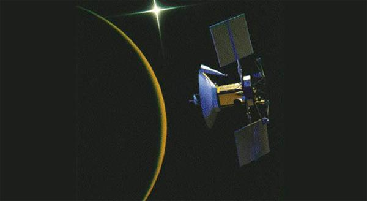  [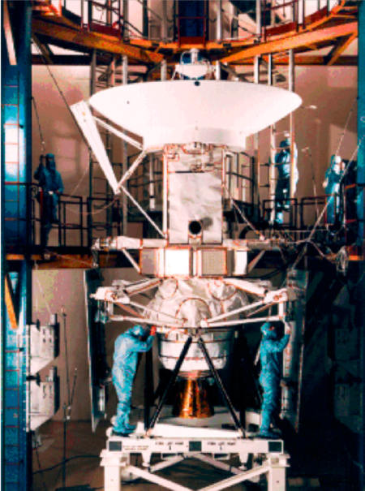](f/project/v/venus_flagship_mission/vfm_27.jpg)

---

 

## Community, library, links

**PEOPLE**

**Venus Science & Technology Definition Team (STDT) Members**

   - **Chair:** [Mark A. Bullock](02_bullock1.md), Southwest Research Institute, Boulder, CO, USA
   - **Co‑Chair:** [David Senske](02_senske1.md), Jet Propulsion Laboratory, Pasadena, CA, USA

**Atmosphere Sub‑Group of the STDT**

   - [David H. Grinspoon](02_grinspoon1.md), (**Lead**) Denver Museum of Nature & Science, Denver, CO, USA
   - [Eric Chassefiere](02_chassefiere1.md), Service d’Aeronomie, Paris, France
   - [Anthony Colaprete](02_colaprete1.md), NASA / Ames Research Center, Mountain View, CA, USA
   - [George L. Hashimoto](02_hashimoto1.md), Kobe University, Japan
   - [Sanjay S. Limaye](02_limaye1.md), University of Wisconsin, Madison, WI, USA
   - [Hakan Svedhem](02_svedhem1.md), ESA, Noordwijk, Netherlands
   - [Dimitri V. Titov](02_titov1.md), Max Planck Institute for Solar System Research, Germany
   - [Mikhail Y. Marov](02_marov1.md), Keldysh Institute of Applied Mathematics, Moscow, Russia

**Geochemistry Sub‑Group of the STDT**

   - [Allan H. Treiman](02_treiman1.md), (**Lead**) Lunar & Planetary Institute, Houston, TX, USA
   - [Natasha Johnson](02_johnson1.md), NASA / Goddard Space Flight Center, Greenbelt, MD, USA
   - [Steve J. Mackwell](02_mackwell1.md), Lunar & Planetary Institute, Houston, TX, USA

**Geology & Geophysics Sub‑Group of the STDT**

   - [Dave A. Senske](02_senske1.md), (**Lead**) Jet Propulsion Laboratory, Pasadena, CA, USA
   - [Bruce A. Campbell](02_campbell1.md), Smithsonian Institution, Washington, DC, USA
   - [Lori Glaze](02_glaze1.md), NASA/Goddard Space Flight Center, Greenbelt, MD, USA
   - [Jim W. Head](02_head1.md), Brown University, Providence, Rhode Island, USA
   - [Walter S. Kiefer](02_kiefer1.md), Lunar & Planetary Institute, Houston, TX, USA
   - [Gerald Schubert](02_schubert1.md), University of California at Los Angeles, CA, USA

**Technology Sub‑Group of the STDT**

   - [Elizabeth A. Kolawa](02_kolawa1.md), (**Lead**) Jet Propulsion Laboratory, Pasadena, CA, USA
   - [Steve Gorevan](02_gorevan1.md), Honeybee Robotics, New York, NY, USA
   - [Gary Hunter](02_hunter1.md), NASA / Glenn Research Center, Cleveland, USA
   - [Viktor V. Kerzhanovich](02_kerzhanovich1.md), Jet Propulsion Laboratory, Pasadena, CA, USA

**Ex Officio**

   - [Ellen R. Stofan](02_stofan1.md), VEXAG Chair & Proxemy Research, Virginia, USA
   - [Tibor Kremic](02_kremic1.md), NASA / Glenn Research Center, Cleveland, USA

**JPL Venus Flagship Mission Architecture Study Team**

   - [Jeffery L. Hall](02_hall1.md), (**Study Lead**) Jet Propulsion Laboratory, Pasadena, CA, USA
   - [Tibor S. Balint](02_balint1.md), (Mission Lead) Jet Propulsion Laboratory, Pasadena, CA, USA
   - [Craig E. Peterson](02_peterson1.md), Jet Propulsion Laboratory, Pasadena, CA, USA
   - [Tom Spilker](02_spilker1.md), Jet Propulsion Laboratory, Pasadena, CA, USA
   - [Alexis C. Benz](02_benz1.md), Jet Propulsion Laboratory, Pasadena, CA, USA
   - [Johnny H. Kwok](02_kwok1.md), (Phase 1 Study Lead) Jet Propulsion Laboratory, Pasadena, CA, USA
   - [Team X Design Team](jpl_if.md), Jet Propulsion Laboratory, Pasadena, CA, USA

**NASA & JPL**

   - [James A. Cutts](02_cutts1.md), Jet Propulsion Laboratory, Pasadena, CA, USA
   - [Adriana C. Ocampo](02_ocampo1.md), NASA HQ, Washington, DC, USA

 

**COMMUNITY**

**Venus Exploration Analysis Group (VEXAG)**  
The United States Venus science & technology community is represented by the [Venus Exploration Analysis Group (VEXAG)](vexag.md), which was established by NASA in July 2005 to identify scientific priorities & strategy for exploration of Venus. VEXAG is currently composed of two co‑chairs, [Sue Smrekar](02_smrekar1.md) & [Sanjay Limaye](02_limaye1.md), & four focus groups. Past VEXAG chairs & co‑chairs were [Ellen Stofan](02_stofan1.md), Sushil Atreya & [Janet Luhmann](02_luhmann1.md). The Focus Groups are:  
• Venus‑Earth Climate Connections. Lead: [David Grinspoon](02_grinspoon1.md), Denver Museum of Nature & Science.  
• Venus Exploration Laboratory Measurements. Lead: [Mark Allen](02_allen1.md), JPL.  
• Planetary Formation/Evolution: Surface & Interior, Volcanism, Geodynamics, etc. Lead: [Steve Mackwell](02_mackwell1.md), LPI.  
• Atmo Evolution: Dynamics/Meteorology, Chem, Solar Wind Interaction, Escape, etc. Lead: [Kevin Baines](02_baines1.md), JPL.  
• Venus Exploration Technologies. Lead: [James Cutts](02_cutts1.md), JPL.  
The focus groups will actively solicit input from the scientific community. VEXAG will report its findings & provide input to NASA, but will not make recommendations. In addition to interested members of the scientific community, each focus group will include technology experts, NASA representatives, international partner representatives, Education & Public Outreach (EPO) experts, & the VEXAG chair. The current focus groups & their leads’re listed above. Other focus groups may be added, as needed. Further information on VEXAG & its activities can be found at: <http://www.lpi.usra.edu/vexag/>. NASA & LPI contacts:  
• Dr. [Adriana Ocampo](02_ocampo1.md), NASA Headquarters  
• Dr. [Thomas W. Thompson](02_thompson1.md), NASA/JPL  
• Dr. [Steve Mackwell](02_mackwell1.md), LPI

**European Venus Explorer (EVE)**  
In Europe, the European Venus Explorer (EVE) is a mission proposed to the European Space Agency (ESA). While it was not selected in the first round under ESA’s Cosmic Vision program, the mission will be re‑proposed for the next opportunity, to be launched after 2020. The EVE mission would focus on the evolution of Venus & its climate, with relevance to terrestrial planets everywhere. The originally proposed architecture included an orbiter, a cloud level balloon, & a lander. This would be an international project, with participation from across Europe, Russia, the USA, Japan & Canada. Further details can be found at: <http://www.aero.jussieu.fr/EVE/index.htm>

 

**LIBRARY**

   - **[Venus Flagship Mission Study, Final Report of the Venus Science & Technology Definition Team ❐](f/project/v/venus_flagship_mission/vfm_doc001.pdf)** (PDF, 15.99 MB), April 17, 2009 (Doc. Review Clearance # 09‑1690)
   - **[Extreme Environments Technologies for Future Space Science Missions ❐](f/project/v/venus_flagship_mission/vfm_doc002.pdf)** (Final Report)
   - **[Extreme Environments Technologies for Future Space Science Missions — Final Report ❐](f/project/v/venus_flagship_mission/vfm_doc003.pdf)** (PDF, 11.41 MB) September 19, 2007 (JPL # D‑32832)
   - **[Evaluating Low Concept Maturity Mission Elements & Architectures for a Venus Flagship Mission ❐](f/project/v/venus_flagship_mission/vfm_doc004.pdf)** (PDF, 238 KB) Peterson, C., Balint, T., Cutts, J., Kwok, J., Hall, J., Senske, D., Kolowa, E.,AIAA SPACE 2009 Conference & Exposition, Paper # TN177778, Pasadena, California, September 14 ‑ 17, 2009
   - **[Mission Architecture & Technology Options for a Flagship Class Venus In Situ Mission ❐](f/project/v/venus_flagship_mission/vfm_doc005.pdf)**, Balint T.S., Kwok, J.H., Kolawa, E.A., Cutts, J.A., & Senske, D.A., 59th International Astronautical Congress, Paper number: IAC‑08‑A3.6.9, Glasgow, Scotland, October 2008
   - **[Chapter 13: Technology Perspectives in the Future Exploration of Venus ❐](f/project/v/venus_flagship_mission/vfm_doc006.pdf)**, Cutts, J.A., Balint, T.S., Chassefiere, E., Kolawa, Chapman Monograph — Exploring Venus as a Terrestrial Planet, Publisher: AGU, Editors: L.W. Esposito, E.R. Stofan, R.E. Cravens, ISBN 978‑0‑87590‑441‑2, 2007
   - **[Mitigating Extreme Environments for In‑Situ Venus & Jupiter Missions ❐](f/project/v/venus_flagship_mission/vfm_doc007.pdf)**, Balint, T.S., Kolawa, E.A., Cutts, J.A. Journal of British Interplanetary Society, JBIS, Vol. 60, No. 7., pp. 238 ‑ 248, July 2007
   - **[European Venus Explorer (EVE): an in‑situ mission to Venus ❐](f/project/v/venus_flagship_mission/vfm_doc008.pdf)**, Chassefiere, E., Korablev, O., Imamura, T., Baines, K. H., Wilson, C.F., Titov, D.V., Aplin, K.L., Balint, T., Blamont, J.E., Cochrane, C.G., Ferencz, Cs., Ferri, F., Gerasimov, M., Leitner, J.J., Lopez‑Moreno, J., Marty, B., Martynov, M., Pogrebenko, S., Rodin, A., Whiteway, J.A., Zasova, L.V., Michaud, J., Bertrand, R., Charbonnier, J.‑M., Carbonne, D., Raizonville, P., & the EVE team, Experimental Astronomy, ESA Cosmic Vision — CV07 special issue, Springer Netherlands, ISSN 0922‑6435 (Print) 1572‑9508 (Online); DOI 10.1007/s10686‑008‑9093‑x 2008
   - **[VEXAG White Paper: VEXAG Goals & Objectives Document 2007 ❐](f/project/v/venus_flagship_mission/vfm_doc009.pdf)**, <http://www.lpi.usra.edu/vexag/>

**RELATED LINKS**

**Past:**

   - [Mariner 10 flyby Mission ⎆](http://nssdc.gsfc.nasa.gov/nmc/masterCatalog.do?sc=1973-085A)
   - [Pioneer-Venus Probes Mission ⎆](http://www.nasa.gov/mission_pages/pioneer-venus/index.html)
   - [Magellan Orbiter Mission ⎆](http://www2.jpl.nasa.gov/magellan/)

**Present:**

   - [Messenger Mission to Mercury ⎆](http://messenger.jhuapl.edu/)
   - [Venus Express (VEX) ⎆](http://www.esa.int/esaMI/Venus_Express/index.html)

**Future:**

   - [Venus Climate Orbiter (VCO) ⎆](http://www.stp.isas.jaxa.jp/venus/top_english.html)

**Concept:**

   - Venus Flagship Study (2009): TBD
   - [European Venus Explorer (EVE) ⎆](http://www.aero.jussieu.fr/EVE/index.htm)

**Community:**

   - [VEXAG ⎆](http://www.lpi.usra.edu/vexag/)

 

**Study Team — All**

|*Photo*|*Bio*||*Photo*|*Bio*|
|:--|:--|:--|:--|:--|
|| **[Tibor S. Balint](02_balint1.md)**  Jet Propulsion Laboratory,  E‑mail:  <tibor.balint@jpl.nasa.gov> | • || **[Mark A. Bullock](02_bullock1.md)**  	Mark Bullock,  Chair, Venus Flagship Mission Science & Technology Definition Team,  E‑mail:  <bullock@boulder.swri.edu> |
|| **[James A. Cutts](02_cutts1.md)**  Manager,  Outer Planet Flagship Mission Studies,  Jet Propulsion Laboratory  E‑mail:  <James.A.Cutts@jpl.nasa.gov> | • || **[David H. Grinspoon](02_grinspoon1.md)**, Curator of Astrobiology,  Dept. of Space Sciences Denver Museum of Nature & Science  E‑mail:  <dgrinspoon@dmns.org> |
|| **[Jeffery L. Hall](02_hall1.md)**  Study Lead Phase 2,  Jet Propulsion Laboratory,  E‑mail:  <Jeffery.L.Hall@jpl.nasa.gov> | • || **[Jim W. Head](02_head1.md)**  Venus Flagship Mission Science & Technology Definition Team,  Brown University,  E‑mail:  <james_head@brown.edu> |
|| **[Viktor Kerzhanovich](02_kerzhanovich1.md)**  Technology Sub‑Group of the STDT,  Jet Propulsion Laboratory,  E‑mail:  <Viktor.V.Kerzhanovich@jpl.nasa.gov> | • || **[Elizabeth Kolawa](02_kolawa1.md)**  Lead, Technology Sub‑Group of the STDT,  Jet Propulsion Laboratory,  E‑mail:  <elizabeth.a.kolawa@jpl.nasa.gov> |
|| **[Johnny Kwok](02_kwok1.md)**  Phase 1 Study Lead,  Jet Propulsion Laboratory,  E‑mail:  <Johnny.H.Kwok@jpl.nasa.gov> | • || **[Craig Peterson](02_peterson1.md)**  JPL Venus Flagship Mission Architecture Study Team,  Jet Propulsion Laboratory,  E‑mail:  <Craig.E.Peterson@jpl.nasa.gov> |
|| **[David Senske](02_senske1.md)**  Venus Science & Technology Definition Team (STDT) Vice‑Chair,  Jet Propulsion Laboratory,  E‑mail:  <David.A.Senske@jpl.nasa.gov> | • || **[Ellen Stofan](02_stofan1.md)**  Former Chair, Venus Exploration Analysis Group (VEXAG),  E‑mail:  <estofan@starpower.net> |

   
 

## Docs & links
|…°·•¹²³±×÷≤≥≈≠ ‑ −— ⎆✉ ❐“”’«»✔→✘☐☑├┕┆ 1 lb = 0.453592 kg; 1 g = 9.80665 m/s²|
|:--|
|<small>**[FAQ](faq.md)**, **[Cable](cable.md)**·БКС, **[Camera](camera.md)**·Камера, **[Comms](comms.md)**·Радиосв., **[Contact](contact.md)**·Контакт, **[Control](control.md)**·Управ., **[Doc](doc.md)**·Док., **[Doppler](doppler.md)**·ИСР, **[DS](ds.md)**·ЗУ, **[EB](eb.md)**·ХИТ, **[ECO](ecology.md)**·Экол., **[EF](ef.md)**·ВВФ, **[ElC](elc.md)**·ЭКБ, **[EMC](emc.md)**·ЭМС, **[Errors](error.md)**·Ошибки, **[Events](event.md)**·События, **[FS](fs.md)**·ТЭО, **[Fuel](fuel.md)**·Топливо, **[GNC](gnc.md)**·БКУ, **[GS](scs.md)**·НС, **[HF&E](hfe.md)**·Эргоном., **[IMU](imu.md)**·Гироскоп, **[Incubator](incubator.md)**·Инкуб., **[KT](kt.md)**·КТЕХ, **[LAG](lag.md)**·ПУC, **[LES](les.md)**·САСП, **[LS](ls.md)**·СЖО, **[LV](lv.md)**·РН, **[MAG](mag.md)**·Магнитом., **[MCC](mcc.md)**·ЦУП, **[Model](model.md)**·Модель, **[MSC](sc.md)**·ПКА, **[N&B](nnb.md)**·БНО, **[NR](nr.md)**·ЯР, **[OBC](obc.md)**·ЦВМ, **[OE](oe.md)**·БА, **[Patent](патент.md)**·Патент, **[Project](project.md)**·Проект, **[PS](ps.md)**·ДУ, **[QA](quality.md)**·QA, **[R&D](rnd.md)**·НИОКР, **[RAMS](rams.md)**·НиБ, **[Risk](risk.md)**·Риск, **[Robot](robotics.md)**·Робот, **[Rover](rover.md)**·Планетоход, **[RTG](rtg.md)**·РИТЭГ, **[RW](rw.md)**·ДМ, **[SARC](sarc.md)**·ПСК, **[Sensor](sensor.md)**·Датчик, **[SC](sc.md)**·КА, **[SCS](scs.md)**·КК, **[SGM](sgm.md)**·КММ, **[SI](si.md)**·СИ, **[Soft](soft.md)**·ПО, **[SP](sp.md)**·БС, **[Spaceport](spaceport.md)**·Космодром, **[SPS](sps.md)**·СЭС, **[SSS](sss.md)**·ГЗУ, **[TCS](tcs.md)**·СОТР, **[Test](test.md)**·ЭО, **[Timeline](timeline.md)**·Циклограмма, **[TMS](tms.md)**·ТМС, **[TOR](tor.md)**·ТЗ, **[TRL](trl.md)**·УГТ</small>|
|*Sections & pages*|
|**··•  •··**  <mark>NOCAT</mark> |

**Docs:**

   1. [Page directory](f/project/v/venus_flagship_mission/)
   1. [NASA’s Solar System Exploration (SSE) Roadmap (2006) ❐](f/project/n/nasa_sse_roadmap_2006.pdf)

**Links:**

   1. Notable interwikies — …
   1. <https://vfm.jpl.nasa.gov/>
