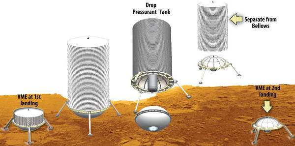
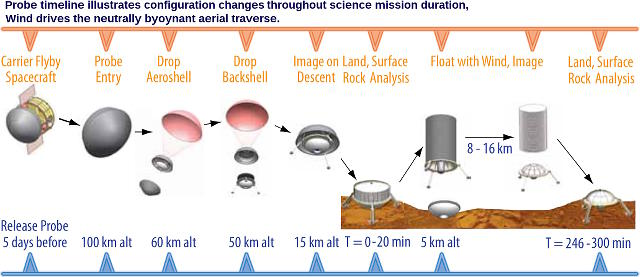
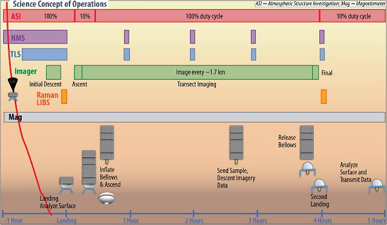
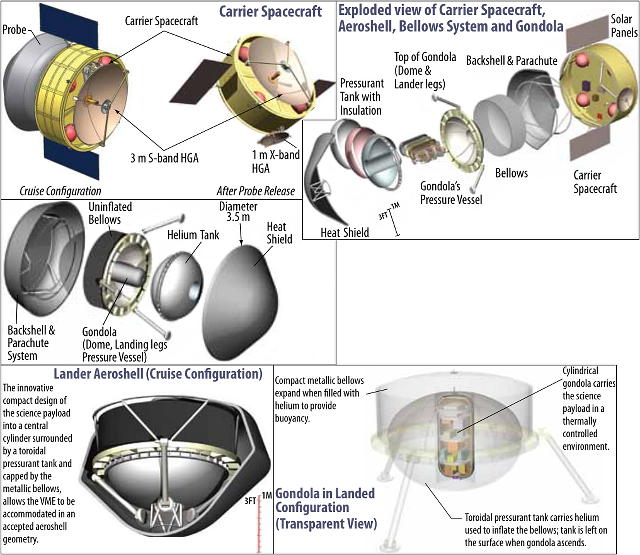

# Venus Mobile Explorer
> 2019.10.10 [🚀](../index/index.md) [despace](index.md) → [Venus](venus.md), **[Project](project.md)**

[TOC]

---

> <small>**Venus Mobile Explorer (VME)** — EN term. **Венерианский мобильный исследователь (ВМИ)** — literal RU translation.</small>

**Venus Mobile Explorer (VME)** — proposed spacecraft for contact exploration of Venus.

NASA Headquarters commissioned the Goddard Space Flight Center’s (GSFC) Architecture Design Lab with a rapid mission architecture study to support the National Research Council’s 2010 Planetary Decadal Survey Inner Planets Panel. The purpose of the study was to determine whether a Venus mission with surface, or near‑surface, mobility and realistic operational lifetime could achieve meaningful surface science at two or more independent locations separated by several kilometers on a budget comparable to a New Frontiers cost envelope.

Original of NASA’s report: 2009.12.18 ([GSFC](contact/gsfc.md), [JPL](contact/jpl.md), [ARC](contact/arc.md)).

 

|*Type*|*[Param.](si.md)*|
|:--|:--|
|**Mission:**|• • •|
|Cost|$ 1.1 ‑ 1.5 B or 29 500 — 45 600 ㎏ of [gold](sc_price.md) in 2015 prices without LV|
|[CML](cml.md) / [TRL](trl.md)|CML: 4, TRL: <mark>TBD</mark>|
|Development|… ‑ …|
|Duration|…, 2023.10.27 Venus fly-by, 2024.02.15 Landed science|
|Launch|2023.05.27, …, [Atlas V 551](atlas.md) Short Fairing|
|Operator|…|
|Programme|NRC Decadal Survey Inner Planets Panel|
|Similar to|• Proposed: …  • Current: …  • ㎩st: …|
|Target|• Determine the origin & evolution of the Venus atmosphere, & rates of exchange of key chemical species between the surface & atmosphere.  • Characterize fundamental geologic units in terms of major rock forming elements, minerals in which those elements are sited, & isotopes.  • Characterize the geomorphology & relative stratigraphy of major surface units.  • In situ measurements of Noble gas isotopes, trace gas mixing ratios & isotopic ratios.  • Identify mineralology & elemental chemistry of surface rocks in 2 locs separated by \> 8 ㎞.  • Airborne near IR imaging along a transect ~8 ㎞ in length, at < 5 m spatial resolution.  • In situ sampling of the atmosphere as functions of altitude &  time.  • Land in 2 locations, ~2 m path-length for compositional observation; stable platform for measurement duration.  • Near-surface aerial mobility; \> 45° solar incidence, contiguous images of the surface during aerial traverse; 5 hour near surface operational lifetime.|
|[Type](sc.md)|Orbiter spacecraft; lander spacecraft|
|**Spacecraft:**|• • •|
|Comms|• 3 m HGA mesh — S‑band (Lander to Carrier uplink)  • 2 omni-directional — X‑band (Carrier to Earth contingency)  • 1 m HGA solid — X‑band (Carrier to Earth Science)|
|Composition|The carrier spacecraft; the lander|
|Contractor|…|
|[ID](spaceid.md)|NSSDC ID (COSPAR ID): <mark>TBD</mark>, SCN: <mark>TBD</mark>|
|Manufacturer|…|
|Mass|Dry: 3 112 ㎏, Lander: 1 390 ㎏ ([large satellite](sc.md), [EVN‑073](venus.md))|
|Orbit / Site|…|
|Payload|• Neutral Mass Spectrometer (NMS) combined with Tunable Laser Spectrometer (TLS).  • Laser Raman/Laser Induced Breakdown Spectrometer (LIBS).  • Near infrared (~1.1 micron) imager (FOV TBD, & SNR \> 100)|
|Power|• Lander: 246 W (Max; descent) • Carrier: 355 W|

**Projected** targets & objectives:

   - **T** — technical; **C** — contact research; **D** — distant research; **F** — fly‑by; **H** — manned; **S** — soil sample return; **X** — technology demonstration
   - **Sections of measurement and observation:**
      - Atmospheric/climate — **Ac** composition, **Ai** imaging, **Am** mapping, **Ap** pressure, **As** samples, **At** temperature, **Aw** wind speed/direction.
      - General — **Gi** planet’s interactions with outer space.
      - Soil/surface — **Sc** composition, **Si** imaging, **Sm** mapping, **Ss** samples.

<small>

|*EVN‑XXX*|*T*|*EN*|*Section of m&o*|*D*|*C*|*F*|*H*|*S*|
|:--|:--|:--|:--|:--|:--|:--|:--|:--|
|EVN‑003|T|Exploration: from inside of atmosphere.| |D|C| | | |
|EVN‑006|T|Exploration: from surface.| | |C| | | |
|EVN‑010| |Atmosphere: vertical model.| |D| | | | |
|EVN‑022| |Surface: map, precise.| |D| | | | |
|EVN‑023| |Surface: mineralogical composition.| | |C| | | |
|EVN‑026| |Surface: elemental composition.| | |C| | | |
|EVN‑028| |Magnetosphere structure.| |D| |F| | |
|EVN‑032| |Atmosphere: characteristics of the CO₂ & N₂ in state of the lower layers supercritical fluid.|Ac, Ai, Am, At|D| | | | |
|EVN‑040| |Were there oceans & why have they gone| |D|C|F| | |
|EVN‑041| |Common connection between the atmosphere & the surface.| |D| | | | |
|EVN‑042| |History & causes of the planet’s volcanic & tectonic evolution.| |D| | | | |
|EVN‑044| |Surface: nature & causes of forming of the current rocks & soils.| | |C| | | |
|EVN‑052| |Role of water (fluids) in planetary geology.| |D|C|F| | |
|EVN‑055|T|Atmosphere: sample obtaining & analysis.| | |C| | | |
|EVN‑068|T|Precise landing| |C| | | | |
|EVN‑074| |Meteorological model.| |D| |F| | |
|EVN‑077| |Atmosphere: chemical elements distribution.| |D| |F| | |
|EVN‑085|T|Surface: tessera investigations, remote| |D| |F| | |
|EVN‑086|T|Surface: tessera investigations, in‑situ| | |C| | | |
|EVN‑092|T|Serve as a relay to Earth for stand‑alone SC/instruments.| |D| | | | |
|EVN‑093|T|Atmosphere/surface imaging.| |D| |F| | |

</small>

 

## Mission
The VME mission concept affords unique science opportunities and vantage points not previously attainable at Venus. The ability to characterize the surface composition and mineralogy ([EVN‑023](venus.md)) in two locations within the Venus highlands (or volcanic regions) will provide essential new constraints on the origin of crustal material, the history of water in Venus’ past, and the variability of the surface composition within the unexplored Venusian highlands. As the VME floats (~3 ㎞ above the surface) between the two surface locations, it offers new, high spatial resolution, views of the surface at near infrared (IR) wavelengths ([EVN‑022](venus.md)). These data provide insights into the processes that have contributed to the evolution of the Venus surface. The science objectives are achieved by a nominal payload that conducts in situ measurements of noble and trace gases in the atmosphere ([EVN‑077](venus.md)), conducts elemental chemistry and mineralogy at two surface locations separated by ~8–16 ㎞, images the surface on descent and along the airborne traverse connecting the two surface locations, measures physical attributes of the atmosphere ([EVN‑074](venus.md)), and detects potential signatures of a crustal dipole magnetic field ([EVN‑028](venus.md)).

Launched on an Atlas V 551 in either 2021 or 2023, the carrier spacecraft carries the VME lander to Venus on a Type II trajectory. After release from the carrier, the VME lander enters the atmosphere, descends on a parachute briefly, and then free-falls to the surface. Science is conducted on descent and at the surface ([EVN‑003](venus.md), [EVN‑006](venus.md)). While collecting data at the first site, the bellows are filled with helium and when buoyant, rise with the gondola, leaving the helium pressure tank on the surface. Driven by the ambient winds, the gondola floats with the bellows for ~220 minutes, conducting additional science. At the completion of the 8 – 16 ㎞ aerial traverse, the bellows are jettisoned and the gondola free falls back to the surface, where final surface science measurements are performed.

The total mission time in the Venus atmosphere is 6 hours, which includes 5 hours in the near surface environment. The VME lander transmits data to the fly‑by carrier spacecraft continuously throughout the 6-hour science mission ([EVN‑092](venus.md)). After losing contact with the VME lander, the carrier spacecraft then relays all data back to Earth.

The scientifically compelling highland regions known as tessera hold the most potential for providing new insight into the thermal evolution of the Venus interior, including the possibility of the preservation of ancient continental crust and the role of water in Venus’ past ([EVN‑052](venus.md)). The ability to sample the major elements and mineralogy (particularly SiO₂, FeO, MgO, S-bearing, and OH-bearing minerals) of such surfaces in multiple locations decreases statistical sampling uncertainty ([EVN‑086](venus.md)). Imaging these unique terrains in optical wavelengths at very high spatial resolutions will provide new insights into the physical processes that have contributed to the evolution of the Venus surface ([EVN‑085](venus.md), [EVN‑093](venus.md)). Because of the super-critical CO₂ lower atmosphere, illumination is extremely diffuse (dominated by Rayleigh scattering) and there are no shadows at the Venus surface ([EVN‑032](venus.md)).

***Significant Mission Events:***

|*Date*|*Event*|*Delta V/Comments*|
|:--|:--|:--|
|May 27, 2023|Launch|30 ㎧ Earth to Venus TCMs|
|October 27, 2023|First Venus Fly‑by|45 ㎧ Venus to Venus TCMs|
|February 10, 2024|Lander Release|Flexibility in exact time +/‑day|
|February 11, 2024|Spacecraft Divert Maneuver|127 ㎧ Timeline criticality +/‑day|
|February 15, 2024, 07:12 UTC|Lander atmospheric entry interface|(175 ㎞ altitude, -19.0 deg. EFPA)|
|February 15, 2024, 08:17 UTC|1st Landing|(Approximately 2 degrees from entry interface location)|
|February 15, 2024, 10:42 UTC|Carrier Fly‑by Periapsis|N/A|
|February 15, 2024, 12:23 UTC|2nd Landing|N/A|
|February 15, 2024, 13:17 UTC|End of Lander Design Lifetime|N/A|

 

## Science goals & payload
**SCIENCE GOALS**

The driving science requirements that led to the VME design are:

   - elemental and mineralogical measurements in two different locations separated by >8 ㎞;
   - contiguous nadir-viewing, high spatial resolution images of the surface along the >8 ㎞ transverse connecting the two surface locations.

VME’s primary science objectives are a subset of those defined by VEXAG and are shown, in priority order, below.

|*Science Objective*|*Measurement*|*Instrument*|*Functional Requirement*|
|:--|:--|:--|:--|
|Determine whether Venus has a secondary atmosphere resulting from late bombardment and the introduction of significant outer-solar system materials, including volatiles|Measure atmospheric Noble gas isotopes in situ|Neutral Mass Spectrometer|In situ sample of atmosphere — 1 bulk sample on descent ([EVN‑055](venus.md))|
|Characterize major geologic units in terms of major elements, rock forming minerals in which those elements are sited, and isotopes|Identify mineralogy (SiO₂, FeO, MgO, sulfur bearing, OHbearing) and elemental chemistry of surface rocks ([EVN‑023](venus.md), [EVN‑026](venus.md)) in ≥ 2 surface locations (separated by > 8 ㎞)|Raman/LIBS|Land in ≥ 2 locations; ~ 2 m path-length for observation; stable platform for measurement duration|
|Characterize the morphology and relative stratigraphy of surface units ([EVN‑044](venus.md))|Near IR imaging along an airborne traverse > 8 ㎞ in length, at < 5 m spatial resolution|Near-infrared (~1.1 micron) imager with field of view TBD and SNR > 100|Near surface aerial mobility (bellows); Nadir-looking position on gondola to image the surface; platform stability for non-blurred images; > 45° solar incidence angle, acquire contiguous images of the surface during aerial traverse > 8 ㎞ (requires ~5 h lifetime|
|Determine the rates of exchange of key chemical species (S, C, O) between the surface and atmosphere ([EVN‑041](venus.md))|Measure trace gases in the near surface atmosphere (within one scale height)|Neutral Mass Spectrometer; Tunable Laser Spectrometer|In situ sampling of atmosphere as functions of altitude and time [f(z,t)]([EVN‑055](venus.md))|
|Place constraints on the size and temporal extent of a possible ocean in Venus’s past ([EVN‑040](venus.md))|Measure D/H ratio in atmospheric water, at least twice|Neutral Mass Spectrometer; Tunable Laser Spectrometer|In situ sampling of atmosphere [f(z,t)]([EVN‑055](venus.md))|
|Characterize variability in physical parameters of the near surface atmosphere (pressure, temperature, winds) ([EVN‑074](venus.md))|Atmospheric temperature, pressure, winds|Temperature, pressure, accelerometers, USO|In situ measurements of T/P, Doppler measurement using communications system for winds|
|Measure ambient magnetic field from lowand near‑surface elevations ([EVN‑028](venus.md))|Detection of existence or absence of surface magnetic signal|Flux‑gate magnetometer|Must be able to detect surface «signal» above a 5-10 nT threshold, over and above any payload «noise»|

**PAYLOAD**

Instrument Resource Summary – the instruments in this table represent a notional instrument payload and to the extent possible, existing or proposed instruments were selected for which resources are known or have already been estimated. With the exception of the SAM heritage instruments, there is a substantial uncertainty associated with these numbers.

| |*Mass (kg)*|*Power (watts)*|*Volume (cm)*|*Data Volume*|*TRL/Heritage*|*Description*|
|:--|:--|:--|:--|:--|:--|:--|
|Neutral Mass Spectrometer (NMS)|11|50|26 x 16 x 19|2 kbps|6-7 MSL/SAM|Provides in situ measurement of noble gas isotopes and multiple trace gas mixing ratios. The instrument consists of three modules: an ion source to convert gas phase sample molecules into ions; a mass analyzer, which applies electromagnetic fields to sort the ions by mass; and a detector, which measures the abundance of each ion present.|
|Tunable Laser Spectrometer (TLS)|4.5|17|25 x 10 x 10|3.4 kbps|6-7 MSL/SAM|Measures trace gases, including multiple isotopes of sulfur and hydrogen-bearing species. The TLS measures the Deuterium/Hydrogen ratio in atmospheric water via measurement of molecular line parameters for infrared molecular absorption lines. Utilizing extremely small tunable laser spectrometers with room-temperature laser detector arrays in a Herriott cell configuration, TLS provides multi-wavelength in situ measurements of the Venusian atmosphere.|
|Raman/Laser Induced Breakdown Spectroscopy (LIBS)|6.0|6.7|CCD & preamps: 19 x 14 x 19, Optical Head: 08 x 07 x 10, Electronics: 08 x 10 x 40|1.5 Mb/sample|4/ExoMars|It is a combined instrument, utilizing a single laser and a single telescope to provide mineralogy and elemental chemistry of surface rocks. Raman illuminates the remotely located (~2 m away or less) sample with a low power laser pulse and observes the scattered return to determine the vibrational modes of the chemical bonds in the target. LIBS utilizes this same laser at a higher power level to vaporize and ionize a portion of the target material, creating a plasma. By measuring the intensity and energy of the photons emitted by the plasma, the elemental chemical composition of the sample can be inferred.|
|Near-IR Imager|1.8|12|17 x 09 x 09|1.65 Mb/image|6/Venus Flagship|Points in the nadir direction and acquires images during the initial descent, the aerial traverse between the landing sites, and during the second descent. Images of the area the Raman/LIBS will sample are recorded during the final moments of each descent, providing additional information about the site prior to landing. The camera requires a 10 ㎝ viewing window, which is shared with the Raman/LIBS instrument. The 1 k × 1 k Focal Plane Assembly (FPA) has a 2 ㎞ square field of view at 2 ㎞ above the surface (50° FOV) or 2 m pixel size. It also has a mechanism that allows it to refocus by moving the FPA; enabling near surface imaging.|
|Magnetometer|1.0|1.0|20 x 10 x 10|0.1 kbps|6/Various|Triaxial Fluxgate Magnetometer determines the presence or absence of a planetary magnetic field. This instrument is inside the lander.|
|Atmospheric Structure Investigation (ASI)|2.0|3.2|10 x 10 x 10|2.5 kbps (descent) 0.25 kbps (surface)|6/Venus Flagship|Has sensors located on the outside of the lander that are used to characterize gross atmospheric properties, including temperature and pressure. This package consists of a temperature sensor, a pressure transducer, and an accelerometer.|

 

## Spacecraft
**CARRIER**

The study team developed an elegant, volume efficient cylindrical gondola to accommodate the science payload in a thermally controlled environment. An innovative, highly compact design surrounds the gondola with a toroidal pressure tank capped with the bellows, enabling the entire lander system to fit in an aeroshell with heritage geometry. The thermal design uses heat pipes and phase change material that enable the gondola electronics and instruments to survive 5 hours near the Venus surface, thus providing sufficient time for surface chemistry and an aerial traverse >8 ㎞ in the current‑like winds.

Solar arrays measure ~1.2 m² per side (balancing for 5 RPM spacecraft spin up) and are attached to single axis actuators, allowing the carrier to slew about the actuator axis. The secondary (rechargeable Lithium-ion) battery is small, as no significant eclipse is expected.

Fuel mass 366 ㎏ (hydrazine). Using small thrusters versus reactions wheels to achieve three‑axis stabilization saves mass, volume, and power.

The carrier communication sub-system includes a 3 m low mass mesh S‑band antenna for uplink communication with the lander, and a smaller 1 m solid X‑band antenna for downlink Deep Space Network communication. Two X– band omni-directional antennas allow the carrier spacecraft to be commandable at all times.

**ENTRY AND DESCENT ELEMENT**

The Entry and Descent Element is composed of the aeroshell, parachute, and deployment mechanisms. The aeroshell structure and thermal protection system materials are designed to sustain the high deceleration loads up to ~167 ***g*** during entry.

The 19° Entry Flight Path Angle and entry velocity of 11.3 ㎞/s were selected to minimize ***g***-loads and total heat load on the heat shield. After withstanding peak deceleration and heating, the parachute is deployed at 60 ㎞, and the heat shield is separated from the lander using explosive separation bolts. After, the parachute and backshell are severed from the lander element, completing payload extraction.

The monocoque 3.5 m diameter, 45° sphere cone aeroshell, encapsulates the lander, supports launch and entry loads, and enables safe and reliable atmospheric extraction of the lander.

The heat shield TPS consists total tape wrapped and chopped molded carbon phenolic (TWCP and CMCP) onto the honeycomb structure. CMCP and TWCP are the only materials flight-qualified for the severe conditions of Venus entry.

**LANDER**

The structural system design accommodates the high performance thermal control system, which includes isolation and insulation systems, heat pipes, and Phase Change Materials.

To accommodate the two landings and aerial mobility, the structure is designed to support a large helium tank and an inflatable bellows assembly.

The gondola primary structure is a hermetically sealed pressure vessel to prevent the influx of Venusian atmosphere. The primary structure is designed to handle the deceleration loads (worst case 167 ***g***) on the probe during the Venus atmosphere entry phase and a 10 ㎧ expected impact velocity for each landing. The leg system allows a dampened stroke, reducing the landing loads to 34 ***g***.

**Table.** Mass Breakdown <mark>(there are unclear mistakes in masses, but still these are masses from the original report)</mark>

|*Component*|*CBE, ㎏*|*Allow, %*|*Max Mass, ㎏*|
|:--|:--|:--|:--|
|Spacecraft (carrier) Wet|1 212|21|1 470|
|░╟ Spacecraft (carrier)|846|30|1 100|
|░╙ Fuel|366|1|370|
|Probe|1 390|30|1 782|
|░╟ Aeroshell|876|30|1 139|
|░╙ Lander|1 390|30|1 782|
|░░░╟  Lander Science Payload|31|30|41|
|░░░╟  Bellows|890|30|1 132|
|░░░╙  Lander Subsystems|469|30|609|
|░░░░░╟ Mechanical/Structure|270|30|351|
|░░░░░╟ Mechanisms|51|30|66|
|░░░░░╟ Thermal|113|30|147|
|░░░░░╙ Other|34|30|44|
|**Satellite (SC+Probe) Dry**|**3 112**|**29**|**4 021**|
|**Satellite Wet**|**3 478**|**26**|**4 390**|
|LV throw mass| | |5 141|

**Radiolink**

   - 3 m HGA mesh, S‑band, Probe to Carrier uplink
   - 2 omni-directional, X‑band, Carrier to Earth contingency
   - 1 m HGA solid, X‑band, Carrier to Earth Science

 

## Community, library, links

**PEOPLE:**

   1. Michael L. Adams — Study lead
   1. Michael J. Amato — Planetary & Lunar buisness lead
   1. [Charles L. Baker](person.md) — Study systems lead
   1. [Lori S. Glaze](person.md) — Science champion
   1. Gabriel Karpati — Decadal studies system lead

**COMMUNITY:**

<mark>TBD</mark>

 

## Docs & links
|Navigation|
|:--|
|**[FAQ](faq.md)**【**[SCS](scs.md)**·КК, **[SC (OE+SGM)](sc.md)**·КА】**[CON](contact.md)·[Pers](person.md)**·Контакт, **[Ctrl](control.md)**·Упр., **[Doc](doc.md)**·Док., **[EF](ef.md)**·ВВФ, **[Error](error.md)**·Ошибки, **[Event](event.md)**·События, **[FS](fs.md)**·ТЭО, **[HF&E](hfe.md)**·Эрго., **[KT](kt.md)**·КТ, **[Model](model.md)**·Модель, **[N&B](nnb.md)**·БНО, **[Project](project.md)**·Проект, **[QM](qm.md)**·БКНР, **[R&D](rnd.md)**·НИОКР, **[SI](si.md)**·СИ, **[Test](test.md)**·ЭО, **[TRL](trl.md)**·УГТ, **[Way](way.md)**·Пути|
|*Sections & pages*|
|**【】**  <mark>NOCAT</mark>|

   1. Docs:
      - [Venus Mobile Explorer ❐](f/project/v/venus_mobile_explorer/20091218_nasa_venus_mobile_explorer.pdf) (NASA, 2009)
   1. Notable interwikies — …
   1. <https://solarsystem.nasa.gov/studies/200/venus-mobile-explorer/>
   1. <https://www.researchgate.net/publication/326559184_Future_of_Venus_Research_and_Exploration>
