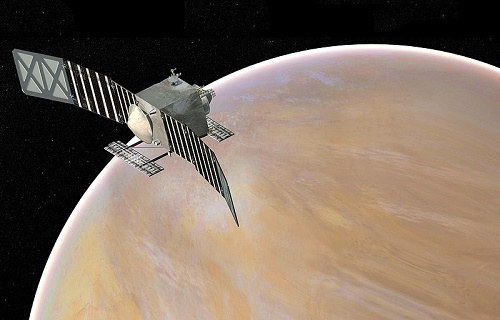

# VERITAS
> … Категории: **** <mark>NOCAT</mark>

[TOC]

---

> <small>*Terms:* **VERITAS (Venus Emissivity, Radio Science, InSAR, Topography, and Spectroscopy)** — English term with no analogues in Russian. **ВЕРИТАС** — rough Russian equivalent.</small>

**VERITAS (Venus Emissivity, Radio Science, InSAR, Topography, and Spectroscopy)** is a proposed mission concept by NASA’s Jet Propulsion Laboratory (JPL) to map with high resolution the surface of planet Venus  ([EVN‑005](venus.md)).

|*Type*|*[Param.](si.md)*|
|:--|:--|
|**Mission:**|• • •|
|Cost| $450M or 10 051 kg of [gold](sc_price.md) in 2019 prices |
|[CML](cml.md) / [TRL](trl.md)| CML: <mark>TBD</mark>, TRL: <mark>TBD</mark> |
|Development| 2019 ‑ … |
|Duration| 2 years (proposed) |
|Launch| 2021 (proposed) |
|Operator| NASA’s JPL |
|Programme| Discovery Program |
|Similar to| • Proposed: [EnVision](envision.md)  • Current: …  • Past: [Venera 15, Venera 16](venera_15_16.md), [Magellan](магеллан.md) |
|Target| Would produce global, high resolution topography and imaging of Venus’ surface |
|[Type](sc.md)| Orbiter spacecraft |
|**Spacecraft:**|• • •|
|Composition| Orbiter |
|Contractor| … |
|Manufacturer| … |
||**`…`**|
|Comms| … |
|[ID](spaceid.md)| NSSDC ID (COSPAR ID): <mark>TBD</mark>, SCN: <mark>TBD</mark> |
|Mass| … ([…satellite](sc.md)) |
|Orbit / Site| … |
|Power| … |
|Payload| Emissivity Mapper, Interferometric Synthetic Aperture Radar |

**Projected** targets & objectives:

   - **T** — technical; **C** — contact research; **D** — distant research; **F** — fly‑by; **H** — manned; **S** — soil sample return; **X** — technology demonstration
   - **Sections of measurement and observation:**
      - Atmospheric/climate — **Ac** composition, **Ai** imaging, **Am** mapping, **Ap** pressure, **As** samples, **At** temperature, **Aw** wind speed/direction.
      - General — **Gi** planet’s interactions with outer space.
      - Soil/surface — **Sc** composition, **Si** imaging, **Sm** mapping, **Ss** samples.

<small>

|*EVN‑XXX*|*T*|*EN*|*Section of m&o*|*D*|*C*|*F*|*H*|*S*|
|:--|:--|:--|:--|:--|:--|:--|:--|:--|
|EVN‑005|T|Exploration: from Venusian orbit.|  |D||F|||
|EVN‑022||Surface: map, precise.|  |D|||||
|EVN‑024||Surface: composition.|  ||C||||
|EVN‑029||Is Venus geologically active?|  |D|C|F|||
|EVN‑042||History & causes of the planet’s volcanic & tectonic evolution.|  |D|||||
|EVN‑052||Role of water (fluids) in planetary geology.|  |D|C|F|||
|EVN‑055|T|Atmosphere: sample obtaining & analysis.|  ||C||||
|EVN‑078|T|Atmosphere: radiography.|  |D|||||
|EVN‑089||Measuring the planetary gravitational field.|  |D||F|||

</small>

 

## Mission
VERITAS would produce global, high resolution topography and imaging of Venus’ surface ([EVN‑022](venus.md)) and produce the first maps of deformation and global surface composition ([EVN‑024](venus.md)), thermal emissivity, and gravity field ([EVN‑089](venus.md)). It would also attempt to determine if Venus hosted ancient aqueous environments ([EVN‑052](venus.md)). Also, current data are highly suggestive of recent and active volcanism and this mission could determine if current volcanism is limited to mantle plume heads or is more widespread ([EVN‑029](venus.md)).

High resolution imagery would be obtained by using an X‑band ([EVN‑078](venus.md)) radar configured as a single pass interferometric synthetic aperture radar (InSAR) coupled with a multispectral near‑infrared (NIR) emissivity mapping capability. VERITAS would map surface topography with a spatial resolution of 250 m and 5 m vertical accuracy, and generate radar imagery with 30 m spatial resolution ([EVN‑022](venus.md)).

The combination of surface topography and image data would provide knowledge of Venus’ tectonic and impact history, the timing and mechanisms of volcanic resurfacing, and the mantle processes responsible for them ([EVN‑042](venus.md)).

It is part of the Discovery Program, and it was one of the finalists for Discovery 13 and 14. In the selection, the Lucy and Psyche spacecraft were selected as the next missions. The total allocated budget for the winners was $450M. On February 13, 2020, it joined the Discovery 15 and 16 finalists.

 

## Science goals & payload
**GOALS:**

   1. understand Venus’ geologic evolution;
   1. determine what geologic processes are currently operating;
   1. find evidence for past or present water.

The primary mission goals require two instruments and a gravity science investigation over a 2-year orbital mission.

|*Instrument*|*Description*|
|:--|:--|
| Venus Emissivity Mapper (VEM) | Would map surface emissivity using six spectral bands in five atmospheric windows that see through the clouds. |
| Venus Interferometric Synthetic Aperture Radar (VISAR) | would generate a DEM (digital elevation model) with an accuracy of 250 m horizontal by 5 m height. |

Gravity science would be carried out using the spacecraft’s telecom system ([EVN‑089](venus.md)). The mission design also would enable the opportunity to send a nanosat probe into the atmosphere of Venus, carrying a mass spectrometer to sample the noble gases and their isotopes ([EVN‑055](venus.md)).

 

## Spacecraft
<mark>TBD</mark>

 

## Community, library, links

**PEOPLE:**

   1. [Suzanne Smrekar](zz_smrekar1.md) — The VERITAS Principal Investigator (JPL)
   1. Michael Lisano — Project Systems Engineer (JPL)
   1. Noah Suzara — Project proposal cost estimating contributor (2019, JPL)

**COMMUNITY:**

<mark>TBD</mark>

 

## Docs & links
|…°·•¹²³±×÷≤≥≈≠ ‑ −— ⎆✉ ❐“”’«»✔→✘☐☑├┕┆ 1 lb = 0.453592 kg; 1 g = 9.80665 m/s²|
|:--|
|<small>**[FAQ](faq.md)**, **[Cable](cable.md)**·БКС, **[Camera](camera.md)**·Камера, **[Comms](comms.md)**·Радио, **[Contact](contact.md)**·Контакт, **[Control](control.md)**·Управ., **[Doc](doc.md)**·Док., **[Doppler](doppler.md)**·ИСР, **[DS](ds.md)**·ЗУ, **[EB](eb.md)**·ХИТ, **[ECO](ecology.md)**·Экол., **[EF](ef.md)**·ВВФ, **[ElC](elc.md)**·ЭКБ, **[EMC](emc.md)**·ЭМС, **[Errors](error.md)**·Ошибки, **[Events](event.md)**·События, **[FS](fs.md)**·ТЭО, **[Fuel](fuel.md)**·Топливо, **[GNC](gnc.md)**·БКУ, **[GS](scs.md)**·НС, **[HF&E](hfe.md)**·Эрго., **[IU](iu.md)**·Гиро., **[KT](kt.md)**·КТЕХ, **[LAG](lag.md)**·ПУC, **[LES](les.md)**·САСП, **[LS](ls.md)**·СЖО, **[LV](lv.md)**·РН, **[MCC](mcc.md)**·ЦУП, **[Model](model.md)**·Модель, **[MSC](sc.md)**·ПКА, **[N&B](nnb.md)**·БНО, **[NR](nr.md)**·ЯР, **[OBC](obc.md)**·ЦВМ, **[OE](oe.md)**·БА, **[Pat.](патент.md)**·Патент, **[Project](project.md)**·Проект, **[PS](ps.md)**·ДУ, **[QA](quality.md)**·QA, **[R&D](rnd.md)**·НИОКР, **[RAMS](rams.md)**·НиБ, **[Risk](risk.md)**·Риск, **[Robot](robotics.md)**·Робот, **[Rover](rover.md)**·Планетоход, **[RTG](rtg.md)**·РИТЭГ, **[SARC](sarc.md)**·ПСК, **[Sensor](sensor.md)**·Датчик, **[SC](sc.md)**·КА, **[SCS](scs.md)**·КК, **[SGM](sgm.md)**·КММ, **[SI](si.md)**·СИ, **[Soft](soft.md)**·ПО, **[SP](sp.md)**·БС, **[Spaceport](spaceport.md)**·Космодром, **[SPS](sps.md)**·СЭС, **[SSS](sss.md)**·ГЗУ, **[TCS](tcs.md)**·СОТР, **[Test](test.md)**·ЭО, **[Timeline](timeline.md)**·Циклограмма, **[TMS](tms.md)**·ТМС, **[TOR](tor.md)**·ТЗ, **[TRL](trl.md)**·УГТ</small>|
|*Sections & pages*|
|**··•  •··**  <mark>NOCAT</mark> |

   1. Docs: …
   1. Notable interwikies — …
   1. <https://en.wikipedia.org/wiki/VERITAS_(spacecraft)>
