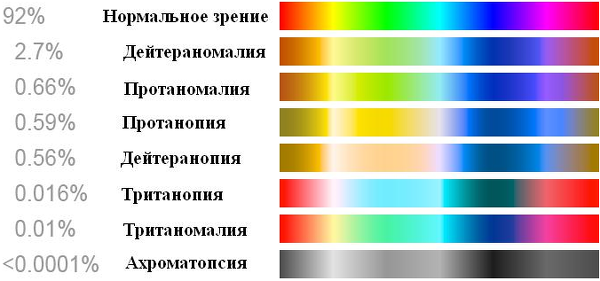

# Зрение
> 2019.05.12 [🚀](../index/index.md) [despace](index.md) → [Project](project.md), [Радиосвязь](comms.md)

[TOC]

---

> <small>**Зрение** — русскоязычный термин. **View** — англоязычный эквивалент.</small>

**Зрение** — возможность живого существа или машины видеть окружающий мир в определённом [спектре](comms.md).

<mark>TBD</mark>

## Зрение человека

### Дальтонизм
**Дальтони́зм**, цветовая слепота, — наследственная, реже приобретённая, особенность зрения человека и приматов, выражающаяся в сниженной или полной неспособности различать цвета.

|Клинические проявления|
|:--|
||

## Зрение машины
<mark>TBD</mark>

## Как это можно использовать?:
Ниже приведены практические рекомендации использования вышеуказанных данных.
   1. В связи с возможным дальтонизмом для визуализации 3D-моделей и презентаций рекомендуется использовать ограниченный набор цветов.

 

## Docs & links (TRANSLATEME ALREADY)
|Navigation|
|:--|
|**[FAQ](faq.md)**【**[SCS](scs.md)**·КК, **[SC (OE+SGM)](sc.md)**·КА】**[CON](contact.md)·[Pers](person.md)**·Контакт, **[Ctrl](control.md)**·Упр., **[Doc](doc.md)**·Док., **[Drawing](drawing.md)**·Чертёж, **[EF](ef.md)**·ВВФ, **[Error](error.md)**·Ошибки, **[Event](event.md)**·События, **[FS](fs.md)**·ТЭО, **[HF&E](hfe.md)**·Эрго., **[KT](kt.md)**·КТ, **[N&B](nnb.md)**·БНО, **[Project](project.md)**·Проект, **[QM](qm.md)**·БКНР, **[R&D](rnd.md)**·НИОКР, **[SI](si.md)**·СИ, **[Test](test.md)**·ЭО, **[TRL](trl.md)**·УГТ, **[Way](way.md)**·Пути|
|*Sections & pages*|
|**【[Project](project.md)】**  [Interferometer](interferometer.md)・ [NASA open](nasa_open.md)・ [NASA STI](nasa_sti.md)・ [NIH](nih.md)・ [Past, future and everything](pfaeverything.md)・ [PSDS](us_psds.md) [MGSC](mgsc.md)・ [Raman spectroscopy](raman_spsc.md)・ [SC price](sc_price.md)・ [SC typical forms](sc.md)・ [Tech derivative laws](td_laws.md)・ [View](view.md)・ [XRF](xrf.md)|
|**【[Communications](comms.md)】**  [CCSDS](ccsds.md)・ [Антенна](antenna.md)・ [АФУ](afdev.md)・ [Битрейт](bitrate.md)・ [ВОЛП](ofts.md)・ [ДНА](дна.md)・ [Диапазоны частот](comms.md)・ [Зрение](view.md)・ [Интерферометр](interferometer.md)・ [Информация](info.md)・ [КНД](directivity.md)・ [Код Рида‑Соломона](rsco.md)・ [КПДА](antenna.md)・ [КСВ](swr.md)・ [КУ](ку.md)・ [ЛКС, АОЛС, FSO](fso.md)・ [Несущий сигнал](carrwave.md)・ [ПНА, ПОНА, ПСНА](devd.md)・ [Помехи](emi.md) (EMI, RFI)・ [Последняя миля](last_mile.md)・ [Регламент радиосвязи](comms.md)・ [СИТ](etedp.md)・ [Фидер](feeder.md)  • • •  **РФ:** [БА КИС](ба_кис.md) (21)・ [БРК](brk_lav.md) (12)・ [РУ ПНИ](ру_пни.md) ()・ [HSXBDT](comms_lst.md) (1.8)・ [CSXBT](comms_lst.md) (0.38)・ [ПРИЗЫВ-3](comms_lst.md) (0.17) *([ПРИЗЫВ-1](comms_lst.md) (0.075))*|

   1. Docs: …
   1. <https://ru.wikipedia.org/wiki/Зрительная_система>
   1. <https://ru.wikipedia.org/wiki/Дальтонизм>
