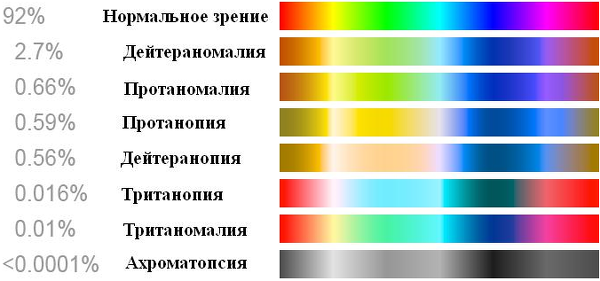

# Зрение
> 2019.05.12 **[🚀](../index/index.md) [despace](index.md)** → **[Project](project.md)**, [Радиосвязь](comms.md)

[TOC]

---

> <small>*Термины:* **Зрение** — русскоязычный термин. **View** — англоязычный эквивалент.</small>

**Зрение** — возможность живого существа или машины видеть окружающий мир в определённом [спектре](rf.md).

<mark>TBD</mark>

## Зрение человека

### Дальтонизм
**Дальтони́зм**, цветовая слепота, — наследственная, реже приобретённая, особенность зрения человека и приматов, выражающаяся в сниженной или полной неспособности различать цвета.

| Клинические проявления |
|:--|
|  |

## Зрение машины
<mark>TBD</mark>

## Как это можно использовать?
Ниже приведены практические рекомендации использования вышеуказанных данных.
   1. В связи с возможным дальтонизмом для визуализации 3D-моделей и презентаций рекомендуется использовать ограниченный набор цветов.

 

## Docs & links (TRANSLATEME ALREADY)
|…°·•¹²³±×÷≤≥≈≠ ‑ −— ⎆✉ ❐“”’«»✔→✘☐☑├┕┆ 1 lb = 0.453592 kg; 1 g = 9.80665 m/s²|
|:--|
|<small>**[FAQ](faq.md)**, **[Cable](cable.md)**·БКС, **[Camera](cam.md)**·Камера, **[Comms](comms.md)**·Радио, **[Contact](contact.md)**·Контакт, **[Control](control.md)**·Упр., **[Doc](doc.md)**·Док., **[Doppler](doppler.md)**·ИСР, **[DS](ds.md)**·ЗУ, **[EB](eb.md)**·ХИТ, **[ECO](ecology.md)**·Экол., **[EF](ef.md)**·ВВФ, **[ElC](elc.md)**·ЭКБ, **[EMC](emc.md)**·ЭМС, **[Error](error.md)**·Ошибки, **[Event](event.md)**·События, **[FS](fs.md)**·ТЭО, **[Fuel](fuel.md)**·Топливо, **[GNC](gnc.md)**·БКУ, **[GS](scs.md)**·НС, **[HF&E](hfe.md)**·Эрго., **[IU](iu.md)**·Гиро., **[KT](kt.md)**·КТЕХ, **[LAG](lag.md)**·ПУC, **[LES](les.md)**·САСП, **[LS](ls.md)**·СЖО, **[LV](lv.md)**·РН, **[MCC](mcc.md)**·ЦУП, **[Model](model.md)**·Модель, **[MSC](sc.md)**·ПКА, **[N&B](nnb.md)**·БНО, **[NR](nr.md)**·ЯР, **[OBC](obc.md)**·ЦВМ, **[OE](oe.md)**·БА, **[Pat.](патент.md)**·Патент, **[Project](project.md)**·Проект, **[PS](ps.md)**·ДУ, **[R&D](rnd.md)**·НИОКР, **[SRRQ](srrq.md)**·БКНР, **[Robot](robotics.md)**·Робот, **[Rover](rover.md)**·Планетоход, **[RTG](rtg.md)**·РИТЭГ, **[SARC](sarc.md)**·ПСК, **[Sensor](sensor.md)**·Датчик, **[SC](sc.md)**·КА, **[SCS](scs.md)**·КК, **[SGM](sgm.md)**·КММ, **[SI](si.md)**·СИ, **[Soft](soft.md)**·ПО, **[SP](sp.md)**·БС, **[Spaceport](spaceport.md)**·Космодром, **[SPS](sps.md)**·СЭС, **[SSS](sss.md)**·ГЗУ, **[TCS](tcs.md)**·СОТР, **[Test](test.md)**·ЭО, **[Timeline](timeline.md)**·ЦГМ, **[TMS](tms.md)**·ТМС, **[TOR](tor.md)**·ТЗ, **[TRL](trl.md)**·УГТ</small>|
|*Sections & pages*|
|**··• [Project](project.md) •··**  [Interferometer](interferometer.md) ┊ [NASA open](nasa_open.md) ┊ [NASA STI](nasa_sti.md) ┊ [NIH](nih.md) ┊ [Past, future and everything](pfaeverything.md) ┊ [PSDS](us_psds.md) [MGSC](mgsc.md) ┊ [Raman spectroscopy](raman_spsc.md) ┊ [SC price](sc_price.md) ┊ [SC typical forms](sc_ts.md) ┊ [Tech derivative laws](td_laws.md) ┊ [View](view.md) ┊ [XRF](xrf.md)|
|**`Радиосвязь:`**  [CCSDS](ccsds.md) ┊ [Антенна](antenna.md) ┊ [АФУ](afdev.md) ┊ [Битрейт](bitrate.md) ┊ [ВОЛП](ofts.md) ┊ [ДНА](дна.md) ┊ [Диапазоны частот](rf.md) ┊ [Зрение](view.md) ┊ [Интерферометр](interferometer.md) ┊ [Информация](info.md) ┊ [КНД](directivity.md) ┊ [Код Рида‑Соломона](rsco.md) ┊ [КПДА](antenna_ap.md) ┊ [КСВ](swr.md) ┊ [КУ](ку.md) ┊ [ЛКС, АОЛС, FSO](fso.md) ┊ [Несущий сигнал](carrwave.md) ┊ [ПНА, ПОНА, ПСНА](aiad.md) ┊ [Помехи](emi.md) (EMI, RFI) ┊ [Последняя миля](last_mile.md) ┊ [Регламент радиосвязи](rr.md) ┊ [СИТ](etedp.md) ┊ [Фидер](feeder.md)  • • •  **РФ:** [БА КИС](ба_кис.md) (21) ┊ [БРК](brk_lav.md) (12) ┊ [РУ ПНИ](ру_пни.md) () ┊ [HSXBDT](hsxbdt.md) (1.8) ┊ [CSXBT](csxbt.md) (0.38) ┊ [ПРИЗЫВ-3](prizyv_3.md) (0.17) *([ПРИЗЫВ-1](prizyv_1.md) (0.075))*|

   1. Docs: …
   1. Notable interwikies — …
   1. <https://ru.wikipedia.org/wiki/Зрительная_система>
   1. <https://ru.wikipedia.org/wiki/Дальтонизм>
