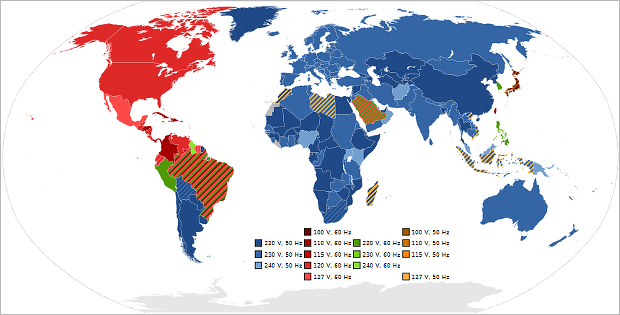

# Напряжение
> 2019.05.12 ┊ **🚀 [despace](index.md)** → **[SPS](sps.md)**

[TOC]

---

> <small>*Термины:*  
> **Напряжение / Напряжение электрическое** — русскоязычный термин. **Voltage** — англоязычный эквивалент.</small>  
> <small>**Номинальное напряжение** — русскоязычный термин. **Nominal voltage** — англоязычный эквивалент.</small>

**Электри́ческое напряже́ние** между точками A и B электрической цепи или электрического поля — физическая величина, значение которой равно работе эффективного электрического поля (включающего сторонние поля), совершаемой при переносе единичного пробного электрического заряда из точки A в точку B.

**Номинальное напряжение** — это базисное напряжение из стандартизированного ряда напряжений, определяющих уровень изоляции сети и электрооборудования. Действительные напряжения в различных точках системы могут несколько отличаться от номинального, однако они не должны превышать наибольшие рабочие напряжения, установленные для продолжительной работы.

**Номинальным напряжением** у источников и приёмников электроэнергии (генераторов, трансформаторов) называется такое напряжение, на которое они рассчитаны в условиях нормальной работы. Номинальные напряжения электрических сетей и присоединяемых к ним источников и приёмников электрической энергии устанавливаются [ГОСТом](doc.md).

## Номиналы
Ниже приведены применяемые номиналы напряжений.

|*Страна*| <small>*Напряжение, В*</small> |*Комментарии*|
|:--|:--|:--|
|**Европа**  |  230  |  |
||||
|**Индия**  |  <mark>TBD</mark>  |  |
||||
|**Китай**  |  <mark>TBD</mark>  |  |
||||
|**Россия**  |  5‑12  | Напряжение на входе мелких [ЭРИ](elc.md), датчиков, схем.  |
|  |  27  | Напряжение на входе большинства приборов КА. В СССР были авиационные ГОСТы, где было 27 В. С тех пор по привычке. А ещё ниже 27 В не возникает дуга между контактами.  |
|  |  100  | Для работы с зарубежными приборами.  |
|  |  220‑240  | В розетках.  |
||||
|**США**  |  110‑120  | Унификация с авиационной промышленностью, да и вообще в США в розетках везде 110 В.  |
||||
|**Япония**  | 100  |  |

The voltage produced by each electrochemical cell in a battery is determined by the chemistry of that cell. Cells can be combined in series for multiples of that voltage, or additional circuitry added to adjust the voltage to a different level. Mechanical generators can usually be constructed to any voltage in a range of feasibility.

Nominal voltages of familiar sources:

   - Nerve cell resting potential: ~75 mV
   - Single-cell, rechargeable NiMH or NiCd battery: 1.2 V
   - Single-cell, non-rechargeable (e.g., AAA, AA, C and D cells): alkaline battery: 1.5 V; zinc-carbon battery: 1.56 V if fresh and unused
   - LiFePO₄ rechargeable battery: 3.3 V
   - Cobalt-based Lithium polymer rechargeable battery: 3.75 V (see Comparison of commercial battery types)
   - Transistor-transistor logic/CMOS (TTL) power supply: 5 V
   - USB: 5 V DC
   - PP3 battery: 9 V
   - Automobile battery systems are 2.1 volts per cell; a “12V” battery is 6 cells or 12.6V; a “24V” battery is 12 cells or 25.2V. Some antique vehicles use “6V” 3-cell batteries or 6.3 volts.
   - Electric vehicle battery: 400 V when fully charged
   - Household mains electricity AC:
      - 100 V in Japan
       - 120 V in North America,
       - 230 V in Europe, Asia, Africa and Australia
   - Rapid transit third rail: 600–750 V (see List of railway electrification systems)
   - High‑speed train overhead power lines: 25 kV at 50 Hz, but see the List of railway electrification systems and 25 kV at 60 Hz for exceptions.
   - High‑voltage electric power transmission lines: 110 kV and up (1.15 MV was the record as of 2005)
   - Lightning: Varies greatly, often around 100 MV.

## СН/Нст
> <small>*Термины:*</small>
> <small>**Стабилизированное напряжение (СН)** — русскоязычный термин. **Regulated voltage** — англоязычный эквивалент.</small>  
> <small>**Нестабилизированное напряжение (Нст)** — русскоязычный термин. **Unregulated voltage** — англоязычный эквивалент.</small>

 

## Docs & links (TRANSLATEME ALREADY)
|…°·•¹²³±×÷≤≥≈≠ ‑ −— ⎆✉ ❐“”’«»✔→✘☐☑├┕┆ 1 lb = 0.453592 kg; 1 g = 9.80665 m/s²|
|:--|
|<small>**[FAQ](faq.md)**, **[Cable](cable.md)**·БКС, **[Camera](camera.md)**·Камера, **[Comms](comms.md)**·Радиосв., **[Contact](contact.md)**·Контакт, **[Control](control.md)**·Управ., **[Doc](doc.md)**·Док., **[Doppler](doppler.md)**·ИСР, **[DS](ds.md)**·ЗУ, **[EB](eb.md)**·ХИТ, **[ECO](ecology.md)**·Экол., **[EF](ef.md)**·ВВФ, **[ElC](elc.md)**·ЭКБ, **[EMC](emc.md)**·ЭМС, **[Errors](error.md)**·Ошибки, **[Events](event.md)**·События, **[FS](fs.md)**·ТЭО, **[Fuel](fuel.md)**·Топливо, **[GNC](gnc.md)**·БКУ, **[GS](scs.md)**·НС, **[HF&E](hfe.md)**·Эргоном., **[IMU](imu.md)**·Гироскоп, **[Incubator](incubator.md)**·Инкуб., **[KT](kt.md)**·КТЕХ, **[LAG](lag.md)**·ПУC, **[LES](les.md)**·САСП, **[LS](ls.md)**·СЖО, **[LV](lv.md)**·РН, **[MAG](mag.md)**·Магнитом., **[MCC](mcc.md)**·ЦУП, **[Model](model.md)**·Модель, **[MSC](sc.md)**·ПКА, **[N&B](nnb.md)**·БНО, **[NR](nr.md)**·ЯР, **[OBC](obc.md)**·ЦВМ, **[OE](oe.md)**·БА, **[Patent](патент.md)**·Патент, **[Project](project.md)**·Проект, **[PS](ps.md)**·ДУ, **[QA](quality.md)**·QA, **[R&D](rnd.md)**·НИОКР, **[RAMS](rams.md)**·НиБ, **[Risk](risk.md)**·Риск, **[Robot](robotics.md)**·Робот, **[Rover](rover.md)**·Планетоход, **[RTG](rtg.md)**·РИТЭГ, **[RW](rw.md)**·ДМ, **[SARC](sarc.md)**·ПСК, **[Sensor](sensor.md)**·Датчик, **[SC](sc.md)**·КА, **[SCS](scs.md)**·КК, **[SGM](sgm.md)**·КММ, **[SI](si.md)**·СИ, **[Soft](soft.md)**·ПО, **[SP](sp.md)**·БС, **[Spaceport](spaceport.md)**·Космодром, **[SPS](sps.md)**·СЭС, **[SSS](sss.md)**·ГЗУ, **[TCS](tcs.md)**·СОТР, **[Test](test.md)**·ЭО, **[Timeline](timeline.md)**·Циклограмма, **[TMS](tms.md)**·ТМС, **[TOR](tor.md)**·ТЗ, **[TRL](trl.md)**·УГТ</small>|
|*Sections & pages*|
|**··• [Spacecraft power system (SPS)](sps.md) •··**  [ACUER](acuer.md) ┊ [Charge eff.](charge_eff.md) ┊ [EB](eb.md) ┊ [EMI, RFI](emi.md) ┊ [NR](nr.md) ┊ [Rotor](rotor.md) ┊ [RTG](rtg.md) ┊ [Solar cell](solar_cell.md) ┊ [SP](sp.md) ┊ [SPB/USPB](suspb.md) ┊ [Voltage](voltage.md) ┊ [WT](wt.md) • • •  **RF/CIF:** [BAK-01](bak_01.md) ┊ [Kas‑LOA](kas_loa.md)|

**Docs:**

   1. …

**Links:**

   1. Notable interwikies — …
   1. <https://en.wikipedia.org/wiki/Mains_electricity>
   1. <https://en.wikipedia.org/wiki/Mains_electricity_by_country>
   1. <https://en.wikipedia.org/wiki/Volt>
   1. <https://en.wikipedia.org/wiki/Voltage>
   1. <https://ru.wikipedia.org/wiki/Напряжение>
   1. <https://ru.wikipedia.org/wiki/Номинальное_напряжение>
   1. <https://ru.wikipedia.org/wiki/Стандарты_напряжений_и_частот_в_разных_странах>
   1. <https://ru.wikipedia.org/wiki/Электрическое_напряжение>
   1. 2015.12.30 [Как получить отрицательное напряжение ⎆](https://hubstub.ru/circuit-design/109-kak-poluchit-otricatelnogo-napryazheniya.html) — [archive ❐](f/archive/20151230_1.pdf) of 2019.02.22)
