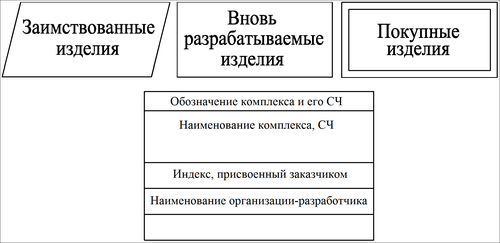
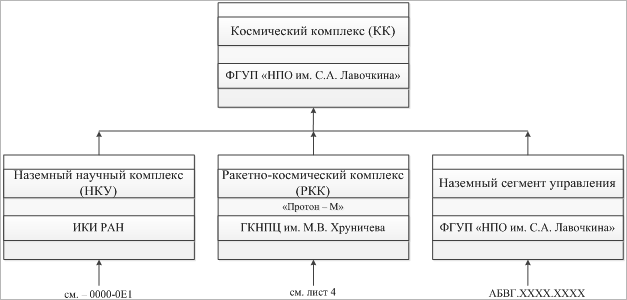

# Схема деления
> 2019.05.12 **[🚀](../index/index.md) [despace](index.md)** → [КД](doc.md), [НД](doc.md), **[СхД](wbs.md)**, [Схема](doc.md)

[TOC]

---

> <small>*Термины:* **Схема деления изделия на составные части (СхД)** — русскоязычный термин. **Work breakdown structure (WBS)** — примерный англоязычный эквивалент.</small>

**Схема деления изделия на составные части (СхД)** — [конструкторский документ](doc.md), определяющий состав [изделия](unit.md), входимость СЧ, их назначение и взаимосвязь. Разрабатывается на основании [ГОСТ 2.711](гост_2_711.md) и относится к категории «[Схема](doc.md)».

### Общее описание
СД разрабатывают на изделие (СЧ изделия), на которые имеются ТТЗ или ТЗ заказчика (головной организации). СД разрабатывают начиная со [стадии технического проекта](rnd.md) (ЭП, если технический проект не выполняется) и обозначают с присвоением кода Е1 (ГОСТ 2.711‑82). СД оформляется на форматке.  
В СД приводят состав изделия (комплексы, сборочные единицы, детали, входящие в изделие, как вновь разработанные, так и заимствованные и покупные), при этом указывают:

   1. обозначение изделия и его СЧ;
   1. наименование изделия и его СЧ;
   1. индексы, присвоенные заказчиком изделию и СЧ (для изделий, разрабатываемых по заказам Министерства обороны).

Данные об изделии и его СЧ следует помещать в условные графические обозначения СЧ изделия (см. рисунок 1).

| Рисунок 1 – Условные графические обозначения |
|:--|
|  |

   - Уровень деления (раскрытия) изделия на СЧ зависит от сложности и спецификации изделия и устанавливается разработчиком изделия по согласованию с заказчиком. (см. ГОСТ 2.711‑82 п. 1.5)
   - Условные графические обозначения изделия и его СЧ должны быть соединены между собой сплошными тонкими линиями. Линии следует заканчивать стрелками (рисунок 2).
   - При необходимости продолжить графическую часть СД ка каком‑либо из последующих листов у соответствующего графического обозначения следует поместить надпись с номером листа (рисунок 2).
   - На каждую СЧ, разрабатываемую по ТТЗ (ТЗ), СД оформляется самостоятельным конструкторским документом, и ссылка на неё должна быть приведена в СД изделия в целом (на комплекс, аппарат и т.д.) как показано на рисунке 2. (см. ГОСТ 2.711‑82 п. 1.6)
   - Покупные и заимствованные СЧ изделия на СЧ более низкого уровня не делятся.

| Рисунок 2 – Пример схемы деления |
|:--|
|  |

 

## Docs & links (TRANSLATEME ALREADY)
|…°·•¹²³±×÷≤≥≈≠ ‑ −— ⎆✉ ❐“”’«»✔→✘☐☑├┕┆ 1 lb = 0.453592 kg; 1 g = 9.80665 m/s²|
|:--|
|<small>**[FAQ](faq.md)**, **[Cable](cable.md)**·БКС, **[Camera](camera.md)**·Камера, **[Comms](comms.md)**·Радио, **[Contact](contact.md)**·Контакт, **[Control](control.md)**·Упр., **[Doc](doc.md)**·Док., **[Doppler](doppler.md)**·ИСР, **[DS](ds.md)**·ЗУ, **[EB](eb.md)**·ХИТ, **[ECO](ecology.md)**·Экол., **[EF](ef.md)**·ВВФ, **[ElC](elc.md)**·ЭКБ, **[EMC](emc.md)**·ЭМС, **[Error](error.md)**·Ошибки, **[Event](event.md)**·События, **[FS](fs.md)**·ТЭО, **[Fuel](fuel.md)**·Топливо, **[GNC](gnc.md)**·БКУ, **[GS](scs.md)**·НС, **[HF&E](hfe.md)**·Эрго., **[IU](iu.md)**·Гиро., **[KT](kt.md)**·КТЕХ, **[LAG](lag.md)**·ПУC, **[LES](les.md)**·САСП, **[LS](ls.md)**·СЖО, **[LV](lv.md)**·РН, **[MCC](mcc.md)**·ЦУП, **[Model](model.md)**·Модель, **[MSC](sc.md)**·ПКА, **[N&B](nnb.md)**·БНО, **[NR](nr.md)**·ЯР, **[OBC](obc.md)**·ЦВМ, **[OE](oe.md)**·БА, **[Pat.](патент.md)**·Патент, **[Project](project.md)**·Проект, **[PS](ps.md)**·ДУ, **[QA](quality.md)**·QA, **[R&D](rnd.md)**·НИОКР, **[RAMS](rams.md)**·НиБ, **[Risk](risk.md)**·Риск, **[Robot](robotics.md)**·Робот, **[Rover](rover.md)**·Планетоход, **[RTG](rtg.md)**·РИТЭГ, **[SARC](sarc.md)**·ПСК, **[Sensor](sensor.md)**·Датчик, **[SC](sc.md)**·КА, **[SCS](scs.md)**·КК, **[SGM](sgm.md)**·КММ, **[SI](si.md)**·СИ, **[Soft](soft.md)**·ПО, **[SP](sp.md)**·БС, **[Spaceport](spaceport.md)**·Космодром, **[SPS](sps.md)**·СЭС, **[SSS](sss.md)**·ГЗУ, **[TCS](tcs.md)**·СОТР, **[Test](test.md)**·ЭО, **[Timeline](timeline.md)**·Циклограмма, **[TMS](tms.md)**·ТМС, **[TOR](tor.md)**·ТЗ, **[TRL](trl.md)**·УГТ</small>|
|*Sections & pages*|
|**··• [Documents](doc.md) •··**  **Схема:** [КСС](ксс.md) ┊ [ПГС](пгс.md) ┊ [ПЛИС](плис.md) ┊ [СхД](wbs.md) ┊ [СхО](draft_model.md) ┊ [СхПЗ](draft_model.md) ┊ [СхЧ](unit_decd.md) ┊ [СхЭ](ei_diagram.md) |

   1. Docs: …
   1. Notable interwikies — …
   1. <…>
