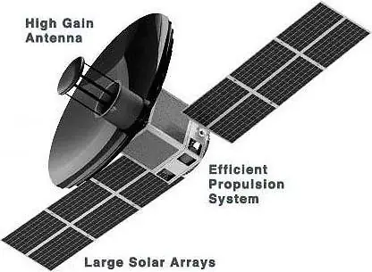
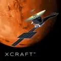
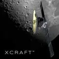
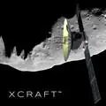
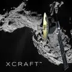

# Xcraft
> 2019.01.21 [🚀](../index/index.md) [despace](index.md) → **** <mark>NOCAT</mark>

[TOC]

---

> <small>**Xcraft** — EN term. **Икскрафт** — rough RU analogue.</small>

**Xcraft** — the basic [Xplore](xplore.md) spacecraft, offered to any customer for work near the Earth, Moon, Venus, Mars and near asteroids.

|*Type*|*[Param.](si.md)*|
|:-|:-|
|**【Mission】**|• • •|
|Cost|… or … ㎏ of [gold](sc_price.md) in … prices|
|[CML](cml.md) / [TRL](trl.md)|CML: <mark>TBD</mark>, TRL: <mark>TBD</mark>|
|Development|2017 ‑ ┊|
|Duration|…|
|Launch|2021 (planned), …, …|
|Operator|…|
|Programme|…|
|Similar to|・Proposed: …  ・Current: …  ・Past: …|
|Target|…|
|[Type](sc.md)|…|
|**【Spacecraft】**|• • •|
|Composition|…|
|Contractor|…|
|Manufacturer|…|
| |**`…`**|
|Comms|Large HGA, multi‑band relay communications|
|[ID](spaceid.md)|NSSDC ID (COSPAR ID): <mark>TBD</mark>, SCN: <mark>TBD</mark>|
|Mass|… ([…satellite](sc.md))|
|Orbit / Site|…|
|Power|550 W (at 1.0 AU), expandable to 1.1 kW|
|Payload|The payload depends on the order. Up to 70 ㎏.|

Targets & investigations:

   - **T** — technical; **C** — contact research; **D** — distant research; **F** — fly‑by; **H** — manned; **S** — soil sample return; **X** — technology demonstration
   - **Sections of measurement and observation:**
      - Atmospheric/climate — **Ac** composition, **Ai** imaging, **Am** mapping, **Ap** pressure, **As** samples, **At** temperature, **Aw** wind speed/direction.
      - General — **Gi** planet’s interactions with outer space.
      - Soil/surface — **Sc** composition, **Si** imaging, **Sm** mapping, **Ss** samples.

<small>

|*EVN‑XXX*|*T*|*EN*|*Section of m&o*|*D*|*C*|*F*|*H*|*S*|
|:-|:-|:-|:-|:-|:-|:-|:-|:-|
|…| |…| | | | | | |

</small>

 

## Mission
<mark>TBD</mark>

 

## Science goals & payload
The spacecraft is universal and is currently offered for the following missions:

   - Delivery of Arch Libraries materials to the planets of the Solar system. Agreement reached 2019.06.11.
   - Mission (any) at the request of the customer.
   - Operation of an artificial satellite of Venus in orbit (polar orbit, 550 × 550 ㎞, period 1.6 h, speed 7 ㎞/s) with launches in 2022, 2024, 2026, 2028.
   - Operation of an artificial moon satellite in orbit (orbit with an inclination of 86°, 200 × 200 ㎞, period 2.46 h, speed 1.6 ㎞/s) with launches in 2022, 2024, 2026, 2028.
   - Operation in orbit of an artificial satellite of Mars (orbit with an inclination of 93°, 250 × 250 ㎞, period 1.87 h, speed 3.4 ㎞/s) with launches in the fourth quarters of 2021, 2022, 2023, 2024.
   - Functioning of asteroids with launches in 2023, 2024, 2025, 2026.

 

## Spacecraft

The standard XCRAFT is perfect for most missions.

   - Enormous payload bay that can accommodate 30 ㎏ — 70 ㎏ of payload in 50 U of volume
   - Electric propulsion providing between 1500 ㎧ — 3500 ㎧ delta-V to fit mission needs
   - 550 W of power generation at 1.0 AU, expandable to 1.1 kW
   - Large high‑gain antenna for high speed communications from interplanetary distances
   - Multi‑band relay communications from other spacecraft, landers, rovers and ground terminals.
   - Optically stable platform with precision pointing for high performance sensors

|*Venus*|*Mars*|*Moon*|*Asteroid*|*Custom*|
|:-|:-|:-|:-|:-|
||||||

 

## Community, library, links

**PEOPLE:**

   1. <mark>TBD</mark>

**COMMUNITY:**

<mark>TBD</mark>

 

## Docs & links
|Navigation|
|:-|
|**[FAQ](faq.md)**【**[SCS](scs.md)**·КК, **[SC (OE+SGM)](sc.md)**·КА】**[CON](contact.md)·[Pers](person.md)**·Контакт, **[Ctrl](control.md)**·Упр., **[Doc](doc.md)**·Док., **[Drawing](drawing.md)**·Чертёж, **[EF](ef.md)**·ВВФ, **[Error](error.md)**·Ошибки, **[Event](event.md)**·События, **[FS](fs.md)**·ТЭО, **[HF&E](hfe.md)**·Эрго., **[KT](kt.md)**·КТ, **[N&B](nnb.md)**·БНО, **[Project](project.md)**·Проект, **[QM](qm.md)**·БКНР, **[R&D](rnd.md)**·НИОКР, **[SI](si.md)**·СИ, **[Test](test.md)**·ЭО, **[TRL](trl.md)**·УГТ, **[Way](way.md)**·Пути|
|*Sections & pages*|
|**【】**  <mark>NOCAT</mark>|

   1. Docs: …
   1. <https://www.xplore.com/xcraft.html>
