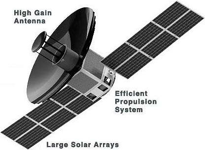
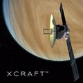
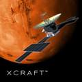
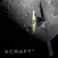
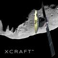
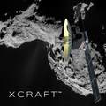

# Xcraft
> 2019.01.21 ┊ **🚀 [despace](index.md)** → **** <mark>NOCAT</mark>

[TOC]

---

> <small>*Terms:* **Xcraft** — English term with no analogues in Russian. **Икскрафт** — rough Russian equivalent.</small>

**Xcraft** — the basic [Xplore](xplore.md) spacecraft, offered to any customer for work near the Earth, Moon, Venus, Mars and near asteroids.

|*Type*|*[Param.](si.md)*|
|:--|:--|
||**`Mission properties`**|
|Cost| … or … kg of [gold](sc_price.md) in … prices |
|[CML](cml.md) / [TRL](trl.md)| CML: <mark>TBD</mark>, TRL: <mark>TBD</mark> |
|Development| 2017 ‑ ┊ |
|Duration| … |
|Launch| 2021 (planned), …, … |
|Operator| … |
|Programme| … |
|Similar  missions| • Proposed: …  • Current: …  • Past: … |
|Target| … |
|[Type](sc.md)| … |
||**`Spacecraft properties`**|
|Composition| … |
|Contractor| … |
|Manufacturer| … |
||**`…`**|
|Comms| Large HGA, multi-band relay communications |
|[ID](spaceid.md)| NSSDC ID (COSPAR ID): <mark>TBD</mark>, SCN: <mark>TBD</mark> |
|Mass| … ([…satellite](sc.md)) |
|Orbit / Site| … |
|Power| 550 W (at 1.0 AU), expandable to 1.1 kW |
|Payload| The payload depends on the order. Up to 70 kg. |

Targets & investigations:

   - **T** — technical; **Draft** — minimum for working with object. **D** — distant exploration; **C** — contact exploration; **F** — fly‑by; **H** — manned flight; **S** — soil sampe return; **X** — technology demonstration
   - **Sections of measurement and observation:**
      - Atmospheric/climate — **Ac** composition, **Ai** imaging, **Am** mapping, **Ap** pressure, **As** samples, **At** temperature, **Aw** wind speed/direction.
      - General — **Gi** planet’s interactions with outer space.
      - Soil/surface — **Sc** composition, **Si** imaging, **Sm** mapping, **Ss** samples.

<small>

|*EVN‑XXX*|*T*|*EN*|*Section of m&o*|*D*|*C*|*F*|*H*|*S*|
|:--|:--|:--|:--|:--:|:--:|:--:|:--:|:--:|
| … | | … | | | | | | |

</small>

 

## Mission
<mark>TBD</mark>

 

## Science goals & payload
The spacecraft is universal and is currently offered for the following missions:

   - Delivery of Arch Libraries materials to the planets of the Solar system. Agreement reached 2019.06.11.
   - Mission (any) at the request of the customer.
   - Operation of an artificial satellite of Venus in orbit (polar orbit, 550 × 550 km, period 1.6 h, speed 7 km/s) with launches in 2022, 2024, 2026, 2028.
   - Operation of an artificial moon satellite in orbit (orbit with an inclination of 86°, 200 × 200 km, period 2.46 h, speed 1.6 km/s) with launches in 2022, 2024, 2026, 2028.
   - Operation in orbit of an artificial satellite of Mars (orbit with an inclination of 93°, 250 × 250 km, period 1.87 h, speed 3.4 km/s) with launches in the fourth quarters of 2021, 2022, 2023, 2024.
   - Functioning of asteroids with launches in 2023, 2024, 2025, 2026.

 

## Spacecraft

The standard XCRAFT is perfect for most missions.

   - Enormous payload bay that can accommodate 30 kg — 70 kg of payload in 50 U of volume
   - Electric propulsion providing between 1500 m/s — 3500 m/s delta-V to fit mission needs
   - 550 W of power generation at 1.0 AU, expandable to 1.1 kW
   - Large high-gain antenna for high speed communications from interplanetary distances
   - Multi-band relay communications from other spacecraft, landers, rovers and ground terminals.
   - Optically stable platform with precision pointing for high performance sensors

|*Venus*|*Mars*|*Moon*|*Asteroid*|*Custom*|
|:--|:--|:--|:--|:--|
|  |  |  |  |  |

 

## Community, library, links

**PEOPLE:**

   1. <mark>TBD</mark>

**COMMUNITY:**

<mark>TBD</mark>

 

---

## Docs & links
|…°·•¹²³±×÷≤≥≈≠ ‑ −— ⎆✉ ❐“”’«»✔→✘☐☑├┕┆ 1 lb = 0.453592 kg; 1 g = 9.80665 m/s²|
|:--|
|<small>**[FAQ](faq.md)**, **[Cable](cable.md)**·БКС, **[Camera](camera.md)**·Камера, **[Comms](comms.md)**·Радиосв., **[Contact](contact.md)**·Контакт, **[Control](control.md)**·Управ., **[Doc](doc.md)**·Док., **[Doppler](doppler.md)**·ИСР, **[DS](ds.md)**·ЗУ, **[EB](eb.md)**·ХИТ, **[ECO](ecology.md)**·Экол., **[EF](ef.md)**·ВВФ, **[ElC](elc.md)**·ЭКБ, **[EMC](emc.md)**·ЭМС, **[Errors](error.md)**·Ошибки, **[Events](event.md)**·События, **[FS](fs.md)**·ТЭО, **[Fuel](fuel.md)**·Топливо, **[GNC](gnc.md)**·БКУ, **[GS](scs.md)**·НС, **[HF&E](hfe.md)**·Эргоном., **[IMU](imu.md)**·Гироскоп, **[Incubator](incubator.md)**·Инкуб., **[KT](kt.md)**·КТЕХ, **[LAG](lag.md)**·ПУC, **[LES](les.md)**·САСП, **[LS](ls.md)**·СЖО, **[LV](lv.md)**·РН, **[MAG](mag.md)**·Магнитом., **[MCC](mcc.md)**·ЦУП, **[Model](model.md)**·Модель, **[MSC](sc.md)**·ПКА, **[N&B](nnb.md)**·БНО, **[NR](nr.md)**·ЯР, **[OBC](obc.md)**·ЦВМ, **[OE](oe.md)**·БА, **[Patent](патент.md)**·Патент, **[Project](project.md)**·Проект, **[PS](ps.md)**·ДУ, **[QA](quality.md)**·QA, **[R&D](rnd.md)**·НИОКР, **[RAMS](rams.md)**·НиБ, **[Risk](risk.md)**·Риск, **[Robot](robotics.md)**·Робот, **[Rover](rover.md)**·Планетоход, **[RTG](rtg.md)**·РИТЭГ, **[RW](rw.md)**·ДМ, **[SARC](sarc.md)**·ПСК, **[Sensor](sensor.md)**·Датчик, **[SC](sc.md)**·КА, **[SCS](scs.md)**·КК, **[SGM](sgm.md)**·КММ, **[SI](si.md)**·СИ, **[Soft](soft.md)**·ПО, **[SP](sp.md)**·БС, **[Spaceport](spaceport.md)**·Космодром, **[SPS](sps.md)**·СЭС, **[SSS](sss.md)**·ГЗУ, **[TCS](tcs.md)**·СОТР, **[Test](test.md)**·ЭО, **[Timeline](timeline.md)**·Циклограмма, **[TMS](tms.md)**·ТМС, **[TOR](tor.md)**·ТЗ, **[TRL](trl.md)**·УГТ</small>|

**Docs:**

   1. …

**Links:**

   1. <https://www.xplore.com/xcraft.html>

<mark>NOCAT</mark>
