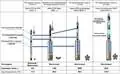
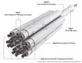
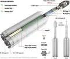
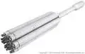

# Yenisei
> 2019.06.27 [🚀](../index/index.md) [despace](index.md) → [LV](lv.md)

[TOC]

---

> <small>**Енисей** — RU term w/o analogues in English. **Yenisei** — literal EN translation.</small>

**Yenisei** — upcoming RU super heavy-lift launch vehicle (SHLV). Cost estimate in 2019 was ₽ 1 500 000 000 000.

|*Version*|*Description*|*Activity*|
|:--|:--|:--|
|Energia‑3|Baseline.|Development (2027 ‑ …)|
|Енисей (STK-1)|Baseline.|Development (2027 ‑ …)|
|Дон (STK-2)|Baseline.|Development (2027 ‑ …)|

---

 

## Yenisei
**Yenisei** — upcoming RU super heavy-lift launch vehicle.

   - Отработочный вариант РН СТК — для облёта Луны в автоматическом режиме кораблём «Федерация» или лунным вариантом корабля «Союз».
   - РН СТК первого этапа — для запусков пилотируемого транспортного корабля «Федерация» и других ПН на низкие окололунные орбиты, в т.ч. полярную.
   - РН СТК второго этапа — на первой ступени будут использоваться пакет из 6 первых ступеней «[Союза‑5](soyuz.md)» — один центральный и 5 боковых блоков. Вторая ступень будет, в отличие от СТК первого этапа и отработочной версии, оснащена водородным двигателем РД-0150. Также в РН будет использоваться кислородно‑водородный межорбитальный буксир (или [разгонный блок](lv.md)).

|*Characteristic*|*[Value](si.md)*|
|:--|:--|
|Активность|**Активен** (2027 ‑ …)|
|[Аналоги](analogue.md)|*Актуальные:* [Falcon Heavy](falcon.md) (США)・ [New Glenn](new_glenn.md) (США)・ [SLS Block 1](sls.md) (США);  *Исторические:* [Saturn‑5](saturn.md) (США)・ [Н-1](n_1.md) (СССР)・ [Энергия](energia.md) (СССР)|
|Длина/диаметр| |
|[Космодромы](spaceport.md)|[Восточный](spaceport.md)|
|Масса старт./сух.|**Энергия‑3:** 1 440 / …;  **Енисей:** 3 167 / …;  **Дон:** 3 281 / …|
|Разраб./изготов.|[РКК Энергия](ркк_энергия.md) (Россия) / [РКК Энергия](ркк_энергия.md) (Россия)|
|Ступени|3|
|[Fuel](ps.md)|[O + Kerosene](o_plus.md) (1, 2 ступ.), [Кислород + Водород](o_plus.md) (2 ступ.)|
| |  |

**Выводимые массы.**

|*Космодром*|*РН*|<small>*Масса,  [НОО](nnb.md), т*</small>|<small>*Масса,  [ГСО](nnb.md), т*</small>|<small>*Масса к  [Луне](moon.md), т*</small>|<small>*Масса к  [Венере](venus.md), т*</small>|<small>*Масса к  [Марсу](mars.md), т*</small>|*Примечания*|
|:--|:--|:--|:--|:--|:--|:--|:--|
|[Восточный](spaceport.md)|Энергия‑3|70|…|…|…|…|Пуск — $ … млн (… г);  ПН 4.86 % от ст.массы|
|[Восточный](spaceport.md)|Енисей|100|26|27|…|…|Пуск — $ … млн (… г);  ПН 3.15 % от ст.массы|
|[Восточный](spaceport.md)|Дон|140|29.3|33|…|…|Пуск — $ … млн (… г);  ПН 4.26 % от ст.массы|

<small>Примечания:  **1)** Указана масса для наихудших условий старта.  **2)** В скобках указана масса для наилучших условий старта.</small>

 

## Docs & links (TRANSLATEME ALREADY)
|Navigation|
|:--|
|**[FAQ](faq.md)**【**[SCS](scs.md)**·КК, **[SC (OE+SGM)](sc.md)**·КА】**[CON](contact.md)·[Pers](person.md)**·Контакт, **[Ctrl](control.md)**·Упр., **[Doc](doc.md)**·Док., **[Drawing](drawing.md)**·Чертёж, **[EF](ef.md)**·ВВФ, **[Error](error.md)**·Ошибки, **[Event](event.md)**·События, **[FS](fs.md)**·ТЭО, **[HF&E](hfe.md)**·Эрго., **[KT](kt.md)**·КТ, **[N&B](nnb.md)**·БНО, **[Project](project.md)**·Проект, **[QM](qm.md)**·БКНР, **[R&D](rnd.md)**·НИОКР, **[SI](si.md)**·СИ, **[Test](test.md)**·ЭО, **[TRL](trl.md)**·УГТ, **[Way](way.md)**·Пути|
|*Sections & pages*|
|**【[Launch vehicle (LV)](lv.md)】**  [ICBM](icbm.md)・ [Integrated payload unit](lv.md)・ [Non‑rocket spacelaunch](nrs.md)・ [Throw weight](throw_weight.md) • • •  **China:** [Long March](long_march.md) ┊ **EU:** [Arian](arian.md), [Vega](vega.md) ┊ **India:** [GSLV](gslv.md), [PSLV](pslv.md) ┊ **Israel:** [Shavit](shavit.md) ┊ **Japan:** [Epsilon](epsilon.md), [H2](h2.md), [H3](h3.md) ┊ **Korea N.:** [Unha](unha.md) ┊ **Korea S.:** *([Naro‑1](naro_1.md))* ┊ **RF,CIF:** [Angara](angara.md), [Proton](proton.md), [Soyuz](soyuz.md), [Yenisei](yenisei.md), [Zenit](zenit.md) *([Energia](energia.md), [Korona](korona.md), [N‑1](n_1.md), [R‑1](r_7.md))* ┊ **USA:** [Antares](antares.md), [Atlas](atlas.md), [BFR](bfr.md), [Delta](delta.md), [Electron](electron.md), [Falcon](falcon.md), [Firefly Alpha](firefly_alpha.md), [LauncherOne](launcherone.md), [New Armstrong](new_armstrong.md), [New Glenn](new_glenn.md), [Minotaur](minotaur.md), [Pegasus](pegasus.md), [Shuttle](shuttle.md), [SLS](sls.md), [Vulcan](vulcan.md) *([Saturn](saturn_lv.md), [Sea Dragon](sea_dragon.md))*|

   1. Docs: …
   1. <https://en.wikipedia.org/wiki/Super_heavy-lift_launch_vehicle>
   1. <https://ru.wikipedia.org/wiki/Енисей_(ракета-носитель)>
