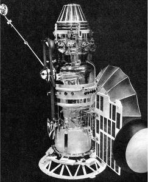
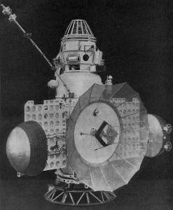

# Zond 1
> 2019.12.10 [🚀](../index/index.md) [despace](index.md) → [Venus](venus.md), **[Project](project.md)**

[TOC]

---

> <small>**Зонд 1** — RU term w/o analogues in English. **Zond 1 (Zond 3MV-1 No. 4), Probe-1** — literal EN translation.</small>

**Zond 1** was a spacecraft of the Soviet Zond program. It was the second Soviet research spacecraft to reach [Venus](venus.md), although communications had failed by that time.

 

 

|*Type*|*[Param.](si.md)*|
|:--|:--|
|**【Mission】**|• • •|
|Cost|… or … ㎏ of [gold](sc_price.md)|
|Development|…|
|Duration|53 d|
|Launch|1964.04.02 02:42:40 UTC, Rocket: Molniya 8K78M|
|Operator|O㎅-1|
|Programme|Venera programme|
|Similar to|・Proposed: [Venera 2](venera_2.md), [Vega 1 and 2](vega_1_2.md)   • Current: …  ・Past: [Venera 1](venera_1.md)|
|Target|[Venus](venus.md) exploration|
|[Type](sc.md)|Lander spacecraft|
|**【Spacecraft】**|• • •|
|Comms|2 m parabolic high‑gain antenna (decimeter range)|
|Composition|Venus orbiter, lander|
|Contractor|…|
|[ID](spaceid.md)|NSSDC ID (COSPAR ID): [1964-016D ⎆](https://nssdc.gsfc.nasa.gov/nmc/spacecraft/display.action?:id=1964-016D), SCN: 00785|
|Manufacturer|Lavochkin|
|Mass|Dry: 290 ㎏ ([minisatellite](sc.md), [EVN‑070](venus.md))|
|Orbit / Site|Heliocentric; 0.652 AU × 1.001 AU; T = 274 days; i = 3.7°|
|Payload|Containing experiments for chemical analysis of the atmosphere, gamma‑ray measurements of surface rocks, a photometer, temperature and pressure gauges, and a motion/rocking sensor in case it landed in water|
|Power|…|

Achieved targets & investigations:

<small>

|*EVN‑XXX*|*T*|*EN*|*Section of m&o*|*D*|*C*|*F*|*H*|*S*|
|:--|:--|:--|:--|:--|:--|:--|:--|:--|
|EVN‑005|T|Exploration: from Venusian orbit.| |D| |F| | |
|EVN‑070|T|Exploration with [satellites](sc.md): minisatellites.| |D| |F| | |
|EVN‑097| |Atmosphere: effect of solar Rad & interplanetary space on the atmo.| |D| |F| | |

</small>

 

## Mission
The third space station was successfully launched to Venus on 1964.04.02, but it initial trajectory was not enough accurate, and the next day it took to make the maneuver into the intermediate portion of the path at a distance 564 000 ㎞ from Earth. This was the first successful correction of the trajectory by the Soviet planetary space station. Recall that this opportunity also had the station “[Venera 1](venera_1.md)” and “[Mars 1](mars_1.md)”, but neither one of them had a chance to use it. However, the station faced a serious problem: shortly after start was discovered leak in a sealed compartment with the control system due to poor quality weld quartz dome, providing a field of view of navigation sensors of the Sun and stars. The location of the leak determined from the analysis of the perturbations that have provided the station attendant gas. A week later the transmitters and other electronic devices out of order, engaged when the pressure fell to 5 millibars. This resulted in a corona discharge and short circuits in electrical circuits. Ion the engines also worked emergency. However, the availability of a competent booking system allowed to communicate with the station via the system module apparatus and the second trajectory correction was held on May 14 at a distance of more than 13 million km from the Earth. A new trajectory has enabled the station to fly at a distance 100 000 ㎞ from Venus because the initial trajectory is passed so far off track that stock at the correction speed V is not enough to the station could go on the course of the meeting with Venus, even if she was functioning normally. For this reason, and due to depressurization of the Soviet the researchers did not consider Venus as the destination of the flight station, and it was announced that the program is aimed at engineering test systems in terms of far space. The station was called “Probe 1” and not “Venera 2”. The leak was fatal, May 25 thermal control system completely out of order and system connection was disconnected. Space station flew past Venus on 1964.07.19. ([EVN‑005](venus.md))

**Results**

“Probe-1” transferred data measurements of the interplanetary plasma, cosmic rays and density of atomic hydrogen lines Lyman‑alpha, held devices that are installed on the orbital machine ([EVN‑097](venus.md)). Was also measured the proton components of cosmic radiation with the help of the device, mounted on the descent module, but the part of the transferred data has been lost.

 

## Science goals & payload
Zond 1 carried a 90 ㎝ spherical landing capsule, containing experiments for chemical analysis of the atmosphere, gamma‑ray measurements of surface rocks, a photometer, temperature and pressure gauges, and a motion/rocking sensor in case it landed in water.

The payload of the space station for the test flight to Venus was similar to that used for the test flight to [Mars](mars.md).

Scientific instruments for measuring atmospheric parameters consisted of two platinum wire thermistors, worked in bands −60 ‑ +460 ℃ and 0 ‑ +330 ℃, the aneroid barometer, designed for a pressure 0.13 ‑ 6.9 ㍴, and densitometer‑based ionization chambers, using beta‑radiation. The densitometer was integrated with a thermometer and worked in the range 0.0005 ‑ 0.015 g/㎝³ with a 5 % margin of error. Devices to determine the atmospheric composition, pH, and conductivity consisted of a set of cartridges‑gas analyzer with chemical reagents and sensors to conduct the electrical tests for various gases, including carbon dioxide, nitrogen, oxygen, and water vapor. The photometer was sensitive in the range of 0.001 ‑ 10 000 Lux and was intended for measurement of a luminescence of atmosphere during a night descent. A device for determining the tilt level measurement of mercury intended for measuring wave motion in your ocean. Gas discharge detector based on the schema of antisubmarine, scintillation detector of cosmic rays and the gamma‑ray detector intended primarily for the detection of gamma radiation the surface of the radioactive elements the composition of the soil, including uranium, thorium and potassium. They were also used during the interplanetary flight to measure the intensity of cosmic rays.
At landers stations 3MV “Venus” and “Mars” was planned to install the detector microorganisms, but they never included in the list of scientific instruments.

   - **Orbiter:**
      1. Atomic hydrogen detector in the Lyman‑alpha line.
      1. Cosmic radiation detector;
      1. Detector of charged particles;
      1. Gas‑discharge and scintillation detectors of cosmic rays and gamma rays;
      1. Ion‑trap
      1. Magnetometer;
      1. Micrometeorite detector;
   - **Lander:**
      1. Devices for determining the composition of the atmosphere, acidity and conductivity;
      1. Device for measuring the inclination of the device on the level of mercury;
      1. Gamma ray detector of soil composition and cosmic ray detector;
      1. Photometer  for measuring the intrinsic glow of the atmosphere (airglow);
      1. Temperature, pressure and density sensors.

 

## Spacecraft
 **Zond 1** was built on the basis of 3MV (3MV-1 No. 4).

**Orbital Compartment**

The core of the stack was a pressurized compartment called the Orbital Compartment. This part housed the spacecraft’s control electronics, radio transmitters and receivers, batteries, astro‑orientation equipment, and so on. The compartment was pressurized to around 100 ㎪ and thermally controlled to simulate Earth‑like conditions, which removed the need for special electronic components that could reliably operate in extreme conditions. On Zond 1 the module depressurized in flight, severely damaging the spacecraft’s systems.

Mounted on the outside of the Orbital Compartment were two solar panels which supplied power to the spacecraft. They were folded against the body of the spacecraft during launch and were only deployed when the spacecraft was already on its interplanetary trajectory. On the ends of each solar panel was a hemispherical radiator which radiated excess heat from the orbital compartment into through a coolant loop.

Also mounted on the Orbital Compartment was a 2 m parabolic high‑gain antenna, used for long‑range communications. Depending on the mission, the spacecraft also used other antennas (for example, for communications with probes on the planet’s surface).

**Planetary Compartment**

Below the Orbital Compartment was a second pressurized compartment called the Planetary Compartment. Depending on the mission the Planetary Compartment either housed scientific equipment for orbital observation of the planet or was designed to detach and land on the planet’s surface.

**Engine**

Course correction capabilities were provided by a KDU 414 engine attached to the top of the Orbital Compartment. It provided a maximum thrust of around 2 kN used UDMH and nitric acid as propellants. Attitude control was achieved by several small cold gas thrusters.

The whole stack was 3.6 m high and weighted around 1 000 ㎏.

 

## Community, library, links

**PEOPLE:**

   - **Leaders:**
      1. [Mstislav Keldysh](person.md) (Мстислав Всеволодович Келдыш) was a Soviet scientist in the field of mathematics and mechanics.
      1. [Sergei Korolev](person.md) (Сергей Павлович Королёв) was a lead Soviet rocket engineer and spacecraft designer during the Space Race between the United States and the Soviet Union in the 1950s and 1960s.
   - **Members:**
      1. Aleksandr Platonov (Александр Константинович Платонов) was a Soviet scientist, ballistics KIAM (ИПМ), analyzed the method of “solar correction”.
      1. Alfred Charles Bernard Lovell was an English physicist and radio astronomer. Theoretically couuld receive a signal from the spacecraft’s disoriented nondirectional antenna.
      1. Valeri Kubasov (Валерий Николаевич Кубасов) was a Soviet/Russian cosmonaut. Ballistics O㎅-1, analyzed the method of “solar correction”.

**COMMUNITY:**

<mark>TBD</mark>

 

## Docs & links
|Navigation|
|:--|
|**[FAQ](faq.md)**【**[SCS](scs.md)**·КК, **[SC (OE+SGM)](sc.md)**·КА】**[CON](contact.md)·[Pers](person.md)**·Контакт, **[Ctrl](control.md)**·Упр., **[Doc](doc.md)**·Док., **[EF](ef.md)**·ВВФ, **[Error](error.md)**·Ошибки, **[Event](event.md)**·События, **[FS](fs.md)**·ТЭО, **[HF&E](hfe.md)**·Эрго., **[KT](kt.md)**·КТ, **[Model](model.md)**·Модель, **[N&B](nnb.md)**·БНО, **[Project](project.md)**·Проект, **[QM](qm.md)**·БКНР, **[R&D](rnd.md)**·НИОКР, **[SI](si.md)**·СИ, **[Test](test.md)**·ЭО, **[TRL](trl.md)**·УГТ, **[Way](way.md)**·Пути|
|*Sections & pages*|
|**【】**  <mark>NOCAT</mark>|

   1. Docs: …
   1. <https://en.wikipedia.org/wiki/Zond_1>
