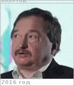

# Алексашкин, Сергей Николаевич
> 2019.04.01 [🚀](../index/index.md) [despace](index.md) → [Contact](contact.md)

|*[Org.](contact.md)*|*НПОЛ, RU. 101 / 302, 512 «Проектно‑конструкторский отдел». Зам. начальника отдела 512*|
|:--|:--|
|B‑day, addr.|1955.07.04, на НПОЛ с 1978 / …|
|Contact|<alexashkin@laspace.ru>, *work:* 40-01, 52-12, +7(495)575-52-12; *mobile:* +7(495)763-90-56|
|i18n|<mark>TBD</mark>|
| | |

   - **[Education](edu.md):** …
   - **Exp.:** …
   - …
   - **SC/Equip.:** …
   - **Conferences:** …
   - Git: …
   - Facebook: <mark>nofb</mark>
   - Instagram: <mark>noin</mark>
   - LinkedIn: <mark>noli</mark>
   - Twitter: <mark>notw</mark>
   - <…>
   - **As a person:**
      1. Суетлив, разговорчив.
