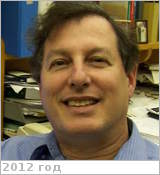

# Allen, Mark Andrew
> 2019.10.14 [🚀](../index/index.md) [despace](index.md) → **[Archive](faq.md)**, [Contact](contact.md)

|*[Org.](contact.md)*|*[JPL](zz_jpl.md), US.*|
|:--|:--|
|B‑day, addr.|1949.09.29 ‑ 2016.10.22 (67 лет, Died of complications from ALS (Lou Gehrig’s Disease)) / …|
|Contact|<mark.a.allen@nasa.gov>, *work:* +1(818)354-36-65|
|i18n|<mark>TBD</mark>|
|||

   - **Exp.:** His career interest in chemistry was already well established by the time he enrolled as an undergraduate at Columbia University. In a 2012 alumni profile, he commented, “In my senior year, I learned about the discovery of molecules in interstellar space…, an environment where conventional wisdom at the time would suggest that molecules shouldn’t exist. I chose this burgeoning field of astrochemistry as my future research interest.” (Columbia College Today, Winter 2011-2012, p. 75.) Allen graduated Summa Cum Laude & Phi Beta Kappa from Columbia in 1971, & subsequently received his PhD from Caltech in 1976, both degrees in chemistry. Allen returned to New York City for a two-year fellowship at NASA’s Goddard Institute for Space Studies, & in 1978 accepted a postdoctoral position in planetary sciences at Caltech with Prof. Yuk Yung. He joined the staff of the Jet Propulsion Laboratory (JPL) in 1981, where he spent the majority of his professional career, developing chemical models of planetary & exoplanetary atmospheres, comets, & cold interstellar molecular clouds. He was the principal designer of the comprehensive chemical code KINETICS, an integrated dynamical/chemical computational model for simulating chemical processes in planetary atmospheres. Allen was a team member of NASA’s Astrobiology Institute (NAI) & Virtual Planet Lab, & was [Principal Investigator](principal_investigator.md) of NAI’s “Titan as a Prebiotic Chemical System” project. He was also involved in a number of NASA & ESA missions & mission concepts, including proposals for orbiting spacecraft to examine the atmospheres of Venus, Mars, & Titan.
   - Reflecting on his own training, Allen acknowledged the value of a broad undergraduate education in his work as a scientist: “I was told by a very senior JPL program manager that I prepared the clearest mission proposals he had ever read.” A long-time friend writes that Mark Allen “was a regular guy who had a sense of humor. He was very sweet, very thoughtful.”
   - <https://aas.org/obituaries/mark-allen-1949-2016>
   - <https://nai.nasa.gov/directory/allen-mark/>
