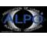

# ALPO
> 2019.10.29 [🚀](../index/index.md) [despace](index.md) → [Contact](contact.md)

||<mark>noemail</mark>, <mark>noworkphone</mark>, Fax: …;  *Springfield, Illinois, US and worldwide*  【<http://www.alpo-astronomy.org/>・ <http://alpo-j.asahikawa-med.ac.jp/indexE.htm> — ALPO JP ・ [Wikipedia(EN) ⎆](https://en.wikipedia.org/wiki/Association_of_Lunar_and_Planetary_Observers)】|
|:--|:--|
|**Mission**|…|
|**Vision**|…|
|**Values**|…|
|**Business**|…|
|**[MGMT](mgmt.md)**|…|

The **Association of Lunar and Planetary Observers** (**ALPO** or **A.L.P.O.**) is an international scientific and educational organization established in March, 1947 in the United States by Walter H. Haas, and later incorporated in 1990. ALPO is an organization for advancing and conducting astronomical work by both professional and amateur astronomers who share an interest in solar system observations.

ALPO studies solar system objects such as the Sun, the Earth’s Moon, planets, asteroids, meteors, and comets. ALPO stimulates, coordinates, and generally promotes the study of these bodies using methods and instruments available within the communities of both amateur and professional astronomers. The organization holds a conference each summer, usually in conjunction with other astronomical groups.

ALPO had no initial formal structure but later found it necessary to specialize as its membership chose to narrow their studies to certain favored observed celestial objects. ALPO adopted a similar structure with sections like that of the British Astronomical Association (BAA) in order to properly study the objects observed. ALPO established interest sections as needed, such as the Saturn Section. Each section would be directed by an individual known as a «recorder», which later became known as «coordinator» (a term still used today). Julius L. Benton still serves to the present day as the first coordinator of the ALPO Saturn Section since its founding in 1971. One of its most active sections over the decades has been its Lunar Section which would record, extensively draw, and record features on the Earth’s Moon, including transient lunar phenomenon (TLP) [also known as lunar transient phenomenon (LTP)]. ALPO’s «Lunar Recorder» for 1957 ‑ 1961 was Alika K. Herring, an individual whose drawings of lunar craters would appear several times in the astronomical magazine Sky & Telescope. Herring would help determine astronomical seeing conditions in Hawaii in conjunction with observations taken by Franklin E. Roach (not ALPO affiliated) that would eventually determine the establishments of various telescope facilities. The 19 various sections fall into two main categories: observing, and special. Many of these sections participate with online discussion boards subgroups contained in Yahoo! Groups on the internet.

**Observing Sections.**  
Fourteen sections specialize as «Observing Sections». Moving outward from the Sun, they are by object (12): Solar, Mercury, Venus, Meteorite, Meteors, Lunar, Mars, Minor Planets, Jupiter, Saturn, Remote Planets, and Comets. By additional phenomena they are: Eclipse, and Transit.

**Special Sections.**  
Five sections serve functionally as «Special Sections», fulfilling historical and administrative purposes. They are, alphabetically: Computing, Historical, Publications, Training Program, and Youth Programs.

 

…
