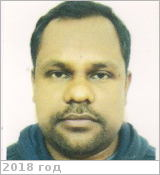

# Ansari, Arif Husain
> 2019.07.17 **[🚀](../index/index.md) [despace](index.md)** → [Contact](contact.md)

|*[Org.](contact.md)*|*[BSIP](zz_bsip.md), IN. Precambrian Palaeobiology*|
|:--|:--|
|i18n|<mark>TBD</mark>|
|Tel|*раб.:* <mark>noworkphone</mark>; *mobile:* +91(841)805-28-12|
|E‑mail|<a.h.ansari@bsip.res.in>, <arifenv@gmail.com>|
|B‑day, addr.|<mark>nodate</mark> 1983 / …|
|| <mark>nosign</mark>|

   - **[Education](edu.md):** PhD, Sheffield Univ., Department of Geography, 2013. MS, Environmental Sciences, Jawaharlal Nehru Univ., 2006. BS, Botany, Chemistry, Zoology, Gorakhpur University, 2004.
   - **Exp.:** Research interest: Biogeochemical Cycling, Stable Isotope Geochemistry, Astrobiology. My current work explores sedimentary rocks geochemistry using stable isotopes & trace elements to understand the Precambrian oceanic & atmospheric environement & their relationship with the evolutiion of life. Skills & Expertise: Geochemistry, Biogeochemistry, Environment, Oceanography, Isotope Geochemistry, Stable Isotope Analysis, Aquatic Ecosystems, Marine Ecology, Ecosystems, Paleogeography.
   - …
   - **SC/Equip.:** …
   - **Conferences:** 2019 [VD Workshop 2019](vdws2019.md)
   - Git: …
   - Facebook: <mark>nofb</mark>
   - Instagram: <mark>noin</mark>
   - LinkedIn: <mark>noli</mark>
   - Twitter: <mark>notw</mark>
   - <https://www.researchgate.net/profile/Arif_Ansari>
   - <https://scholar.google.co.in/citations?user=_U4h0VkAAAAJ&hl=en>
   - **As a person:**
      1. …
