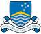

# ANU
> 2019.08.07 [🚀](../index/index.md) [despace](index.md) → [Contact](contact.md)

||<innovation@anu.edu.au>, +61(2)6125-5111, Fax: …;  *ANU Alumni Relations, 52 Collins St, Melbourne VIC 3000, Australia*|
|:--|:--|
|Link|<http://www.anu.edu.au/>  <https://en.wikipedia.org/wiki/Australian_National_University>  <https://ru.wikipedia.org/wiki/Австралийский_национальный_университет>|

**Австрали́йский национа́льный университе́т (англ. The Australian National University, ANU)** — государственный университет, расположенный в Канберре (Австралия). Создан 1 августа 1946 года. Вначале специализировался на исследовательской работе. В 1960 году объединился с Университетским колледжем Канберры и стал предоставлять также и высшее образование.

АНУ считается одним из ведущих мировых исследовательских университетов. Он занимает 1-е место в Австралии и во всей Океании, 24-е место в мире по рейтингу QS World University 2019 года, и 49-е место в мире (второе место в Австралии) по версии 2019 times Higher Education. АНУ был назван 7-м (первым в Австралии) самым международным университетом в мире по результатам исследования Times Higher Education в 2017 году. В ежегодном рейтинге трудоустройства выпускников высших учебных заведений «Times Higher Education» за 2017 год АНУ занял 21-е место в мире (первое место в Австралии). АНУ занимает 100 место (первое место в Австралии) в рейтинге CWTS Leiden. Университет особенно хорошо известен своими программами в области искусства и социальных наук и входит в число лучших в мире по ряду дисциплин, включая политику и международные отношения, социальную политику и географию.

При университете существует Исследовательская школа астрономии и астрофизики на базе которой основана обсерватория Сайдинг‑Спринг — крупнейшая обсерватория на Австралийском континенте.

 

…

