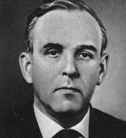

# Бабакин, Георгий Николаевич
> 2019.11.17 [🚀](../index/index.md) [despace](index.md) → [Contact](contact.md)

|*[Org.](contact.md)*|*НПОЛ, SU.*|
|:--|:--|
|B‑day, addr.|1914.11.13 ‑ 1971.08.03 / Москва, СССР|
|Contact||
|i18n|Babakin, Georgy Nikolayevich|
|||

   - **[Education](edu.md):** Член‑корреспондент Академии наук СССР (c 24.11.1970). Доктор технических наук (1968). Герой Социалистического Труда (1970). Лауреат Ленинской премии (1966).
   - **Exp.:** НПО имени С. А. Лавочкина (Химки, Московская область) под руководством Бабакина работало над совершенствованием техники, систем тестирования и управления, добившись целого ряда успехов там, где у КБ Королёва не получилось — первая мягкая посадка на Луну аппарата Луна‑9, первый в мире планетоход Луноход‑1, первый зонд Венера‑4 в атмосфере Венеры.
   - Советский инженер, конструктор, работавший в космической программе СССР. Главный конструктор Конструкторского Бюро им. Лавочкина (1965 ‑ 1971). ┊ Сын — [Николай Георгиевич Бабакин](zz_babakin2.md).
   - **SC/Equip.:** …
   - **Conferences:** …
   - Git: …
   - Facebook: 
   - Instagram: 
   - LinkedIn: 
   - Twitter: 
   - <https://ru.wikipedia.org/wiki/Бабакин,_Георгий_Николаевич>
   - <https://persona.rin.ru/view/f/0/31767/babakin-georgij-nikolaevich>
