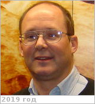

# Baines, Kevin
> 2019.07.17 [🚀](../index/index.md) [despace](index.md) → [Contact](contact.md)

|*[Org.](contact.md)*|*[JPL](zz_jpl.md), US. Planetary Science. Planetary & Exoplanetary Atmospheres. Principal Scientist (2003)*|
|:--|:--|
|B‑day, addr.|1954.02.11 / …|
|Contact|<kbaines@jpl.nasa.gov>, *раб.:* +1(818)879-35-02, Fax: +1(818)393-46-05; *mobile:* <mark>nomobile</mark>|
|i18n|<mark>TBD</mark>|
| | <mark>nosign</mark>|

   - **[Education](edu.md):** PhD, Physics, Washington Univ., 1982. MA, Physics, Washington Univ., 1978. BA, Physics, Astronomy (with honors, summa cum laude), Amherst College, 1976.
   - **Exp.:** …
   - …
   - **SC/Equip.:** 1997 [Cassini Huygens](cassini_huygens.md), New Horizons, 2005 [Venus Express](venus_express.md)
   - **Conferences:** 2019 [VD Workshop 2019](vdws2019.md)
   - Git: …
   - Facebook: <https://www.facebook.com/kevin.baines.56>
   - Instagram: <mark>noin</mark>
   - LinkedIn: <https://www.linkedin.com/in/kevin-baines-b568b313>
   - Twitter: <mark>notw</mark>
   - <https://science.jpl.nasa.gov/people/Baines/>
   - <https://scholar.google.com/citations?:user=l4HEIR8AAAAJ&hl=en>
   - **As a person:**
      1. …
