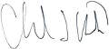

# Baker, Charles L.
> 2019.12.02 ┊ **🚀 [despace](index.md)** → **[Contact](contact.md)**

|*[Org.](contact.md)*|*[GFSC](zz_gfsc.md), US. Mission/Project Systems Engineer*|
|:--|:--|
|i18n| <mark>TBD</mark> |
|Tel| *раб.:* <mark>нетрабочего</mark>; *моб.:* <mark>нетмобильного</mark> |
|E‑mail| <mark>нетпочты</mark> |
|B‑day, addr.| <mark>нетдаты</mark> 1971 / … |
||   |

   - **[Education](edu.md):** Mech. engineering, Thermal engineering, Carnegie Mellon Univ., 1993.
   - **Exp.:** GFSC: 2009 ‑ ┊ Mission/Project systems enginer, Lead mission studies in the planetary and astrophysics line of business. 2004 ‑ 2009, Lead thermal engineer, Led [LRO](lunar_reconnaissance_orbiter.md) thermal team.
   - I am the Project Systems Engineer on an astrophysics International Space Station Payload called Neutron star Interior Composition Explorer, directly managing a team of 4 other systems engineer and the technical lead of a team of 30 engineers.
   - **SC/Equip.:** 2009 [LRO](lunar_reconnaissance_orbiter.md), 2009 [Venus Mobile Explorer](venus_mobile_explorer.md)
   - **Conferences:** …
   - Git: …
   - Facebook: <mark>нетфб</mark>
   - Instagram: <mark>нетинсты</mark>
   - LinkedIn: <https://www.linkedin.com/in/charles-baker-a735604>
   - Twitter: <mark>неттви</mark>
   - **As a person:**
      1. …
