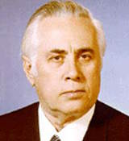

# Бармин, Владимир Павлович
> 2019.11.17 **[🚀](../index/index.md) [despace](index.md)** → [Contact](contact.md)

|*[Org.](contact.md)*|*МГТУ Баумана, SU.*|
|:--|:--|
|i18n| Barmin, Vladimir Pavlovich |
|Tel| |
|E‑mail| |
|B‑day, addr.| 1909.03.17 ‑ 1993.07.17 / Москва, СССР |
||  |

   - **[Education](edu.md):** Доктор технических наук (1959). Академик АН СССР (с 1966 года, с 1991 года — академик РАН), Герой Социалистического Труда (1956). Лауреат Ленинской премии и трёх Государственных премий СССР.
   - **Exp.:** С 1947 года под руководством Бармина были разработаны стартовые комплексы для многих ракет конструкции Королёва: Р-1, Р-2, Р-11, Р-5, Р-5М — первой стратегической ракеты с ядерным боезарядом Р-5М. В 1957 году завершены работы над стартовым комплексом первой в мире межконтинентальной баллистической ракеты Р-7, которая вывела на орбиту Земли первый искусственный спутник Земли и первого космонавта Юрия Гагарина. В ГСКБ «Спецмаш» при участии Бармина созданы шахтные комплексы для боевых ракет Р-12, Р-14, Р-9А, УР-100. Под его руководством были разработаны и созданы стартовые комплексы для ракет‑носителей «Протон» и многоразовой ракетно‑космической системы «Энергия‑Буран». Основатель и первый заведующий кафедрой «Стартовые ракетные комплексы» МГТУ имени Н. Э. Баумана. Руководил конструкторским бюро по разработке стартовых комплексов (Главный конструктор). Бармин руководил созданием автоматических грунтозаборных устройств для исследования Луны и Венеры. С помощью одного из них была взята проба лунного грунта с глубины около 2,5 метра и обеспечена доставка его на Землю. С помощью другого был осуществлен забор образцов грунта в трёх точках поверхности Венеры, получена и передана по радиоканалу на Землю научная информация о его химическом составе.
   - Учёный, конструктор реактивных пусковых установок, ракетно‑космических и боевых стартовых комплексов. Один из основоположников советской космонавтики.
   - **SC/Equip.:** …
   - **Conferences:** …
   - Git: …
   - Facebook: 
   - Instagram: 
   - LinkedIn: 
   - Twitter: 
   - <https://ru.wikipedia.org/wiki/Бармин,_Владимир_Павлович>
