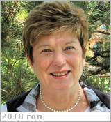

# Beauchamp, Patricia
> 2019.08.12 [🚀](../index/index.md) [despace](index.md) → [Contact](contact.md)

|*[Org.](contact.md)*|*[JPL](zz_jpl.md), US. Program manager*|
|:--|:--|
|B‑day, addr.|<mark>nodate</mark> 1958 / …|
|Contact|<patricia.m.beauchamp@nasa.gov>, <pbeaucha@jpl.nasa.gov>, *раб.:* <mark>noworkphone</mark>; *mobile:* +1(818)645-24-79|
|i18n|<mark>TBD</mark>|
| | <mark>nosign</mark> |

   - **[Education](edu.md):** PhD, Caltech, 1981.
   - **Exp.:** …
   - Патриция Бишоп.
   - **SC/Equip.:** …
   - **Conferences:** 2019 [VD Workshop 2019](vdws2019.md)
   - Git: …
   - Facebook: <https://www.facebook.com/patricia.m.beauchamp>
   - Instagram: <mark>noin</mark>
   - LinkedIn: <https://www.linkedin.com/in/patricia-beauchamp-83524a29>
   - Twitter: <mark>notw</mark>
   - <https://www.researchgate.net/profile/Patricia_Beauchamp>
   - <https://nai.nasa.gov/directory/beauchamp-patricia/>
   - <https://scholar.google.com/citations?:user=pRzZFfIAAAAJ&hl=en>
   - **As a person:**
      1. …
