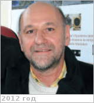

# Berger, Gilles
> 2019.07.16 **[🚀](../index/index.md) [despace](index.md)** → [Contact](contact.md)

|*[Org.](contact.md)*|*[IRAP](zz_irap.md), EU.*|
|:--|:--|
|i18n| <mark>TBD</mark> |
|Tel|*раб.:* <mark>noworkphone</mark>; *mobile:* +33(0)5-6133-2582 |
|E‑mail| <gilles.berger@irap.omp.eu> |
|B‑day, addr.| <mark>nodate</mark> / … |
||  <mark>nosign</mark> |

   - **[Education](edu.md):** …
   - **Exp.:** …
   - …
   - **SC/Equip.:** …
   - **Conferences:** 2019 [VD Workshop 2019](vdws2019.md)
   - Git: …
   - Facebook: <mark>nofb</mark>
   - Instagram: <mark>noin</mark>
   - LinkedIn: <mark>noli</mark>
   - Twitter: <mark>notw</mark>
   - <https://www.researchgate.net/scientific-contributions/2113239913_Gilles_Berger>
   - **As a person:**
      1. …
