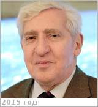

# Blamont, Jacques
> 2019.01.17 **[🚀](../index/index.md) [despace](index.md)** → [Contact](contact.md)

|*[Org.](contact.md)*|*[CNES](zz_cnes.md), FR.*|
|:--|:--|
|i18n| Бламон, Жак |
|Tel| *work:* <mark>noworkphone</mark>; *mobile:* <mark>nomobile</mark> |
|E‑mail| <mark>noemail</mark> |
|B‑day, addr.| 1926.10.13 Paris, FR / … |
||  <mark>nosign</mark>  |

   - **[Education](edu.md):** [CV](f/contact/b/blamont_001_cv.pdf)
   - **Exp.:** …
   - Jacques Emile Blamont is a French astrophysicist author and the founder scientific and technical director of National Centre for Space Studies (CNES-Centre national d'études spatiales), known to have contributed to the development of Veronique, the first rocket launched by France in 1957. He is an elected fellow of the French Academy of Technologies and a professor emeritus of the Pierre and Marie Curie University (University of Paris VI). Blamont is a recipient of several national honours such as Commander of the Legion of Honour, the third highest French civilian honour, Grand Officer of the National Order of Merit, the second highest French civilian honour, Commander of the Academic Palms, Grand Cross of the National Order of Merit, the highest French civilian honour, President’s Silver Medal, Soviet Order of Friendship of Peoples and Padma Shri, the fourth highest Indian civilian award.
   - **SC/Equip.:** 1986 [Venus Sample Return Mission](venus_sample_return_mission.md)
   - **Conferences:** …
   - Git: …
   - Facebook: <mark>nofb</mark>
   - Instagram: <mark>noin</mark>
   - LinkedIn: <mark>noli</mark>
   - Twitter: <mark>notw</mark>
   - <https://en.wikipedia.org/wiki/Jacques_Blamont>
   - **As a person:**
      1. …
