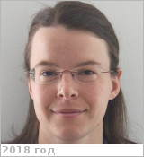

# Bovolo, Francesca
> 2019.10.13 [🚀](../index/index.md) [despace](index.md) → [Contact](contact.md)

|*[Org.](contact.md)*|*Fondazione Bruno Kessler (FBK-irst), IT. Unit head (since 2013)*|
|:--|:--|
|B‑day, addr.|<mark>nodate</mark> 1980  / …|
|Contact|<bovolo@fbk.eu>, *work:* <mark>noworkphone</mark>; *mobile:* <mark>nomobile</mark>|
|i18n|<mark>TBD</mark>|
| | <mark>nosign</mark> |

   - **[Education](edu.md):** PhD, Trento Univ., Italy, Information & Communication Techologies, 2006. MS, Trento Univ., Italy, Communication Engineering, 2003. BS (summa cum laude), Trento Univ., Italy, Communication Engineering, 2001.
   - **Exp.:** She is the founder & the head of the Remote Sensing for Digital Earth unit at Fondazione Bruno Kessler (FBK), Trento, Italy since July 2013. Her main research interests are in remote-sensing image processing, signal processing, & pattern recognition. Her interests are related to multitemporal image analysis, change detection in multispectral, hyperspectral, [SAR](sar.md) images, time series analysis, domain adaptation, LiDAR & radar sounder systems. She conducts research & on these topics within the context of several national & international projects. She is the author (or coauthor) of 47 scientific publications in referred international journals (more than 40 in IEEE journals), more than 90 papers in conference proceedings, & 8 book chapters. She is editor/co-editor of 2 conference proceedings & 2 journal special issue. She is a member of the program & scientific committee of several international conferences & workshops & a referee for several international journals.
   - …
   - **SC/Equip.:** … [EnVision](envision.md)
   - **Conferences:** …
   - Git: …
   - Facebook: <mark>nofb</mark>
   - Instagram: <mark>noin</mark>
   - LinkedIn: <https://www.linkedin.com/in/francesca-bovolo-857928a/>
   - Twitter: <mark>notw</mark>
   - <https://rslab.disi.unitn.it/people/#FrancescaBovolo>
   - <https://www.researchgate.net/profile/Francesca_Bovolo>
   - **As a person:**
      1. …
