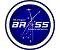

# BRASS
> 2019.08.14 [🚀](../index/index.md) [despace](index.md) → [Contact](contact.md)

||<info@br-aerospace.com>, +1(416)909-37-95, +1(437)223-22-55, Fax: …;  *BR Aerospace Solutions & Services, P.O Box 36088,  Northgate P.O., Brampton, Ontario, L6S 6A3, Canada*|
|:--|:--|
|Link|<https://www.br-aerospace.com/>|

**BR Aerospace Solutions & Services (BRASS)** is a global aerospace company principally engaged in the research, design, development, & sustainment of advanced technology systems in almost all areas of Aerospace sector viz. Robotics/UAV’s, satellite operations, space mission analysis, earth observation, climate change & so on. Founded in 2016 & Incorporated in 2018, headquartered in Ontario, Canada.  
*Our Vision:* To provide innovative engineering solutions to the most complex challenges, delivering effective solutions for the betterment of mankind.  
*Our Mission:* To contribute to advancement in research & development, innovation, & scientific discovery globally in the field of Aerospace for delivering effective solutions.

 

BRASS is organized to work around 6 business areas starting from ergonomics, design & size of Space Robotics & unmanned Aerial Vehicles for commercial & defense purposes, satellite operations & communication, space mission analysis & design, applications & data analysis for earth observation, research & solutions for climate change & research & development of advanced systems. What we do is:

   - Fill gap with demonstrated analysis (through partners, connections, direct expertise, operations area… etc for immediate solutions/consultancy.
   - Identify the operational gaps & serve as the link between institutions, academia, government & industry.
   - Our innovative solutions, derived by our diversified & vibrant team, improve efficiency & operational effectiveness (by reducing risk & increasing reliability of the services).
   - Provide technical consultancy & offer training’s, business support & project management, courses (with institutional partnership).
   - Solve technical problems by addressing the gaps through testing, integration, validation & operations.

Our experience & knowledge span all facets of aerospace industry, including initiating new projects from designing, testing, analysis, development, to successful operations; & also managing the application of new technologies for existing & next-generation aerospace systems.

Focussed Work:

   - Agriculture/Soil Monitoring using Space Technology
   - Capacity Building & Policy Issues
   - Earth Observation through UAV’s
   - Education Empowerment
   - Glacier Monitoring (Climate Change)
   - Hypersonic Re-entry Mechanics
   - Innovative Propulsion Techniques
   - Satellite Imagery & data Analysis
   - Space Debris (Removal, mitigation & control)
